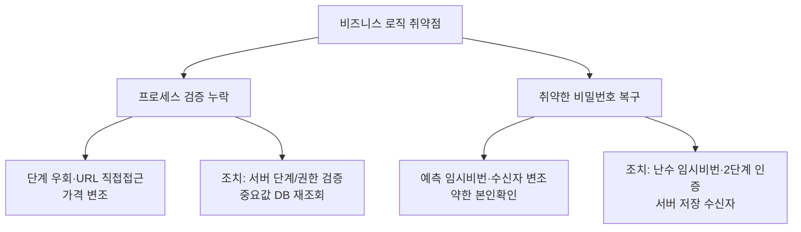

## 들어가며 — 코드는 멀쩡한데 "흐름"이 뚫린다

지금까지의 취약점은 대부분 **입력값**(SQL·스크립트·경로)이 문제였습니다. **비즈니스 로직 취약점**은 다릅니다. 문법적으로는 정상인 요청이지만, **애플리케이션이 의도한 절차·규칙을 우회**해서 발생합니다. 자동 스캐너로 거의 잡히지 않아 **수동 점검의 핵심**입니다.

이 글의 KISA 점검 항목 두 가지입니다.

| 항목 | KISA 코드 | 한 줄 |
|---|---|---|
| 프로세스 검증 누락 | PV | 단계 생략·URL 직접 접근·가격 변조 등 흐름 우회 |
| 취약한 비밀번호 복구 절차 | PR | 예측 가능한 임시 비밀번호·약한 본인확인 |

> 두 항목 모두 **서버가 "사용자가 올바른 순서·권한으로 왔는가"를 검증하지 않는 것**이 원인입니다. 방어는 **서버 사이드에서 모든 단계·권한·값을 재검증**하는 것입니다.
{: .prompt-info }

---

## 실습 환경

| 구분 | 내용 |
|---|---|
| 공격자 | Kali Linux (192.168.0.10) — 브라우저, Burp Suite, curl |
| 대상 | Ubuntu + Apache/PHP (192.168.0.30) |

---

## OWASP Top 10 매핑

| 항목 | 내용 |
|---|---|
| OWASP 카테고리 | **A01 Broken Access Control**(흐름·권한 우회) · **A04 Insecure Design**(설계 결함) · 복구는 **A07 Authentication Failures** |
| CWE | CWE-841(잘못된 동작 순서) · CWE-639(권한 우회) · CWE-640(취약한 비밀번호 복구) |
| 영향 | 결제 금액 변조, 인증 없이 관리 기능 사용, 타인 계정 탈취 |
| 한 줄 핵심 | 클라이언트가 보낸 값/순서를 **신뢰**하고 서버가 재검증하지 않음 |

> 비즈니스 로직 결함은 **클라이언트 측 검증(JS)에 의존**할 때 흔합니다. 브라우저를 거치지 않는 Burp·curl 요청 한 번이면 우회됩니다. [07 IDOR](/posts/websec-07-idor/)의 "서버 사이드 권한 검증" 원칙과 한 가족입니다.
{: .prompt-tip }

---

## 1. 프로세스 검증 누락

### 1.1 원리

전형적인 두 패턴입니다.

1. **단계/권한 우회**: 로그인·이전 단계를 거치지 않고 **URL을 직접 입력**해 내부 페이지에 접근
2. **가격/수량 변조**: 결제 요청의 `price`·`qty` 값을 **클라이언트에서 변조**했는데 서버가 그대로 신뢰

### 1.2 실습 환경 구성

(1) 비로그인 직접 접근이 되는 관리 페이지(`/var/www/html/userManage/userInfo.php`):

```php
<?php
// [의도적 취약] 세션/권한 검증 없이 민감 페이지 노출
echo "<h2>사용자 정보 관리</h2><p>admin / alice / bob ...</p>";
?>
```

(2) 가격을 클라이언트 값으로 신뢰하는 결제(`/var/www/html/buy.php`):

```php
<?php
// [의도적 취약] 전송된 price 를 그대로 신뢰
$id = $_POST['id'] ?? '';
$price = (int)($_POST['price'] ?? 0);
echo "주문 완료: 상품 $id, 결제금액 {$price}원";
?>
```

### 1.3 점검 (KISA Step 1)

```bash
# (1) 비로그인 상태로 내부 관리 페이지 직접 접근 → 노출되면 취약
curl -s http://192.168.0.30/userManage/userInfo.php

# (2) 가격 변조 — 정가 30,000원 상품을 100원으로
curl -s -X POST http://192.168.0.30/buy.php -d "id=0012345&price=100"
# → "결제금액 100원" 이 처리되면 취약
```

Burp Suite에서는 정상 구매 요청을 가로채 `price=30000` → `price=100`으로 바꿔 Forward 하면 동일하게 재현됩니다.

| 판단 | 기준 |
|---|---|
| 양호 | 단계 생략·URL 직접 접근·값 변조 시 서버가 거부 |
| 취약 | 검증 미흡으로 흐름 우회·변조 값이 처리됨 |

### 1.4 조치

1. 비즈니스 흐름의 **중간 단계 생략/우회 불가**하도록 단계별 진행을 서버에서 검증
2. 인증 필요한 페이지에 **세션/권한 검증** 추가
3. 가격·수량 등 중요 값은 **서버 DB에서 다시 조회**(클라이언트 값 불신)

```php
// (1) 단계 검증 — step1 통과 안 했으면 되돌림
session_start();
if (empty($_SESSION['step1_done'])) { header('Location: step1.php'); exit; }

// (2) 권한 검증
if (($_SESSION['role'] ?? '') !== 'admin') { http_response_code(403); exit('권한 없음'); }

// (3) 가격은 서버에서 재조회 (클라이언트 price 무시)
$price = get_price_from_db($_POST['id']);   // 전송된 price 사용 안 함
```

---

## 2. 취약한 비밀번호 복구 절차

### 2.1 원리

비밀번호 찾기/재설정에서 세 가지가 자주 취약합니다.

- **약한 본인확인**: "이름은?" 같이 추측·소셜엔지니어링이 쉬운 질문
- **예측 가능한 임시 비밀번호**: `USER+사번`처럼 규칙적으로 발급되어 화면에 바로 표시
- **수신자 변조**: 임시 비밀번호/인증번호를 받을 **이메일·전화번호를 공격자 것으로 변조**

### 2.2 실습 환경 구성

취약한 재설정(`/var/www/html/reset.php`):

```php
<?php
// [의도적 취약] 임시 비밀번호가 계정명 기반(예측 가능) + 화면 출력 + 수신자 변조 허용
$user  = $_POST['user']  ?? '';
$email = $_POST['email'] ?? '';   // 공격자가 임의 변조 가능
$temp  = strtoupper($user) . (strlen($user));   // 예: alice → ALICE5
echo "임시 비밀번호 [$temp] 를 $email 으로 전송했습니다.";   // 화면에 노출
?>
```

### 2.3 점검 (KISA Step 1~3)

```bash
# Step 1) 약한 보안질문/단순 정보로 복구되는지 (육안 점검)
# Step 2) 임시 비밀번호가 예측 가능한 패턴인지
curl -s -X POST http://192.168.0.30/reset.php -d "user=alice&email=alice@lab.local"
# → "임시 비밀번호 [ALICE5]" 처럼 규칙적이면 취약

# Step 3) 수신자(email) 변조로 공격자에게 전송되는지
curl -s -X POST http://192.168.0.30/reset.php -d "user=admin&email=attacker@evil.com"
# → admin 계정의 임시 비번이 공격자 메일로 가면 취약
```

### 2.4 조치

1. 추측·공개로 알 수 없는 정보 기반 본인확인, **메일/SMS 2단계 인증**
2. 임시 비밀번호는 **암호학적 난수**로 생성하고 **화면에 출력하지 않고** 등록된 메일/SMS로만 전송
3. 수신자는 **서버에 저장된 값**만 사용(요청 파라미터의 email/phone 불신), 검증 실패 임계값 설정 + 발급 후 즉시 재설정 강제

```php
// 안전: 난수 임시 비번 + 서버 저장 수신자 + 해시 저장 + 화면 미노출
$temp = bin2hex(random_bytes(6));                 // 예측 불가
$email = get_email_from_db($user);                // 클라이언트 email 무시
save_password_hash($user, password_hash($temp, PASSWORD_DEFAULT));
sendPasswordEmail($email, $temp);                 // 화면 출력 없이 메일로만
echo "등록된 이메일로 임시 비밀번호를 보냈습니다.";   // 값은 노출하지 않음
```

| 언어 | 안전한 난수 |
|---|---|
| PHP 7+ | `random_int()` / `random_bytes()` |
| Java | `java.security.SecureRandom` |
| ASP.NET | `RandomNumberGenerator`(구 `RNGCryptoServiceProvider`) |

---

## 3. 정리



핵심은 하나입니다 — **클라이언트가 보낸 값·순서·권한을 절대 신뢰하지 말고 서버에서 다시 검증**할 것.

---

## 4. 정보보안기사 시험 포인트

| 항목 | 꼭 외울 것 |
|---|---|
| **프로세스 검증** | 가격/수량은 **서버에서 재조회**, 단계·권한은 세션으로 서버 검증 |
| **클라이언트 검증의 한계** | JS 검증은 우회됨 → **서버 사이드 검증 필수** |
| **비밀번호 복구** | 임시 비번은 **난수 + 메일/SMS 전송**, 화면 출력 금지 |
| **수신자 변조** | email/phone은 요청값이 아니라 **DB 저장값** 사용 |

> **★ 함정**: 비즈니스 로직 취약점은 **자동 스캐너로 탐지가 어렵다**는 점이 자주 출제됩니다. 수동 점검(흐름 분석)이 핵심입니다.
{: .prompt-tip }

---

## 출처 및 참고 자료

- KISA, 「주요정보통신기반시설 기술적 취약점 분석·평가 방법 상세가이드」 — Web Application(웹) > 프로세스 검증 누락·취약한 비밀번호 복구 절차
- OWASP — Business Logic Vulnerability / Forgot Password Cheat Sheet — <https://cheatsheetseries.owasp.org/cheatsheets/Forgot_Password_Cheat_Sheet.html>

> **⚠ 합법성**: 모든 실습은 본인 소유의 격리된 랩에서만 수행합니다.
{: .prompt-danger }
