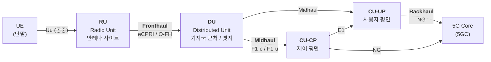

# O-RAN 기반 6G AI-RAN 아키텍처 진화

## 들어가며 — 왜 기지국을 쪼개는가

O-RAN(Open Radio Access Network)[^a-o-ran] 보안을 이해하려면 **기지국이 왜, 어떻게 쪼개졌는지**를 먼저 알아야 합니다. 인터페이스가 곧 공격 표면이고, 인터페이스는 "쪼갠 자리"에 생기기 때문입니다.

이 장은 두 부분으로 구성됩니다.

- **1~4절**: RU(Radio Unit)[^a-ru]·DU(Distributed Unit)[^a-du]·CU(Central Unit)[^a-cu]가 정확히 무엇이고, 무엇을 기준으로 나뉘며, 각 조각이 어떤 프로토콜 계층을 담당하는가 (개념 상세)
- **5~7절**: 그 위에 얹힌 RIC(RAN Intelligent Controller)[^a-ric]와 SMO(Service Management and Orchestration)[^a-smo], 그리고 O-RAN이 AI-RAN(AI Radio Access Network)[^a-ai-ran]으로 확장되는 구조
- **3.3절**: **표준(O-RAN WG11[^a-wg] SecReq / ETSI[^a-etsi] TS[^a-ts] 104 104)이 각 인터페이스에 규정한 보호 수단** — mTLS[^a-mtls]·TLS[^a-tls]·802.1X·MACsec[^a-macsec]

---

## 1. 기지국(BS)의 원형 — 다섯 개의 기능 블록

Soltani 등[^r6]의 정리에 따르면, 2G GSM(Global System for Mobile Communications)[^a-gsm] 시대의 기지국(BTS, Base Transceiver Station)[^a-bts]은 다섯 개의 핵심 구성요소로 이루어졌습니다. **오늘날 RU/DU/CU는 이 다섯 개를 다시 묶는 방식의 차이일 뿐입니다.**

| # | 구성요소 | 역할 |
|---|---|---|
| 1 | **안테나(Antenna)** | 가장 눈에 보이는 부분. 특정 영역(= **셀**)을 커버 |
| 2 | **RF[^a-rf] 모듈** | 공중 인터페이스로 신호를 송수신하고, **아날로그 무선신호 ↔ 디지털 데이터** 변환 |
| 3 | **디지털 유닛 = BBU**(BaseBand Unit)[^a-bbu] | 인코딩된 신호를 처리해 코어망으로 보내거나 받음 (**베이스밴드 처리**) |
| 4 | **전송 유닛(Transmission unit)** | 코어망과의 물리적 연결(백홀) |
| 5 | **제어 유닛(Control unit)** | 위 기능들 간의 조율 |

2G에서는 **RF와 BBU가 타워 기단 한 곳에 함께 있었습니다**(중앙집중형 BS[^a-bs]). 그래서 RF 유닛과 안테나를 동축 구리(RF) 케이블로 연결했습니다 — 이 케이블이 비싸고 길이가 길면 손실이 커지는 것이 이후 모든 분해(disaggregation)의 출발점입니다.

![2G에서 5G까지의 기지국 분해 (출처: Soltani 등[^r6], Fig. 2)](/assets/img/posts/6g-ai-ran/intctrl-fig2.png)
_그림 2-1. 기지국 분해의 3단계. **(a)** 2G 중앙집중 BS(RF+BBU 일체, 백홀만 존재) → **(b)** 3G/4G RRH-BBU 분리(**프론트홀** 신설, CPRI) → **(c)** 5G RU-DU-CU 분할(**프론트홀 + 미드홀 + 백홀**, eCPRI). 출처: [^r6], Fig. 2._

### 1.1 2G → 4G: 왜 RRH가 분리되었나

| 세대 | RAN 이름 | 기지국 | 중앙 제어기 | 인터페이스 | 핵심 변화 |
|---|---|---|---|---|---|
| 2G (GSM/EDGE[^a-edge]) | **GERAN**[^a-geran] (BSS[^a-bss]) | BTS | **BSC** (Base Station Controller)[^a-bsc] | Um(공중), Abis(BTS↔BSC), A(CS[^a-cs] 코어), Gb(PS[^a-ps] 코어) | RF+BBU 일체형 |
| 3G (UMTS[^a-umts]) | **UTRAN**[^a-utran] (RNS[^a-rns]) | **NodeB** | **RNC** (Radio Network Controller)[^a-rnc] | Uu, Iub(NB↔RNC), Iu-CS/Iu-PS | **RF 모듈을 안테나 근처로 이동 = RRH[^a-rrh]/RRU[^a-rru]**, BBU는 코어 쪽 인터페이스. **프론트홀** 등장(CPRI[^a-cpri]/OBSAI[^a-obsai]/ORI[^a-ori]) |
| 4G (LTE[^a-lte]) | **E-UTRAN**[^a-eutran] | **eNodeB (eNB)**[^a-enb] | (없음 — RNC 기능이 eNB로 통합) | Uu, **S1**(S1-UP/S1-CP), X2(eNB 간) | 중앙 제어기 제거, 사용자 경로 지연 개선, 관리 분산 |

![2G에서 4G까지의 레거시 RAN (출처: Soltani 등[^r6], Fig. 3)](/assets/img/posts/6g-ai-ran/intctrl-fig3.png)
_그림 2-2. 레거시 RAN의 세대별 구조. 2G BSC → 3G RNC → 4G에서는 중앙 제어기가 사라지고 eNB가 기능을 흡수합니다. 출처: [^r6], Fig. 3._

> **3G의 핵심 통찰**: RF 모듈을 안테나 옆으로 올려 **동축케이블 길이를 최소화**했습니다(RRH/RRU). 대신 RRH와 BBU 사이에 새로운 네트워크 구간 — **프론트홀** — 이 생겼고, 여기에 CPRI 같은 프로토콜이 필요해졌습니다. **문제를 옮긴 것이 아니라 문제의 성격을 바꾼 것**입니다: 케이블 비용 문제 → 프론트홀 대역폭 문제.
{: .prompt-tip }

### 1.2 C-RAN — BBU를 한곳에 모으다

4G 후반에 도입된 **C-RAN**(Cloud/Centralized RAN)[^a-c-ran]은 여러 기지국의 BBU를 하나의 전산실에 모아 **BBU 풀**을 만듭니다[^r6].

| 항목 | 내용 |
|---|---|
| 얻는 것 | 처리 자원 공유(수백~수천 BBU), 하드웨어 비용·복잡도 절감, 용량·효율 향상, 사업자 간 자원 협력 가능 |
| 셀 사이트에 남는 것 | 안테나 + 소수의 능동 RF 부품(RRU/RRH) |
| 잃는 것 | **프론트홀 비트레이트 폭증** — 트래픽이 늘수록 경제적으로 감당 불가 |

이 "프론트홀 비트레이트" 문제가 5G에서 **기능 분할(functional split)** 을 낳습니다.

---

## 2. 5G NG-RAN: RU / DU / CU — 정확히 무엇을 하는가

5G(NR[^a-nr])에서 기지국은 **gNB**(next generation NodeB)[^a-gnb]라 불리고, 세 조각으로 나뉩니다[^r6].

### 2.1 세 유닛의 역할 정의

| 유닛 | 정식 명칭 | 물리적 위치 | 담당 기능 | 지연 요구 |
|---|---|---|---|---|
| **RU** (O-RAN: **O-RU**) | Radio Unit | 안테나 마스트 / 셀 사이트 | RF 처리 + Low-PHY[^a-phy]. **무선신호 ↔ 디지털신호 변환**[^r5] | 가장 엄격 (μs 급 동기) |
| **DU** (O-RAN: **O-DU**) | Distributed Unit | 사이트 인근 또는 엣지 데이터센터 | **베이스밴드 처리** — High-PHY, MAC[^a-mac], RLC[^a-rlc][^r5]. RU 관리, 대역폭 할당 조절[^r6] | 엄격 (수백 μs ~ ms) |
| **CU** (O-RAN: **O-CU**) | Central Unit | 중앙 데이터센터 (CU 풀) | PDCP[^a-pdcp], RRC[^a-rrc]. 여러 DU의 **중앙 오케스트레이터**[^r6] | 완화 (ms ~ 수십 ms) |
| ↳ **CU-CP**[^a-cu-cp] | CU Control Plane | 동일 | **RRC + PDCP-C** — 제어 시그널링 관리 | — |
| ↳ **CU-UP**[^a-cu-up] | CU User Plane | 동일 | **SDAP[^a-sdap] + PDCP-U** — 데이터 전송 처리 | — |

> CU-CP와 CU-UP는 **E1 인터페이스**로 통신합니다[^r6]. 이 E1이 뚫리면 어떤 일이 벌어지는지는 Ch5의 **Bearer Migration Poisoning** 공격에서 다룹니다.
{: .prompt-warning }

### 2.2 gNB 프로토콜 스택과 8개 기능 분할 옵션

이것이 RU/DU/CU를 이해하는 **핵심 그림**입니다. 3GPP(3rd Generation Partnership Project)[^a-3gpp]는 gNB의 기능 체인을 어디서 자를지에 대해 **8개 옵션**을 정의했습니다[^r6].

![gNB 프로토콜 스택과 기능 분할 옵션 (출처: Soltani 등[^r6], Fig. 4)](/assets/img/posts/6g-ai-ran/intctrl-fig4.png)
_그림 2-3. **BS 프로토콜 스택과 기능 분할 지점(1~8)**. 아래(8번, RF 쪽)로 갈수록 **프론트홀 대역폭 요구가 커지고**, 위(1번, RRC 쪽)로 갈수록 **지연이 커집니다**. O-RAN은 RU-DU 사이에 **Option 7-2x(eCPRI)**, 3GPP는 DU-CU 사이에 **Option 2(F1)** 를 채택했습니다. 출처: [^r6], Fig. 4._

프로토콜 계층을 아래에서 위로 정리하면:

| 계층 | 서브계층 | 하는 일 |
|---|---|---|
| **L1 물리계층(PHY)** | RF | 아날로그 무선 송수신 |
| | Low-PHY | FFT[^a-fft]/iFFT, CP[^a-cp] 삽입·제거, 빔포밍 일부 |
| | High-PHY | 채널 코딩/디코딩, 변조/복조, 레이어 매핑 |
| **L2 데이터링크** | MAC (Low/High) | 스케줄링, HARQ[^a-harq], 다중화 |
| | RLC (Low/High) | PDU[^a-pdu] 크기 조정(MAC 요구에 맞춤), ACK/재전송, 오류 정정[^r6] |
| | PDCP | **헤더 압축, 암호화(ciphering), 핸드오버 처리**[^r6] |
| **L3 네트워크** | RRC (제어 평면) | 시스템 정보 관리, 연결 제어, 측정 설정, 모빌리티[^r6] |
| | IP[^a-ip] / SDAP (사용자 평면) | QoS[^a-qos] 플로우 ↔ DRB[^a-drb] 매핑, IP 전달 |

8개 분할 옵션을 표로 정리하면:

| 옵션 | 자르는 지점 | 특징 | 실제 채택 |
|---|---|---|---|
| **1** | RRC / PDCP | CU에 RRC만 | — |
| **2** | **PDCP / RLC** | CU = RRC+PDCP, DU = RLC+MAC+PHY. 대역폭·지연 균형 우수 | ★ **3GPP F1 인터페이스**의 표준 분할[^r6] |
| 3 | High-RLC / Low-RLC | — | — |
| 4 | RLC / MAC | — | — |
| 5 | High-MAC / Low-MAC | — | — |
| 6 | MAC / PHY | — | 일부 소규모 구축 |
| **7 (7-2x)** | **High-PHY / Low-PHY** | 프론트홀 대역폭을 CPRI보다 크게 절감 | ★ **O-RAN Open Fronthaul (eCPRI[^a-ecpri])** 의 분할[^r5] |
| **8** | PHY / RF | 전통 CPRI. **프론트홀 대역폭 최대, 지연 최소** | 레거시 C-RAN |

> **분할의 트레이드오프 (반드시 기억)**
> - DU에 기능을 **많이** 두면 → 프론트홀 전송 전에 처리가 많이 끝나므로 **프론트홀 대역폭 요구가 줄어듦**. 그러나 DU의 처리능력은 CU 풀보다 약하므로 **지연이 늘 수 있음**[^r6].
> - DU에 기능을 **적게** 두면(RF만) → 중앙 집중의 이득은 크지만 **프론트홀 대역폭이 폭증**.
> - **Option 2 + Option 7-2x 조합**이 현재 O-RAN의 실질 표준입니다. CU-DU는 F1(미드홀), DU-RU는 eCPRI(프론트홀).
{: .prompt-tip }

### 2.3 프론트홀 / 미드홀 / 백홀 구분

| 구간 | 연결 | 인터페이스 | 특징 |
|---|---|---|---|
| **프론트홀(Fronthaul)** | RU ↔ DU | **O-FH**(Open Fronthaul)[^a-o-fh] (eCPRI, Option 7-2x) | 가장 지연·동기에 민감. 대역폭 요구 큼 |
| **미드홀(Midhaul)** | DU ↔ CU | **F1** (F1-c: CU-CP↔DU, F1-u: CU-UP↔DU) | 보통 Ethernet/IP. 지연 요구 완화 |
| **백홀(Backhaul)** | CU ↔ 5GC[^a-5gc] | **NG** | 3GPP 표준 인터페이스 |

> 프론트홀은 **무결성 보호가 가장 취약한 구간**으로 지속 지적되어 왔습니다. 또한 DU가 CU에 LLDP(Link Layer Discovery Protocol)[^a-lldp] 정보를 미드홀(보통 Ethernet)로 공유하는 구조[^r6]가 Ch5의 토폴로지 위조 공격의 전제가 됩니다.
{: .prompt-danger }

---

## 3. O-RAN 아키텍처 — 전체 구성요소와 인터페이스

여기까지가 3GPP NG-RAN(Next Generation RAN)[^a-ng-ran]입니다. **O-RAN Alliance**(2018년 8월 설립)는 여기에 **개방 인터페이스, 지능형 컨트롤러(RIC), 클라우드 플랫폼(O-Cloud)** 을 추가합니다[^r6].

![O-RAN 상위 아키텍처 (출처: Benzaïd 등[^r5], Fig. 2)](/assets/img/posts/6g-ai-ran/aisurvey-fig2.png)
_그림 2-4. O-RAN 상위 아키텍처. SMO(Non-RT RIC + rApps), Near-RT RIC(xApps), O-CU-CP/O-CU-UP/O-DU/O-RU, O-Cloud(IMS/DMS), 그리고 A1·E2·O1·O2·F1·E1·O-FH·Y1·NG 인터페이스. 출처: [^r5], Fig. 2._

### 3.1 구성요소

| 구성요소 | 역할 |
|---|---|
| **O-RU / O-DU / O-CU-CP / O-CU-UP** | 위 2절의 분해된 기지국 기능. 3GPP 7.2x 분할 채택[^r5] |
| **SMO** (Service Management and Orchestration) | O-RAN 도메인의 서비스·자원 관리·오케스트레이션 총괄[^r5] |
| **Non-RT RIC** | SMO 내부. 1초 이상 시간 척도의 정책·모델 관리. **rApps** 호스팅 |
| **Near-RT RIC** | 10ms~1초 시간 척도의 지연 민감 제어. **xApps** 호스팅 |
| **O-Cloud** | O-DU/O-CU/Near-RT RIC 등 가상화 기능이 동작하는 클라우드 플랫폼. **IMS**(Infrastructure Mgmt Services)[^a-ims] + **DMS**(Deployment Mgmt Services)[^a-dms] 제공[^r5] |
| **FOCOM[^a-focom] / NFO[^a-nfo]** | SMO 내 오케스트레이션 기능 — Federated O-Cloud Orchestration and Management / Network Function Orchestration[^r5] |
| **dApp** | O-DU/O-CU 내부에 배치되어 **실시간(10ms 미만)** 제어를 수행하는 확장 개념[^r2], [^r11] |

### 3.2 인터페이스 — 곧 공격 표면 목록

| 인터페이스 | 연결 | 용도 | 보안 관심사 |
|---|---|---|---|
| **O-FH** | O-RU ↔ O-DU | 프론트홀 사용자·제어·동기 데이터 | 무결성 보호 취약, S-Plane(동기) 공격 |
| **O-FH M-Plane** | SMO ↔ O-RU | O-RU 관리 | 관리 평면 인증 |
| **F1** | O-DU ↔ O-CU | 미드홀 (F1-c/F1-u) | 베어러 조작 |
| **E1** | O-CU-CP ↔ O-CU-UP | CP/UP 조율 | **베어러 컨텍스트 마이그레이션 poisoning** (Ch5) |
| **E2** | Near-RT RIC ↔ E2 노드(O-DU, O-CU-CP, O-CU-UP) | 제어·구독·KPM[^a-kpm] 보고. AI[^a-ai]/ML[^a-ml] 데이터 파이프라이닝·학습·성능 모니터링 지원[^r6] | xApp이 무선자원을 직접 제어하는 통로 |
| **A1** | Non-RT RIC ↔ Near-RT RIC | **정책 관리 + Enrichment Information + ML 모델 관리**[^r6] | 정책 위조 = 광범위 제어 오작동 |
| **O1** | SMO ↔ O-RAN 관리 요소 | FCAPS[^a-fcaps] 관리·설정 | 대량 오설정 유발 |
| **O2** | SMO ↔ O-Cloud | 인프라 관리·워크로드 배포 | 컨테이너 배포 권한 탈취 |
| **Y1** | Near-RT RIC → 인증된 소비자 | RAN 분석 데이터 구독·소비[^r5] | 데이터 유출 경로 |
| **R1** | Non-RT RIC 프레임워크 ↔ rApp | rApp에 서비스 노출 | rApp 권한 상승 |

> **A1 정책의 특징**: A1 정책은 **일시적(temporal)** 이고 트래픽에 치명적이지 않지만 **설정값보다 우선순위가 높습니다**. 또한 **비영속적(non-persistent)** 이라 Near-RT RIC 재시작 후에는 남지 않습니다[^r6]. 즉 정책 주입 공격은 재시작으로 지워지지만, 반대로 **정상 정책도 재시작으로 사라지므로 가용성 공격과 결합될 수 있습니다.**
{: .prompt-info }

### 3.3 표준이 규정한 인터페이스 보안 — O-RAN WG11 SecReq

위 인터페이스 표는 "어디가 위험한가"입니다. **표준은 각 인터페이스를 무엇으로 보호하라고 규정하는가** — O-RAN WG11 *Security Requirements and Controls Specifications*[^wg11secreq](= **ETSI TS 104 104**[^etsisecreq])가 이를 정합니다.

| 구간 | 규정된 보호 수단 | 그림 |
|---|---|---|
| **SMO 내부 통신 (SMOS[^a-smos])** | **mTLS 또는 TLS** | 그림 2-5 |
| **SMO 외부 인터페이스** | **mTLS** (외부 소비자·생산자와) | 그림 2-6 |
| SMO/Non-RT RIC의 Kafka 기반 프로토콜 | **TLS** | — |
| **A1** | **mTLS** | 그림 2-7 |
| **R1** (Non-RT RIC ↔ rApp) | **mTLS** | 그림 2-8 |
| **O2** | O2 인터페이스 보안 절차 | — |
| **Open Fronthaul (O-RU ↔ O-DU)** | **802.1X 포트 기반 인증** + **종단간 MACsec** | 그림 2-9, 2-10 |
| **xApp 등록** | 보안 등록 절차 (Ch7 §5.1에서 상세) | Ch7 |

![mTLS or TLS for SMO Internal Communications (출처: ETSI TS 104 104[^etsisecreq], Fig. 5.1.1.2.2-1)](/assets/img/posts/6g-ai-ran/etsisecreq-fig5.png)
_그림 2-5. **SMO 내부 통신의 mTLS/TLS**. Ch2 §5.2의 AI-SMO가 SMOS 버스로 마이크로서비스를 연결하므로, **AI-RAN Orchestrator를 추가하면 이 요구가 그대로 확장 적용**됩니다. 출처: [^etsisecreq], Fig. 5.1.1.2.2-1._

![mTLS on SMO External interfaces (출처: ETSI TS 104 104[^etsisecreq], Fig. 5.1.1.2.3-1)](/assets/img/posts/6g-ai-ran/etsisecreq-fig5-p21.png)
_그림 2-6. **SMO 외부 인터페이스의 mTLS**. Ch2 §5.2에서 본 **AI 개발자용 노스바운드 API**가 바로 이 "외부 인터페이스"에 해당합니다. 출처: [^etsisecreq], Fig. 5.1.1.2.3-1._

![mTLS on A1 interface (출처: ETSI TS 104 104[^etsisecreq], Fig. 5.2.1.2-1)](/assets/img/posts/6g-ai-ran/etsisecreq-fig5-p40.png)
_그림 2-7. **A1 인터페이스의 mTLS**. 다만 Ch7 §5.5에서 보듯 **mTLS로 채널을 보호해도 정책 내용의 안전성은 별개**입니다. 출처: [^etsisecreq], Fig. 5.2.1.2-1._

![mTLS on R1 interface (출처: ETSI TS 104 104[^etsisecreq], Fig. 5.2.6.2-1)](/assets/img/posts/6g-ai-ran/etsisecreq-fig5-p50.png)
_그림 2-8. **R1 인터페이스의 mTLS** — Non-RT RIC 프레임워크와 rApp 사이. 출처: [^etsisecreq], Fig. 5.2.6.2-1._

#### 프론트홀 보안 — 802.1X + MACsec

프론트홀(O-FH)은 Ch2 §2.3에서 **"무결성 보호가 가장 취약한 구간"** 이라고 했습니다. 표준의 대응은 **계층 2 보안**입니다.

![Operation of 802.1X Port Based Authentication in the O-RAN Fronthaul architecture (출처: ETSI TS 104 104[^etsisecreq], Fig. 5.2.5.5.2.2-2)](/assets/img/posts/6g-ai-ran/etsisecreq-fig5-p49.png)
_그림 2-9. **O-RAN 프론트홀의 802.1X 포트 기반 인증 동작**. 스위치드 프론트홀에서 **O-RU가 정당한 장비임을 포트 단위로 인증**합니다 — Ch3 §7.2에서 경고한 **"rogue O-RU 도입"** 에 대한 표준적 대응입니다. 출처: [^etsisecreq], Fig. 5.2.5.5.2.2-2._

![End-to-End MACsec solution for Fronthaul security protection (출처: O-RAN WG11 SecReq[^wg11secreq], Fig. 5.2.5.6.2-1)](/assets/img/posts/6g-ai-ran/wg11secreq-fig5-p59.png)
_그림 2-10. **프론트홀 보호를 위한 종단간 MACsec**. O-RU와 O-DU가 **스위치드 프론트홀 네트워크로 연결된 시나리오**에서 계층 2 암호화·무결성을 제공합니다. 출처: [^wg11secreq], Fig. 5.2.5.6.2-1._

> **왜 프론트홀에는 mTLS가 아니라 MACsec인가**: Ch7 §1.6에서 하이브리드 ZT(Zero Trust)[^a-zt] 모델의 **연결당 1~10 ms 오버헤드**가 dApp 실시간 루프에 쓸 수 없다고 했습니다. 프론트홀은 그보다 훨씬 엄격한 μs급 동기 요구를 가지므로, **애플리케이션 계층(mTLS)이 아니라 계층 2 하드웨어 가속 보안(MACsec)** 이 유일한 현실적 선택입니다. **보안 수단은 시간 예산이 결정합니다.**
{: .prompt-tip }

#### AI/ML 특화 요구 — 모델 분할 추론

표준이 이미 **AI/ML 모델의 분산 배치**를 다루기 시작했다는 점이 주목할 만합니다.

![EXAMPLE of a deep neural network AI/ML model split across five inference hosts (출처: O-RAN WG11 SecReq[^wg11secreq], Fig. 5.3.12.2-1)](/assets/img/posts/6g-ai-ran/wg11secreq-fig5-p85.png)
_그림 2-11. **심층 신경망 AI/ML 모델이 5개 추론 호스트에 분할된 예**. Ch3 §3의 **model splitting** 배포 옵션이 규격 수준에서 논의되고 있음을 보여주며, Ch12 §4.1의 **체인 모델 연쇄 효과** 문제와 직결됩니다. 출처: [^wg11secreq], Fig. 5.3.12.2-1._

![소프트웨어 정의 개방형 RAN을 향한 RAN 진화 (출처: Soltani 등[^r6], Fig. 5)](/assets/img/posts/6g-ai-ran/intctrl-fig5.png)
_그림 2-12. 레거시 RAN → 4G C-RAN(vRAN) → 4G SD-RAN → 5G NG-RAN → 5G beyond O-RAN. 각 단계에서 인터페이스(CPRI → eCPRI, 백홀 → 미드홀)와 제어기(SD-RAN 컨트롤러 → RIC)가 어떻게 바뀌는지 비교할 수 있습니다. 출처: [^r6], Fig. 5._

---

## 4. Near-RT RIC 내부 구조

RIC는 O-RAN 지능화의 심장이고, **SDN(Software-Defined Networking)[^a-sdn] 컨트롤러의 차세대**로 이해하는 것이 정확합니다[^r6]. 이 관점이 중요한 이유는 **RIC가 SDN 컨트롤러의 취약점을 상속**하기 때문입니다(Ch5).

![Near-RT RIC 참조 아키텍처 (출처: Soltani 등[^r6], Fig. 6)](/assets/img/posts/6g-ai-ran/intctrl-fig6.png)
_그림 2-13. Near-RT RIC 참조 아키텍처. A1/E2/O1 종단 기능, AI/ML 기능, 자원 할당 기능, 보안 기능, 충돌 완화(Conflict Mitigation), 구독 관리, R-NIB/UE-NIB 데이터베이스와 그 위의 SDL(Shared Data Layer), API Enablement. 출처: [^r6], Fig. 6._

### 4.1 내부 기능 블록

| 블록 | 역할 | 보안 관심사 |
|---|---|---|
| **A1 / E2 / O1 종단(termination)** | 각 인터페이스 프로토콜 종단 | 인터페이스별 인증·암호화 |
| **AI/ML 기능** | 모델 데이터 파이프라이닝, 학습, 성능 모니터링 | 모델 오염 진입점 |
| **자원 할당 기능** | 무선자원 관리 결정 | 잘못된 결정 = 서비스 장애 |
| **보안 기능(Security Functions)** | xApp에 필요한 보안 조치 제공 | 이 블록 자체의 하드닝 수준이 관건 |
| **충돌 완화(Conflict Mitigation)** | **다수 xApp의 동시·상충 요청 해소**[^r6] | 충돌 미해소 → 성능 저하·장애 (Ch5) |
| **구독 관리(Subscription Mgmt)** | xApp별 데이터 배포 관리 | 과다 구독 = 데이터 유출 |
| **R-NIB[^a-r-nib] DB** | E2 노드(DU/CU/UE[^a-ue])·RAN 링크 상태 저장. **RAN 자원의 추상적 뷰** | **뷰 오염 = 전 망 영향** (Ch5의 핵심) |
| **UE-NIB[^a-ue-nib] DB** | 개별 UE 엔트리와 식별자 | **UE 식별자 = 민감정보 노출 위험** |
| **SDL** (Shared Data Layer)[^a-sdl] | 위 DB들 위의 접근 계층, xApp이 SDL API[^a-api]로 조회 | **SDL API 접근제어가 핵심** → Ch7 OAuth 2.0 |
| **메시징 인프라** | RIC 내부 기능 간 상호작용 | 내부 메시지 위조 |

> **핵심 문장**[^r6]: *"RIC는 데이터 평면 노드를 제어·관리하기 위해 중앙집중 제어 평면을 사용한다는 SDN 컨트롤러의 아이디어에서 유래한다. 이 때문에 RIC는 SDN 컨트롤러 취약점의 대부분을, 특히 **일관성 없고 부정확한 네트워크 전역 뷰(global view)에서 생기는 취약점**을 자연히 상속한다."*
> → 이것이 Ch5 전체의 출발점입니다.
{: .prompt-danger }

### 4.2 xApp 등록과 제어 루프 시간 척도

xApp이 Near-RT RIC 플랫폼에 등록할 때, **OAM(Operations, Administration and Maintenance)[^a-oam] 기능과 제어 능력(control capabilities)** 정보를 전달합니다[^r6]. RIC는 이후 xApp 구독을 관리하며 RAN 각처의 데이터를 배포합니다.

| 제어 루프 | 호스트 | 시간 척도 | 대표 기능 |
|---|---|---|---|
| **실시간 루프** | **dApp** (O-DU/O-CU 내부) | **< 10 ms** | 프로토콜 스택 내부 지능, 물리계층 기반 탐지[^r11] |
| **Near-real-time 루프** | **xApp** (Near-RT RIC) | **10 ms ~ 1 s** | 핸드오버 제어, 모빌리티, 로드밸런싱, 간섭 관리, 이상 탐지 |
| **Non-real-time 루프** | **rApp** (Non-RT RIC) | **> 1 s** | 정책 생성, 자원 계획, 용량 최적화, 스펙트럼 할당, 모델 학습·검증 |

![스마트 O-RAN의 최적화된 제어 루프 — 디바이스 수준 dApp부터 인프라 계층까지 (출처: Salmi 등[^r4], Fig. 4)](/assets/img/posts/6g-ai-ran/ainative-fig4.png)
_그림 2-14. 계층별 제어 루프와 기능 계층. 출처: [^r4], Fig. 4._

> **시간 척도가 보안 설계를 지배합니다.** Near-RT RIC의 10ms~1s 예산 안에 IDS(Intrusion Detection System)[^a-ids] 추론이 끝나야 합니다. Ben Khalifa 등[^r25]이 12개 알고리즘의 추론 지연을 실측한 이유가 바로 이것이고(Ch8·Ch11), LSTM(Long Short-Term Memory)[^a-lstm] 같은 딥러닝 모델은 이 예산을 초과합니다.
{: .prompt-warning }

---

## 5. O-RAN → AI-RAN: 융합 아키텍처

Polese 등[^r2]은 O-RAN 프레임워크를 **AI 워크로드의 오케스트레이션·관리까지 확장**하는 융합 아키텍처를 제안합니다. 설계 원칙은 "**최소 변경, 복잡도 증가 없이**"입니다 — 기존 O-RAN의 모듈성·분해·클라우드 네이티브 원칙을 그대로 활용합니다.

![AI와 RAN 공존을 가능하게 하는 아키텍처 (출처: Polese 등[^r2], Fig. 1)](/assets/img/posts/6g-ai-ran/beyondconn-fig1.png)
_그림 2-15. **AI-RAN / O-RAN 융합 아키텍처**. 상단: AI-SMO 내 **AI-RAN Orchestrator**(AI Workload Interface, RAN Workload Interface, Operator Policy Interface). 하단: 지리적으로 분산된 **AI-RAN Site**들로 구성된 Distributed AI-O-Cloud Infrastructure. 각 사이트는 AI-on-RAN 컨테이너와 AI-for-RAN(CU-UP/CU-CP/DU/dApp)을 함께 호스팅합니다. 출처: [^r2], Fig. 1._

### 5.1 AI-RAN 오케스트레이션 5대 요구사항

Polese 등[^r2]이 정리한 요구사항입니다. 각 항목이 그대로 보안 요구로 번역됩니다.

| # | 오케스트레이션 요구사항 | 대응 보안 요구 |
|---|---|---|
| 1 | 기반 컴퓨트·네트워킹 자원의 **총체적 계정(holistic accounting)** — 인프라 가용성 동적 추적 | 자원 회계 위조 방지 (EDoS[^a-edos] 탐지) |
| 2 | AI·RAN 개발자용 **노스바운드 API** — 가용 용량 노출, 워크로드 제출 (= 인프라 수익화) | **강력한 인증·인가·레이트 리밋** — 개방 API가 곧 진입점 |
| 3 | 운영자 요구/의도 **인터페이스**(RAN 우선순위, AI 추론 최대 지연 등) | 의도 위조 = 정책 전복 (Ch5 LLM 인젝션) |
| 4 | 요청·의도·가용자원을 실행 가능한 정책/할당으로 결합하는 **스케줄링 전략** | 스케줄러 편향 유도 공격 (Ch6) |
| 5 | AI·RAN 설정·배포용 **사우스바운드 인터페이스** (+ 시간민감 RAN 워크로드 **선점(preemption)** 허용) | 배포 파이프라인 무결성 (Ch7 AIBOM[^a-aibom]) |

### 5.2 AI-SMO — SMO의 AI 확장

![O-RAN SMO의 AI-RAN 오케스트레이션 지원 확장 (출처: Polese 등[^r2], Fig. 2)](/assets/img/posts/6g-ai-ran/beyondconn-fig2.png)
_그림 2-16. **AI-SMO**. 연한 파랑 = 기존 O-RAN SMO 구성요소(SMOS 버스 포함), 진한 파랑 = AI-RAN 요구를 위한 확장. 새로 추가되는 마이크로서비스: AI-RAN 자원 할당, AI 워크로드 자동화, **인증/워크로드 검증**, AI-O2 종단. 출처: [^r2], Fig. 2._

**보안 관점에서 가장 중요한 신규 구성요소**는 **Authentication / Workload Validation**입니다[^r2].

> 워크로드 검증과 AI 사용자 인증은 **시스템에 진입하기 전에 사용자와 AI 작업을 심사(vet)하는 인가 프로세스**로 접근 제어를 제공한다. 노스바운드 인터페이스를 통해 학습·추론 실행 요청을 처리할 때 AI 사용자의 신원을 검증하고, 검증 성공 시 **적절한 자원에 대한 접근을 부여하는 인가 토큰(authorization token)** 을 발급한다. 인증 메커니즘은 AI-SMO의 분해된 설계 덕분에 배포별 운영 제약에 맞춰 조정할 수 있다.[^r2]
{: .prompt-tip }

또한 **AI-O2**(O2 인터페이스 확장)로 배치 AI·RAN 워크로드를 엣지 사이트에 배포하며, **AI-O2 트래픽의 QoS 정책으로 RAN 워크로드를 시간 민감도가 낮은 AI 작업보다 우선**할 수 있습니다[^r2].

### 5.3 AI-RAN Site — AI-O-Cloud

![AI-RAN 솔루션을 지원하는 엣지 클라우드 사이트 아키텍처 (출처: Polese 등[^r2], Fig. 3)](/assets/img/posts/6g-ai-ran/beyondconn-fig3.png)
_그림 2-17. **AI-RAN Site (AI-O-Cloud 인스턴스)**. 상단: 워크로드 분류 — AI-for-RAN(AI CU/DU, dApps, AI-Accelerated Near-RT RIC + xApps) / AI-on-RAN(AI/ML 학습, 생성형 AI 서비스, AI 기반 센싱). 중단: 실시간 컨테이너 오케스트레이션, IMS/DMS, 모니터링. 하단: 컴퓨트(GPU 등 AI 가속기)·스토리지·네트워크와 AI-O2/O1/MEC 종단. 출처: [^r2], Fig. 3._

| 계층 | 구성 | 보안 함의 |
|---|---|---|
| **워크로드** | AI-for-RAN (CU/DU, dApp, AI 가속 Near-RT RIC + xApp) + AI-on-RAN (학습, GenAI 서비스, 센싱) + (d)UPF[^a-upf] | **동일 노드에 신뢰 수준이 다른 워크로드 공존** |
| **오케스트레이션** | Kubernetes / Red Hat OpenShift 등, **네임스페이스로 테넌트 워크로드 격리**[^r2] | 네임스페이스 격리 우회 = 테넌트 침해 |
| **인프라** | 컴퓨트(GPU[^a-gpu]), 스토리지, 네트워크, 라디오, 스펙트럼 | 하드웨어 공유 채널 공격, AI 가속기 하드웨어 트로이목마 (Ch9) |

두 가지 배포 워크플로가 정의됩니다[^r2].

| 모드 | 흐름 | 용도 |
|---|---|---|
| **Batch** | 중앙 오케스트레이터에 작업 제출 → 컴퓨트 여유가 생기는 시점/장소에 분산 배포 | AI 학습, 위치·타이밍 제약이 없는 GPU 가속 처리 |
| **Real-time** | AI 개발자가 특정 클러스터(또는 관심 지리 영역)에 직접 실행 요청 → 오케스트레이터가 자원 가용성에 따라 수용 | 지연 민감 추론 |

---

## 6. 융합 아키텍처가 남긴 미해결 과제

Polese 등[^r2]이 명시한 도전 과제를 보안 관점으로 재정리했습니다.

| 범주 | 미해결 질문 | 보안적 함의 |
|---|---|---|
| **아키텍처·워크플로** | 효과적인 제어·데이터 노출 추상화는 무엇인가? 어느 노드가 오케스트레이터를 호스팅하는가? 계층적 접근이 필요한가? | 오케스트레이터 호스트 = **최고 가치 표적** |
| | 오케스트레이터 태스크에 적합한 **KPM**은 무엇인가? | 잘못된 KPM 선택 = 탐지 사각 |
| | O1·O2·E2·A1의 **타깃 수정**이 필요 | 인터페이스 변경마다 새 위협 모델 필요 |
| **오케스트레이션** | 이종 가속기·분산 노드의 처리능력 차이 → 워크로드 분배 비효율[^r2] | 비효율 지점을 겨냥한 표적 부하 공격 |
| | 대규모 학습의 **예측 불가능성 → 지연 스파이크가 RAN 성능 훼손**[^r2] | 학습 작업을 위장한 성능 저하 공격 |
| **자원 할당** | 이해관계자(AI 개발자·RAN 벤더·운영자)의 **직교하는 요구를 조화**해야 함 | 다자 신뢰 모델 필요 |
| | 사이트·시간별로 다른 **SLA(Service Level Agreement)[^a-sla]** 반영 | SLA 위반 유도 공격 (Ch6 [^r10]) |
| **수익화·에너지** | RAN 에너지 소비가 이미 최대 OPEX[^a-opex] → 기회주의적·에너지 효율적 AI 가속 필요 | **EDoS**(Economical DoS) — 전력·과금을 겨냥한 공격[^r5] |

---

## 7. 이 장의 요약

- **RU/DU/CU는 gNB 프로토콜 스택을 어디서 자르는가의 문제**입니다. 아래에서 자르면 프론트홀 대역폭이 커지고, 위에서 자르면 지연이 커집니다.
- 실질 표준 조합은 **O-RAN Option 7-2x (RU↔DU, eCPRI/O-FH)** + **3GPP Option 2 (DU↔CU, F1)** 이며, CU는 다시 **CU-CP(RRC/PDCP-C)** 와 **CU-UP(SDAP/PDCP-U)** 로 나뉘어 **E1**으로 연결됩니다.
- O-RAN은 여기에 **RIC(Near-RT/Non-RT), O-Cloud, 개방 인터페이스(A1·E2·O1·O2·Y1·R1)** 를 더합니다. **인터페이스의 개수가 곧 공격 표면의 개수**입니다.
- **표준이 규정한 보호 수단**은 시간 예산에 따라 갈립니다 — SMO 내부·외부·A1·R1은 **mTLS/TLS**, **프론트홀은 802.1X + MACsec**(계층 2). 그리고 규격은 이미 **AI/ML 모델의 다중 추론 호스트 분할**까지 다루고 있습니다[^etsisecreq], [^wg11secreq].
- **Near-RT RIC는 SDN 컨트롤러의 후손**이며, 따라서 "전역 뷰 오염" 계열 취약점을 상속합니다. R-NIB/UE-NIB/SDL이 그 핵심 자산입니다.
- **AI-RAN 융합**은 AI-SMO(AI-RAN Orchestrator + 인증/워크로드 검증) + AI-RAN Site(AI-O-Cloud) 구조로 구현되며, 새 보안 요구는 **워크로드 심사·인가 토큰·테넌트 격리·RAN 선점**입니다.

### 확인 체크리스트

- [ ] RU, DU, CU-CP, CU-UP가 각각 담당하는 프로토콜 계층을 말할 수 있는가
- [ ] Option 2와 Option 7-2x가 각각 어느 구간의 분할인지 구분할 수 있는가
- [ ] 프론트홀·미드홀·백홀을 인터페이스 이름과 함께 매칭할 수 있는가
- [ ] Near-RT RIC 내부의 R-NIB / UE-NIB / SDL의 역할과 위험을 설명할 수 있는가
- [ ] dApp / xApp / rApp의 시간 척도를 구분할 수 있는가
- [ ] AI-SMO에서 새로 추가된 보안 관련 구성요소를 지목할 수 있는가

**다음 장**: [03. RAN 내 AI/ML 워크플로우 및 데이터 파이프라인](/posts/airan-03-aiml-workflow-pipeline/)

---

### 약어

[^a-o-ran]: **O-RAN**(Open Radio Access Network): 개방 인터페이스·멀티벤더·지능형 제어를 지향하는 개방형 RAN 아키텍처(및 이를 표준화하는 O-RAN Alliance 규격)입니다.
[^a-ru]: **RU**(Radio Unit): 분해된 기지국에서 안테나 쪽 RF 처리와 하위 물리계층(Low-PHY)을 담당하는 무선 유닛입니다.
[^a-du]: **DU**(Distributed Unit): 분해된 기지국에서 High-PHY·MAC·RLC 등 지연에 민감한 베이스밴드 처리를 담당하는 분산 유닛입니다.
[^a-cu]: **CU**(Central Unit): 분해된 기지국에서 PDCP·RRC 등 상위 계층을 담당하며 여러 DU를 관장하는 중앙 유닛입니다.
[^a-ric]: **RIC**(RAN Intelligent Controller): RAN을 지능적으로 제어·최적화하는 O-RAN의 핵심 컨트롤러로, Near-RT RIC(10ms~1s)과 Non-RT RIC(1s 이상)으로 나뉩니다.
[^a-smo]: **SMO**(Service Management and Orchestration): O-RAN 도메인의 서비스·자원 관리와 오케스트레이션을 총괄하는 관리 계층입니다.
[^a-ai-ran]: **AI-RAN**(AI Radio Access Network): AI를 무선 접속망의 설계·운용·서비스에 내재화한 차세대 RAN 개념입니다.
[^a-wg]: **WG**(Working Group): 표준화 단체 안에서 특정 주제를 담당하는 작업반입니다. O-RAN WG11은 보안 작업반입니다.
[^a-etsi]: **ETSI**(European Telecommunications Standards Institute): 유럽전기통신표준협회. O-RAN 보안 규격을 TS 104 104처럼 공식 표준 문서로 발행하기도 합니다.
[^a-ts]: **TS**(Technical Specification): 3GPP·ETSI 등 표준화 단체가 발행하는 기술규격 문서 유형입니다.
[^a-mtls]: **mTLS**(mutual TLS): 서버뿐 아니라 클라이언트도 인증서로 상호 인증하는 TLS 방식입니다.
[^a-tls]: **TLS**(Transport Layer Security): 전송 계층에서 암호화·인증·무결성을 제공하는 표준 보안 프로토콜입니다.
[^a-macsec]: **MACsec**(Media Access Control Security): IEEE 802.1AE로 표준화된 계층 2(이더넷) 암호화·무결성 보호 기술입니다.
[^a-gsm]: **GSM**(Global System for Mobile Communications): 유럽 주도로 표준화된 대표적인 2G 이동통신 방식입니다.
[^a-bts]: **BTS**(Base Transceiver Station): 2G GSM에서 기지국 장비를 부르는 명칭입니다.
[^a-rf]: **RF**(Radio Frequency): 무선 주파수. 공중 인터페이스로 신호를 송수신하는 아날로그 무선 처리 영역을 가리킵니다.
[^a-bbu]: **BBU**(Baseband Unit): 기지국에서 디지털 베이스밴드 신호 처리를 담당하는 장치입니다.
[^a-bs]: **BS**(Base Station): 기지국. 무선 구간에서 단말과 직접 통신하는 망 접속 장비의 총칭입니다.
[^a-edge]: **EDGE**(Enhanced Data rates for GSM Evolution): GSM을 개선해 데이터 전송률을 높인 2G 후기 기술입니다.
[^a-geran]: **GERAN**(GSM EDGE Radio Access Network): GSM/EDGE 기반의 2G 무선 접속망입니다.
[^a-bss]: **BSS**(Base Station Subsystem): BTS와 BSC로 구성되는 2G의 기지국 서브시스템입니다.
[^a-bsc]: **BSC**(Base Station Controller): 여러 BTS를 관리·제어하는 2G의 기지국 제어기입니다.
[^a-cs]: **CS**(Circuit Switched): 회선 교환. 음성 통화처럼 전용 회선을 설정해 통신하는 방식입니다.
[^a-ps]: **PS**(Packet Switched): 패킷 교환. 데이터를 패킷 단위로 나누어 전달하는 방식입니다.
[^a-umts]: **UMTS**(Universal Mobile Telecommunications System): 3GPP가 표준화한 3G 이동통신 시스템입니다.
[^a-utran]: **UTRAN**(Universal Terrestrial Radio Access Network): UMTS(3G)의 무선 접속망으로, NodeB와 RNC로 구성됩니다.
[^a-rns]: **RNS**(Radio Network Subsystem): NodeB와 RNC로 이루어지는 UTRAN의 구성 단위입니다.
[^a-rnc]: **RNC**(Radio Network Controller): 여러 NodeB를 제어하는 3G의 무선망 제어기입니다.
[^a-rrh]: **RRH**(Remote Radio Head): RF 모듈을 안테나 근처로 옮겨 배치한 원격 무선 장치입니다. RRU와 사실상 같은 의미로 쓰입니다.
[^a-rru]: **RRU**(Remote Radio Unit): 안테나 인근에 설치되는 원격 무선 유닛으로, RRH와 같은 개념입니다.
[^a-cpri]: **CPRI**(Common Public Radio Interface): RRH(RF부)와 BBU 사이 프론트홀 구간 전송을 위한 공용 인터페이스 규격입니다.
[^a-obsai]: **OBSAI**(Open Base Station Architecture Initiative): 기지국 내부 인터페이스 개방을 위해 만들어진 초기 프론트홀 규격 중 하나입니다.
[^a-ori]: **ORI**(Open Radio equipment Interface): ETSI가 표준화한 개방형 무선 장비 인터페이스 규격입니다.
[^a-lte]: **LTE**(Long Term Evolution): 3GPP가 표준화한 4G 이동통신 기술입니다.
[^a-eutran]: **E-UTRAN**(Evolved Universal Terrestrial Radio Access Network): LTE(4G)의 무선 접속망으로, 중앙 제어기 없이 eNB들로 구성됩니다.
[^a-enb]: **eNB**(evolved NodeB): LTE(4G)의 기지국입니다. RNC 기능까지 흡수해 자체적으로 무선 자원을 제어합니다.
[^a-c-ran]: **C-RAN**(Cloud/Centralized RAN): 여러 기지국의 BBU를 중앙 전산실에 모아 풀(pool)로 운용하는 중앙집중형 RAN 구조입니다.
[^a-nr]: **NR**(New Radio): 3GPP가 표준화한 5G 무선 접속 기술 규격의 이름입니다.
[^a-gnb]: **gNB**(next generation NodeB): 5G NR의 기지국입니다. RU·DU·CU로 분해될 수 있습니다.
[^a-phy]: **PHY**(Physical Layer): 물리계층. 변복조·채널 코딩 등 무선 신호 처리를 담당하며 Low-PHY와 High-PHY로 나뉩니다.
[^a-mac]: **MAC**(Medium Access Control): 무선 자원 스케줄링·HARQ·다중화를 담당하는 L2 매체 접근 제어 계층입니다.
[^a-rlc]: **RLC**(Radio Link Control): PDU 크기 조정·재전송·오류 정정 등 무선 링크 제어를 담당하는 L2 서브계층입니다.
[^a-pdcp]: **PDCP**(Packet Data Convergence Protocol): 헤더 압축·암호화·핸드오버 처리를 담당하는 L2 서브계층입니다.
[^a-rrc]: **RRC**(Radio Resource Control): 연결 제어·측정 설정·이동성 관리를 담당하는 L3 제어 평면 프로토콜입니다.
[^a-cu-cp]: **CU-CP**(CU-Control Plane): CU에서 RRC 등 제어 시그널링을 담당하는 제어 평면 부분입니다.
[^a-cu-up]: **CU-UP**(CU-User Plane): CU에서 SDAP·PDCP-U 등 사용자 데이터 전송을 담당하는 사용자 평면 부분입니다.
[^a-sdap]: **SDAP**(Service Data Adaptation Protocol): QoS 플로우를 무선 베어러(DRB)에 매핑하는 사용자 평면 최상위 L2 서브계층입니다.
[^a-3gpp]: **3GPP**(3rd Generation Partnership Project): 3G 이후의 이동통신 표준(LTE·5G NR 등)을 제정하는 국제 표준화 협력체입니다.
[^a-fft]: **FFT**(Fast Fourier Transform): 고속 푸리에 변환. OFDM 신호 처리의 핵심 연산입니다.
[^a-cp]: **CP**(Cyclic Prefix): OFDM 심벌 앞에 붙이는 보호 구간으로, 다중경로에 의한 심벌 간 간섭을 줄입니다.
[^a-harq]: **HARQ**(Hybrid Automatic Repeat reQuest): 오류 정정 부호와 재전송을 결합한 하이브리드 재전송 기법입니다.
[^a-pdu]: **PDU**(Protocol Data Unit): 프로토콜 계층 간에 주고받는 데이터 단위입니다.
[^a-ip]: **IP**(Internet Protocol): 인터넷의 기본 네트워크 계층 프로토콜입니다.
[^a-qos]: **QoS**(Quality of Service): 지연·대역폭·손실률 등 통신 서비스의 품질을 보장하기 위한 관리 체계입니다.
[^a-drb]: **DRB**(Data Radio Bearer): 단말과 기지국 사이에서 사용자 데이터를 나르는 무선 베어러입니다.
[^a-ecpri]: **eCPRI**(enhanced CPRI): CPRI를 개선해 기능 분할(Option 7-2x)과 패킷 기반 전송을 지원하는 프론트홀 규격입니다.
[^a-o-fh]: **O-FH**(Open Fronthaul): O-RAN이 표준화한 RU-DU 간 개방형 프론트홀 인터페이스입니다.
[^a-5gc]: **5GC**(5G Core): 5G 코어망. 서비스 기반 아키텍처(SBA)로 설계된 5G의 코어 네트워크입니다.
[^a-lldp]: **LLDP**(Link Layer Discovery Protocol): 인접 장비가 자신의 정보를 계층 2에서 광고·교환하는 토폴로지 탐색 프로토콜입니다.
[^a-ng-ran]: **NG-RAN**(Next Generation RAN): 5G 코어(5GC)에 접속하는 3GPP의 5G 무선 접속망입니다.
[^a-ims]: **IMS**(Infrastructure Management Services): O-Cloud의 인프라 자원을 관리하는 서비스입니다. (통신망의 IP Multimedia Subsystem과는 다른 용어입니다.)
[^a-dms]: **DMS**(Deployment Management Services): O-Cloud 위 가상화 기능(워크로드)의 배포·수명주기를 관리하는 서비스입니다.
[^a-focom]: **FOCOM**(Federated O-Cloud Orchestration and Management): SMO에서 O-Cloud 인프라를 오케스트레이션·관리하는 기능입니다.
[^a-nfo]: **NFO**(Network Function Orchestration): SMO에서 네트워크 기능의 배포·오케스트레이션을 담당하는 기능입니다.
[^a-kpm]: **KPM**(Key Performance Measurement): E2 인터페이스로 수집·보고되는 RAN 핵심 성능 측정 지표입니다.
[^a-ai]: **AI**(Artificial Intelligence): 인공지능. 학습·추론 등 지적 작업을 기계가 수행하도록 하는 기술의 총칭입니다.
[^a-ml]: **ML**(Machine Learning): 기계학습. 데이터에서 패턴을 학습해 예측·결정을 수행하는 AI의 핵심 분야입니다.
[^a-fcaps]: **FCAPS**(Fault, Configuration, Accounting, Performance, Security): 장애·구성·계정·성능·보안의 다섯 축으로 이루어진 표준 망 관리 모델입니다.
[^a-smos]: **SMOS**(SMO Services): 분해된 SMO 내부에서 마이크로서비스들이 서로 제공·소비하는 서비스와 그 통신 버스를 가리킵니다.
[^a-zt]: **ZT**(Zero Trust): "아무것도 신뢰하지 않고 항상 검증한다"는 원칙의 보안 모델입니다.
[^a-sdn]: **SDN**(Software-Defined Networking): 제어 평면과 데이터 평면을 분리하고 중앙 컨트롤러가 망을 프로그래밍하는 네트워킹 패러다임입니다.
[^a-r-nib]: **R-NIB**(Radio-Network Information Base): Near-RT RIC가 유지하는 RAN 노드·링크 상태의 추상적 정보 저장소입니다.
[^a-ue]: **UE**(User Equipment): 스마트폰 등 이동통신망에 접속하는 사용자 단말을 가리키는 표준 용어입니다.
[^a-ue-nib]: **UE-NIB**(UE-Network Information Base): Near-RT RIC가 유지하는 단말(UE)별 정보 저장소입니다.
[^a-sdl]: **SDL**(Shared Data Layer): R-NIB·UE-NIB 등 RIC 내부 데이터베이스에 대한 공유 접근 계층입니다.
[^a-api]: **API**(Application Programming Interface): 소프트웨어 구성요소 간 기능 호출 규약·인터페이스입니다.
[^a-oam]: **OAM**(Operations, Administration and Maintenance): 네트워크의 운용·관리·유지보수 기능을 통칭하는 용어입니다.
[^a-ids]: **IDS**(Intrusion Detection System): 침입 탐지 시스템. 트래픽·이벤트를 분석해 공격 징후를 탐지합니다.
[^a-lstm]: **LSTM**(Long Short-Term Memory): 장기 의존성을 학습할 수 있는 순환 신경망(RNN) 구조입니다.
[^a-edos]: **EDoS**(Economic Denial of Sustainability): 클라우드 자원의 자동 확장·과금 구조를 악용해 비용을 폭증시켜 서비스의 경제적 지속성을 무너뜨리는 공격입니다.
[^a-aibom]: **AIBOM**(AI Bill of Materials): AI 모델의 데이터·모델·의존성 구성 명세서로, 소프트웨어의 SBOM 개념을 AI 공급망으로 확장한 것입니다.
[^a-upf]: **UPF**(User Plane Function): 5G 코어에서 사용자 데이터 트래픽을 전달·처리하는 사용자 평면 기능입니다.
[^a-gpu]: **GPU**(Graphics Processing Unit): 대규모 병렬 연산에 특화된 프로세서로, AI 학습·추론의 핵심 가속기입니다.
[^a-sla]: **SLA**(Service Level Agreement): 서비스 제공자와 이용자 간에 품질 수준을 계약으로 보장하는 서비스 수준 협약입니다.
[^a-opex]: **OPEX**(Operating Expenditure): 운영 비용. 전력·유지보수 등 운영 단계에서 발생하는 지출입니다.

## References

[^r2]: M. Polese, N. Mohamadi, S. D'Oro, L. Bonati, and T. Melodia, "Beyond connectivity: An open architecture for AI-RAN convergence in 6G," *arXiv preprint* arXiv:2507.06911v2, Dec. 2025.
[^r4]: S. Salmi, M. A. Ouameur, M. Bagaa, G. C. Alexandropoulos, A. Tahenni, D. Massicotte, and A. Ksentini, "AI-native O-RAN architectures for 6G: Towards real-time adaptation, conflict resolution, and efficient resource management," *TechRxiv preprint*, Sep. 2025.
[^r5]: C. Benzaïd, T. Taleb, R. Cavalcanti, and A. Sánchez, "AI in Open RAN security: Enabler and threat — A comprehensive survey and future perspectives," *TechRxiv preprint*, Dec. 2025.
[^r6]: S. Soltani, A. Amanloo, M. Shojafar, and R. Tafazolli, "Intelligent control in 6G open RAN: Security risk or opportunity?" *IEEE Open Journal of the Communications Society*, 2025.
[^r11]: A. Scalingi, S. D'Oro, F. Restuccia, T. Melodia, and D. Giustiniano, "Det-RAN: Data-driven cross-layer real-time attack detection in 5G open RANs," in *Proc. IEEE INFOCOM*, 2024, pp. 41–50.
[^wg11secreq]: O-RAN ALLIANCE WG11, *O-RAN Security Requirements and Controls Specifications*, O-RAN.WG11.SecReqSpecs-R003-v09.01.
[^etsisecreq]: ETSI, *Publicly Available Specification (PAS); O-RAN Security Requirements and Controls Specifications*, ETSI TS 104 104 V9.1.0, Jun. 2025.
[^r25]: S. Ben Khalifa, R. Taheri, and Z. Pooranian, "Lightweight intrusion detection baselines for Open RAN xApps," in *Proc. IEEE ICC Workshops*, 2026.
[^r10]: D. H. Tashman and S. Cherkaoui, "Adversarial attacks in AI-driven RAN slicing: SLA violations and recovery," *arXiv preprint* arXiv:2604.01049, Apr. 2026.
