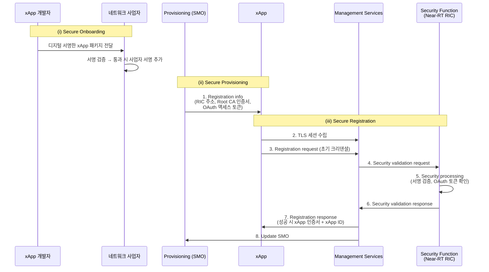
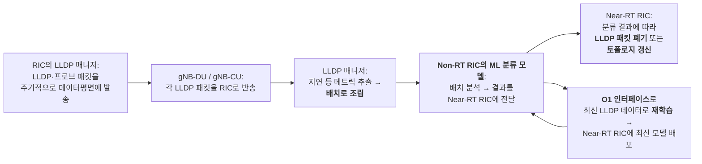

# 6G RAN을 위한 Zero Trust Architecture (ZTA)

## 들어가며 — 위치는 신뢰의 근거가 아니다

Ch5에서 확인한 사실을 떠올려 봅니다. **BMP 공격은 침해된 MEC(Multi-access Edge Computing)[^a-mec] 호스트 2대만으로 성립합니다.** RIC(RAN Intelligent Controller)[^a-ric]도, RAN(Radio Access Network)[^a-ran] 구성요소도, xApp도 침해하지 않았습니다. 즉 **"내부에 있으니 신뢰한다"** 는 전제가 무너지면 경계 기반(perimeter) 보안은 아무것도 막지 못합니다.

Soltani 등[^r6]의 정리:

> ZTA에 기반하면, **네트워크는 항상 위험한 환경에 있고, 내부·외부의 수많은 위험이 그 안에 존재한다.** 물리적 위치는 네트워크의 신뢰성을 규정하는 데 충분하지 않다. **네트워크 내부·외부의 모든 사용자·엔터티·트래픽은 인증·검증되지 않는 한 신뢰할 수 없다.** 또한 보안 지침은 동적이어야 하며 가능한 많은 정보 출처로부터 계산되어야 한다.[^r6]
{: .prompt-warning }

이 장의 구조:

1. ZTA[^a-zta] 표준과 O-RAN(Open Radio Access Network)[^a-o-ran] 배치 모델
   - 1.3 **NIST SP 800-207**[^a-nist][^a-sp] — 7대 원칙·6가정·PE[^a-pe]/PA[^a-pa]/PEP[^a-pep]
   - 1.4 **ZTA 배치 모델 4종** (Device Agent/Gateway · Enclave Gateway · Resource Portal · **Application Sandboxes**)
   - 1.5 **CISA ZTMM**[^a-cisa][^a-ztmm](5필러·3교차기능·4단계)과 **ESF**[^a-esf] 4권
   - 1.6 **하이브리드 ZT[^a-zt] 배치 모델** — 엔클레이브 + xApp/rApp 샌드박싱, Kubernetes+Istio PoC[^a-poc]와 **실측 오버헤드**
   - 1.7 **ZTRAN** — ZT를 xApp으로 구현한 OAIC[^a-oaic] 프로토타입
2. **실전 통제 5종** — xApp 온보딩·등록, API(Application Programming Interface)[^a-api] 접근통제(OAuth 2.0[^a-oauth]), R-NIB[^a-r-nib]/UE-NIB[^a-ue-nib] RBAC[^a-rbac], 보안 개발, 인터페이스 보안
3. AI(Artificial Intelligence)[^a-ai] 기반 ZTA — i-ZTA와 O-RAN 특화 연구
4. **ZT-AI Shield** — AI 파이프라인을 위한 Zero Trust
5. 6개 인에이블러 상세 (MTD[^a-mtd], AIBOM[^a-aibom], XAI[^a-xai], PETs[^a-pets], GAN[^a-gan], Mon&Test)
6. 토폴로지 방어 — RLV[^a-rlv] 실전 배치

---

## 1. ZTA 표준과 O-RAN 배치 모델

### 1.1 핵심 원칙

| 원칙 | 내용 | O-RAN에서의 구현 지점 |
|---|---|---|
| **Never trust, always verify** | 모든 엔터티를 지속 검증[^r5] | xApp 등록 시마다 서명·토큰 검증 |
| **Least privilege** | 최소 권한 부여[^r6] | xApp별 RBAC 역할, 필요한 DB·API만 |
| **Adaptive, risk-based access** | 위험 기반 적응형 접근 통제[^r5] | 실시간 행동 분석 기반 정책 조정 |
| **Log and trace everything** | 모든 트래픽 인식·기록, 사용자 행위 지속 추적[^r6] | 보안 로깅, 감사 |
| **Dynamic policy from many sources** | 가능한 많은 출처로부터 동적 정책 산출[^r6] | E2 KPM[^a-kpm] + O1 + 위협 인텔리전스 결합 |

위 원칙의 출처는 **NIST SP 800-207**[^nistzt]과 **O-RAN Alliance WP: ZTA for secure O-RAN**[^oranzt]입니다. 두 원문의 내용을 §1.3~§1.5에서 직접 다룹니다.

### 1.2 O-RAN Alliance WG11의 권고와 남은 과제

O-RAN Alliance WG11[^a-wg]은 RIC와 xApp에 대한 **인증·암호화 절차를 의무화하는 기술 규격**을 발행했습니다[^r6]. 그러나 Soltani 등[^r6]은 WG11의 권고가 **"고수준·일반적 형태"** 에 머물러 있으며, 발굴해야 할 연구·개발 방향이 많다고 지적합니다.

| 남은 과제[^r6] | 내용 |
|---|---|
| **상호 인증(mutual authentication)** | Open RAN 구조 접근 검증 + 악성 요소·애플리케이션 차단 |
| **xApp·AI 알고리즘의 신뢰성 있는 구현 절차** | 검증 가능한 배포 프로세스 |
| **보호된 키 관리 암호체계** | 키 **생성·저장·순환(rotation)·폐기(revocation)** 전 수명주기 |

> 왜 이것이 중요한가: Ch4의 **V-06**(RIC 하드닝 부족)은 발생 가능성 **High**이며, 근본 원인에 **"부적절한 암호키 관리"** 가 명시되어 있습니다. 화려한 AI 방어보다 이 기본기가 먼저입니다.
{: .prompt-danger }

### 1.3 NIST SP 800-207 — ZTA의 원전

#### 정의

> **Zero trust(ZT)** 는 **네트워크가 이미 침해되었다고 간주하는 상황에서**, 정보 시스템·서비스에 대한 **정확한 최소권한 per-request 접근 결정**을 집행할 때의 **불확실성을 최소화**하도록 설계된 개념·아이디어의 집합이다. **Zero trust architecture(ZTA)** 는 zero trust 개념을 활용하여 **구성요소 관계, 워크플로 계획, 접근 정책**을 포괄하는 기업의 사이버보안 계획이다.[^nistzt]
{: .prompt-info }

핵심은 **"신뢰는 암묵적으로 부여되지 않고 지속적으로 평가되어야 한다"** 는 전제입니다. 전통적으로는 인증된 주체가 내부망에 들어오면 광범위한 자원에 접근할 수 있었고, 그 결과 **비인가 측면 이동(lateral movement)** 이 가장 큰 난제였습니다[^nistzt].

#### 암묵적 신뢰 영역 — 공항 비유

NIST는 **implicit trust zone**(암묵적 신뢰 영역)을 공항 보안검색에 비유합니다[^nistzt]. 모든 승객이 검색대(PDP[^a-pdp]/PEP)를 통과해 탑승 게이트에 접근하며, 그 안에서 승객·직원·승무원은 모두 신뢰됩니다 — **탑승 구역이 곧 암묵적 신뢰 영역**입니다.

![Zero Trust Access — 주체가 PDP/PEP를 통해 자원에 접근 (출처: NIST SP 800-207[^nistzt], Fig. 1)](/assets/img/posts/6g-ai-ran/nistzt-fig1.png)
_그림 7-1. **Zero Trust Access의 추상 모델**. 주체(Subject)가 기업 자원에 접근하려면 **PDP**(Policy Decision Point)와 대응하는 **PEP**(Policy Enforcement Point)를 통과해야 합니다. 출처: [^nistzt], Fig. 1._

> **ZTA의 핵심 조작(operation)**: *"PDP/PEP는 PEP를 지나는 모든 트래픽이 공통 신뢰 수준을 갖도록 통제 집합을 적용한다. PDP/PEP는 트래픽 흐름상 자기 위치를 넘어서는 정책을 적용할 수 없다. PDP/PEP가 가능한 한 구체적일 수 있도록 하려면 **암묵적 신뢰 영역이 가능한 한 작아야 한다.** Zero trust는 **PDP/PEP를 자원에 더 가깝게 옮기는** 원칙·개념의 집합을 제공한다."*[^nistzt]
> → O-RAN 번역: **RIC 앞단에 하나의 관문**을 두는 것이 아니라, **SDL(Shared Data Layer)[^a-sdl] API·R-NIB·UE-NIB·각 E2 노드마다** PEP를 두어야 합니다.
{: .prompt-tip }

#### ZT 7대 원칙 (Tenets T1~T7)

| # | 원칙[^nistzt], [^oranzt] | O-RAN 적용 |
|---|---|---|
| **T1** | **모든 데이터 소스·컴퓨팅 서비스를 자원(resource)으로 간주** | O-RU[^a-ru]/O-DU[^a-du]/O-CU[^a-cu], RIC, xApp/rApp/dApp, R-NIB/UE-NIB, KPM 스트림 전부가 자원 |
| **T2** | **네트워크 위치와 무관하게 모든 통신을 보호** — 위치만으로 신뢰를 부여하지 않음 | 사업자 소유 미드홀 내부 통신도 외부와 동일 요구(IPsec[^a-ipsec]/TLS[^a-tls]/MACsec[^a-macsec]) |
| **T3** | **개별 자원 접근은 세션 단위(per-session)로 허가** — 한 자원에 대한 인증·인가가 다른 자원 접근을 자동 허가하지 않음 | xApp이 SDL에 접근 허가를 받았다는 사실이 UE-NIB 접근 허가가 아님 |
| **T4** | **접근은 동적 정책으로 결정** — 클라이언트 신원·애플리케이션/서비스·요청 자산의 관측 상태 + 행동·환경 속성 | E2 KPM + O1 상태 + 위협 인텔리전스를 결합한 정책 |
| **T5** | **모든 소유·연관 자산의 무결성과 보안 태세를 모니터링·측정** — **CDM**(Continuous Diagnostics and Mitigation)[^a-cdm] 체계 수립 | Ch7 §3.1의 LSTM[^a-lstm] 기반 CDM 모듈, Ch8의 지속 모니터링 |
| **T6** | **모든 자원 인증·인가는 동적이고 접근 허용 전에 엄격히 집행** — 접근 획득 → 위협 스캔·평가 → 적응 → 신뢰 재평가의 **상시 순환** | xApp 등록 시 1회 검증이 아니라 세션 중 재인증 |
| **T7** | **자산·네트워크 인프라·통신의 현재 상태 정보를 최대한 수집해 보안 태세 개선에 활용** | Y1 분석 데이터, 보안 로깅을 정책 개선에 환류 |

> **O-RAN ZTA 백서의 관찰**[^oranzt]: *"Tenet 4, 5, 7은 각각 **동적 정책, 지속 모니터링, 데이터 수집**을 다루며, 이는 ZTA를 달성하기 위한 **운영적(operational) 측면**으로 흔히 간주된다."*
> → 즉 T4·T5·T7이 바로 **AI/ML[^a-ml]이 개입하는 지점**입니다(§3).
{: .prompt-tip }

#### 네트워크에 대한 6가지 가정

NIST는 ZTA를 설계할 때 전제해야 할 가정도 명시합니다[^nistzt].

| # | 가정 | O-RAN 함의 |
|---|---|---|
| 1 | **기업 사설망 전체를 암묵적 신뢰 영역으로 보지 않는다** — 자산은 항상 **공격자가 망 안에 있다고 가정**하고 동작 | Ch5의 BMP가 정확히 이 상황 |
| 2 | 망의 디바이스가 기업 소유·설정 가능하지 않을 수 있다 | 멀티벤더 O-RU, 제3자 xApp |
| 3 | **어떤 자원도 본질적으로 신뢰되지 않는다** — 모든 자산은 요청 전 PEP로 보안 태세를 평가받고, **세션이 유지되는 동안 계속** 평가 | xApp의 지속 검증 |
| 4 | 모든 기업 자원이 기업 소유 인프라 위에 있지 않다 | SMO[^a-smo] 외부 학습(Ch3 §4) |
| 5 | 원격 주체·자산은 로컬 네트워크 연결을 완전히 신뢰할 수 없다 — **로컬 망을 적대적(hostile)으로 가정** | 공유 O-RU, 멀티오퍼레이터(Ch5 APATE) |
| 6 | 기업·비기업 인프라를 넘나드는 자산·워크플로는 **일관된 보안 정책·태세를 유지**해야 함 | 워크로드가 AI-RAN Site 간 이동할 때 |

#### 핵심 논리 구성요소 — PE / PA / PEP

![Core Zero Trust Logical Components (출처: NIST SP 800-207[^nistzt], Fig. 2)](/assets/img/posts/6g-ai-ran/nistzt-fig2.png)
_그림 7-2. **ZTA 핵심 논리 구성요소**. 제어 평면에 **PDP = Policy Engine(PE) + Policy Administrator(PA)**, 데이터 평면에 **PEP**. 좌측 입력: CDM System, Industry Compliance, Threat Intelligence, Activity Logs. 우측 입력: Data Access Policy, PKI[^a-pki], ID Management, SIEM[^a-siem] System. 주체→시스템까지는 **Untrusted**, PEP를 지나면 **Trusted**입니다. 출처: [^nistzt], Fig. 2._

| 구성요소 | 역할[^nistzt] | O-RAN 매핑 |
|---|---|---|
| **PE** (Policy Engine) | 주체에게 자원 접근을 허가할지 **최종 결정**. 기업 정책 + 외부 입력(CDM, 위협 인텔리전스)을 **신뢰 알고리즘(trust algorithm)** 에 넣어 허가/거부/취소를 결정하고 **결정을 로깅** | Near-RT RIC **Security Function**의 판단 로직, Non-RT RIC 정책 생성 |
| **PA** (Policy Administrator) | 주체–자원 간 **통신 경로를 수립/종료**(관련 PEP에 명령). **세션별 인증 토큰·크리덴셜 생성** | **OAuth 2.0 액세스 토큰 발급**(§5.2), xApp 인증서 발급(§5.1) |
| **PEP** (Policy Enforcement Point) | 실제 집행 지점 | SDL API 게이트, E2/A1/O1 종단, 서비스 메시 사이드카 |

![Trust Algorithm Input (출처: NIST SP 800-207[^nistzt], Fig. 7)](/assets/img/posts/6g-ai-ran/nistzt-fig7.png)
_그림 7-3. **신뢰 알고리즘의 입력**. PE가 결정에 사용하는 입력의 종류를 보여줍니다 — 이 입력 집합을 무엇으로 채우는가가 O-RAN ZTA 설계의 실질입니다. 출처: [^nistzt], Fig. 7._

![ZTA Deployment Cycle (출처: NIST SP 800-207[^nistzt], Fig. 12)](/assets/img/posts/6g-ai-ran/nistzt-fig12.png)
_그림 7-4. **ZTA 배치 주기**. ZTA는 일회성 구축이 아니라 순환 프로세스입니다. Ch12 §5.2의 단계별 로드맵과 대응합니다. 출처: [^nistzt], Fig. 12._

### 1.4 ZTA 배치 모델 4종 — O-RAN에 어떤 것이 맞는가

NIST는 PEP를 어디에 두는지에 따라 네 가지 배치 모델을 제시합니다. **O-RAN에서 어느 모델을 쓸지가 실제 설계 결정**입니다.

![Device Agent/Gateway Model (출처: NIST SP 800-207[^nistzt], Fig. 3)](/assets/img/posts/6g-ai-ran/nistzt-fig3.png)
_그림 7-5. **Device Agent/Gateway 모델** — PEP를 **디바이스 에이전트 + 자원 앞 게이트웨이** 로 분할. 출처: [^nistzt], Fig. 3._

![Enclave Gateway Model (출처: NIST SP 800-207[^nistzt], Fig. 4)](/assets/img/posts/6g-ai-ran/nistzt-fig4.png)
_그림 7-6. **Enclave Gateway 모델** — 게이트웨이가 **자원 그룹(enclave) 앞**에 위치. **§1.6의 O-RAN 하이브리드 모델이 채택한 형태**입니다. 출처: [^nistzt], Fig. 4._

![Resource Portal Model (출처: NIST SP 800-207[^nistzt], Fig. 5)](/assets/img/posts/6g-ai-ran/nistzt-fig5.png)
_그림 7-7. **Resource Portal 모델** — 단일 포털이 PEP 역할. 디바이스에 에이전트 설치가 불가능할 때. 출처: [^nistzt], Fig. 5._

![Application Sandboxes (출처: NIST SP 800-207[^nistzt], Fig. 6)](/assets/img/posts/6g-ai-ran/nistzt-fig6.png)
_그림 7-8. **Application Sandboxing 모델** — 신뢰된 애플리케이션을 **격리 샌드박스**에서 실행. **xApp/rApp에 그대로 적용되는 모델**이며 §1.6에서 실제 적용 사례를 봅니다. 출처: [^nistzt], Fig. 6._

| 모델 | O-RAN 적용 적합성 |
|---|---|
| Device Agent/Gateway | E2 노드마다 에이전트 + RIC 앞 게이트웨이 — 세밀하지만 오버헤드 큼 |
| **Enclave Gateway** | **Management / Control / Radio / O-Cloud 엔클레이브 경계에 게이트웨이** — 실용적, §1.6 채택 |
| Resource Portal | 레거시 O-RU처럼 에이전트를 넣을 수 없는 요소에 적합 |
| **Application Sandboxes** | **xApp/rApp 샌드박싱** — 제3자 코드 신뢰 문제(V-01)의 직접 대응 |

### 1.5 CISA ZTMM과 ESF — "성숙도"로 접근하는 이유

O-RAN Alliance ZTA 백서[^oranzt]는 **ZTA가 단번에 달성되는 것이 아니라 여정(journey)** 임을 강조하며, 참조 문서로 다음을 제시합니다.

| 문서 | 역할[^oranzt] |
|---|---|
| **NSA[^a-nsa]·CISA ESF, Open Radio Access Network Security Considerations** | Open RAN 특화 보안 고려사항 |
| **NIST SP 800-207 (ZTA)** | 7대 원칙·구성요소·배치 모델 (§1.3~§1.4) |
| **CISA Zero Trust Maturity Model (ZTMM)** | 단계적 성숙도 모델 |
| **NSA·CISA ESF, Security Guidance for 5G Cloud Infrastructures** | 5G 클라우드 배치용 ZTA 플레이북 |

![US DHS CISA Zero Trust Maturity Model (출처: O-RAN ALLIANCE[^oranzt], Fig. 1)](/assets/img/posts/6g-ai-ran/oranzt-fig1.png)
_그림 7-9. **CISA ZTMM**. **5개 필러**(Identity, Devices, Networks, Applications & Workloads, Data)와 **3개 교차 기능**(Visibility and Analytics, Automation and Orchestration, Governance)이 **4단계 성숙도**(Traditional → Initial → Advanced → **Optimal**)로 진화합니다. 출처: [^oranzt], Fig. 1._

> CISA는 *"제로 트러스트로 가는 길은 **수년이 걸릴 수 있는 점진적 프로세스**"* 라고 명시합니다. O-RAN ZTA 백서는 **ZTMM의 4단계에 보안 통제를 매핑**함으로써 O-RAN의 ZTA 핵심 통제를 점진적으로 구현할 수 있다고 정리합니다[^oranzt].
{: .prompt-info }

**ESF "Security Guidance for 5G Cloud Infrastructures"의 4개 권(volume)** 은 O-RAN 보안에 그대로 유용한 목차를 제공합니다[^oranzt].

| Part | 제목 | 본 시리즈 대응 |
|---|---|---|
| **Part 1** | **Prevent and Detect Lateral Movement** | Ch5(측면 이동), §5.2 접근통제 |
| **Part 2** | **Securely Isolate Network Resources** | §1.6 엔클레이브·샌드박싱, Ch11 컨테이너 격리 |
| **Part 3** | **Protect Data in Transit, In-Use, and at Rest** | §5.5 인터페이스 보안, **Ch9 TEE[^a-tee](in-use)** |
| **Part 4** | **Ensure Integrity of Cloud Infrastructure** | Ch9 원격 검증, Ch7 §8.2 AIBOM |

![Logical O-RAN architecture diagram (출처: O-RAN ALLIANCE[^oranzt], Fig. 2)](/assets/img/posts/6g-ai-ran/oranzt-fig2.png)
_그림 7-10. O-RAN ZTA 백서가 기준으로 삼는 O-RAN 논리 아키텍처. 출처: [^oranzt], Fig. 2._

> ESF의 Open RAN 보안 고려사항 결론은 균형 잡혀 있습니다[^oranzt]: *"비용·성능·공급망 이점을 목표로 하는 새로운 개방 시스템에서는 언제나 보안 고려사항이 나타난다. Open RAN도 이런 고려사항을 공유하며, **Open RAN 생태계의 지속적 노력으로 극복될 수 있다.**"*
{: .prompt-tip }

### 1.6 하이브리드 ZT 배치 모델 — O-RAN 특화 구현

Hashem Eiza 등[^r31]은 **O-RAN 규격에 맞춘 실용적 ZT 배치 모델**을 제안합니다. 핵심은 **매크로 수준 엔클레이브 분할 + 마이크로 수준 애플리케이션 샌드박싱의 결합**입니다.

> 우리는 O-RAN에서 **AI/ML 기반 보안의 신뢰 기반(trusted foundation)** 을 확립하는 새로운 하이브리드 ZT 배치 모델을 제시한다. **매크로 수준 엔클레이브 분할(enclave segmentation)** 과 **xApp/rApp을 위한 마이크로 수준 애플리케이션 샌드박싱**을 통합한다. 이 모델에서 **PDP는 동적 정책을 중앙에서 관리**하고, **분산된 PEP들이 논리 엔클레이브·에이전트·게이트웨이에 상주**하여 **모든 O-RAN 인터페이스에 걸쳐 per-session 최소권한 접근 통제**를 가능하게 한다.[^r31]
{: .prompt-info }

![The Hybrid ZT Deployment Model for O-RAN (출처: Hashem Eiza 등[^r31], Fig. 2)](/assets/img/posts/6g-ai-ran/hybridzt-fig2.png)
_그림 7-11. **O-RAN 하이브리드 ZT 배치 모델**. 데이터 평면에 4개 엔클레이브 — **Management**(SMO/Non-RT RIC, O2·O1·A1), **Control**(Near-RT RIC·O-CU-CP[^a-cu-cp]·O-CU-UP[^a-cu-up]·O-eNB[^a-enb], Y1·A1·E2·E1·O1), **Radio**(O-DU·O-RU, Open FH[^a-o-fh] CUS-Plane/M-Plane·E2·O1), **O-Cloud**(O2) — 각 엔클레이브에 **Agent + Gateway**. 제어 평면에 **Policy Administrator + Policy Engine ← Information Security Policies**. 출처: [^r31], Fig. 2._

#### 네 구성요소

| 구성요소 | 역할[^r31] |
|---|---|
| **PDP** | 모든 O-RAN 구성요소의 **동적 정책을 관리하는 중앙 컨트롤러**. 제어 평면에 위치하며 **PE + PA + 정보보안 정책**으로 구성. 정책을 각 엔클레이브의 에이전트로 **푸시**하여 데이터 평면 전반에 일관 집행 |
| **Enclaves** | 유사 기능·유사 제어 루프를 공유하는 **O-RAN 구성요소의 논리적 그룹**. 이 서비스들에 **격리와 자원 관리**를 제공 |
| **Agents** | 각 네트워크 요소의 **경량 PEP**. 엔클레이브 간 연결·통신을 매개하며, 트래픽의 일부(또는 전부)를 **PA로 보내 평가**받음 |
| **Gateways** | **엔클레이브 경계의 PEP**. 엔클레이브 간 **ingress/egress 트래픽이 반드시 게이트웨이를 통과**하게 하며, 전용 에이전트를 통해 PA와 통신해 **승인된 통신 경로만 집행** |

#### 매크로 + 마이크로 분할

| 계층 | 기술[^r31] | 효과 |
|---|---|---|
| **매크로 분할** | 전통 네트워크 가상화 — **VLAN[^a-vlan], NFV[^a-nfv]**. NFV 오케스트레이션으로 SMO·RIC·O-CU·O-DU를 **VNF[^a-vnf]/CNF[^a-cnf]**로 인스턴스화. 각 엔클레이브를 자체 VLAN에 배치 | 예: **O-CU VNF 네트워크 세그먼트가 O-DU-UP 세그먼트에 직접 도달할 수 없음** |
| **마이크로 분할** | 현대 **서비스 메시** 통제 | xApp/rApp 단위 샌드박싱 |

![Sandboxed rApps (출처: Hashem Eiza 등[^r31], Fig. 3)](/assets/img/posts/6g-ai-ran/hybridzt-fig3.png)
_그림 7-12. **샌드박싱된 rApp**. NIST의 Application Sandboxes 모델(그림 7-8)을 Non-RT RIC에 적용한 형태입니다. 출처: [^r31], Fig. 3._

![Sandboxed xApps (출처: Hashem Eiza 등[^r31], Fig. 4)](/assets/img/posts/6g-ai-ran/hybridzt-fig4.png)
_그림 7-13. **샌드박싱된 xApp**. Ch6 §1의 공격 원형 — 악성 xApp이 같은 RIC의 공유 DB에 접근 — 에 대한 구조적 대응입니다. 출처: [^r31], Fig. 4._

#### 다층 보안: IPsec + mTLS

심층 방어를 위해 **네트워크 계층과 애플리케이션 계층을 동시에** 보호합니다[^r31].

| 계층 | 프로토콜 | 역할 |
|---|---|---|
| **네트워크 계층** | **IPsec** | 통신 당사자 간 **모든 IP 패킷** 보호 — 암호화·무결성·인증. **에이전트–게이트웨이 간 IP 패킷의 안전한 수송**을 담당. 해시로 전송 중 변조 방지, 패킷 출처 인증 |
| **애플리케이션 계층** | **mTLS**[^a-mtls] | 애플리케이션 간 **종단간** 보안 — 상호 인증 + 암호화 + 무결성 검증. 양쪽 에이전트가 **인증서로 서로를 인증**하고 통신 전 구간을 보호하는 보안 세션 수립 |

#### PoC와 성능 오버헤드 — 실제 수치

**Kubernetes + Istio**로 구현하고 **NIST Policy Machine(PM)**[^a-pm] 을 기반으로 한 PoC입니다[^r31].

| 항목 | 결과[^r31] |
|---|---|
| 구현 매핑 | **Pod = 엔클레이브**, **사이드카 프록시 = 에이전트/게이트웨이 결합 기능** |
| **추가 지연** | 엔클레이브 기반 배치가 **연결당 1~10 ms 추가** |
| **CPU/메모리 오버헤드** | 엔클레이브당 사이드카 프록시 1개 실행 시 **약 5~10% 추가 사용률** |
| **프록시 메모리** | 프록시당 **약 100~200 MB RAM** |

> **이 수치를 Ch2의 제어 루프 예산과 겹쳐 읽어야 합니다.** 연결당 **1~10 ms 추가 지연**은 Non-RT(>1 s)와 Near-RT(10 ms~1 s) 루프에는 수용 가능하지만, **dApp의 실시간 루프(<10 ms, Det-RAN은 2 ms)** 에는 치명적일 수 있습니다. 즉 **ZT 엔클레이브 게이트웨이를 프론트홀·dApp 경로에 그대로 넣을 수는 없습니다** — Radio 엔클레이브에는 다른 설계(예: 사전 수립된 세션, MACsec 기반 링크 보호)가 필요합니다.
{: .prompt-danger }

### 1.7 ZTRAN — Zero Trust를 xApp으로 구현한 프로토타입

Abdalla 등[^r32]은 ZT 원칙을 **xApp으로 캡슐화**해 실제 near-RT RIC에서 동작시켰습니다.

> 우리는 **ZTRAN**(zero trust RAN)을 소개한다. 이는 **서비스 인증(service authentication), 침입 탐지(intrusion detection), 보안 슬라이싱(secure slicing) 하위 시스템을 xApp으로 캡슐화**한 것이다. **OAIC**(open artificial intelligence cellular) 연구 플랫폼에 ZTRAN을 구현하고, **정상 사용자 처리량·지연 수치** 관점에서 실현 가능성과 효과를 입증한다. 실험 분석은 ZTRAN의 **침입 탐지·보안 슬라이싱 마이크로서비스가 O-RAN Alliance의 컨테이너화된 near-real time RIC의 일부로서 효과적으로, 그리고 협조적으로 동작**하는 방식을 보여준다.[^r32]
{: .prompt-info }

![Zero-trust security components (출처: Abdalla 등[^r32], Fig. 1)](/assets/img/posts/6g-ai-ran/ztran-fig1.png)
_그림 7-14. **Zero-trust 보안 구성요소** — 위협 인텔리전스 피드, ID 관리 시스템, PKI 등. 출처: [^r32], Fig. 1._

![ZTRAN xApp procedures (출처: Abdalla 등[^r32], Fig. 2)](/assets/img/posts/6g-ai-ran/ztran-fig2.png)
_그림 7-15. **ZTRAN xApp 절차** — 액션 흐름과 O-RAN 구성요소 상호작용. 출처: [^r32], Fig. 2._

![The OAIC testbed implementing ZTRAN (출처: Abdalla 등[^r32], Fig. 3)](/assets/img/posts/6g-ai-ran/ztran-fig3.png)
_그림 7-16. **ZTRAN을 구현한 OAIC 테스트베드**. Ch11의 테스트베드 목록에 추가되는 사례입니다. 출처: [^r32], Fig. 3._

![ZTRAN이 서비스하는 정상 UE와 악성 UE의 달성 데이터율 (출처: Abdalla 등[^r32], Fig. 4)](/assets/img/posts/6g-ai-ran/ztran-fig4.png)
_그림 7-17. **(a)** ZTRAN이 서비스하는 **정상 UE와 악성 UE의 달성 데이터율**, 그리고 네트워크 측 지표. ZT 통제가 정상 사용자 성능을 해치지 않으면서 악성 UE를 억제하는지를 보여줍니다. 출처: [^r32], Fig. 4._

| ZTRAN 하위 시스템 | ZT 원칙 대응 |
|---|---|
| **서비스 인증** | T3(per-session), T6(동적 인증·인가) |
| **침입 탐지** | T5(무결성·태세 모니터링), T7(정보 수집) |
| **보안 슬라이싱** | T2(위치 무관 보호), 최소권한 — 슬라이스 격리 |

> **세 논문의 관계 정리**
> - **NIST SP 800-207**[^nistzt] = 원칙과 논리 구성요소 (무엇을)
> - **O-RAN ZTA 백서**[^oranzt] = 성숙도 여정과 O-RAN 태세 (어떤 순서로)
> - **하이브리드 ZT 모델**[^r31] = 배치 아키텍처와 오버헤드 (어떻게, 얼마나 비싸게)
> - **ZTRAN**[^r32] = 실제 near-RT RIC 상 xApp 프로토타입 (정말 되는가)
{: .prompt-tip }

---

## 2. 실전 통제 5종 — RIC 보안의 구체적 구현

Soltani 등[^r6]이 정리한 5G/6G RIC 보안 통제입니다. **바로 구축 체크리스트로 쓸 수 있는 수준**입니다.

### 2.1 통제 ①: 안전한 xApp 온보딩·프로비저닝·등록

_그림 7-18. **Near-RT RIC의 안전한 xApp 등록 흐름**. Soltani 등[^r6] Fig. 10의 메시지 시퀀스를 재구성._

| 단계 | 핵심 |
|---|---|
| **(i) Secure onboarding** | 개발자가 xApp에 **디지털 서명** → 사업자가 검증 후 **자신의 서명 추가**. 결과: 정당한 개발자 출처 + **전송 중 무변조** 보증 |
| **(ii) Secure provisioning** | 등록 전제조건으로 SMO 프로비저닝 시스템에서 정보 취득: Near-RT RIC **주소**, **Root CA[^a-ca] 인증서**(RIC 신원 신뢰의 기반), **초기 등록 크리덴셜**(OAuth 2.0 액세스 토큰) |
| **(iii) Secure registration** | TLS 세션 수립 → 등록 요청 + 초기 크리덴셜 → 보안 기능이 검증 → 성공 시 **xApp 인증서 + xApp ID** 발급. **xApp ID는 이후 모든 API 요청에서 xApp을 식별하는 수단** |

> **왜 xApp ID가 중요한가**: Ch4의 **V-01**(미인증 무선자원 접근)의 근본 원인에 "악성 중첩(nested) xApp"이 있습니다. xApp ID 없이는 API 요청의 주체를 확정할 수 없으므로 감사·차단이 불가능합니다.
{: .prompt-tip }

**표준 원문에서의 동일 절차**

위 흐름은 학술 논문의 정리이고, 규격 원문에도 같은 절차가 명시되어 있습니다.

![Security procedure for xApp registration (출처: ETSI TS 104 104[^etsisecreq], Fig. 5.1.3.2-2)](/assets/img/posts/6g-ai-ran/etsisecreq-fig5-p27.png)
_그림 7-19. **xApp 등록의 보안 절차** — O-RAN WG11 보안 요구사항 규격 원문. 그림 7-18의 메시지 시퀀스가 규격 수준에서 어떻게 규정되는지 확인할 수 있습니다. 출처: [^etsisecreq], Fig. 5.1.3.2-2._

### 2.2 통제 ②: 엄격한 API 접근 통제 — OAuth 2.0

xApp은 **보안 프로필에 따라 계층화**되어야 합니다. Soltani 등[^r6]의 예시:

| xApp 유형 | 필요 접근 |
|---|---|
| 로드밸런싱 xApp | 네트워크 메트릭 (바이트·패킷 카운트) |
| **침입 탐지 xApp** | **패킷 헤더 검사** |
| 서비스 제공자 xApp vs 제3자 xApp | **서로 다른 수준**의 네트워크 상세·무선자원 접근 |

**API 인증**은 상호 인증 — **mTLS 1.2 이상** 또는 **IPsec**[^r6]. mTLS는 xApp(API 소비자)과 Near-RT RIC 플랫폼(API 생산자) **양쪽 모두 인증서를 보유하고 공개/개인키로 상호 신원 검증**을 요구합니다.

**API 인가**는 3GPP·O-RAN WG11 모두 **OAuth 2.0**(RFC 6749[^a-rfc])을 권고합니다[^r6].

![SDL 데이터 API 접근을 보호하는 RIC OAuth 2.0 인가 흐름 (출처: Soltani 등[^r6], Fig. 11)](/assets/img/posts/6g-ai-ran/intctrl-fig11.png)
_그림 7-20. **RIC OAuth 2.0 인가 흐름**. 출처: [^r6], Fig. 11._

| 메시지 | 내용 |
|---|---|
| 1 | **Service registration**(service ID) — 제공 서비스를 Near-RT RIC의 관리 서비스 모듈에 등록 |
| 2 | xApp → 보안 기능: **Access token request** (예: JSON[^a-json] 액세스 토큰) |
| 3 | 보안 기능: **Authentication check** |
| 4 | 보안 기능 → xApp: **Issue access token** (token ID) |
| 5 | xApp → 관리 서비스: **Service request** (service ID, token ID) |
| 6 | 관리 서비스 → 보안 기능: **Token validation request** |
| 7 | 보안 기능 → 관리 서비스: **Approved token** |
| 8 | 관리 서비스 → RAN 서비스: **Service request** (xApp ID) |
| 9 | RAN 서비스 → xApp: **Requested service reply** |

OAuth 2.0의 세 주체 매핑[^r6]:

| OAuth 역할 | O-RAN 구성요소 |
|---|---|
| Resource server (API 생산자) | **Near-RT RIC** (API로 RAN 서비스 제공) |
| Resource requester (클라이언트/API 소비자) | **xApp** |
| Authorization server | **Near-RT RIC의 Security Function** |

### 2.3 통제 ③: R-NIB·UE-NIB의 세분화된 접근 통제 — RBAC

OAuth 2.0만으로는 **"SDL API에 접근할 수 있다/없다"** 수준입니다. R-NIB·UE-NIB에 대한 **fine-grained** 통제를 위해 **RBAC**가 추가로 필요합니다[^r6].

RBAC 인가 절차는 다음과 같습니다[^r6].

1. **xApp 온보딩 시** — xApp 솔루션 제공자가 **DB 토큰**을 생성합니다. 토큰에는 해당 xApp에 필요한 **역할(role), 접근 유형(access type), 수행 연산(operations)** 이 명시됩니다.
2. xApp이 **SDL에 데이터베이스 접근 요청**을 보냅니다.
3. SDL이 **Security Function에 클라이언트 인가 요청**을 전달합니다.
4. Security Function이 **xApp의 DB 토큰과 Service Provider가 검증한 토큰을 비교**합니다.
5. 인증되면 Security Function이 **토큰에 기반해 역할을 할당**하고 SDL에 응답합니다.

> **UE-NIB에 특별한 주의가 필요합니다.** Ch2에서 확인했듯 UE-NIB는 UE(User Equipment)[^a-ue]별 식별자를 노출하며, Ch4의 **V-02**는 이를 심각도 High로 분류합니다. **최소 권한의 가장 명확한 적용 대상**이 UE-NIB입니다 — 대부분의 xApp은 UE 식별자가 필요 없습니다.
{: .prompt-danger }

### 2.4 통제 ④: 안전한 소프트웨어 개발

Soltani 등[^r6]의 지적은 단호합니다: *"Open RAN 공급자는 안전한 소프트웨어 개발 베스트 프랙티스를 구현해야 하며, **안전한 소프트웨어 구축을 오픈소스 커뮤니티에만 의존할 수 없다.**"*

| 권고 사항 | Ch6·Ch12 연결 |
|---|---|
| **오픈소스 구성요소 인벤토리 유지** | → **AIBOM**의 전신 |
| 취약점 추적·분석 | → 지속 모니터링 |
| 오픈소스 취약점 개선(remediation) | → 패치 관리 (V-06) |
| 신규 위험 지속 모니터링 | → Continuous Monitoring & Testing |
| **소프트웨어 무결성 유지 도구·절차** — 특히 Near-RT RIC 플랫폼의 **SW 업그레이드·보안 패치 적용 중** 변경·업데이트 상태를 정확히 감시 | → ML 공급망 방어 |

### 2.5 통제 ⑤: 안전한 RIC 인터페이스 통신

| 인터페이스 | 권고 통제 |
|---|---|
| **일반 외부 연결** | IPSec 또는 TLS. **O&M[^a-om] 연결에는 상호 인증 강제**[^r6] |
| **E2** | 3GPP 권고 채택 — **IPsec 터널 모드**, **DTLS**[^a-dtls](UDP[^a-udp]), **TLS**(TCP[^a-tcp])로 기밀성·무결성·진정성 확보 |
| **A1** | A1 자체는 기밀성·무결성·상호인증을 갖추지만, **Near-RT RIC는 수신 정책을 자동으로 신뢰하면 안 됨** — Zero Trust 기반의 자체 보안 조치 필요 |

**A1 Termination에 적용할 구체 조치**[^r6]:

- [ ] 정책이 **지정된 스키마를 준수**하는지 확인
- [ ] 정책 값의 **정확성과 범위(range)** 검증
- [ ] **레이트 리미팅**으로 자원 소진·DoS(Denial of Service)[^a-dos] 방지
- [ ] **보안 로깅**으로 모든 실패 기록

> **"경계 보안에만 의존하지 말라"** 는 원칙이 A1에서 가장 구체적으로 나타납니다. Non-RT RIC가 인증되었다는 사실이 **그 정책의 내용이 안전하다는 뜻은 아닙니다.** Ch5의 LLM(Large Language Model)[^a-llm] 에이전트가 Non-RT RIC에서 정책을 생성한다면, 프롬프트 인젝션으로 만들어진 악성 정책이 **정당하게 인증된 채널로** 내려옵니다. A1 스키마·범위 검증이 마지막 방어선입니다.
{: .prompt-warning }

---

## 3. AI 기반 ZTA — 왜 AI가 필요한가

ZTA는 "지속 검증"을 요구하지만, 6G 규모에서 사람이 검증할 수는 없습니다. Benzaïd 등[^r5]은 AI/ML이 ZTA 달성에 중요한 역할을 할 것으로 전망하는 근거를 제시합니다.

| AI/ML 능력 | ZTA에서의 역할 |
|---|---|
| 실시간 데이터 처리 | 지속적 검증의 물량 처리 |
| 학습 적응성 | **경험 기반 신뢰 평가**(experience-based trust evaluation) |
| 예측 분석 | **선제적 위협 탐지·완화** |
| 자율 의사결정 | **컨텍스트 인식 인증·접근 결정** |
| 행동 분석 | **지속적 사용자·엔터티 행동 분석**(UEBA[^a-ueba]) |

### 3.1 일반 AI-ZTA 연구

| 연구 | 접근 |
|---|---|
| Prakash 등 | **LSTM 기반 CDM**(Continuous Diagnostics and Mitigation) 모듈 — 이전 공격·허용 요청 데이터로 공격 식별·예측 정확도 향상[^r5] |
| FL[^a-fl] 기반 ZTA | **동적 인증 + 지속 진단·완화**를 프라이버시 보존과 함께 달성[^r5] |
| RL[^a-rl] 기반 ZTA | RL 전략으로 네트워크 적응성·공격 복원력 강화[^r5] |

### 3.2 O-RAN 특화 AI-ZTA

| 연구 | 핵심 기법 |
|---|---|
| **i-ZTA** | O-RAN 프레임워크에 통합된 지능형 ZTA. **RL 기반 정책 엔진** + **GNN(Graph Neural Network)[^a-gnn] 기반 보안 상태 분석**. RL 에이전트 간 **FL 협력** 지원[^r5] |
| DRL[^a-drl] 지원 ZT 정책 엔진 | **실시간 디바이스 행동 분석**에 기반해 보안 정책을 동적 조정, O-RAN 서비스 접근 보안 강화[^r5] |
| Hamhoum 등 | **Transformer**의 순차 데이터 컨텍스트 추출 능력을 활용, 지속적 사이버 위협 평가로 접근 통제 정책을 동적 적응. O-RAN 인터페이스 데이터로 **내부·외부 공격 모두** 식별[^r5] |

> **GNN이 왜 O-RAN ZTA에 적합한가**: O-RAN의 보안 상태는 본질적으로 **그래프**입니다 — 노드(RU/DU/CU/RIC/xApp)와 엣지(인터페이스·의존관계). Ch5의 토폴로지 위조 공격은 **그래프 구조의 이상**이므로, GNN 기반 상태 분석이 자연스러운 도구입니다.
{: .prompt-tip }

### 3.3 연구 성숙도 — 냉정한 평가

Benzaïd 등[^r5]의 lessons learned는 과장을 경계합니다.

> 주된 초점은 AI/ML이 **보안 조치를 강화**하는 잠재력에 있었고, **기존 보안 평가 도구를 개선**하는 능력에는 그렇지 않았다. 이는 예상된 결과다 — **취약점 테스팅, API 보안, 상충 완화, 제로 트러스트에서의 AI 응용은 O-RAN뿐 아니라 더 넓은 사이버보안 도메인에서도 초기 단계**이기 때문이다.[^r5]
{: .prompt-warning }

---

## 4. ZT-AI Shield — AI 파이프라인을 위한 Zero Trust

지금까지의 ZTA는 **인프라와 앱**을 대상으로 했습니다. Benzaïd 등[^r5]의 기여는 **AI/ML 파이프라인 자체에 Zero Trust를 적용**하는 프레임워크입니다.

![ZT-AI Shield — O-RAN ML 파이프라인을 AI 위협으로부터 보호 (출처: Benzaïd 등[^r5], Fig. 31)](/assets/img/posts/6g-ai-ran/aisurvey-fig31.png)
_그림 7-21. **ZT-AI Shield**. 상단(초록 박스): 6개 인에이블러 — MTD-based Robust AI, **AI-BOM**, GAN-based AI Defenses, **PETs**, **XAI**, Model Mon&Test. 중단: O-RAN ML Pipeline(Data Collection → Pre-processing → Training → Testing → Serving → Monitoring). 하단(빨강 박스): 위협별 커버 구간 — Poisoning(MTD, XAI, PETs) / Evasion(MTD, XAI, GAN) / Resource Exhaustion(MTD, GAN, AI-BOM) / Supply Chain(AI-BOM) / Privacy(MTD, XAI, PETs) / Reprogramming(MTD, AI-BOM), 그리고 **전 구간을 종단하는 Model Mon&Test**. 출처: [^r5], Fig. 31._

### 4.1 위협 × 인에이블러 매핑 표

그림 7-21을 표로 옮기면 방어 설계표가 됩니다.

| 위협 | 파이프라인 커버 구간 | 대응 인에이블러 |
|---|---|---|
| **Poisoning** | Data Collection ~ Training | **MTD, XAI, PETs** |
| **Evasion** | Testing ~ Monitoring | **MTD, XAI, GAN** |
| **Resource Exhaustion** | Pre-processing ~ Monitoring | **MTD, GAN, AI-BOM** |
| **Supply Chain** | Pre-processing ~ Monitoring | **AI-BOM** |
| **Privacy** | Serving ~ Monitoring | **MTD, XAI, PETs** |
| **Reprogramming** | Serving ~ Monitoring | **MTD, AI-BOM** |
| (전 구간) | Data Collection ~ Monitoring | **Model Monitoring & Testing** |

> **읽는 법**: **MTD가 6개 위협 중 5개**에 등장합니다 — 가장 범용적 인에이블러입니다. **AI-BOM은 공급망의 유일한 해답**입니다(다른 대안이 없습니다). **PETs는 프라이버시와 오염**에 특화됩니다. 그리고 **Model Mon&Test는 선택이 아니라 전 구간 필수**입니다.
{: .prompt-tip }

---

## 5. 6개 인에이블러 상세

### 5.1 MTD (Moving Target Defense) 기반 강건 AI

**핵심 아이디어**: 공격자가 표적을 특정할 수 없게 **모델·구성·특징 공간을 계속 바꿉니다.** Ch6의 white-box 가정을 무력화하는 정공법입니다.

![MTD 기반 강건 AI 분류체계 (출처: Benzaïd 등[^r5], Fig. 26)](/assets/img/posts/6g-ai-ran/aisurvey-fig26.png)
_그림 7-22. **MTD 기반 강건 AI 분류체계**. 출처: [^r5], Fig. 26._

| MTD가 유효한 이유 | 설명 |
|---|---|
| 대리 모델 무력화 | APATE[^r9]의 1단계(대리 모델 학습)가 무의미해짐 — 표적이 계속 바뀜 |
| $\epsilon$ 최적화 무력화 | FGSM[^a-fgsm]/PGD[^a-pgd]가 계산한 최소 섭동이 다른 모델에는 통하지 않음 |
| 정찰 비용 증가 | 공격자가 매번 다시 탐색해야 함 |

### 5.2 AI-BOM (AI/ML Bill of Materials)

소프트웨어 SBOM(Software Bill of Materials)[^a-sbom]의 AI 확장입니다. **공급망 위협(Ch6 §3.6)의 유일한 체계적 대응**입니다.

![AI-BOM의 구성 요소 (출처: Benzaïd 등[^r5], Fig. 27)](/assets/img/posts/6g-ai-ran/aisurvey-fig27.png)
_그림 7-23. **AI-BOM의 구성 요소**. 출처: [^r5], Fig. 27._

Benzaïd 등[^r5]의 핵심 문장: *"AIBOM은 **AI 취약점의 자동 추적과 지속적 갱신**을 가능하게 한다."*

| AI-BOM이 추적해야 하는 것 | 왜 |
|---|---|
| 모델 계보(provenance) — 누가·언제·무엇으로 학습했나 | 오염된 사전학습 가중치 식별 |
| 학습 데이터셋 출처·버전 | 데이터 오염 추적 |
| ML 프레임워크·라이브러리 버전 (전이 의존성 포함) | Ch4 §6의 의존성 표면 |
| 하드웨어·가속기 정보 | Ch6의 하드웨어 트로이목마 (C6) |
| 모델 서명·해시 | 무변조 검증 |

### 5.3 XAI (Explainable AI)

**보안 도구로서의 XAI**입니다. 결정의 근거를 노출시키면, **결정이 조작되었는지 검사**할 수 있습니다.

![XAI 접근법의 분류체계 (출처: Benzaïd 등[^r5], Fig. 28)](/assets/img/posts/6g-ai-ran/aisurvey-fig28.png)
_그림 7-24. **XAI 접근법 분류체계**. 출처: [^r5], Fig. 28._

| 용도 | 설명 |
|---|---|
| 회피 공격 탐지 | 예측은 정상이지만 **근거 특징이 비정상**이면 적대적 입력 의심 (Ch8 §3의 LIME[^a-lime]/SHAP[^a-shap] 적용) |
| 오염 진단 | 결정 경계가 이상하게 편향된 지점 식별 |
| 규제 대응 | **EU AI Act의 투명성·설명가능성 요구**(Ch4 §6) 충족 |

### 5.4 PETs (Privacy-Enhancing Technologies)

Ch9에서 상세히 다루며, 여기서는 위치만 확인합니다.

![흔한/신흥 PETs와 그 잠재력·과제 (출처: Benzaïd 등[^r5], Fig. 29)](/assets/img/posts/6g-ai-ran/aisurvey-fig29.png)
_그림 7-25. **PETs의 종류, 핵심 잠재력, 관련 과제**. 출처: [^r5], Fig. 29._

### 5.5 GAN 기반 AI 방어

GAN을 **방어 측에서** 사용합니다.

| 용도 | 설명 |
|---|---|
| 적대적 샘플 생성 | 학습용 적대적 데이터를 대량 합성 → 적대적 학습 강화 |
| 데이터 증강 | 희소한 공격 샘플 보강 (Ch8의 학습 데이터 부족 문제) |
| 이상 탐지 | 정상 분포를 학습해 이탈 탐지 (Ch8의 SpotLight JVGAN, MADGAN) |
| Few-shot / unknown-risk | API 이상 탐지에서 **few-shot·미지 위험 시나리오 지원**[^r5] |

### 5.6 지속적 모델 모니터링·테스팅 (Model Mon&Test)

파이프라인 **전 구간을 종단**하는 유일한 인에이블러입니다.

| 활동 | 목적 |
|---|---|
| 성능 드리프트 감시 | Ch3의 ⑥ Continuous Operations와 직결 |
| **적대적 강건성 재평가** | 새 공격 기법에 대한 기존 모델 재검증 |
| 테스트 커버리지 확대 | Ch10·Ch11의 정형 검증·테스트베드 |
| 재학습 트리거 관리 | Ch6에서 지적한 **재학습 악용** 방지 (트리거 조건 자체를 보호) |

---

## 6. 토폴로지 방어의 실전 배치 — RLV

Ch5의 LLDP(Link Layer Discovery Protocol)[^a-lldp] 계열 공격(LFA, LLA)에 대한 구체적 O-RAN 배치 설계입니다. Soltani 등[^r6]은 SDN(Software-Defined Networking)[^a-sdn] 컨트롤러용으로 고안된 **RLV(Real-time Link Verification)** 를 O-RAN에 이식하는 아키텍처를 제안합니다.

![Open RAN 아키텍처에 배치된 RLV 방어 시스템 (출처: Soltani 등[^r6], Fig. 12)](/assets/img/posts/6g-ai-ran/intctrl-fig12.png)
_그림 7-26. **O-RAN에 배치된 RLV 방어 시스템**. 출처: [^r6], Fig. 12._

### 6.1 3계층 구조와 동작

| 계층 | 구성 |
|---|---|
| **데이터 평면** | gNB[^a-gnb]-RU, gNB-DU, gNB-CU 등 RAN 요소 |
| **Near-RT RIC** | **LLDP 매니저** — 정해진 간격으로 LLDP·프로브 패킷 생성·발송, 분류 결과에 따라 조치 |
| **Non-RT RIC** | **ML 분류 모델** — 배치(batch)로 모인 지연 메트릭을 분석 |

동작 흐름[^r6]:

_그림 7-27. RLV의 O-RAN 배치 동작 흐름. Soltani 등[^r6]의 서술을 재구성._

### 6.2 왜 이 설계가 좋은가 — 그리고 어디가 위험한가

| 장점 | 설명 |
|---|---|
| **시간 척도 분리가 정확** | 실시간 수집·조치는 Near-RT RIC, 무거운 ML 분류는 Non-RT RIC → Ch2의 제어 루프 예산 준수 |
| **지속 재학습** | O1로 최신 LLDP 데이터를 받아 모델을 계속 갱신 → 네트워크 동역학 추적 |
| **정적 임계값 탈피** | Ch5의 LLA가 무력화한 정적 임계값 방어(LLI) 대신 **학습 기반 분류** |

| 위험 | 설명 |
|---|---|
| **재학습 경로가 공격 표면** | Ch6에서 본 재학습 악용 — 공격자가 오염된 LLDP 데이터로 분류기를 서서히 편향(**S6 전략**) |
| Non-RT RIC 의존 | Non-RT RIC 침해 시 방어 전체가 무력 |
| 배치 지연 | 배치 조립·분석 지연 동안 위조 링크가 유효 |

> **참고: 다른 토폴로지 방어 계열**[^r6] — 임계값 기반 기법, **SPV**(Stealthy Probing Verification)[^a-spv], **MLLG**(ML-based Link Guard)[^a-mllg], **RLV**가 LFA·LLA에 대응하며, **심층강화학습**이 토폴로지 포이즈닝 방어를 보강합니다. 하이브리드 SDN의 다중홉 링크 위조에는 **Hybrid-Shield** 접근이 있습니다.
{: .prompt-info }

### 6.3 참고: NG-RAN의 식별자 보호 (SUPI/SUCI)

Zero Trust의 "최소 노출" 원칙이 3GPP 표준에 이미 반영된 예입니다[^r6].

| 식별자 | 역할 |
|---|---|
| **SUPI** (Subscription Permanent Identifier)[^a-supi] | UE IMSI[^a-imsi] + 홈 네트워크 식별자로 구성된 **전역 고유 영구 식별자**. **초기 접속 요청·연결 수립 단계에서는 은닉** |
| **SUCI** (Subscription Concealed Identifier)[^a-suci] | UE가 생성하는 **임시 1회용 식별자**. 가입자 실제 정보를 암호화·은닉 |

효과: **가짜 기지국(IMSI catcher)이 가입자 신원을 알아낼 수 없습니다.** SUPI는 코어망과의 상호작용을 포함한 완전한 연결 수립 이후에만 노출됩니다[^r6].

---

## 7. Zero-Touch Security — Zero Trust와 짝을 이루는 자율 오케스트레이션

Zero Trust가 **"누구를, 어떤 조건으로 신뢰할 것인가"** 를 다룬다면, Braeken 등[^r36]이 정리하는 **Zero-Touch Security(ZTSec)** 는 **"신뢰가 확인된 뒤 대응을 누가·어떻게 수행할 것인가"** 를 다룹니다 — 5개 프레임워크(Zero-Touch, Zero-Trust, 분산 AI 학습, 블록체인 기반 AI 보안, XAI 보안) 중 Zero Trust와 가장 밀접히 짝을 이루는 개념입니다.

| 항목 | 내용 |
|---|---|
| **핵심 개념** | AI·정책 주도의 **폐루프 오케스트레이션** — 일상적 이벤트는 자율적으로 모니터링·판단·대응하고, 위험도가 높거나 애매한 사례만 **HITL(Human-in-the-Loop)**[^a-hitl]로 에스컬레이션. HITL은 안전·미션·정책이 걸린 개입을 위한 **거버넌스 예외 경로**로 남습니다 |
| **위협·방어 매핑** | (i) RAN·엣지 계층의 오염·회피 징후 자동 트리아지·교정 (ii) 코어망의 슬라이스 단위 DoS·이상 신호 (iii) 애플리케이션 모델의 적대적 입력 탐지 — 고영향·규제 민감 조치에는 HITL 게이트 유지 |
| **트레이드오프** | 오탐 대 지연, 모델 드리프트, 벤더 간 상호운용성 — **위험 등급별 대응 매뉴얼(risk-tier playbook)** 과 **XAI 기반 감사가능성**이 필요 |

_표 7-0. Zero-Touch Security 개요. 출처: Braeken 등[^r36]을 재구성._

> **§4 ZT-AI Shield와의 관계**: ZT-AI Shield가 "AI 파이프라인의 어느 구간을 어떤 인에이블러로 지키는가"라면, ZTSec은 "그 지킴이 자율 루프로 얼마나 빨리, 어디까지 사람 개입 없이 돌아가는가"를 규정합니다. Ch3의 폐루프 자동화 논의, Ch8의 AI 기반 자율 탐지·Self-Healing이 ZTSec의 구체적 실현입니다.
{: .prompt-tip }

---

## 8. 이 장의 요약

- ZTA의 전제는 **"물리적 위치는 신뢰의 근거가 아니다"** 입니다. BMP 공격(Ch5)이 이 전제의 필요성을 실증합니다.
- **NIST SP 800-207**의 핵심은 **암묵적 신뢰 영역을 최소화하고 PDP/PEP를 자원에 가깝게 옮기는 것**이며, 7대 원칙(T1~T7)과 **PE/PA/PEP** 구성요소로 표현됩니다. T4·T5·T7(동적 정책·지속 모니터링·데이터 수집)이 **AI/ML이 개입하는 지점**입니다[^nistzt], [^oranzt].
- 배치 모델 4종 중 O-RAN에 실용적인 것은 **Enclave Gateway**(엔클레이브 경계 집행)와 **Application Sandboxes**(xApp/rApp 격리)입니다.
- **CISA ZTMM**은 5필러·3교차기능·4단계(Traditional→Initial→Advanced→**Optimal**)로 **점진적 여정**을 규정하며, ESF 4권은 측면이동 방지·자원 격리·**in-use 데이터 보호**·클라우드 무결성으로 목차를 제공합니다[^oranzt].
- **하이브리드 ZT 배치 모델**은 중앙 PDP + 엔클레이브(Management/Control/Radio/O-Cloud)의 분산 PEP(Agent·Gateway) + xApp/rApp 샌드박싱이며, Kubernetes+Istio PoC에서 **연결당 1~10 ms, CPU·메모리 5~10%, 프록시당 100~200 MB**를 실측했습니다 — **dApp 실시간 루프(<10 ms)에는 그대로 쓸 수 없습니다**[^r31].
- **ZTRAN**은 서비스 인증·침입 탐지·보안 슬라이싱을 **xApp으로 캡슐화**해 OAIC 테스트베드의 컨테이너화된 near-RT RIC에서 동작을 입증했습니다[^r32].
- 실전 통제는 5종입니다: **① xApp 온보딩·등록**(개발자 서명 → 사업자 서명 → TLS → 토큰 검증 → xApp ID 발급), **② API 접근통제**(mTLS 1.2+ / IPsec + **OAuth 2.0**), **③ R-NIB/UE-NIB RBAC**, **④ 안전한 SW 개발**(오픈소스 인벤토리·패치·무결성 감시), **⑤ 인터페이스 보안**(E2: IPsec/DTLS/TLS, **A1: 스키마·범위 검증 + 레이트리밋 + 로깅**)[^r6].
- **A1 정책을 자동 신뢰하지 않는 것**이 Zero Trust의 가장 구체적 적용이며, LLM 에이전트가 정책을 생성하는 시대에 결정적입니다.
- AI 기반 ZTA는 **i-ZTA**(RL 정책 엔진 + GNN 보안상태 분석 + FL 협력), DRL 정책 엔진, Transformer 기반 위협 평가로 연구되고 있으나 **아직 초기 단계**입니다[^r5].
- **ZT-AI Shield**는 AI 파이프라인에 Zero Trust를 적용하는 프레임워크로, **6개 인에이블러**(MTD·AI-BOM·XAI·PETs·GAN·Mon&Test)를 위협별로 매핑합니다. **MTD가 가장 범용적, AI-BOM은 공급망의 유일 해답, Mon&Test는 전 구간 필수**입니다[^r5].
- 토폴로지 방어는 **RLV의 O-RAN 배치**(Near-RT RIC 수집·조치 + Non-RT RIC ML 분류 + O1 재학습)가 구체적 설계이며, **재학습 경로 자체가 새 공격 표면**임을 잊지 말아야 합니다[^r6].
- **Zero-Touch Security(ZTSec)**는 Zero Trust와 짝을 이루는 프레임워크로, 일상 대응은 AI가 자율 처리하고 고위험·규제 민감 사례만 **HITL**로 에스컬레이션합니다 — 트레이드오프는 오탐 대 지연, 모델 드리프트, 벤더 상호운용성입니다[^r36].

### 확인 체크리스트

- [ ] xApp 등록 8단계 메시지 흐름을 순서대로 설명할 수 있는가
- [ ] OAuth 2.0의 세 주체가 O-RAN의 어느 구성요소에 매핑되는지 말할 수 있는가
- [ ] OAuth 2.0만으로 부족해 RBAC이 추가로 필요한 이유를 설명할 수 있는가
- [ ] A1 Termination에 적용할 4가지 조치를 나열할 수 있는가
- [ ] ZT-AI Shield의 6개 인에이블러와 각각이 커버하는 위협을 매핑할 수 있는가
- [ ] RLV 배치에서 재학습 경로가 왜 위험한지 설명할 수 있는가
- [ ] Zero-Touch Security와 Zero Trust가 서로 어떻게 다른 질문에 답하는지 구분할 수 있는가

**다음 장**: [08. AI-Driven 자율 보안 탐지 및 Self-Healing RAN](/posts/airan-08-ai-driven-defense/)

---

### 약어

[^a-mec]: **MEC**(Multi-access Edge Computing): 사용자와 가까운 네트워크 엣지에 컴퓨팅 자원을 배치해 저지연 서비스를 제공하는 기술입니다.
[^a-ric]: **RIC**(RAN Intelligent Controller): RAN을 지능적으로 제어·최적화하는 O-RAN의 핵심 컨트롤러로, Near-RT RIC(10ms~1s)과 Non-RT RIC(1s 이상)으로 나뉩니다.
[^a-ran]: **RAN**(Radio Access Network): 단말과 코어망 사이에서 무선 접속을 담당하는 무선 액세스 네트워크입니다.
[^a-zta]: **ZTA**(Zero Trust Architecture): "아무것도 암묵적으로 신뢰하지 않고 항상 검증한다"는 제로 트러스트 원칙을 구성요소 관계·워크플로·접근 정책으로 구현한 보안 아키텍처입니다.
[^a-o-ran]: **O-RAN**(Open Radio Access Network): RAN 구성요소를 개방형 표준 인터페이스로 분해해 멀티벤더 구성을 가능하게 하는 개방형 무선 액세스 네트워크 구조입니다.
[^a-nist]: **NIST**(National Institute of Standards and Technology): 미국 국립표준기술연구소로, SP 800 시리즈 등 보안 표준·지침을 발행합니다.
[^a-sp]: **SP**(Special Publication): NIST가 발행하는 특별 간행물 시리즈로, SP 800 시리즈가 정보보안 지침을 다룹니다.
[^a-pe]: **PE**(Policy Engine): ZTA에서 자원 접근 허가 여부를 최종 결정하는 정책 엔진입니다.
[^a-pa]: **PA**(Policy Administrator): PE의 결정에 따라 통신 경로를 수립·종료하고 세션용 인증 토큰·크리덴셜을 발급하는 ZTA 구성요소입니다.
[^a-pep]: **PEP**(Policy Enforcement Point): 접근 통제 결정을 실제로 집행하는 지점으로, 주체와 자원 사이에 위치합니다.
[^a-cisa]: **CISA**(Cybersecurity and Infrastructure Security Agency): 미국 사이버보안·인프라보안청으로, ZTMM 등 보안 지침을 발행합니다.
[^a-ztmm]: **ZTMM**(Zero Trust Maturity Model): CISA가 제시한 제로 트러스트 성숙도 모델로, 5개 필러·3개 교차 기능·4단계 성숙도로 구성됩니다.
[^a-esf]: **ESF**(Enduring Security Framework): NSA와 CISA가 주도하는 민관 협력체로, 5G 클라우드·Open RAN 보안 지침을 발행합니다.
[^a-zt]: **ZT**(Zero Trust): 네트워크 내부·외부를 막론하고 모든 접근을 검증하는 보안 패러다임입니다.
[^a-poc]: **PoC**(Proof of Concept): 개념의 실현 가능성을 검증하기 위한 시제품 구현입니다.
[^a-oaic]: **OAIC**(Open Artificial Intelligence Cellular): AI 기반 셀룰러 네트워크 연구를 위한 오픈소스 연구 플랫폼입니다.
[^a-api]: **API**(Application Programming Interface): 소프트웨어 구성요소 간 기능 호출 규약입니다.
[^a-oauth]: **OAuth**(Open Authorization): 자원 소유자를 대신해 클라이언트에게 제한된 접근 권한을 위임하는 표준 인가 프레임워크입니다.
[^a-r-nib]: **R-NIB**(Radio Network Information Base): Near-RT RIC가 유지하는 무선 네트워크 상태 정보 데이터베이스입니다.
[^a-ue-nib]: **UE-NIB**(UE Network Information Base): Near-RT RIC가 유지하는 단말(UE)별 상태 정보 데이터베이스로, 민감한 UE 식별자를 포함합니다.
[^a-rbac]: **RBAC**(Role-Based Access Control): 사용자에게 역할을 부여하고 역할 단위로 권한을 관리하는 접근 통제 모델입니다.
[^a-ai]: **AI**(Artificial Intelligence): 인간의 학습·추론 능력을 컴퓨터로 구현하는 기술(인공지능)을 통칭합니다.
[^a-mtd]: **MTD**(Moving Target Defense): 모델·구성·특징 공간을 지속적으로 변경해 공격자가 표적을 특정하지 못하게 하는 방어 기법입니다.
[^a-aibom]: **AIBOM**(AI Bill of Materials): 모델 계보·학습 데이터·의존 라이브러리 등 AI 시스템 구성요소의 명세서로, AI 공급망 보안의 기반입니다.
[^a-xai]: **XAI**(eXplainable AI): AI 모델의 판단 근거를 사람이 해석할 수 있게 설명하는 기술입니다.
[^a-pets]: **PETs**(Privacy-Enhancing Technologies): 연합 학습·차분 프라이버시·동형암호 등 데이터 프라이버시를 보호하면서 활용을 가능하게 하는 기술군입니다.
[^a-gan]: **GAN**(Generative Adversarial Network): 생성자와 판별자가 경쟁하며 학습하는 생성형 신경망입니다.
[^a-rlv]: **RLV**(Real-time Link Verification): 링크 지연 등의 메트릭을 실시간 검증해 위조된 토폴로지 링크를 탐지하는 방어 기법입니다.
[^a-kpm]: **KPM**(Key Performance Measurement): E2 인터페이스로 수집되는 RAN 핵심 성능 측정 지표입니다.
[^a-wg]: **WG**(Working Group): 표준화 단체 내 분야별 작업반을 뜻하며, O-RAN Alliance WG11은 보안 작업반입니다.
[^a-pdp]: **PDP**(Policy Decision Point): 접근 허가를 결정하는 논리 지점으로, PE와 PA를 합친 개념입니다.
[^a-sdl]: **SDL**(Shared Data Layer): Near-RT RIC에서 xApp들이 R-NIB·UE-NIB 등 데이터에 접근하는 공유 데이터 계층입니다.
[^a-ru]: **RU**(Radio Unit): 무선 신호의 송수신·하위 물리계층 처리를 담당하는 장치로, O-RAN에서는 O-RU로 표기합니다.
[^a-du]: **DU**(Distributed Unit): RLC/MAC/상위 PHY 등 하위 프로토콜 스택을 처리하는 분산 장치로, O-RAN에서는 O-DU로 표기합니다.
[^a-cu]: **CU**(Central Unit): PDCP 이상의 상위 계층을 처리하는 중앙 장치로, O-RAN에서는 O-CU로 표기합니다.
[^a-ipsec]: **IPsec**(Internet Protocol Security): IP 계층에서 패킷의 암호화·무결성·인증을 제공하는 보안 프로토콜 스위트입니다.
[^a-tls]: **TLS**(Transport Layer Security): 전송 계층에서 통신의 기밀성·무결성·인증을 제공하는 표준 보안 프로토콜입니다.
[^a-macsec]: **MACsec**(MAC Security): 이더넷 링크 계층(계층 2)에서 프레임 단위 암호화·무결성을 제공하는 보안 표준(IEEE 802.1AE)입니다.
[^a-cdm]: **CDM**(Continuous Diagnostics and Mitigation): 자산의 보안 태세를 지속적으로 진단하고 위험을 완화하는 체계입니다.
[^a-lstm]: **LSTM**(Long Short-Term Memory): 장기 의존성을 학습할 수 있는 순환 신경망의 한 종류로, 시계열 분석에 널리 쓰입니다.
[^a-ml]: **ML**(Machine Learning): 데이터로부터 패턴을 학습해 예측·판단을 수행하는 AI의 핵심 분야입니다.
[^a-smo]: **SMO**(Service Management and Orchestration): O-RAN 전체의 서비스 관리·오케스트레이션 프레임워크로, Non-RT RIC를 포함합니다.
[^a-pki]: **PKI**(Public Key Infrastructure): 인증서의 발급·검증으로 공개키의 신뢰를 보장하는 공개키 기반구조입니다.
[^a-siem]: **SIEM**(Security Information and Event Management): 보안 로그·이벤트를 수집·상관분석하는 보안 정보·이벤트 관리 시스템입니다.
[^a-nsa]: **NSA**(National Security Agency): 미국 국가안보국으로, CISA와 함께 ESF 보안 지침을 발행합니다.
[^a-tee]: **TEE**(Trusted Execution Environment): 하드웨어로 격리된 신뢰 실행 환경으로, 사용 중(in-use)인 데이터·코드를 보호합니다.
[^a-cu-cp]: **CU-CP**(CU-Control Plane): CU의 제어 평면 부분으로, RRC 등 시그널링 처리를 담당합니다.
[^a-cu-up]: **CU-UP**(CU-User Plane): CU의 사용자 평면 부분으로, 사용자 데이터 전달을 담당합니다.
[^a-enb]: **eNB**(evolved NodeB): 4G LTE의 기지국입니다.
[^a-o-fh]: **O-FH**(Open Fronthaul): O-DU와 O-RU를 연결하는 O-RAN의 개방형 프론트홀 인터페이스입니다.
[^a-vlan]: **VLAN**(Virtual Local Area Network): 물리 네트워크를 논리적으로 분할해 격리하는 가상 LAN 기술입니다.
[^a-nfv]: **NFV**(Network Functions Virtualization): 전용 장비의 네트워크 기능을 범용 서버 위의 소프트웨어로 가상화하는 기술입니다.
[^a-vnf]: **VNF**(Virtual Network Function): NFV 환경에서 가상머신 형태로 구동되는 네트워크 기능입니다.
[^a-cnf]: **CNF**(Cloud-native Network Function): 컨테이너 기반의 클라우드 네이티브 방식으로 구현된 네트워크 기능입니다.
[^a-mtls]: **mTLS**(mutual TLS): 클라이언트와 서버가 서로의 인증서를 검증하는 상호 인증 TLS입니다.
[^a-pm]: **PM**(Policy Machine): NIST가 개발한 속성 기반 접근 통제 프레임워크입니다.
[^a-ca]: **CA**(Certificate Authority): 디지털 인증서를 발급·서명하는 신뢰 기관입니다.
[^a-rfc]: **RFC**(Request for Comments): IETF가 발행하는 인터넷 표준 문서 시리즈로, RFC 6749는 OAuth 2.0 규격입니다.
[^a-json]: **JSON**(JavaScript Object Notation): 사람이 읽기 쉬운 경량 데이터 교환 형식입니다.
[^a-ue]: **UE**(User Equipment): 이동통신 네트워크에 접속하는 단말 장치입니다.
[^a-om]: **O&M**(Operations and Maintenance): 네트워크의 운영·유지보수 기능과 그 연결을 뜻합니다.
[^a-dtls]: **DTLS**(Datagram Transport Layer Security): UDP 위에서 TLS 수준의 보안을 제공하는 프로토콜입니다.
[^a-udp]: **UDP**(User Datagram Protocol): 연결 설정 없이 데이터그램을 전송하는 전송 계층 프로토콜입니다.
[^a-tcp]: **TCP**(Transmission Control Protocol): 연결 지향으로 신뢰성 있는 전송을 보장하는 전송 계층 프로토콜입니다.
[^a-dos]: **DoS**(Denial of Service): 자원을 고갈시켜 정상 서비스 제공을 방해하는 서비스 거부 공격입니다.
[^a-llm]: **LLM**(Large Language Model): 방대한 텍스트로 학습되어 자연어 이해·생성 능력을 제공하는 대규모 언어 모델입니다.
[^a-ueba]: **UEBA**(User and Entity Behavior Analytics): 사용자·엔터티의 행동 패턴을 분석해 이상 징후를 탐지하는 기술입니다.
[^a-fl]: **FL**(Federated Learning): 원본 데이터를 공유하지 않고 각 노드가 국소 학습한 모델을 집계해 공동 모델을 만드는 연합 학습 기법입니다.
[^a-rl]: **RL**(Reinforcement Learning): 에이전트가 환경과 상호작용하며 보상을 최대화하는 정책을 학습하는 강화학습 기법입니다.
[^a-gnn]: **GNN**(Graph Neural Network): 그래프 구조 데이터를 처리하는 신경망으로, 노드·엣지 관계의 이상 분석에 적합합니다.
[^a-drl]: **DRL**(Deep Reinforcement Learning): 심층 신경망을 함수 근사에 사용하는 강화학습입니다.
[^a-fgsm]: **FGSM**(Fast Gradient Sign Method): 손실 함수 기울기의 부호를 이용해 적대적 예제를 생성하는 대표적 공격 기법입니다.
[^a-pgd]: **PGD**(Projected Gradient Descent): FGSM을 반복 적용해 더 강한 적대적 예제를 생성하는 기법입니다.
[^a-sbom]: **SBOM**(Software Bill of Materials): 소프트웨어를 구성하는 컴포넌트와 의존성의 명세서입니다.
[^a-lime]: **LIME**(Local Interpretable Model-agnostic Explanations): 개별 예측의 주변을 국소 근사해 판단 근거를 설명하는 XAI 기법입니다.
[^a-shap]: **SHAP**(SHapley Additive exPlanations): 게임이론의 섀플리 값으로 각 특징의 기여도를 산출하는 XAI 기법입니다.
[^a-lldp]: **LLDP**(Link Layer Discovery Protocol): 인접 장비 정보를 교환해 네트워크 토폴로지를 파악하는 링크 계층 프로토콜입니다.
[^a-sdn]: **SDN**(Software-Defined Networking): 제어 평면과 데이터 평면을 분리해 네트워크를 소프트웨어로 중앙 제어하는 기술입니다.
[^a-gnb]: **gNB**(next generation NodeB): 5G NR의 기지국입니다.
[^a-spv]: **SPV**(Stealthy Probing Verification): 은밀한 프로브 패킷으로 링크의 실재 여부를 검증하는 토폴로지 방어 기법입니다.
[^a-mllg]: **MLLG**(ML-based Link Guard): 머신러닝 분류로 위조 링크를 탐지하는 토폴로지 방어 기법입니다.
[^a-supi]: **SUPI**(Subscription Permanent Identifier): 5G 가입자의 전역 고유 영구 식별자입니다.
[^a-imsi]: **IMSI**(International Mobile Subscriber Identity): 이동통신 가입자를 전역적으로 식별하는 고유 번호입니다.
[^a-suci]: **SUCI**(Subscription Concealed Identifier): SUPI를 암호화해 은닉한 임시 1회용 식별자입니다.
[^a-hitl]: **HITL**(Human-in-the-Loop): 자율 시스템의 판단·행동 경로에 사람의 검토·승인을 개입시키는 설계 원칙입니다.

## References

[^r5]: C. Benzaïd, T. Taleb, R. Cavalcanti, and A. Sánchez, "AI in Open RAN security: Enabler and threat — A comprehensive survey and future perspectives," *TechRxiv preprint*, Dec. 2025.
[^r6]: S. Soltani, A. Amanloo, M. Shojafar, and R. Tafazolli, "Intelligent control in 6G open RAN: Security risk or opportunity?" *IEEE Open Journal of the Communications Society*, 2025.
[^r9]: E. Aizikovich, D. Mimran, E. Grolman, Y. Elovici, and A. Shabtai, "Rogue cell: Adversarial attack and defense in untrusted O-RAN setup exploiting the traffic steering xApp," *arXiv preprint*, 2025.
[^nistzt]: S. Rose, O. Borchert, S. Mitchell, and S. Connelly, *Zero Trust Architecture*, NIST Special Publication 800-207, National Institute of Standards and Technology, Aug. 2020, doi: 10.6028/NIST.SP.800-207.
[^etsisecreq]: ETSI, *Publicly Available Specification (PAS); O-RAN Security Requirements and Controls Specifications*, ETSI TS 104 104 V9.1.0, Jun. 2025.
[^oranzt]: O-RAN ALLIANCE, *Zero Trust Architecture (ZTA) for Secure O-RAN*, White Paper O-RAN.WP.ZTA-for-secure-O-RAN-v1.0, 2024.
[^r31]: M. Hashem Eiza, B. Akwirry, A. Raschella, M. Mackay, and M. K. Maheshwari, "A hybrid zero trust deployment model for securing O-RAN architecture in 6G networks," *Future Internet*, vol. 17, no. 8, p. 372, Aug. 2025, doi: 10.3390/fi17080372.
[^r32]: A. S. Abdalla, J. Moore, N. Adhikari, and V. Marojevic, "ZTRAN: Prototyping zero trust security xApps for open radio access network deployments," *IEEE Wireless Communications Magazine*, vol. 31, no. 2, pp. 66–73, Apr. 2024.
[^r36]: A. Braeken, D. Deac, T. L. Nguyen, G. Gür, Q.-V. Pham, C. Yapa, P. G. Vinueza-Naranjo, H. Carvajal Mora, C. Moremada, and M. Liyanage, "6G AI security: From fundamentals to offensive and defensive landscape in 6G," *IEEE Communications Surveys & Tutorials*, vol. 28, 2026.
