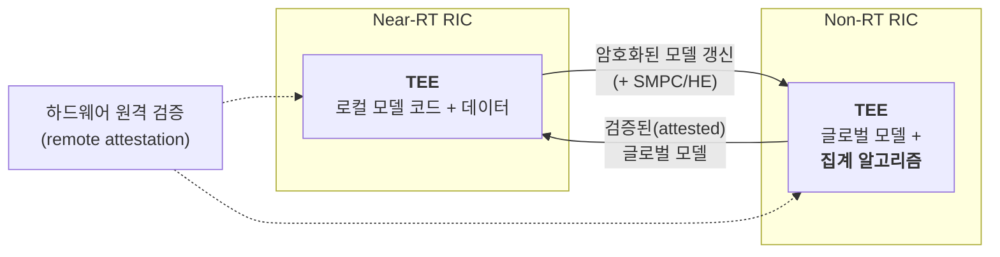
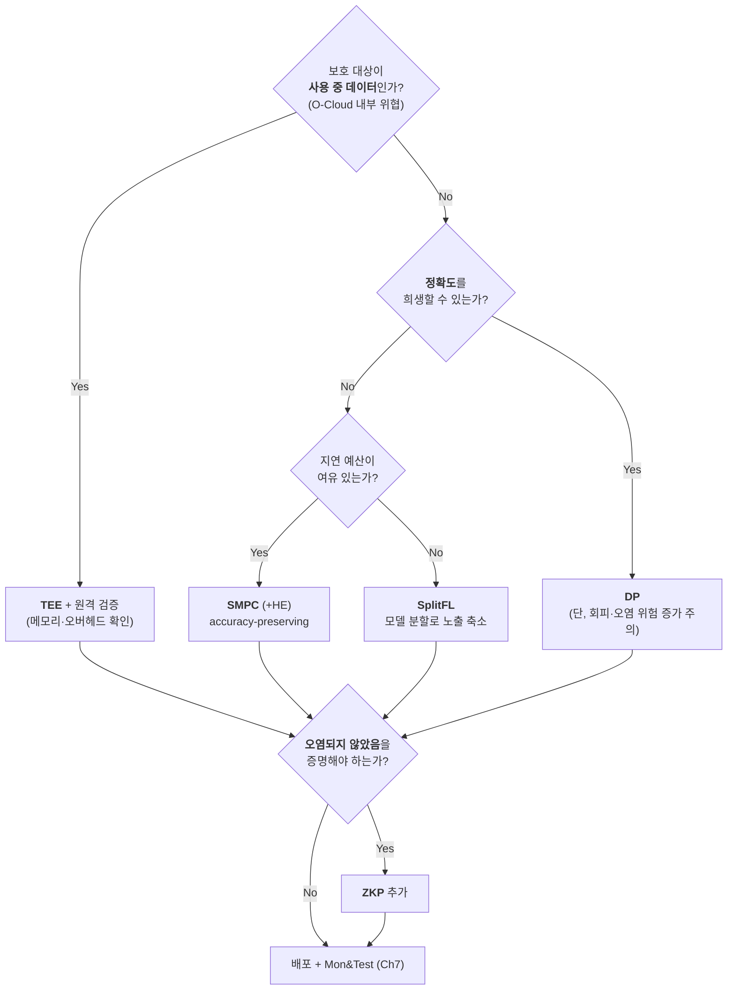

# 프라이버시 보존형 AI 및 신뢰 실행 환경(TEE)

## 들어가며 — RAN 데이터는 곧 개인정보다

RAN(Radio Access Network)[^a-ran]이 다루는 데이터의 성격을 다시 확인합니다.

| 데이터 | 왜 민감한가 |
|---|---|
| **UE-NIB 엔트리**[^a-ue-nib] | 개별 UE(User Equipment)[^a-ue] 식별자 — 가입자 식별 가능 (Ch4 **V-02**, 심각도 High) |
| RSRP[^a-rsrp]·RSRQ[^a-rsrq]·PRB[^a-prb] 사용률 시계열 | **위치·이동 패턴 추론 가능** |
| 트래픽 볼륨·QoE[^a-qoe] 패턴 | 사용 습관, 애플리케이션 추론 |
| E2 KPM(Key Performance Measurement)[^a-kpm] 시계열 | 위 모든 것의 조합 |

그리고 Ch3에서 확인했듯, O-RAN(Open Radio Access Network)[^a-o-ran]은 이 데이터로 **SMO(Service Management and Orchestration)[^a-smo] 외부에서도 모델을 학습할 수 있게** 설계되었고, FL(Federated Learning)[^a-fl] 구조에서는 **Non-RT RIC(RAN Intelligent Controller)[^a-ric]의 집계 서버가 여러 Near-RT RIC의 모델 갱신을 수집**합니다.

> **Ch6 §3.3의 그림을 떠올려 보십시오.** *honest-but-curious* FL 서버가 클라이언트 데이터를 재구성하는 공격[^r5]은, O-RAN FL 구조에서 **Non-RT RIC 집계 서버가 각 셀의 가입자 데이터를 복원**할 수 있다는 뜻입니다. FL을 "프라이버시 보존"이라 부르는 것은 **조건부**입니다.
{: .prompt-danger }

이 장의 구조:

1. PETs(Privacy-Enhancing Technologies)[^a-pets] 전경 — 무엇이 있고 각각 무엇을 지키는가
2. 분산 협력 학습 — FL의 한계와 SL(Split Learning)[^a-sl]·SplitFL(Split Federated Learning)[^a-splitfl]
3. 암호 기술 — HE(Homomorphic Encryption)[^a-he] · SMPC(Secure Multi-Party Computation)[^a-smpc] · FE(Functional Encryption)[^a-fe]
4. **TEE(Trusted Execution Environment)[^a-tee] (Confidential Computing)** — 하드웨어 신뢰 기반, 그리고 **원격 검증(ARI·RMEI[^a-rmei])**
5. 차분 프라이버시(DP, Differential Privacy)[^a-dp]
6. 영지식 증명(ZKP, Zero-Knowledge Proof)[^a-zkp]
7. 머신 언러닝과 AI(Artificial Intelligence)[^a-ai] 생성 합성 데이터
8. 위협별 PETs 선택 가이드
9. XAI(eXplainable AI)[^a-xai]의 역설 — 투명성이 만드는 새 위협 (AdvXAI[^a-advxai])

---

## 1. PETs 전경

Benzaïd 등[^r5]은 PETs를 **"멤버십 추론, 속성 추론, 데이터 재구성, 모델 탈취 공격을 완화할 잠재력을 가진 소프트웨어·하드웨어 솔루션 집합"** 으로 정의합니다.

![흔한/신흥 PETs, 핵심 잠재력, 그리고 관련 과제 (출처: Benzaïd 등[^r5], Fig. 29)](/assets/img/posts/6g-ai-ran/aisurvey-fig29.png)
_그림 9-1. **PETs 전경**. 좌측 잠재력: **Strong Data Security, Privacy by Design, Guaranteed Privacy**. 중앙 7개 기술: Encryption Technologies(HE, SMPC, FE), **Confidential Computing(TEE)**, Zero-Knowledge Proofs, Differential Privacy, Dist. Collab. Learning(FL, SL, SplitFL), Machine Unlearning, AI-generated Synthetic Data. 우측 과제: **Privacy Leakage, Computation Overhead, Accuracy Loss, Reduced AI Robustness, Communication Overhead, Limited Memory**. 출처: [^r5], Fig. 29._

### 1.1 한눈에 보는 비교표

| PET | 핵심 원리 | 방어하는 위협 | 대가(과제) |
|---|---|---|---|
| **FL** | 데이터를 이동하지 않고 모델만 교환 | 원시 데이터 반출 | **전체 모델 복제 필요 → 멤버십추론·데이터재구성·모델탈취 위험 증가** |
| **SL** (Split Learning) | 모델을 분할해 서버·클라이언트가 독립 학습, **split layer의 가중치만 교환** | 데이터·모델 부분 모두 미공유 | **FL보다 느림** — 라운드당 클라이언트 1개만 서버와 통신 |
| **SplitFL** | FL + SL 결합 (FL의 병렬 갱신 + SL의 분할) | 데이터·모델 프라이버시 강화 + 학습 시간 단축 | 구현 복잡도 |
| **HE** | 암호문 상태로 연산 | 학습·추론 데이터 기밀성, FL/SplitFL 파라미터 보호 | **계산 복잡도** (특히 FHE[^a-fhe]) |
| **SMPC** | 다자간 비공개 입력으로 공동 함수 계산 | 집계 서버·타 클라이언트로부터 파라미터 비밀 유지 | **통신·계산 비용** → O-RAN 지연 요구와 상충 |
| **FE** | 특정 함수만 암호문에서 계산, **결과는 평문으로** | 집계값의 선택적 공개 | 함수 제한 |
| **TEE** | **하드웨어 기반 검증된 격리 실행 환경** | O-Cloud 내부의 고권한 공격자까지 차단 | **제한된 메모리 + 추가 계산 오버헤드** |
| **DP** | 통제된 잡음 주입 | 멤버십 추론, 데이터 재구성 | **모델 효용·강건성 저하** → 회피·오염 위험 증가 |
| **ZKP** | 진술의 유효성만 증명, 추가 정보 미공개 | 추론·학습 과정의 무결성 증명 | **증명 생성·검증 오버헤드** |
| **Machine Unlearning** | 데이터와 그 영향을 모델에서 제거 (재학습 없이) | "잊혀질 권리" 준수, 추론·탈취·오염 대응 | **잊힌 데이터의 프라이버시 유출 위험 잔존** |
| **합성 데이터** | 통계적 성질은 유지, 민감정보 제외 | 데이터 부족 + 프라이버시 동시 해결 | **GAN[^a-gan] 생성 데이터도 실데이터 유출 위험** |

---

## 2. 분산 협력 학습 — FL의 한계

### 2.1 FL의 근본 문제

> FL은 O-RAN 같은 분해 시스템에서 **privacy-by-design 학습**을 가능하게 하는 유망한 패러다임이다. 그럼에도 **클라이언트에서 전체 모델 복제를 요구하는 FL의 근본 요건은 프라이버시 유출 위험을 증가**시켜, 멤버십 추론·데이터 재구성·모델 탈취 공격을 용이하게 한다.[^r5]
{: .prompt-warning }

O-RAN 맥락에서 이것이 의미하는 바:

| FL 구조 | 노출되는 것 |
|---|---|
| Near-RT RIC의 FL 에이전트가 **전체 모델을 보유** | **악성 xApp이 같은 RIC에 있으면 모델 전체 접근 가능** (Ch6 §1의 공격 원형) |
| Non-RT RIC 집계 서버가 모델 갱신 수집 | honest-but-curious 서버가 **각 셀 데이터 재구성 가능** |

### 2.2 Split Learning과 SplitFL

| 방식 | 프라이버시 | 속도 | O-RAN 적합성[^r5] |
|---|---|---|---|
| FL | 중간 (전체 모델 복제) | 빠름 (병렬) | 널리 쓰이지만 위험 |
| **SL** | **높음** (데이터·모델 부분 모두 미공유) | **느림** (라운드당 클라이언트 1개) | 지연 민감 시나리오에 부적합 |
| **SplitFL** | 높음 | 빠름 (FL 병렬 갱신 활용) | **"효율적·확장적·프라이버시 강화 AI 솔루션을 O-RAN에서 구현할 유망한 접근"** |

---

## 3. 암호 기술 — HE · SMPC · FE

### 3.1 동형암호 (HE)

암호문에 직접 연산을 수행하는 암호 스킴입니다[^r5].

| 종류 | 지원 연산 | 특성 |
|---|---|---|
| **PHE** (Partially HE)[^a-phe] | **한 종류만** (곱셈 또는 덧셈) | 가장 가벼움 |
| **SHE** (Somewhat HE)[^a-she] | 여러 연산, **유한 횟수** | 중간 |
| **FHE** (Fully HE) | **임의 연산, 무제한** | **최고 프라이버시, 최대 계산 오버헤드·복잡도** |

O-RAN에서의 용도[^r5]:
- 암호화된 데이터에 대한 **모델 학습·추론**
- **FL·SplitFL에서 교환되는 파라미터를 프라이버시 공격으로부터 보호**

한계: *"HE 기법의 계산 복잡도는 O-RAN에서 그 잠재력을 온전히 실현하는 데 여전히 주요한 과제"*[^r5]

### 3.2 안전한 다자 계산 (SMPC)

여러 **비신뢰 당사자**가 각자의 비공개 입력에 대해 공동으로 함수를 계산하되, 입력을 서로 공개하지 않습니다[^r5].

| 항목 | 내용 |
|---|---|
| FL에서의 역할 | **안전한 집계(secure aggregation)** — 클라이언트 모델 파라미터를 **집계 서버와 다른 클라이언트 양쪽 모두에게 비밀로 유지** |
| HE와의 결합 | **HE + SMPC 조합이 오염 공격 완화를 촉진** |
| 장점 | **본질적으로 정확도 보존(accuracy-preserving)** — DP와 달리 모델 효용을 희생하지 않음 |
| 한계 | **통신·계산 비용이 O-RAN의 엄격한 지연 요구를 충족하는 데 주요 과제** |

> **SMPC가 DP보다 나은 점**: DP는 잡음을 넣어 정확도를 희생하지만, SMPC는 정확도를 그대로 유지합니다. 대가는 통신 비용입니다. **지연 예산이 있고 정확도가 중요한 near-RT 시나리오에서는 이 트레이드오프가 결정적**입니다.
{: .prompt-tip }

### 3.3 함수 암호 (FE)

HE의 **계산 효율적 대안**으로 등장했습니다. 암호화된 데이터에 대해 **특정 함수**를 계산하고, **결과는 평문 형태로 직접 공개**됩니다[^r5]. FL 문맥에서는 **집계된 값을 선택적으로 공개**하는 데 활용됩니다.

### 3.4 양자 강화 프라이버시 — QHE와 QSMPC

Braeken 등[^r36]은 §3.1~3.2의 HE·SMPC를 양자 기술로 강화하는 최신 흐름을 짚습니다. FL이 데이터를 중앙집중하지 않고도 협력 학습을 가능하게 하지만 여전히 모델 오염·데이터 유출에 취약하다는 §2의 한계를 양자 암호가 보완하는 방향입니다.

| 기술 | 핵심 아이디어 | 현황 |
|---|---|---|
| **QHE**(Quantum Homomorphic Encryption) | AI 모델이 **암호화된 데이터를 복호화 없이 그대로 연산** — 처리 전 과정에서 민감 데이터의 기밀성 유지 | 소형 포토닉 칩 위에서의 개념증명(proof-of-concept) 구현이 보고됨 — 포토닉 칩 활용은 양자 네트워크 인프라의 크기를 줄여 향후 완전동형 양자암호(quantum FHE)로 가는 길을 닦음 |
| **QSMPC**(Quantum Secure Multi-Party Computation) | 여러 당사자가 **비공개 데이터를 노출하지 않고** AI 모델 학습에 협력 — 양자암호가 연산 자체를 보호해 안전한 협력 학습을 가능케 함 | 참여자에게 필요한 양자 자원을 최소화하는 최근 혁신으로, 최소한의 양자 능력만으로 안전한 협력 연산의 효율이 개선되어 실용화에 가까워짐 |

_표 9-0. 양자 강화 프라이버시 기술. 출처: Braeken 등[^r36]을 재구성._

> **§3.1~3.2와의 관계**: QHE·QSMPC는 고전 HE·SMPC와 **같은 문제(암호문 위에서 연산하기, 입력을 공개하지 않고 공동 계산하기)** 를 풀지만, 안전성의 근거를 계산 복잡도 가정이 아니라 **양자역학적 성질**에 둡니다. 다만 §4.7·Ch12에서 보듯 현재는 하드웨어 제약으로 소규모 개념증명 단계에 머물러 있습니다.
{: .prompt-tip }

---

## 4. TEE — 하드웨어 신뢰 기반

Ch6에서 확인한 두 위협은 **소프트웨어 방어로 막을 수 없습니다.**

- **하드웨어 트로이목마** (Ch6 §3.6, 능력 C6)
- **O-Cloud 내부의 고권한 공격자** (컨테이너 탈출, 하이퍼바이저 침해)

**Confidential Computing**은 이 지점을 겨냥합니다.

### 4.1 정의와 O-RAN에서의 가치

> Confidential Computing은 **하드웨어 기반의 검증된(attested) TEE에서 연산을 실행**하여 **사용 중(in use)** 인 민감 데이터를 보호하는 컴퓨팅 패러다임이다. TEE 내에서 실행되는 애플리케이션과 저장된 데이터에 부여되는 기밀성·무결성 특성은, 이 환경을 O-RAN의 AI 솔루션 보안·프라이버시 강화의 **핵심 인에이블러**로 만든다. 이는 **O-Cloud 인프라 내부에서 동작할 수 있는 고도로 특권화된(highly privileged) 공격자로부터도** AI 모델과 그 데이터를 보호하는 데 도움이 된다.[^r5]
{: .prompt-info }

**핵심 개념 "데이터의 세 상태"**:

| 상태 | 보호 수단 |
|---|---|
| **at rest** (저장 중) | 디스크 암호화 |
| **in transit** (전송 중) | TLS[^a-tls] / IPsec[^a-ipsec] / MACsec[^a-macsec] (Ch7 §2.5) |
| **in use** (사용 중 = 메모리에 평문으로 존재) | ← **TEE만이 여기를 보호합니다** |

### 4.2 TEE가 방어하는 공격

Benzaïd 등[^r5]이 인용한 연구들에 따르면 TEE는 **중앙집중·분산 학습 양쪽**에서 다음을 완화합니다.

- 데이터 재구성 (Data reconstruction)
- 모델 탈취 (Model stealing)
- 추론 공격 (Inference attacks)
- **오염(poisoning) 및 회피(evasion) 공격**

### 4.3 O-RAN 구체 적용 예

> O-RAN의 **FL 기반 네트워크 이상 탐지 서비스**의 안전하고 프라이버시 보존적인 학습은, **로컬·글로벌 모델의 코드와 집계 알고리즘을 TEE 내부에 저장·실행**함으로써 강화될 수 있다.[^r5]
{: .prompt-tip }

즉 Ch8 §1.1의 FCL 협력 탐지 구조(Near-RT RIC의 FL 에이전트 + Non-RT RIC의 집계 서버)를 **양쪽 모두 TEE 안에서** 돌리는 것이 이상적 설계입니다.

_그림 9-2. TEE 기반 O-RAN FL 이상탐지 설계. Benzaïd 등[^r5]의 서술을 구조화._

### 4.4 한계

> O-RAN에서 효율적인 TEE 기반 AI 서비스를 가능하게 하려면 **TEE가 도입하는 제한된 메모리와 추가 계산 오버헤드**를 해결해야 한다.[^r5]
{: .prompt-warning }

| 한계 | O-RAN에서의 구체적 문제 |
|---|---|
| **제한된 메모리** | 큰 DL(Deep Learning)[^a-dl] 모델·대용량 KPM 배치가 enclave에 안 들어감 |
| **계산 오버헤드** | near-RT 예산(10 ms~1 s) 초과 위험 → Non-RT 루프 위주 적용 |
| GPU(Graphics Processing Unit)[^a-gpu] 지원 | AI 가속기의 confidential computing 지원이 아직 제한적 (Ch2의 AI-RAN Site GPU 공유와 직결) |

### 4.5 PQ-TEE — 양자내성 시대의 TEE

§4.1의 TEE는 인텔 SGX·ARM TrustZone처럼 **고전 암호에 의존**합니다. Braeken 등[^r36]은 이것이 양자 시대에는 취약해진다고 지적합니다 — Shor 알고리즘이 실용화되면 TEE의 원격 검증·키 교환에 쓰이는 공개키 암호 자체가 깨질 수 있기 때문입니다.

| 구성요소 | 필요성 |
|---|---|
| **PQ-TEE** | 양자내성 인증 + PQC(Post-Quantum Cryptography)[^a-pqc] 암호화를 통합한 차세대 TEE — 시큐어 엔클레이브가 격자 기반 원격 검증과 양자내성 키 교환을 지원해야 함 |
| **QRNG**(Quantum Random Number Generator) | 결정론적 의사난수 대신 **진정한 무작위성**으로 암호키·인증 토큰을 생성 — 예측 공격에 대한 저항성 향상. QRNG 기반 프로토콜과 함께 동작해야 진정한 엔트로피 확보 |

_표 9-0b. PQ-TEE 구성요소. 출처: Braeken 등[^r36]을 재구성._

> **결론**: Braeken 등[^r36]은 AI 학습 데이터·모델의 무결성·인증·기밀성을 지키려면 **QKD(Quantum Key Distribution)·PQC·QRNG·PQ-TEE를 함께 통합**해야 한다고 정리합니다 — TEE 하나만으로는 양자내성이 완성되지 않습니다. QKD·PQC의 세부 내용은 **Ch12 §1~2**에서 다룹니다.
{: .prompt-tip }

### 4.6 원격 검증(Remote Attestation) — "검증된 TEE"의 그 검증

§4.1의 정의에 **"하드웨어 기반의 검증된(attested) TEE"** 라는 표현이 있었습니다. 그 **attestation**이 무엇인지, 그리고 **실시간 시스템에서 왜 어려운지**를 다루는 것이 이 절입니다.

#### 문제 — 실시간 제어 루프는 기존 원격 검증으로 커버되지 않는다

Wang 등[^r35]의 진단입니다.

> **원격 검증(remote attestation)** 은 디바이스가 자신의 무결성을 원격 검증자에게 증명할 수 있게 하는 강력한 보안 메커니즘이다. 최근 발전으로 **IoT 동작을 효율적으로 검증**하는 것이 가능해졌지만, **실시간 사이버물리 제어 루프 위에 구축되어 미션을 독립적으로 수행하는 자율 시스템은 새로운 고유 과제**를 제시한다.[^r35]
{: .prompt-warning }

> **O-RAN 번역**: 이것은 **dApp**(Ch2 §4.2, <10 ms)과 **Det-RAN**(Ch8 §2, 2 ms 제약)이 정확히 놓인 상황입니다. "이 dApp이 개조되지 않았고 정해진 시간 안에 정해진 일을 했다"를 원격에서 증명해야 하는데, 측정(measurement) 자체가 실시간 예산을 잡아먹습니다.
{: .prompt-danger }

#### RMEI — 새로운 보안 속성

Wang 등[^r35]은 **RMEI**(Real-time Mission Execution Integrity)라는 보안 속성을 정식화합니다.

| 개념 | 내용[^r35] |
|---|---|
| **RMEI** | **미션이 올바르게(correct) 그리고 적시에(timely) 수행되었다는 증명**을 제공하는 속성 |
| 문제 | 매력적인 속성이지만, **측정 비용이 실시간 자율 시스템에는 감당 불가(prohibitive)** |
| 해법 ① | **컴파트먼트(compartment) 단위의 정책 기반 검증** — **측정 상세도와 런타임 오버헤드 사이의 트레이드오프**를 가능하게 함 |
| 해법 ② | 실시간 응답성 영향 최소화를 위한 다중 기법 — **맞춤형 소프트웨어 계측(instrumentation)** 과 **재실행을 통한 타이밍 복구(timing recovery through re-execution)** |
| 평가 | **5개 CPS(Cyber-Physical System)[^a-cps] 플랫폼**에서 성능 평가 + **21명 개발자 사용성 연구**(다양한 숙련도) |

![Overview of ARI (출처: Wang 등[^r35], Fig. 2)](/assets/img/posts/6g-ai-ran/ari-fig2.png)
_그림 9-3. **ARI의 전체 구조**. 출처: [^r35], Fig. 2._

![Inter/Intra-Compartment Events Recording (출처: Wang 등[^r35], Fig. 3)](/assets/img/posts/6g-ai-ran/ari-fig3.png)
_그림 9-4. **컴파트먼트 간·내부 이벤트 기록**. "무엇을 얼마나 상세히 측정할지"를 컴파트먼트 정책으로 조절하는 것이 핵심 아이디어입니다. 출처: [^r35], Fig. 3._

![Verification on Measurement (출처: Wang 등[^r35], Fig. 4)](/assets/img/posts/6g-ai-ran/ari-fig4.png)
_그림 9-5. **측정값에 대한 검증**. 원격 검증자가 받은 측정값으로 미션 실행 무결성을 판정하는 과정입니다. 출처: [^r35], Fig. 4._

#### 오버헤드 — "얼마나 비싼가"

![Control Flow Recording Overhead (출처: Wang 등[^r35], Fig. 1)](/assets/img/posts/6g-ai-ran/ari-fig1.png)
_그림 9-6. **제어 흐름 기록의 오버헤드**. 전면 측정(full measurement)이 왜 실시간 시스템에 불가능한지를 보여주는 근거입니다. 출처: [^r35], Fig. 1._

![Tasks Execution Runtime Overhead (출처: Wang 등[^r35], Fig. 5)](/assets/img/posts/6g-ai-ran/ari-fig5.png)
_그림 9-7. 컨트롤러 기반 정책 하에서의 **태스크 실행 런타임 오버헤드**. 출처: [^r35], Fig. 5._

![Scalability Analysis (출처: Wang 등[^r35], Fig. 6)](/assets/img/posts/6g-ai-ran/ari-fig6.png)
_그림 9-8. **확장성 분석**. Ch11 §7.3의 "수백~수천 개 앱에 대한 확장 가능한 자동 검증" 요구와 이어집니다. 출처: [^r35], Fig. 6._

![Usability of ARI with Customized Policy (출처: Wang 등[^r35], Fig. 7)](/assets/img/posts/6g-ai-ran/ari-fig7.png)
_그림 9-9. **맞춤 정책 사용성** — 21명 개발자 연구 결과. 보안 메커니즘이 실제로 쓰이려면 **개발자가 정책을 쓸 수 있어야** 합니다. 출처: [^r35], Fig. 7._

#### AI-RAN에 대한 함의

| ARI의 교훈 | AI-RAN 적용 |
|---|---|
| **"correct" 만으로는 부족하고 "timely"까지 증명해야 함** | dApp/xApp이 **near-RT 예산 안에서** 올바른 결정을 했음을 증명 — Ch6 §3.7 **자원 고갈 공격의 탐지 근거**가 됩니다 |
| **정책 기반 컴파트먼트 검증**으로 상세도-오버헤드 트레이드오프 | xApp 전체를 측정하지 않고 **보안 결정 경로만** 측정 |
| 타이밍 복구·소프트웨어 계측 | 실시간 제약을 지키면서 측정하는 실용 기법 |
| 개발자 사용성이 채택을 결정 | Ch7 §5.4의 "안전한 SW 개발" 및 AIBOM(AI Bill of Materials)[^a-aibom] 자동화와 연결 |

> **Ch9 전체와의 연결**: TEE는 **"어디서 실행되는가"** 를 보장하고, 원격 검증은 **"무엇이 어떻게 실행되었는가"** 를 증명합니다. 둘은 상호 보완적이며, **하드웨어 트로이목마(Ch6 §3.6, 능력 C6)** 처럼 소프트웨어로 막을 수 없는 위협에는 **TEE + attestation 조합만이 대응 수단**입니다.
{: .prompt-tip }

---

## 5. 차분 프라이버시 (DP)

**통제된 소량의 잡음을 주입**해 개별 기여를 흐리고 민감정보를 보호하는 통계적 전략입니다[^r5].

| 특성 | 내용 |
|---|---|
| 방어 대상 | **멤버십 추론, 데이터 재구성** (중앙집중·분산 학습 모두) |
| 장점 | **단순성, 계산 효율성, 그리고 노출 가능한 정보량의 보장된 상한(guaranteed upper-bound)** |
| **O-RAN 적합 시나리오** | **데이터 익명화 보장이 의무인 경우**, 또는 **암호 기반 PETs의 계산비용·지연을 감당할 수 없는 경우** |
| 대가 | **모델 효용(utility)·강건성 저하** — 주입된 잡음이 정확도에 영향, **회피·오염 공격 위험 증가** |

> **DP의 역설**: 프라이버시를 지키려 넣은 잡음이 **적대적 강건성을 떨어뜨립니다**[^r5]. Ch6의 회피·오염 공격이 더 쉬워지는 것입니다. 즉 **PETs 선택은 프라이버시 대 무결성의 트레이드오프**이기도 합니다 — 한쪽만 보고 결정할 수 없습니다.
{: .prompt-danger }

---

## 6. 영지식 증명 (ZKP)

증명자(prover)가 검증자(verifier)에게 **진술의 유효성만** 설득하고, 진술의 건전성 외에는 **어떤 추가 정보도 공개하지 않는** 암호 프로토콜입니다[^r5].

| ZKP의 3속성 | 의미 |
|---|---|
| **Completeness** | 참인 진술은 증명 가능 |
| **Soundness** | 거짓 진술은 증명 불가 |
| **Zero-knowledge** | 추가 정보 미노출 |

O-RAN·AI 문맥의 용도:

| 용도 | 설명 |
|---|---|
| **모델 추론의 무결성 보장** | 데이터·모델 프라이버시를 유지하며 추론이 정직하게 수행되었음을 증명 |
| **학습 과정의 무결성 보장** | 학습이 규정대로 수행되었음을 증명 |
| **MLaaS 복원력**[^a-mlaas] | ML-as-a-Service의 오염·프라이버시 공격 대응 |
| **FL 오염 방어** | *"FL 문맥에서 ZKP는 클라이언트가 **자신의 로컬 모델이 오염되지 않았음(poison-free)** 을 **모델 파라미터를 공개하지 않고** 집계자에게 입증할 수 있게 한다"*[^r5] |

> **ZKP가 FL 오염 방어에 이상적인 이유**: 기존 강건 집계(robust aggregation)는 서버가 클라이언트 파라미터를 보고 이상치를 걸러내야 하므로 **프라이버시와 상충**합니다. ZKP는 파라미터를 보지 않고도 검증할 수 있게 해 **두 목표를 동시에** 달성합니다. 한계는 **증명 생성·검증의 계산 오버헤드**입니다[^r5].
{: .prompt-tip }

---

## 7. 머신 언러닝과 합성 데이터

### 7.1 머신 언러닝 (Machine Unlearning)

**모델을 처음부터 재학습하는 비용 없이**, 데이터와 그 영향을 AI 모델에서 제거하는 신흥 기술입니다[^r5].

| 구현 방식 | 기법 |
|---|---|
| **데이터 재조직(data reorganization)** | 데이터 난독화(obfuscation), 프루닝, 교체 |
| **모델 조작(model manipulation)** | 모델 프루닝, 교체, 이동(shifting) |

| 가치 | 내용 |
|---|---|
| 세분화된 프라이버시 통제 | 선택적 데이터 제거 → **진화하는 프라이버시 우려·규제에 적응하는 AI 시스템** |
| **규제 준수** | **"잊혀질 권리(right to be forgotten)"** 준수를 가능하게 함 |
| 보안 강화 | **추론·모델 탈취·데이터 오염 공격에 대한 방어** |
| 남은 위험 | **잊힌 데이터의 프라이버시 유출이 실재하는 위험**으로 남아 있음 |

> O-RAN 문맥: 가입자가 데이터 삭제를 요구하면, 그 가입자의 KPM으로 학습된 xApp 모델에서 **그 영향을 제거**해야 합니다. 재학습에는 시간·비용이 들고 near-RT 서비스를 중단시킬 수 있으므로 언러닝이 현실적 해법입니다.
{: .prompt-info }

### 7.2 AI 생성 합성 데이터

**실데이터의 통계적 성질은 유지하면서 프라이버시 민감 정보는 제외한** 데이터를 생성합니다[^r5].

| 항목 | 내용 |
|---|---|
| 해결하는 문제 | **데이터 희소성 + 프라이버시 우려 동시 해결** — 엄격한 데이터 공유 규제를 준수하면서 고정확도 AI 구축 |
| 기법 | **VAE(Variational AutoEncoder)[^a-vae], GAN** — 제한된 과거 데이터로 현실적 합성 데이터를 효율 생성 |
| 방어 효과 | **데이터 재구성, 멤버십/속성 추론, 모델 탈취 위험 감소** |
| 한계 | **GAN 생성 데이터도 실데이터 프라이버시 유출 위험이 여전히 존재** |

> **Ch8과의 연결**: 재밍·공격 샘플이 희소해 학습이 어렵다는 문제(Bayesian 인과추론으로 우회한 사례[^r5])를 합성 데이터로 풀 수 있습니다. 즉 합성 데이터는 **프라이버시 도구이면서 동시에 탐지 성능 도구**입니다.
{: .prompt-tip }

---

## 8. 위협별 PETs 선택 가이드

| 표적 위협 | 1순위 PET | 2순위 | 선택 근거 |
|---|---|---|---|
| **멤버십 추론** | **DP** | 합성 데이터, TEE | DP의 보장된 상한이 명확 |
| **속성 추론** | DP, 합성 데이터 | XAI 기반 탐지[^r5] | — |
| **데이터 재구성** | **TEE**, SMPC | DP, SL/SplitFL | in-use 보호가 근본적 |
| **모델 탈취** | **TEE** | 합성 데이터, 언러닝 | 모델 자체를 격리 |
| **FL 오염** | **ZKP** (파라미터 비공개 검증) | HE+SMPC 조합 | 프라이버시·무결성 동시 |
| **O-Cloud 내부 고권한 공격자** | **TEE (+원격 검증)** | — | SW 방어 불가 |
| **하드웨어 트로이목마 (C6)** | **TEE 원격 검증 + AI-BOM** (Ch7) | — | SW 방어 불가 |
| **규제 대응 (잊혀질 권리)** | **머신 언러닝** | — | 재학습 비용 회피 |
| 지연 예산이 극도로 촉박 | **DP** | — | 암호 PETs 비용 감당 불가 시 |
| 정확도를 희생할 수 없음 | **SMPC** (accuracy-preserving) | TEE | DP는 부적합 |

### 8.1 결정 흐름

_그림 9-10. PETs 선택 결정 흐름. Benzaïd 등[^r5]의 특성·한계 서술을 근거로 구성한 실무 가이드._

> **가장 중요한 원칙**: Benzaïd 등[^r5]의 lessons learned는 단호합니다 — ***"제시된 ML 보안 인에이블러들은 유망한 방어 능력을 보이지만, 그 어느 것도 모든 AI 위협에 대한 은탄환(silver defense)이 될 수 없으며, 이는 다면적(multifaceted) 접근의 필요성을 강조한다."*** 그래서 이들을 결합한 것이 **ZT-AI Shield**(Ch7)입니다.
{: .prompt-danger }

---

## 9. XAI의 역설 — 투명성이 만드는 새 위협 (AdvXAI)

Ch7에서 XAI를 방어 인에이블러로 소개했습니다. 그런데 **설명은 공격자에게도 유용합니다.**

![XAI 접근법의 분류체계 — AdvXAI 포함 (출처: Benzaïd 등[^r5], Fig. 28)](/assets/img/posts/6g-ai-ran/aisurvey-fig28.png)
_그림 9-11. **XAI 분류체계**. Scope(Local/Global), Portability(Model-specific/Model-agnostic), Stage(Intrinsic/Post-hoc), Modality(Surrogate Model/Visualisation/Text/Arguments), 그리고 **AdvXAI**를 **As Attacker / As a Defender** 로 구분 — 회피·오염·추론 공격·모델 탈취 각각에 대해 XAI가 양방향으로 작동합니다. 출처: [^r5], Fig. 28._

### 9.1 XAI를 방어로 쓴 사례

| 대상 위협 | XAI 활용 |
|---|---|
| **회피 공격** | 가장 많은 연구. **model-centric**(모델 특성 활용) / **data-centric**(데이터 특성 활용)로 대별. 최근 연구는 **post-hoc·model-agnostic XAI로 DL 기반 6G 무선자원관리 모델을 겨냥한 white-box 적대적 예제 탐지**를 실증[^r5] |
| **데이터 오염** | 얕은 ML(Machine Learning)[^a-ml]의 **라벨 플리핑 오염 설명**, **SHAP[^a-shap]으로 DL 기반 네트워크 분류 모델의 데이터 오염 식별**[^r5] |
| **FL 모델 오염** | post-hoc·model-specific·local XAI로 FL의 모델 오염 복원력 강화. **SHAP 설명으로 오염 FL 클라이언트를 판별하는 SVM(Support Vector Machine)[^a-svm] 분류기** 구축. SHAP 기반 특징 기여도로 **오염 FL 클라이언트를 무력화** — **5G-NIDD** 등 데이터셋으로 검증[^r5] |
| **멤버십 추론 / 속성 추론** | 공격 규명·방어에 활용[^r5] |

### 9.2 XAI를 공격으로 쓴 사례 — AdvXAI

> XAI가 가능하게 하는 **투명성은 양날의 검**이다. O-RAN의 AI 보안 강화에 도움이 되는 한편, **새로운 종류의 XAI 지원 적대적 공격**의 문을 연다. 실제로 설명은 표적 AI 지원 시스템의 **내재적 취약점을 노출**시키는 것을 상당히 용이하게 하여, 공격자가 무결성·가용성·프라이버시를 침해하는 정교한 적대적 전략을 구축할 수 있게 한다.[^r5]
{: .prompt-danger }

| 확인된 공격 | 내용 |
|---|---|
| XAI 지원 **회피 공격** | 설명으로 결정 경계를 파악해 최소 섭동 효율 향상 |
| XAI 지원 **데이터 오염** | 어떤 샘플을 오염시키면 효과가 큰지 파악 |
| XAI 지원 **프라이버시 공격** | 멤버십 추론, 속성 추론, **데이터 재구성**, 모델 탈취 |
| **XAI 자체에 대한 공격** | XAI 방법도 회피·오염 공격에 취약 → **AdvXAI** 라는 새 연구 방향 |

### 9.3 결론 — 균형점 찾기

> 따라서 O-RAN에서 XAI의 이익을 얻으려면 **정확도, 투명성, 강건성, 프라이버시 보존 사이의 균형을 이루는 XAI 방법의 개발이 무엇보다 중요**하다.[^r5]
{: .prompt-warning }

| 실무 지침 | 내용 |
|---|---|
| **설명의 접근 통제** | XAI 출력도 민감 자산 — Ch7의 RBAC(Role-Based Access Control)[^a-rbac] 대상에 포함 |
| 설명 세분도 조절 | 운영자에게는 상세, 외부 소비자(Y1)에게는 축약 |
| AdvXAI 대응 | 설명 자체의 무결성 검증 필요 |

---

## 10. 이 장의 요약

- RAN 데이터는 **UE 식별자·위치·이동 패턴을 담은 개인정보**이고, O-RAN은 이 데이터로 **SMO 외부 학습**과 **FL 집계**를 허용하도록 설계되었습니다.
- **FL은 조건부 프라이버시 보존**입니다 — 전체 모델 복제 요건이 멤버십추론·재구성·탈취 위험을 키웁니다. **SL**은 split layer 가중치만 교환해 프라이버시를 높이지만 느리고, **SplitFL**이 둘의 절충으로 O-RAN에 유망합니다[^r5].
- 암호 PETs: **HE**(PHE/SHE/FHE, 계산 복잡도), **SMPC**(정확도 보존, 통신비용), **FE**(HE의 효율적 대안, 결과 평문 공개).
- **TEE는 "사용 중(in use)" 데이터를 보호하는 유일한 수단**이며, **O-Cloud 내부 고권한 공격자와 하드웨어 트로이목마**에 대한 실질적 대응입니다. O-RAN FL 이상탐지의 로컬·글로벌 모델과 집계 알고리즘을 TEE 안에서 실행하는 설계가 제시됩니다. 한계는 **제한된 메모리와 계산 오버헤드**[^r5].
- **DP**는 단순·효율적이고 정보 노출 상한을 보장하지만, **잡음이 모델 강건성을 떨어뜨려 회피·오염 위험을 높입니다** — 프라이버시 대 무결성 트레이드오프.
- **ZKP**는 FL에서 **파라미터를 공개하지 않고 오염되지 않았음을 증명**할 수 있어, 프라이버시와 무결성을 동시에 달성합니다.
- **머신 언러닝**은 "잊혀질 권리"를 재학습 없이 지원하고, **합성 데이터**는 데이터 희소성과 프라이버시를 함께 해결합니다(단 둘 다 잔여 유출 위험 존재).
- **원격 검증**은 TEE를 보완합니다. ARI[^r35]는 **RMEI**(Real-time Mission Execution Integrity) — *미션이 **올바르게 그리고 적시에** 수행되었다는 증명* — 을 정식화하고, **컴파트먼트 단위 정책 기반 검증**으로 측정 상세도와 런타임 오버헤드를 트레이드오프합니다. dApp의 2 ms급 실시간 제약에서 무결성을 증명하려면 이 접근이 필요합니다.
- **은탄환은 없습니다** — 다면적 접근(ZT-AI Shield)이 필요합니다.
- **XAI는 양날의 검**입니다. 방어(회피·오염·FL 오염 클라이언트 판별)에 강력하지만, **AdvXAI**라는 새 공격 계열을 낳았습니다.
- **양자 강화 프라이버시**: **QHE**(복호화 없이 암호문 연산)와 **QSMPC**(최소 양자자원으로 안전한 협력 계산)가 HE·SMPC의 양자 버전으로 등장했으나 아직 소규모 개념증명 단계입니다[^r36].
- **PQ-TEE**: 고전 TEE의 원격 검증·키 교환은 양자 컴퓨터에 취약해질 수 있어, **PQC 통합 + QRNG 기반 진정한 무작위성**이 결합된 차세대 TEE가 필요합니다. QKD·PQC·QRNG·PQ-TEE **넷을 함께** 통합해야 완전한 양자내성이 성립합니다[^r36].

### 확인 체크리스트

- [ ] FL이 왜 "조건부" 프라이버시 보존인지 설명할 수 있는가
- [ ] SL과 SplitFL의 차이, 그리고 각각의 속도·프라이버시 특성을 말할 수 있는가
- [ ] TEE가 보호하는 "데이터의 세 번째 상태"가 무엇인지 설명할 수 있는가
- [ ] DP가 왜 회피·오염 위험을 높이는지 설명할 수 있는가
- [ ] ZKP가 FL 오염 방어에서 강건 집계보다 나은 점을 설명할 수 있는가
- [ ] 자신의 시나리오에 대해 §8.1 결정 흐름을 따라갈 수 있는가
- [ ] TEE(어디서 실행)와 원격 검증(무엇이 어떻게 실행)의 역할 차이를 설명할 수 있는가
- [ ] RMEI에서 "timely"가 왜 보안 속성인지 설명할 수 있는가
- [ ] AdvXAI가 무엇이고 왜 생겼는지 설명할 수 있는가
- [ ] QHE·QSMPC가 고전 HE·SMPC와 무엇을 공유하고 무엇이 다른지 설명할 수 있는가
- [ ] PQ-TEE에 QRNG가 왜 필요한지 설명할 수 있는가

**다음 장**: [10. 6G AI-RAN 보안 정형 검증 및 컴플라이언스](/posts/airan-10-formal-verification/) — Part IV 시작

---

### 약어

[^a-ran]: **RAN**(Radio Access Network): 무선 접속망 — 단말과 코어망 사이에서 무선 구간의 연결을 담당하는 네트워크 영역으로, 기지국과 안테나 등으로 구성됩니다.
[^a-ue-nib]: **UE-NIB**(UE-Network Information Base): Near-RT RIC이 유지·관리하는 단말 관련 정보 데이터베이스로, 개별 단말의 식별자와 상태 정보를 담고 있어 프라이버시 민감도가 높습니다.
[^a-ue]: **UE**(User Equipment): 스마트폰처럼 이동통신망에 접속하는 사용자 단말을 가리키는 3GPP 표준 용어입니다.
[^a-rsrp]: **RSRP**(Reference Signal Received Power): 단말이 측정하는 기지국 기준 신호의 수신 전력 지표입니다.
[^a-rsrq]: **RSRQ**(Reference Signal Received Quality): 수신 전력과 간섭 수준을 함께 반영한 기준 신호 수신 품질 지표입니다.
[^a-prb]: **PRB**(Physical Resource Block): 무선 자원 스케줄링·할당의 기본 단위가 되는 물리 자원 블록입니다.
[^a-qoe]: **QoE**(Quality of Experience): 사용자가 실제로 체감하는 서비스 품질을 나타내는 지표입니다.
[^a-kpm]: **KPM**(Key Performance Measurement): E2 인터페이스로 수집되는 핵심 성능 측정치로, O-RAN에서 AI/ML 학습·추론의 주요 입력 데이터입니다.
[^a-o-ran]: **O-RAN**(Open Radio Access Network): 무선 접속망을 개방형 표준 인터페이스로 분해해 다중 벤더 생태계와 지능형 제어를 지향하는 개방형 RAN 아키텍처입니다.
[^a-smo]: **SMO**(Service Management and Orchestration): O-RAN에서 망 전체의 비실시간 관리·오케스트레이션을 담당하는 최상위 관리 계층으로, Non-RT RIC을 포함합니다.
[^a-fl]: **FL**(Federated Learning): 연합학습 — 원시 데이터를 중앙으로 모으지 않고 각 참여자가 로컬에서 학습한 모델 갱신만 교환·집계하는 분산 학습 기법입니다.
[^a-ric]: **RIC**(RAN Intelligent Controller): RAN을 지능적으로 제어·최적화하는 O-RAN의 핵심 컨트롤러로, Near-RT RIC(10ms~1s)과 Non-RT RIC(1s 이상)으로 나뉩니다.
[^a-pets]: **PETs**(Privacy-Enhancing Technologies): 프라이버시 강화 기술 — 멤버십 추론·데이터 재구성 같은 프라이버시 공격을 완화하는 소프트웨어·하드웨어 기술의 총칭입니다.
[^a-sl]: **SL**(Split Learning): 분할 학습 — 모델을 나누어 클라이언트와 서버가 각자 일부만 학습하고 분할 지점의 값만 교환하는 분산 학습 기법입니다.
[^a-splitfl]: **SplitFL**(Split Federated Learning): 연합학습(FL)의 병렬 갱신과 분할 학습(SL)의 모델 분할을 결합한 하이브리드 분산 학습 기법입니다.
[^a-he]: **HE**(Homomorphic Encryption): 동형암호 — 복호화 없이 암호문 상태에서 직접 연산을 수행할 수 있게 하는 암호 기술입니다.
[^a-smpc]: **SMPC**(Secure Multi-Party Computation): 안전한 다자간 계산 — 여러 당사자가 각자의 입력을 서로 공개하지 않고 공동으로 함수를 계산하는 암호 프로토콜입니다.
[^a-fe]: **FE**(Functional Encryption): 함수 암호 — 암호문에 대해 특정 함수의 결과만 계산해 평문으로 얻도록 허용하는 암호 기술입니다.
[^a-tee]: **TEE**(Trusted Execution Environment): 신뢰 실행 환경 — 하드웨어 기반 격리로 실행 중인 코드와 데이터의 기밀성·무결성을 보호하는 실행 환경입니다.
[^a-rmei]: **RMEI**(Real-time Mission Execution Integrity): 실시간 시스템의 미션이 올바르게, 그리고 정해진 시간 안에 수행되었음을 원격으로 증명하는 보안 속성입니다.
[^a-dp]: **DP**(Differential Privacy): 차분 프라이버시 — 통제된 잡음을 주입해 개별 데이터의 기여를 숨기면서, 노출 가능한 정보량의 수학적 상한을 보장하는 기법입니다.
[^a-zkp]: **ZKP**(Zero-Knowledge Proof): 영지식 증명 — 진술이 참이라는 사실 외의 어떤 추가 정보도 공개하지 않고 그 유효성을 증명하는 암호 프로토콜입니다.
[^a-ai]: **AI**(Artificial Intelligence): 인공지능 — 학습·추론·인지 등 인간의 지적 능력을 컴퓨터로 구현하는 기술의 총칭입니다.
[^a-xai]: **XAI**(eXplainable AI): 설명 가능 인공지능 — AI 모델의 판단 근거를 사람이 이해할 수 있는 형태로 제시하는 기술입니다.
[^a-advxai]: **AdvXAI**(Adversarial XAI): XAI가 제공하는 설명을 공격에 악용하거나 XAI 기법 자체를 공격 대상으로 삼는 적대적 XAI 연구 분야입니다.
[^a-fhe]: **FHE**(Fully Homomorphic Encryption): 완전동형암호 — 임의의 연산을 횟수 제한 없이 암호문 상태로 수행할 수 있는 동형암호입니다.
[^a-gan]: **GAN**(Generative Adversarial Network): 생성적 적대 신경망 — 생성자와 판별자가 경쟁적으로 학습하며 실데이터와 유사한 합성 데이터를 만들어내는 생성 모델입니다.
[^a-phe]: **PHE**(Partially Homomorphic Encryption): 부분동형암호 — 덧셈 또는 곱셈 중 한 종류의 연산만 암호문 상태로 지원하는 동형암호입니다.
[^a-she]: **SHE**(Somewhat Homomorphic Encryption): 여러 종류의 연산을 유한 횟수까지만 암호문 상태로 지원하는 동형암호입니다.
[^a-tls]: **TLS**(Transport Layer Security): 전송 계층에서 통신의 기밀성·무결성·인증을 제공하는 표준 보안 프로토콜입니다.
[^a-ipsec]: **IPsec**(Internet Protocol Security): IP 계층에서 패킷 단위의 암호화·인증을 제공하는 보안 프로토콜 모음입니다.
[^a-macsec]: **MACsec**(Media Access Control Security): 이더넷 링크(2계층)에서 프레임 단위 암호화·무결성 보호를 제공하는 IEEE 802.1AE 표준입니다.
[^a-dl]: **DL**(Deep Learning): 딥러닝 — 다층 신경망으로 데이터의 복잡한 표현을 학습하는 기계학습의 한 분야입니다.
[^a-gpu]: **GPU**(Graphics Processing Unit): 대규모 병렬 연산에 특화된 프로세서로, AI 모델의 학습·추론 가속에 널리 사용됩니다.
[^a-cps]: **CPS**(Cyber-Physical System): 사이버물리시스템 — 컴퓨팅 요소와 물리 프로세스가 실시간으로 결합·상호작용하는 시스템입니다.
[^a-aibom]: **AIBOM**(AI Bill of Materials): AI 모델·데이터셋·라이브러리 등 AI 시스템 구성요소의 명세 목록으로, 소프트웨어 SBOM(Software Bill of Materials) 개념을 AI 공급망으로 확장한 것입니다.
[^a-mlaas]: **MLaaS**(Machine Learning as a Service): 기계학습 모델의 학습·추론 기능을 클라우드 서비스 형태로 제공하는 방식입니다.
[^a-vae]: **VAE**(Variational AutoEncoder): 변분 오토인코더 — 데이터의 잠재 확률 분포를 학습해 새로운 샘플을 생성하는 생성 모델입니다.
[^a-ml]: **ML**(Machine Learning): 기계학습 — 명시적 프로그래밍 없이 데이터로부터 패턴을 학습해 예측·판단을 수행하는 기술입니다.
[^a-shap]: **SHAP**(SHapley Additive exPlanations): 게임이론의 섀플리 값에 기반해 각 입력 특징이 모델 예측에 기여한 정도를 정량화하는 XAI 기법입니다.
[^a-svm]: **SVM**(Support Vector Machine): 서포트 벡터 머신 — 클래스 간 마진을 최대화하는 결정 경계를 학습하는 고전적 기계학습 분류 알고리즘입니다.
[^a-rbac]: **RBAC**(Role-Based Access Control): 역할 기반 접근 통제 — 개별 사용자가 아니라 역할(role)에 권한을 부여해 접근을 관리하는 모델입니다.
[^a-pqc]: **PQC**(Post-Quantum Cryptography): 양자내성암호 — 양자컴퓨터의 공격에도 안전하도록 설계된 차세대 암호 알고리즘군입니다.

## References

[^r35]: J. Wang, Y. Wang, A. Li, Y. Xiao, R. Zhang, W. Lou, Y. T. Hou, and N. Zhang, "ARI: Attestation of real-time mission execution integrity," in *Proc. 32nd USENIX Security Symposium*, Anaheim, CA, USA, Aug. 2023.
[^r5]: C. Benzaïd, T. Taleb, R. Cavalcanti, and A. Sánchez, "AI in Open RAN security: Enabler and threat — A comprehensive survey and future perspectives," *TechRxiv preprint*, Dec. 2025.
[^r36]: A. Braeken, D. Deac, T. L. Nguyen, G. Gür, Q.-V. Pham, C. Yapa, P. G. Vinueza-Naranjo, H. Carvajal Mora, C. Moremada, and M. Liyanage, "6G AI security: From fundamentals to offensive and defensive landscape in 6G," *IEEE Communications Surveys & Tutorials*, vol. 28, 2026.
