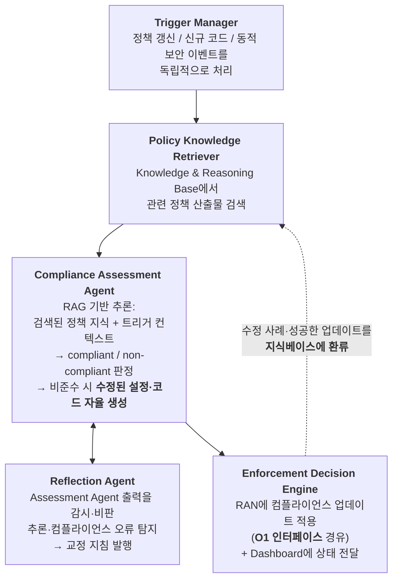

# 6G AI-RAN 보안 정형 검증 및 자율 컴플라이언스

## 들어가며 — 자율 시스템에 "증명"이 필요한 이유

Ch8에서 자율 완화(self-healing)를 다뤘고, Ch5에서 LLM(Large Language Model)[^a-llm] 에이전트가 망을 직접 제어하는 미래를 봤습니다. 그렇다면 다음 질문은 피할 수 없습니다.

> **에이전트가 내린 결정이 안전 경계를 벗어나지 않는다는 것을 어떻게 보장하는가?**
{: .prompt-warning }

Tang 등[^r15]은 이 질문에 대한 답을 세 층으로 제시합니다.

| 검증 층 | 시점 | 방법 |
|---|---|---|
| **Offline Certification** | 배포 전 | **도구의 안전 제약을 정형 검증**(formally verify)해 안전 운영 경계 확립 |
| **Digital Twin Verification** | 실행 전 | **디지털 트윈에서 제어 계획을 시뮬레이션·검증** |
| **Online Guards / Isolation** | 런타임 | 런타임 모니터, **시간 논리(temporal logic) 검사기**, 이상 탐지기 + **격리 실행** |

이 장의 구조:

1. 정형 검증 계층 3층 + **실제 도구**
   - 1.3 **CoreScan** — 5G 접근통제 정형 분석, 61속성 검증, **5개 신규 권한상승 취약점 계열**
   - 1.4 **ORANalyst** — O-RAN(Open Radio Access Network)[^a-o-ran] 구현 체계적 테스팅, **19개 신규 취약점**
   - 1.5 정형검증·테스팅·가드레일의 역할 분담
2. **자율 컴플라이언스** — Agentic AI(Artificial Intelligence)[^a-ai]로 3GPP(3rd Generation Partnership Project)[^a-3gpp]/O-RAN 규격 준수를 자동 검증
3. 가드레일 기술 전경 — 모델 수준 vs 에이전트 수준
4. 6G 애플리케이션 패턴별 가드레일 매핑
5. 구체적 가드레일 시스템 — NeMo Guardrails, GuardAgent, 인과 설명 가드레일
6. **가드레일의 함정** — 가드레일 DoS(Denial of Service)[^a-dos], 캘리브레이션 실패, 전이성 부족
7. 정형 검증의 남은 공백

---

## 1. 정형 검증 계층 3층과 실제 도구

### 1.1 왜 세 층이 필요한가

각 층은 서로를 대체할 수 없습니다.

| 층 | 강점 | 한계 |
|---|---|---|
| **Offline Certification** | 수학적 보장. 배포 전 전면 검증 | **상태 공간 폭발** — 실제 RAN(Radio Access Network)[^a-ran] 규모에서 전체 검증 불가. 명세되지 않은 상황 미포함 |
| **Digital Twin Verification** | 실제 환경 근사, 시나리오 유연 | **트윈-실물 불일치**(fidelity gap). 트윈에 없는 조건에서 실패 |
| **Online Guards** | 실제 조건에서 동작 | **사후적** — 이미 요청이 들어온 뒤. 지연·오탐 비용 |

세 층은 **정형 인증 → 디지털 트윈 검증 → 온라인 가드 → 실제 RAN 제어 실행** 순으로 직렬 배치되며, 런타임에서 발견된 실패 사례는 다시 정형 명세로 환류되어야 합니다.

### 1.2 도구 안전 경계의 정형 검증 (Offline Certification)

Tang 등[^r15]은 **악성 도구 실행 방지**를 위한 네 가지 안전장치를 제시합니다.

| 안전장치 | 내용 |
|---|---|
| **Offline Certification** | **도구의 안전 제약을 정형 검증**(formally verify the safety boundary or constraints of tools) |
| **Online Guards** | 가드레일 규칙, **시간 논리 모니터**, AI/ML 탐지기 또는 에이전트 전·후처리기 도입 |
| **Online Verification** | **디지털 트윈에서 도구 호출을 검증** |
| **Online Isolation** | **세분화된 데이터/메모리 접근 제어를 갖춘 격리 환경에서 도구·프로그램 실행** |

> **RAN 문맥의 번역**: "도구"는 E2 제어 요청, A1 정책 생성, O1 설정 변경 같은 **실제 망 제어 API(Application Programming Interface)[^a-api]**입니다. 즉 "이 API 호출이 허용 가능한 파라미터 범위 안에 있는가"를 정형적으로 명세하고 검증하는 것입니다. Ch7 §2.5의 **A1 스키마·범위 검증**이 이 개념의 가장 기초적 형태입니다.
{: .prompt-tip }

### 1.3 CoreScan — 5G 접근통제의 정형 분석

**"정형 검증이 실제로 무엇을 찾아내는가"** 를 보여주는 대표 연구입니다. Akon 등[^r33]은 5G 코어의 접근통제 메커니즘을 정형 분석하는 프레임워크 **CoreScan**을 개발했습니다.

#### 왜 5GC 접근통제인가 — 과권한(over-privilege) 문제

> 5GC의 근본적 보안 과제는 **과권한(over-privilege)** 문제이며, 이는 서비스 제공자 또는 **제3자 테넌트가 통제하는 악성·오작동 NF**가 다른 NF의 자원·서비스에 **의도되지 않은 또는 부당한 접근**을 얻을 때 전형적으로 발생한다.[^r33]
{: .prompt-danger }

> **왜 이것이 AI-RAN 문제인가**: 5GC(5G Core)[^a-5gc]의 **SBA**(Service-Based Architecture)[^a-sba]에서 NF(Network Function)[^a-nf]는 가상·클라우드 환경에서 동작하는 소프트웨어 서비스이고, 5G는 **제3자 기업이 5GC를 활용·기여하도록 초대**합니다[^r33]. 이 구조는 Ch2에서 본 O-RAN의 **SMOS 기반 서비스화 SMO(Service Management and Orchestration)[^a-smo]**와 **제3자 xApp/rApp**과 **정확히 동형(isomorphic)** 입니다. 즉 CoreScan이 5GC에서 찾은 과권한 취약점 계열은 **O-RAN의 R1/SMOS/A1에서도 성립할 가능성이 높습니다.**
{: .prompt-warning }

![Simplified 5G system architecture (출처: Akon 등[^r33], Fig. 1)](/assets/img/posts/6g-ai-ran/chaos-fig1.png)
_그림 10-1. 단순화한 5G 시스템 아키텍처 — 비로밍(파랑)에서 UE가 5G 코어(초록)에 연결되는 구조. 출처: [^r33], Fig. 1._

![Access control interactions between NFs (출처: Akon 등[^r33], Fig. 2)](/assets/img/posts/6g-ai-ran/chaos-fig2.png)
_그림 10-2. **NF 간 접근통제 상호작용**. 이 상호작용 집합이 정형 모델의 대상입니다. 출처: [^r33], Fig. 2._

#### 방법론 — 조합적 검증(compositional verification)

정형 검증의 최대 난제는 **상태 공간 폭발**입니다. CoreScan은 이를 다음으로 해결합니다[^r33].

| 기법 | 내용 |
|---|---|
| **최초의 포괄적 정형 모델** | 5GC 접근통제에 대해 **간접 통신 모드(indirect communication)와 5G 로밍을 함께 고려**한 첫 모델 |
| **조합적 검증 + assume-guarantee 추론** | 전역 속성이 주어지면 시스템 모델을 **여러 개의 서로소(disjoint) 구성요소로 분해** |
| **split assertion 원리** | 전역 속성으로부터 **국소 가정(local assumption)과 국소 보장(local guarantee)** 을 식별 |
| **건전성 조건** | *"모델의 전역 보안 속성은 전역 속성에서 파생된 **모든 국소 보장이 각자의 구성요소에서 검증될 때, 그리고 그때에만** 성립한다"* |
| **구성 가능한 공격자 모델** | **다양한 공격자 능력 하에서** 접근통제 속성을 평가 가능 (Ch4의 능력 차원 C1~C8과 대응) |

![Simplified Abstract model M of the comprehensive 5GC access control mechanism (출처: Akon 등[^r33], Fig. 5)](/assets/img/posts/6g-ai-ran/chaos-fig5.png)
_그림 10-3. **5GC 접근통제 메커니즘의 단순화 추상 모델 M** — 모든 기능을 결합한 포괄 모델. 출처: [^r33], Fig. 5._

![Schematic of the bare-bone component M0 (출처: Akon 등[^r33], Fig. 6)](/assets/img/posts/6g-ai-ran/chaos-fig6.png)
_그림 10-4. **기본 구성요소 M₀의 개요**. 회색 영역이 프로토콜 모듈을 캡슐화합니다 — 조합적 검증의 분해 단위입니다. 출처: [^r33], Fig. 6._

![CoreScan workflow for an iteration (출처: Akon 등[^r33], Fig. 4)](/assets/img/posts/6g-ai-ran/chaos-fig4.png)
_그림 10-5. **CoreScan의 반복 워크플로**. 출처: [^r33], Fig. 4._

#### 결과 — 5개의 새로운 권한 상승 취약점 계열

> 우리는 CoreScan으로 **61개 접근통제 속성**을 테스트하여 5G 표준에서 **다섯 가지 새로운 유형(classes)의 악용 가능한 권한 상승(privilege escalation) 취약점**을 발견했다. 추가로, **직접 통신에서 이미 알려진 대부분의 과권한 취약점이 간접 통신과 로밍 환경에도 확장됨**을 확인했다.[^r33]
{: .prompt-danger }

발견된 공격의 메시지 흐름이 논문에 개별 그림으로 제시됩니다.

![Message flow for Coarse Scope Attack (출처: Akon 등[^r33], Fig. 8)](/assets/img/posts/6g-ai-ran/chaos-fig8.png)
_그림 10-6. **Coarse Scope Attack** — 토큰 스코프가 지나치게 넓게 발급되는 것을 악용. 출처: [^r33], Fig. 8._

![Message flow for NFProfile Leakage Attack (출처: Akon 등[^r33], Fig. 9)](/assets/img/posts/6g-ai-ran/chaos-fig9.png)
_그림 10-7. **NFProfile Leakage Attack**. 출처: [^r33], Fig. 9._

![Message flow for CCA Replay Attack (출처: Akon 등[^r33], Fig. 10)](/assets/img/posts/6g-ai-ran/chaos-fig10.png)
_그림 10-8. **CCA Replay Attack** — Client Credentials Assertion 재전송. 출처: [^r33], Fig. 10._

![Message flow for CCA Evasion Attack (출처: Akon 등[^r33], Fig. 11)](/assets/img/posts/6g-ai-ran/chaos-fig11.png)
_그림 10-9. **CCA Evasion Attack**. 출처: [^r33], Fig. 11._

![Message flow for Forced NF Selection Attack (출처: Akon 등[^r33], Fig. 12)](/assets/img/posts/6g-ai-ran/chaos-fig12.png)
_그림 10-10. **Forced NF Selection Attack**. 출처: [^r33], Fig. 12._

![Message flow demonstrating the motivating attack example (출처: Akon 등[^r33], Fig. 3)](/assets/img/posts/6g-ai-ran/chaos-fig3.png)
_그림 10-11. 동기 부여 공격 예시의 메시지 흐름 — AMF가 consumer, SMF가 producer인 경우. 출처: [^r33], Fig. 3._

![Simplified message flow for different communication models (출처: Akon 등[^r33], Fig. 15)](/assets/img/posts/6g-ai-ran/chaos-fig15.png)
_그림 10-12. **통신 모델별 메시지 흐름** — (a) 간접 통신 등. **간접 통신과 로밍으로 확장되면 알려진 취약점이 되살아납니다.** 출처: [^r33], Fig. 15._

![Performance comparison of CoreScan (출처: Akon 등[^r33], Fig. 13)](/assets/img/posts/6g-ai-ran/chaos-fig13.png)
_그림 10-13. CoreScan과 기존 검증 도구의 성능 비교 — 조합적 검증이 실제로 확장성을 주는지에 대한 근거. 출처: [^r33], Fig. 13._

> **Ch7과 이어 읽기**: CoreScan이 찾은 취약점의 상당수는 **OAuth 2.0 토큰 기반 인가**(스코프, CCA(Client Credentials Assertion)[^a-cca])와 관련됩니다. Ch7 §5.2에서 본 **RIC OAuth 2.0 인가 흐름**이 동일한 프레임워크를 쓰므로, **"O-RAN의 OAuth 2.0 흐름도 정형 검증되어야 한다"** 는 것이 이 절의 실천적 결론입니다.
{: .prompt-tip }

### 1.4 ORANalyst — O-RAN 구현에 대한 체계적 테스팅

정형 검증이 **표준(specification)** 의 결함을 찾는다면, 퍼징·테스팅은 **구현(implementation)** 의 결함을 찾습니다. Yang 등[^r34]의 **ORANalyst**는 후자에 대한 최초의 체계적 프레임워크입니다.

> 우리는 O-RAN 구현의 **강건성(robustness)과 운영 무결성(operational integrity)** 을 분석하기 위해 맞춤 설계된 **최초의 체계적 테스팅 프레임워크 ORANalyst**를 개발한다. O-RAN 시스템은 다수의 **마이크로서비스 기반 구성요소**로 구성된다. ORANalyst는 먼저 **효율적 정적 분석과 동적 추적(dynamic tracing)을 결합**해 이 복잡한 구성요소 의존성에 대한 통찰을 얻는다. 이 통찰을 적용해 ORANalyst는 **이 의존성들을 효과적으로 항해하며 각 표적 구성요소를 철저히 테스트하는 입력**을 만든다.[^r34]
{: .prompt-info }

![O-RAN RIC Architecture (출처: Yang 등[^r34], Fig. 1)](/assets/img/posts/6g-ai-ran/oranalyst-fig1.png)
_그림 10-14. ORANalyst가 대상으로 하는 O-RAN RIC 아키텍처. 출처: [^r34], Fig. 1._

![Architecture of ORANalyst (출처: Yang 등[^r34], Fig. 3)](/assets/img/posts/6g-ai-ran/oranalyst-fig3.png)
_그림 10-15. **ORANalyst의 아키텍처** — 정적 분석 + 동적 추적으로 구성요소 의존성을 파악한 뒤 테스트 입력을 생성합니다. 출처: [^r34], Fig. 3._

![Flow of exploitable messages between the attacking RAN, E2T, and xApp (출처: Yang 등[^r34], Fig. 4)](/assets/img/posts/6g-ai-ran/oranalyst-fig4.png)
_그림 10-16. **공격 RAN → E2T → xApp** 사이의 악용 가능한 메시지 흐름. **취약한 RAN 노드를 장악한 공격자가 공개 인터페이스를 통해 O-RAN 구성요소에 예측 불가한 입력을 전달**하는 경로입니다. 출처: [^r34], Fig. 4._

#### 결과

| 항목 | 내용[^r34] |
|---|---|
| 평가 대상 | **O-RAN-SC**와 **SD-RAN** 두 구현 (Ch11 §1.1의 두 플랫폼) |
| **발견** | **이전에 발견되지 않은 취약점 19개** |
| 악용 시 영향 | **구성요소 크래시와 통신 채널 교란**으로 인한 **다양한 DoS 공격** |

![Discovered Edges Over Time by Evaluated Fuzzers (출처: Yang 등[^r34], Fig. 5)](/assets/img/posts/6g-ai-ran/oranalyst-fig5.png)
_그림 10-17. **퍼저별 시간에 따른 발견 엣지 수** — 의존성 인식 입력 생성이 커버리지에 주는 효과. 출처: [^r34], Fig. 5._

> **선행 연구와의 연결**[^r34]: 모바일 RAN이 **오설정**(Ch3 §7), **구현·의존성 취약점**(Ch4 §6), 그리고 **악성 사용자 단말**에 의해 침해될 수 있음이 이미 입증되었습니다. ORANalyst는 여기에 **"취약한 RAN 노드를 악용하는 공격자가 공개 인터페이스로 예측 불가 입력을 밀어 넣어 크래시를 유발할 수 있다"** 는 축을 추가합니다.
{: .prompt-warning }

### 1.5 세 접근의 역할 분담

| 접근 | 찾는 것 | 대표 도구 | 한계 |
|---|---|---|---|
| **정형 검증** (표준) | 명세 자체의 논리적 결함 — 과권한, 권한 상승 | **CoreScan**[^r33] (조합적 검증, 61속성, 5개 신규 취약점 계열) | 모델링 범위 밖은 못 봄, 상태 폭발 |
| **체계적 테스팅**(구현) | 구현의 강건성 결함 — 크래시, DoS | **ORANalyst**[^r34] (정적분석+동적추적, 19개 신규 취약점) | 명세는 옳은데 구현이 틀린 경우만 |
| **런타임 가드레일** | 위 둘이 놓친 실제 조건에서의 위반 | §3~§6 가드레일, Ch8 탐지 | 사후적, 오탐 비용 |

> **AI-RAN 관점의 결론**: Ch4의 **V-06**(RIC(RAN Intelligent Controller)[^a-ric] 하드닝 부족, 가능성 High)과 ORANalyst의 19개 취약점은 같은 이야기입니다. 그리고 CoreScan이 보여준 것처럼 **표준 자체에도 결함이 있습니다.** 따라서 "규격을 따랐다"는 컴플라이언스(§2)는 **필요조건이지 충분조건이 아닙니다.**
{: .prompt-danger }

---

## 2. 자율 컴플라이언스 — Agentic AI로 규격 준수를 검증

Chatzimiltis 등[^r14]은 정형 검증의 현실적 대안을 제시합니다: **표준 규격 준수를 LLM 에이전트가 자동으로 검증·수정**하는 것입니다.

### 2.1 왜 전통 AI/ML로는 안 되는가

> 컴플라이언스 결정은 이진(binary)이지만, 그 기저 태스크는 **3GPP·O-RAN 표준의 멀티모달 성격** 때문에 매우 복잡하다. 표준은 **자연어 텍스트, 이미지, 블록 다이어그램, 표 형식 데이터**를 결합한다. 따라서 설정이나 소스코드 산출물이 컴플라이언트한지 평가하려면 **이 이종 모달리티를 통합 해석·추론**해야 하며, 이는 고정된 특징과 라벨링된 데이터셋에 의존하고 추론 능력이 제한적인 전통 AI/ML 접근을 적용하기 어렵게 만든다. 결과적으로 **에이전틱 LLM 지원 방법이 필요**해진다.[^r14]
{: .prompt-info }

### 2.2 프레임워크 구조

![차세대 RAN의 지능형 보안 컴플라이언스를 위한 제안 프레임워크 (출처: Chatzimiltis 등[^r14], Fig. 2)](/assets/img/posts/6g-ai-ran/agentic-fig2.png)
_그림 10-18. **자율 보안 컴플라이언스 프레임워크**. 좌측: Policy Intelligence Hub(Web 규격 모니터 + 내부 정책 저장소), CI/CD 트리거. 상단: Knowledge and Reasoning Base(Extract → Clean → Chunk → Embed → Store). 중앙: **Agentic AI Core**(Trigger Manager → Knowledge Retriever → Prompt Construction → **Compliance Assessment Agent** ⇄ **Reflection Agent**). 하단: Security Event Analysis Module. 우측: Next-Gen RAN(SMO의 Compliance Module, vCU/vDU/RU) + Compliance Dashboard. 출처: [^r14], Fig. 2._

**배치 위치가 중요합니다**: 컴플라이언스 모듈은 **SMO 계층에 배치**됩니다 — non-real-time 관리 동작을 담당하는 계층입니다[^r14]. Ch8 §4.4에서 확인한 "LLM은 초 단위이므로 Non-RT 전용"이라는 원칙과 일치합니다.

### 2.3 구성요소별 역할

| 구성요소 | 역할 |
|---|---|
| **Policy Intelligence Hub** | **O-RAN Alliance, 3GPP, ETSI[^a-etsi], 정부기관** 등 외부 보안 규격 출처와 기업 내부 정책 저장소를 지속 모니터링. 변경·신규 릴리스를 탐지해 Knowledge Base로 전달 → **컴플라이언스 추론이 항상 최신 정책과 정렬** |
| **Knowledge and Reasoning Base** | 원시 정책 문서를 구조화·질의 가능한 지식으로 변환. 파이프라인: **Extract**(텍스트·표·설정 파라미터·메타데이터 파싱) → **Clean**(중복 서식·무관 내용 제거) → **Chunk**(의미 단위 분할) → **Embed**(벡터화) → **Store**. **지속 갱신되는 의미 기억(semantic memory)** 역할 |
| **Security Event Analysis Module** | 런타임 컴플라이언스 위반 탐지를 위한 이벤트 수집·분석. ① **인증·인가 이벤트 수집기**(UE(User Equipment)[^a-ue] attach/detach, **5G NAS[^a-nas] 인증 핸드셰이크**) ② **애플리케이션 행동 모니터**(API 호출 추적으로 비준수 활동 패턴 식별) ③ **보안 이벤트 집계기**(시간·구성요소 간 상관분석) |
| **Agentic AI Core** | 중앙 추론·의사결정 엔진 (아래 상세) |
| **Compliance Dashboard** | 운영자 인터페이스. RAN 구성요소(CU[^a-cu]/DU[^a-du]/RU[^a-ru])와 애플리케이션의 **정적·동적 컴플라이언스 통과 여부**, 최신 상태·검증 시각, **감사·규제 목적의 상세 보고서 다운로드**, **컴플라이언스 이력 로그** |

### 2.4 Agentic AI Core의 3개 트리거와 워크플로

Agentic AI Core는 **세 가지 트리거**에 반응합니다[^r14].

| # | 트리거 | 시점 |
|---|---|---|
| **(1)** | **신규·갱신된 보안 정책·규격** | 표준 개정 시 |
| **(2)** | **CI/CD[^a-cicd]를 통한 배포 전 코드·설정 제출** | **Shift-left** — 배포 전 |
| **(3)** | **런타임 보안 이벤트** | 운영 중 |

워크플로:

_그림 10-19. Agentic AI Core 워크플로. Chatzimiltis 등[^r14]의 서술을 구조화._

**두 가지 안전 설계가 주목할 만합니다.**

| 설계 | 내용 | 왜 중요한가 |
|---|---|---|
| **Reflection Agent (자기 비판)** | Assessment Agent의 출력을 감시·비판하고 교정 지침을 발행 | Ch5의 **환각·계산 오류** 완화 |
| **수렴 실패 시 폴백** | *"두 에이전트가 사전 정의된 반복 횟수 내에 의견 불일치로 수렴하지 못하면, 시스템은 **마지막으로 검증된 컴플라이언트 상태를 보존**하고, 선택적으로 케이스를 **중재 에이전트(있는 경우) 또는 인간 운영자**에게 전달할 수 있다"*[^r14] | **Fail-safe 설계** — 무한 루프·잘못된 강행 방지 |

또한 **강제 조치는 O1 인터페이스**를 통해 RAN·RIC 기능에 적용됩니다(컴플라이언스 모듈이 SMO에 있으므로)[^r14]. 그리고 **수정 사례를 지식베이스에 환류**하는 지속 학습 메커니즘이 있습니다.

### 2.5 실증 — N8N 기반 정적 컴플라이언스

![N8N으로 구현한 정적 컴플라이언스 케이스 스터디 워크플로 (출처: Chatzimiltis 등[^r14], Fig. 3)](/assets/img/posts/6g-ai-ran/agentic-fig3.png)
_그림 10-20. **N8N 워크플로 자동화 도구로 구현한 정적 컴플라이언스** 케이스 스터디. CU gNB 설정을 입력받아 컴플라이언스 평가 → 수정 설정 제안 → Reflection 출력(JSON)을 생성합니다. 출처: [^r14], Fig. 3._

논문 부록에는 실제 산출물이 수록되어 있습니다[^r14]:

| 부록 항목 | 내용 |
|---|---|
| Compliance Assessment Agent 시스템 프롬프트 | 평가 에이전트의 지시문 |
| Reflection Agent 시스템 메시지 | 비판 에이전트의 지시문 |
| **원본 설정 (Input)** | CU gNB(next generation NodeB)[^a-gnb] 설정 |
| **컴플라이언스 평가 (Model Output)** | 판정 + 근거 |
| **수정된 설정 (Proposed Fix)** | 자동 생성된 교정안 |
| **Reflection 출력 (JSON[^a-json])** | 구조화된 비판 결과 |

### 2.6 성능 결과 — RAG의 효과와 비용

![다양한 검색 설정에서의 케이스 스터디 비교 분석 (출처: Chatzimiltis 등[^r14], Fig. 4)](/assets/img/posts/6g-ai-ran/agentic-fig4.png)
_그림 10-21. **검색(retrieval) 설정별 비교 분석** — 응답 시간, 태스크 정확도, BERTScore. 출처: [^r14], Fig. 4._

| 지표 | 결과[^r14] |
|---|---|
| **정확도 향상** | No-RAG 대비 RAG(Retrieval-Augmented Generation)[^a-rag] 적용 시 **GPT-4.1에서 0.58 → 0.75** |
| **응답 시간 증가** | **GPT-4.1 Mini 약 +74%**, **Gemini 2.5 약 +189%** |
| **BERTScore** | 전 실험에서 일관되게 높음 — **약 0.890 ~ 0.896** |

> **읽는 법**: RAG는 정확도를 **0.58 → 0.75로 크게 올리지만** 응답 시간을 **74%~189% 증가**시킵니다. 컴플라이언스 검증은 Non-RT 태스크이므로 이 트레이드오프가 수용 가능하지만, **near-RT 제어에 같은 구조를 쓸 수 없는 이유**가 여기 있습니다.
> 또한 **정확도 0.75는 자동 강행(auto-enforce)에 충분한 수치가 아닙니다.** Reflection Agent와 인간 중재 폴백이 설계에 포함된 이유입니다.
{: .prompt-warning }

### 2.7 에이전틱 AI의 배치 위치

![AI-RAN 아키텍처 전반에서 에이전틱 AI 엔터티의 배치와 정보 흐름 (출처: Chatzimiltis 등[^r14], Fig. 1)](/assets/img/posts/6g-ai-ran/agentic-fig1.png)
_그림 10-22. **AI-RAN 아키텍처 내 에이전틱 AI 엔터티의 배치와 정보 흐름**. 출처: [^r14], Fig. 1._

### 2.8 표준화 격차 — 왜 정형 검증이 아직 "선택"인가

§1~§2가 "어떻게 검증할 것인가"를 다뤘다면, Feng 등[^r37]은 "**왜 아직 의무화되지 않았는가**"라는 거버넌스 질문을 던집니다. 결론은 단호합니다 — 전통 통신 표준(정적·사전 검증된 소프트웨어 가정)과 자율 에이전트의 거버넌스(온라인 학습·행동 드리프트) 사이에 구조적 불일치가 있습니다.

| 표준 기구 | 현재 상태 | Feng 등이 지적하는 공백 |
|---|---|---|
| **O-RAN Alliance WG11** | 인터페이스 인증, 제로트러스트 접근, RIC 보안 격리, xApp/rApp 생명주기 관리에 보안 메커니즘 규정(A1·E2·O1·O2) | 신뢰 실행 소프트웨어 구성요소만 전제 — **"동적 행동 계약(dynamic behavioral contracts)"** 표준화 필요: 애플리케이션이 배포 시 운영 경계·의도를 명시적으로 선언하고, RIC 내 감독 에이전트가 이를 실시간 감사해야 함(Ch8 §8.3) |
| **3GPP SA3** | UE·하드웨어용 **정적 암호 인증서** 기반 신뢰 모델 | 자율 행위자를 수용하려면 진화 필요 — **"자율 에이전트 신원 관리"** 를 표준화해, 정적 인증서가 아니라 **실시간 행동 평판**에 에이전트의 인가를 결부시켜야 함. 그래야 침해된 에이전트를 행동이 기준선에서 벗어나는 즉시 자율 격리 가능 |
| **ETSI ZSM·ENI** | 폐루프 자동화(zero-touch service management, experiential networked intelligence)의 기반 표준 | 실행 안전 실패·자동화 공명(Ch5 §7.9)에 대비하려면 **디지털 트윈(DT)[^a-dt] 게이팅 완화를 필수 컴플라이언스 단계로 표준화**해야 함 — 검증되지 않은 자율 정책이 실제 망에 실행되기 전 반드시 DT의 안전성 시뮬레이션 암호 증명을 거치도록 API를 표준화 |

_표 10-0. 에이전틱 AI 표준화 격차. 출처: Feng 등[^r37]을 재구성._

> Feng 등[^r37]의 결론: *"많은 신흥 위험은 안전장치의 부재가 아니라, **런타임의 자율 행동을 추론할 수 있는 거버넌스 모델의 부재**에서 비롯된다."* — 즉 §1의 CoreScan·ORANalyst가 찾는 것은 **소프트웨어가 정적이라는 가정 위**의 결함이고, 에이전틱 AI 시대에는 그 가정 자체가 무너집니다.
{: .prompt-danger }

### 2.9 위협 모델링 자동화와의 접점

Ch4 §8.3에서 다룬 Bezerra 등[^r38]의 **생성형 AI 기반 위협모델 생성·ThreatFinderAI(지식베이스)·HORSE(디지털 트윈 기반)** 세 갈래는 이 장의 §2 자율 컴플라이언스와 같은 방향을 가리킵니다 — **위협을 찾는 일도, 그 위협에 대한 컴플라이언스를 검증하는 일도** 결국 에이전틱 AI로 수렴하고 있습니다. 차이는 입력과 출력입니다: 위협 모델링 자동화는 "무엇이 위험한가"를 생성하고, §2의 자율 컴플라이언스는 "이미 알려진 규격을 지키고 있는가"를 검증합니다. 둘을 파이프라인으로 연결하는 것 — 자동 생성된 위협 모델을 자율 컴플라이언스 에이전트의 입력으로 사용하는 것 — 이 §7에서 다룰 남은 공백 중 하나입니다.

---

## 3. 가드레일 기술 전경

Tang 등[^r15]은 가드레일을 **모델 수준(model-level)** 과 **에이전트 수준(agent-level)** 으로 대별합니다. LLM 자체의 위험 범주와 가드레일 도구 지형에 대한 폭넓은 정리는 Ayyamperumal & Ge[^r22]를 함께 참조하십시오 — 편향·공정성·에이전틱 시스템·안전성·오염 데이터셋·설명가능성·환각·재현불가·프라이버시의 9개 위험과, **계층적 보호 모델(layered protection model)**, 그리고 NeMo-Guardrails·LlamaGuard·Guardrails AI 같은 오픈소스 도구를 다룹니다.

![LLM과 에이전틱 시스템을 위한 상위 수준 가드레일 기법 (출처: Tang 등[^r15], Fig. 3)](/assets/img/posts/6g-ai-ran/guardrail-fig3-p2.png)
_그림 10-23. **가드레일 기법 전경**. 좌열=LLM(모델) 수준 해법, 우열=에이전트 수준 해법. 행별로 ① 지식 부족 ② 계산 능력 ③ 가치 정렬 ④ 탈옥·백도어·인젝션 ⑤ 악성 도구/프로그램 실행 ⑥ 에이전트 감염, 그리고 마지막 행에 **가드레일 기법의 단점(Downside)** 이 정리되어 있습니다. 출처: [^r15], Fig. 3._

### 3.1 문제별 가드레일 대조표

| 문제 | **모델(LLM) 수준** | **에이전트 수준** |
|---|---|---|
| **지식 부족** | 표적 데이터셋(통신 표준, MWC 2025 업데이트 등)으로 학습·파인튜닝 → 최신 표준 반영. **단, 지속 재학습은 비쌈** | **RAG** — 외부 지식원에서 정확한 실시간 정보를 동적 획득, 사실 오류 감소 |
| **계산 능력** | **CoT[^a-cot] / ToT[^a-tot]** 추론 — 더 많은 토큰에 추론을 분산해 정확도 향상 | **외부 계산 도구** 활용, 또는 정밀도를 위한 **프로그램 동적 생성** |
| **가치 정렬** | 윤리적으로 정렬된 데이터셋 파인튜닝(편향 출력 거부), **활성화 엔지니어링**(activation engineering)으로 생성 방향 조종 | ① **규칙 기반 탐지기/필터**(하드코딩 윤리 규칙) ② **AI/ML(Machine Learning)[^a-ml] 기반 탐지기**(정렬 실패 탐지 학습 모델) ③ **LLM/에이전트 기반 탐지기·리라이터**(동적 탐지·필터·재작성) |
| **탈옥·백도어·인젝션** | 적대적 데이터셋 학습, 활성화 엔지니어링 | **입력/출력 탐지기·필터·리라이터**로 악성 프롬프트·응답 차단 |
| **악성 도구 실행** | — | **오프라인 정형 인증, 온라인 가드(런타임 모니터·논리 검사기·이상탐지기), 디지털 트윈 검증, 격리(샌드박스)** |
| **멀티에이전트 감염** | — | **협력적 방어** — 악성 행동의 집단 식별·대응(투표·거부권·프루닝) |

![다중 에이전트 협력 방어 (출처: Tang 등[^r15], Fig. 3 우측 하단부)](/assets/img/posts/6g-ai-ran/guardrail-fig2.png)
_그림 10-24. (참고) 에이전트 위협 지형 — 이 위협들에 대응하는 것이 그림 10-23의 가드레일입니다. 출처: [^r15], Fig. 2._

---

## 4. 6G 애플리케이션 패턴별 가드레일 매핑

Tang 등[^r15]의 실무적 기여입니다 — **어떤 에이전트 패턴에 어떤 가드레일이 유망한지** 매핑합니다.

![6G에서의 LLM/에이전트 애플리케이션 패턴과 유망한 가드레일 기법 (출처: Tang 등[^r15], Fig. 4)](/assets/img/posts/6g-ai-ran/guardrail-fig4.png)
_그림 10-25. **6G 애플리케이션 패턴 × 가드레일 매핑**. 출처: [^r15], Fig. 4._

| 패턴 | 유망한 가드레일 |
|---|---|
| **① Intent Translator** (고수준 의도 → 슬라이스 선택·AI 서비스 오케스트레이션) | • **공정성 가치 정렬** — 공정한 서비스·자원 선택·할당 보장 • **인간 선호 이력** — 과거 선호로 개인화된 번역, 정확도 향상 • **설정 검사기** — 규칙 기반으로 **환각된 설정을 탐지·교정** • **적대적 공격 가드** — 프롬프트 인젝션·탈옥 완화 |
| **② Performance Monitor/Predictor** | • **네트워크 지식 증강** — 통신 특화 데이터셋 파인튜닝으로 중요 편차 민감도 향상 • **도구 통합** — 통계 분석용 계산기, LLM 능력 밖의 이상탐지용 AI/ML 도구 활용 |
| **③ Issue Resolver/Optimizer** | • **네트워크 지식 증강** — 최신 트러블슈팅 매뉴얼 학습 • **이슈 해결 이력** — 반복 실수 회피 • **멀티에이전트 토론** — **구조화된 토론으로 교차 검증**, 오류 출력 감소 |
| **④ Network Control Actuator** (파라미터 튜닝·자원 재할당·재구성 실행) | • **정형 인증** — 오프라인 검증으로 안전 운영 경계 확립 • **디지털 트윈 검증** — 실행 전 제어 계획 시뮬레이션·검증 • **LLM-에이전트 가드 + 격리** — 런타임 가드레일 + 컨테이너화로 연쇄 부작용 차단 → **라이브 인프라 직접 영향 → 가장 엄격한 보호** |
| **⑤ Network Status Explainer** | 민감정보 전달 역할 → 프라이버시 중심 가드레일 |

> **④ Actuator가 핵심입니다.** Tang 등[^r15]은 이 패턴에만 **정형 검증 + 디지털 트윈 + 격리**의 3중 방어를 요구합니다. 나머지 패턴은 지식·추론 품질 문제이지만, Actuator는 **실패가 곧 물리적 결과**입니다.
{: .prompt-danger }

---

## 5. 구체적 가드레일 시스템

### 5.1 NeMo Guardrails — 프로그래머블 레일

Rebedea 등[^r17]의 오픈소스 툴킷입니다. 핵심 구분은 **프로그래머블 레일 vs 임베디드 레일**입니다.

![LLM을 위한 프로그래머블 레일 대 임베디드 레일 (출처: Rebedea 등[^r17], Fig. 1)](/assets/img/posts/6g-ai-ran/nemo-fig1.png)
_그림 10-26. **프로그래머블 레일 vs 임베디드 레일**. 임베디드 레일은 모델 정렬(alignment)로 학습 시점에 모델에 내장되지만, 프로그래머블 레일은 **런타임에 개발자가 정의**하며 **기저 LLM과 독립적이고 해석 가능**합니다. 출처: [^r17], Fig. 1._

![NeMo Guardrails 일반 아키텍처 (출처: Rebedea 등[^r17], Fig. 3)](/assets/img/posts/6g-ai-ran/nemo-fig3.png)
_그림 10-27. **NeMo Guardrails 일반 아키텍처**. 대화 관리(dialogue management)에서 영감을 얻은 런타임 구조입니다. 출처: [^r17], Fig. 3._

| 레일 종류 | 역할 |
|---|---|
| **Topical Rails** | 유해하다고 판단된 주제를 말하지 않게 하거나, 사전 정의된 대화 경로를 따르게 함 |
| **Execution Rails** | 실행 관련 제어 — **jailbreak rail, output moderation, hallucination rail, fact-checking rail** 등 |

![Colang으로 정의한 대화 흐름 (출처: Rebedea 등[^r17], Fig. 2)](/assets/img/posts/6g-ai-ran/nemo-fig2.png)
_그림 10-28. **Colang**으로 정의한 대화 흐름 — 단순 인사 흐름과 커스텀 액션을 호출하는 두 개의 topical rail 흐름. 출처: [^r17], Fig. 2._

![Colang의 jailbreak rail 사용 흐름 (출처: Rebedea 등[^r17], Fig. 4)](/assets/img/posts/6g-ai-ran/nemo-fig4.png)
_그림 10-29. Colang의 **jailbreak rail** 흐름. 출처: [^r17], Fig. 4._

레일 정의는 3단계입니다[^r17]: **① 액션 정의 → ② 대화 흐름에서 액션 호출 → ③ 대화 흐름에서 액션 출력 사용**.

성능 평가:

![Banking 데이터셋에서의 topical rail 성능 (출처: Rebedea 등[^r17], Fig. 5)](/assets/img/posts/6g-ai-ran/nemo-fig5.png)
_그림 10-30. Banking 도메인에서의 topical rail 성능. 출처: [^r17], Fig. 5._

![Hallucination rail 성능 (출처: Rebedea 등[^r17], Fig. 6)](/assets/img/posts/6g-ai-ran/nemo-fig6.png)
_그림 10-31. **Hallucination rail** 성능 — Ch5의 "환각" 내재적 한계에 대한 직접 대응입니다. 출처: [^r17], Fig. 6._

![Fact-checking rail 성능 (출처: Rebedea 등[^r17], Fig. 11)](/assets/img/posts/6g-ai-ran/nemo-fig11.png)
_그림 10-32. Fact-checking rail 성능. 출처: [^r17], Fig. 11._

**한계**를 저자들이 명시합니다[^r17]: **추가 비용과 지연(extra costs and latency)**. → RAN의 시간 예산과 직결됩니다.

### 5.2 GuardAgent — 지식 기반 추론으로 에이전트를 보호하는 에이전트

Xiang 등[^r18]의 접근은 다릅니다: **가드레일을 코드로 생성**합니다.

![GuardAgent가 다양한 태스크의 대상 에이전트를 보호하는 도해 (출처: Xiang 등[^r18], Fig. 1)](/assets/img/posts/6g-ai-ran/guardagent-fig1.png)
_그림 10-33. **GuardAgent 개요**. (a) 안전 요구사항 집합과 (b) 대상 에이전트의 입출력이 주어지면, GuardAgent가 그 요구사항의 준수를 검사합니다. 출처: [^r18], Fig. 1._

핵심 2단계[^r18]:

| 단계 | 내용 |
|---|---|
| **Task Planning** | 안전 요구사항과 대상 에이전트 명세를 바탕으로 검사 계획 수립 |
| **Guardrail Code Generation & Execution** | 계획을 **실행 가능한 가드레일 코드로 생성**하고 툴박스의 호출 가능 함수로 실행 |

![헬스케어 대상 에이전트에 대한 접근 통제 안전 가드 요청을 실행하는 GuardAgent 예시 (출처: Xiang 등[^r18], Fig. 2)](/assets/img/posts/6g-ai-ran/guardagent-fig2.png)
_그림 10-34. **GuardAgent 실행 예시** — 헬스케어 에이전트에 대한 접근 통제 가드. 출처: [^r18], Fig. 2._

![GuardAgent와 Model-Guarding-Agent 기준선의 케이스 스터디 비교 (출처: Xiang 등[^r18], Fig. 3)](/assets/img/posts/6g-ai-ran/guardagent-fig3.png)
_그림 10-35. GuardAgent 대 Model-Guarding-Agent 기준선 비교. 출처: [^r18], Fig. 3._

![GuardAgent 툴박스의 호출 가능 함수 (출처: Xiang 등[^r18], Fig. 13)](/assets/img/posts/6g-ai-ran/guardagent-fig13.png)
_그림 10-36. GuardAgent 툴박스의 호출 가능 함수들. 출처: [^r18], Fig. 13._

![툴박스에 관련 함수가 없을 때 GuardAgent가 스스로 함수를 정의하는 사례 (출처: Xiang 등[^r18], Fig. 15)](/assets/img/posts/6g-ai-ran/guardagent-fig15.png)
_그림 10-37. **툴박스에 관련 함수가 없으면 GuardAgent가 자신의 함수를 정의**합니다. 유연성이지만, 동시에 **생성된 코드 자체가 검증 대상**이 됩니다. 출처: [^r18], Fig. 15._

![세 역할과 여섯 규칙에 대한 GuardAgent 결과 분해 (출처: Xiang 등[^r18], Fig. 4)](/assets/img/posts/6g-ai-ran/guardagent-fig4.png)
_그림 10-38. EICU-AC의 세 역할과 Mind2Web-SC의 여섯 규칙에 대한 결과 분해. 출처: [^r18], Fig. 4._

![데모 수에 따른 GuardAgent 성능 (출처: Xiang 등[^r18], Fig. 5)](/assets/img/posts/6g-ai-ran/guardagent-fig5.png)
_그림 10-39. 제공된 데모(few-shot) 수에 따른 성능 변화. 출처: [^r18], Fig. 5._

> **RAN 문맥으로의 이식 가능성**: GuardAgent의 접근통제 가드레일은 Ch7 §2.3의 **R-NIB[^a-r-nib]/UE-NIB[^a-ue-nib] RBAC(Role-Based Access Control)[^a-rbac]**과 개념적으로 동일합니다. 차이는 규칙이 **정적 RBAC 테이블**이냐 **자연어 안전 요구사항 → 생성된 코드**냐입니다. 후자는 유연하지만 **생성된 가드레일 코드를 누가 검증하는가**라는 재귀적 문제를 남깁니다.
{: .prompt-warning }

### 5.3 인과적 설명 가능 가드레일

Chu 등[^r21]은 **활성화 엔지니어링**에 인과 추론을 결합해, 출력을 **설명**하면서 **제어**합니다.

| 구성 | 내용 |
|---|---|
| **Intervened Layer Selection** | 어느 계층에 개입할지 선택 |
| **Unbiased Steering Representations** | **편향 없는 조종 표현** 학습 |
| **Explanation of Output** | 출력에 대한 설명 제공 |
| **Control of Output** | 출력 제어 |

비교 대상 기준선: Few Shot, LAT-Reading, LAT-Contrast, ActAdd, Mean-Centring 등이며, Vicuna-7b/13b/33b·Llama2-7b/13b에서 평가되었습니다[^r21].

> Ch5에서 본 "**활성화 엔지니어링으로 생성 방향 조종**"[^r15]의 구체적 구현이 이 연구입니다.
{: .prompt-info }

---

## 6. 가드레일의 함정 — 반드시 알아야 할 3가지

Tang 등[^r15]이 명시한 **가드레일의 단점(Downsides)** 입니다. 이 절이 이 장에서 가장 실무적으로 중요합니다.

### 6.1 함정 ①: 확대된 공격 표면 — 가드레일 DoS

> **오탐(false positive)이 DoS 공격을 가능하게 한다.**[^r15]
> 지나치게 열성적인 안전 메커니즘을 악용해 **정상 사용자 요청을 unsafe로 표시**하게 만들어 서비스 거부를 유발합니다.
{: .prompt-danger }

Zhang 등[^r19]은 이를 **"Safeguard is a double-edged sword"** 로 정식화하고, 두 계열의 공격을 제시합니다.

| 공격 계열 | 내용[^r19] |
|---|---|
| **Prompt Injection Attacks** | 프롬프트 주입으로 안전장치가 정상 요청을 차단하게 유도. Single-task / **Multi-task** / Prefix / Random 변형 |
| **Poisoned Fine-tuning Attacks** | 오염된 파인튜닝으로 안전장치를 과민하게 만듦 |

> **RAN 문맥의 심각성**: Ch8의 Self-healing 시스템에 가드레일 DoS를 적용하면, **네트워크가 스스로 정상 서비스를 차단**하게 만들 수 있습니다. Ch8 §4.3에서 **FPR(False Positive Rate)[^a-fpr]을 반드시 함께 보아야 한다**고 강조한 이유가 여기 있습니다.
{: .prompt-danger }

### 6.2 함정 ②: 캘리브레이션 실패

Liu 등[^r20]은 LLM 기반 **guard model의 신뢰도 캘리브레이션**을 측정합니다.

| 평가 대상 모델[^r20] | Llama-Guard2, Llama-Guard3, Aegis-Guard-D, Aegis-Guard-P, HarmB-Llama, HarmB-Mistral, MD-Judge, WildGuard |
| 문제 | 가드 모델의 **확신도(confidence)가 실제 정확도와 어긋남** — 틀린 판정을 높은 확신으로 내림 |
| 개선 기법 | 논문은 캘리브레이션 기법 적용 후 개선 결과를 제시 |

Tang 등[^r15]은 이를 **"제한된 전이성(Limited Transferability)"** 문제로 요약합니다: *"LLM 기반 가드의 경우, 예컨대 LLaMA용으로 학습된 가드 모델이 GPT-3.5에는 잘 캘리브레이션되지 않을 수 있다"*[^r15], [^r20].

> **실무 함의**: **다른 LLM으로 교체하면 가드레일을 재캘리브레이션해야 합니다.** AI-RAN에서 모델 교체는 흔한 운영(Ch1의 "동적 모델 업데이트·교체")이므로, **모델 교체 시 가드레일 재검증이 운영 절차에 포함되어야 합니다.**
{: .prompt-warning }

### 6.3 함정 ③: 취약성(Brittleness)과 계산 오버헤드

| 함정 | 내용[^r15] |
|---|---|
| **Fast but Brittle** | **규칙 기반 탐지기·필터는 빠르지만 모든 가능성을 소진할 수 없음** — 적대적 시나리오 커버리지 제한 |
| **Extra computation and latency** | **가드를 쌓아 올리면**(특히 AI/ML·에이전트 모델) 추가 연산 자원을 소모하고 추가 지연을 유발 → **저지연 시나리오에 비실용적일 수 있음** |

> **종합 결론**[^r15]: *"가드레일 통합은 **신뢰성(trustworthiness)과 복잡도·지연·복원력 사이의 균형**을 요구한다."*
{: .prompt-tip }

### 6.4 함정 요약표

| 함정 | 결과 | 대응 |
|---|---|---|
| 오탐 → **가드레일 DoS**[^r19] | 정상 서비스 차단 | FPR 모니터링, 오탐 상한 정의, 폴백 경로 |
| **캘리브레이션 실패**[^r20] | 틀린 판정에 높은 확신 | 캘리브레이션 기법 적용, **모델 교체 시 재검증** |
| **취약성** (규칙 기반) | 미지 시나리오 통과 | 규칙 + ML + 에이전트 **다층 조합** |
| **지연·비용** | near-RT 적용 불가 | **계층 배치** — 무거운 가드는 Non-RT로 |

---

## 7. 정형 검증의 남은 공백

Benzaïd 등[^r5]이 미래 연구 방향에서 제시한 정형 방법론 관련 공백입니다.

### 7.1 체인 모델의 위험 전파 — 정형 방법론 필요

O-RAN Alliance는 모듈성·독립 진화·재사용을 위해 **모델 체이닝**을 베스트 프랙티스로 권장합니다. 예: **RF(Radio Frequency)[^a-rf] 신호강도 예측 모델 + 셀 사용률 예측 모델 → QoE(Quality of Experience)[^a-qoe] 예측 모델**[^r5].

> **문제**: *"모델 간 의존에서의 예측 오차 증폭은 잘 인식되어 있으나, **보안 함의는 미탐구 상태**다. 현재까지 적대적 공격은 단일 모델에 대해서만 연구되었다. 그러나 모델 체이닝에서는 **한 모델에 대한 적대적 공격이 상호연결된 모델들에 연쇄 효과(cascading effect)를 일으켜** 신뢰성과 보안을 침해할 수 있다."*[^r5]
{: .prompt-danger }

Benzaïd 등[^r5]이 제안하는 연구 방향:

| 방향 | 내용 |
|---|---|
| **danger-risk-consequence 프레임워크 기반 정형 방법론** | 체인 ML 모델의 **상호의존성을 체계적으로 모델링**, 연쇄 효과 분석, **위험 전파(risk propagation)의 동역학 특성화** |
| **인과 귀인(causal attribution) + XAI(eXplainable AI)[^a-xai] 시너지** | **체인 ML 모델을 관통하는 인과 결정 경로를 추적**하는 고급 XAI 프레임워크 구축 → 종단간 투명성과 반사실(counterfactual) 분석 |

### 7.2 ML 취약점 스코어링 부재

> ML 취약점을 **성능 영향과 적대적 공격 촉진 위험 양쪽을 반영해 점수화하는 방법론이 아직 고안되지 않았다.** 정확한 취약점 스코어링은 **취약점 개선 우선순위 결정**에 결정적이며, 성공적 적대적 공격의 위험을 줄인다.[^r5]
{: .prompt-warning }

즉 **ML 모델에는 CVSS(Common Vulnerability Scoring System)[^a-cvss]에 상응하는 것이 없습니다.** 이는 Ch11(테스트베드·벤치마크)와 Ch12(표준화)에 직접 연결되는 공백입니다.

### 7.3 ML 테스팅 방법론

| 항목 | 내용[^r5] |
|---|---|
| **API 수준 퍼징 > 모델 수준 퍼징** | API 수준 퍼징이 테스트 생성에 더 효과적 — **인터페이스 상호작용의 세밀한 검사와 입출력 검증**을 가능하게 해 버그를 포괄적으로 포착 |
| 필요한 것 | O-RAN의 ML 기반 애플리케이션에 대해 **유효하고 의미를 보존하는(semantically preserving) 테스트를 생성**할 수 있는 방법 |
| 필요한 것 | **지속적 테스팅 + AI 지원 취약점 탐지** — ML 취약점의 끊임없는 진화·양·복잡도 대응 |

### 7.4 LLM + 디지털 트윈으로 가는 길

Benzaïd 등[^r5]의 전망은 Ch10의 3층 검증과 정확히 맞물립니다.

> **LLM 능력과 디지털 트윈 개념을 결합하면** O-RAN 시스템의 통제된 디지털 복제본 안에서 **가상 AI 레드팀(virtual AI red teaming)** 을 가능하게 하여 테스팅을 향상시킬 수 있다. 여기서 LLM은 **다양한 적대적 시나리오를 체계적으로 생성**하고, **잠재적 적대적 공격 경로를 예측**하며, **자동화된 위협 시뮬레이션으로 방어를 지속 검증**한다. 이 접근은 **테스트 커버리지를 개선**하여, 비안전 ML 모델·라이브러리의 효과적 탐지와 적대적 위험 평가·개선을 가능하게 한다.[^r5]
{: .prompt-tip }

---

## 8. 이 장의 요약

- **CoreScan**[^r33]은 5GC 접근통제를 **조합적 검증 + assume-guarantee + split assertion**으로 정형 분석해 **61개 속성**을 테스트하고 **5개의 새로운 권한 상승 취약점 계열**을 찾았으며, 기존 과권한 취약점이 **간접 통신·로밍으로 확장**됨을 확인했습니다. → **표준 자체에 결함이 있을 수 있습니다.**
- **ORANalyst**[^r34]는 **정적 분석 + 동적 추적**으로 마이크로서비스 의존성을 파악해 테스트 입력을 만들고, **O-RAN-SC와 SD-RAN에서 19개 신규 취약점**(크래시·통신 교란 → DoS)을 발견했습니다. → **구현에도 결함이 있습니다.**
- 따라서 **"규격을 따랐다"는 컴플라이언스는 필요조건이지 충분조건이 아닙니다.**
- 자율 시스템의 검증은 **3층**입니다: **오프라인 정형 인증**(도구·정책의 안전 경계) → **디지털 트윈 검증**(실행 전 시뮬레이션) → **온라인 가드**(런타임 모니터·시간논리·이상탐지 + 격리)[^r15].
- **자율 컴플라이언스**: 3GPP·O-RAN 표준은 텍스트·이미지·다이어그램·표가 섞인 **멀티모달**이므로 전통 AI/ML로 검증이 어렵고, **에이전틱 LLM + RAG**가 필요합니다[^r14]. 프레임워크는 SMO에 배치되고, **Policy Intelligence Hub → Knowledge & Reasoning Base(Extract·Clean·Chunk·Embed·Store) → Agentic AI Core(Trigger Manager → Retriever → Compliance Assessment Agent ⇄ Reflection Agent → Enforcement) → Compliance Dashboard** 구조이며 **O1로 강행**합니다.
- 3개 트리거(**정책 갱신 / CI-CD 배포 전 / 런타임 이벤트**)와 **수렴 실패 시 마지막 검증 상태 보존 + 인간 중재 폴백**이 안전 설계의 핵심입니다.
- 성능: RAG로 정확도 **0.58 → 0.75**(GPT-4.1), 응답시간 **+74%~+189%**, BERTScore **~0.89**. **정확도 0.75는 무인 자동 강행에 충분하지 않습니다.**
- 가드레일은 **모델 수준 × 에이전트 수준**의 격자로 정리되며, 6G 애플리케이션 패턴별로 매핑됩니다. **Network Control Actuator**만이 **정형 검증 + 디지털 트윈 + 격리**의 3중 방어를 요구합니다[^r15].
- 구체 시스템: **NeMo Guardrails**(프로그래머블 레일, Colang, topical/execution rails)[^r17], **GuardAgent**(가드레일 코드 생성)[^r18], **인과 설명 가드레일**(활성화 엔지니어링 + 인과추론)[^r21].
- **가드레일의 3가지 함정**: ① 오탐 → **가드레일 DoS**[^r19] ② **캘리브레이션 실패**·전이성 부족 → 모델 교체 시 재검증 필수[^r20] ③ 규칙 기반의 취약성 + **지연·비용**[^r15].
- 남은 공백: **체인 모델의 위험 전파 정형 방법론**, **ML 취약점 스코어링(CVSS 상응물) 부재**, **의미 보존 ML 테스트 생성**, 그리고 **LLM + 디지털 트윈 기반 가상 AI 레드팀**[^r5].
- **표준화 격차**: O-RAN WG11은 정적 신뢰 소프트웨어를 전제하므로 **동적 행동 계약**이, 3GPP SA3의 정적 인증서 신뢰 모델은 **실시간 행동 평판 기반 에이전트 신원 관리**가, ETSI ZSM/ENI의 폐루프 자동화는 **DT 게이팅 완화의 필수 컴플라이언스화**가 필요합니다 — 공백은 안전장치 부재가 아니라 **런타임 자율 행동을 추론할 거버넌스 모델의 부재**입니다[^r37].
- 위협 모델링 자동화(Ch4 §8.3)와 이 장의 자율 컴플라이언스는 같은 방향의 두 갈래이며, 이를 파이프라인으로 잇는 것이 향후 과제입니다[^r38].

### 확인 체크리스트

- [ ] 3층 검증(정형 인증 / 디지털 트윈 / 온라인 가드)의 강점과 한계를 각각 말할 수 있는가
- [ ] 왜 표준 컴플라이언스 검증에 전통 AI/ML이 부적합한지 설명할 수 있는가
- [ ] Agentic AI Core의 3개 트리거와 Reflection Agent의 역할을 설명할 수 있는가
- [ ] RAG의 정확도 이득과 지연 비용을 수치로 말할 수 있는가
- [ ] 가드레일 DoS가 Self-healing RAN에서 왜 특히 위험한지 설명할 수 있는가
- [ ] 모델 교체 시 가드레일 재검증이 필요한 이유(캘리브레이션 전이성)를 설명할 수 있는가
- [ ] 체인 모델의 위험 전파가 왜 미탐구 공백인지 설명할 수 있는가
- [ ] O-RAN WG11·3GPP SA3·ETSI ZSM 각각의 표준화 격차를 구분해 말할 수 있는가

**다음 장**: [11. 컨테이너 기반 에뮬레이션, 테스트베드 및 벤치마크](/posts/airan-11-testbed-benchmark/)

---

### 약어

[^a-llm]: **LLM**(Large Language Model): 대규모 언어 모델 — 방대한 텍스트로 사전학습되어 자연어 이해·생성과 추론을 수행하는 초거대 신경망 모델입니다.
[^a-o-ran]: **O-RAN**(Open Radio Access Network): 무선 접속망을 개방형 표준 인터페이스로 분해해 다중 벤더 생태계와 지능형 제어를 지향하는 개방형 RAN 아키텍처입니다.
[^a-ai]: **AI**(Artificial Intelligence): 인공지능 — 학습·추론·인지 등 인간의 지적 능력을 컴퓨터로 구현하는 기술의 총칭입니다.
[^a-3gpp]: **3GPP**(3rd Generation Partnership Project): 4G·5G 등 이동통신 표준을 제정하는 국제 표준화 협력체입니다.
[^a-dos]: **DoS**(Denial of Service): 서비스 거부 — 자원 고갈이나 오작동을 유발해 정상 사용자가 서비스를 이용하지 못하게 만드는 공격입니다.
[^a-ran]: **RAN**(Radio Access Network): 무선 접속망 — 단말과 코어망 사이에서 무선 구간의 연결을 담당하는 네트워크 영역입니다.
[^a-api]: **API**(Application Programming Interface): 소프트웨어 구성요소들이 서로 기능을 호출·연동할 수 있도록 정의한 인터페이스 규약입니다.
[^a-5gc]: **5GC**(5G Core): 5G 코어망 — 인증, 세션·이동성 관리 등 5G 네트워크의 중앙 제어 기능을 담당하는 코어 네트워크입니다.
[^a-sba]: **SBA**(Service-Based Architecture): 서비스 기반 아키텍처 — 5G 코어의 기능들을 표준 API로 상호 호출되는 소프트웨어 서비스들로 구성한 구조입니다.
[^a-nf]: **NF**(Network Function): 네트워크 기능 — 5G 코어에서 인증·세션 관리 등 특정 역할을 수행하는 소프트웨어 기능 단위입니다.
[^a-smo]: **SMO**(Service Management and Orchestration): O-RAN에서 망 전체의 비실시간 관리·오케스트레이션을 담당하는 최상위 관리 계층으로, Non-RT RIC을 포함합니다.
[^a-cca]: **CCA**(Client Credentials Assertion): 5G 코어에서 서비스 소비자 NF가 자신의 신원을 서명된 토큰 형태로 증명하는 클라이언트 자격 증명 어서션입니다.
[^a-ric]: **RIC**(RAN Intelligent Controller): RAN을 지능적으로 제어·최적화하는 O-RAN의 핵심 컨트롤러로, Near-RT RIC(10ms~1s)과 Non-RT RIC(1s 이상)으로 나뉩니다.
[^a-etsi]: **ETSI**(European Telecommunications Standards Institute): 유럽전기통신표준협회 — 통신 분야 표준을 제정하는 유럽의 표준화 기구입니다.
[^a-ue]: **UE**(User Equipment): 스마트폰처럼 이동통신망에 접속하는 사용자 단말을 가리키는 3GPP 표준 용어입니다.
[^a-nas]: **NAS**(Non-Access Stratum): 단말과 코어망 사이에서 인증·세션 관리 등의 시그널링을 처리하는 상위 프로토콜 계층입니다.
[^a-cu]: **CU**(Central Unit): O-RAN/5G 기지국 분해 구조에서 상위 프로토콜 계층 처리를 담당하는 중앙 장치입니다.
[^a-du]: **DU**(Distributed Unit): 기지국 분해 구조에서 실시간성이 높은 하위 프로토콜 계층 처리를 담당하는 분산 장치입니다.
[^a-ru]: **RU**(Radio Unit): 기지국 분해 구조에서 무선 신호의 송수신과 저계층 물리 처리를 담당하는 무선 장치입니다.
[^a-cicd]: **CI/CD**(Continuous Integration/Continuous Delivery): 지속적 통합·지속적 배포 — 코드 변경을 자동으로 빌드·테스트·배포하는 개발 파이프라인 관행입니다.
[^a-gnb]: **gNB**(next generation NodeB): 5G 무선 접속을 제공하는 기지국 노드의 3GPP 표준 명칭입니다.
[^a-json]: **JSON**(JavaScript Object Notation): 키-값 쌍 구조의 경량 데이터 교환 형식입니다.
[^a-rag]: **RAG**(Retrieval-Augmented Generation): 검색 증강 생성 — 외부 지식원에서 관련 정보를 검색해 프롬프트에 결합함으로써 LLM 응답의 사실성·최신성을 높이는 기법입니다.
[^a-cot]: **CoT**(Chain-of-Thought): 중간 추론 단계를 명시적으로 생성하게 하여 LLM의 복잡한 문제 해결 정확도를 높이는 프롬프팅 기법입니다.
[^a-tot]: **ToT**(Tree-of-Thoughts): 여러 추론 경로를 트리 형태로 확장·평가하며 탐색하는 LLM 추론 기법입니다.
[^a-ml]: **ML**(Machine Learning): 기계학습 — 명시적 프로그래밍 없이 데이터로부터 패턴을 학습해 예측·판단을 수행하는 기술입니다.
[^a-r-nib]: **R-NIB**(Radio Network Information Base): Near-RT RIC이 유지하는 무선망 토폴로지·상태 정보 데이터베이스입니다.
[^a-ue-nib]: **UE-NIB**(UE-Network Information Base): Near-RT RIC이 유지하는 단말 관련 정보 데이터베이스로, 개별 단말 식별자를 담아 프라이버시 민감도가 높습니다.
[^a-rbac]: **RBAC**(Role-Based Access Control): 역할 기반 접근 통제 — 개별 사용자가 아니라 역할(role)에 권한을 부여해 접근을 관리하는 모델입니다.
[^a-fpr]: **FPR**(False Positive Rate): 오탐률 — 정상(음성)을 공격(양성)으로 잘못 판정한 비율입니다.
[^a-rf]: **RF**(Radio Frequency): 무선 주파수 — 무선 통신에 사용되는 전자기파 신호 또는 그 주파수 대역을 가리킵니다.
[^a-qoe]: **QoE**(Quality of Experience): 사용자가 실제로 체감하는 서비스 품질을 나타내는 지표입니다.
[^a-xai]: **XAI**(eXplainable AI): 설명 가능 인공지능 — AI 모델의 판단 근거를 사람이 이해할 수 있는 형태로 제시하는 기술입니다.
[^a-cvss]: **CVSS**(Common Vulnerability Scoring System): 공통 취약점 등급 시스템 — 소프트웨어 취약점의 심각도를 0~10점 척도로 표준화해 평가하는 체계입니다.
[^a-dt]: **DT**(Digital Twin): 물리적 네트워크의 상태를 실시간 반영하는 가상 복제본으로, 정책을 실제 적용 전에 시뮬레이션·검증하는 데 쓰입니다.

## References

[^r5]: C. Benzaïd, T. Taleb, R. Cavalcanti, and A. Sánchez, "AI in Open RAN security: Enabler and threat — A comprehensive survey and future perspectives," *TechRxiv preprint*, Dec. 2025.
[^r14]: S. Chatzimiltis, M. B. Mashhadi, M. Shojafar, M. Debbah, and R. Tafazolli, "Agentic AI for 6G: A new paradigm for autonomous RAN security compliance," *arXiv preprint* arXiv:2512.12400v2, Apr. 2026.
[^r15]: Y. Tang, M. Zou, W. Guo, and S. A. R. Zaidi, "Guardrailing LLM and agentic decisions for 6G AI-RAN," in *Proc. IEEE 23rd Consumer Communications & Networking Conference (CCNC)*, 2026.
[^r37]: H. Feng, T. R. Gadekallu, Y. Xia, Y. Zhao, Z. Wen, J. Cai, P. Bhattacharya, K. Fang, and M. Liyanage, "Agentic AI security in 6G networks: A survey of emerging attack vectors, vulnerabilities, and defenses," *IEEE Open Journal of the Communications Society*, vol. 7, pp. 6334–6370, 2026.
[^r38]: W. R. Bezerra, E. A. Galhardo, L. M. Bezerra, and C. B. Westphall, "Threats and AI trends in threat modeling for 5G/6G," in *Proc. 40th Int. Conf. Information Networking (ICOIN)*, 2026, pp. 645–649, doi: 10.1109/ICOIN68469.2026.11480655.
[^r17]: T. Rebedea, R. Dinu, M. Sreedhar, C. Parisien, and J. Cohen, "NeMo Guardrails: A toolkit for controllable and safe LLM applications with programmable rails," *arXiv preprint* arXiv:2310.10501, Oct. 2023.
[^r18]: Z. Xiang, L. Zheng, Y. Li, J. Hong, Q. Li, H. Xie, J. Zhang, Z. Xiong, C. Xie, C. Yang, D. Song, and B. Li, "GuardAgent: Safeguard LLM agents via knowledge-enabled reasoning," *arXiv preprint* arXiv:2406.09187v3, May 2025.
[^r19]: Q. Zhang, Z. Xiong, and Z. M. Mao, "Safeguard is a double-edged sword: Denial-of-service attack on large language models," *arXiv preprint* arXiv:2410.02916, 2024.
[^r20]: H. Liu, H. Huang, X. Gu, H. Wang, and Y. Wang, "On calibration of LLM-based guard models for reliable content moderation," *arXiv preprint* arXiv:2410.10414, 2024.
[^r21]: Z. Chu, Y. Wang, L. Li, Z. Wang, Z. Qin, and K. Ren, "A causal explainable guardrails for large language models," in *Proc. 2024 ACM SIGSAC Conf. on Computer and Communications Security (CCS)*, 2024, pp. 1136–1150.
[^r22]: S. G. Ayyamperumal and L. Ge, "Current state of LLM risks and AI guardrails," *arXiv preprint* arXiv:2406.12934, 2024.
[^r33]: M. Akon, M. Toufikuzzaman, and S. R. Hussain, "From control to chaos: A comprehensive formal analysis of 5G's access control," in *Proc. 2025 IEEE Symposium on Security and Privacy (SP)*, 2025, pp. 1043–1062.
[^r34]: T. Yang, S. M. M. Rashid, A. Ranjbar, G. Tan, and S. R. Hussain, "ORANalyst: Systematic testing framework for open RAN implementations," in *Proc. 33rd USENIX Security Symposium*, Philadelphia, PA, USA, Aug. 2024, pp. 1921–1938.
