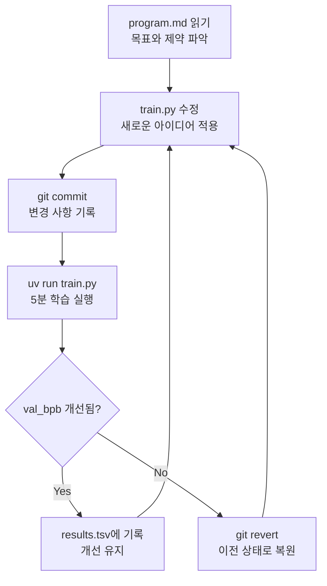
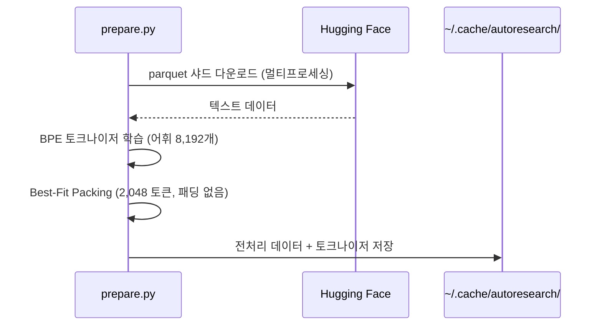
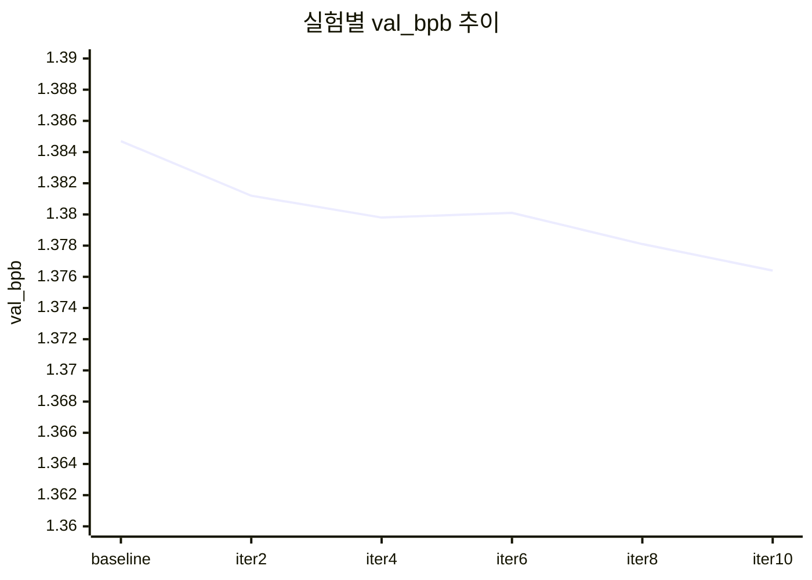
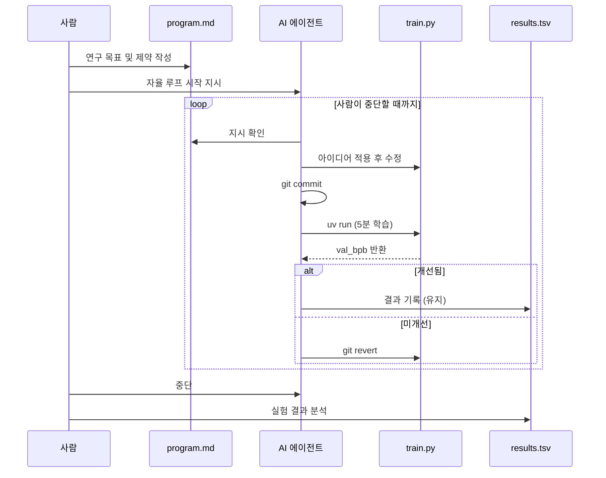

## 들어가며

> "Research is now entirely the domain of autonomous swarms of AI agents."
> — Andrej Karpathy

[AutoResearch](https://github.com/karpathy/autoresearch)는 Andrej Karpathy가 만든 프레임워크입니다. **단 하나의 GPU**와 세 개의 파일만으로 AI 에이전트가 스스로 실험을 설계하고, 코드를 수정하고, 결과를 평가하고, 다음 실험을 반복합니다. 사람이 개입하지 않아도 됩니다.

핵심 아이디어는 간단합니다: "AI 에이전트에게 작지만 실제로 동작하는 LLM 학습 환경을 주고, 하룻밤 동안 스스로 실험하게 하자."

이 포스트에서는 AutoResearch를 직접 설치하고 에이전트를 실행해 **자율 연구 루프**를 경험하는 것까지 따라합니다.

---

## 1. AutoResearch란?

### 구성 요소: 세 개의 파일

AutoResearch의 전체 구조는 놀라울 정도로 단순합니다.

```
autoresearch/
├── prepare.py      ← 데이터 준비 (에이전트가 수정 불가)
├── train.py        ← GPT 학습 코드 (에이전트가 이 파일만 수정)
└── program.md      ← 에이전트에게 줄 연구 지시서 (사람이 작성)
```

| 파일 | 역할 | 수정 주체 |
|---|---|---|
| `prepare.py` | 데이터 다운로드, 토크나이저 학습, 전처리 | 불변 (사람만) |
| `train.py` | GPT 모델 정의, 학습 루프, 옵티마이저 | **에이전트가 수정** |
| `program.md` | 에이전트의 목표, 제약, 실험 프로토콜 정의 | 사람이 작성 |

### 자율 연구 루프



에이전트는 이 루프를 **사람이 중단할 때까지** 멈추지 않습니다.

### 왜 5분인가?

실험당 학습 시간을 **5분으로 고정**합니다. 이유는 명확합니다.

- 시간 변수를 제거해 모든 실험이 **직접 비교 가능**
- 시간당 약 12번의 실험 = 하룻밤에 수백 번 반복
- 학습 시간이 다르면 성능 비교가 의미 없어짐

### 평가 지표: val_bpb

`val_bpb`(Validation Bits Per Byte)는 어휘 크기와 무관한 성능 지표입니다.

- **낮을수록** 모델이 텍스트를 더 잘 압축 = 더 잘 이해
- 어휘 크기가 달라도 공정하게 비교 가능
- 에이전트가 아키텍처를 바꿔도 동일한 기준으로 평가

---

## 2. 사전 준비

### 요구 사항

- **NVIDIA GPU** (H100 권장, 그 외 GPU도 동작하나 속도 차이 있음)
- Python 3.10+
- `uv` 패키지 매니저
- Git

> macOS, Windows, AMD GPU용 커뮤니티 포크도 존재합니다. 공식 저장소 Issues에서 찾을 수 있습니다.
{: .prompt-tip }

### uv 설치

```bash
# Linux / macOS
curl -LsSf https://astral.sh/uv/install.sh | sh

# Windows (PowerShell)
powershell -c "irm https://astral.sh/uv/install.ps1 | iex"

# 설치 확인
uv --version
```

### 저장소 클론

```bash
git clone https://github.com/karpathy/autoresearch.git
cd autoresearch
```

### 의존성 설치

```bash
uv sync
```

`uv sync`는 `pyproject.toml`과 `uv.lock`을 기반으로 CUDA 12.8용 PyTorch를 포함한 모든 의존성을 설치합니다.

---

## 3. 데이터 준비

### prepare.py 실행

```bash
uv run prepare.py
```

내부에서 다음 작업이 자동으로 수행됩니다.



- 약 **2분** 소요
- 한 번 실행 후 `~/.cache/autoresearch/`에 캐시 → 재실행 불필요
- 검증용 샤드 1개를 고정 → 모든 실험에서 동일한 기준으로 평가

> **Best-Fit Packing**: 문서를 2,048 토큰 행에 꽉 채워 패딩 없이 배치합니다. 토큰 활용률 100%로 학습 효율을 극대화합니다.
{: .prompt-info }

---

## 4. 첫 수동 실험: 기준선(Baseline) 확인

에이전트를 실행하기 전에 기준 성능을 먼저 확인합니다.

### train.py 실행

```bash
uv run train.py > run.log 2>&1
```

약 **5분** 후 `run.log` 마지막 줄에서 결과를 확인합니다.

```bash
tail -5 run.log
```

출력 예시:

```
step 1200/1250 | loss 3.4521 | lr 2.40e-03 | norm 1.23
step 1250/1250 | loss 3.4102 | lr 0.00e+00 | norm 1.18
val_bpb: 1.3847
Training complete. Time: 300.2s
```

이 `val_bpb` 값이 에이전트가 개선해야 할 **기준선**입니다. 낮을수록 좋습니다.

---

## 5. program.md: 에이전트에게 연구 방향 지시하기

`program.md`는 에이전트가 어떤 목표를 갖고, 어떻게 행동해야 하는지 정의하는 **연구 지시서**입니다. 이 파일을 수정하는 것이 AutoResearch에서 사람이 하는 가장 중요한 역할입니다.

### 기본 구조

```markdown
# AutoResearch Program

## 목표
val_bpb를 최소화하기 위해 train.py를 반복적으로 수정한다.

## 제약
- prepare.py는 수정 금지
- 외부 패키지 추가 금지 (pyproject.toml의 기존 의존성만 사용)
- 단일 GPU 환경

## 실험 프로토콜
1. 날짜 기반 브랜치 생성: autoresearch/<태그>
2. 데이터 존재 여부 확인
3. results.tsv 초기화
4. 반복:
   a. train.py 수정 (하나의 아이디어씩)
   b. git commit
   c. uv run train.py > run.log 2>&1
   d. val_bpb 추출 후 results.tsv 기록
   e. 개선 시 유지, 미개선 시 git revert

## 결과 판단 기준
- 유지: val_bpb가 의미 있게 개선됨 (코드 복잡도 대비)
- 되돌리기: 결과가 같거나 나빠짐
- 크래시: val_bpb에 0.000000 기록 후 수정 가능하면 디버그, 아니면 다음으로

## 자율성
사람에게 계속 진행 여부를 묻지 말 것.
루프는 사람이 중단할 때까지 실행한다.
```

### 연구 방향 커스터마이징

`program.md`에 탐색 방향을 추가하면 에이전트가 해당 영역에 집중합니다.

```markdown
## 탐색 우선순위
다음 아이디어를 우선적으로 실험한다:
1. Attention 레이어의 Sliding Window 크기 조정
2. RMSNorm 위치 변경 (Pre-norm vs Post-norm)
3. MLP 활성화 함수 변경 (ReLU² → SwiGLU)
4. Learning Rate Schedule 변형
```

> **핵심**: `program.md`가 좋을수록 에이전트의 연구 품질이 올라갑니다. 탐색 방향, 금지 사항, 판단 기준을 명확하게 작성하세요.
{: .prompt-tip }

---

## 6. 에이전트 실행

### Claude Code로 자율 실험 시작

AutoResearch는 Claude Code를 에이전트로 활용합니다. 프로젝트 디렉토리에서 Claude Code를 실행합니다.

```bash
claude
```

다음 프롬프트로 자율 연구 루프를 시작합니다.

```
program.md를 읽고 지시에 따라 autoresearch 루프를 시작해줘.
val_bpb를 최소화하는 방향으로 train.py를 반복 수정하고,
각 실험 결과를 results.tsv에 기록해줘.
내가 중단할 때까지 멈추지 말고 계속 실험해줘.
```

> 에이전트가 실행되면 **직접 중단하기 전까지** 루프가 계속됩니다. 터미널을 닫으면 실험이 중단됩니다. 하룻밤 실험을 원한다면 `tmux` 또는 `screen`으로 세션을 유지하세요.
{: .prompt-danger }

### 실행 중 에이전트 동작 예시

```
[Iteration 1] Trying: Increase MLP hidden dim ratio 4x → 4.5x
  → Modified train.py: n_hidden = int(4.5 * n_embd)
  → git commit: "exp: wider MLP 4.5x"
  → Training... (5min)
  → val_bpb: 1.3812 (baseline: 1.3847) ✅ Improved!
  → Logged to results.tsv

[Iteration 2] Trying: ReLU² → SwiGLU activation
  → Modified train.py: activation = SwiGLU
  → git commit: "exp: SwiGLU activation"
  → Training... (5min)
  → val_bpb: 1.3891 (baseline: 1.3812) ❌ Worse
  → git revert

[Iteration 3] Trying: Reduce warmup steps 20% → 10%
  ...
```

---

## 7. 결과 추적 및 분석

### results.tsv 확인

에이전트가 실험할 때마다 `results.tsv`에 자동 기록됩니다.

```bash
cat results.tsv
```

```
timestamp           commit_hash  description              val_bpb
2026-04-10 01:00   a1b2c3d      baseline                 1.384700
2026-04-10 01:05   e4f5g6h      wider MLP 4.5x           1.381200
2026-04-10 01:15   i7j8k9l      sliding window 512       1.379800
2026-04-10 01:20   m0n1o2p      rotary freq 10000→50000  1.380100
...
```

### Jupyter 노트북으로 분석

```bash
uv run jupyter notebook analysis.ipynb
```

저장소에 포함된 `analysis.ipynb`로 실험 진행 상황을 시각화할 수 있습니다.



---

## 8. train.py 구조 이해

에이전트가 수정하는 `train.py`의 핵심 구성을 이해하면 `program.md`에 더 정밀한 지시를 줄 수 있습니다.

### 모델 아키텍처

```python
# train.py 핵심 하이퍼파라미터 (에이전트가 조정하는 영역)
n_layer = 12          # 트랜스포머 레이어 수
n_head = 6            # 어텐션 헤드 수
n_embd = 384          # 임베딩 차원
context_length = 2048 # 컨텍스트 길이 (고정)
```

### 하이브리드 옵티마이저 (MuonAdamW)

에이전트가 종종 탐색하는 옵티마이저 전략입니다.

| 파라미터 유형 | 옵티마이저 | 이유 |
|---|---|---|
| 임베딩, 스칼라 | AdamW | 1D 파라미터에 적합 |
| 트랜스포머 행렬 (2D) | **Muon** | 직교 업데이트로 학습 효율 향상 |

Muon은 Nesterov 모멘텀과 Polar Express 직교화를 결합한 최신 옵티마이저입니다. 에이전트가 Muon의 하이퍼파라미터(학습률, 모멘텀)를 실험합니다.

---

## 9. GPU 환경별 최적화 팁

### H100 (공식 지원)

```bash
# Flash Attention 3 자동 활성화 (Hopper 아키텍처)
uv run train.py
```

### A100 / RTX 40 시리즈

```python
# train.py에서 Flash Attention 버전 수동 지정
# 에이전트에게 program.md로 지시 가능
```

### VRAM이 부족한 경우 (program.md에 추가)

```markdown
## VRAM 제약
현재 환경은 VRAM이 16GB로 제한됩니다.
다음 방향으로 모델을 축소하여 실험하세요:
- n_embd를 256 이하로 줄이기
- n_layer를 6 이하로 줄이기
- 배치 크기 축소 후 gradient accumulation 증가
```

---

## 10. 전체 흐름 요약



---

## 정리

| 구성 요소 | 역할 | 사람의 개입 |
|---|---|---|
| `prepare.py` | 데이터/토크나이저 준비 (한 번만) | 실행만 |
| `train.py` | 에이전트가 반복 수정하는 연구 대상 | 없음 |
| `program.md` | 에이전트의 목표, 제약, 프로토콜 | 핵심: 잘 쓸수록 좋은 연구 |
| `results.tsv` | 모든 실험 결과 자동 기록 | 분석만 |

AutoResearch는 다음 질문에 대한 실용적인 답을 제시합니다.

> "AI가 스스로 더 나은 AI를 연구할 수 있는가?"

GPU 하나와 하룻밤이면 직접 확인할 수 있습니다.

---

## 참고

- 저장소: [github.com/karpathy/autoresearch](https://github.com/karpathy/autoresearch)
- `val_bpb` 개념: 어휘 독립적 언어 모델 평가 지표
- Muon 옵티마이저: [KoalaNLP Muon 논문](https://github.com/KoalaNLP/muon)
- 커뮤니티 포크 (macOS/AMD): 공식 저장소 Issues 탭 참고
