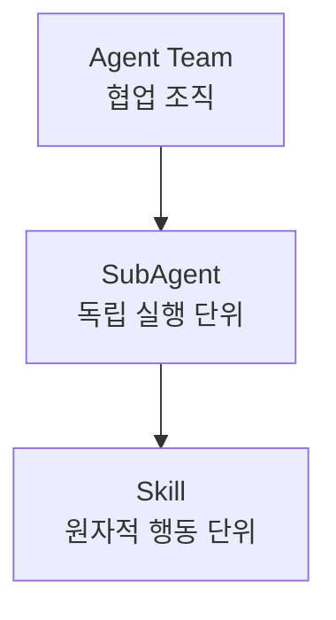
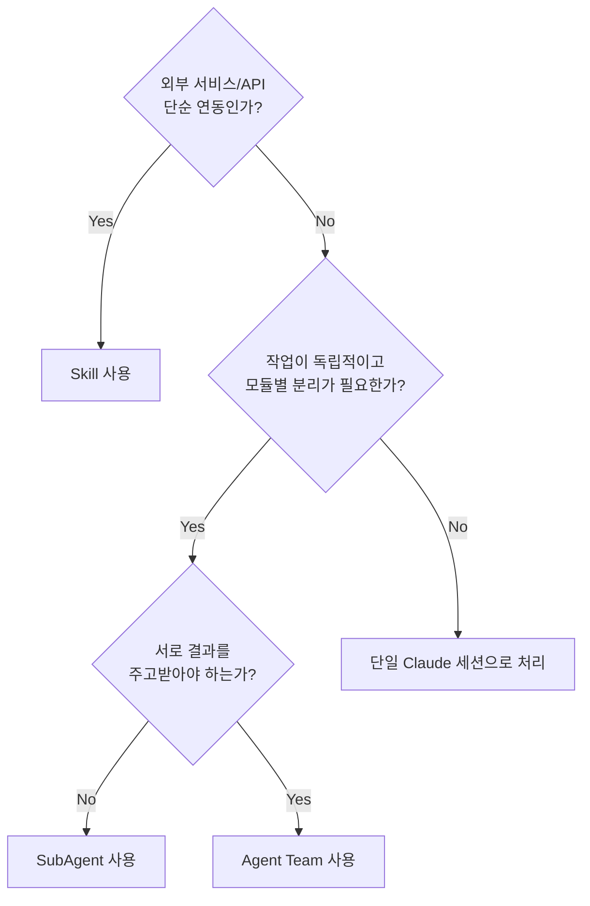
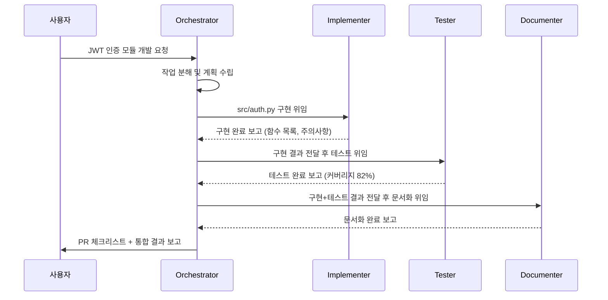
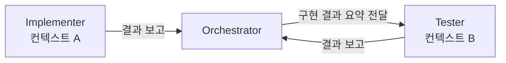

## 들어가며

Claude Code에서 에이전트를 설계할 때 **"무엇을 Skill로, 무엇을 SubAgent로, 무엇을 Agent Team으로 만들 것인가?"** 라는 질문이 항상 따라옵니다.

이 포스트는 세 계층의 정확한 역할과 오케스트레이터 패턴을 설명하고, 실제 프로젝트에서 어떻게 설계하는지 따라하기 형식으로 정리합니다.

---

## 1. 세 가지 계층 이해하기

Claude Code의 에이전트 시스템은 **세 개의 계층**으로 구성됩니다.



### Skill — 원자적 행동 단위

**"재사용 가능한 단일 능력"**입니다. MCP 도구 호출, 외부 API 연동처럼 하나의 명확한 작업만 수행합니다.

- 단독으로는 동작하지 않음 → 반드시 다른 에이전트가 호출
- 상태를 갖지 않음 (입력 → 출력)
- 여러 에이전트에서 재사용 가능

```
예: GitHub PR 생성, Slack 메시지 발송, lint 실행, 파일 읽기
```

### SubAgent — 독립 실행 단위

**"자신만의 컨텍스트를 갖고, 스스로 판단하며, 주어진 작업을 자율적으로 완료할 수 있는 에이전트"**입니다.

- 독립된 컨텍스트에서 실행 (Main의 컨텍스트와 분리)
- 병렬 실행 가능 (서로 간섭 없음)
- 완료 후 **요약 결과만** Main에 반환
- `.claude/agents/*.md`에 역할 정의

```
예: 코드 리뷰 에이전트, 문서 작성 에이전트, 테스트 생성 에이전트
```

### Agent Team — 협업 조직

**"Orchestrator가 계획을 세우고, 여러 SubAgent가 협력해 결과를 만드는 구조"**입니다.

- Orchestrator가 작업을 분배하고 조율
- SubAgent들이 병렬 또는 순차적으로 처리
- (실험적 기능) Teammate 간 직접 메시지 교환 가능

```
예: 설계 → 구현 → 테스트 → 문서화를 각 에이전트가 담당하는 전체 파이프라인
```

### 세 계층 비교

| 특성 | Skill | SubAgent | Agent Team |
|---|---|---|---|
| 컨텍스트 | 없음 | 독립 | 공유/분리 혼합 |
| 실행 방식 | 호출 시 단순 실행 | 자율 판단 후 완료 | Orchestrator 조율 |
| 병렬 실행 | 해당 없음 | 가능 | 가능 |
| 사용 시점 | 단일 외부 작업 | 모듈별 독립 분석 | 다각도 협업 필요 |

---

## 2. 언제 무엇을 사용하나?

### 의사결정 트리



### 시나리오별 권장 방식

| 시나리오 | 권장 | 이유 |
|---|---|---|
| GitHub PR 자동 생성 | **Skill** | 재사용성 높음, 단일 동작 |
| 대규모 모듈별 코드 분석 | **SubAgent** | 각 모듈을 독립 컨텍스트에서 분석 |
| 단순 질의응답 | **단일 세션** | Agent 사용은 오버엔지니어링 |
| 설계 → 구현 → 테스트 전체 흐름 | **Agent Team** | 다각도 협업, 정보 공유 필요 |
| 에이전트 5개 이상 + 정보 교환 많음 | **Agent Team** | Subagent 중개 비용 누적 방지 |

> **비용 주의**: 단순 작업에 Agent Team을 사용하면 오케스트레이터 중개 비용이 추가됩니다. 작업 복잡도에 맞는 계층을 선택하세요.
{: .prompt-danger }

---

## 3. 프로젝트 구조 설계

실제 프로젝트에서 세 계층을 어떻게 배치하는지 따라해봅니다.

### 예제 시나리오

"새 기능을 PR로 만드는 전체 파이프라인"

```
요구사항 분석 → 코드 구현 → 테스트 작성 → 문서화 → PR 생성
```

### 디렉토리 구조

```
my-project/
├── .claude/
│   ├── settings.json          ← 권한 및 Agent Team 활성화
│   ├── CLAUDE.md              ← 전체 팀 규칙
│   └── agents/
│       ├── orchestrator.md    ← Orchestrator 역할 정의
│       ├── implementer.md     ← 구현 담당 SubAgent
│       ├── tester.md          ← 테스트 담당 SubAgent
│       └── documenter.md      ← 문서화 담당 SubAgent
└── src/
```

---

## 4. Orchestrator 설계하기

Orchestrator는 Agent Team의 핵심입니다. 전체 계획을 세우고, 작업을 분배하고, 결과를 통합합니다.

### `.claude/agents/orchestrator.md`

````markdown
---
name: orchestrator
description: 전체 기능 개발 파이프라인을 조율하는 Orchestrator
---

# Orchestrator 역할

당신은 프로젝트 전체 개발 파이프라인을 조율하는 Orchestrator입니다.

## 책임
- 요구사항을 분석하여 하위 작업으로 분해
- 각 SubAgent에게 명확한 작업 범위를 정의하여 위임
- SubAgent 결과를 수집하고 통합
- 충돌이나 불일치를 해결

## SubAgent 위임 지침

### implementer에게 위임할 때
- 구현할 파일 경로와 함수 시그니처를 명시
- 의존성이 있는 다른 모듈 정보 제공
- 완료 기준(acceptance criteria) 명시

### tester에게 위임할 때
- 테스트 대상 파일 경로 제공
- implementer의 구현 결과 요약 전달
- 커버리지 목표 명시 (예: 80% 이상)

### documenter에게 위임할 때
- 문서화할 함수/모듈 목록 제공
- 기존 문서 스타일 가이드 첨부
- 출력 형식 지정 (docstring, README 등)

## 금지사항
- 직접 코드를 작성하지 않음 (위임만)
- SubAgent가 완료하지 않은 작업에 대해 완료 가정 금지
- 작업 범위가 겹치게 위임 금지

## 결과 통합 형식
모든 SubAgent 결과를 수집한 후:
1. 충돌 사항 목록 작성
2. 통합 검토 실행
3. PR 준비 체크리스트 작성
````

---

## 5. SubAgent 정의하기

각 SubAgent는 명확한 담당 영역과 출력 형식을 갖습니다.

### `.claude/agents/implementer.md`

````markdown
---
name: implementer
description: 코드 구현을 담당하는 SubAgent
---

# Implementer 역할

당신은 코드 구현을 전담하는 개발자 에이전트입니다.

## 담당 영역
- `src/` 디렉토리 내 Python 파일 작성 및 수정

## 금지 영역
- `tests/` 디렉토리 수정 금지 (tester 담당)
- `docs/` 디렉토리 수정 금지 (documenter 담당)

## 구현 기준
- PEP 8 스타일 준수
- 모든 public 함수에 타입 힌트 작성
- 단일 책임 원칙 준수

## 완료 보고 형식
작업 완료 시 다음 형식으로 Orchestrator에게 반환:
```
구현 완료:
- 파일: src/example.py
- 추가된 함수: [함수명1, 함수명2]
- 변경된 함수: [함수명3]
- 주요 결정 사항: [설계 결정 이유]
- 주의사항: [tester/documenter가 알아야 할 정보]
```
````

### `.claude/agents/tester.md`

````markdown
---
name: tester
description: 테스트 작성을 담당하는 SubAgent
---

# Tester 역할

당신은 테스트 작성을 전담하는 QA 에이전트입니다.

## 담당 영역
- `tests/` 디렉토리 내 pytest 테스트 파일 작성

## 금지 영역
- `src/` 디렉토리 수정 금지 (implementer 담당)

## 테스트 기준
- 단위 테스트: 각 함수별 happy path + edge case
- 목표 커버리지: 80% 이상
- Mocking: 외부 API 호출은 반드시 mock 처리

## 완료 보고 형식
```
테스트 완료:
- 파일: tests/test_example.py
- 작성된 테스트 수: N개
- 커버리지: XX%
- 실패 케이스 발견 여부: [있음/없음]
- 발견된 버그: [버그 설명 또는 없음]
```
````

---

## 6. CLAUDE.md: 팀 전체 규칙 정의

`.claude/CLAUDE.md`는 모든 에이전트(Orchestrator + SubAgent)가 공유하는 전역 규칙입니다.

````markdown
# 프로젝트 전역 규칙

## 코딩 컨벤션
- Python 3.11 기준
- Black 포매터 사용
- import 순서: stdlib → third-party → local

## 에이전트 협업 규칙
- SubAgent는 자신의 담당 디렉토리만 수정
- SubAgent 간 직접 통신 기본 금지 (Orchestrator 경유)
- 완료 보고는 반드시 지정된 형식으로 작성

## 금지사항
- .env 파일 읽기/쓰기 금지
- 외부 패키지 임의 추가 금지
- 테스트 없이 구현 완료 선언 금지
````

---

## 7. settings.json 설정

### 기본 Subagent 모드

```json
{
  "permissions": {
    "allow": [
      "Read(./**)",
      "Write(./src/**)",
      "Write(./tests/**)",
      "Write(./docs/**)",
      "Bash(pytest *)",
      "Bash(black *)",
      "Bash(git *)"
    ],
    "deny": [
      "Read(./.env)",
      "Bash(rm -rf *)"
    ]
  }
}
```

### Agent Team 모드 (실험적)

Orchestrator 없이 teammate들이 자율 소통하게 하려면 환경변수를 추가합니다.

```json
{
  "env": {
    "CLAUDE_CODE_EXPERIMENTAL_AGENT_TEAMS": "1"
  },
  "permissions": {
    "allow": [
      "Read(./**)",
      "Write(./src/**)",
      "Write(./tests/**)",
      "Write(./docs/**)",
      "Bash(pytest *)",
      "Bash(black *)",
      "Bash(git *)"
    ]
  }
}
```

Agent Team 활성화 시 CLAUDE.md에서 "SubAgent 간 직접 통신 금지" 규칙을 제거하고 자율 소통을 허용합니다.

---

## 8. Orchestrator 실행하기

프로젝트 디렉토리에서 Claude Code를 실행합니다.

```bash
claude
```

다음 프롬프트로 전체 파이프라인을 시작합니다.

```
orchestrator 에이전트를 사용해서 다음 기능을 개발해줘:
- 사용자 인증 모듈 (JWT 기반)
- 위치: src/auth.py
- 요구사항: 로그인, 로그아웃, 토큰 갱신 기능

implementer → tester → documenter 순서로 작업을 위임하고,
완료 후 PR 체크리스트를 작성해줘.
```

### 실행 흐름



---

## 9. 핵심 설계 원칙

### 1. 작업 영역 분리

SubAgent들이 **같은 파일을 수정하지 않도록** 설계해야 합니다. 충돌 방지가 핵심입니다.

```
Good: implementer → src/, tester → tests/, documenter → docs/
Bad:  implementer와 documenter 모두 README.md 수정
```

### 2. Context 단절 관리

SubAgent는 **독립 컨텍스트**에서 실행됩니다. SubAgent A가 알게 된 정보를 SubAgent B가 알 수 없습니다. Orchestrator가 이 정보를 명시적으로 전달해야 합니다.



> SubAgent B에게 "Implementer가 만든 것을 테스트해줘"라고만 하면 SubAgent B는 구현 내용을 모릅니다. Orchestrator가 구현 결과를 요약해서 명시적으로 전달해야 합니다.
{: .prompt-danger }

### 3. Orchestrator 품질이 팀 성과를 결정

**오케스트레이터의 설계 수준이 전체 팀의 성과를 결정합니다.** 좋은 오케스트레이터는:

- 작업을 명확히 분해 (모호한 위임 금지)
- 각 SubAgent에게 필요한 컨텍스트를 충분히 전달
- SubAgent 결과를 검증하고 충돌 해결
- 재시도 조건과 실패 처리 정의

### 4. 점진적 복잡도 증가

처음부터 Agent Team으로 시작하지 마세요.

```
단일 Claude 세션 → SubAgent 1~2개 → 여러 SubAgent → Agent Team
```

---

## 10. Subagent vs Agent Team 선택 기준 (실측 기반)

[2편 포스트](/posts/claude-code-subagent)에서 소개한 실측 데이터를 바탕으로 선택 기준을 정리합니다.

| 지표 | Subagent | Agent Team | 권장 상황 |
|---|---|---|---|
| 실행 시간 (6에이전트, 협업 시나리오) | ~17분 | ~7분 43초 | 협업 많으면 → Team |
| 토큰 비용 | 168K | 124K | 협업 많으면 → Team |
| 안정성 | 높음 | 실험적 | 프로덕션 → Subagent |
| 설정 복잡도 | 보통 | 낮음 (env 1개 추가) | - |

**결론**: 에이전트 간 정보 교환이 많고 3개 이상의 에이전트가 협력하는 시나리오에서는 Agent Team이 유리합니다. 프로덕션 환경이라면 Agent Team 정식 출시까지 Subagent 구조를 유지하세요.

---

## 정리

| 계층 | 파일 위치 | 핵심 역할 |
|---|---|---|
| Skill | MCP 도구 또는 Bash 명령 | 단일 외부 동작 캡슐화 |
| SubAgent | `.claude/agents/*.md` | 독립 컨텍스트에서 자율 실행 |
| Orchestrator | `.claude/agents/orchestrator.md` | 작업 분배 + 결과 통합 |
| Agent Team | `settings.json` + `CLAUDE.md` 수정 | Teammate 자율 협력 (실험적) |

에이전트 시스템 설계의 핵심은 **역할 경계를 명확히 하고, 컨텍스트 단절을 의식적으로 관리하는 것**입니다. Orchestrator 하나가 팀 전체의 품질을 결정합니다.

---

## 관련 포스트

- [1편: Claude Code 하네스 구축하기](/posts/claude-code-harness)
- [2편: 서브에이전트 구축하기 (Ollama/vLLM 연동)](/posts/claude-code-subagent)
