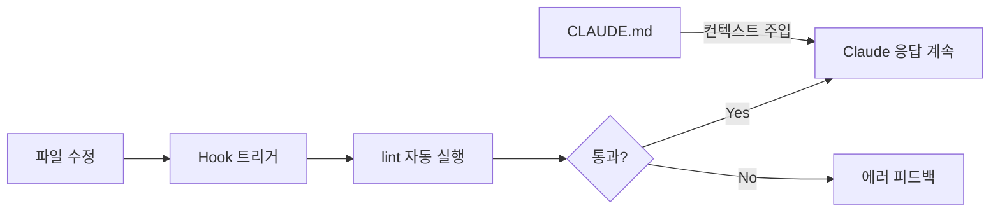
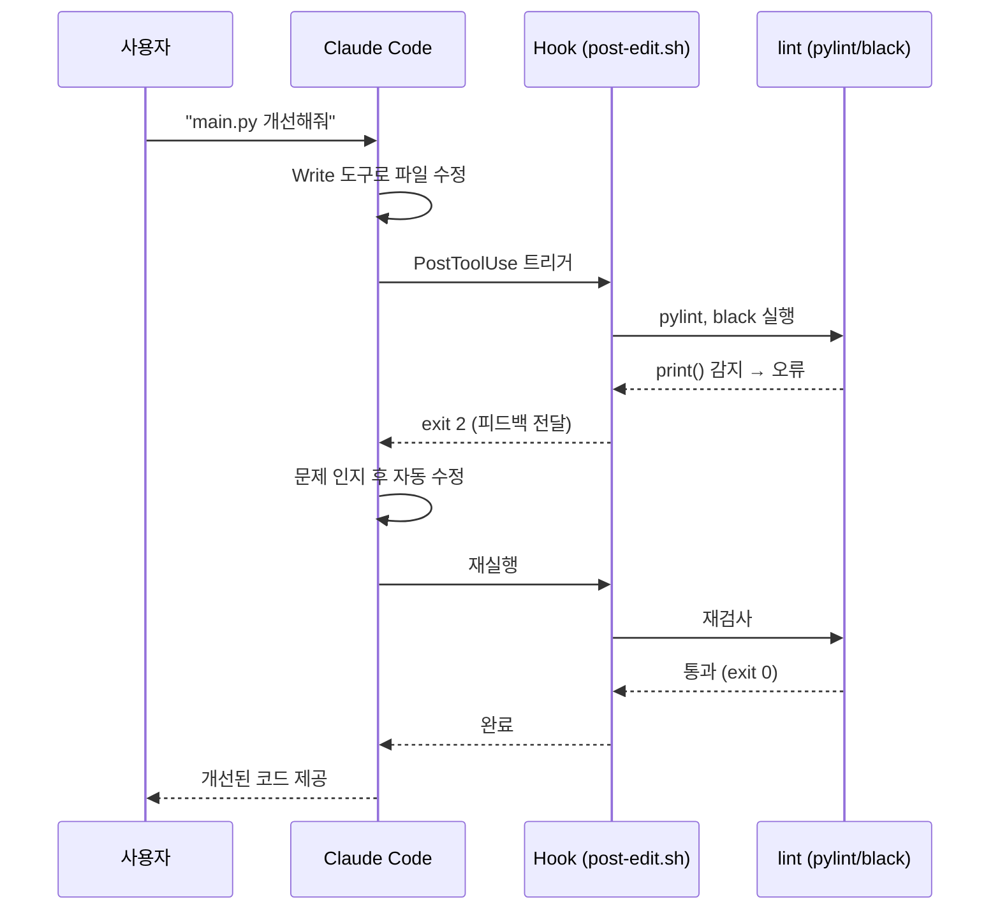

## 들어가며

Claude Code는 단순한 AI 코딩 도우미가 아닙니다. **하네스(Harness)**를 구성하면 Claude Code가 프로젝트의 규칙을 이해하고, 파일이 수정될 때마다 자동으로 검사를 실행하며, 팀의 컨텍스트를 항상 인지하는 자동화 파이프라인으로 변신합니다.

이 글에서는 코드/디자인 리뷰 자동화를 목표로 다음 세 가지를 구성합니다.

| 구성 요소 | 역할 |
|---|---|
| `settings.json` | 권한 설정, Hook 등록 |
| **Hooks** | 파일 수정 시 자동 lint/검사 실행 |
| `CLAUDE.md` | 프로젝트별 리뷰 기준 주입 |

> 이 시리즈의 **2편**에서는 이 하네스 위에 역할별 서브에이전트(Ollama, vLLM, gemma4)를 얹어 멀티 에이전트 리뷰 시스템을 완성합니다.
{: .prompt-info }

---

## 1. 하네스(Harness)란?

하네스는 Claude Code의 동작을 체계적으로 제어하는 설정 묶음입니다.



CI/CD 파이프라인이 커밋마다 테스트를 돌리듯, 하네스는 Claude Code가 파일을 건드릴 때마다 사전에 정의한 규칙을 자동으로 실행합니다.

---

## 2. 사전 준비

### Claude Code 설치 확인

```bash
claude --version
```

출력 예시:
```
Claude Code 1.x.x
```

설치가 안 되어 있다면 공식 문서를 참고하여 CLI를 먼저 설치합니다.

### 예제 프로젝트 구조

이 튜토리얼에서는 다음 구조의 Python 프로젝트를 기준으로 설명합니다.

```
my-project/
├── .claude/
│   ├── settings.json        ← 이 글에서 생성
│   ├── hooks/
│   │   └── post-edit.sh     ← 이 글에서 생성
│   └── CLAUDE.md            ← 이 글에서 생성
├── src/
│   └── main.py
└── requirements.txt
```

> `.claude/` 디렉토리는 프로젝트 루트에 위치합니다. 전역 설정은 `~/.claude/settings.json`에 위치합니다.
{: .prompt-tip }

### 도구 설치

```bash
pip install pylint black
```

---

## 3. settings.json 구성

`.claude/settings.json`을 생성합니다.

```bash
mkdir -p .claude/hooks
touch .claude/settings.json
```

### 기본 구조

```json
{
  "permissions": {
    "allow": [
      "Read(./**)",
      "Write(./src/**)",
      "Bash(pylint *)",
      "Bash(black *)"
    ],
    "deny": [
      "Bash(rm -rf *)"
    ]
  },
  "hooks": {
    "PostToolUse": [
      {
        "matcher": "Write|Edit",
        "hooks": [
          {
            "type": "command",
            "command": "bash .claude/hooks/post-edit.sh"
          }
        ]
      }
    ]
  }
}
```

### permissions 설명

| 필드 | 설명 |
|---|---|
| `allow` | Claude가 승인 없이 실행 가능한 도구/경로 패턴 |
| `deny` | 절대 실행 불가 (사용자가 허용해도 차단) |
| `ask` | 매번 사용자 확인 요구 |

경로 패턴은 glob 형식을 지원합니다. `Read(./**)` 는 프로젝트 내 모든 파일 읽기를 허용합니다.

### hooks 설명

| 필드 | 설명 |
|---|---|
| `matcher` | 트리거할 도구 이름. 정규식(`\|`으로 OR) 사용 가능 |
| `type` | 현재 `command`만 지원 |
| `command` | 실행할 셸 명령 |

---

## 4. Hooks 설정

Hooks는 Claude Code가 도구를 실행하는 시점에 자동으로 셸 명령을 실행하는 기능입니다.

### Hook 이벤트 종류

| 이벤트 | 실행 시점 |
|---|---|
| `PreToolUse` | 도구 실행 **직전** |
| `PostToolUse` | 도구 실행 **성공 후** |
| `PostToolUseFailure` | 도구 실행 **실패 후** |
| `Stop` | Claude 응답 완료 시 |
| `Notification` | 사용자 확인 필요 알림 발생 시 |
| `SessionStart` | 세션 시작 시 |

이 튜토리얼에서는 `PostToolUse`를 사용합니다. 파일을 수정(`Write` 또는 `Edit`)한 직후 자동으로 lint를 실행하는 것이 목표입니다.

### Hook 스크립트 작성

`.claude/hooks/post-edit.sh`를 생성합니다.

```bash
#!/bin/bash
# Claude Code PostToolUse Hook
# Write/Edit 도구 실행 후 자동으로 lint와 포맷 검사를 실행합니다.

# Hook은 stdin으로 JSON 데이터를 받습니다.
HOOK_DATA=$(cat)

# 수정된 파일 경로 추출
FILE_PATH=$(echo "$HOOK_DATA" | python3 -c "
import sys, json
data = json.load(sys.stdin)
print(data.get('tool_input', {}).get('file_path', ''))
")

# 파일 경로가 없으면 종료
if [ -z "$FILE_PATH" ]; then
  exit 0
fi

echo "--- [Hook] 수정된 파일: $FILE_PATH ---"

# Python 파일인 경우에만 lint 실행
if [[ "$FILE_PATH" == *.py ]]; then
  echo "[1/2] black 포맷 검사 중..."
  black --check "$FILE_PATH" 2>&1
  BLACK_EXIT=$?

  echo "[2/2] pylint 검사 중..."
  pylint "$FILE_PATH" --score=no 2>&1
  PYLINT_EXIT=$?

  if [ $BLACK_EXIT -ne 0 ] || [ $PYLINT_EXIT -ne 0 ]; then
    echo ""
    echo "⚠️  lint 문제가 발견되었습니다. Claude가 수정 사항을 반영합니다."
    # exit 2 는 Claude에게 결과를 피드백으로 전달합니다.
    exit 2
  fi

  echo "✅ lint 통과"
fi

exit 0
```

```bash
chmod +x .claude/hooks/post-edit.sh
```

> **종료 코드의 의미**
> - `exit 0`: 정상. Claude는 계속 진행합니다.
> - `exit 2`: Claude에게 stdout/stderr 내용을 피드백으로 전달합니다. Claude가 문제를 인지하고 자동으로 수정을 시도합니다.
{: .prompt-info }

### stdin 데이터 구조

Hook 스크립트는 실행 시 stdin으로 다음 형태의 JSON을 받습니다.

```json
{
  "tool_name": "Write",
  "tool_input": {
    "file_path": "./src/main.py",
    "content": "..."
  },
  "tool_output": "File written successfully"
}
```

`jq`가 설치된 환경이라면 더 간단하게 파싱할 수 있습니다.

```bash
FILE_PATH=$(cat | jq -r '.tool_input.file_path // empty')
```

---

## 5. CLAUDE.md 작성

`CLAUDE.md`는 Claude Code가 프로젝트 디렉토리에서 실행될 때 **자동으로 읽는** 컨텍스트 파일입니다. 팀의 코딩 규칙, 리뷰 기준, 금지 패턴을 정의해 Claude가 항상 일관된 기준으로 동작하도록 합니다.

`.claude/CLAUDE.md`를 생성합니다.

````markdown
# 프로젝트 컨텍스트

이 프로젝트는 Python 3.11 기반 REST API 서버입니다.

## 코드 리뷰 기준

코드를 수정하거나 생성할 때는 반드시 다음 기준을 준수해야 합니다.

### 필수 규칙
- **PEP 8** 스타일 가이드를 따릅니다.
- 모든 함수에는 타입 힌트를 작성합니다.
- 함수 길이는 50줄을 넘지 않도록 합니다.

### 금지 패턴
- `print()` 사용 금지 → `logging` 모듈을 사용합니다.
- `except:` (bare except) 사용 금지 → 명시적인 예외 타입을 지정합니다.
- 하드코딩된 비밀번호, API 키 금지 → 환경변수를 사용합니다.

### 리뷰 체크리스트

코드 변경 시 다음 항목을 확인합니다.
- [ ] 타입 힌트 작성 여부
- [ ] 예외 처리 적절성
- [ ] 로깅 사용 여부
- [ ] 함수 단일 책임 원칙 준수

## 아키텍처 규칙

- `src/api/` — 라우터만 위치 (비즈니스 로직 금지)
- `src/services/` — 비즈니스 로직
- `src/models/` — 데이터 모델
````

> `CLAUDE.md`는 `.claude/CLAUDE.md` 또는 프로젝트 루트의 `CLAUDE.md` 모두 동작합니다. 민감하지 않은 규칙은 루트에, 팀 내부 규칙은 `.claude/` 내부에 두는 것을 권장합니다.
{: .prompt-tip }

---

## 6. 검증: 전체 흐름 따라하기

모든 설정을 마쳤습니다. 실제로 동작하는지 확인합니다.

### 테스트용 Python 파일 작성

```bash
cat > src/main.py << 'EOF'
def add(a, b):
    print("더하기 실행")   # 금지 패턴: print 사용
    return a+b
EOF
```

### Claude Code 실행

```bash
claude
```

Claude Code에서 다음 프롬프트를 입력합니다.

```
src/main.py 파일을 개선해줘. 코드 품질을 높여야 해.
```

### 예상 동작 순서

1. Claude가 `Write` 도구로 `src/main.py`를 수정합니다.
2. `PostToolUse` Hook이 즉시 실행됩니다.
3. Hook이 `black`과 `pylint`를 실행합니다.
4. `print()` 사용 감지 → Hook이 `exit 2`로 피드백 전달합니다.
5. Claude가 피드백을 인지하고 `print()`를 `logging`으로 자동 수정합니다.
6. 재검사 통과 → 최종 결과물 완성.



---

## 정리

| 구성 요소 | 파일 위치 | 핵심 역할 |
|---|---|---|
| 권한 설정 | `.claude/settings.json` | 도구 허용/차단 |
| Hooks | `.claude/hooks/post-edit.sh` | 파일 수정 후 자동 lint |
| 프로젝트 컨텍스트 | `.claude/CLAUDE.md` | 리뷰 기준 Claude에 주입 |

하네스가 구성되면 Claude Code는 단순 대화 AI가 아니라, **팀의 코딩 규칙을 집행하는 자동화 파이프라인**이 됩니다.

---

## 다음 편 예고

[2편: Claude Code 서브에이전트 구축하기](/posts/claude-code-subagent)에서는 이 하네스 위에 역할별 서브에이전트를 추가합니다.

- **Explore 서브에이전트** → 코드 구조 자동 분석
- **코드 리뷰 에이전트** (Ollama + qwen2.5-coder)
- **디자인 리뷰 에이전트** (Ollama + gemma4)
- **아키텍처 분석 에이전트** (vLLM)
- **오케스트레이터** (Claude API) → 결과 통합 리포트 생성
