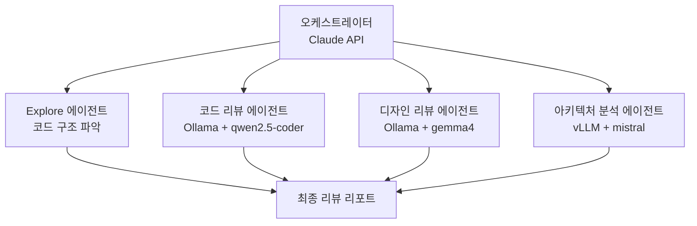
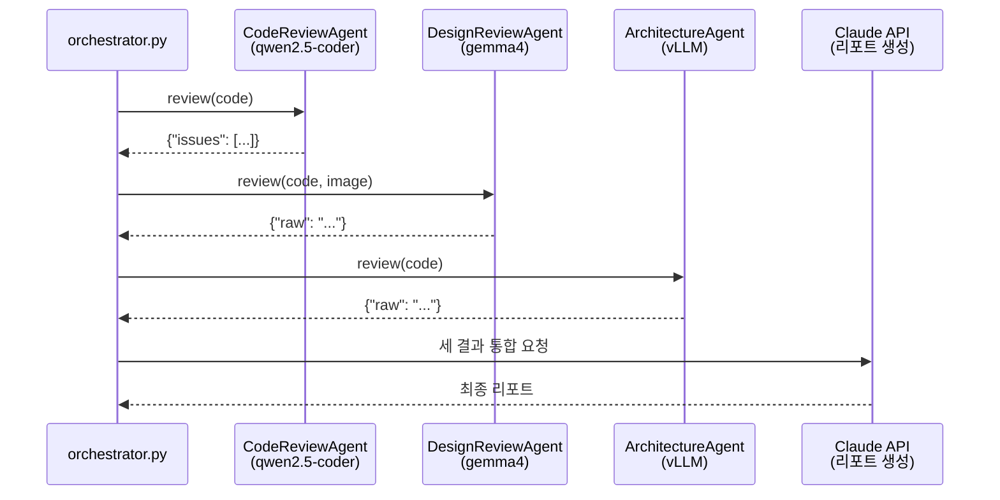
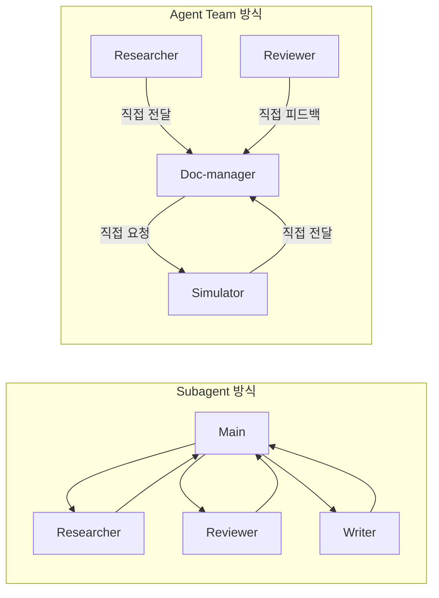
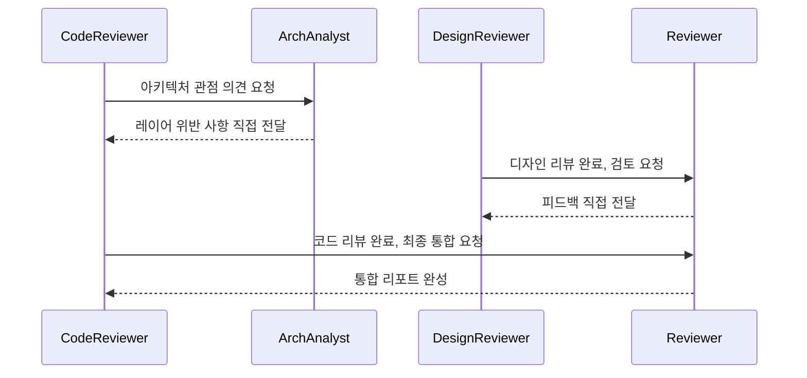

## 들어가며

[1편: 하네스 구축하기](/posts/claude-code-harness)에서 Hooks와 CLAUDE.md로 자동화 파이프라인의 뼈대를 만들었습니다.

이번 편에서는 **서브에이전트(Subagent)**를 추가해 리뷰 작업을 역할별로 분리합니다. 각 역할에 맞는 모델을 연결하면 비용, 속도, 품질을 동시에 최적화할 수 있습니다.

### 핵심 용어 정리

Claude Code에서 "에이전트"라는 단어는 세 가지 다른 개념을 가리킵니다. 먼저 이 구분을 명확히 이해해야 합니다.

| 용어 | 정의 | 특징 |
|---|---|---|
| **Main Agent** | Claude Code 세션 자체 | 사용자가 직접 만들지 않음. `.claude/agents/`에 정의 파일 없음 |
| **Subagent** | Main이 Tool로 호출하는 독립 에이전트 | `.claude/agents/*.md`에 정의. 독립 컨텍스트에서 실행 후 요약만 반환. 다른 Subagent와 **직접 소통 불가** (반드시 Main 경유) |
| **Agent Team** | 여러 Claude Code 인스턴스가 teammate로 동시 실행 | 실험적 기능. teammate끼리 **직접 메시지 교환** 가능 |

> 이 포스트는 Subagent 구축을 먼저 다루고, 마지막 섹션에서 Agent Team으로의 전환 방법과 실측 비교 결과를 다룹니다.
{: .prompt-info }

### 최종 목표: 역할별 멀티 에이전트 리뷰 시스템



---

## 1. 서브에이전트란?

서브에이전트는 **오케스트레이터(주 에이전트)가 특정 작업을 위임하는 독립 에이전트**입니다. Claude Code에서 서브에이전트는 `.claude/agents/` 디렉토리에 마크다운 파일(`.md`)로 정의합니다.

```
my-project/
└── .claude/
    └── agents/
        ├── code-reviewer.md       ← 코드 리뷰 에이전트 정의
        ├── design-reviewer.md     ← 디자인 리뷰 에이전트 정의
        └── architecture-analyst.md ← 아키텍처 분석 에이전트 정의
```

각 파일은 에이전트의 역할, 사용 가능한 도구, 출력 형식을 정의합니다. Main Agent가 이 에이전트를 호출하면 **독립 컨텍스트**에서 실행되고, 완료 후 요약 결과만 Main에 반환합니다.

### 왜 역할을 분리하는가?

| 방식 | 문제점 |
|---|---|
| 단일 LLM으로 전부 처리 | 코드 리뷰, 디자인 리뷰, 아키텍처 분석을 하나가 담당 → 비용 높음, 맥락 혼재 |
| 역할별 분리 | 각 작업에 맞는 모델 사용 → 비용 최적화, 전문성 향상 |

### 역할 분담 기준

| 에이전트 | 모델 | 이유 |
|---|---|---|
| 코드 리뷰 | `qwen2.5-coder` (Ollama) | 코드 특화 경량 모델, 빠르고 저비용 |
| 디자인 리뷰 | `gemma4` (Ollama) | 멀티모달 지원, 스크린샷/UI 분석 가능 |
| 아키텍처 분석 | `mistral` (vLLM) | 긴 컨텍스트, GPU 가속 배치 처리 |
| 최종 통합 | Claude API | 고품질 요약 및 리포트 생성 |

---

## 2. Claude Code 내 Agent 도구 활용

Claude Code에는 서브에이전트를 위임하는 **Agent 도구**가 내장되어 있습니다. 별도 코드 없이도 즉시 사용할 수 있습니다.

### 내장 서브에이전트 타입

| 타입 | 특징 |
|---|---|
| `general-purpose` | 범용. 파일 읽기, 검색, 복잡한 멀티스텝 작업 |
| `Explore` | 코드베이스 탐색 전문. Read-only 도구만 사용 |
| `Plan` | 구현 계획 설계 전문. 아키텍처 의사결정 |

### 실습: Explore 서브에이전트로 코드 구조 분석 위임

Claude Code를 실행하고 다음 프롬프트를 사용합니다.

```
Explore 서브에이전트를 사용해서 src/ 디렉토리의 전체 구조를 파악하고,
각 모듈의 역할과 의존 관계를 분석해서 요약해줘.
```

Claude는 내부적으로 다음과 같이 동작합니다.

```python
# Claude Code가 내부적으로 실행하는 Agent 도구 호출
agent(
    subagent_type="Explore",
    prompt="""
    src/ 디렉토리를 탐색하여:
    1. 각 파일의 역할 파악
    2. 모듈 간 의존 관계 분석
    3. 아키텍처 패턴 식별
    결과를 구조적으로 요약할 것.
    """,
    description="코드 구조 탐색"
)
```

> Explore 에이전트는 파일을 **읽기만** 하고 수정하지 않습니다. 코드베이스 분석 작업을 안전하게 위임할 수 있습니다.
{: .prompt-tip }

---

## 3. 서브에이전트에 역할 부여하기

에이전트의 동작 방식은 **시스템 프롬프트(System Prompt)**로 결정됩니다. 역할을 명확히 정의할수록 에이전트는 해당 역할에 집중합니다.

### 역할 부여 원칙

효과적인 역할 정의에는 세 가지 요소가 필요합니다.

```
1. 페르소나 (Persona)    → "당신은 시니어 Python 개발자입니다"
2. 전문 영역 (Domain)    → "PEP 8, 타입 힌트, 예외 처리를 전문으로 합니다"
3. 출력 형식 (Output)    → "발견된 문제를 JSON 형식으로 반환합니다"
```

### 역할별 시스템 프롬프트 예시

**코드 리뷰 에이전트**

```
당신은 10년 경력의 Python 시니어 개발자입니다.
주어진 코드를 다음 기준으로만 검토합니다:
- PEP 8 스타일 준수 여부
- 타입 힌트 작성 여부
- 예외 처리 적절성
- print() 사용 여부 (logging으로 대체 필요)

다른 주제(아키텍처, 디자인)는 다루지 않습니다.
발견된 문제는 반드시 다음 JSON 형식으로만 반환합니다:
{"issues": [{"line": 5, "severity": "error", "message": "설명"}]}
```

**디자인 리뷰 에이전트 (gemma4)**

```
당신은 UX 엔지니어입니다.
제공된 UI 스크린샷 또는 코드에서 다음을 검토합니다:
- 색상 대비 (WCAG AA 기준)
- 버튼/입력 필드 크기 (최소 44x44px)
- 폰트 가독성
- 일관된 간격(spacing) 사용

코드 품질이나 성능은 다루지 않습니다.
결과는 개선 우선순위(high/medium/low)와 함께 반환합니다.
```

**아키텍처 분석 에이전트 (vLLM)**

```
당신은 소프트웨어 아키텍트입니다.
전체 코드베이스를 분석하여 다음을 평가합니다:
- 레이어 구분 (API, Service, Model) 준수 여부
- 순환 의존성 존재 여부
- SOLID 원칙 위반 사항
- 확장성 병목 지점

개별 코드 스타일은 다루지 않습니다.
위반 사항은 심각도와 개선 방향을 포함해 반환합니다.
```

> 역할 경계를 명확히 정의하는 것이 핵심입니다. "다른 주제는 다루지 않습니다"라는 제약 문구가 에이전트의 집중도를 높입니다.
{: .prompt-info }

---

## 4. Agent SDK로 커스텀 서브에이전트 구현

### 사전 준비

```bash
pip install anthropic
```

### 기본 에이전트 구조

`agents/base_agent.py`를 생성합니다.

```python
import anthropic
from abc import ABC, abstractmethod


class BaseReviewAgent(ABC):
    """모든 리뷰 에이전트의 기반 클래스"""

    def __init__(self, client, model: str, system_prompt: str):
        self.client = client
        self.model = model
        self.system_prompt = system_prompt

    @abstractmethod
    def review(self, content: str) -> dict:
        """리뷰를 실행하고 결과를 반환합니다."""
        pass

    def _call_llm(self, user_message: str) -> str:
        response = self.client.messages.create(
            model=self.model,
            max_tokens=2048,
            system=self.system_prompt,
            messages=[{"role": "user", "content": user_message}]
        )
        return response.content[0].text
```

### 코드 리뷰 에이전트 (Ollama + qwen2.5-coder)

`agents/code_review_agent.py`를 생성합니다.

```python
import json
import anthropic
from .base_agent import BaseReviewAgent


CODE_REVIEW_SYSTEM_PROMPT = """
당신은 10년 경력의 Python 시니어 개발자입니다.
주어진 코드를 다음 기준으로만 검토합니다:
- PEP 8 스타일 준수 여부
- 타입 힌트 작성 여부
- 예외 처리 적절성
- print() 사용 여부 (logging으로 대체 필요)

다른 주제(아키텍처, 디자인)는 다루지 않습니다.
발견된 문제는 반드시 다음 JSON 형식으로만 반환합니다:
{"issues": [{"line": 5, "severity": "error", "message": "설명"}]}
"""


class CodeReviewAgent(BaseReviewAgent):
    def __init__(self):
        # Ollama는 OpenAI 호환 API를 제공합니다.
        client = anthropic.Anthropic(
            base_url="http://localhost:11434/v1",
            api_key="ollama"  # Ollama는 API 키 불필요 (임의값 사용)
        )
        super().__init__(
            client=client,
            model="qwen2.5-coder:7b",
            system_prompt=CODE_REVIEW_SYSTEM_PROMPT
        )

    def review(self, content: str) -> dict:
        prompt = f"다음 Python 코드를 검토해주세요:\n\n```python\n{content}\n```"
        raw = self._call_llm(prompt)
        try:
            return json.loads(raw)
        except json.JSONDecodeError:
            return {"issues": [], "raw": raw}
```

> Ollama는 OpenAI 호환 REST API를 `http://localhost:11434/v1`에서 제공합니다. Anthropic SDK의 `base_url`을 변경하면 동일한 코드로 연결할 수 있습니다.
{: .prompt-tip }

---

## 5. 역할별 로컬 LLM 연동

### Ollama 설치 및 모델 실행

```bash
# Ollama 설치 (Linux/macOS)
curl -fsSL https://ollama.com/install.sh | sh

# Windows: https://ollama.com 에서 설치 파일 다운로드

# 코드 리뷰용 모델
ollama pull qwen2.5-coder:7b

# 디자인 리뷰용 모델 (멀티모달)
ollama pull gemma4:12b

# 실행 확인
ollama list
```

### 디자인 리뷰 에이전트 (Ollama + gemma4)

`agents/design_review_agent.py`를 생성합니다.

```python
import base64
import json
import anthropic
from .base_agent import BaseReviewAgent


DESIGN_REVIEW_SYSTEM_PROMPT = """
당신은 UX 엔지니어입니다.
제공된 UI 스크린샷 또는 CSS/HTML 코드에서 다음을 검토합니다:
- 색상 대비 (WCAG AA 기준)
- 버튼/입력 필드 크기 (최소 44x44px)
- 폰트 가독성
- 일관된 간격(spacing) 사용

코드 품질이나 성능은 다루지 않습니다.
결과는 개선 우선순위(high/medium/low)와 함께 반환합니다.
"""


class DesignReviewAgent(BaseReviewAgent):
    def __init__(self):
        client = anthropic.Anthropic(
            base_url="http://localhost:11434/v1",
            api_key="ollama"
        )
        super().__init__(
            client=client,
            model="gemma4:12b",  # 멀티모달 지원 모델
            system_prompt=DESIGN_REVIEW_SYSTEM_PROMPT
        )

    def review(self, content: str, image_path: str = None) -> dict:
        if image_path:
            # 이미지 파일을 Base64로 인코딩하여 멀티모달 리뷰
            with open(image_path, "rb") as f:
                image_data = base64.b64encode(f.read()).decode()
            prompt = [
                {
                    "type": "image",
                    "source": {
                        "type": "base64",
                        "media_type": "image/png",
                        "data": image_data
                    }
                },
                {"type": "text", "text": "이 UI 스크린샷을 디자인 기준으로 검토해주세요."}
            ]
        else:
            prompt = f"다음 CSS/HTML 코드를 디자인 기준으로 검토해주세요:\n\n{content}"

        raw = self._call_llm(str(prompt))
        return {"raw": raw}
```

### vLLM 서버 구동 (아키텍처 분석)

vLLM은 GPU가 있는 서버 환경에서 고성능 추론을 제공합니다.

```bash
# vLLM 설치
pip install vllm

# mistral 모델로 서버 시작
python -m vllm.entrypoints.openai.api_server \
  --model mistralai/Mistral-7B-Instruct-v0.3 \
  --port 8000

# 동작 확인
curl http://localhost:8000/v1/models
```

`agents/architecture_agent.py`를 생성합니다.

```python
import json
import anthropic
from .base_agent import BaseReviewAgent


ARCHITECTURE_SYSTEM_PROMPT = """
당신은 소프트웨어 아키텍트입니다.
전체 코드베이스를 분석하여 다음을 평가합니다:
- 레이어 구분 (API, Service, Model) 준수 여부
- 순환 의존성 존재 여부
- SOLID 원칙 위반 사항
- 확장성 병목 지점

개별 코드 스타일은 다루지 않습니다.
위반 사항은 심각도와 개선 방향을 포함해 반환합니다.
"""


class ArchitectureAgent(BaseReviewAgent):
    def __init__(self):
        client = anthropic.Anthropic(
            base_url="http://localhost:8000/v1",  # vLLM 서버
            api_key="vllm"
        )
        super().__init__(
            client=client,
            model="mistralai/Mistral-7B-Instruct-v0.3",
            system_prompt=ARCHITECTURE_SYSTEM_PROMPT
        )

    def review(self, content: str) -> dict:
        prompt = f"다음 코드베이스 구조를 아키텍처 관점에서 분석해주세요:\n\n{content}"
        raw = self._call_llm(prompt)
        return {"raw": raw}
```

---

## 6. 오케스트레이터로 서브에이전트 조율

오케스트레이터는 각 서브에이전트를 순서대로 호출하고 결과를 통합합니다.

`orchestrator.py`를 생성합니다.

```python
import anthropic
from agents.code_review_agent import CodeReviewAgent
from agents.design_review_agent import DesignReviewAgent
from agents.architecture_agent import ArchitectureAgent


def run_full_review(file_path: str, image_path: str = None) -> str:
    """
    역할별 서브에이전트를 순서대로 실행하고
    Claude API로 최종 리포트를 생성합니다.
    """

    # 파일 내용 읽기
    with open(file_path, "r", encoding="utf-8") as f:
        code_content = f.read()

    results = {}

    # 1. 코드 리뷰 에이전트 (Ollama + qwen2.5-coder)
    print("[1/3] 코드 리뷰 중 (qwen2.5-coder)...")
    code_agent = CodeReviewAgent()
    results["code_review"] = code_agent.review(code_content)

    # 2. 디자인 리뷰 에이전트 (Ollama + gemma4)
    print("[2/3] 디자인 리뷰 중 (gemma4)...")
    design_agent = DesignReviewAgent()
    results["design_review"] = design_agent.review(code_content, image_path)

    # 3. 아키텍처 분석 에이전트 (vLLM + mistral)
    print("[3/3] 아키텍처 분석 중 (vLLM)...")
    arch_agent = ArchitectureAgent()
    results["architecture_review"] = arch_agent.review(code_content)

    # 4. 최종 리포트 생성 (Claude API)
    print("[리포트] 최종 리포트 생성 중 (Claude)...")
    client = anthropic.Anthropic()  # ANTHROPIC_API_KEY 환경변수 사용
    report_prompt = f"""
다음은 {file_path}에 대한 세 에이전트의 리뷰 결과입니다.

## 코드 리뷰 (qwen2.5-coder)
{results['code_review']}

## 디자인 리뷰 (gemma4)
{results['design_review']}

## 아키텍처 분석 (mistral)
{results['architecture_review']}

위 결과를 통합하여 개발자가 바로 실행할 수 있는 개선 액션 리스트를 작성해주세요.
우선순위(높음/중간/낮음)와 예상 소요 시간을 포함해주세요.
"""
    response = client.messages.create(
        model="claude-opus-4-6",
        max_tokens=2048,
        messages=[{"role": "user", "content": report_prompt}]
    )
    return response.content[0].text


if __name__ == "__main__":
    import sys
    file_path = sys.argv[1] if len(sys.argv) > 1 else "src/main.py"
    image_path = sys.argv[2] if len(sys.argv) > 2 else None

    report = run_full_review(file_path, image_path)
    print("\n" + "="*60)
    print("최종 리뷰 리포트")
    print("="*60)
    print(report)
```

---

## 7. 검증: 전체 파이프라인 실행

### 환경 준비

```bash
# Ollama 모델 실행 확인
ollama list
# qwen2.5-coder:7b, gemma4:12b 목록에 있어야 함

# vLLM 서버 실행 확인
curl http://localhost:8000/v1/models

# Anthropic API 키 설정
export ANTHROPIC_API_KEY="sk-ant-..."
```

### 테스트 실행

```bash
python orchestrator.py src/main.py
```

### 예상 출력

```
[1/3] 코드 리뷰 중 (qwen2.5-coder)...
[2/3] 디자인 리뷰 중 (gemma4)...
[3/3] 아키텍처 분석 중 (vLLM)...
[리포트] 최종 리포트 생성 중 (Claude)...

============================================================
최종 리뷰 리포트
============================================================
## 개선 액션 리스트

### 높음 (즉시 수정)
1. [코드] main.py:3 — print() → logging.info() 교체 (5분)
2. [코드] main.py:1 — 함수 타입 힌트 추가: def add(a: int, b: int) -> int (5분)

### 중간 (이번 스프린트)
3. [아키텍처] 비즈니스 로직이 API 레이어에 혼재 — Service 레이어로 분리 (2시간)

### 낮음 (다음 스프린트)
4. [디자인] 버튼 최소 크기 기준 미충족 (1시간)
```



---

## 8. Agent Team: 에이전트 간 직접 소통 (실험적 기능)

지금까지 구축한 Subagent 구조는 모든 통신이 Main을 경유합니다. 에이전트 수가 많아질수록 이 중개 비용이 누적됩니다. **Agent Team**은 에이전트끼리 직접 메시지를 주고받아 이 문제를 해결합니다.

### Subagent vs Agent Team 실측 비교

동일한 6개 에이전트 시나리오를 양쪽에서 실행한 결과입니다.

| 지표 | Subagent 방식 | Agent Team 방식 | 차이 |
|---|---|---|---|
| 실행 시간 | 약 17분 11초 | 약 7분 43초 | **-55%** |
| 토큰 사용량 | 168,188 | 124,130 | **-26%** |
| 도구 호출 횟수 | 63회 | 48회 | -24% |

> Subagent 방식이 더 저렴하다는 기존 통념은 단순 작업 기준입니다. **에이전트가 서로 정보를 주고받아야 하는 협업 시나리오**에서는 Main 중개 비용이 누적되어 오히려 Subagent가 더 비싸질 수 있습니다.
{: .prompt-danger }

### 구조 비교



### Agent Team 활성화 방법

**Step 1: settings.json에 환경변수 추가**

`.claude/settings.json`에 다음을 추가합니다.

```json
{
  "env": {
    "CLAUDE_CODE_EXPERIMENTAL_AGENT_TEAMS": "1"
  },
  "permissions": {
    "allow": ["Read(./**)", "Write(./src/**)"]
  }
}
```

**Step 2: CLAUDE.md 규칙 수정**

Subagent 방식의 CLAUDE.md에는 "에이전트 간 직접 호출 금지" 규칙이 있었습니다. Agent Team에서는 이 규칙을 제거하고 직접 소통을 허용합니다.

```diff
- ## 에이전트 규칙
- - Agent 간 직접 호출 금지 (반드시 Main을 경유)
- - Orchestrator Agent가 작업 순서를 조율
- - Agent 우선순위: Researcher → Doc-manager → Reviewer

+ ## Agent Team 규칙
+ - teammate 간 직접 메시지 허용
+ - 각 teammate는 자율적으로 필요한 teammate에게 요청 가능
+ - Reviewer는 산출물 완성 시 해당 teammate에게 직접 피드백
```

**Step 3: 에이전트 정의 파일 (`.claude/agents/*.md`) 수정 불필요**

기존 `.claude/agents/*.md` 파일은 그대로 유지합니다. 환경변수와 CLAUDE.md 변경만으로 teammate role로 자동 전환됩니다.

### Agent Team 실행 예시

Subagent 방식에서는 복잡한 오케스트레이터 코드가 필요했지만, Agent Team은 단순한 프롬프트로 실행됩니다.

```
agent team을 구성해서 다음 파일들을 리뷰해줘:
- src/main.py (코드 리뷰 + 아키텍처 분석)
- designs/mockup.png (디자인 리뷰)

각 에이전트가 협력해서 최종 리포트를 만들어줘.
```

Agent Team이 활성화되면 에이전트들이 다음과 같이 자율 협력합니다.



### 언제 어떤 방식을 선택할까?

| 상황 | 권장 방식 | 이유 |
|---|---|---|
| 에이전트가 독립 작업 (결과만 반환) | **Subagent** | 중개 비용 없음, 안정적 |
| 에이전트 간 정보 교환이 많음 | **Agent Team** | 직접 소통으로 토큰/시간 절감 |
| 프로덕션 환경 | **Subagent** | Agent Team은 아직 실험적 기능 |
| 빠른 프로토타입/실험 | **Agent Team** | 설정 간단, 자율 협력 |

> Agent Team은 현재 실험적(Experimental) 기능입니다. 정식 출시 전까지는 프로덕션보다 실험/프로토타입 환경에서 사용을 권장합니다.
{: .prompt-danger }

---

## 정리

| 에이전트 | 모델 | 접속 주소 | 역할 |
|---|---|---|---|
| CodeReviewAgent | qwen2.5-coder:7b | Ollama :11434 | 코드 스타일/품질 |
| DesignReviewAgent | gemma4:12b | Ollama :11434 | UI/UX 검토 |
| ArchitectureAgent | mistral (vLLM) | vLLM :8000 | 아키텍처 분석 |
| 오케스트레이터 | claude-opus-4-6 | Anthropic API | 결과 통합 리포트 |

역할을 명확히 분리하면:
- **비용 최적화**: 반복적인 lint 수준 검사는 로컬 모델이 담당
- **품질 최적화**: 최종 통합 리포트만 Claude API 사용
- **병렬 확장**: 각 에이전트를 독립적으로 업그레이드/교체 가능
- **협업 고도화**: 에이전트 수 증가 시 Agent Team으로 전환해 성능 향상

---

## 시리즈 마무리

| 편 | 주제 | 핵심 결과물 |
|---|---|---|
| [1편](/posts/claude-code-harness) | 하네스 구축 | settings.json, Hooks, CLAUDE.md |
| **2편** | 서브에이전트 구축 | 역할별 멀티 에이전트 파이프라인 + Agent Team 전환 |

두 편을 합치면 **파일 수정 감지 → 자동 lint → 역할별 AI 리뷰 → 최종 리포트**까지 완전히 자동화된 리뷰 시스템이 완성됩니다. 에이전트가 늘어날수록 Agent Team 방식으로 전환해 비용과 속도를 동시에 최적화하세요.
