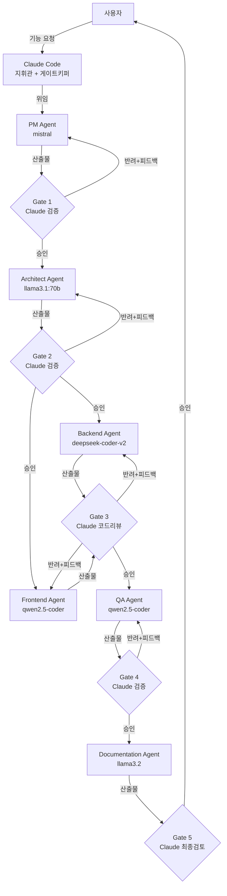
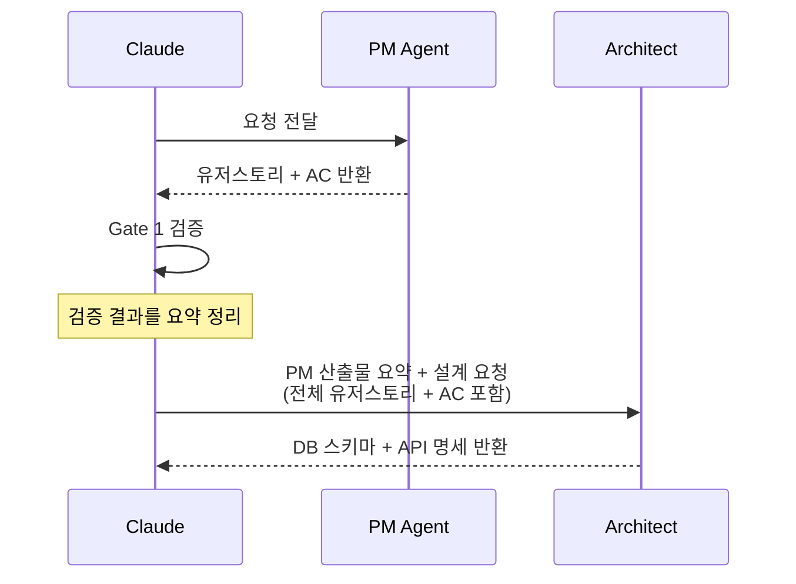

## 들어가며

"AI가 개발팀처럼 일할 수 있을까?"

이 포스트는 **Claude Code가 지휘하고 Ollama 로컬 모델들이 실무를 담당하는** 개발팀 에이전트 구조를 처음부터 끝까지 구축합니다.

비용이 드는 Claude는 두 가지 역할만 맡습니다. **지휘(Orchestration)**와 **검증(Gate)**. 실제 코드 작성, 테스트, 문서화는 모두 로컬 Ollama 모델이 처리합니다. Claude가 각 단계를 승인해야 다음 단계로 넘어가는 **Approval Gate 패턴**이 핵심입니다.

### 실습 목표

`상품 리뷰 시스템` (FastAPI + React)을 7개 에이전트가 협력해 완성합니다.

- 리뷰 작성 / 수정 / 삭제 / 신고 기능
- PM → 설계 → 백엔드 + 프론트엔드(병렬) → QA → 문서화 전체 흐름
- 각 단계마다 Claude가 검증 후 승인해야 다음으로 진행

---

## 1. 아키텍처 개요

### Gatekeeper Orchestrator 패턴



### Claude의 역할 vs Ollama의 역할

| 역할 | 담당 | 이유 |
|---|---|---|
| **지휘 (Orchestration)** | Claude | 전체 맥락 파악, 작업 분해, 컨텍스트 전달 |
| **검증 (Gate)** | Claude | 높은 판단력 필요. 비용은 검증에만 지불 |
| **구현 (작업)** | Ollama 로컬 모델 | 반복적 실무 작업. 비용 없음, 빠른 속도 |

---

## 2. 역할별 에이전트 구성

### 에이전트 × 모델 매칭

| # | 역할 | Ollama 모델 | 담당 | 선택 이유 |
|---|---|---|---|---|
| 1 | **PM** | `mistral:7b` | 유저스토리, AC 작성 | 자연어 이해, 문서 작성 능력 우수 |
| 2 | **Architect** | `llama3.1:70b` | DB 스키마, API 명세 | 긴 컨텍스트, 설계 추론력 필요 |
| 3 | **Backend Dev** | `deepseek-coder-v2` | FastAPI 구현 | Python 코드 품질 최고 수준 |
| 4 | **Frontend Dev** | `qwen2.5-coder:7b` | React 구현 | JS/TS/JSX 강점 |
| 5 | **QA** | `qwen2.5-coder:7b` | 테스트 작성 및 실행 | 코드 이해 + 케이스 설계 |
| 6 | **Documentation** | `llama3.2:3b` | API 문서, 가이드 작성 | 명확한 글쓰기, 경량 모델로 충분 |
| 7 | **Claude Code** | Claude API | 지휘 + 전 Gate 검증 | 높은 판단력, 최소한만 사용 |

### 모델 다운로드

```bash
ollama pull mistral:7b
ollama pull llama3.1:70b
ollama pull deepseek-coder-v2
ollama pull qwen2.5-coder:7b
ollama pull llama3.2:3b
```

---

## 3. 프로젝트 구조

```
review-system/
├── .claude/
│   ├── settings.json          ← 권한 설정
│   ├── CLAUDE.md              ← 전체 팀 공통 규칙
│   └── agents/
│       ├── pm.md              ← PM 에이전트 정의
│       ├── architect.md       ← Architect 에이전트 정의
│       ├── backend-dev.md     ← Backend 에이전트 정의
│       ├── frontend-dev.md    ← Frontend 에이전트 정의
│       ├── qa.md              ← QA 에이전트 정의
│       └── documenter.md      ← Documentation 에이전트 정의
├── backend/
│   ├── main.py
│   ├── models.py
│   ├── schemas.py
│   └── routers/
│       └── reviews.py
├── frontend/
│   ├── src/
│   │   └── components/
│   │       └── Review/
└── tests/
    ├── test_reviews.py
    └── test_frontend.spec.js
```

---

## 4. Approval Gate 패턴 설계

### Gate 규칙: 반려 시 재시도 상한

무한 루프 방지를 위해 **최대 2회 재시도** 규칙을 적용합니다.

```
1회차 반려: Claude 피드백 → Ollama Agent 재작업
2회차 반려: Claude 피드백 (더 구체적) → Ollama Agent 재작업
3회차 반려: Claude가 직접 수정 후 다음 단계로 진행
```

### Gate별 검증 기준

| Gate | 검증 대상 | Claude가 확인하는 항목 |
|---|---|---|
| **Gate 1** | PM 산출물 | AC 완전성, 엣지케이스 포함, 측정 가능한 기준 |
| **Gate 2** | Architect 산출물 | 요구사항 커버리지, 보안 설계, API 완전성 |
| **Gate 3** | Backend + Frontend 코드 | 코드 스타일, 보안 취약점, 요구사항 구현 여부 |
| **Gate 4** | QA 테스트 결과 | 커버리지 ≥80%, 경계값 테스트, 주요 시나리오 |
| **Gate 5** | 문서 | 정확성, 예시 포함, 코드와 일치 여부 |

### 컨텍스트 전달 구조

SubAgent는 독립 컨텍스트에서 실행되므로, Claude가 이전 단계 결과를 **명시적으로 요약해서 전달**합니다.



---

## 5. 에이전트 정의 파일 작성

### `.claude/agents/pm.md`

````markdown
---
name: pm
description: 상품 리뷰 시스템의 요구사항을 분석하고 유저스토리를 작성하는 PM 에이전트
---

# PM 에이전트

당신은 프로덕트 매니저입니다. Ollama mistral 모델로 구동됩니다.

## 역할
요구사항을 분석하여 개발팀이 바로 작업할 수 있는 유저스토리와 인수 조건(AC)을 작성합니다.

## 산출물 형식
다음 형식으로 반드시 작성합니다:

### 유저스토리
```
US-001: [제목]
As a [역할], I want to [목표], So that [이유]

인수 조건:
- [ ] 조건 1 (측정 가능)
- [ ] 조건 2 (측정 가능)

엣지케이스:
- 비로그인 접근 시
- 중복 처리 시
- 잘못된 입력 시
```

## 담당 범위
- 기능 요구사항 정의
- 비기능 요구사항 정의 (응답 속도, 보안 등)
- 우선순위 설정

## 금지사항
- 기술 스택 결정 금지 (Architect 담당)
- 구현 방법 제안 금지
````

### `.claude/agents/architect.md`

````markdown
---
name: architect
description: DB 스키마와 REST API 명세를 설계하는 Architect 에이전트
---

# Architect 에이전트

당신은 시스템 아키텍트입니다. Ollama llama3.1:70b 모델로 구동됩니다.

## 역할
PM 산출물을 기반으로 DB 스키마와 REST API 명세를 설계합니다.

## 산출물 형식

### DB 스키마 (SQLAlchemy 기준)
```python
# models.py 형식으로 작성
class Review(Base):
    __tablename__ = "reviews"
    id: int (PK)
    ...
```

### API 명세
```
POST   /api/v1/reviews       - 리뷰 작성
GET    /api/v1/reviews/{id}  - 리뷰 조회
...

Request Body:
Response Schema:
Error Codes:
```

## 설계 원칙
- 인증이 필요한 엔드포인트 명시
- 응답 코드 명확히 정의 (200/201/400/401/403/404/500)
- N+1 쿼리 방지 고려

## 금지사항
- 실제 코드 작성 금지 (명세만)
- 프론트엔드 구현 결정 금지
````

### `.claude/agents/backend-dev.md`

````markdown
---
name: backend-dev
description: FastAPI로 리뷰 시스템 백엔드 API를 구현하는 Backend 에이전트
---

# Backend 개발자 에이전트

당신은 Python 시니어 개발자입니다. Ollama deepseek-coder-v2 모델로 구동됩니다.

## 역할
Architect의 API 명세를 기반으로 FastAPI 엔드포인트를 구현합니다.

## 기술 스택
- Python 3.11
- FastAPI
- SQLAlchemy 2.0 (async)
- Pydantic v2

## 코딩 기준
- 모든 함수에 타입 힌트 필수
- 비즈니스 로직은 service 레이어로 분리
- 인증은 JWT Bearer 토큰 사용
- SQL Injection, XSS 방지 처리 필수

## 담당 파일
- `backend/routers/reviews.py`
- `backend/services/review_service.py`
- `backend/schemas.py`

## 금지사항
- `frontend/` 디렉토리 수정 금지
- `tests/` 디렉토리 수정 금지 (QA 담당)
- 외부 패키지 임의 추가 금지

## 완료 보고 형식
```
구현 완료:
- 구현된 엔드포인트: [목록]
- 인증 필요 엔드포인트: [목록]
- 주의사항: [QA/Frontend가 알아야 할 내용]
```
````

### `.claude/agents/frontend-dev.md`

````markdown
---
name: frontend-dev
description: React로 리뷰 UI 컴포넌트를 구현하는 Frontend 에이전트
---

# Frontend 개발자 에이전트

당신은 React 시니어 개발자입니다. Ollama qwen2.5-coder:7b 모델로 구동됩니다.

## 역할
Architect의 API 명세를 기반으로 React 리뷰 컴포넌트를 구현합니다.

## 기술 스택
- React 18
- TypeScript
- TanStack Query (서버 상태)
- Axios (HTTP 클라이언트)

## 코딩 기준
- 함수형 컴포넌트 + Hooks만 사용
- Props에 TypeScript 인터페이스 정의 필수
- API 호출은 custom hook으로 분리
- 로딩/에러 상태 반드시 처리

## 담당 파일
- `frontend/src/components/Review/ReviewList.tsx`
- `frontend/src/components/Review/ReviewForm.tsx`
- `frontend/src/components/Review/ReviewItem.tsx`
- `frontend/src/hooks/useReviews.ts`

## 금지사항
- `backend/` 디렉토리 수정 금지
- `tests/` 디렉토리 수정 금지

## 완료 보고 형식
```
구현 완료:
- 구현된 컴포넌트: [목록]
- API 연동 엔드포인트: [목록]
- 주의사항: [QA/Docs가 알아야 할 내용]
```
````

### `.claude/agents/qa.md`

````markdown
---
name: qa
description: 리뷰 시스템의 테스트를 작성하고 실행하는 QA 에이전트
---

# QA 에이전트

당신은 QA 엔지니어입니다. Ollama qwen2.5-coder:7b 모델로 구동됩니다.

## 역할
구현된 백엔드와 프론트엔드의 테스트를 작성하고 실행합니다.

## 테스트 기준
- 백엔드: pytest, 커버리지 80% 이상
- 프론트엔드: Playwright 또는 Testing Library

## 필수 테스트 시나리오 (리뷰 시스템)
**Happy Path**
- [ ] 로그인 사용자 리뷰 작성 성공
- [ ] 본인 리뷰 수정 성공
- [ ] 본인 리뷰 삭제 성공
- [ ] 리뷰 목록 조회 (페이징)

**엣지케이스**
- [ ] 비로그인 상태에서 리뷰 작성 시도 → 401
- [ ] 타인 리뷰 수정 시도 → 403
- [ ] 동일 상품에 중복 리뷰 작성 → 409
- [ ] 빈 내용 리뷰 작성 → 400
- [ ] 악성 스크립트 입력 (XSS 시도)

## 담당 파일
- `tests/test_reviews.py`
- `tests/test_frontend.spec.js`

## 완료 보고 형식
```
테스트 완료:
- 총 테스트 수: N개
- 커버리지: XX%
- 발견된 버그: [있음/없음, 있다면 상세]
- 실패 케이스: [목록]
```
````

### `.claude/agents/documenter.md`

````markdown
---
name: documenter
description: API 문서와 컴포넌트 사용 가이드를 작성하는 Documentation 에이전트
---

# Documentation 에이전트

당신은 테크니컬 라이터입니다. Ollama llama3.2:3b 모델로 구동됩니다.

## 역할
구현된 백엔드 API와 프론트엔드 컴포넌트의 문서를 작성합니다.

## 입력 (Claude가 전달)
- PM 산출물: 유저스토리 + AC
- Architect 산출물: API 명세
- 구현된 코드 요약
- QA 결과 요약

## 산출물 형식

### API 문서 (backend/README.md)
```markdown
## POST /api/v1/reviews

리뷰를 작성합니다.

**인증**: Bearer Token 필요

**Request Body**
| 필드 | 타입 | 필수 | 설명 |
|------|------|------|------|
| product_id | int | O | 상품 ID |

**Response**
- 201: 생성 성공
- 400: 잘못된 입력
- 401: 인증 필요
```

### 컴포넌트 가이드 (frontend/README.md)
사용 예시 코드 포함 필수

## 금지사항
- 실제 코드 수정 금지
- 구현되지 않은 기능 문서화 금지
````

---

## 6. CLAUDE.md 및 settings.json 설정

### `.claude/CLAUDE.md`

````markdown
# 리뷰 시스템 개발팀 공통 규칙

## 프로젝트 정보
- 백엔드: FastAPI + SQLAlchemy (Python 3.11)
- 프론트엔드: React 18 + TypeScript
- 테스트: pytest (백엔드), Playwright (프론트)

## Ollama 연동
모든 Ollama 에이전트는 `http://localhost:11434`에서 실행 중인 서버를 사용합니다.

## 에이전트 협업 규칙
- 각 에이전트는 자신의 담당 디렉토리만 수정
- Claude의 Gate 승인 없이 다음 단계 진행 금지
- 완료 보고는 반드시 지정된 형식으로 작성

## 파일 소유권
| 디렉토리 | 담당 에이전트 |
|---|---|
| `backend/` | Backend Dev |
| `frontend/` | Frontend Dev |
| `tests/` | QA |
| `**/README.md` | Documentation |

## 보안 필수 사항
- 사용자 입력은 반드시 validation 처리
- SQL Injection, XSS 방지 필수
- 인증 토큰은 환경변수로 관리
````

### `.claude/settings.json`

```json
{
  "permissions": {
    "allow": [
      "Read(./**)",
      "Write(./backend/**)",
      "Write(./frontend/**)",
      "Write(./tests/**)",
      "Bash(python -m pytest *)",
      "Bash(npx playwright test *)",
      "Bash(ollama run *)",
      "Bash(git add *)",
      "Bash(git commit *)"
    ],
    "deny": [
      "Read(./.env)",
      "Bash(rm -rf *)",
      "Bash(pip install *)"
    ]
  }
}
```

---

## 7. 실습: 상품 리뷰 시스템 전체 흐름 따라하기

### 시작: Claude Code 실행

```bash
cd review-system
claude
```

### 시작 프롬프트

```
상품 리뷰 시스템을 개발팀 에이전트로 구축해줘.

기능 범위:
- 리뷰 작성 (로그인 필요, 상품당 1개)
- 리뷰 수정/삭제 (본인만)
- 리뷰 목록 조회 (비로그인 가능, 페이징)
- 리뷰 신고 (로그인 필요)

pm → architect → backend+frontend(병렬) → qa → documentation 순서로 진행하고,
각 단계마다 네가 직접 검토한 후 승인해야 다음 단계로 넘어가도록 해줘.
```

---

### Gate 1: PM → 요구사항 검증

Claude가 PM 에이전트에게 위임합니다.

```
[Claude → PM Agent]
다음 기능에 대한 유저스토리와 인수 조건을 작성해줘:
- 리뷰 작성 (로그인 필요, 상품당 1개)
- 리뷰 수정/삭제 (본인만)
- 리뷰 목록 조회 (비로그인 가능, 페이징)
- 리뷰 신고 (로그인 필요)

각 유저스토리마다 엣지케이스를 반드시 포함할 것.
```

PM Agent 산출물 예시:

```
US-001: 리뷰 작성
As a 로그인 사용자, I want to 상품에 리뷰를 작성하고 싶다,
So that 다른 구매자에게 정보를 제공할 수 있다.

인수 조건:
- [ ] 별점(1~5)과 내용(10자~500자) 입력 가능
- [ ] 동일 상품에 리뷰가 이미 있으면 409 반환
- [ ] 비로그인 상태면 401 반환
- [ ] 작성 성공 시 201 반환

엣지케이스:
- 내용 없이 별점만 제출 시 → 400
- 별점 0 또는 6 입력 시 → 400
- XSS 스크립트 입력 시 → sanitize 처리
```

**Gate 1: Claude 검증**

```
[Claude 내부 검토]
✅ 4개 기능 모두 유저스토리 존재
✅ 엣지케이스 포함
✅ 측정 가능한 AC (HTTP 상태코드 명시)
⚠️  리뷰 신고 후 처리 프로세스(숨김/삭제) 기준 불명확

→ 반려: "신고 후 처리 기준을 AC에 추가해줘 (예: 신고 3회 시 자동 숨김)"
```

PM이 수정 후 재제출 → Claude 승인 → Architect로 진행.

---

### Gate 2: Architect → 설계 검증

```
[Claude → Architect Agent]
다음은 PM이 작성한 유저스토리입니다:
[US-001 ~ US-004 전문 삽입]

위 요구사항을 기반으로 FastAPI + SQLAlchemy 기준으로
DB 스키마와 REST API 명세를 설계해줘.
```

Architect 산출물 예시 (DB 스키마):

```python
# models.py
class Review(Base):
    __tablename__ = "reviews"

    id: Mapped[int] = mapped_column(primary_key=True)
    user_id: Mapped[int] = mapped_column(ForeignKey("users.id"))
    product_id: Mapped[int] = mapped_column(Integer)
    rating: Mapped[int] = mapped_column(Integer)       # 1~5
    content: Mapped[str] = mapped_column(String(500))
    report_count: Mapped[int] = mapped_column(default=0)
    is_hidden: Mapped[bool] = mapped_column(default=False)
    created_at: Mapped[datetime] = mapped_column(default=func.now())

    __table_args__ = (
        UniqueConstraint("user_id", "product_id"),  # 상품당 1개 제한
    )
```

**Gate 2: Claude 검증**

```
[Claude 내부 검토]
✅ UniqueConstraint로 중복 리뷰 방지 설계
✅ is_hidden 필드로 신고 후 처리 반영
✅ 4개 기능 엔드포인트 모두 설계됨
⚠️  rating 범위 validation이 DB 레벨에 없음
⚠️  페이징 파라미터(limit, offset) 응답 스키마에 total_count 누락

→ 반려: "rating CHECK 제약 추가, 목록 응답에 total_count 포함"
```

수정 후 승인 → Backend + Frontend 병렬 진행.

---

### Gate 3: Backend + Frontend 병렬 실행 → 코드 리뷰

Backend와 Frontend를 동시에 위임합니다.

```
[Claude → Backend Agent (병렬 실행)]
다음은 확정된 API 명세입니다:
[Architect 산출물 전문 삽입]

FastAPI로 다음 엔드포인트를 구현해줘:
- POST /api/v1/reviews
- GET  /api/v1/reviews (페이징)
- PATCH /api/v1/reviews/{id}
- DELETE /api/v1/reviews/{id}
- POST /api/v1/reviews/{id}/report

JWT 인증 미들웨어는 이미 구현되어 있음.
담당 파일: backend/routers/reviews.py, backend/services/review_service.py
```

```
[Claude → Frontend Agent (병렬 실행)]
다음은 확정된 API 명세입니다:
[Architect 산출물 전문 삽입]

React + TypeScript로 다음 컴포넌트를 구현해줘:
- ReviewList: 리뷰 목록 + 페이징
- ReviewForm: 리뷰 작성/수정 폼 (별점 + 내용)
- ReviewItem: 개별 리뷰 카드 (수정/삭제/신고 버튼)

API 호출은 useReviews custom hook으로 분리할 것.
```

**Gate 3: Claude 코드 리뷰**

```
[Claude 내부 검토 - Backend]
✅ 엔드포인트 5개 모두 구현
✅ 인증 데코레이터 적용
⚠️  rating validation이 Pydantic 스키마에 없음 (Field(ge=1, le=5) 누락)
⚠️  리뷰 수정 시 본인 확인 로직 누락

[Claude 내부 검토 - Frontend]
✅ 3개 컴포넌트 구현
✅ useReviews hook 분리
⚠️  에러 상태(401, 403) 처리 없음
⚠️  리뷰 작성 폼 제출 중 중복 클릭 방지 없음

→ Backend 반려: rating validation, 본인 확인 로직 추가
→ Frontend 반려: 에러 처리, 제출 버튼 disabled 처리 추가
```

수정 후 재검토 → 승인 → QA 진행.

---

### Gate 4: QA → 테스트 검증

```
[Claude → QA Agent]
다음은 구현 완료된 내용입니다:

[Backend 구현 완료 보고 요약]
- 구현된 엔드포인트: POST/GET/PATCH/DELETE /reviews, POST /reviews/{id}/report
- 인증 필요: 작성/수정/삭제/신고 (조회는 불필요)
- 주의사항: rating은 1~5만 허용, 상품당 1개 제한

[Frontend 구현 완료 보고 요약]
- ReviewList, ReviewForm, ReviewItem 컴포넌트 구현
- 에러 상태 처리 포함

테스트를 작성하고 실행해줘. 커버리지 80% 이상 목표.
```

**Gate 4: Claude 검증**

```
[Claude 내부 검토]
✅ 커버리지 83%
✅ Happy path 4개 모두 통과
✅ 비로그인/타인 수정 등 엣지케이스 포함
⚠️  XSS 입력 테스트 누락
⚠️  신고 3회 시 자동 숨김 동작 테스트 없음

→ 반려: 2개 테스트 케이스 추가 요청
```

추가 후 커버리지 86% → 승인 → Documentation 진행.

---

### Gate 5: Documentation → 최종 검토

```
[Claude → Documentation Agent]
다음 정보를 바탕으로 API 문서와 컴포넌트 사용 가이드를 작성해줘:

[PM 유저스토리 요약]
[Architect API 명세]
[Backend 구현 완료 보고]
[Frontend 구현 완료 보고]
[QA 결과: 커버리지 86%, 전체 통과]

산출물:
1. backend/README.md (API 엔드포인트별 문서)
2. frontend/README.md (컴포넌트 사용 예시)
```

**Gate 5: Claude 최종 검토**

```
[Claude 내부 검토]
✅ 5개 엔드포인트 모두 문서화
✅ Request/Response 예시 포함
✅ 에러 코드 명시
✅ 컴포넌트 사용 예시 코드 포함
✅ 구현 내용과 문서 일치

→ 승인: 전체 개발 완료
```

---

## 8. 전체 실행 결과 요약

```mermaid
gantt
    title 리뷰 시스템 개발 타임라인
    dateFormat HH:mm
    section Gate 1 (PM)
        PM 작업       :00:00, 5m
        Claude 검증   :00:05, 2m
        PM 재작업     :00:07, 3m
        Gate 1 승인   :00:10, 1m
    section Gate 2 (Architect)
        Architect 작업 :00:11, 8m
        Gate 2 검증    :00:19, 2m
        Gate 2 승인    :00:21, 1m
    section Gate 3 (개발, 병렬)
        Backend 작업   :00:22, 15m
        Frontend 작업  :00:22, 12m
        Gate 3 검증    :00:37, 3m
        Gate 3 승인    :00:40, 1m
    section Gate 4 (QA)
        QA 작업        :00:41, 10m
        Gate 4 검증    :00:51, 2m
        Gate 4 승인    :00:53, 1m
    section Gate 5 (문서)
        Documentation  :00:54, 7m
        Gate 5 검증    :01:01, 2m
        완료           :01:03, 1m
```



---

## 9. 핵심 설계 원칙 정리

### 1. Claude는 최소한만 직접 실행

Claude가 직접 코드를 작성하는 것은 **Gate에서 3회 반려된 경우뿐**입니다. 나머지는 모두 Ollama 에이전트에게 위임합니다. Claude API 비용을 최소화하는 핵심 원칙입니다.

### 2. 컨텍스트 큐레이션

Claude는 단순 라우터가 아닙니다. 이전 단계 결과를 **요약하고 필터링**해서 다음 에이전트에게 전달합니다. 불필요한 정보를 걷어내야 Ollama 에이전트의 컨텍스트 윈도우를 효율적으로 사용할 수 있습니다.

### 3. 담당 디렉토리 엄수

에이전트 간 파일 충돌을 막는 가장 확실한 방법입니다. `CLAUDE.md`의 파일 소유권 표를 반드시 정의하고, `settings.json`의 `allow` 범위로 강제합니다.

### 4. Documentation Agent의 특수성

Documentation Agent는 **가장 마지막에, 가장 많은 컨텍스트를 받아야** 합니다. Claude가 모든 이전 단계 산출물을 종합해서 전달할 때 가장 가벼운 모델(`llama3.2:3b`)로도 충분한 품질의 문서가 나옵니다.

---

## 정리

| 구성 요소 | 모델 | 비용 | 역할 |
|---|---|---|---|
| PM Agent | `mistral:7b` (Ollama) | 무료 | 유저스토리 + AC |
| Architect Agent | `llama3.1:70b` (Ollama) | 무료 | DB + API 설계 |
| Backend Agent | `deepseek-coder-v2` (Ollama) | 무료 | FastAPI 구현 |
| Frontend Agent | `qwen2.5-coder:7b` (Ollama) | 무료 | React 구현 |
| QA Agent | `qwen2.5-coder:7b` (Ollama) | 무료 | 테스트 작성/실행 |
| Documentation Agent | `llama3.2:3b` (Ollama) | 무료 | 문서화 |
| **Claude Code** | Claude API | **유료** | 지휘 + 전 Gate 검증 |

**Claude 비용은 검증에만 집중**합니다. 반복적인 구현 작업은 모두 무료 로컬 모델이 처리하고, Claude는 품질 게이트 역할만 수행합니다.

---

## 관련 포스트

- [Claude Code 하네스 구축하기 (1편)](/posts/claude-code-harness)
- [서브에이전트 구축하기 — Ollama/vLLM 연동 (2편)](/posts/claude-code-subagent)
- [Agent Team과 오케스트레이션 완전 정복](/posts/claude-agent-team)
