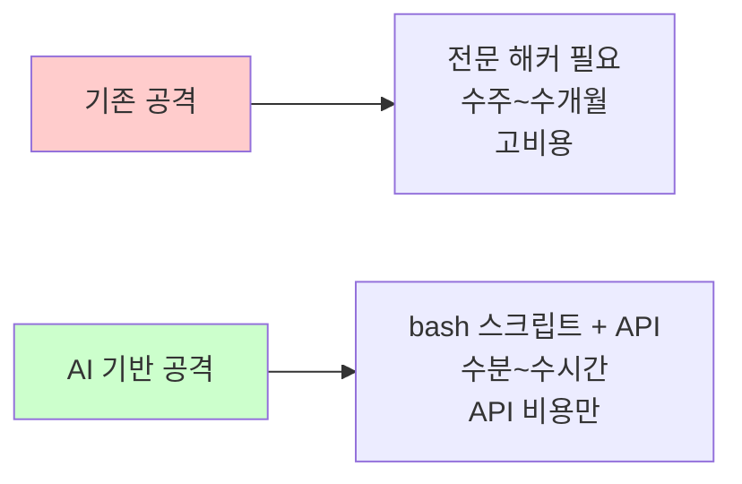
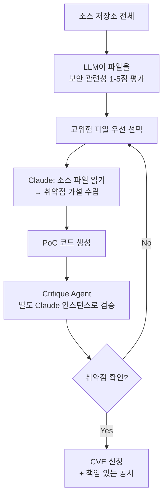
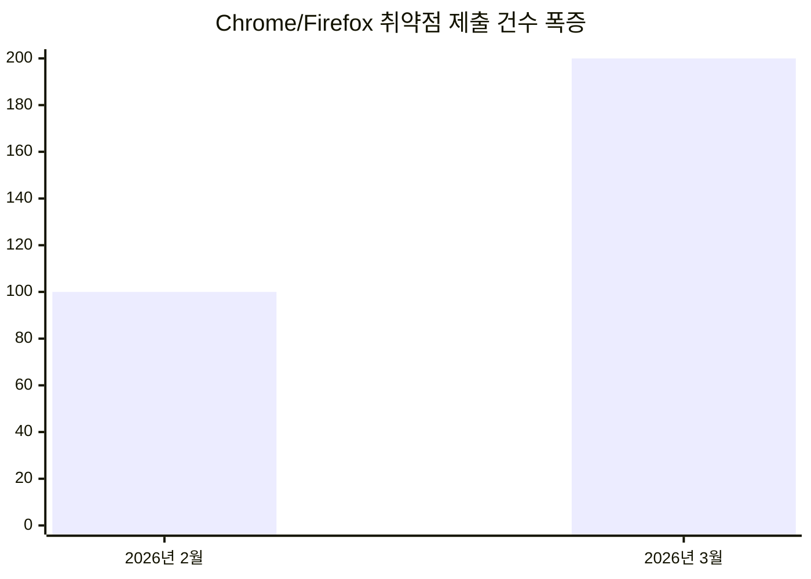
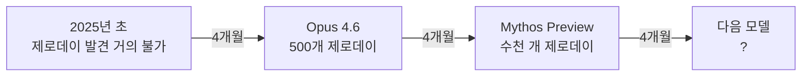

## 들어가며

> "You don't really have to try very hard."
> — Nicholas Carlini, [un]prompted 2026

2026년 3월, Anthropic의 수석 연구원 **Nicholas Carlini**가 보안 컨퍼런스 **[un]prompted 2026**에서 발표한 강연 하나가 보안 업계를 뒤흔들었습니다.

그가 들고 온 것은 화려한 새 모델이나 거대한 컴퓨팅 인프라가 아니었습니다. **10줄짜리 bash 스크립트**와 **Claude Opus 4.6** 하나였습니다. 그리고 그것으로 500개 이상의 제로데이 취약점을 찾아냈습니다.

---

## 강연 영상



---

## Nicholas Carlini는 누구인가?

Nicholas Carlini는 **Anthropic의 Frontier Red Team** 소속 리서치 사이언티스트입니다. 적대적 머신러닝(Adversarial ML), 데이터 추출 공격, AI 안전성 연구로 알려진 그는 Google Brain 출신으로, AI 시스템의 취약점을 찾아내는 데 특화된 연구자입니다.

이번 [un]prompted 2026 강연에서 그는 LLM이 공격자의 손에 쥐어졌을 때 어떤 일이 벌어지는지를 **실제 데모**로 보여주었습니다.

---

## 핵심 주장: 사이버 공격의 경제학이 붕괴했다



Carlini의 핵심 메시지:

> **"LLM 능력은 4개월마다 두 배씩 성장하고 있다. 공격자가 이것을 먼저 쓰기 전에 방어자가 써야 한다."**

---

## 방법론: 놀랍도록 단순한 파이프라인

### 도구 구성

| 구성 요소 | 내용 |
|---|---|
| AI 모델 | Claude Opus 4.6 (off-the-shelf, 커스텀 없음) |
| 스크립트 | 10줄짜리 bash 스크립트 |
| 인프라 | 일반 VM + Docker 컨테이너 |
| 특수 장비 | 없음 |

특별한 프롬프트 엔지니어링도, 파인튜닝도, 전용 하드웨어도 없습니다.

### 작동 방식



1. **파일 순회**: bash 스크립트가 저장소의 모든 소스 파일을 순서대로 Claude에 전달
2. **의미론적 분석**: Claude가 코드를 읽고 익스플로잇 가능한 패턴을 추론
3. **PoC 생성**: 취약점 발견 시 자동으로 개념 증명 코드 작성
4. **이중 검증**: 별도 Claude 인스턴스(Critique Agent)가 결과를 재검증

---

## 실제 발견 사례: 숫자가 말한다

### 전체 성과

> **500개 이상**의 고심각도 취약점을 수 주 만에 발견·검증

비교: Google Project Zero(전 세계 최정예 인간 보안 연구팀)의 연간 성과는 **20~30개**.

### 사례 1: Linux 커널 — 23년 된 버그

| 항목 | 내용 |
|---|---|
| 대상 | Linux 커널 NFS V4 데몬 |
| 취약점 유형 | 원격 익스플로잇 가능 힙 버퍼 오버플로우 |
| 버그 나이 | **23년 (2003년부터 존재)** |
| 영향 | 네트워크를 통한 커널 메모리 원격 읽기 |
| 특이점 | 수천 명의 연구자와 자동화 분석 도구가 수십 년간 놓침 |

### 사례 2: FreeBSD 원격 루트 익스플로잇 (CVE-2026-4747)

| 항목 | 내용 |
|---|---|
| 대상 | FreeBSD Kerberos 인증 모듈 (RPCSEC_GSS) |
| 취약점 유형 | 스택 버퍼 오버플로우 |
| 소요 시간 | **약 4시간** (Carlini가 자리를 비운 사이 자율 완성) |
| 결과 | 완전히 작동하는 원격 루트 셸 익스플로잇 2개 생성, **첫 실행에 성공** |
| 공식 인정 | FreeBSD 공식 보안 권고에 *"Nicholas Carlini using Claude, Anthropic"* 으로 기재 |

### 사례 3: Ghost CMS — 프로젝트 최초의 Critical 취약점

| 항목 | 내용 |
|---|---|
| 대상 | Ghost (⭐50,000, Node.js 기반 CMS) |
| 취약점 유형 | Blind SQL Injection (Content API) |
| 소요 시간 | **90분** |
| 영향 | 비인증 공격자의 admin 데이터베이스 완전 탈취 |
| 특이점 | Ghost 프로젝트 역사상 **첫 번째 Critical 등급** 취약점 |

### 사례 4: Firefox

- Claude Opus 4.6 적용 → 2주 만에 **22개 CVE** 발견
- 첫 번째 취약점: 코드 노출 후 **20분** 만에 발견
- Mozilla와 협력하여 책임 있는 공시 절차 진행

### 업계 전반의 파급 효과



- **Chrome**: 2026년 3월 취약점 제출 수 = 2월의 **2배 초과**
- **Firefox**: 단일 배치 제출로 **연간 전체 버그의 25%** 납부

---

## 퍼징(Fuzzing)과 무엇이 다른가?

| 구분 | 전통 퍼징 | Claude (LLM) |
|---|---|---|
| **탐지 방식** | 랜덤 입력으로 크래시 유발 | 코드 의미론적 이해 후 추론 |
| **성공 조건** | 실행 경로 탐색 | 익스플로잇 가능성 판단 |
| **프로토콜 처리** | 유효한 체크섬/암호값 생성 불가 | 정확한 프로토콜 값 계산 가능 |
| **설정 복잡도** | 커스텀 하네스, 새니타이저 설정 필요 | 파일 경로 지정만으로 작동 |
| **커밋 분석** | 불가 | 이전 CVE 패치의 변형 버전 탐색 가능 |
| **강점** | 입력 변형 커버리지 | 로직 버그, 멀티스텝 취약점 |

> Claude는 퍼징을 대체하는 것이 아니라 **퍼징이 못하는 영역을 담당**합니다. 두 방법은 상호 보완적입니다.

---

## 가장 충격적인 사실: 단순함

Carlini가 강조한 핵심은 **방법론의 단순함**입니다.

```bash
# Carlini가 사용한 파이프라인의 핵심 (개념적 표현)
for file in $(find . -name "*.c" -o -name "*.cpp"); do
    claude --prompt "Find exploitable vulnerabilities in this file: $file"
done
```

커스텀 스캐폴딩 없음. 특수한 프롬프트 엔지니어링 없음. 전용 인프라 없음.

> **API 접근 권한과 스크립트 하나면 됩니다.**

이것이 진짜 경고입니다. 이 파이프라인의 단순함은 악의적 행위자도 동일하게 재현할 수 있다는 뜻이기 때문입니다.

---

## 핵심 인사이트

### 인사이트 1: 90일 책임 공시 기간이 위협받는다

현재 보안 업계의 표준은 취약점 발견 후 **90일 이내** 공시입니다. 이 기준은 "취약점 발견이 어렵고 시간이 걸린다"는 전제 위에 있습니다.

Claude가 Ghost의 취약점을 **90분**에, Firefox의 버그를 **20분**에 찾는다면, 이 전제는 무너집니다. 발견에서 익스플로잇까지의 시간이 수 주에서 수 시간으로 붕괴하면, 90일 공시 기간은 패치가 배포되기 전에 이미 무력화될 수 있습니다.

### 인사이트 2: 오픈소스 메인테이너의 위기

Google Project Zero가 연간 20~30개 취약점을 발견할 때, 오픈소스 메인테이너들은 그 정도는 감당할 수 있었습니다. 하지만 AI가 **수 주에 500개**를 쏟아낸다면?

대부분의 오픈소스 프로젝트는 무급 자원봉사자가 유지합니다. 취약점 보고 홍수는 그들의 수용 능력을 초과합니다.

### 인사이트 3: "AI 능력 4개월 배증" — 선형적 위협이 아니다

Carlini는 LLM의 사이버보안 능력이 **약 4개월마다 두 배씩** 성장한다고 말합니다. 이는 선형적 증가가 아닌 **지수적 성장**입니다.



오늘의 기준으로 내일의 위협을 측정하면 안 됩니다.

### 인사이트 4: 방어자가 먼저 써야 한다

Carlini의 결론은 명확합니다: 공격자가 동일한 도구를 사용하기 전에, **방어자가 먼저** 이 파이프라인을 자신의 코드베이스에 돌려야 합니다. 외부 공격을 기다리지 말고, 지금 당장 자체 코드를 Claude로 점검해야 합니다.

### 인사이트 5: Glasswing 패러독스의 실체

이 강연은 Project Glasswing 발표보다 먼저 이루어졌습니다. Carlini의 데모가 보여준 현실, 즉 "bash 스크립트 하나로 500개 제로데이"가 바로 Anthropic이 **Mythos Preview를 일반 공개하지 않는** 이유입니다.

같은 기술이 방어에도, 공격에도 동일하게 강력합니다. 이것이 **Glasswing 패러독스**의 실체입니다.

---

## 개발자/보안 담당자를 위한 실용 지침

### 즉시 점검해야 할 코드 영역

| 우선순위 | 대상 | 이유 |
|---|---|---|
| 🔴 **최우선** | 네트워크 대면 파서 | Linux NFS, FreeBSD 사례 |
| 🔴 **최우선** | RPC/IPC 인프라 | 오래되고 복잡, 취약점 밀도 높음 |
| 🟠 **높음** | 인증 처리 모듈 | Kerberos 사례 |
| 🟠 **높음** | 데이터베이스 쿼리 레이어 | Ghost SQL Injection 사례 |
| 🟡 **중간** | 미디어 코덱 처리 | FFmpeg, H.264 사례 |

### 방어적 AI 활용 체크리스트

- [ ] CI/CD 파이프라인에 LLM 기반 취약점 스캔 통합
- [ ] 네트워크 대면 코드 정기 LLM 감사 일정 수립
- [ ] 취약점 보고 대량 유입 대비 트리아지 프로세스 준비
- [ ] Responsible Disclosure 절차 재검토 및 단축 여부 검토

---

## 마무리

Nicholas Carlini의 강연이 불편한 이유는 단 하나입니다. **너무 단순하기 때문입니다.**

수십 년간 보안되었다고 믿었던 코드들이, bash 스크립트 하나와 LLM API로 수 시간 만에 뚫렸습니다. 전문 해커가 필요 없습니다. 수백만 달러의 장비가 필요 없습니다. API 키 하나면 됩니다.

이것이 의미하는 바는 명확합니다. **소프트웨어 보안의 전제 자체가 바뀌었습니다.** "충분히 오래 살아남은 코드는 안전하다"는 믿음은 이제 통하지 않습니다. 23년 된 Linux 커널 버그가 그것을 증명했습니다.

방어자가 공격자보다 먼저 이 도구를 쥐어야 합니다. 시간이 없습니다.

---

## 참고 출처

- [[un]prompted 2026 공식 컨퍼런스 페이지](https://unpromptedcon.org/)
- [Nicholas Carlini 공식 홈페이지](https://nicholas.carlini.com/)
- [red.anthropic.com: Zero-Days 기술 리포트](https://red.anthropic.com/2026/zero-days/)
- [Security Cryptography Whatever: AI Finds Vulns You Can't With Nicholas Carlini](https://securitycryptographywhatever.com/2026/03/25/ai-bug-finding/)
- [danilchenko.dev: Claude Found 500 Zero-Day Vulnerabilities 분석](https://www.danilchenko.dev/posts/2026-04-05-claude-found-500-zero-days-llm-vulnerability-research/)
- [Frank's World: The Emergence of Black-hat LLMs](https://www.franksworld.com/2026/03/31/the-emergence-of-black-hat-llms-a-new-era-in-cybersecurity-threats/)
- [Picus Security: The Glasswing Paradox](https://www.picussecurity.com/resource/blog/anthropics-project-glasswing-paradox)
- [Anthropic Project Glasswing 공식 페이지](https://www.anthropic.com/glasswing)
