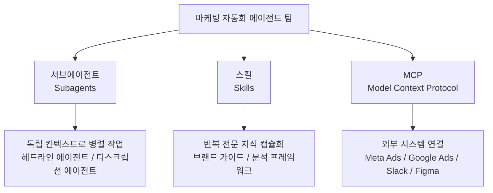
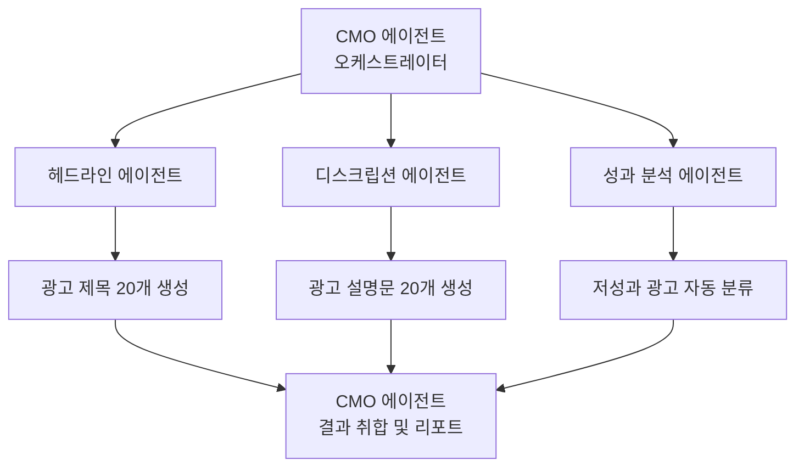
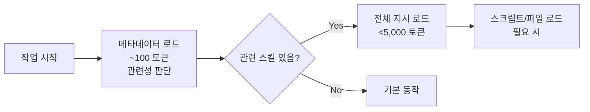
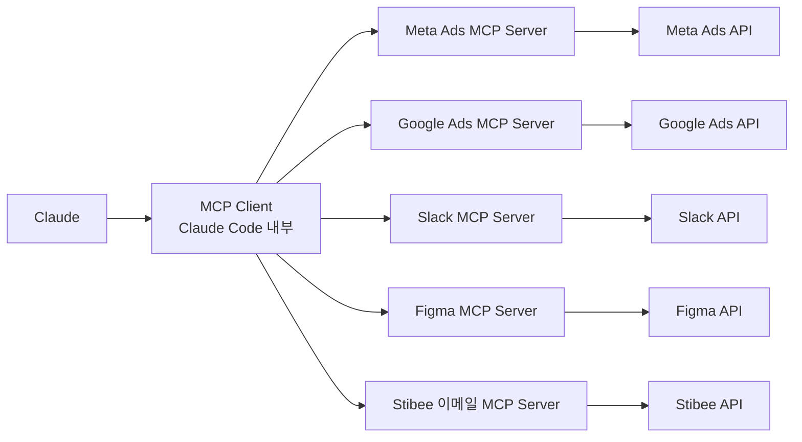
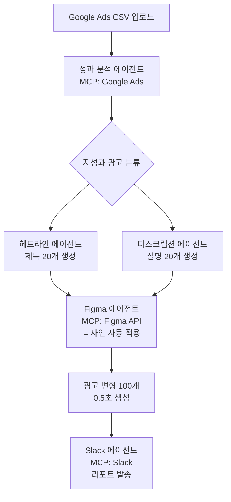
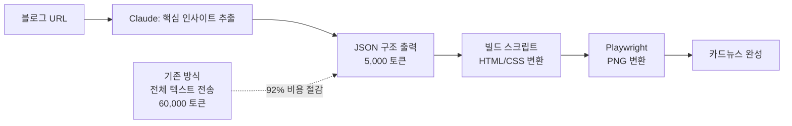
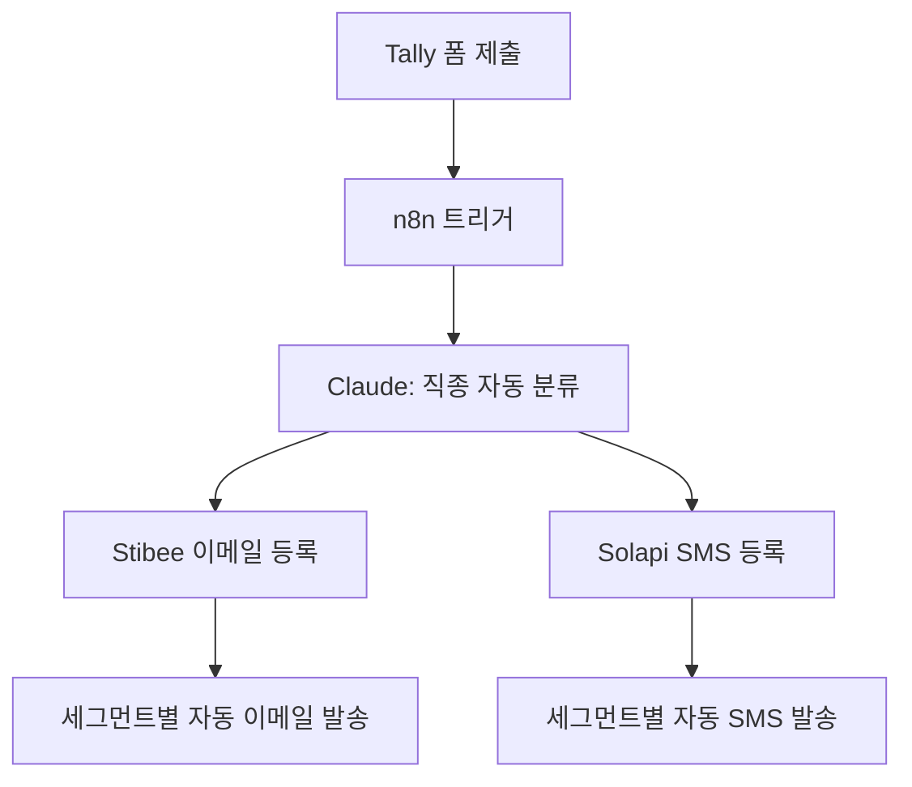

## 들어가며

> "반복하는 작업이 있다면, 그건 시스템으로 만들어야 한다."

마케터는 매일 같은 일을 합니다. 광고 카피 작성, 성과 리포트 생성, 콘텐츠 변형, A/B 테스트 기획. 혼자서 이 모든 걸 하면 결국 중요한 일—전략, 인사이트, 의사결정—에 쓸 에너지가 남지 않습니다.

**빌더 조슈(@builderjoshkim)**의 이 강의는 Claude Code의 세 가지 핵심 개념인 **서브에이전트**, **스킬**, **MCP**를 결합해서 마케팅 업무를 100% 자동화하는 에이전트 팀을 구성하는 방법을 다룹니다. 코딩 없이, 반복 없이, AI가 스스로 일하는 구조를 만드는 것이 목표입니다.

---

## 강의 영상



---

## Claude Code 자동화의 세 기둥

Claude Code 마케팅 자동화는 세 가지 개념이 각자의 역할을 담당하며 맞물립니다.



| 개념 | 역할 | 사용 시점 |
|---|---|---|
| **서브에이전트** | 병렬 작업 실행 | 동시에 여러 작업이 필요할 때 |
| **스킬** | 재사용 가능한 전문 지식 | 같은 워크플로를 반복할 때 |
| **MCP** | 외부 도구 연결 | 외부 API/DB/서비스 접근이 필요할 때 |

---

## 개념 1: 서브에이전트(Subagents) — AI가 AI에게 일을 시킨다

### 서브에이전트란?

서브에이전트는 **Claude Code 전용** 기능으로, 부모 에이전트가 자식 에이전트(서브에이전트)를 생성해 작업을 위임합니다.



### 핵심 특성

- **독립 컨텍스트 윈도우**: 각 서브에이전트는 자체 컨텍스트를 가져 정보 오염 방지
- **병렬 실행**: 부모 에이전트와 서브에이전트들이 **동시에** 작동
- **도구 공유**: 부모의 MCP 도구, 파일 접근 권한을 자동 상속

### 마케팅 적용: 광고 카피 전문화

Anthropic 내부 마케팅 팀이 직접 검증한 방법입니다.

```
❌ 단일 에이전트: "헤드라인과 디스크립션을 함께 써줘"
   → 품질이 평균 수준에 머무름

✅ 역할 분리:
   - 헤드라인 에이전트 → 제목만 집중 생성
   - 디스크립션 에이전트 → 설명문만 집중 생성
   → 각각의 품질이 눈에 띄게 향상
```

**효과**: 2시간짜리 수동 광고 카피 작업 → **15분** 자동화

### 서브에이전트 설정 파일 위치

```
.claude/agents/
├── cmo.md           ← 오케스트레이터 에이전트 정의
├── headline.md      ← 헤드라인 전문 에이전트
├── description.md   ← 디스크립션 전문 에이전트
└── analyst.md       ← 성과 분석 에이전트
```

각 `.md` 파일에 에이전트의 역할, 지시 사항, 도구 접근 범위를 정의합니다.

---

## 개념 2: 스킬(Skills) — 반복하지 않아도 되는 전문성

### 스킬이란?

스킬은 **지시 사항, 스크립트, 리소스를 담은 폴더**로, Claude가 작업과 관련이 있을 때 **자동으로 발견하고 로드**합니다.

### 스킬 vs 다른 개념 비교

| 구분 | 역할 | 특징 |
|---|---|---|
| **프롬프트** | 일회성 지시 | 대화 끝나면 사라짐 |
| **Projects** | 배경 지식 저장 | "무엇을 알아야 하는지" |
| **스킬** | 절차적 전문성 캡슐화 | "어떻게 해야 하는지" |
| **서브에이전트** | 독립 실행 에이전트 | Claude Code 전용 |
| **MCP** | 외부 시스템 연결 | 데이터 접근 레이어 |

> **Projects**: "여기에 우리 제품 스펙이 있어"  
> **Skills**: "경쟁사 분석을 할 때는 이 프레임워크를 써"

### 스킬 로딩 방식 (Progressive Disclosure)



불필요한 스킬은 컨텍스트 윈도우를 차지하지 않아 효율적입니다.

### 마케팅 스킬 구성 예시

#### 스킬 1: 브랜드 보이스 스킬

```markdown
# brand-voice/SKILL.md

## 목적
모든 콘텐츠에 브랜드 일관성을 유지하는 스킬

## 브랜드 가이드
- 톤: 친근하지만 전문적
- 금지 표현: [목록]
- 핵심 메시지: [목록]
- 참고 예시: voice_samples.md 참조
```

#### 스킬 2: 광고 성과 분석 스킬

```markdown
# ad-analytics/SKILL.md

## 목적
CSV 광고 데이터 → 성과 분석 리포트 자동 생성

## 분석 기준
- CTR 임계값: 업종 평균 이하 → 저성과 분류
- ROAS 임계값: 1.5 이하 → 즉시 개선 대상
- metrics_definitions.md 참조 (LTV, CAC, Churn 계산식)
```

#### 스킬 3: A/B 테스트 기획 스킬

```markdown
# ab-test/SKILL.md

## 목적
ICE 프레임워크 기반 A/B 테스트 우선순위 결정

## ICE 스코어링
- Impact (영향도): 1-10
- Confidence (확신도): 1-10
- Ease (실행 용이성): 1-10
- 총점 = (I + C + E) / 3
```

### 컨텍스트 최적화: Context Rot 방지

과도한 컨텍스트는 LLM 성능을 오히려 저하시킵니다("Context Rot"). 스킬은 모듈화로 이를 방지합니다.

```
glossary.md        ← 업계 용어 정의
voice_samples.md   ← 카피라이팅 예시
metrics_definitions.md ← KPI 계산 기준
```

필요한 파일만 로드 → 컨텍스트 오염 없음

---

## 개념 3: MCP(Model Context Protocol) — 외부 세계와 연결

### MCP란?

MCP는 Claude와 외부 시스템 사이의 **범용 연결 레이어**입니다. 각 도구마다 별도 통합을 만들 필요 없이, MCP 서버 하나로 표준화된 방식으로 연결합니다.



### MCP 설정 방법

`.mcp.json` 파일에 서버를 등록합니다.

```json
{
  "mcpServers": {
    "meta-ads": {
      "command": "npx",
      "args": ["@meta/ads-mcp-server"],
      "env": {
        "META_ACCESS_TOKEN": "your_token"
      }
    },
    "slack": {
      "command": "npx",
      "args": ["@slack/mcp-server"],
      "env": {
        "SLACK_BOT_TOKEN": "your_token"
      }
    }
  }
}
```

### 마케팅 MCP 활용: 자연어 데이터 분석

MCP 없이:
> 대시보드 접속 → 필터 설정 → 데이터 추출 → 스프레드시트 정리 → 분석

MCP 있으면:
```
"지난주 캠페인 지출은?"
"상위 성과 광고 크리에이티브 보여줘"
"ROAS 1.5 이하 광고 모두 일시정지해"
```

---

## 전체 워크플로: 마케팅 에이전트 팀 아키텍처

### 광고 자동화 파이프라인



### 콘텐츠 파이프라인 (토큰 최적화 적용)



### 리드 처리 자동화 (n8n 연동)



**결과**: 수동 데이터 입력 제로, 세그먼테이션 즉시 처리

---

## 주간 성과 리포트 자동화

Slack으로 매주 자동 발송되는 인사이트 리포트:

| 분석 항목 | 내용 |
|---|---|
| 노출 → 프로필 방문 전환율 | 포스트별 효율 비교 |
| 콘텐츠 유형 성과 | 릴스 vs 카드뉴스 vs 스토리 |
| 팔로워 성장 상관관계 | 어떤 게시물이 구독자를 늘렸나 |
| 실행 권고사항 | 매주 2~3개 구체적 행동 제안 |

---

## 핵심 인사이트

### 인사이트 1: 역할 분리가 품질을 높인다

단일 에이전트에게 "헤드라인도 쓰고 디스크립션도 써"라고 시키면 두 작업 모두 평균 수준이 됩니다. 헤드라인 에이전트와 디스크립션 에이전트로 분리하면 **각각의 품질이 동시에 향상**됩니다. 인간 팀에서 전문가를 나누는 것과 같은 원리입니다.

### 인사이트 2: MCP는 "프롬프트"가 아니라 "도구"다

MCP가 연결된 Claude는 데이터를 추론하는 것이 아니라 **실제 데이터를 가져와** 분석합니다. Meta Ads API에 직접 쿼리하고, Slack에 직접 메시지를 보내고, Figma 파일을 직접 수정합니다. "AI가 분석해주는 척"이 아닌 진짜 자동화입니다.

### 인사이트 3: 토큰 최적화는 곧 비용 최적화

블로그 전문을 Claude에 넣으면 60,000 토큰. JSON 구조만 생성하고 빌드 스크립트로 처리하면 5,000 토큰. **92% 비용 절감**이면서 품질은 동일합니다. 자동화를 설계할 때 "Claude가 꼭 해야 하는 것"과 "스크립트가 해도 되는 것"을 분리하는 것이 핵심입니다.

### 인사이트 4: 스킬은 "팀의 암묵지"를 코드화한다

브랜드 보이스, 분석 기준, 카피라이팅 원칙. 이것들은 보통 시니어 마케터의 머릿속에만 있습니다. 스킬로 만들면 **누가 Claude를 사용해도 일관된 품질**이 나옵니다. 팀의 집단 지성을 AI에 이식하는 것입니다.

### 인사이트 5: 자동화의 진짜 가치는 "정신적 여유"

속도가 전부가 아닙니다. 반복 작업이 사라지면 마케터는 **전략, 인사이트, 창의적 의사결정**에 집중할 수 있습니다. 15분으로 줄어든 2시간의 가치는 시간 절약이 아니라 그 1시간 45분 동안 할 수 있는 더 중요한 일에 있습니다.

---

## 시작하기: 단계별 가이드

### 1단계: 반복 작업 발굴

> "이번 주에 똑같은 방식으로 세 번 이상 한 작업이 있는가?"

그 작업이 자동화 1호 후보입니다.

### 2단계: API 존재 여부 확인

자동화할 도구에 API가 있는가? MCP 서버가 이미 있는가? 없다면 n8n 같은 미들웨어로 연결할 수 있는가?

### 3단계: Claude.ai에서 먼저 프롬프트 테스트

코드 작성 전, Claude.ai 대화로 로직을 먼저 검증합니다.

### 4단계: 점진적 구현

| 단계 | 구현 내용 |
|---|---|
| Week 1 | 가장 단순한 반복 작업 1개 자동화 |
| Week 2 | 스킬로 변환, 팀과 공유 |
| Week 3 | MCP 연결로 외부 데이터 통합 |
| Week 4 | 서브에이전트로 병렬 처리 도입 |

---

## 마무리

Claude Code의 서브에이전트, 스킬, MCP는 각각 독립적인 기능이지만, **함께 쓸 때 비로소 완전한 자동화 팀**이 됩니다.

- **MCP**가 외부 세계의 데이터를 가져오고
- **스킬**이 그 데이터를 처리하는 방법을 제공하고
- **서브에이전트**들이 병렬로 각자의 역할을 수행합니다

마케터에게 코딩 실력은 필요 없습니다. 필요한 것은 **어떤 반복이 시스템이 될 수 있는지 보는 눈**입니다.

---

## 참고 출처

- [빌더 조슈 YouTube 채널 (@builderjoshkim)](https://www.youtube.com/@builderjoshkim)
- [Claude Skills 공식 설명 — Anthropic Blog](https://claude.com/blog/skills-explained)
- [Claude Code 공식 서브에이전트 문서](https://code.claude.com/docs/en/sub-agents)
- [Claude Code 에이전트 팀 공식 문서 (한국어)](https://code.claude.com/docs/ko/agent-teams)
- [비개발자 마케터의 Claude Code 활용 사례](https://blog.highoutputclub.com/claude-code-marketing-automation/)
- [Skills vs Agents vs MCP 비교 가이드 — Colin McNamara](https://colinmcnamara.com/blog/understanding-skills-agents-and-mcp-in-claude-code)
- [마케팅 AI 에이전트 아미 구축 플레이북 — Stormy AI](https://stormy.ai/blog/how-to-build-marketing-ai-agent-army-claude-skills)
- [Marketing Skills GitHub 저장소](https://github.com/coreyhaines31/marketingskills)
