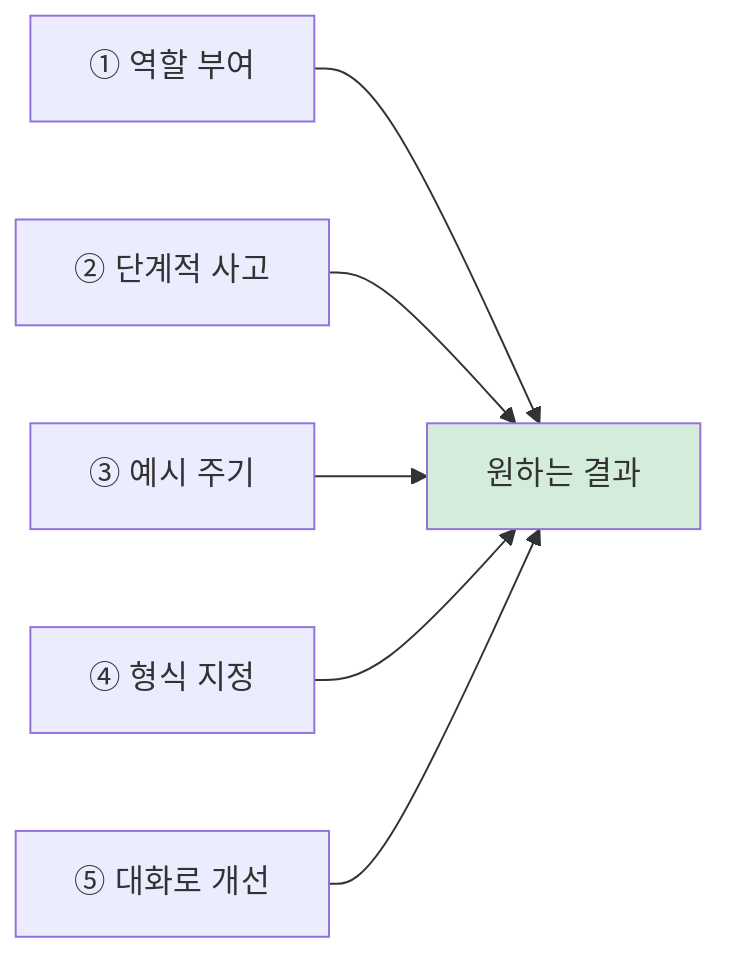

## 들어가며

ChatGPT, Gemini 같은 AI에게 똑같은 일을 시켜도 **어떻게 물어보느냐**에 따라 결과물의 품질이 하늘과 땅 차이로 갈립니다. 이 "잘 물어보는 기술"이 바로 **프롬프트 엔지니어링(Prompt Engineering)**입니다. 거창한 코딩 지식은 필요 없습니다. 몇 가지 원칙만 익히면 보고서 작성, 이메일 초안, 자료 요약, 기획 아이디어까지 업무 시간을 크게 줄일 수 있습니다.

이 글은 **직접 Gemini를 열어 따라 치면서** 배우는 20분짜리 실습 튜토리얼입니다. 아래 예제 프롬프트를 그대로 복사해 넣어보세요.

> **준비물**: [gemini.google.com](https://gemini.google.com) 접속 (구글 계정만 있으면 무료). 다른 챗봇(ChatGPT, Claude)을 쓰셔도 원리는 똑같이 적용됩니다.
{: .prompt-info }

---

## 1. 왜 프롬프트가 중요한가 — 직접 비교 실험

말로만 들으면 와닿지 않습니다. **직접 똑같은 회의록을 가지고, 두 가지 방식으로 요약을 시켜 비교**해봅시다.

### 실습용 회의록 (이걸 복사하세요)

아래는 실습용으로 만든 가상의 회의록입니다. 길이는 일부러 짧게 만들었지만, 실제 회의처럼 결정·할 일·미정 사항이 뒤섞여 있습니다. **이 회의록 전체를 복사해두세요.** 앞으로 계속 사용합니다.

```
[신제품 출시 준비 회의록]
일시: 2026년 5월 28일 오후 2시
참석: 김부장, 이대리, 박과장, 최주임

- 김부장: 무선이어폰 '에어핏' 출시일을 7월 첫째 주로 잡읍시다.
  마케팅 준비 기간이 한 달은 필요하니 늦출 수 없어요.
- 이대리: 6월 중순까지 인스타그램, 유튜브 광고 소재를 만들겠습니다.
  다만 모델 섭외 예산을 아직 못 받았어요. 김부장님 확인 부탁드려요.
- 박과장: 초기 생산 물량은 1만 대로 합의됐죠? 공장에는 제가 전달하겠습니다.
- 김부장: 네, 1만 대 확정. 예산 건은 제가 내일까지 재무팀에 확인할게요.
- 최주임: 사전예약 이벤트 페이지는 6월 20일까지 오픈하면 될까요?
- 이대리: 광고가 6월 말부터 나가니까 그 전에 열려야 합니다.
  최주임님, 6월 18일까지로 당겨주세요.
- 최주임: 알겠습니다. 18일까지 맞추겠습니다.
- 박과장: 가격은 아직 안 정해졌는데, 다음 회의에서 확정하죠.
- 김부장: 좋아요. 다음 회의는 6월 4일 같은 시간. 가격 정책이랑
  예산 결과 공유합시다.
```

### 실험 A — 막연하게 요청하기

새 대화를 열고, 위 회의록을 붙여넣은 뒤 맨 앞에 이 한 줄만 추가하세요.

```
회의록 정리해줘

[여기에 위 회의록 붙여넣기]
```

→ 두루뭉술하게 줄거리만 늘어놓는 경우가 많습니다. 담당자나 마감일이 빠지기도 합니다.

### 실험 B — 구체적으로 요청하기

다시 새 대화를 열고, 같은 회의록을 붙여넣되 이렇게 지시해보세요.

```
아래 회의록을 세 가지로 나눠서 정리해줘.
1) 결정사항: 확정된 내용만
2) 할 일: '담당자 / 해야 할 일 / 마감일' 컬럼의 표로
3) 다음 회의: 일시와 안건
아직 안 정해진 사항(미정)은 별도로 표시해줘.

[여기에 위 회의록 붙여넣기]
```

→ 결정·할 일·미정 사항이 깔끔하게 분리되고, 표 안에 담당자와 마감일까지 정확히 들어갑니다. 바로 팀에 공유할 수 있는 형태입니다.

**두 결과를 나란히 놓고 보세요.** 같은 AI, 같은 회의록인데 결과물의 완성도가 전혀 다릅니다. AI는 눈치를 보지 않습니다. **알려준 만큼만 일합니다.** 이것이 프롬프트 엔지니어링의 출발점입니다.

---

## 2. 좋은 프롬프트의 4가지 재료 — "역·맥·형·예"

좋은 프롬프트에는 보통 다음 네 가지가 들어갑니다. 외우기 쉽게 **역·맥·형·예**로 기억하세요.

| 재료 | 의미 | 예시 표현 |
|---|---|---|
| **역(役)** 역할 | AI에게 전문가 역할을 부여 | "너는 10년차 마케터야" |
| **맥(脈)** 맥락 | 배경·대상·상황 설명 | "20대 고객에게 홍보할 거야" |
| **형(形)** 형식 | 원하는 결과의 모양 | "표로, 5개, 각 15자 이내" |
| **예(例)** 예시 | 원하는 결과 샘플 | "예: '가벼운 일상' 같은 느낌" |

말로 설명하면 추상적이니, **재료를 하나씩 더해가며 결과가 어떻게 좋아지는지** 직접 확인해봅시다. 1번에서 본 '에어핏' 무선이어폰을 홍보한다고 가정합니다. 아래 4단계를 차례로 Gemini에 넣어보세요.

### 0단계 — 아무것도 없이 (비교 기준)

```
무선이어폰 홍보 문구 만들어줘
```

→ 평범하고 뻔한 문구가 나옵니다. 누구나 쓸 수 있는 수준이라 매력이 없습니다.

### 1단계 — 역(役) 추가: 역할을 준다

```
너는 10년차 마케터야.
무선이어폰 홍보 문구 만들어줘.
```

→ 같은 요청인데 표현이 한결 세련되집니다. AI가 '마케터'의 어휘로 답하기 때문입니다.

### 2단계 — 맥(脈) 추가: 상황을 알려준다

```
너는 10년차 마케터야.
신제품 무선이어폰 '에어핏'을 20대 직장인에게 홍보하려고 해.
출퇴근길에 음악을 즐기는 사람이 주요 타깃이야.
인스타그램에 올릴 홍보 문구를 만들어줘.
```

→ 타깃과 상황이 생기니, 문구가 '20대 출퇴근'이라는 구체적 장면을 겨냥하기 시작합니다.

### 3단계 — 형(形) 추가: 결과의 모양을 정한다

```
너는 10년차 마케터야.
신제품 무선이어폰 '에어핏'을 20대 직장인에게 홍보하려고 해.
출퇴근길에 음악을 즐기는 사람이 주요 타깃이야.
인스타그램에 올릴 홍보 문구를 만들어줘.

조건:
- 5개 만들어줘
- 각 문구는 15자 이내
- 문구마다 어울리는 이모지 1개 포함
- 표로 정리 (컬럼: 번호 / 문구 / 이모지)
```

→ 이제 개수·길이·형식이 정확히 맞춰진, 바로 쓸 수 있는 표가 나옵니다.

### 4단계 — 예(例) 추가: 원하는 느낌을 보여준다

```
너는 10년차 마케터야.
신제품 무선이어폰 '에어핏'을 20대 직장인에게 홍보하려고 해.
출퇴근길에 음악을 즐기는 사람이 주요 타깃이야.
인스타그램에 올릴 홍보 문구를 만들어줘.

조건:
- 5개 만들어줘
- 각 문구는 15자 이내
- 문구마다 어울리는 이모지 1개 포함
- 표로 정리 (컬럼: 번호 / 문구 / 이모지)

이런 느낌으로 만들어줘:
"퇴근길이 콘서트장 🎧"
"만원 지하철도 내 무대 🎵"
```

→ 예시를 주면 톤과 분위기까지 내가 원하는 방향으로 고정됩니다.

**0단계와 4단계의 결과를 비교해보세요.** 같은 일을 시켰는데 완성도가 전혀 다릅니다.

> 네 재료를 항상 다 넣을 필요는 없습니다. 하지만 **결과가 마음에 안 들 때는 역·맥·형·예 중 무엇이 빠졌는지** 점검하면 거의 해결됩니다. 막연하면 → 맥락을 더하고, 모양이 안 맞으면 → 형식을 지정하고, 느낌이 안 살면 → 예시를 주세요.
{: .prompt-tip }

---

## 3. 핵심 기법 5가지 (직접 따라하기)

이제 본론입니다. 실전에서 가장 효과 좋은 5가지 기법을, 각각 Gemini에 넣어보며 익혀봅시다.



### 3-1. 역할 부여 — "너는 ~ 전문가야"

AI에게 역할을 주면 말투와 전문성의 수준이 달라집니다. 같은 주제를 두 가지 역할로 시켜보세요.

```
너는 초등학교 선생님이야. '금리 인상'이 뭔지 초등학생도
이해하도록 쉽게 설명해줘.
```

```
너는 경제 신문 기자야. '금리 인상'이 가계에 미치는 영향을
3문장으로 설명해줘.
```

> **활용 팁**: "신중한 검토자", "깐깐한 교정 담당자", "친절한 상담원" 등 상황에 맞는 역할을 주면 결과물의 톤이 정확히 맞춰집니다.
{: .prompt-tip }

### 3-2. 단계적으로 생각하게 하기 (Chain-of-Thought)

복잡한 문제는 **"단계별로 풀어줘"** 한마디만 추가해도 정확도가 올라갑니다. AI도 한 번에 답을 내면 실수하기 때문입니다.

```
다음 문제를 한 단계씩 이유를 설명하면서 풀어줘.

사과가 3박스 있고 한 박스에 12개씩 들어있어.
그중 5개를 먹었고, 친구에게 8개를 줬다면 몇 개가 남을까?
```

"바로 답만 줘"가 아니라 "과정을 보여줘"라고 하면, 계산·논리·기획처럼 **여러 단계가 필요한 일**에서 결과가 눈에 띄게 좋아집니다.

### 3-3. 예시 주기 (Few-shot)

원하는 형태의 **샘플 한두 개**를 보여주면, AI가 그 패턴을 그대로 따라합니다. 말로 설명하기 어려운 형식일수록 강력합니다.

```
아래 형식으로 신조어를 풀어서 설명해줘.

입력: 알잘딱 → 출력: 알아서 잘 딱 깔끔하게
입력: 갓생 → 출력: 부지런하고 모범적인 삶
입력: 점메추 → 출력:
```

마지막 줄을 비워두면 AI가 패턴을 보고 알아서 채웁니다. 업무에서는 "이런 형식의 이메일 답장 예시 2개를 주고, 비슷하게 써줘" 같은 식으로 응용할 수 있습니다.

### 3-4. 출력 형식 지정하기

결과를 **표, 목록, 글자 수, 말투**까지 콕 집어 지정하세요. AI는 지정한 모양대로 정확히 만들어줍니다.

```
서울 2박 3일 여행 일정을 표로 만들어줘.
컬럼은 '시간 / 장소 / 활동 / 예상 비용' 으로 하고,
하루를 오전·오후·저녁으로 나눠줘.
```

> **자주 쓰는 형식 지정 표현**
> - "표로 정리해줘" / "번호 매긴 목록으로"
> - "200자 이내로 / 3문장으로"
> - "정중한 비즈니스 말투로 / 친근한 말투로"
> - "전문 용어 없이 / 핵심만 굵게 강조해서"
{: .prompt-tip }

### 3-5. 대화로 다듬기 (Iteration)

가장 중요한 기법입니다. **첫 답변에서 끝내지 마세요.** AI와의 대화는 한 번에 완성하는 게 아니라, 주고받으며 다듬는 과정입니다.

첫 결과를 받은 뒤, 이어서 이렇게 요청해보세요.

```
좋아. 그런데 좀 더 캐주얼한 말투로 바꿔줘.
```
```
세 번째 항목을 예시를 들어 더 자세히 설명해줘.
```
```
전체를 절반 길이로 줄여줘.
```

이전 대화 내용을 AI가 기억하고 있기 때문에, 매번 처음부터 다시 설명할 필요가 없습니다. **"이 부분만 이렇게 고쳐줘"**를 반복하는 것이 완성도를 높이는 가장 빠른 길입니다.

---

## 4. 실전 종합 예제 — 업무 이메일 한 통 완성하기

배운 기법을 모두 합쳐, 실제로 자주 쓰는 작업을 해봅시다. **거래처에 일정 변경을 양해 구하는 이메일** 초안입니다.

```
너는 정중하면서도 신뢰감을 주는 비즈니스 이메일 작성 전문가야.

상황: 다음 주 화요일로 잡힌 거래처 미팅을, 내부 사정으로
목요일 같은 시간으로 옮기고 싶어. 상대가 기분 상하지 않게
양해를 구하는 이메일을 써줘.

조건:
- 정중한 비즈니스 말투
- 300자 이내
- 제목과 본문을 나눠서
- 마지막에 대안 일정을 제안하는 문장 포함
```

결과가 나오면, 3-5에서 배운 대로 다듬어보세요.

```
조금 더 간결하게 줄이고, 죄송하다는 표현을 한 번만 쓰도록 고쳐줘.
```

이 한 흐름 안에 **역할(전문가) + 맥락(상황) + 형식(글자수·구조) + 대화 개선**이 모두 들어있습니다. 이것이 프롬프트 엔지니어링의 전부입니다.

---

## 5. 자주 하는 실수 (안티패턴)

| ❌ 이렇게 하지 마세요 | ✅ 이렇게 바꾸세요 |
|---|---|
| "좋게 써줘" | "정중한 말투로, 3문장으로 써줘" |
| 한 번에 5가지 작업 요구 | 한 번에 한 가지씩 나눠서 요청 |
| "오타 내지 마, 길게 쓰지 마" (부정문) | "맞춤법 검토해서, 200자로 써줘" (긍정문) |
| 첫 답변을 그대로 사용 | 이어서 "이 부분 고쳐줘"로 다듬기 |

> **핵심 원칙**: AI에게는 "하지 마"보다 **"이렇게 해줘"**가 훨씬 잘 통합니다. 원하는 모습을 구체적으로 그려서 알려주세요.
{: .prompt-info }

---

## 6. 한 장으로 정리하는 치트시트

오늘 배운 내용을 책상 옆에 붙여두세요.

```
┌─────────────────────────────────────────┐
│  좋은 프롬프트 = 역 + 맥 + 형 + 예          │
│                                           │
│  역(役) 역할 : "너는 ~ 전문가야"            │
│  맥(脈) 맥락 : 배경·대상·상황을 알려주기     │
│  형(形) 형식 : 표/목록/글자수/말투 지정      │
│  예(例) 예시 : 원하는 결과 샘플 보여주기      │
│                                           │
│  + 복잡하면 "단계별로 풀어줘"               │
│  + 마음에 안 들면 "이 부분만 고쳐줘"         │
└─────────────────────────────────────────┘
```

---

## 마무리

프롬프트 엔지니어링은 외국어 회화와 비슷합니다. 문법책을 통째로 외우는 게 아니라, **자주 쓰는 표현 몇 개를 익혀 계속 써보면서** 늘어납니다. 오늘 배운 다섯 가지 기법을 실제 업무 한 가지에 적용해보세요. 보고서 한 줄, 이메일 한 통부터 시작하면 됩니다.

> AI는 똑똑한 신입사원과 같습니다. 능력은 뛰어나지만, **무엇을 어떻게 원하는지 구체적으로 알려줄수록** 더 좋은 결과를 가져옵니다. 잘 물어보는 사람이 잘 쓰는 사람입니다.
