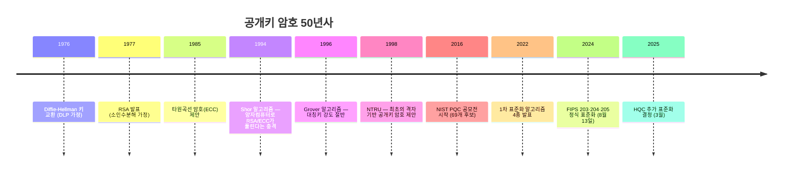
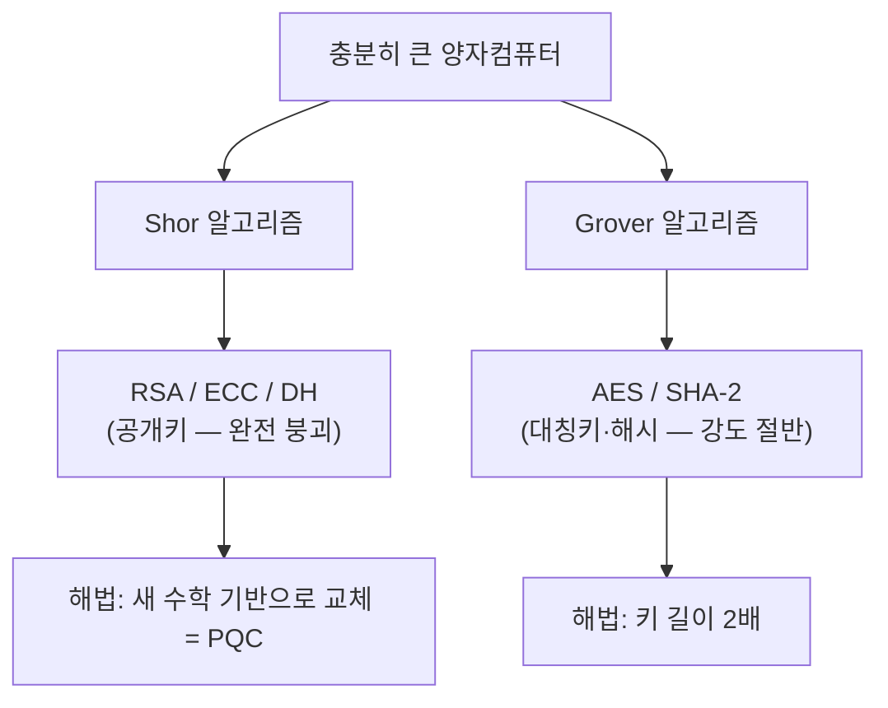

> **이 시리즈는 무엇인가요?**
> PQC(Post-Quantum Cryptography, 양자내성암호)를 처음 접하는 분을 위한 **Introduction to PQC** 시리즈입니다.
> "왜 나왔는지(역사) → 레거시와 무엇이 다른지 → 어떤 표준이 있는지 → 어떤 수학에 기대는지 → 한국은 왜 어떻게 추진하는지 → 어떻게 실제 적용하는지"를 사실에 근거해 풀어갑니다.
> 각 강의 끝에는 Windows PC에서 직접 돌려보는 작은 실습이 붙어 있습니다.
{: .prompt-tip }

이번 첫 강의는 **역사**입니다. PQC는 갑자기 튀어나온 기술이 아니라, 50년에 걸친 공개키 암호의 진화·위기·대응 과정에서 나온 결과물입니다. 그 흐름을 따라가야 PQC가 "왜 이 시점에" 필요한지가 분명해집니다.

---

## 1. 출발점: 1976년, 공개키 암호의 탄생

1970년대 중반까지 모든 암호는 **대칭키 암호**였습니다. 송신자와 수신자가 같은 비밀키를 공유해야 했고, 그 키를 안전하게 전달하는 것이 가장 큰 문제(Key Distribution Problem)였습니다.

1976년, Whitfield Diffie와 Martin Hellman은 논문 *"New Directions in Cryptography"*에서 **공개키 암호**라는 개념을 제시했습니다.

> "각자 공개키와 개인키를 따로 가지면, 사전에 비밀을 공유하지 않고도 안전한 통신이 가능하다."

같은 논문에서 제시된 **Diffie-Hellman 키 교환**은 **이산로그 문제(Discrete Logarithm Problem, DLP)**가 어렵다는 가정에 기댑니다. 이 가정 위에서 모르는 사람끼리도 공유 비밀을 만들 수 있게 됐습니다.



1977년에는 Rivest, Shamir, Adleman의 **RSA**가 나옵니다. RSA는 **큰 수의 소인수분해**가 어렵다는 가정에 기댑니다. 1985년에는 Koblitz와 Miller가 같은 이산로그 문제를 **타원곡선** 위에서 정의한 **ECC**를 제안하여, 같은 보안 강도를 훨씬 짧은 키로 달성할 수 있게 했습니다.

> **여기서 핵심을 기억해두세요.** 지금까지 우리가 쓰는 공개키 암호는 결국 단 **두 가지 수학 문제**에 기대고 있습니다.
> - 큰 수의 **소인수분해** (RSA)
> - **이산로그** (Diffie-Hellman, ECC, ECDSA)
>
> 즉 50년간 안전을 지탱해 온 기둥은 사실상 두 개뿐입니다. 이 점을 기억하면 다음 이야기가 잘 읽힙니다.
{: .prompt-info }

---

## 2. 1994년, 충격: Shor 알고리즘

1994년, MIT의 Peter Shor는 **양자컴퓨터를 가정한** 알고리즘 하나를 발표했습니다. 이 알고리즘은 소인수분해와 이산로그를 **모두 다항시간에 풀어버립니다.**

쉬운 말로 하면, 위에서 말한 **두 기둥이 동시에 무너집니다**.

| 문제 | 고전 컴퓨터 | 양자컴퓨터 (Shor) |
|---|---|---|
| 큰 수 소인수분해 | 사실상 지수시간 (수천 년) | **다항시간 (현실적)** |
| 이산로그 | 사실상 지수시간 | **다항시간 (현실적)** |

따라서 충분히 큰 양자컴퓨터가 등장하면, **RSA·ECC·DH는 동시에 끝납니다.** 키 길이를 늘려서 버틸 수 없습니다. Shor의 시간복잡도는 $O((\log N)^3)$ 정도라, 키를 2배 늘려도 공격 시간은 8배 정도밖에 늘지 않습니다.

1996년에는 Lov Grover가 **Grover 알고리즘**을 발표합니다. 전수탐색을 $\sqrt{N}$ 으로 가속하는 알고리즘입니다. 대칭키와 해시의 유효 강도가 절반으로 떨어집니다. 다만 이쪽은 **키 길이를 2배로 늘리면 보강 가능**합니다. AES-256, SHA-384 같은 권장이 여기서 나옵니다.



> **공개키만의 특별한 문제.** 대칭키처럼 "강도가 절반이 됐으니 키를 2배로 키우자"로 해결할 수 없습니다. Shor는 알고리즘 자체를 다항시간에 깨버리므로, **수학적 기반 자체를 바꿔야** 합니다. 이 점이 PQC가 단순한 보강이 아니라 **교체**인 이유입니다.
{: .prompt-warning }

---

## 3. 1998–2016: 대안의 씨앗

Shor 이후 암호학자들은 양자컴퓨터로도 어려운 새로운 수학 문제를 찾기 시작했습니다.

- **1998년**: Hoffstein, Pipher, Silverman이 **NTRU**를 제안. 사상 첫 격자 기반 공개키 암호.
- **1996년 (이론적으로 더 이른)**: Ajtai가 **격자 문제의 worst-case ↔ average-case 환산**을 증명. "어떤 격자라도 어렵다면, 무작위로 뽑은 격자도 어렵다"는 이론적 토대.
- **2005년**: Regev가 **LWE(Learning With Errors)** 문제를 도입. 이후 격자 기반 PQC의 표준 도구가 됨.
- **2009년**: 첫 **완전동형암호(FHE)**가 격자 위에서 구현됨(Gentry). 격자가 강력한 도구임을 입증.

이 기간 동안 격자뿐 아니라 **해시 기반(Lamport 1979 → Merkle → XMSS)**, **코드 기반(McEliece 1978)**, **다변수 다항식 기반(Multivariate)**, **아이소제니 기반** 등 다양한 후보가 축적됩니다.

---

## 4. 2016–2024: NIST PQC 공모전, 25년 만의 표준 교체

미국 NIST(National Institute of Standards and Technology)는 2016년 12월 20일 PQC 공모 제안 요청서를 공식 발표했습니다. 1977년 DES, 2001년 AES, 2015년 SHA-3에 이은 또 한 번의 대형 공모전입니다.

| 단계 | 시점 | 내용 |
|---|---|---|
| 공모 시작 | 2016-12 | 제안 요청서 발표 |
| 제출 마감 | 2017-11 | 전 세계 **69개** 후보 접수 |
| Round 1 | 2017–2019 | 26개로 압축 |
| Round 2 | 2019–2020 | 15개로 압축 |
| Round 3 | 2020–2022 | 7개 결승 + 8개 대안 |
| **1차 선정** | **2022-07** | KEM 1종(Kyber), 서명 3종(Dilithium, Falcon, SPHINCS+) |
| 초안 공개 | 2023-08 | FIPS 203/204/205 초안 |
| **정식 표준화** | **2024-08-13** | FIPS 203·204·205 발효 |
| 추가 표준 | 2025-03-11 | **HQC** 추가 표준화 결정 |

공모 과정에서 일부 후보는 **표준화 도중 깨졌습니다.** 대표적으로 결승까지 갔던 **SIKE**(아이소제니 기반)는 2022년 7월 발표 직후, 단 며칠 만에 일반 PC로 깨지는 공격이 공개되었습니다. 공개 검증의 잔혹함이자 위대함입니다.

> **왜 HQC를 또 골랐을까?** ML-KEM은 격자 기반입니다. NIST는 만에 하나 격자 기반에 약점이 발견될 경우를 대비해 **수학적 가정이 다른 백업**을 원했습니다. HQC는 **코드 기반(Hamming Quasi-Cyclic)**이라, 격자와는 다른 수학에 기댑니다. "달걀을 한 바구니에 담지 않는다"는 원칙이 표준화에 반영된 것입니다.
{: .prompt-info }

---

## 5. 지금 우리에게 의미: 왜 지금인가

"양자컴퓨터는 아직 멀었으니 천천히 해도 되지 않나?"라는 반응이 흔합니다. 하지만 다음 두 가지가 그 답을 막습니다.

### 5.1 Harvest Now, Decrypt Later (HNDL)

오늘 도청해서 저장해뒀다가, **미래의 양자컴퓨터로 해독**합니다. 수명이 긴 비밀(의료기록, 국가기밀, 영업비밀, 외교문서)일수록 지금 당장 위험합니다.

### 5.2 Mosca의 부등식

캐나다 워털루대학 Michele Mosca가 제시한 직관적 부등식입니다.

$$ X + Y > Z \;\Rightarrow\; \text{지금 행동해야 한다} $$

- $X$: 데이터를 비밀로 유지해야 하는 기간 (예: 의료기록 30년)
- $Y$: 시스템을 PQC로 마이그레이션하는 데 걸리는 기간 (예: 7~10년)
- $Z$: 대형 양자컴퓨터가 등장하기까지 남은 기간 (예: 15년)

$X+Y > Z$ 면, 전환을 끝내기 전에 이미 비밀이 노출됩니다. 한국 정부의 "2035년까지 전환 완료" 목표도 정확히 이 부등식에서 역산한 것입니다(자세한 내용은 5강).

---

## 6. 실습: 50년치 가정을 한 줄로 확인하기

직접 RSA·ECC 키를 만들고, "이 모든 것이 결국 두 개의 가정 위에 서 있다"를 코드로 느껴봅시다.

### 6.1 환경 준비

```powershell
# 파이썬 3.10 이상 권장
python --version

python -m venv pqc-lab
.\pqc-lab\Scripts\Activate.ps1

pip install cryptography
```

### 6.2 두 기둥 확인

```python
# legacy_pillars.py
from cryptography.hazmat.primitives.asymmetric import rsa, ec

# 기둥 1: 소인수분해 (RSA)
rsa_key = rsa.generate_private_key(public_exponent=65537, key_size=2048)
n = rsa_key.public_key().public_numbers().n
print(f"[RSA] modulus n 의 비트 길이 = {n.bit_length()}")
print(f"  안전성 가정: 이 n을 소인수분해(p*q)할 수 없다는 것")

# 기둥 2: 이산로그 (ECC, P-256)
ec_key = ec.generate_private_key(ec.SECP256R1())
pub = ec_key.public_key().public_numbers()
print(f"[ECC P-256] 공개점 (x, y) 의 x = {hex(pub.x)[:20]}...")
print(f"  안전성 가정: 공개점에서 비밀 스칼라(이산로그)를 구할 수 없다는 것")

print()
print("→ 두 줄짜리 가정이 오늘날 인터넷·금융·국가 보안의 거의 전부를 지탱합니다.")
print("→ Shor 알고리즘은 이 두 가정을 동시에 무력화합니다.")
print("→ 그래서 PQC가 필요합니다.")
```

실행하면 RSA 2048비트 모듈러스의 길이와 ECC P-256 공개점이 출력됩니다. 코드 자체보다 **출력 메시지의 의미**가 핵심입니다. 우리가 지금까지 의지해 온 안전성은 결국 **두 줄짜리 가정**에 압축됩니다. 그 두 줄을 Shor 알고리즘 하나가 동시에 무너뜨리기에, 새로운 수학적 토대 위에 다시 세워야 하는 것입니다.

---

## 7. 정리

- 공개키 암호 50년사는 **두 개의 수학 가정**(소인수분해, 이산로그) 위에 세워졌습니다.
- **1994년 Shor 알고리즘**이 두 가정을 동시에 무력화할 길을 열었습니다.
- 그 후 30년간 격자·해시·코드 등 새로운 수학에서 대안이 축적되었고, **2024년 8월 13일 NIST FIPS 203·204·205**로 결실을 맺었습니다.
- **HNDL과 Mosca 부등식**이 "지금 시작해야 한다"는 답을 줍니다.

다음 강의에서는 **레거시 암호(RSA/ECC) vs PQC**를 직접 비교합니다. 어떤 가정에 기대는지, 무엇이 더 좋은지, 어디서 손해를 보는지 한 장으로 정리합니다.

> **다음 강의 예고 (2강)**: 레거시 vs PQC — 가정·구조·성능·크기의 정면 비교, 그리고 "무엇이 더 좋은가"의 솔직한 답.
{: .prompt-info }

---

### 참고 자료
- NIST CSRC, *Post-Quantum Cryptography Standardization*: <https://csrc.nist.gov/projects/post-quantum-cryptography>
- NIST, *Releases First 3 Finalized Post-Quantum Encryption Standards* (2024-08-13): <https://www.nist.gov/news-events/news/2024/08/nist-releases-first-3-finalized-post-quantum-encryption-standards>
- Federal Register, *FIPS 203/204/205 발표* (2024-08-14): <https://www.federalregister.gov/documents/2024/08/14/2024-17956>
- Diffie & Hellman, *New Directions in Cryptography* (1976).
- Shor, *Polynomial-Time Algorithms for Prime Factorization and Discrete Logarithms on a Quantum Computer* (1994).
