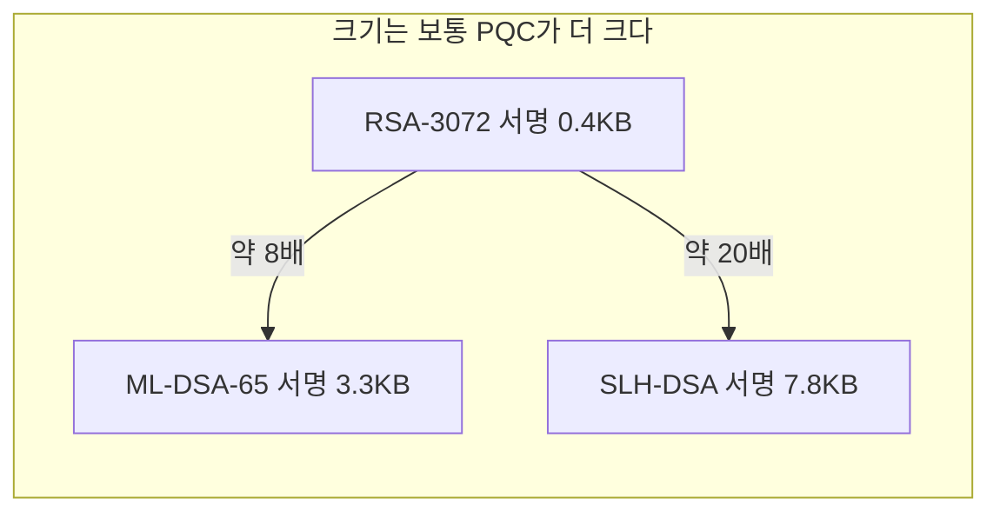

> **지난 시간 요약**: 50년간 공개키 암호는 단 두 개의 가정(소인수분해, 이산로그)에 기대 왔고, Shor 알고리즘이 그 둘을 동시에 위협합니다. 이번 강의에서는 그 레거시 암호와 PQC를 **정면 비교**합니다. "무엇이 다르고, 어떤 면이 좋고, 어디서 손해를 보는가."
{: .prompt-tip }

## 1. 본질의 차이: 어떤 가정에 기대는가

암호의 안전성은 결국 **"이 수학 문제를 빠르게 풀 수 없다"**는 가정에 기댑니다. 레거시와 PQC는 그 가정의 모양 자체가 다릅니다.

| 구분 | 레거시 (RSA / ECC / DH) | PQC (ML-KEM / ML-DSA / SLH-DSA 등) |
|---|---|---|
| 안전성 가정 | 소인수분해, 이산로그 | 격자(SVP/CVP/LWE), 해시 충돌·역상, 디코딩 등 **다양** |
| 양자공격 (Shor) | 다항시간에 **완전히 깨짐** | 알려진 다항시간 양자공격 **없음** |
| 가정의 다양성 | 두 개 (사실상 한 가족) | 격자·해시·코드·다변수 등 **분산** |
| 검증 역사 | 40–50년 | 10–30년 (해시 기반은 길고, 격자는 비교적 새로움) |
| 표준화 시점 | 1990년대~ | 2024년 8월 (NIST FIPS) |

> **여기서 한 가지 분명히.** "PQC가 레거시보다 절대적으로 안전하다"가 아니라, **"양자 위협을 가정했을 때 살아남는 가정 위에 서 있다"**가 정확한 표현입니다. 고전 컴퓨터만 두고 보면 RSA-2048도 여전히 안전합니다. PQC의 가치는 **미래의 양자컴퓨터까지 고려한 안전성**에 있습니다.
{: .prompt-info }

---

## 2. 정량 비교: 키와 서명/암호문 크기

가장 체감되는 차이는 크기입니다. NIST 권장 보안 강도 카테고리 3(AES-192 급)에서의 대략적인 비교입니다.

| 알고리즘 | 공개키 | 개인키 | 서명 또는 암호문 |
|---|---|---|---|
| **RSA-3072** (레거시) | ~0.4 KB | ~2.4 KB | ~0.4 KB |
| **ECDSA P-256** (레거시) | 64 B | 32 B | ~64 B |
| **ML-KEM-768** (PQC, KEM) | 1.18 KB | 2.4 KB | 1.09 KB (암호문) |
| **ML-DSA-65** (PQC, 서명) | 1.95 KB | 4.03 KB | 3.31 KB (서명) |
| **SLH-DSA-128s** (PQC, 서명) | 32 B | 64 B | **7.85 KB** (서명) |
| **Falcon-512** (PQC, 서명) | 0.9 KB | 1.3 KB | 0.66 KB (서명) |



핵심 포인트:

- **ECC는 작고**, PQC는 그보다 큽니다. PQC가 PC급에서는 문제없지만, IoT·스마트카드·블루투스 패킷처럼 크기에 민감한 곳에서는 진통이 있습니다.
- **SLH-DSA(해시 기반)는 서명이 매우 큽니다.** 대신 가정이 가장 단순하고 보수적입니다. "보험" 용도입니다.
- **Falcon은 PQC 중 작은 편**이라 인증서·TLS에 유리합니다(FIPS 206으로 표준화 진행 중).

---

## 3. 속도 비교: 의외의 결과

크기와 달리, **속도는 PQC가 자주 더 빠릅니다.**

| 작업 | RSA-3072 | ECDSA P-256 | ML-KEM-768 | ML-DSA-65 |
|---|---|---|---|---|
| 키 생성 | 매우 느림 (~수십 ms) | 빠름 | **매우 빠름** | 빠름 |
| 서명/캡슐화 | 빠름 | 빠름 | **매우 빠름** | 보통 |
| 검증/복호화 | **매우 빠름** (지수가 작음) | 보통 | 매우 빠름 | 빠름 |

(정확한 수치는 CPU·구현에 따라 다르지만, 경향은 일정합니다.)

- RSA 키 생성은 큰 소수를 찾는 과정이라 느립니다. PQC는 그런 비싼 단계가 없습니다.
- ML-KEM은 행렬·다항식 곱셈이 SIMD로 잘 최적화되어, 많은 환경에서 ECDH보다 빠릅니다.
- 다만 검증 비용은 알고리즘마다 다르므로, **TLS 처럼 빈번한 검증**이 일어나는 곳은 벤치마크가 필수입니다.

---

## 4. "그래서 무엇이 더 좋은가?" — 솔직한 답

PQC가 더 좋은 점:

- ✅ **양자 위협에 대비한 안전성** — 가장 결정적인 이유.
- ✅ **가정의 다양성** — 격자·해시·코드 등 한 군데가 무너져도 다른 게 살아남습니다.
- ✅ **키 생성·서명·캡슐화가 빠른 편** — 특히 ML-KEM은 키 생성이 매우 빠릅니다.
- ✅ **CRYSTALS 계열은 단순한 정수 연산** — 정수 산술과 다항식 곱셈만 있으면 됩니다. 하드웨어 가속도 비교적 쉽습니다.

레거시가 여전히 우세한 점(또는 PQC의 약점):

- ❌ **크기** — PQC 서명·키가 큽니다. 인증서 체인이 부풀어 TLS 핸드셰이크 페이로드가 커집니다.
- ❌ **검증 역사** — RSA·ECC는 수십 년간 학계의 검증을 받았습니다. 격자는 10–20년대 후반 들어 본격 검증이 시작됐습니다.
- ❌ **레거시 호환** — 기존 모든 인프라(인증서, HSM, 스마트카드, 칩)가 RSA/ECC에 맞춰져 있습니다. 교체 비용이 큽니다.
- ❌ **부수 채널** — 새로운 알고리즘은 측면 채널(타이밍·전력) 공격에 대한 누적 경험이 적습니다. 구현 시 더 조심해야 합니다.

> **현실적 결론.** "PQC가 무조건 좋다"가 아니라, **"양자 위협을 가정에 포함시키면 결국 PQC로 가야 한다"**가 맞습니다. 그래서 업계의 답은 **하이브리드**입니다. 레거시(검증된 안전성) + PQC(양자 안전성)를 함께 써서 두 약점을 메우는 것입니다. 자세한 내용은 6강에서 다룹니다.
{: .prompt-warning }

---

## 5. 구조의 차이: 무엇이 안에서 다른가

비교를 좀 더 깊이 들어가면, **연산 자체의 성격**도 다릅니다.

| 측면 | RSA | ECC | ML-KEM / ML-DSA |
|---|---|---|---|
| 핵심 객체 | 큰 정수 ($n \approx 2^{3072}$) | 타원곡선 위의 점 | 다항식 ($\mathbb{Z}_q[x]/(x^{256}+1)$의 원소) |
| 핵심 연산 | 모듈러 거듭제곱 | 스칼라 곱 (점 덧셈) | 다항식 곱셈 (NTT 가속) |
| 주연산 단위 | 한 번에 큰 정수 | 한 번에 작은 좌표 | 256개 계수의 벡터 |
| 하드웨어 친화성 | 크립토 코프로세서 필요 | 작은 칩에서도 가능 | **SIMD·NTT에 매우 친화적** |

PQC, 특히 CRYSTALS 계열(ML-KEM/ML-DSA)이 빠른 비밀은 **NTT(Number Theoretic Transform)** 덕분입니다. NTT는 FFT의 정수 버전으로, 다항식 곱셈을 $O(n \log n)$ 으로 끝냅니다. RSA의 큰 정수 거듭제곱이 $O(\log^2 n)$ 이상 걸리는 것과 대조적입니다.

---

## 6. 실습: 같은 컴퓨터에서 직접 재보기

말로만 듣지 말고, 우리 PC에서 RSA와 ML-KEM의 속도를 직접 비교해봅시다.

```powershell
.\pqc-lab\Scripts\Activate.ps1
pip install cryptography quantcrypt
```

```python
# bench.py
import time
from cryptography.hazmat.primitives.asymmetric import rsa, padding
from cryptography.hazmat.primitives import hashes
from quantcrypt.kem import MLKEM_768

def measure(name, fn, n=20):
    start = time.perf_counter()
    for _ in range(n):
        fn()
    elapsed = (time.perf_counter() - start) / n * 1000
    print(f"{name:30s} {elapsed:8.2f} ms / op")

# --- RSA-3072 ---
def rsa_keygen():
    rsa.generate_private_key(public_exponent=65537, key_size=3072)

rsa_priv = rsa.generate_private_key(public_exponent=65537, key_size=3072)
rsa_pub = rsa_priv.public_key()
msg = b"benchmark message"

def rsa_enc():
    rsa_pub.encrypt(msg, padding.OAEP(mgf=padding.MGF1(hashes.SHA256()),
                                       algorithm=hashes.SHA256(), label=None))

# --- ML-KEM-768 ---
kem = MLKEM_768()
pk, sk = kem.keygen()

def mlkem_keygen():
    kem.keygen()

def mlkem_encaps():
    kem.encaps(pk)

print("=" * 50)
measure("RSA-3072 keygen",  rsa_keygen, n=5)
measure("RSA-3072 encrypt", rsa_enc, n=50)
measure("ML-KEM-768 keygen", mlkem_keygen, n=200)
measure("ML-KEM-768 encaps", mlkem_encaps, n=200)
print("=" * 50)

# 크기 비교
print(f"\nRSA-3072 공개키 길이(추정): ~ 420 bytes")
print(f"ML-KEM-768 공개키 길이     : {len(pk)} bytes")
print(f"ML-KEM-768 암호문 길이     : {len(kem.encaps(pk)[0])} bytes")
```

전형적인 결과(노트북 기준 예시):

```
RSA-3072 keygen                   1200.00 ms / op     ← 매우 느림
RSA-3072 encrypt                     0.80 ms / op
ML-KEM-768 keygen                    0.05 ms / op     ← 4자리수 빠름!
ML-KEM-768 encaps                    0.06 ms / op
==================================================
RSA-3072 공개키 길이(추정): ~ 420 bytes
ML-KEM-768 공개키 길이     : 1184 bytes               ← 크기는 PQC가 더 큼
ML-KEM-768 암호문 길이     : 1088 bytes
```

확인되는 사실:

1. **PQC의 속도 우위**가 분명합니다. 특히 키 생성에서 ML-KEM은 RSA보다 수천~수만 배 빠릅니다.
2. **크기는 PQC가 더 큽니다.** ML-KEM 공개키는 RSA의 약 3배입니다.
3. 이 두 가지 차이가 PQC 도입 시 가장 자주 부딪치는 트레이드오프입니다.

---

## 7. 정리

- 레거시(RSA·ECC)는 **두 개 가정**, PQC는 **여러 가정**(격자·해시·코드 등) 위에 분산되어 있습니다.
- **크기는 PQC가 보통 더 크지만**, **속도(특히 키 생성)는 PQC가 우세**합니다.
- 보안 강도만 보면 PQC가 더 미래지향적이지만, **인프라·검증 역사·크기에서는 레거시가 여전히 유리**합니다.
- 그래서 현실 답은 **하이브리드**입니다 — 이건 6강에서.

다음 강의에서는 NIST가 선정한 PQC 표준의 **세부 — 어떤 알고리즘이, 어떤 보안 강도로, 어떻게 묶여 있는지**를 정리합니다.

> **다음 강의 예고 (3강)**: FIPS 203 (ML-KEM), FIPS 204 (ML-DSA), FIPS 205 (SLH-DSA), 그리고 FIPS 206 (Falcon)·HQC까지.
{: .prompt-info }

---

### 참고 자료
- NIST CSRC 표준 페이지: <https://csrc.nist.gov/projects/post-quantum-cryptography>
- 삼성SDS, *미래 전장의 새로운 방패, 양자내성암호로의 대전환*: <https://www.samsungsds.com/kr/insights/the-great-transition-to-pqc.html>
- Cloud Security Alliance, *NIST FIPS 203, 204, 205 Finalized* (2024-08): <https://cloudsecurityalliance.org/blog/2024/08/15/nist-fips-203-204-and-205-finalized-an-important-step-towards-a-quantum-safe-future>
