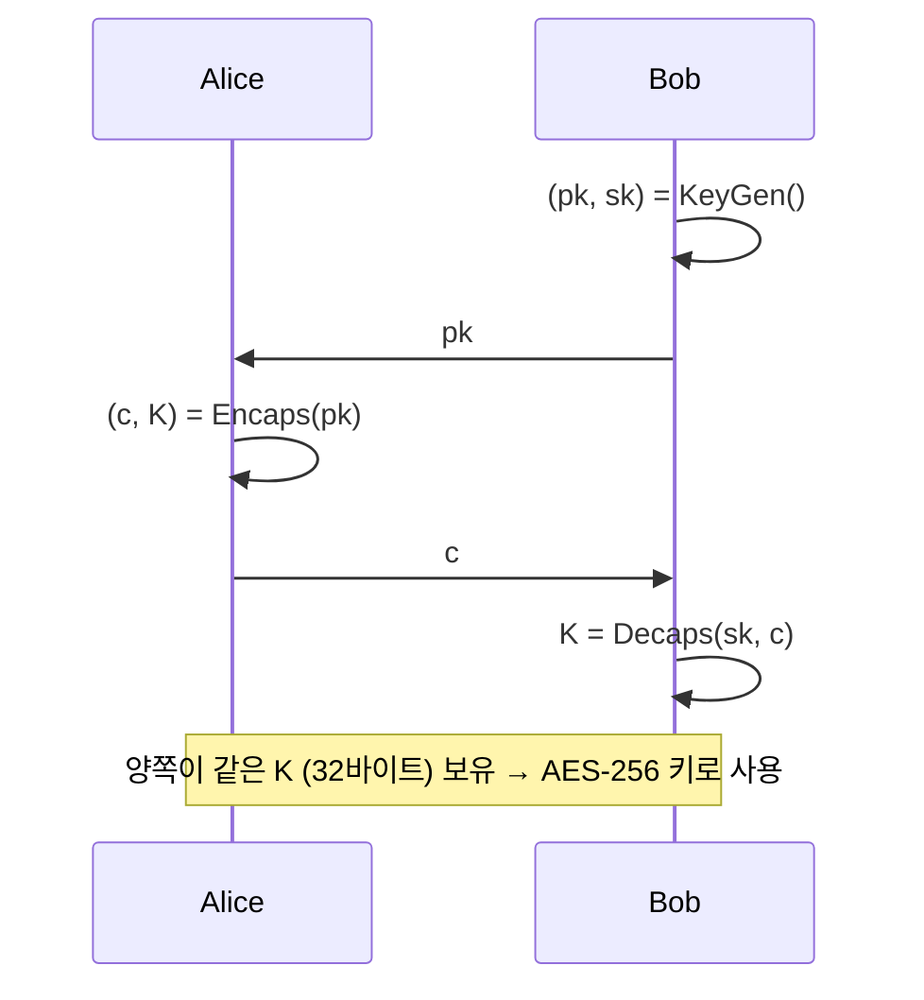
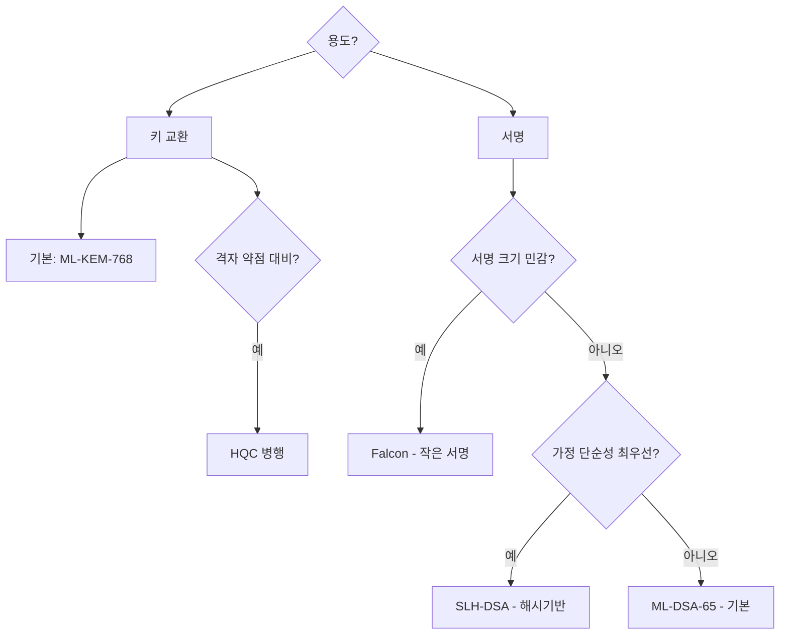

> **지난 시간 요약**: 레거시와 PQC를 정면 비교했고, "크기는 PQC가 크지만 속도와 미래 안전성은 PQC가 우세"라는 결론을 봤습니다. 이번 강의에서는 **NIST가 정확히 무엇을 골랐는지** — 표준 다섯 묶음을 정리하고, ML-KEM을 직접 돌려봅니다.
{: .prompt-tip }

## 1. 전체 지도: 표준 5개 한눈에

NIST가 표준화한(또는 표준화 중인) PQC 알고리즘은 현재 다섯 묶음입니다.

| 표준 | 옛 이름 | 용도 | 기반 수학 | 위치 |
|---|---|---|---|---|
| **FIPS 203 — ML-KEM** | CRYSTALS-Kyber | 키 캡슐화(KEM) | 격자 (Module-LWE) | **기본 키교환** |
| **FIPS 204 — ML-DSA** | CRYSTALS-Dilithium | 전자서명 | 격자 (Module-LWE/SIS) | **기본 서명** |
| **FIPS 205 — SLH-DSA** | SPHINCS+ | 전자서명 | 해시 기반 | **보수적 백업 서명** |
| **FIPS 206 — FN-DSA** (진행 중) | Falcon | 전자서명 | 격자 (NTRU + GPV) | 소형 서명용 |
| **HQC** (2025-03 추가 선정) | HQC | 키 캡슐화(KEM) | **코드 기반** | ML-KEM의 백업 KEM |

> **왜 이렇게 여러 개를 표준으로?** 1·2강에서 강조한 **"가정의 다양성"** 때문입니다. 격자 기반(ML-KEM, ML-DSA, Falcon)이 기본이고, **해시 기반**(SLH-DSA)과 **코드 기반**(HQC)이 백업으로 깔립니다. 격자에 무언가 발견되더라도 통신·서명을 계속할 수 있도록 설계된 것입니다.
{: .prompt-info }

---

## 2. FIPS 203 — ML-KEM (Module-Lattice-Based KEM)

**역할**: 두 사람이 안전하게 **공유 비밀**을 만드는 것. RSA·ECDH가 하던 일을 대체합니다.

### 2.1 KEM이라는 인터페이스

KEM(Key Encapsulation Mechanism)은 세 가지 함수로 정의됩니다.

| 함수 | 입력 | 출력 |
|---|---|---|
| `KeyGen()` | — | (공개키 $pk$, 개인키 $sk$) |
| `Encaps(pk)` | 상대 공개키 | (암호문 $c$, 공유비밀 $K$) |
| `Decaps(sk, c)` | 자기 개인키, 받은 암호문 | 공유비밀 $K$ |



### 2.2 파라미터 세트

| 파라미터 | 보안 카테고리 | 공개키 | 개인키 | 암호문 |
|---|---|---|---|---|
| ML-KEM-512 | 1 (AES-128 급) | 800 B | 1632 B | 768 B |
| **ML-KEM-768** | 3 (AES-192 급) | 1184 B | 2400 B | 1088 B |
| ML-KEM-1024 | 5 (AES-256 급) | 1568 B | 3168 B | 1568 B |

**일반적인 권장 기본값은 ML-KEM-768**입니다. AES-192 수준이라 충분히 강하고, 크기·속도가 균형이 좋습니다.

---

## 3. FIPS 204 — ML-DSA (Module-Lattice-Based DSA)

**역할**: 전자서명. 문서 무결성과 부인방지를 보장합니다.

| 파라미터 | 보안 카테고리 | 공개키 | 서명 |
|---|---|---|---|
| ML-DSA-44 | 2 (AES-128 급) | 1312 B | 2420 B |
| **ML-DSA-65** | 3 (AES-192 급) | 1952 B | 3309 B |
| ML-DSA-87 | 5 (AES-256 급) | 2592 B | 4627 B |

ML-DSA는 같은 Module-LWE 위에 **Fiat-Shamir 변환**을 얹어 서명을 만듭니다. 검증이 빠르고 키 생성이 단순하다는 장점이 있습니다.

---

## 4. FIPS 205 — SLH-DSA (Stateless Hash-Based DSA)

**역할**: 가장 보수적인 백업 서명. **해시 함수의 안전성**에만 의존합니다.

| 파라미터 | 보안 카테고리 | 공개키 | 서명 |
|---|---|---|---|
| SLH-DSA-128s | 1 | 32 B | 7856 B |
| SLH-DSA-128f | 1 | 32 B | 17088 B |
| SLH-DSA-192s | 3 | 48 B | 16224 B |
| SLH-DSA-256s | 5 | 64 B | 29792 B |

- 접미사 `s`는 "small signatures, slow"입니다(서명이 작고 느림).
- 접미사 `f`는 "fast signing"입니다(빠르지만 서명이 큼).
- **공개키는 32~64바이트로 매우 작지만, 서명은 8~30KB로 매우 큽니다.**

> **왜 굳이 SLH-DSA를?** 해시 함수(SHA-2/SHAKE)는 수십 년간 검증된, **가장 단순한 가정**입니다. 격자에 약점이 발견되어도 SLH-DSA는 흔들리지 않습니다. 잦은 서명이 필요 없는 **펌웨어 서명, 루트 인증서, 코드 서명** 같은 곳에 적합합니다.
{: .prompt-info }

---

## 5. FIPS 206 — Falcon (진행 중)

**Falcon**은 Round 3에서 ML-DSA와 함께 결승에 올랐던 또 다른 격자 기반 서명입니다. NIST는 FIPS 206에 **FN-DSA**(Falcon)로 표준화를 진행 중입니다.

특징:

- 서명이 **PQC 중 가장 작은 편** (0.66 KB 정도). 인증서 체인·TLS에 유리.
- 단점: 키 생성에 **부동소수점** 연산이 필요해 구현이 까다롭고 부수 채널에 민감.

---

## 6. HQC — 코드 기반 백업 KEM (2025-03 추가 선정)

ML-KEM이 격자 기반이라, NIST는 4번째 라운드를 거쳐 **다른 가정에 기반한 KEM**을 하나 더 골랐습니다. 그 결과가 **HQC(Hamming Quasi-Cyclic)**입니다(2025년 3월 11일 추가 표준화 결정).

- **기반**: 무작위 코드 디코딩의 어려움(McEliece 계열의 변형).
- **위치**: ML-KEM이 격자 약점으로 흔들릴 경우의 **백업**.
- 단점: ML-KEM보다 크기가 크고 느립니다.

---

## 7. 한눈에 보는 의사결정 트리

어떤 알고리즘을 쓸지 결정하는 단순화된 가이드입니다.



대부분의 실무에서는 **ML-KEM-768 + ML-DSA-65** 조합이 출발점입니다. 거기에 상황에 따라 Falcon·SLH-DSA·HQC를 더하는 식입니다.

---

## 8. 실습: ML-KEM-768 한 바퀴

```powershell
.\pqc-lab\Scripts\Activate.ps1
pip install quantcrypt
```

```python
# ml_kem_demo.py
from quantcrypt.kem import MLKEM_768

kem = MLKEM_768()

# 1) Bob: 키 쌍 생성
pk_bob, sk_bob = kem.keygen()

# 2) Alice: Bob 공개키로 캡슐화
ciphertext, K_alice = kem.encaps(pk_bob)

# 3) Bob: 캡슐 열기
K_bob = kem.decaps(sk_bob, ciphertext)

print("공개키 크기 :", len(pk_bob), "B  (표준: 1184 B)")
print("개인키 크기 :", len(sk_bob), "B  (표준: 2400 B)")
print("암호문 크기 :", len(ciphertext), "B  (표준: 1088 B)")
print("공유비밀 길이:", len(K_alice), "B  (표준: 32 B = 256비트 = AES-256 키)")
print("두 사람의 공유비밀 일치?", K_alice == K_bob)
print("공유비밀(hex):", K_alice.hex()[:32], "...")
```

기대 결과:

```
공개키 크기 : 1184 B  (표준: 1184 B)
개인키 크기 : 2400 B  (표준: 2400 B)
암호문 크기 : 1088 B  (표준: 1088 B)
공유비밀 길이: 32 B  (표준: 32 B = 256비트 = AES-256 키)
두 사람의 공유비밀 일치? True
공유비밀(hex): 3f1a...
```

여기서 나오는 32바이트가 그대로 **AES-256 세션키**가 됩니다. RSA로 세션키를 교환하던 자리에, ML-KEM이 양자 안전하게 들어가는 것입니다.

---

## 9. 정리

- NIST가 고른 PQC 표준은 **ML-KEM, ML-DSA, SLH-DSA, Falcon, HQC** 다섯 묶음.
- 격자 기반이 기본, **해시·코드 기반은 백업** — "달걀을 한 바구니에 담지 않음".
- 일반 출발점은 **ML-KEM-768 + ML-DSA-65**.
- 실습에서 ML-KEM이 RSA를 대신해 32바이트 AES-256 키를 만들어 냈습니다.

다음 강의에서는 이 모든 표준의 뿌리인 **격자와 LWE**를 직관적으로 이해합니다.

> **다음 강의 예고 (4강)**: 격자란 무엇인가, SVP·CVP, 그리고 LWE — "왜 양자컴퓨터로도 어려운가"를 그림과 코드로.
{: .prompt-info }

---

### 참고 자료
- NIST CSRC, FIPS 203 (ML-KEM): <https://csrc.nist.gov/pubs/fips/203/final>
- NIST CSRC, FIPS 204 (ML-DSA): <https://csrc.nist.gov/pubs/fips/204/final>
- NIST CSRC, *Post-Quantum Cryptography*: <https://csrc.nist.gov/projects/post-quantum-cryptography>
- Federal Register, FIPS 203/204/205 issuance: <https://www.federalregister.gov/documents/2024/08/14/2024-17956>
