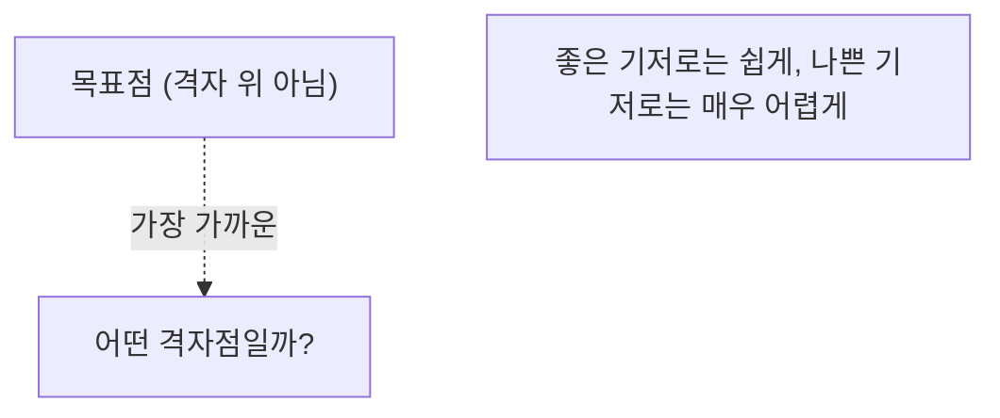
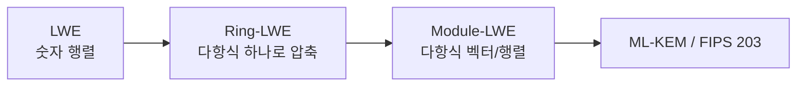

> **지난 시간 요약**: NIST가 ML-KEM·ML-DSA·SLH-DSA·Falcon·HQC를 표준으로 골랐고, 그 중 기본값(ML-KEM·ML-DSA·Falcon)이 모두 **격자 기반**이라는 것을 봤습니다. 이번 강의에서는 그 "격자"가 무엇이고, "오차를 일부러 섞는" 아이디어(LWE)가 어떻게 ML-KEM이 되는지 직관적으로 따라갑니다.
{: .prompt-tip }

## 1. 격자, 사실은 단순합니다

격자(lattice)는 **규칙적으로 무한히 펼쳐진 점들의 집합**입니다. 모눈종이의 교차점, 벽지의 반복 무늬가 격자입니다.

수학적으로는 **기저 벡터의 정수 조합**으로 만들어지는 모든 점입니다. 2차원에서 기저가 $\mathbf{b}_1, \mathbf{b}_2$ 일 때:

$$ L = \{\, a\,\mathbf{b}_1 + b\,\mathbf{b}_2 \;:\; a, b \in \mathbb{Z} \,\} $$

**정수 배수만 허용**하는 것이 핵심입니다(실수까지 허용하면 평면 전체가 됨).

### 1.1 "좋은 기저"와 "나쁜 기저"

같은 격자를 만드는 기저는 무수히 많지만, 다루기 쉬운 정도가 천차만별입니다.

- **좋은 기저**: 짧고 거의 직각인 벡터들 → 점을 쉽게 다룸
- **나쁜 기저**: 길고 거의 평행한 벡터들 → 같은 격자인데도 다루기 매우 어려움

```
좋은 기저 (짧고 직각에 가까움)         나쁜 기저 (길고 거의 평행)
  ^                                     ^
  | b2                                  |        b2 ↗
  |                                     |      ↗
  +-----> b1                            +--------------→ b1
```

격자 기반 암호의 핵심 아이디어가 여기에 있습니다.

> - **개인키 = 좋은 기저** (문제를 쉽게 풂)
> - **공개키 = 나쁜 기저** (같은 격자를 표현하지만, 문제를 어렵게 만듦)
>
> 공개키만 아는 공격자는 어려운 문제에 직면하고, 개인키를 아는 정당한 사용자는 같은 문제를 쉽게 풉니다. 이 **비대칭성**이 공개키 암호의 핵심입니다.
{: .prompt-info }

---

## 2. 어려운 문제 둘: SVP와 CVP

격자 위에서 "어렵다고 믿어지는" 두 문제입니다. 고차원에서는 고전·양자 모두에게 효율적인 알고리즘이 알려져 있지 않습니다.

### 2.1 SVP — 최단 벡터 문제

> **원점을 제외하고**, 격자 위에서 원점에 가장 가까운 점(가장 짧은 격자 벡터)을 찾아라.

### 2.2 CVP — 최근접 벡터 문제

> 격자 위에 있지 **않은** 임의의 목표점이 주어졌을 때, 가장 가까운 격자점을 찾아라.



### 2.3 왜 양자컴퓨터로도 안 풀리나?

Shor 알고리즘은 소인수분해·이산로그처럼 **숨은 주기(period)**를 찾는 문제에 특화돼 있습니다. SVP/CVP는 그런 주기 구조가 없어, **Shor가 통하지 않습니다.** 현재까지 알려진 양자 알고리즘도 결정적 우위를 주지 못합니다. 그래서 격자가 PQC의 든든한 기반이 됐습니다.

### 2.4 이론적 근거: Worst-case to Average-case

1996년 Ajtai가 증명한 결과가 있습니다.

> "**어떤 격자라도** SVP가 어렵다면, **무작위로 뽑은 격자**도 평균적으로 어렵다."

이건 정말 강력한 성질입니다. 보통의 암호는 "운 나쁜 키"가 약할 수 있지만, 격자 기반은 그런 함정이 없다는 이론적 보증을 갖습니다.

---

## 3. CVP에서 LWE로

이제 결정적인 다리를 건넙니다. **LWE(Learning With Errors)**는 본질적으로 CVP의 변형입니다.

### 3.1 직관: 오차를 일부러 섞기

중·고등학교 연립방정식은 미지수 $n$개여도 식 $n$개면 가우스 소거법으로 풀립니다.

$$
\begin{aligned}
3s_1 + 5s_2 &= 13 \\
2s_1 + s_2 &= 6
\end{aligned}
\quad\Rightarrow\quad s_1, s_2 \text{ 깔끔히 구함}
$$

LWE는 여기에 **작은 무작위 오차**를 끼얹습니다.

$$
\begin{aligned}
3s_1 + 5s_2 + e_1 &= 13 \\
2s_1 + s_2 + e_2 &= 6 \\
&\;\vdots
\end{aligned}
$$

가우스 소거법이 무너집니다. 작은 오차가 소거 과정에서 폭발적으로 증폭되어 비밀 $\mathbf{s}$ 를 복원할 수 없게 됩니다.

> **LWE 문제 (말로)**: "$\mathbf{A}\mathbf{s} + \mathbf{e} = \mathbf{b}$ 에서, 공개된 $\mathbf{A}$, $\mathbf{b}$ 만 보고 비밀 $\mathbf{s}$ 를 찾아라. 단 $\mathbf{e}$ 는 작은 무작위 오차."
>
> 이는 사실상 "오차가 섞인 목표점 $\mathbf{b}$ 에서 진짜 격자점 $\mathbf{A}\mathbf{s}$ 를 찾는 것" — **CVP의 변형**입니다.
{: .prompt-info }

### 3.2 LWE로 만드는 암호

- **공개키**: $\mathbf{A}$ 와 $\mathbf{b} = \mathbf{A}\mathbf{s} + \mathbf{e}$ (비밀 $\mathbf{s}$ 가 오차에 가려짐)
- **개인키**: 비밀 벡터 $\mathbf{s}$
- **암호화**: 메시지 비트를 $\mathbf{b}$ 의 조합에 얹어 보냄. 0이면 격자점 근처, 1이면 격자점에서 절반 떨어진 곳.
- **복호화**: $\mathbf{s}$ 를 알면 오차를 걷어내고 0/1 판별 가능.

핵심은 **오차 크기 관리**입니다. 너무 크면 정당한 사용자도 실패하고, 너무 작으면 공격자가 풀어버립니다. 그 절묘한 균형이 파라미터 설계의 정수입니다.

---

## 4. LWE → Module-LWE → Kyber

순수 LWE는 안전하지만 **키가 너무 큽니다**(거대한 행렬 $\mathbf{A}$). 그래서 실용 표준은 효율적인 변형을 씁니다.



| 변형 | 아이디어 | 트레이드오프 |
|---|---|---|
| **LWE** | 큰 정수 행렬 | 안전하지만 거대 |
| **Ring-LWE** | **다항식 하나**로 압축 | 작고 빠름, 구조가 많아 일부 우려 |
| **Module-LWE** | **다항식의 작은 벡터/행렬** | **균형점** — Kyber가 선택 |

**ML-KEM**은 $\mathbb{Z}_q[x]/(x^{256}+1)$ ($q=3329$) 위의 다항식들을 원소로 하는 $k \times k$ 행렬을 씁니다(보안 강도에 따라 $k = 2, 3, 4$). 다항식 곱셈은 **NTT(Number Theoretic Transform)**로 $O(n \log n)$ 에 처리되어 매우 빠릅니다.

---

## 5. 실습 1: 2D 격자에서 CVP 풀기

`numpy`로 격자를 만들고 CVP를 직접 풀어봅시다.

```powershell
.\pqc-lab\Scripts\Activate.ps1
pip install numpy matplotlib
```

```python
# lattice_cvp.py
import numpy as np

b1 = np.array([2.0, 0.0])
b2 = np.array([1.0, 1.8])

coeffs = range(-5, 6)
points = np.array([a * b1 + b * b2 for a in coeffs for b in coeffs])

target = np.array([3.3, 2.1])
dists = np.linalg.norm(points - target, axis=1)
nearest = points[np.argmin(dists)]

print("목표점         :", target)
print("최근접 격자점 :", nearest)
print("거리          :", round(dists.min(), 4))
```

2차원에서는 전수탐색으로 1초도 안 걸려 풀립니다. 하지만 ML-KEM은 차원이 수백~수천이고 점의 개수가 천문학적이라, **같은 전수탐색이 우주의 나이보다 오래** 걸립니다. 게다가 공격자에게는 **나쁜 기저**만 주어집니다.

(원하면 `matplotlib`로 그림도 그릴 수 있습니다. 별표가 목표점, 초록 점이 최근접입니다.)

---

## 6. 실습 2: 장난감 LWE — 오차의 위력

```python
# lwe_toy.py
import numpy as np

q = 97
n = 4
m = 8
rng = np.random.default_rng(42)

s = rng.integers(0, q, size=n)              # 비밀
A = rng.integers(0, q, size=(m, n))         # 공개 행렬
e = rng.integers(-2, 3, size=m)             # 작은 오차
b = (A @ s + e) % q                          # 공개되는 b

print("공개되는 A:\n", A)
print("공개되는 b :", b)
print("(비밀 s   :", s, "  공격자는 모름)")

# 정당한 사용자: s를 안다 → 오차를 직접 확인 가능
recovered = (b - A @ s) % q
recovered = np.where(recovered > q // 2, recovered - q, recovered)
print("\ns 를 아는 사람이 본 오차:", recovered)
print("원래 e                 :", e)

# 공격자 시뮬레이션: 가능한 모든 s 후보를 전수탐색
print("\n전수탐색 시작... (작은 파라미터라 가능)")
hits = 0
for guess in np.ndindex(*([q] * n)):
    g = np.array(guess)
    err = (b - A @ g) % q
    err = np.where(err > q // 2, err - q, err)
    if np.all(np.abs(err) <= 2):
        hits += 1
        if np.array_equal(g, s):
            print("→ 비밀 s 발견:", g)
print(f"오차 조건을 만족한 후보 수: {hits}")
```

> **여기서 핵심을 느껴보세요.**
> $n=4, q=97$ 에서 후보 공간은 $97^4 \approx 8.86 \times 10^7$ — PC로 수 분이면 끝납니다.
> ML-KEM은 차원 256, $q=3329$, Module 구조까지 더해집니다. 후보 공간이 **천문학적**으로 커져 같은 전수탐색이 불가능합니다.
> "작은 장난감은 풀리지만, 표준 파라미터에서는 절대 못 푸는" 이 격차가 격자·LWE 암호의 안전성입니다.
{: .prompt-warning }

---

## 7. 정리

- 격자 = 기저의 **정수 조합**으로 만들어지는 무한한 점들의 집합.
- **SVP**(가장 짧은 벡터)와 **CVP**(가장 가까운 격자점)는 고차원에서 고전·양자 모두에게 어렵습니다. Shor의 주기 구조 공격이 통하지 않습니다.
- **LWE**는 "오차를 일부러 섞어" CVP를 암호로 만든 도구입니다.
- LWE → Ring-LWE → **Module-LWE** → **ML-KEM/ML-DSA** 의 흐름으로 효율과 안전성을 균형 잡았습니다.

여기까지가 PQC의 **수학적 뿌리** 영역입니다. 그런데 격자 위에서 KEM(ML-KEM)은 자연스럽게 따라오지만, **전자서명(ML-DSA)**은 어떻게 만들어질까요? 그 답이 바로 **슈노르 서명**입니다. ML-DSA는 사실상 "격자 위의 슈노르 + 거부 샘플링"이라, 슈노르를 먼저 이해해야 ML-DSA가 보입니다.

> **다음 강의 예고 (4-2강)**: 슈노르 서명 — 레거시에서 ML-DSA로 가는 다리. 실제 구현 가능한 수준의 Python 코드와 함께.
{: .prompt-info }

---

### 참고 자료
- O. Regev, *On lattices, learning with errors, random linear codes, and cryptography* (2005, 2009).
- M. Ajtai, *Generating hard instances of lattice problems* (1996).
- CRYSTALS-Kyber spec (ML-KEM 원본): <https://pq-crystals.org/kyber/>
