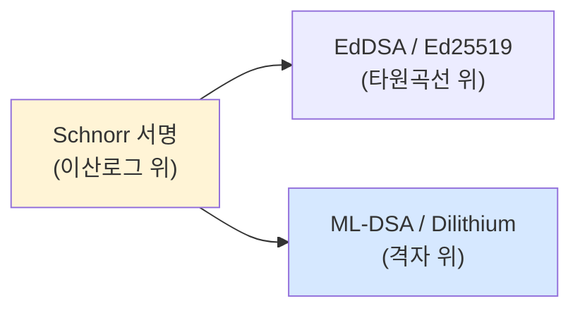
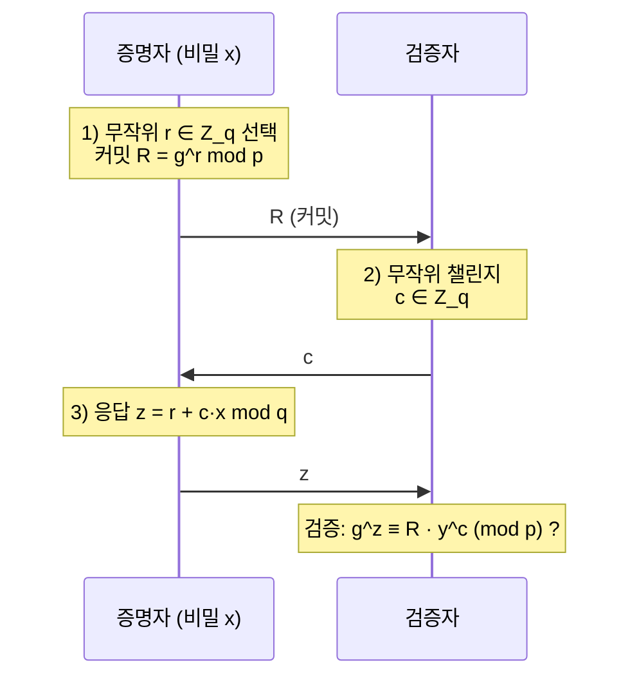
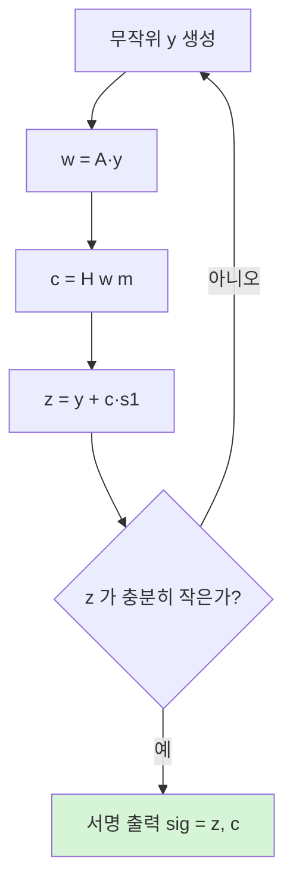

> **왜 이 강의가 끼어드는가**: ML-DSA(FIPS 204, 옛 이름 Dilithium)는 사실상 **"격자 위의 슈노르 서명에 거부 샘플링을 더한 것"**입니다. 슈노르를 모르면 ML-DSA가 왜 그렇게 생겼는지, 왜 ML-DSA의 서명 안에 `(z, c)` 같은 쌍이 들어가는지 이해할 수 없습니다. 그래서 이 강의는 **실제로 따라 구현할 수 있는 수준**으로 슈노르 서명을 다룹니다. 4강의 격자/LWE와 5강의 한국 정책 사이에 다리를 놓는 강의입니다.
{: .prompt-tip }

## 1. 왜 하필 슈노르인가

전자서명 알고리즘은 여럿 있습니다 — RSA, DSA, ECDSA, EdDSA(Ed25519), 슈노르 등. 그 중 슈노르(Claus Schnorr, 1989/1991)는 다음 세 가지 이유로 특별합니다.

1. **가장 단순합니다.** 한 페이지에 정의가 끝납니다.
2. **수학적으로 가장 깔끔**합니다. 보안 증명이 표준 가정(이산로그)에서 직접 나옵니다.
3. **격자로 그대로 옮길 수 있습니다.** 같은 골격을 LWE/Module-LWE 위에 다시 세우면 **ML-DSA**가 됩니다.

ECDSA·EdDSA가 더 유명하지만, 둘 다 슈노르를 변형·실용화한 변종입니다(EdDSA는 거의 슈노르입니다). 즉 **슈노르가 원형(原型)**입니다.



이 그림이 이 강의 전체의 한 줄 요약입니다. **같은 골격이 곡선에서는 EdDSA, 격자에서는 ML-DSA로 나타납니다.**

---

## 2. 슈노르 식별 프로토콜 — 모든 것의 출발점

서명 이야기에 앞서, 슈노르의 **식별(identification) 프로토콜**부터 봐야 합니다. 서명은 이 프로토콜의 **비대화형(non-interactive) 버전**입니다.

### 2.1 환경 설정

- 큰 소수 $p$
- $\mathbb{Z}_p^*$ 의 부분군의 큰 소수 위수 $q$
- 위수 $q$ 인 생성원 $g$
- 비밀키: $x \in \mathbb{Z}_q$
- 공개키: $y = g^x \bmod p$

핵심 가정: **공개된 $y$ 에서 비밀 $x$ 를 구하는 것이 어렵다** (이산로그 문제, DLP).

### 2.2 3-패스(Sigma) 프로토콜

증명자(Prover, 비밀 $x$ 를 안다)와 검증자(Verifier) 사이의 3단계 대화입니다.



세 단계의 명칭이 정해져 있습니다.

| 단계 | 이름 | 내용 |
|---|---|---|
| 1 | **Commit** | 증명자가 무작위 $r$ 로 $R = g^r$ 을 만들어 보냄 |
| 2 | **Challenge** | 검증자가 무작위 $c$ 를 보냄 |
| 3 | **Response** | 증명자가 $z = r + cx \bmod q$ 로 응답 |

검증식: $g^z \stackrel{?}{=} R \cdot y^c \pmod{p}$.

**왜 이 식이 성립하나?** $g^z = g^{r + cx} = g^r \cdot g^{cx} = R \cdot (g^x)^c = R \cdot y^c$. 끝.

### 2.3 왜 안전한가 — 직관

- 비밀 $x$ 가 없으면 검증을 통과하는 $z$ 를 만들 수 없습니다. 모든 $c$ 에 대해 응답할 수 있다면 두 번의 응답에서 $x$ 가 노출됩니다(zero-knowledge 증명의 추출자 논리).
- $r$ 은 한 번만 써야 합니다. 같은 $R$ 을 두 다른 챌린지 $c_1, c_2$ 에 재사용하면 $x = (z_1 - z_2)/(c_1 - c_2)$ 로 즉시 비밀이 노출됩니다. **(이 함정은 ECDSA의 PlayStation 3, Bitcoin 사고로 유명합니다.)**

> **여기서 기억할 것.** 슈노르의 핵심은 단 한 줄 — $z = r + c \cdot x$ — 입니다. 이 한 줄을 어떤 수학 구조에서 다시 쓰느냐가 알고리즘을 결정합니다. 곡선에서 다시 쓰면 EdDSA, 격자에서 다시 쓰면 ML-DSA입니다.
{: .prompt-info }

---

## 3. Fiat-Shamir 변환 — 서명으로 바꾸기

위 식별 프로토콜은 **대화형**입니다. 서명은 서명자만 작동하고 검증자는 나중에 받습니다. 그래서 1986년 Fiat과 Shamir가 **챌린지를 해시로 대체**하는 트릭을 제안했습니다.

> **Fiat-Shamir 변환**: 챌린지 $c$ 를 검증자에게 받지 말고, **$c = H(R \,\|\, \text{메시지})$** 로 정한다.

해시 함수가 "랜덤 오라클"처럼 행동한다면, 누구도 미리 챌린지를 조작할 수 없으므로 보안이 유지됩니다.

### 3.1 슈노르 서명 알고리즘 (대화 → 서명)

**서명 (Sign):**
1. 무작위 $r \in \mathbb{Z}_q$ 선택
2. $R = g^r \bmod p$ 계산
3. $c = H(R \,\|\, m)$ 계산
4. $z = r + c \cdot x \bmod q$ 계산
5. 출력: 서명 $\sigma = (c, z)$

**검증 (Verify):** 공개키 $y$, 메시지 $m$, 서명 $(c, z)$ 에 대해
1. $R' = g^z \cdot y^{-c} \bmod p$ 계산
2. $c \stackrel{?}{=} H(R' \,\|\, m)$ 확인

이게 슈노르 서명의 전부입니다. **다섯 줄짜리 알고리즘**입니다.

---

## 4. 실제 구현 — Python으로 처음부터 끝까지

외부 암호 라이브러리 없이 표준 라이브러리(`hashlib`, `secrets`)만 가지고 슈노르를 처음부터 구현합니다. 교육·이해 목적이라 **작은 안전한 소수 군**을 직접 정의해 씁니다.

### 4.1 안전한 소수 군 만들기

```python
# schnorr.py
import hashlib, secrets

# RFC 5114에 명시된 1024비트 안전 소수 그룹 (교육용; 실서비스는 2048+ 사용)
# p = 2q + 1, q는 소수, g의 위수가 q인 부분군
p = int("""
B10B8F96A080E01DDE92DE5EAE5D54EC52C99FBCFB06A3C69A6A9DCA52D23B616073E28675A23
D189838EF1E2EE652C013ECB4AEA906112324975C3CD49B83BFACCBDD7D90C4BD7098488E9C21
9A73724EFFD6FAE5644738FAA31A4FF55BCCC0A151AF5F0DC8B4BD45BF37DF365C1A65E68CFDA
76D4DA708DF1FB2BC2E4A4371
""".replace("\n", ""), 16)

q = int("""
F518AA8781A8DF278ABA4E7D64B7CB9D49462353
""".replace("\n", ""), 16)

g = int("""
A4D1CBD5C3FD34126765A442EFB99905F8104DD258AC507FD6406CFF14266D31266FEA1E5C41
564B777E690F5504F213160217B4B01B886A5E91547F9E2749F4D7FBD7D3B9A92EE1909D0D22
63F80A76A6A24C087A091F531DBF0A0169B6A28AD662A4D18E73AFA32D779D5918D08BC8858F
4DCEF97C2A24855E6EEB22B3B2E5
""".replace("\n", ""), 16)
```

> **주의**: 위 그룹은 1024비트로 **교육용**입니다. 실제 서비스에는 NIST P-256 같은 타원곡선 기반의 슈노르(예: Bitcoin BIP-340)나 ML-DSA를 쓰세요. 다만 코드 흐름을 이해하기에는 모듈러 산술이 가장 직관적이라 이렇게 만듭니다.
{: .prompt-warning }

### 4.2 키 생성·서명·검증 (40줄)

```python
def keygen():
    x = secrets.randbelow(q - 1) + 1          # 1 ≤ x ≤ q-1
    y = pow(g, x, p)                          # 공개키 y = g^x mod p
    return x, y

def H(*parts):
    h = hashlib.sha256()
    for part in parts:
        if isinstance(part, int):
            part = part.to_bytes((part.bit_length() + 7) // 8 or 1, "big")
        h.update(len(part).to_bytes(4, "big"))   # 길이 prefix로 도메인 분리
        h.update(part)
    return int.from_bytes(h.digest(), "big") % q

def sign(x, msg: bytes):
    r = secrets.randbelow(q - 1) + 1          # 1 ≤ r ≤ q-1 (절대 재사용 금지!)
    R = pow(g, r, p)                          # 커밋
    c = H(R, msg)                             # Fiat-Shamir 챌린지
    z = (r + c * x) % q                       # 응답
    return (c, z)

def verify(y, msg: bytes, sig):
    c, z = sig
    if not (0 < z < q) or not (0 < c < q):
        return False
    # R' = g^z * y^(-c) mod p
    y_inv_c = pow(y, q - c, p)                # y^(-c) = y^(q-c) (위수가 q이므로)
    R_prime = (pow(g, z, p) * y_inv_c) % p
    return c == H(R_prime, msg)

# --- 데모 ---
if __name__ == "__main__":
    x, y = keygen()
    msg = b"Schnorr is the parent of ML-DSA"
    sig = sign(x, msg)
    print("공개키 y (첫 32 hex):", hex(y)[:34], "...")
    print("서명 (c, z):")
    print("  c =", hex(sig[0])[:34], "...")
    print("  z =", hex(sig[1])[:34], "...")
    print("정상 검증 :", verify(y, msg, sig))
    print("위변조 검증:", verify(y, b"tampered", sig))   # False여야 함
```

실행 결과 예시:

```
공개키 y (첫 32 hex): 0x8a91...
서명 (c, z):
  c = 0x4d2f...
  z = 0x91a7...
정상 검증 : True
위변조 검증: False
```

이 코드는 **외부 의존성이 없고**, 100줄 미만으로 슈노르 서명의 전체 알고리즘을 구현합니다. 한 번 실행해보면 위에서 본 다섯 줄짜리 정의가 그대로 코드가 됨을 알 수 있습니다.

### 4.3 절대 하지 말아야 할 것 — Nonce 재사용

`r` 을 두 다른 메시지에 재사용하면 비밀키가 한 줄로 노출됩니다.

```python
# DO NOT do this in production — 비밀키 노출 시연
def break_via_nonce_reuse():
    x, y = keygen()
    # 공격자 시나리오: 같은 r 을 두 메시지에 재사용
    r = secrets.randbelow(q - 1) + 1
    R = pow(g, r, p)
    m1, m2 = b"message one", b"message two"
    c1 = H(R, m1); z1 = (r + c1 * x) % q
    c2 = H(R, m2); z2 = (r + c2 * x) % q
    # 공격자는 (m1, R, z1), (m2, R, z2) 만 보고 x 복원
    # z1 - z2 = (c1 - c2) * x  →  x = (z1 - z2) * (c1 - c2)^(-1) mod q
    diff_c = (c1 - c2) % q
    recovered = ((z1 - z2) * pow(diff_c, -1, q)) % q
    print("실제 비밀  x :", hex(x)[:34])
    print("복원된 비밀 x:", hex(recovered)[:34])
    print("일치?       :", recovered == x)

break_via_nonce_reuse()
```

이 함정은 실제로 큰 사고를 일으켰습니다.

- **2010 — Sony PlayStation 3**: ECDSA 구현에서 nonce를 상수로 하드코딩 → 마스터 비밀키 노출 → 자작 코드 서명 가능.
- **2013 — Android Bitcoin 지갑**: 안드로이드의 약한 RNG로 같은 nonce가 두 번 사용 → 일부 지갑의 비트코인 도난.

**ML-DSA(Dilithium)도 마찬가지로, 매번 새로운 무작위(또는 결정론적 의사난수)를 써야 합니다.** 슈노르의 이 규칙은 격자 위에서도 그대로입니다.

---

## 5. 슈노르 → ML-DSA — 정확히 무엇이 바뀌었나

이제 핵심입니다. 위에서 본 슈노르의 다섯 줄과 ML-DSA의 다섯 줄을 비교합니다.

| 단계 | 슈노르 (이산로그) | ML-DSA (격자) |
|---|---|---|
| 비밀키 | $x \in \mathbb{Z}_q$ | **작은 다항식 벡터** $\mathbf{s}_1, \mathbf{s}_2$ |
| 공개키 | $y = g^x$ | $\mathbf{t} = \mathbf{A}\mathbf{s}_1 + \mathbf{s}_2$ (LWE 형태) |
| 커밋 | $r \in \mathbb{Z}_q,\; R = g^r$ | **작은 다항식 벡터** $\mathbf{y},\; \mathbf{w} = \mathbf{A}\mathbf{y}$ |
| 챌린지 | $c = H(R \,\|\, m)$ | $c = H(\mathbf{w} \,\|\, m)$ (작은 계수 다항식) |
| 응답 | $z = r + c \cdot x$ | $\mathbf{z} = \mathbf{y} + c \cdot \mathbf{s}_1$ |

골격이 **정확히 같습니다.** 차이는 두 가지뿐입니다.

### 5.1 차이 1 — 군이 격자로 바뀜

$g, y, R$ 같은 군 원소가 **다항식 행렬·벡터**로 바뀝니다. 이산로그의 어려움 대신 **Module-LWE의 어려움**에 기댑니다.

### 5.2 차이 2 — 거부 샘플링 (Rejection Sampling)

격자에서는 $\mathbf{z} = \mathbf{y} + c \cdot \mathbf{s}_1$ 의 계수가 너무 커지면, **그 값이 비밀 $\mathbf{s}_1$ 의 정보를 누설**합니다. 그래서 ML-DSA는 계산된 $\mathbf{z}$ 의 크기를 점검해 **너무 크면 버리고 처음부터 다시 시도**합니다(Fiat-Shamir with Aborts, Lyubashevsky 2009).



이 "다시 시도" 루프가 ML-DSA 서명이 슈노르보다 약간 느린 이유이자, 보안의 핵심입니다. 거부 비율은 보통 수 % 이내로 설계됩니다.

### 5.3 한 줄로 요약

> **ML-DSA = 슈노르 서명 + Module-LWE + 거부 샘플링**

이 한 줄을 머리에 박아두면 ML-DSA 스펙(FIPS 204) 어디를 봐도 헤매지 않습니다. 서명 안의 `(z, c)` 쌍, 공개키의 `(A, t)`, 모두 슈노르의 친숙한 구조입니다.

---

## 6. EdDSA(Ed25519)와의 비교 — 곡선 위의 슈노르

참고로, 우리가 매일 쓰는 **Ed25519 서명**도 사실상 슈노르입니다.

| 항목 | 슈노르 (이번 강의) | Ed25519 |
|---|---|---|
| 군 | $\mathbb{Z}_p^*$ 의 부분군 | Edwards 곡선 위의 점 |
| 키 길이 | ~256 bytes | 32 bytes |
| 서명 길이 | ~64 bytes | 64 bytes |
| 양자안전? | ❌ Shor에 깨짐 | ❌ Shor에 깨짐 |

Ed25519의 작은 키와 빠른 속도가 매력적이지만, 양자컴퓨터 앞에서는 슈노르와 함께 무너집니다. 그래서 **격자판 슈노르 = ML-DSA**가 필요한 것입니다.

---

## 7. 정리

- 슈노르 서명은 **3-패스 식별 프로토콜 + Fiat-Shamir**의 결과로, 전자서명의 **원형(原型)**입니다.
- 핵심 한 줄: $z = r + c \cdot x$. 이 한 줄을 어떤 수학 구조에서 다시 쓰느냐가 알고리즘을 결정합니다.
- 같은 골격이 곡선에서는 **EdDSA**, 격자에서는 **ML-DSA(Dilithium)**가 됩니다.
- ML-DSA가 슈노르와 다른 점은 **(1) 군이 격자(Module-LWE)로 바뀌고, (2) 거부 샘플링이 추가된다**는 두 가지뿐입니다.
- `r`(nonce) 재사용은 비밀키를 즉시 노출시킵니다. 슈노르·EdDSA·ML-DSA 모두 동일한 함정을 갖습니다.

이번 강의의 코드를 직접 돌려본 뒤 ML-DSA 스펙을 보면, 그 안의 모든 기호가 친숙하게 읽힐 것입니다. 슈노르의 다섯 줄이 격자 위에서 어떻게 다시 쓰이는지 — 그것이 PQC 서명의 본질입니다.

> **다음 강의 (5강)**: 대한민국의 PQC — 2035 마스터플랜, KpqC, 시범사업, 그리고 한국이 주최하는 국제 PQC 학술행사들.
{: .prompt-info }

---

### 참고 자료
- C. P. Schnorr, *Efficient signature generation by smart cards* (J. Cryptology, 1991).
- A. Fiat, A. Shamir, *How to prove yourself: practical solutions to identification and signature problems* (CRYPTO 1986).
- V. Lyubashevsky, *Fiat-Shamir with Aborts: Applications to Lattice and Factoring-Based Signatures* (ASIACRYPT 2009) — ML-DSA의 직접적 토대.
- NIST FIPS 204 (ML-DSA): <https://csrc.nist.gov/pubs/fips/204/final>
- Bitcoin BIP-340 (곡선 위 슈노르 표준): <https://github.com/bitcoin/bips/blob/master/bip-0340.mediawiki>
- (외부 참고 영상) *Lattice-based cryptography: The tricky math of dots*: <https://www.youtube.com/watch?v=QDdOoYdb748>
- (외부 참고 영상) *Post-quantum cryptography: Security after Shor's algorithm*: <https://www.youtube.com/watch?v=_C5dkUiiQnw>
