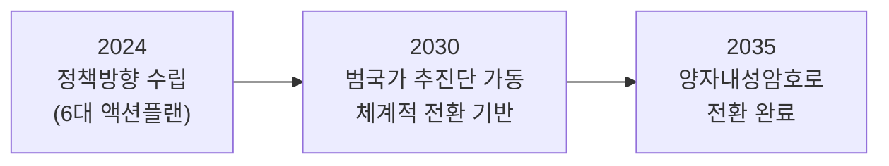
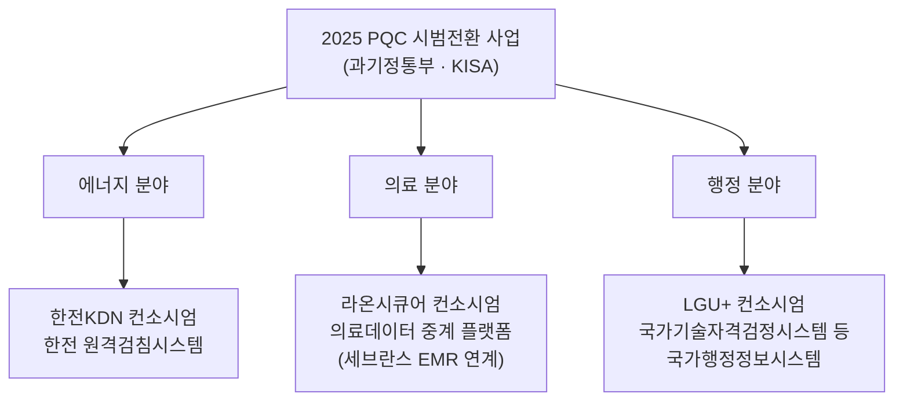
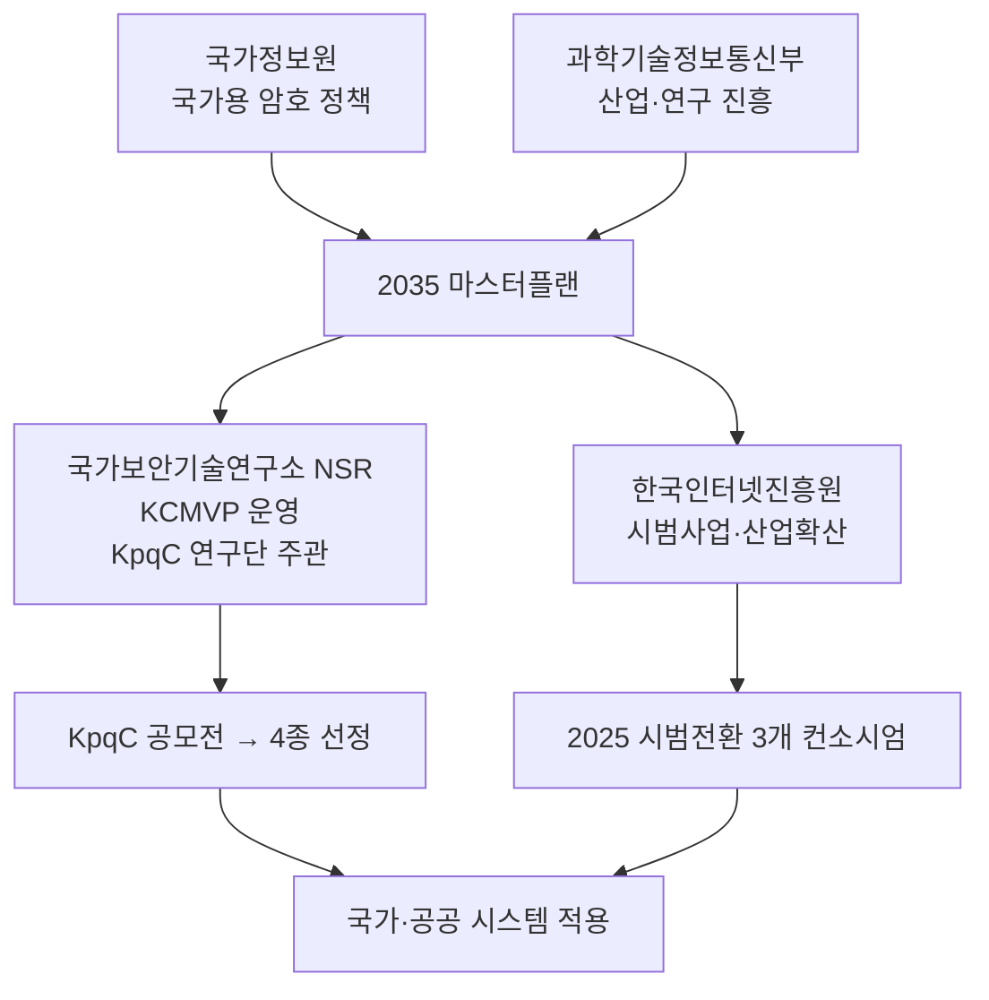

> **지난 시간 요약**: 4강에서 격자/LWE를, 4-2강에서 슈노르를 거쳐 ML-DSA의 골격까지 봤습니다. 이번 강의에서는 한국이 **왜, 어떻게, 어떤 일정으로** 양자내성암호 전환을 추진하는지를 사실 기반으로 정리합니다. 미국 NIST와는 별개로 한국이 **독자 알고리즘 공모전**까지 진행한 배경에는 분명한 이유가 있습니다.
{: .prompt-tip }

## 1. 왜 한국도 자체적으로 움직이는가

세 가지 이유가 있습니다.

1. **암호 주권**. 국가 핵심 시스템(국방·금융·행정)을 외국 표준에만 맡길 수 없습니다. 표준이 깨지거나, 외교적 변수가 생겼을 때 대응책이 필요합니다.
2. **국내 검증 역량**. 자체 공모전을 운영하면 학·연·산의 암호 인력과 분석 역량이 축적됩니다.
3. **KCMVP와의 연계**. 한국은 **국가용 암호모듈 검증제도(KCMVP)**를 운영합니다(국가보안기술연구소 NSR 주관). PQC 시대에도 이 검증 체계가 작동하려면, 국내에서 검증 가능한 PQC 알고리즘 풀이 있어야 합니다.

---

## 2. 2035 마스터플랜 — 국정원·과기정통부 공동 추진

### 2.1 발표 시점과 주체

- **2023년 7월 12일**: 국가정보원(NIS)과 과학기술정보통신부(과기정통부)가 **'양자내성암호 전환 마스터플랜'**을 공동 발표.
- 협력 기관: 국방부, 행정안전부, **국가보안기술연구소(NSR)**, **한국인터넷진흥원(KISA)**, 한국지역정보개발원.

### 2.2 3대 목표 (단계별)



| 시점 | 목표 |
|---|---|
| **~2024년** | 국가 중장기 암호체계 전환 정책방향 수립. 기술확보·제도정비·절차수립 등 **6대 분야 세부 액션플랜** 마련 |
| **~2030년** | **범국가 암호체계 전환 추진단** 설치, 체계적 전환을 위한 이행기반 마련 |
| **~2035년** | 기술·정책 지원체계 구축, 안전한 양자내성 암호체계 **전환 완료** |

### 2.3 왜 하필 2035년인가? — Mosca 부등식의 한국판

1강에서 본 $X + Y > Z$ 부등식이 그대로 적용됩니다.

- $Y$(전환 기간) ≈ 10년 (대형 국가 인프라 교체)
- $Z$(대형 양자컴퓨터 등장까지) ≈ 10~15년 (보수적 가정)
- $X$(보호 기간) — 국방·외교·의료 등 수십 년

이를 종합하면 **2025년경에 본격 착수해 2035년에 끝내는 일정**이 보수적인 안전선입니다. 마스터플랜의 2035 목표는 정확히 이 계산에서 나옵니다.

---

## 3. KpqC 공모전 — 한국형 PQC 알고리즘

### 3.1 배경

- **2021년 11월** KpqC(Korean Post-Quantum Cryptography) 공모전 시작.
- 주관: **양자내성암호연구단**(국가보안기술연구소 NSR 중심) + KISA.
- 목표: NIST와 별개로 **국내에서 설계·검증된** PQC 알고리즘 확보.
- 평가위원회: 국내외 암호학자.

### 3.2 진행 경과

| 시점 | 단계 | 결과 |
|---|---|---|
| 2021-11 | 공모 시작 | 총 16개 알고리즘 제출 |
| 2023-12 | **Round 1 결과** | **8개 선정** (격자 4, 코드 2, 대칭키 1, 다변수 1) |
| 2024 | Round 2 분석·평가 | 학계·산업계 공개 검증 |
| **2025-01** | **최종 선정 발표** | **4종 확정** |

### 3.3 최종 선정 4종 (2025년 1월)

| 분류 | 알고리즘 | 기반 수학 | 주요 제안자/소속 |
|---|---|---|---|
| **KEM/PKE** | **SMAUG-T** | 격자 (Module-LWE/LWR) | 서울대 천정희 교수 그룹 · 크립토랩 등 |
| **KEM/PKE** | **NTRU+** | 격자 (NTRU) | 상명대 박종환 교수 그룹 등 |
| **전자서명** | **HAETAE** | 격자 (Module-LWE) | 서울대 천정희 교수 그룹 등 |
| **전자서명** | **AIMer** | 대칭키 기반 (MPC-in-the-Head) | KAIST 이주영 교수 그룹 등 |

> **흥미로운 점**: 한국은 NIST가 격자에 무게중심을 둔 것과 달리, 전자서명 두 종에서 **격자(HAETAE) + 대칭키 기반(AIMer)**로 가정을 분산했습니다. NIST의 ML-DSA + SLH-DSA 조합과 비슷한 철학이지만, AIMer는 SLH-DSA와도 다른 새로운 접근(MPC-in-the-Head)을 씁니다.
{: .prompt-info }

### 3.4 KpqC와 NIST의 관계 — 대체가 아닌 보완

- NIST 표준(ML-KEM, ML-DSA 등)은 글로벌 호환성을 위해 **그대로 도입**됩니다(특히 인터넷·금융).
- KpqC 알고리즘은 **국가용 KCMVP 검증 대상**으로 활용 가능하며, 국가 핵심 인프라에서 NIST 표준과 **병행** 또는 **하이브리드**로 사용될 전망입니다.
- 즉 "NIST 대신 KpqC"가 아니라, **"NIST + KpqC"의 다중화**가 한국의 방향입니다.

---

## 4. 2025 시범전환 사업 — 마스터플랜의 첫 발

마스터플랜의 첫 실행 단계가 **2025년 양자내성암호 시범전환 지원사업**입니다.

### 4.1 개요

- 주관: 과학기술정보통신부 + **한국인터넷진흥원(KISA)**
- 예산: **27억 원** (3개 과제, 과제당 최대 9억 원)
- 기간: 계약 체결 ~ 2025년 11월 30일
- 발표: 2025년 2월 모집 공고 → 4월 착수

### 4.2 선정 컨소시엄 3곳



| 분야 | 주관 | 대상 시스템 | 의의 |
|---|---|---|---|
| **에너지** | 한전KDN 컨소시엄 | 한국전력 **원격검침시스템** | 가구별 검침 데이터(개인정보) 보호 |
| **의료** | 라온시큐어 컨소시엄 | **의료데이터 중계 온라인 플랫폼** (세브란스 등 EMR 연계) | 환자 의료기록(평생 수명) 보호 — HNDL 위협 직격 |
| **행정** | LG U+ 컨소시엄 | **국가기술자격검정시스템** 등 국가 행정정보시스템 | 국가 운영 시스템 PQC 적용 선례 |

### 4.3 왜 이 세 분야인가

세 분야 모두 **수명이 긴 비밀**을 다룹니다 — Mosca 부등식의 $X$ 가 큰 영역입니다.

- 의료기록: 환자 평생 (수십 년)
- 검침 데이터: 가구별 생활 패턴 (장기적 프로파일링 위험)
- 국가 자격·행정 데이터: 영구 보관 대상

즉 **HNDL 위협이 가장 큰 곳**부터 시작하는, 합리적인 우선순위입니다.

---

## 5. 한국 학계의 움직임 — KIISC와 APQC 2026

정부 정책뿐 아니라 **학계도 빠르게 움직이고 있습니다.** 한국정보보호학회(KIISC, Korea Institute of Information Security & Cryptology)와 국제사이버보안연구원(IRCS) 등이 PQC 관련 학술행사를 주도하고 있습니다.

### 5.1 APQC 2026 — 서울에서 열리는 아시아 PQC 포럼

**8th Asia Post-Quantum Cryptography Forum (APQC 2026)**가 한국에서 열립니다.

| 항목 | 내용 |
|---|---|
| 일정 | **2026년 7월 15-16일** |
| 장소 | 서울, 한국 (Hybrid: 현장 + 온라인) |
| 주최 | **IRCS** (국제사이버보안연구원) **& KIISC** (한국정보보호학회) |
| 후원 | 과학기술정보통신부(MSIT), 삼성SDS, SmartM2M |
| 공식 사이트 | <https://ircs.re.kr/apqc2026> |

확정된 주요 강연자(공개된 명단 일부):

- **Dustin Moody** (NIST, USA) — NIST PQC 표준화 주역
- **Mike Ounsworth** (Entrust, Canada)
- **Tanja Lange** (Eindhoven University of Technology, Netherlands) — 격자/코드 기반 암호 분석 권위자
- **Thomas Prest** (PQShield, UK) — Falcon 공동 설계자
- **Jintai Ding** (Xi'an Jiaotong-Liverpool University, China) — 다변수 기반 PQC
- **Tsuyoshi Takagi** (University of Tokyo, Japan), **Kouichi Sakurai** (Kyushu University, Japan), **Bo-Yin Yang** (Academia Sinica, Taiwan), **Lam Kwok Yan** (NTU, Singapore)
- 국내: **Kwangjo Kim** (IRCS, KAIST 명예교수, General Chair), **Kangsoo Song** (KISA), **Jihoon Cho** (Samsung SDS), **Yousung Kang** (ETRI)

포럼 주요 주제:

- FIPS 203/204/205 표준화 후속 동향
- PQC 알고리즘과 구현 최신 연구
- 5G/6G, IoT, 블록체인, 보안 인프라에서의 PQC 적용
- 양자안전 시스템으로의 마이그레이션 전략
- 국가·지역별 표준화 노력 비교

조직위원회에도 KAIST·서울대·KISA·삼성SDS·ETRI·세종대·국민대·고려대·강남대·한성대 등 **국내 PQC 연구의 거의 모든 주요 거점**이 참여합니다.

> **왜 한국에서 열리는가**: 위의 마스터플랜·KpqC·시범사업과 같은 정부 차원의 적극적 추진이 학계 신뢰로 이어진 결과입니다. 한국이 아시아 PQC 논의의 **허브** 역할을 하겠다는 선언으로 읽힙니다. 학생·연구자·산업 종사자 모두 참가 가능한 하이브리드 행사이므로, PQC를 공부하는 분이라면 **반드시 일정을 챙겨두실 만**합니다.
{: .prompt-info }

### 5.2 그 외 한국 학술 행사

- **KIISC 동·하계 학술대회** — 매년 PQC 세션 운영. 최근에는 KpqC 알고리즘 분석 발표가 다수.
- **CHES Asia 위성 워크숍** — 임베디드/하드웨어 PQC 구현.
- **양자내성암호연구단(KpqC) 워크숍** — 공모전 알고리즘 분석 결과 공유.

이런 행사들이 누적되면서, 한국은 **PQC 학술 인프라**에서도 빠르게 자리잡고 있습니다.

---

## 6. 한국 PQC 생태계의 구조



| 주체 | 역할 |
|---|---|
| **국가정보원 (NIS)** | 국가용 암호 정책 총괄, 마스터플랜 공동 추진 |
| **과학기술정보통신부 (MSIT)** | 산업·연구 진흥, 시범사업 정책 주도 |
| **국가보안기술연구소 (NSR)** | KCMVP 운영, KpqC 연구단 주관, 알고리즘 검증 |
| **한국인터넷진흥원 (KISA)** | 시범사업 운영, 표준 보급, 민간 확산 |
| **국방부 / 행안부 / 지역정보개발원** | 각 부문 실무 협의, 적용 |

---

## 7. 무엇을 기억해야 하나

- 한국은 **2035년까지 양자내성암호로의 전환 완료**를 국가 목표로 명시했습니다(2023-07 발표).
- **2030년까지 전환 추진단 가동, 2024년까지 6대 액션플랜 수립**의 단계별 일정이 잡혔습니다.
- KpqC 공모전을 통해 **SMAUG-T, NTRU+, HAETAE, AIMer** 4종이 한국형 PQC로 최종 선정됐습니다(2025-01).
- **2025년 시범전환 사업**은 에너지(한전KDN)·의료(라온시큐어)·행정(LGU+)에서 본격 착수됐습니다.
- 한국의 전략은 **NIST 대체가 아니라 다중화**입니다 — NIST 표준 + KpqC + 하이브리드.

---

## 8. 실습: 한국의 보호 대상에 Mosca 부등식 적용해보기

마스터플랜의 정당성을 숫자로 확인해봅시다.

```python
# mosca_korea.py
# 한국의 주요 보호 대상에 대해 X+Y vs Z 비교
scenarios = [
    # (분야, 보호기간 X(년), 전환기간 Y(년), 양자컴퓨터 도래까지 Z(년))
    ("의료기록 (평생)",       70, 10, 15),
    ("국방·외교 기밀",         50, 10, 15),
    ("부동산 등기·자격",       30, 10, 15),
    ("금융 거래기록",          15, 10, 15),
    ("일반 웹 트래픽",          5, 10, 15),
]

print(f"{'분야':<22}  X   Y   Z   X+Y    위험?")
print("-" * 60)
for name, X, Y, Z in scenarios:
    risky = (X + Y) > Z
    mark = "위험" if risky else "안전"
    print(f"{name:<22} {X:>3} {Y:>3} {Z:>3}  {X+Y:>4}    {mark}")

print()
print("→ 보호기간이 긴 분야일수록 X+Y > Z 가 되어 '지금 시작해야' 합니다.")
print("→ 그래서 2025 시범사업이 '의료·에너지(검침)·행정' 분야부터 시작된 것입니다.")
```

기대 출력:

```
분야                     X   Y   Z   X+Y    위험?
------------------------------------------------------------
의료기록 (평생)           70  10  15    80    위험
국방·외교 기밀             50  10  15    60    위험
부동산 등기·자격           30  10  15    40    위험
금융 거래기록              15  10  15    25    위험
일반 웹 트래픽              5  10  15    15    안전
```

수명이 긴 비밀일수록 부등식이 깨집니다. 한국이 의료·에너지·행정부터 시범사업을 시작한 것은 **이 부등식이 가장 빨리 깨지는 영역**부터 손대는, 합리적인 선택입니다.

---

## 9. 정리

- 한국은 **2023년 7월** 국정원·과기정통부 공동 **2035 마스터플랜**을 수립했습니다.
- **2025년 1월 KpqC 최종 선정** — SMAUG-T, NTRU+ (KEM), HAETAE, AIMer (서명).
- **2025년 4월 시범전환 사업 착수** — 한전KDN(에너지), 라온시큐어(의료), LGU+(행정).
- 학계도 발맞춰 움직이고 있으며, **2026년 7월 서울에서 APQC 2026 국제 포럼**이 KIISC·IRCS 주최로 개최됩니다.
- 전략은 **NIST와 KpqC의 다중화·하이브리드**.
- Mosca 부등식이 정확히 한국의 우선순위(의료·에너지·행정 → 금융 → 일반)와 맞아떨어집니다.

다음(마지막) 강의에서는 이 모든 것을 **개인·조직 차원에서 어떻게 적용**하는지 — 하이브리드 모드, 마이그레이션 단계, 그리고 ML-DSA 전자서명 실습으로 시리즈를 마무리합니다.

> **다음 강의 예고 (6강)**: 하이브리드 TLS, crypto-agility, ML-DSA 전자서명 실습, 그리고 시리즈 총정리.
{: .prompt-info }

---

### 참고 자료
- 정보통신신문, *"2035년까지 국내 암호체계 양자내성암호로 전환"* (2023-07): <https://www.koit.co.kr/news/articleView.html?idxno=114989>
- 전자신문, *정부, 양자내성암호 전환 위한 마스터플랜 수립한다* (2023-07-12): <https://www.etnews.com/20230712000182>
- 데일리시큐, *크립토랩, 국정원 양자내성암호 국가공모전(KpqC) 최종 알고리즘 선정* (2025-01): <https://www.dailysecu.com/news/articleView.html?idxno=163196>
- ZDNet Korea, *양자내성암호 국가공모전 1라운드 결과 8편 선정* (2023-12): <https://zdnet.co.kr/view/?no=20231207105454>
- 디지털데일리, *국가암호체계 대전환 첫 걸음… 정부 양자내성암호 시범전환 사업 추진* (2025-02-27): <https://m.ddaily.co.kr/page/view/2025022711131789605>
- 디지털타임스, *에너지·의료·행정분야 양자내성암호 시범전환 착수* (2025-04-14): <https://www.dt.co.kr/contents.html?article_no=2025041402109931081003>
- KISA, *2025년 양자내성암호 시범전환 지원사업 공고*: <https://www.kisa.or.kr/401/form?postSeq=3424>
- KISA, *양자내성암호 안내 페이지*: <https://seed.kisa.or.kr/kisa/ngc/pqc.do>
- 양자내성암호연구단 KpqC: <https://kpqc.or.kr>
- **APQC 2026 (8th Asia Post-Quantum Cryptography Forum, 2026-07-15~16, Seoul, IRCS·KIISC 주최)**: <https://ircs.re.kr/apqc2026>
- 한국정보보호학회 KIISC: <https://www.kiisc.or.kr>
- (참고 영상) *Post-quantum cryptography: Security after Shor's algorithm*: <https://www.youtube.com/watch?v=_C5dkUiiQnw>
- (참고 영상) *Lattice-based cryptography: The tricky math of dots*: <https://www.youtube.com/watch?v=QDdOoYdb748>
