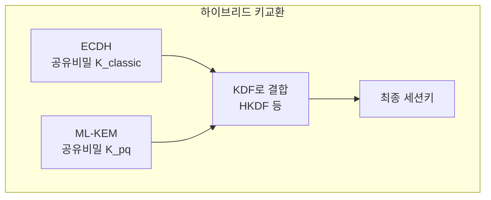
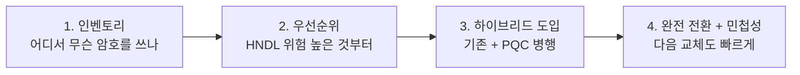
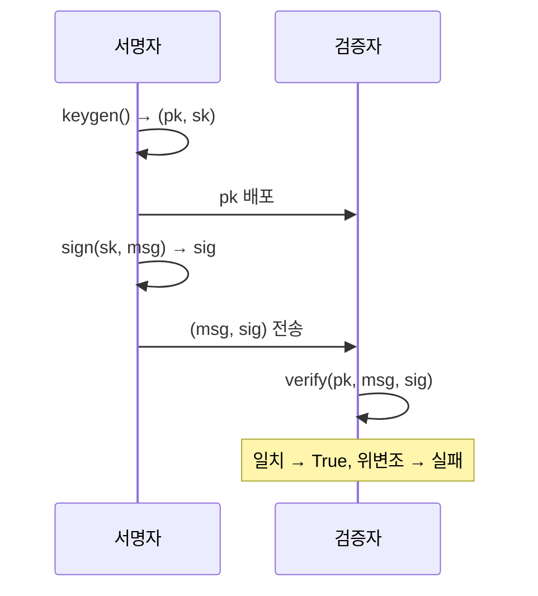

> **지난 시간 요약**: 한국이 2035년 PQC 전환 완료를 목표로 마스터플랜·KpqC·시범사업을 추진 중임을 봤습니다. 이번 마지막 강의에서는 **실제 시스템에 어떻게 적용**하는지 — 하이브리드, 마이그레이션 단계, crypto-agility — 를 정리하고, ML-DSA 전자서명을 직접 만들며 시리즈를 마무리합니다.
{: .prompt-tip }

## 1. 왜 곧장 PQC로 안 갈아타고 하이브리드부터인가

NIST FIPS 표준이 확정됐지만, 업계는 곧장 RSA·ECC를 폐기하지 않습니다. 거의 모두 **하이브리드(hybrid)** 모드를 먼저 거칩니다.

> **하이브리드 = 기존 알고리즘 + PQC 를 동시에 사용**
> 키 교환에서 ECDH와 ML-KEM이 각각 공유비밀을 만들고, 두 비밀을 KDF로 결합해 **최종 세션키**를 만듭니다.



이렇게 하는 이유는 두 약점을 서로 메우기 위해서입니다.

| 위협 시나리오 | 결과 |
|---|---|
| 양자컴퓨터가 ECDH를 깬다 | ML-KEM이 막아줌 → 세션키 안전 |
| 격자 기반 ML-KEM에 결함 발견 | ECDH가 막아줌 → 세션키 안전 |
| 둘 다 깨진다 | 불가능에 가까움 |

**둘 중 하나만 안전해도 전체가 안전합니다.** 검증 역사가 짧은 PQC를 단독 도입하기 부담스러운 전환기에 가장 합리적인 선택입니다.

### 1.1 이미 실전 가동 중

- **Chrome 124** (2024-04): TLS 1.3에서 `X25519MLKEM768` 하이브리드 키교환을 기본 활성화.
- **Cloudflare, Google, Apple**: 이미 일부 트래픽에서 PQC 하이브리드 핸드셰이크 사용.
- **AWS KMS, Signal Messenger**: PQC 또는 하이브리드 모드 일부 도입.

즉 **여러분 브라우저는 이미 PQC를 일부 쓰고 있을 수 있습니다.** (확인 방법은 실습에서.)

---

## 2. 마이그레이션 — 어떻게 옮길까

조직이 PQC로 전환하는 표준적인 4단계입니다.



| 단계 | 할 일 | 실무 함정 |
|---|---|---|
| 1. **인벤토리** | 시스템 전체의 암호 알고리즘·키·인증서 목록화 | "어디에 RSA가 박혀있는지조차 모름"이 가장 흔한 출발점 |
| 2. **우선순위** | Mosca 부등식의 $X+Y > Z$ 가 깨지는 자산부터 | 의료·국방·외교 → 금융 → 일반 웹 순 |
| 3. **하이브리드** | 기존 + PQC 병행 적용 | 인증서 체인 크기 증가, 핸드셰이크 패킷 증가 — MTU 주의 |
| 4. **민첩성** | 알고리즘이 코드에 박혀있지 않게 추상화 | "다음에 또 바꿀 일"이 반드시 옵니다 |

### 2.1 핵심 원칙: Crypto-Agility (암호 민첩성)

> **알고리즘을 코드에 하드코딩하지 말고, 언제든 교체 가능하게 만들 것.**

PQC 전환을 한 번 겪고 나면, **이 민첩성 자체가 가장 큰 자산**입니다. 미국 NSA·NIST, 유럽 ENISA, 한국 마스터플랜이 공통으로 강조하는 원칙입니다. 추상 인터페이스로 감싸고, 알고리즘 식별자를 설정으로 분리하고, 인증서·키 저장소를 다중 알고리즘에 대비시키는 것이 핵심입니다.

### 2.2 한국 마스터플랜과 매핑

5강에서 본 한국 일정에 이 4단계를 겹쳐보면:

| 한국 마스터플랜 단계 | 시점 | 일반 마이그레이션 단계 |
|---|---|---|
| 6대 액션플랜 수립 | ~2024 | **1. 인벤토리 + 정책방향** |
| 추진단 가동, 시범사업 | ~2030 | **2 + 3. 우선순위 + 하이브리드** |
| 전환 완료 | ~2035 | **4. 완전 전환 + 민첩성 체계** |

2025년 의료·에너지·행정 시범사업은 정확히 **2 + 3단계**에 해당합니다.

---

## 3. 실습 1: 우리 PC가 이미 PQC를 쓰고 있는지 확인

Chrome에서 다음을 시도해봅시다.

1. Chrome 124+ 사용 중인지 확인 (`chrome://version`).
2. 주소창에 `chrome://flags` 입력 → "TLS 1.3 hybridized Kyber" 검색 → Enabled 확인 (기본 활성).
3. Cloudflare PQC 테스트 페이지 방문: `https://pq.cloudflareresearch.com/`
   - 페이지가 사용한 키교환 알고리즘을 보여줍니다. `X25519MLKEM768` 이면 PQC 하이브리드 사용 중.

이미 우리 브라우저가 PQC를 쓰고 있을 가능성이 높습니다. PQC는 "미래의 기술"이 아니라 **이미 일부 트래픽에서 가동 중인 기술**입니다.

---

## 4. 실습 2: ML-DSA로 전자서명 만들기

키교환은 2·3강에서 했으니, 이번엔 **ML-DSA 전자서명**입니다.

```powershell
.\pqc-lab\Scripts\Activate.ps1
pip install quantcrypt
```

```python
# ml_dsa_sign.py
from quantcrypt.dss import MLDSA_65

dss = MLDSA_65()

# 1) 서명자: 키 쌍 생성
public_key, secret_key = dss.keygen()

# 2) 메시지 작성 및 서명
message = b"PQC 6 gang: This document is authentic and not tampered with."
signature = dss.sign(secret_key, message)

# 3) 검증자: 공개키로 서명 검증
ok = dss.verify(public_key, message, signature)
print(f"서명 크기 : {len(signature)} B")
print(f"공개키    : {len(public_key)} B")
print(f"정상 검증 : {ok}")

# 4) 위변조 시도: 한 글자만 바꿔도 검증 실패해야 함
tampered = message.replace(b"authentic", b"AUTHENTIC")
try:
    bad = dss.verify(public_key, tampered, signature)
    print(f"위변조 검증: {bad}  (실패해야 정상)")
except Exception as ex:
    print(f"위변조 검증: 실패 (예외) → {type(ex).__name__}")
```

기대 출력:

```
서명 크기 : 3309 B
공개키    : 1952 B
정상 검증 : True
위변조 검증: 실패 (예외) → ...
```

확인할 점:

- 정상 서명 → **검증 성공**.
- **한 글자만 바꿔도 → 검증 실패**. 무결성과 부인방지 동시 달성.
- 서명 크기 ~3.3 KB. RSA-3072 서명(~0.4 KB)의 약 8배. PQC의 크기 대가가 여기서도 보입니다.



---

## 5. 실습 3: 하이브리드 키 결합 구현 흉내내기

실제 TLS의 정확한 결합 방식은 아니지만, **하이브리드 KDF**의 직관을 잡아봅시다.

```python
# hybrid_kdf.py
import os, hashlib
from cryptography.hazmat.primitives.asymmetric import ec
from cryptography.hazmat.primitives.asymmetric.ec import ECDH
from quantcrypt.kem import MLKEM_768

# --- 레거시 측: ECDH X25519 대신 P-256 사용 ---
classic_priv_b = ec.generate_private_key(ec.SECP256R1())
classic_priv_a = ec.generate_private_key(ec.SECP256R1())
classic_shared_a = classic_priv_a.exchange(ECDH(), classic_priv_b.public_key())
classic_shared_b = classic_priv_b.exchange(ECDH(), classic_priv_a.public_key())
assert classic_shared_a == classic_shared_b

# --- PQC 측: ML-KEM-768 ---
kem = MLKEM_768()
pk_b, sk_b = kem.keygen()
ct, pq_shared_a = kem.encaps(pk_b)
pq_shared_b = kem.decaps(sk_b, ct)
assert pq_shared_a == pq_shared_b

# --- 두 비밀을 결합: 단순화한 HKDF (SHA-256 기반) ---
def hkdf_combine(*secrets, info=b"hybrid-session-key", length=32):
    combined = b"".join(secrets)
    return hashlib.sha256(combined + info).digest()[:length]

session_key_a = hkdf_combine(classic_shared_a, pq_shared_a)
session_key_b = hkdf_combine(classic_shared_b, pq_shared_b)

print(f"ECDH 공유비밀     : {len(classic_shared_a)} B")
print(f"ML-KEM 공유비밀   : {len(pq_shared_a)} B")
print(f"최종 세션키       : {len(session_key_a)} B (AES-256 키로 사용)")
print(f"양쪽 세션키 일치  : {session_key_a == session_key_b}")
print(f"세션키 (hex)      : {session_key_a.hex()}")
```

여기서 만든 `session_key`는 **ECDH가 깨져도, ML-KEM이 깨져도 — 둘 다 깨지지 않는 한 안전**합니다. 이것이 하이브리드의 핵심입니다.

---

## 6. 시리즈 총정리

6강의 흐름을 한 장으로 압축합니다.

| 강 | 질문 | 핵심 답 |
|---|---|---|
| **1강** | 왜 등장했나? | DH(1976)→RSA→Shor(1994)→NIST 공모(2016)→**FIPS 표준(2024-08-13)**. 50년 두 가정이 동시에 위협받음 |
| **2강** | 레거시와 무엇이 다른가? | 가정의 **다양성**, 보통 **속도 우위**, **크기 열위**, 검증 역사 짧음. 답은 하이브리드 |
| **3강** | 무엇이 표준인가? | **FIPS 203 ML-KEM**, **204 ML-DSA**, **205 SLH-DSA**, 206 Falcon, HQC(코드기반 백업) |
| **4강** | 어떤 수학? | 격자의 **SVP/CVP**, **LWE**(오차 섞기), Module-LWE로 Kyber/Dilithium |
| **5강** | 한국은? | **2035 마스터플랜**, **KpqC 4종**(SMAUG-T/NTRU+/HAETAE/AIMer), **2025 시범사업**(에너지·의료·행정) |
| **6강** | 어떻게 적용? | **하이브리드 → crypto-agility → 완전 전환**의 4단계 |

### 핵심 메시지 세 가지

1. **PQC는 양자컴퓨터가 아니라 우리 PC에서 돌아가는 고전 알고리즘**입니다. 진입장벽이 낮습니다.
2. 양자컴퓨터 완성을 기다릴 게 아니라 **HNDL과 Mosca 부등식** 때문에 지금 시작해야 합니다.
3. **다양성과 민첩성**(crypto-agility)이 안전의 열쇠입니다. 격자 + 해시 + 코드의 분산, 그리고 언제든 알고리즘을 교체할 수 있는 구조.

---

## 7. 더 가고 싶다면

- **표준 원문**: NIST FIPS 203/204/205 PDF (csrc.nist.gov).
- **실전 프로토콜**: OpenSSL 3.x + `oqs-provider` 로 PQC TLS 핸드셰이크를 Wireshark로 들여다보기.
- **벤치마크**: 각 파라미터 세트(512/768/1024)의 키·서명 크기와 속도 측정.
- **한국 표준 추적**: KISA `seed.kisa.or.kr/kisa/ngc/pqc.do`, 양자내성암호연구단 `kpqc.or.kr`.
- **정형 검증**: ProVerif·Tamarin으로 PQC 프로토콜 안전성 증명, HACL\*/libcrux의 검증된 구현 살펴보기.

> PQC는 "언젠가의 일"이 아니라 **이미 시작된 전환**입니다. 미국은 FIPS로, 한국은 마스터플랜과 시범사업으로, 브라우저는 하이브리드 키교환으로. 이 시리즈로 첫 감각을 잡으셨길 바랍니다. 수고하셨습니다.
{: .prompt-tip }

---

### 참고 자료
- Chrome PQC roll-out: <https://blog.chromium.org/2024/05/advancing-our-amazing-bet-on-asymmetric.html>
- Cloudflare PQC 테스트: <https://pq.cloudflareresearch.com/>
- NIST CSRC: <https://csrc.nist.gov/projects/post-quantum-cryptography>
- 한국 KISA PQC 안내: <https://seed.kisa.or.kr/kisa/ngc/pqc.do>
- 양자내성암호연구단 KpqC: <https://kpqc.or.kr>
