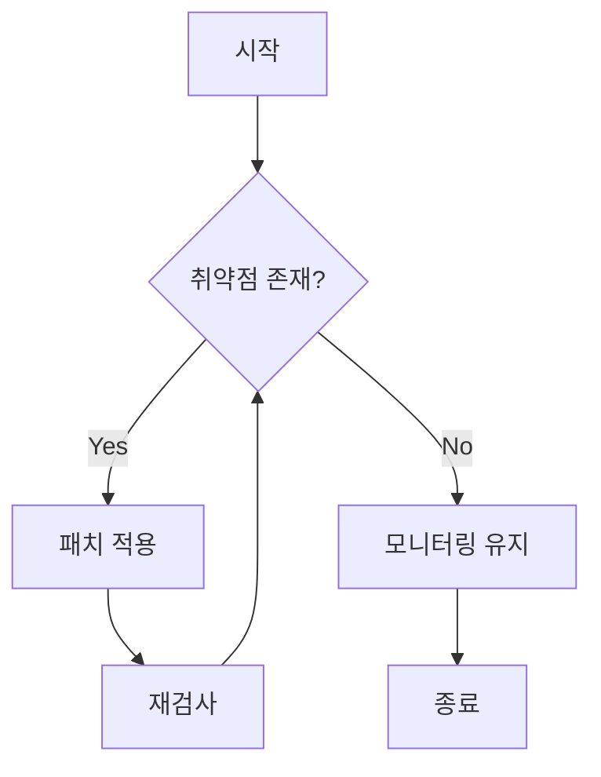
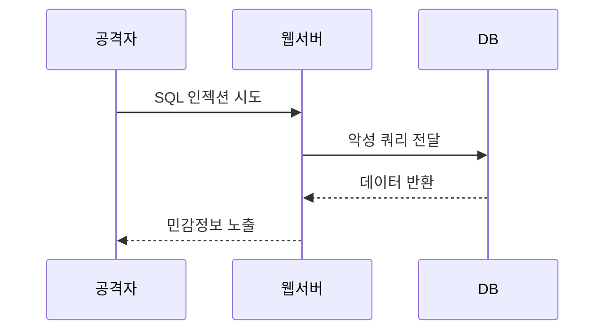
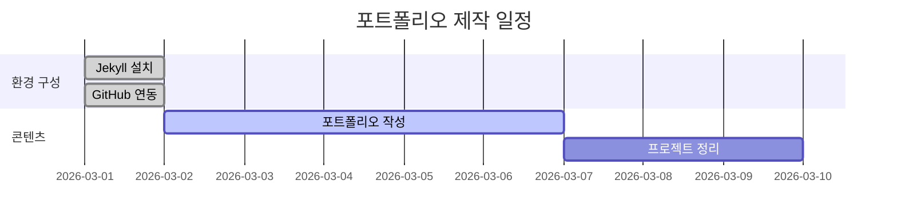
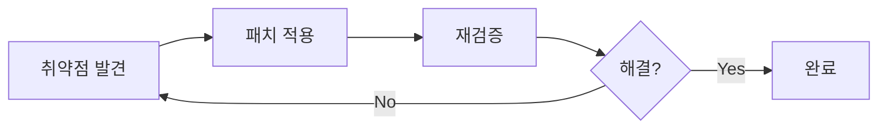

## Chirpy 테마 전용 고급 기능

기본 Markdown 문법 외에 Chirpy 테마에서만 사용 가능한 기능들을 정리함.  
포트폴리오를 더 풍부하게 표현할 수 있음.

---

## 1. 프롬프트 (Prompt) — Chirpy 전용 ⭐

> 일반 인용문과 달리 **색상이 있는 강조 박스**로 표시됨.

```markdown
> 팁 내용
{: .prompt-tip }

> 정보 내용
{: .prompt-info }

> 주의 내용
{: .prompt-warning }

> 위험 내용
{: .prompt-danger }
```

**결과:**

> 💡 이것은 **팁(tip)** 박스임. 유용한 정보를 강조할 때 사용. {: .prompt-tip }

> ℹ️ 이것은 **정보(info)** 박스임. 추가 설명이 필요할 때 사용. {: .prompt-info }

> ⚠️ 이것은 **경고(warning)** 박스임. 주의사항을 알릴 때 사용. {: .prompt-warning }

> 🚨 이것은 **위험(danger)** 박스임. 절대 하면 안 되는 것을 표시할 때 사용. {: .prompt-danger }

> 💡 포트폴리오 활용 예시:  
> 보안 실습에서 위험한 명령어는 `danger`, 주의사항은 `warning`으로 표시하면 전문성이 올라감. {: .prompt-tip }

---

## 2. 파일 경로 표시 (Filepath) — Chirpy 전용

```markdown
`/etc/passwd`{: .filepath }
`C:\work\Obsidian\sbaek100.github.io`{: .filepath }
`_config.yml`{: .filepath }
```

**결과:**

`/etc/passwd`{: .filepath }  
`_config.yml`{: .filepath }

---

## 3. 코드 블록 고급 기능

### 파일명 지정

````markdown
```python
# 파일명을 표시할 수 있음
print("Hello World")
```
{: file="hello.py" }
````

**결과:**

```python
print("Hello World")
```

{: file="hello.py" }

### 줄 번호 + 특정 줄 강조

````markdown
```python
def scan_ports(host):        # 일반 줄
    for port in range(1, 1025):
        sock = socket.socket()
        result = sock.connect_ex((host, port))
        if result == 0:
            print(f"Port {port} is open")
```
````

---

## 4. 각주 (Footnote)

```markdown
보안 취약점[^1]은 반드시 패치해야 함.
CVSS[^2] 점수가 높을수록 위험도가 높음.

[^1]: 소프트웨어나 시스템의 약점으로 공격자가 악용할 수 있는 결함.
[^2]: Common Vulnerability Scoring System, 취약점 심각도 평가 지표.
```

**결과:**

보안 취약점[^1]은 반드시 패치해야 함.  
CVSS[^2] 점수가 높을수록 위험도가 높음.

[^1]: 소프트웨어나 시스템의 약점으로 공격자가 악용할 수 있는 결함. [^2]: Common Vulnerability Scoring System, 취약점 심각도 평가 지표.

---

## 5. 수식 (Mathematics) — MathJax

`_config.yml`에서 `math: true` 설정 후 사용 가능함.

```markdown
# 인라인 수식
$ax^2 + bx + c = 0$

# 블록 수식
$$
x = {-b \pm \sqrt{b^2-4ac} \over 2a}
$$
```

**결과:**

인라인: $ax^2 + bx + c = 0$

블록: $$ x = {-b \pm \sqrt{b^2-4ac} \over 2a} $$

> 💡 보안 연구에서 암호학 수식이나 통계 수식을 표현할 때 유용함. {: .prompt-tip }

---

## 6. Mermaid 다이어그램 — Chirpy 전용 ⭐

`_config.yml`에서 `mermaid: true` 설정 후 사용 가능함.

### 순서도 (Flowchart)

````markdown

````

### 시퀀스 다이어그램

````markdown

````

### 간트 차트 (프로젝트 일정)

````markdown

````

---

## 7. 이미지 고급 옵션 — Chirpy 전용

### 크기 지정

```markdown
{: width="700" height="400" }
```

### 정렬

```markdown
# 왼쪽 정렬
{: .left }

# 오른쪽 정렬
{: .right }

# 그림자 효과
{: .shadow }
```

### 캡션 (이미지 아래 설명)

```markdown

_이미지 아래에 표시될 캡션 텍스트_
```

### 다크/라이트 모드 전환

```markdown
{: .light }
{: .dark }
```

---

## 8. 설명 목록 (Description List)

```markdown
Nmap
: 네트워크 스캐닝 도구. 포트 스캔 및 서비스 탐지에 사용.

Burp Suite
: 웹 취약점 분석 도구. 프록시 기반으로 HTTP 트래픽을 분석.

DVWA
: Damn Vulnerable Web Application. 웹 해킹 실습용 취약한 웹앱.
```

**결과:**

Nmap : 네트워크 스캐닝 도구. 포트 스캔 및 서비스 탐지에 사용.

Burp Suite : 웹 취약점 분석 도구. 프록시 기반으로 HTTP 트래픽을 분석.

DVWA : Damn Vulnerable Web Application. 웹 해킹 실습용 취약한 웹앱.

---

## 9. TOC (목차) 제어

```yaml
# 포스트 전체 TOC 비활성화
---
toc: false
---

# 특정 제목을 TOC에서 제외
## 이 제목은 TOC에 포함됨

## 이 제목은 TOC에서 제외됨
{: data-toc-skip="" }
```

---

## 10. 포트폴리오 실전 템플릿 (Chirpy 고급 버전)

````markdown
---
title: "웹 취약점 분석 프로젝트"
date: 2026-03-01 12:00:00 +0900
categories: [Portfolio, 보안프로젝트]
tags: [DVWA, Burp Suite, SQL인젝션, XSS]
toc: true
---

## 프로젝트 개요

DVWA 환경에서 SQL 인젝션 및 XSS 취약점을 분석하고 대응 방안을 도출함.

> ⚠️ 본 실습은 허가된 환경에서만 수행해야 함. 무단 침투 시도는 불법임.
{: .prompt-warning }

---

## 실습 환경

| 구분 | 도구 | 버전 |
|------|------|------|
| 공격 OS | Kali Linux | 2024.1 |
| 대상 앱 | DVWA | 1.10 |
| 프록시 | Burp Suite | Community |

---

## 취약점 분석

### SQL 인젝션

**공격 페이로드:**

```sql
' OR '1'='1
' UNION SELECT user, password FROM users--
````

{: file="payload.txt" }

> 🚨 실제 서비스에 절대 시도하지 말 것. {: .prompt-danger }

**대응 방안:**

```python
# 준비된 구문(Prepared Statement) 사용
cursor.execute("SELECT * FROM users WHERE id = %s", (user_id,))
```

---

## 결론



```

---

## 참고 자료

- [Chirpy 공식 Typography 가이드](https://chirpy.cotes.page/posts/text-and-typography/)
- [Chirpy 포스트 작성법](https://chirpy.cotes.page/posts/write-a-new-post/)
- [Mermaid 다이어그램 문법](https://mermaid.js.org/)
- [MathJax 수식 문법](https://www.mathjax.org/)
```