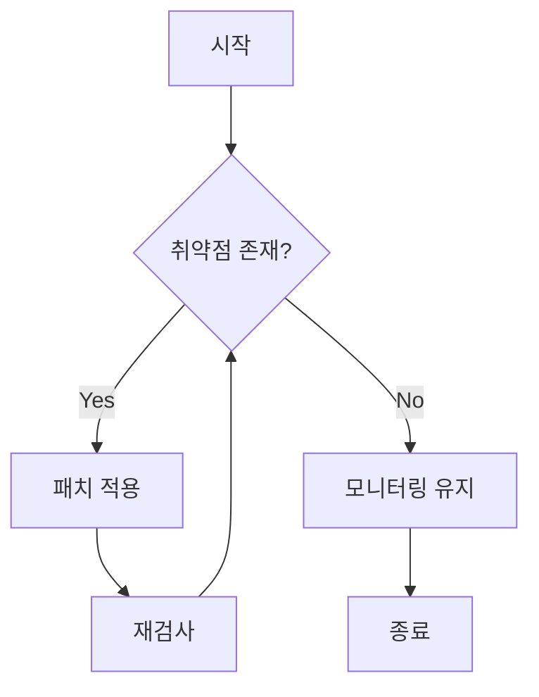
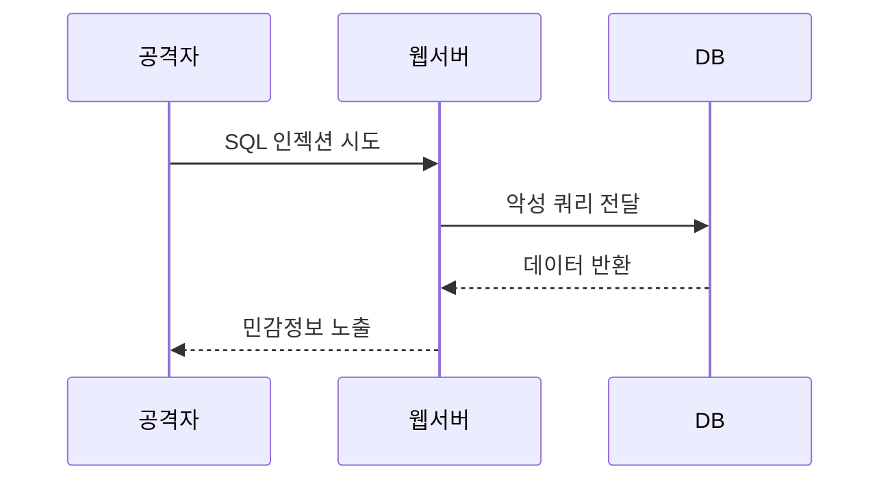
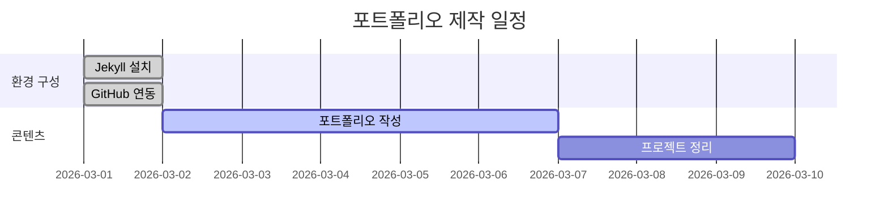

## 1. 파일 이름 규칙

`_posts/` 폴더에 아래 형식으로 저장해야 함.

```
YYYY-MM-DD-제목.md
```

**예시:**

```
_posts/2026-03-01-sql-injection-lab.md
_posts/2026-03-01-network-security-basics.md
```

> ⚠️ 확장자는 반드시 `.md` 또는 `.markdown` 이어야 함. 
{: .prompt-warning }

---

## 2. Front Matter 전체 옵션

```yaml
---
title: "포스트 제목"
date: 2026-03-01 12:00:00 +0900   # 타임존 필수
categories: [상위카테고리, 하위카테고리]  # 최대 2개
tags: [태그1, 태그2]               # 반드시 소문자, 개수 제한 없음
toc: true                          # 목차 표시 여부
math: true                         # 수식 활성화 (mathjax.js 필요)
mermaid: true                      # 다이어그램 활성화
pin: false                         # 홈 화면 상단 고정
comments: true                     # 댓글 활성화
description: "포스트 요약문."       # 홈/RSS에 표시
image:
  path: /assets/img/posts/preview.png
  alt: 미리보기 이미지 설명
---
```

> `math: true` 사용 시 `assets/js/data/mathjax.js` 파일이 반드시 있어야 함.
{: .prompt-tip }

---

## 3. 제목 (Heading)

```markdown
# H1 제목 (가장 큼 - 포스트 제목으로 자동 사용)
## H2 제목 (섹션 구분)
### H3 제목 (소제목)
#### H4 제목 (세부 항목)
```


> 포스트 본문에서는 `##`부터 사용 권장. `#`은 포스트 제목과 겹침.
{: .prompt-tip }

---

## 4. 텍스트 강조

```markdown
**굵게**
*기울임*
~~취소선~~
**_굵게 + 기울임_**
`인라인 코드`
```

**결과:** **굵게** / _기울임_ / ~~취소선~~ / **_굵게 + 기울임_** / `인라인 코드`

---

## 5. 목록

### 순서 없는 목록

```markdown
- 항목 1
- 항목 2
  - 하위 항목 (스페이스 2칸)
  - 하위 항목
```

- 항목 1
- 항목 2
  - 하위 항목 (스페이스 2칸)
  - 하위 항목


### 순서 있는 목록

```markdown
1. 첫 번째
2. 두 번째
3. 세 번째
```

1. 첫 번째
2. 두 번째
3. 세 번째

### 체크리스트

```markdown
- [x] 완료된 항목
- [ ] 미완료 항목
- [x] GitHub Pages 설정
- [ ] 포트폴리오 작성
```

- [x] 완료된 항목
- [ ] 미완료 항목
- [x] GitHub Pages 설정
- [ ] 포트폴리오 작성

### 설명 목록 (Description List)

```markdown
Nmap
: 네트워크 스캐닝 도구. 포트 스캔 및 서비스 탐지에 사용.

Burp Suite
: 웹 취약점 분석 도구. HTTP 트래픽을 프록시로 분석.

DVWA
: 웹 해킹 실습용 취약한 웹 애플리케이션.
```

Nmap
: 네트워크 스캐닝 도구. 포트 스캔 및 서비스 탐지에 사용.

Burp Suite
: 웹 취약점 분석 도구. HTTP 트래픽을 프록시로 분석.

DVWA
: 웹 해킹 실습용 취약한 웹 애플리케이션.


---

## 6. 인용문 & 프롬프트

### 기본 인용문

```markdown
> 이것은 기본 인용문임.
```

### Chirpy 전용 프롬프트 ⭐

```markdown
> 팁 내용을 여기에 작성.
{: .prompt-tip }

> 정보 내용을 여기에 작성.
{: .prompt-info }

> 주의 내용을 여기에 작성.
{: .prompt-warning }

> 위험 내용을 여기에 작성.
{: .prompt-danger }
```

**결과:**

> 팁 내용을 여기에 작성.
{: .prompt-tip }

 
> 정보 내용을 여기에 작성.
{: .prompt-info }


> 주의 내용을 여기에 작성.
{: .prompt-warning }


> 위험 내용을 여기에 작성.
{: .prompt-danger }

---

## 7. 표 (Table)

```markdown
| 항목 | 내용 | 비고 |
|------|------|------|
| Kali Linux | 모의해킹 OS | 무료 |
| Burp Suite | 웹 분석 도구 | Community 무료 |
| DVWA | 실습 환경 | 오픈소스 |
```

**결과:**

|항목|내용|비고|
|---|---|---|
|Kali Linux|모의해킹 OS|무료|
|Burp Suite|웹 분석 도구|Community 무료|
|DVWA|실습 환경|오픈소스|

### 정렬 옵션

```markdown
| 왼쪽 정렬 | 가운데 정렬 | 오른쪽 정렬 |
|:----------|:-----------:|------------:|
| 내용 | 내용 | 내용 |
```

| 왼쪽 정렬 | 가운데 정렬 | 오른쪽 정렬 |
|:----------|:-----------:|------------:|
| 내용 | 내용 | 내용 |


---

## 8. 링크 & 각주

### 링크

```markdown
[GitHub](https://github.com/sbaek100)
[내 블로그](https://sbaek100.github.io)
```

[GitHub](https://github.com/sbaek100)


[내 블로그](https://sbaek100.github.io)


### 각주

```markdown
보안 취약점[^1]은 반드시 패치해야 함.
CVSS[^2] 점수가 높을수록 위험도가 높음.

[^1]: 소프트웨어나 시스템의 약점으로 공격자가 악용할 수 있는 결함.
[^2]: Common Vulnerability Scoring System, 취약점 심각도 평가 지표.
```

보안 취약점[^1]은 반드시 패치해야 함.
CVSS[^2] 점수가 높을수록 위험도가 높음.

[^1]: 소프트웨어나 시스템의 약점으로 공격자가 악용할 수 있는 결함.
[^2]: Common Vulnerability Scoring System, 취약점 심각도 평가 지표.

---

## 9. 코드 블록

### 기본

````markdown
```
일반 텍스트 코드 블록 (줄 번호 없음)
```
````

### 언어 지정 (문법 강조)

````markdown
```python
def scan_ports(host):
    for port in range(1, 1025):
        print(f"Scanning port {port}")
```

```bash
nmap -sV 192.168.1.1
nikto -h http://target.com
```

```sql
SELECT * FROM users WHERE id = '1' OR '1'='1';
```
````

```python
def scan_ports(host):
    for port in range(1, 1025):
        print(f"Scanning port {port}")
```

```bash
nmap -sV 192.168.1.1
nikto -h http://target.com
```

```sql
SELECT * FROM users WHERE id = '1' OR '1'='1';
```


---

### 파일명 지정 ⭐

````markdown
```python
print("Hello Security!")
```
{: file="exploit.py" }
````

**결과:**
```python
print("Hello Security!")
```
{: file="exploit.py" }

---

### 줄 번호 숨기기

````markdown
```bash
echo 'No line numbers!'
```
{: .nolineno }
````

```bash
echo 'No line numbers!'
```
{: .nolineno }


### 파일 경로 표시 ⭐

```markdown
`/etc/passwd`{: .filepath }
`_config.yml`{: .filepath }
`C:\work\Obsidian\sbaek100.github.io`{: .filepath }
```

**결과:**
`/etc/passwd` {: .filepath }

`_config.yml` {: .filepath }

`C:\work\Obsidian\sbaek100.github.io` {: .filepath }

---

## 10. 이미지

### 기본 + 캡션

```markdown

_이미지 아래 캡션 텍스트_
```

### 크기 지정

```markdown
{: w="700" h="400" }
```

### 위치 정렬 (캡션 사용 불가)

```markdown
{: .normal }
{: .left }
{: .right }
```

### 그림자 효과

```markdown
{: .shadow }
```

### 다크/라이트 모드 전환

```markdown
{: .light }
{: .dark }
```

### 미디어 경로 단축 (반복 경로 생략)

```yaml
---
media_subpath: /assets/img/posts/
---
```

설정 후 파일명만 사용:

```markdown

```

### 포스트 대표 이미지 (1200x630 권장)

```yaml
---
image:
  path: /assets/img/posts/preview.png
  alt: 이미지 설명
---
```

---

## 11. 동영상 & 오디오

### YouTube 삽입

```liquid

```

URL `https://www.youtube.com/watch?v=OH73Sg8qLAg` → ID: `OH73Sg8qLAg`

<iframe
  class="embed-video"
  loading="lazy"
  src="https://www.youtube.com/embed/OH73Sg8qLAg"
  title="YouTube video player"
  frameborder="0"
  allow="accelerometer; autoplay; clipboard-write; encrypted-media; gyroscope; picture-in-picture"
  allowfullscreen
></iframe>

### 직접 업로드 동영상



```liquid

```




---

### 오디오 파일


```liquid

```






---

## 12. 수식 (MathJax) ⭐

> ⚠️ 반드시 `assets/js/data/mathjax.js` 파일이 있어야 하고, Front Matter에 `math: true` 추가해야 함. {: .prompt-warning }

```yaml
---
math: true
---
```

### 블록 수식 (앞뒤 빈 줄 필수)

```markdown
$$
x = {-b \pm \sqrt{b^2-4ac} \over 2a}
$$
```

**결과:**

$$ x = {-b \pm \sqrt{b^2-4ac} \over 2a} $$

### 번호 있는 수식

```markdown
$$
\begin{equation}
\sum_{n=1}^\infty 1/n^2 = \frac{\pi^2}{6}
\label{eq:series}
\end{equation}
$$

본문에서 참조: \eqref{eq:series}
```

$$
\begin{equation}
\sum_{n=1}^\infty 1/n^2 = \frac{\pi^2}{6}
\label{eq:series}
\end{equation}
$$

### 인라인 수식 (빈 줄 없음)

```markdown
"이차방정식의 해는 $$ ax^2 + bx + c = 0 $$ 으로 구함."
```

이차방정식의 해는 $$ ax^2 + bx + c = 0 $$ 으로 구함.

### 리스트 안 수식 ($ 앞에 \ 추가)

```markdown
1. \$$ E = mc^2 $$
2. \$$ F = ma $$
```

---

## 13. Mermaid 다이어그램 ⭐

> 💡 Front Matter에 `mermaid: true` 추가해야 함. 별도 파일 설치 불필요. {: .prompt-tip }

```yaml
---
mermaid: true
---
```

### 순서도 (Flowchart)

````markdown

````

**결과:**


### 시퀀스 다이어그램

````markdown

````

**결과:**


### 간트 차트 (프로젝트 일정)

````markdown

````

**결과:**


---

## 14. 포트폴리오 완성 템플릿

아래를 복사해서 바로 사용 가능함.

````markdown
---
title: "프로젝트명"
date: 2026-03-01 12:00:00 +0900
categories: [Portfolio, 보안프로젝트]
tags: [dvwa, burp-suite, sql-injection]
toc: true
math: true
mermaid: true
image:
  path: /assets/img/posts/preview.png
  alt: 프로젝트 미리보기
description: "프로젝트 한 줄 요약."
---

## 프로젝트 개요

프로젝트 설명...

> ⚠️ 본 실습은 허가된 환경에서만 수행해야 함.
{: .prompt-warning }

---

## 실습 환경

| 구분 | 도구 | 버전 |
|------|------|------|
| 공격 OS | Kali Linux | 2024.1 |
| 대상 | DVWA | 1.10 |
| 프록시 | Burp Suite | Community |

---

## 구현 과정

### 1단계 - 환경 구성

`/etc/hosts`{: .filepath } 파일 수정 후 진행.

```bash
sudo nmap -sV 192.168.1.1
````

{: .nolineno }

```python
# SQL 인젝션 페이로드
payload = "' OR '1'='1"
```

{: file="exploit.py" }

{: w="700" h="400" .shadow } _실습 화면 캡처_

---

## 취약점 분석 흐름


---

## 수식 활용 (CVSS 점수 계산)

$$ CVSS = \frac{Impact \times Exploitability}{10} $$

---

## 배운 점

- [x] SQL 인젝션 원리 이해
- [x] Burp Suite 활용법
- [ ] 자동화 스크립트 작성

```

---

## 참고 자료

- [Chirpy 공식 포스트 작성 가이드](https://chirpy.cotes.page/posts/write-a-new-post/)
- [Chirpy Typography 가이드](https://chirpy.cotes.page/posts/text-and-typography/)
- [Mermaid 다이어그램 문법](https://mermaid.js.org/)
- [MathJax 수식 문법](https://www.mathjax.org/)
- [Jekyll 공식 문서](https://jekyllrb.com/docs/posts/)
```