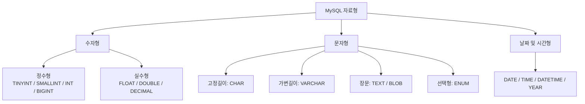
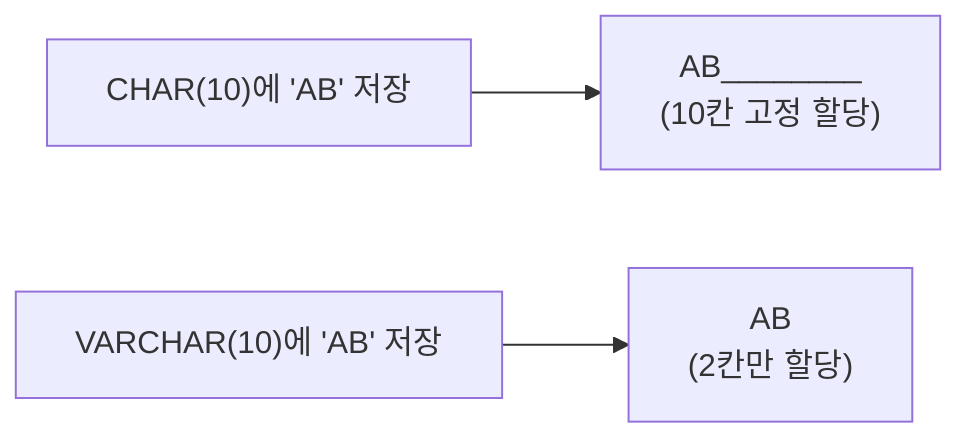
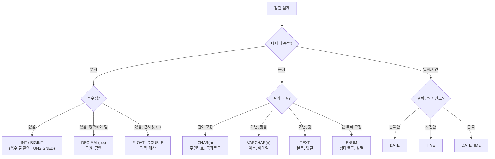
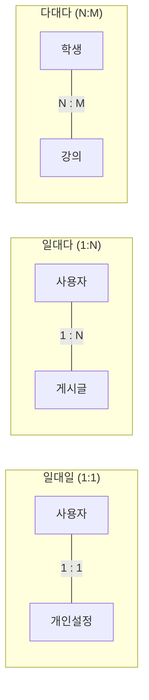
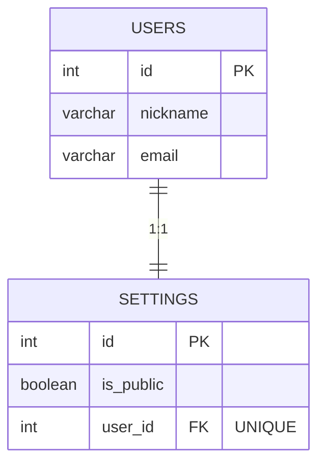
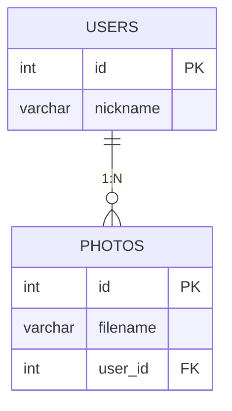
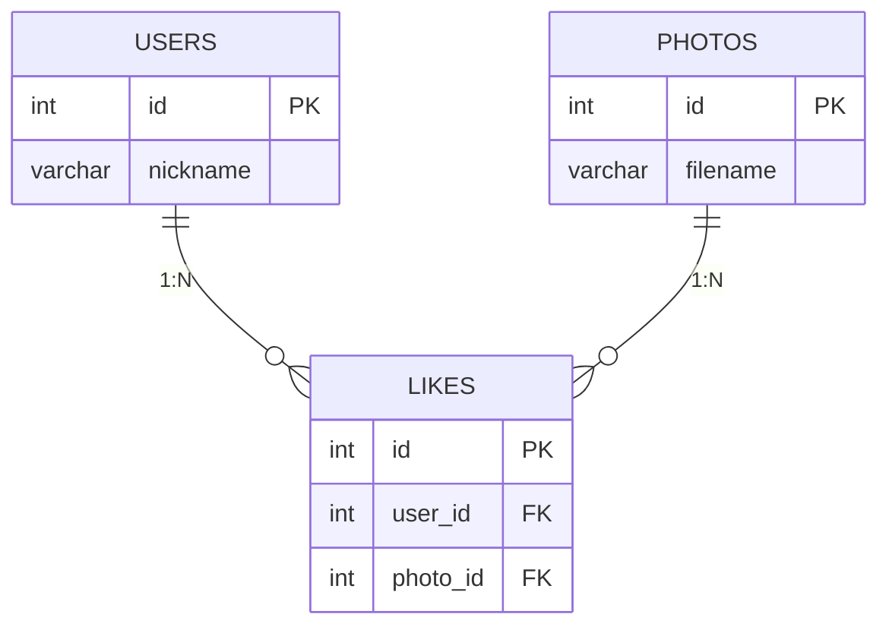
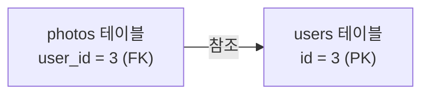
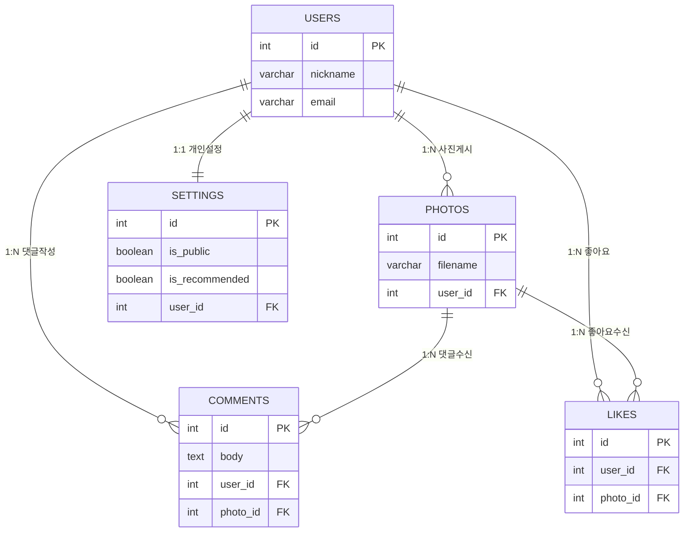
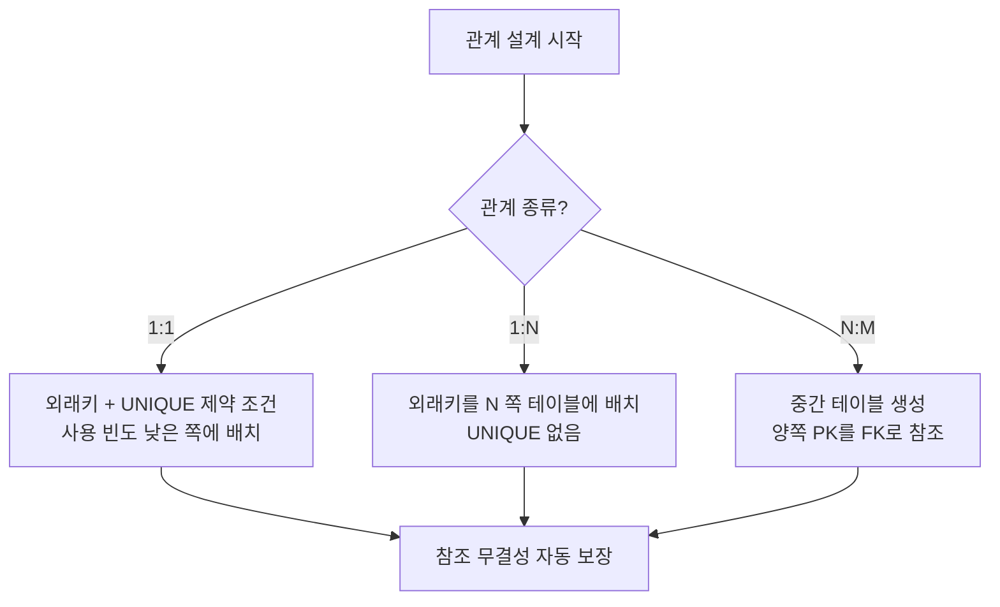

# 1장. 다양한 자료형 활용하기

---

## 1.1 자료형(Data Type)이란

**자료형(Data Type)** 은 칼럼에 저장할 수 있는 데이터의 형태와 종류를 미리 정의한 것임.  
테이블을 만들 때 각 칼럼에 어떤 자료형을 쓸지 선언하며, 선언된 자료형과 다른 형태의 데이터를 넣으면 오류가 발생함.

> 자료형을 잘못 설계하면 **저장 공간 낭비, 연산 오류, 성능 저하**가 동시에 발생함.  
> 처음 설계할 때 신중히 선택하는 습관이 중요함.
{: .prompt-warning }

### 자료형을 지정하는 이유

| 이유 | 설명 |
|------|------|
| 저장 공간 최적화 | 숫자는 숫자 타입으로 저장해야 불필요한 공간 낭비가 없음 |
| 연산 가능 여부 | `SUM()`, `AVG()` 같은 집계 함수는 숫자형 칼럼에만 사용 가능함 |
| 데이터 무결성 | 전화번호 칼럼에 문자가 들어오는 것을 원천 차단할 수 있음 |
| 검색 성능 | 적절한 자료형을 쓰면 인덱스 효율이 높아짐 |

### 자료형 전체 분류



---

## 1.2 수자형

### 정수형

소수점이 없는 숫자를 저장할 때 사용함. 저장 범위에 따라 자료형을 선택함.

| 자료형 | 크기 | 저장 범위 (SIGNED) | 사용 예 |
|--------|------|-------------------| --------|
| `TINYINT` | 1 Byte | -128 ~ 127 | 나이, 레벨 |
| `SMALLINT` | 2 Byte | -32,768 ~ 32,767 | 연도, 소규모 수량 |
| `INT` | 4 Byte | 약 -21억 ~ 21억 | 일반적인 ID, 금액 |
| `BIGINT` | 8 Byte | 약 -922경 ~ 922경 | 대용량 트래픽, 큰 ID |

**UNSIGNED 제약 조건**  
음수가 필요 없는 칼럼(나이, 재고량 등)에 `UNSIGNED`를 붙이면 0 이상의 값만 저장되고, 양수 범위가 약 2배로 늘어남.

```sql
-- UNSIGNED 사용 예: 재고량은 음수 불필요
stock INT UNSIGNED NOT NULL DEFAULT 0
-- INT UNSIGNED: 0 ~ 약 43억까지 저장 가능
```

> 음수가 절대 올 수 없는 칼럼에는 습관적으로 `UNSIGNED`를 붙이는 것이 좋음. 저장 범위가 늘어나는 보너스도 있음.
{: .prompt-tip }

---

### 실수형

소수점이 있는 숫자를 저장할 때 사용함. **부동 소수점** 방식과 **고정 소수점** 방식으로 나뉨.

| 방식 | 자료형 | 특징 | 사용 예 |
|------|--------|------|---------|
| 부동 소수점 | `FLOAT` | 4 Byte, 근사값 저장 | 과학적 계산 |
| 부동 소수점 | `DOUBLE` | 8 Byte, 더 정밀한 근사값 | 통계, 공학 |
| 고정 소수점 | `DECIMAL(p, s)` | 정확한 값 저장, 금융용 | 금액, 세금 |

`DECIMAL(p, s)` 에서 `p`는 전체 자릿수, `s`는 소수점 이하 자릿수를 의미함.

```sql
-- DECIMAL(10, 2): 전체 10자리, 소수점 이하 2자리
-- 최대 99,999,999.99 저장 가능
price DECIMAL(10, 2) NOT NULL
```

> `FLOAT`, `DOUBLE`은 **근사값**을 저장하므로 금액 계산에 사용하면 소수점 오차가 발생할 수 있음.  
> **금융 데이터는 반드시 `DECIMAL`을 사용**해야 함.
{: .prompt-danger }

---

## 1.3 문자형

### CHAR vs VARCHAR

가장 자주 혼동하는 부분. **저장 방식의 차이**를 이해하는 것이 핵심임.



| 자료형 | 특징 | 적합한 데이터 |
|--------|------|--------------|
| `CHAR(n)` | 고정 길이, 항상 n바이트 차지, 검색 빠름 | 주민등록번호, 국가코드, 성별 |
| `VARCHAR(n)` | 가변 길이, 실제 입력 길이만큼만 차지 | 이름, 이메일, 주소 |

```sql
-- 국가코드는 항상 2자리 → CHAR 적합
country_code CHAR(2) NOT NULL

-- 이름은 길이가 다양 → VARCHAR 적합
name VARCHAR(50) NOT NULL
```

---

### TEXT 계열

`VARCHAR`보다 더 긴 문자열을 저장할 때 사용함.

| 자료형 | 최대 크기 | 사용 예 |
|--------|----------|---------| 
| `TINYTEXT` | 255 Byte | 짧은 메모 |
| `TEXT` | 약 64 KB | 블로그 본문, 댓글 |
| `MEDIUMTEXT` | 약 16 MB | 긴 기사, 소설 |
| `LONGTEXT` | 약 4 GB | 대용량 문서 |

---

### BLOB 계열

이미지, 오디오, 동영상 등 **바이너리 파일**을 DB에 직접 저장할 때 사용함.

| 자료형 | 최대 크기 |
|--------|----------|
| `TINYBLOB` | 255 Byte |
| `BLOB` | 약 64 KB |
| `MEDIUMBLOB` | 약 16 MB |
| `LONGBLOB` | 약 4 GB |

> 실무에서는 BLOB 대신 AWS S3 같은 파일 서버에 저장하고, DB에는 URL 문자열만 저장하는 방식을 선호함.  
> BLOB을 남용하면 DB 용량이 빠르게 증가함.
{: .prompt-info }

---

### ENUM

미리 정해진 목록 중 **하나만** 선택해서 저장하는 자료형임.

```sql
-- 주문 상태를 4가지 중 하나로 제한
status ENUM('주문완료', '배송중', '배송완료', '취소') NOT NULL DEFAULT '주문완료'
```

목록에 없는 값을 삽입하면 오류가 발생함. 상태 코드처럼 **값의 종류가 고정된** 칼럼에 적합함.

---

## 1.4 날짜 및 시간형

| 자료형 | 저장 형식 | 저장 범위 | 사용 예 |
|--------|-----------|-----------|---------| 
| `DATE` | `YYYY-MM-DD` | 1000-01-01 ~ 9999-12-31 | 생년월일 |
| `TIME` | `hh:mm:ss` | -838:59:59 ~ 838:59:59 | 소요 시간 |
| `DATETIME` | `YYYY-MM-DD hh:mm:ss` | 1000-01-01 ~ 9999-12-31 | 주문일시, 가입일 |
| `YEAR` | `YYYY` | 1901 ~ 2155 | 출시 연도 |

```sql
-- 날짜 및 시간 함수
SELECT YEAR('2026-03-07');      -- 2026  (연도 추출)
SELECT MONTH('2026-03-07');     -- 3     (월 추출)
SELECT DAY('2026-03-07');       -- 7     (일 추출)
SELECT HOUR('14:30:00');        -- 14    (시 추출)
SELECT MINUTE('14:30:00');      -- 30    (분 추출)
SELECT SECOND('14:30:00');      -- 0     (초 추출)
```

---

## 1.5 문자열 필터링 — LIKE 연산자

특정 패턴을 포함하는 문자열을 찾을 때 사용함.

| 와일드카드 | 의미 | 예시 |
|------------|------|------|
| `%` | 0개 이상의 임의 문자 | `'김%'` → 김으로 시작하는 모든 값 |
| `_` | 정확히 1개의 임의 문자 | `'김_'` → 김 + 한 글자 (총 2글자) |

```sql
WHERE name LIKE '삼성%'      -- '삼성'으로 시작
WHERE name LIKE '%폰'        -- '폰'으로 끝남
WHERE name LIKE '%갤럭시%'   -- '갤럭시'를 포함
WHERE name LIKE '김__'       -- '김' + 정확히 두 글자 (총 3글자)
```

---

## 1.6 범위 필터링 — BETWEEN 연산자

두 값 사이에 속하는 데이터를 찾을 때 사용함. **양쪽 경계값 포함**.

```sql
-- 숫자 범위
WHERE price BETWEEN 10000 AND 50000
-- 위와 동일: WHERE price >= 10000 AND price <= 50000

-- 날짜 범위
WHERE ordered_at BETWEEN '2026-01-01' AND '2026-03-31'
```

> `BETWEEN A AND B` 는 `A 이상, B 이하` 임. 양쪽 경계값이 포함됨.
{: .prompt-tip }

---

## 1.7 자료형 선택 가이드



---

---

# 2장. 관계 만들고 이해하기

---

## 2.1 관계(Relationship)란

현실 세계에서 데이터는 혼자 존재하지 않음. 고객은 주문을 하고, 주문은 상품과 연결되며, 상품은 카테고리를 가짐.

**관계(Relationship)** 란 여러 테이블에 분산 저장된 데이터가 서로 어떻게 연결돼 있는지를 정의하는 것임.

관계를 잘 설계하면 데이터 중복 없이 효율적으로 저장할 수 있고, 필요한 데이터를 JOIN으로 정확하게 조합해 꺼낼 수 있음.

---

## 2.2 관계의 3가지 종류



---

### 일대일 관계 (1:1, One-to-One)

한 테이블의 **하나의 행**이 다른 테이블의 **정확히 하나의 행**과만 연결되는 관계.

**예시:** 사용자 1명은 개인 설정을 정확히 1개만 가짐.



**구현 포인트:** 외래키 칼럼에 반드시 `UNIQUE` 제약 조건을 추가해야 함.

```sql
CREATE TABLE settings (
    id      INT     NOT NULL AUTO_INCREMENT,
    is_public BOOLEAN NOT NULL DEFAULT TRUE,
    user_id INT     NOT NULL UNIQUE,   -- UNIQUE: 1:1 보장
    PRIMARY KEY (id),
    FOREIGN KEY (user_id) REFERENCES users(id)
);
```

> `UNIQUE`가 없으면 한 사용자가 여러 개의 설정을 가질 수 있어 일대다(1:N)로 바뀜.
{: .prompt-warning }

**외래키 위치 원칙:** 사용 빈도가 낮은 쪽 테이블에 외래키를 배치함.

---

### 일대다 관계 (1:N, One-to-Many)

한 테이블의 **하나의 행**이 다른 테이블의 **여러 행**과 연결되는 관계. 가장 흔한 관계 유형임.

**예시:** 사용자 1명은 여러 장의 사진을 게시할 수 있음.



**구현 포인트:** 외래키는 항상 **'다(N)'쪽 테이블**에 배치함. `UNIQUE` 없음.

```sql
CREATE TABLE photos (
    id       INT          NOT NULL AUTO_INCREMENT,
    filename VARCHAR(100) NOT NULL,
    user_id  INT          NOT NULL,   -- UNIQUE 없음 → 동일 user_id 여러 번 가능
    PRIMARY KEY (id),
    FOREIGN KEY (user_id) REFERENCES users(id)
);
```

---

### 다대다 관계 (N:M, Many-to-Many)

한 테이블의 **여러 행**이 다른 테이블의 **여러 행**과 연결되는 관계.

**예시:** 한 사용자는 여러 사진에 좋아요를 누를 수 있고, 한 사진도 여러 사용자로부터 좋아요를 받을 수 있음.

> **다대다 관계는 직접 구현할 수 없음.**  
> 반드시 **중간 테이블(연결 테이블)** 을 만들어서 두 개의 일대다 관계로 분해해야 함.
{: .prompt-danger }



```sql
-- 중간 테이블: 양쪽 테이블의 PK를 FK로 참조
CREATE TABLE likes (
    id       INT NOT NULL AUTO_INCREMENT,
    user_id  INT NOT NULL,
    photo_id INT NOT NULL,
    PRIMARY KEY (id),
    FOREIGN KEY (user_id)  REFERENCES users(id),
    FOREIGN KEY (photo_id) REFERENCES photos(id)
);
```

---

## 2.3 기본키(PK)와 외래키(FK)

### 기본키 (Primary Key, PK)

테이블 내에서 각 튜플을 **고유하게 식별**하는 칼럼 또는 칼럼의 조합임.

| 특징 | 설명 |
|------|------|
| 유일성 (Uniqueness) | 같은 값이 두 번 존재할 수 없음 |
| 비널 (Non-Nullable) | NULL이 올 수 없음 |
| 불변성 (Immutability) | 한 번 설정하면 변경하지 않는 것이 원칙 |
| 식별성 (Identifiability) | 각 튜플을 명확하게 구분해야 함 |

```sql
-- 기본키 지정 방법 1: 칼럼 정의 시 함께
id INT NOT NULL AUTO_INCREMENT PRIMARY KEY

-- 기본키 지정 방법 2: 별도 선언 (복합 기본키에 사용)
PRIMARY KEY (id)
PRIMARY KEY (user_id, photo_id)   -- 복합 기본키
```

---

### 외래키 (Foreign Key, FK)

**다른 테이블의 기본키를 참조하는** 칼럼. 두 테이블 간 관계를 만드는 연결 고리임.



```sql
-- 외래키 선언
FOREIGN KEY (user_id) REFERENCES users(id)
```

**참조 무결성(Referential Integrity):**  
외래키 값은 참조하는 테이블의 기본키에 **실제로 존재하는 값**이어야 함. 존재하지 않는 값을 넣으면 오류가 발생함.

```sql
-- user_id = 999가 users 테이블에 없다면 → 오류 발생
INSERT INTO photos (filename, user_id) VALUES ('test.jpg', 999);
-- ERROR 1452: Cannot add or update a child row: a foreign key constraint fails
```

---

## 2.4 제약 조건 (Constraints)

칼럼에 저장할 수 있는 값에 대한 규칙과 제한임.

| 제약 조건 | 설명 | 사용 예 |
|-----------|------|---------| 
| `AUTO_INCREMENT` | 삽입 시 자동으로 1씩 증가 | 기본키 ID |
| `UNIQUE` | 중복 값 불허 | 이메일, 사용자명 |
| `NOT NULL` | NULL 불허 | 이름, 가격 등 필수 칼럼 |
| `DEFAULT` | 입력 없을 시 기본값 자동 삽입 | 가입일, 재고 초기값 |
| `CHECK` | 조건을 만족하는 값만 허용 | 나이 > 0 |
| `UNSIGNED` | 음수 불허 | 재고량, 나이 |

```sql
-- 제약 조건 종합 예시
CREATE TABLE members (
    id         INT           NOT NULL AUTO_INCREMENT,
    email      VARCHAR(100)  NOT NULL UNIQUE,
    age        TINYINT       NOT NULL CHECK (age > 0 AND age < 150),
    score      INT           NOT NULL DEFAULT 0,
    balance    INT UNSIGNED  NOT NULL DEFAULT 0,
    created_at DATETIME      NOT NULL DEFAULT CURRENT_TIMESTAMP,
    PRIMARY KEY (id)
);
```

---

## 2.5 별그램(Stargram) DB 전체 구조

이번 실습에서 구현할 SNS 데이터베이스의 전체 관계도임.



### 관계 분석

| 관계 | 테이블 | 종류 | 외래키 위치 |
|------|--------|------|------------|
| 사용자 ↔ 개인설정 | users ↔ settings | **1:1** | settings.user_id (+ UNIQUE) |
| 사용자 ↔ 사진 | users ↔ photos | **1:N** | photos.user_id |
| 사용자 ↔ 댓글 ↔ 사진 | users ↔ comments ↔ photos | **N:M** | comments에 user_id, photo_id |
| 사용자 ↔ 좋아요 ↔ 사진 | users ↔ likes ↔ photos | **N:M** | likes에 user_id, photo_id |

---

## 2.6 관계 설계 핵심 요약



| 관계 종류 | 외래키 위치 | UNIQUE 여부 | 예시 |
|-----------|------------|------------|------|
| 일대일 (1:1) | 사용 빈도 낮은 쪽 | **필요** | users ↔ settings |
| 일대다 (1:N) | 'N(다)' 쪽 테이블 | **불필요** | users → photos |
| 다대다 (N:M) | 중간 테이블 양쪽 모두 | 경우에 따라 | users ↔ likes ↔ photos |

> 관계 설계에서 가장 중요한 원칙:  
> **외래키는 '다(N)'쪽 테이블에 배치한다.**  
> **1:1일 때는 외래키에 UNIQUE를 반드시 추가한다.**
{: .prompt-tip }
