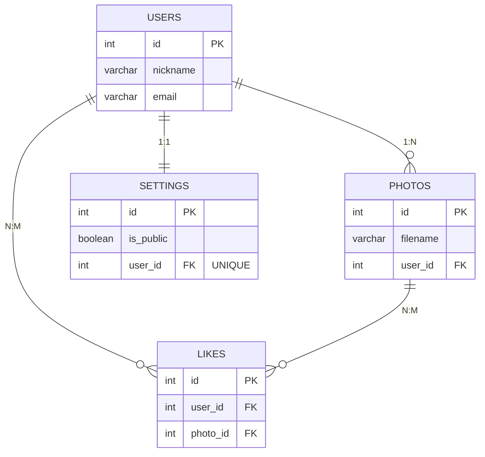

# 실습 전 준비

이번 실습은 **두 개의 데이터베이스**를 사용함. 각 장 실습 전 해당 DB를 생성하고 진입할 것.

> 2장 실습에서 테이블 생성 순서를 반드시 지킬 것. 외래키가 참조하는 테이블이 먼저 존재해야 오류가 발생하지 않음.
{: .prompt-warning }

---

# 1장 실습 — 다양한 자료형 활용하기

## 실습 데이터 준비

```sql
CREATE DATABASE shop_db;
USE shop_db;

CREATE TABLE orders (
    id         INT          NOT NULL AUTO_INCREMENT,
    customer   VARCHAR(30)  NOT NULL,
    product    VARCHAR(50)  NOT NULL,
    price      INT          NOT NULL,
    quantity   TINYINT      NOT NULL,
    status     ENUM('주문완료','배송중','배송완료','취소') NOT NULL DEFAULT '주문완료',
    ordered_at DATETIME     NOT NULL,
    PRIMARY KEY (id)
);

INSERT INTO orders (customer, product, price, quantity, status, ordered_at) VALUES
    ('김민준', '삼성 갤럭시 S25',        1200000, 1, '배송완료', '2026-01-05 09:15:00'),
    ('이서연', '애플 아이폰 16',          1350000, 1, '배송완료', '2026-01-12 14:30:00'),
    ('박지호', '삼성 갤럭시 버즈',         180000, 2, '배송중',   '2026-02-03 11:00:00'),
    ('최수아', '애플 에어팟 프로',         320000, 1, '배송완료', '2026-02-14 16:45:00'),
    ('정우진', '삼성 갤럭시 탭 S9',       950000, 1, '주문완료', '2026-02-20 10:20:00'),
    ('한예은', '소니 WH-1000XM5',        380000, 1, '배송중',   '2026-02-28 13:00:00'),
    ('오승현', '로지텍 MX Master',        120000, 1, '취소',     '2026-03-01 09:30:00'),
    ('윤채원', '삼성 갤럭시 워치 7',      350000, 1, '주문완료', '2026-03-02 17:10:00'),
    ('임도현', '애플 맥북 에어 M3',      1600000, 1, '배송중',   '2026-03-04 08:50:00'),
    ('강하린', '삼성 갤럭시 S25 플러스', 1400000, 1, '주문완료', '2026-03-05 12:00:00');
```

---

## 문제 1. LIKE — '삼성'으로 시작하는 상품 조회

```sql
SELECT id, customer, product, price
FROM orders
WHERE product LIKE '삼성%';
```

**결과:**

| id | customer | product | price |
|----|----------|---------|-------|
| 1 | 김민준 | 삼성 갤럭시 S25 | 1200000 |
| 3 | 박지호 | 삼성 갤럭시 버즈 | 180000 |
| 5 | 정우진 | 삼성 갤럭시 탭 S9 | 950000 |
| 8 | 윤채원 | 삼성 갤럭시 워치 7 | 350000 |
| 10 | 강하린 | 삼성 갤럭시 S25 플러스 | 1400000 |

> `'삼성%'` → 삼성으로 **시작** / `'%삼성'` → 삼성으로 **끝남** / `'%삼성%'` → 삼성을 **포함**

---

## 문제 2. LIKE — '갤럭시'를 포함한 상품 조회

```sql
SELECT id, customer, product
FROM orders
WHERE product LIKE '%갤럭시%';
```

**결과:**

| id | customer | product |
|----|----------|---------|
| 1 | 김민준 | 삼성 갤럭시 S25 |
| 3 | 박지호 | 삼성 갤럭시 버즈 |
| 5 | 정우진 | 삼성 갤럭시 탭 S9 |
| 8 | 윤채원 | 삼성 갤럭시 워치 7 |
| 10 | 강하린 | 삼성 갤럭시 S25 플러스 |

---

## 문제 3. LIKE — 고객 이름이 정확히 3글자인 주문 조회

`_` 와일드카드를 활용할 것. (`_` 1개 = 글자 1개)

```sql
SELECT customer, product
FROM orders
WHERE customer LIKE '___';
```

**결과:** 모든 고객(10명) 조회됨 — 데이터가 모두 3글자 이름이기 때문.

> `___` (언더스코어 3개) → 정확히 3글자.  
> 2글자 이름을 찾으려면 `'__'`, 4글자는 `'____'`을 씀.

---

## 문제 4. BETWEEN — 가격 범위 조회

가격이 300,000원 이상 1,000,000원 이하인 주문을 조회하시오.

```sql
SELECT customer, product, price
FROM orders
WHERE price BETWEEN 300000 AND 1000000;
```

**결과:**

| customer | product | price |
|----------|---------|-------|
| 최수아 | 애플 에어팟 프로 | 320000 |
| 정우진 | 삼성 갤럭시 탭 S9 | 950000 |
| 한예은 | 소니 WH-1000XM5 | 380000 |
| 윤채원 | 삼성 갤럭시 워치 7 | 350000 |

> `BETWEEN A AND B` = `>= A AND <= B`. 양쪽 경계값 포함.

---

## 문제 5. 날짜 함수 — 2026년 2월 주문 조회

`YEAR()`, `MONTH()` 함수를 활용할 것.

```sql
SELECT customer, product, ordered_at
FROM orders
WHERE YEAR(ordered_at) = 2026
  AND MONTH(ordered_at) = 2;
```

**결과:**

| customer | product | ordered_at |
|----------|---------|------------|
| 박지호 | 삼성 갤럭시 버즈 | 2026-02-03 11:00:00 |
| 최수아 | 애플 에어팟 프로 | 2026-02-14 16:45:00 |
| 정우진 | 삼성 갤럭시 탭 S9 | 2026-02-20 10:20:00 |
| 한예은 | 소니 WH-1000XM5 | 2026-02-28 13:00:00 |

---

## 문제 6. 시간 함수 — 오전(12시 미만) 주문 조회

```sql
SELECT customer, product, ordered_at
FROM orders
WHERE HOUR(ordered_at) < 12;
```

**결과:**

| customer | product | ordered_at |
|----------|---------|------------|
| 김민준 | 삼성 갤럭시 S25 | 2026-01-05 09:15:00 |
| 박지호 | 삼성 갤럭시 버즈 | 2026-02-03 11:00:00 |
| 정우진 | 삼성 갤럭시 탭 S9 | 2026-02-20 10:20:00 |
| 오승현 | 로지텍 MX Master | 2026-03-01 09:30:00 |
| 임도현 | 애플 맥북 에어 M3 | 2026-03-04 08:50:00 |

> 강하린(12:00:00)은 `HOUR() = 12` 이므로 `< 12` 조건에서 제외됨.

---

## 문제 7. 복합 조건 — LIKE + 날짜 + ENUM 결합

2026년 3월에 '삼성' 제품을 주문했고, 가격이 300,000원 이상이며, 상태가 '주문완료'인 내역을 조회하시오.

```sql
SELECT customer, product, price, status
FROM orders
WHERE YEAR(ordered_at) = 2026
  AND MONTH(ordered_at) = 3
  AND product LIKE '삼성%'
  AND price >= 300000
  AND status = '주문완료';
```

**결과:**

| customer | product | price | status |
|----------|---------|-------|--------|
| 윤채원 | 삼성 갤럭시 워치 7 | 350000 | 주문완료 |
| 강하린 | 삼성 갤럭시 S25 플러스 | 1400000 | 주문완료 |

---

---

# 2장 실습 — 관계 만들고 이해하기

이번 실습의 목표는 **테이블을 직접 만들고, 관계가 데이터 삽입에 어떤 영향을 주는지** 확인하는 것임.  
JOIN은 다음 장(7장)에서 배움. 이번 장은 **테이블 생성 → 제약 조건 확인 → 데이터 삽입** 흐름에 집중함.

---

## 실습 DB 구조



---

## 실습 데이터 준비

**순서 중요: users → photos → settings → likes 순으로 실행할 것.**

```sql
CREATE DATABASE stargram_db;
USE stargram_db;

-- 1단계: users
CREATE TABLE users (
    id       INT          NOT NULL AUTO_INCREMENT,
    nickname VARCHAR(30)  NOT NULL UNIQUE,
    email    VARCHAR(100) NOT NULL UNIQUE,
    PRIMARY KEY (id)
);

-- 2단계: photos (users 참조 → 1:N)
CREATE TABLE photos (
    id       INT          NOT NULL AUTO_INCREMENT,
    filename VARCHAR(100) NOT NULL,
    user_id  INT          NOT NULL,
    PRIMARY KEY (id),
    FOREIGN KEY (user_id) REFERENCES users(id)
);

-- 3단계: settings (users 참조 → 1:1, UNIQUE 필수)
CREATE TABLE settings (
    id        INT     NOT NULL AUTO_INCREMENT,
    is_public BOOLEAN NOT NULL DEFAULT TRUE,
    user_id   INT     NOT NULL UNIQUE,
    PRIMARY KEY (id),
    FOREIGN KEY (user_id) REFERENCES users(id)
);

-- 4단계: likes (N:M 중간 테이블)
CREATE TABLE likes (
    id       INT NOT NULL AUTO_INCREMENT,
    user_id  INT NOT NULL,
    photo_id INT NOT NULL,
    PRIMARY KEY (id),
    FOREIGN KEY (user_id)  REFERENCES users(id),
    FOREIGN KEY (photo_id) REFERENCES photos(id)
);
```

```sql
INSERT INTO users (nickname, email) VALUES
    ('star_kim',   'kim@mail.com'),
    ('moon_lee',   'lee@mail.com'),
    ('sun_park',   'park@mail.com');

INSERT INTO photos (filename, user_id) VALUES
    ('sunset.jpg',   1),
    ('coffee.jpg',   1),
    ('mountain.jpg', 2);

INSERT INTO settings (is_public, user_id) VALUES
    (TRUE,  1),
    (FALSE, 2),
    (TRUE,  3);

INSERT INTO likes (user_id, photo_id) VALUES
    (2, 1),
    (3, 1),
    (1, 3),
    (3, 3);
```

---

## 문제 8. 테이블 구조 확인 — photos의 Key 값 확인

`photos` 테이블 구조를 조회하고, `user_id` 칼럼의 `Key` 값을 확인하시오.

```sql
DESC photos;
```

**결과:**

| Field | Type | Null | Key | Default | Extra |
|-------|------|------|-----|---------|-------|
| id | int | NO | PRI | NULL | auto_increment |
| filename | varchar(100) | NO | | NULL | |
| user_id | int | NO | MUL | NULL | |

> `MUL` = 외래키(FK). 같은 `user_id` 값이 여러 번 들어올 수 있음 → **1:N 관계**.

---

## 문제 9. 테이블 구조 확인 — settings의 Key 값 확인

`settings` 테이블 구조를 조회하고, `user_id` 칼럼의 `Key` 값이 `photos`와 어떻게 다른지 확인하시오.

```sql
DESC settings;
```

**결과:**

| Field | Type | Null | Key | Default | Extra |
|-------|------|------|-----|---------|-------|
| id | int | NO | PRI | NULL | auto_increment |
| is_public | tinyint(1) | NO | | 1 | |
| user_id | int | NO | **UNI** | NULL | |

> `photos.user_id` → `MUL` (중복 허용, 1:N)  
> `settings.user_id` → `UNI` (중복 불허, 1:1)  
> **`UNIQUE` 제약 조건 하나가 관계 종류를 결정함.**

---

## 문제 10. 데이터 조회 — users 전체 확인

현재 등록된 사용자 전체를 조회하시오.

```sql
SELECT * FROM users;
```

**결과:**

| id | nickname | email |
|----|----------|-------|
| 1 | star_kim | kim@mail.com |
| 2 | moon_lee | lee@mail.com |
| 3 | sun_park | park@mail.com |

---

## 문제 11. 데이터 조회 — photos 전체 확인

현재 등록된 사진 전체를 조회하고, `user_id` 값이 어느 사용자를 가리키는지 확인하시오.

```sql
SELECT * FROM photos;
```

**결과:**

| id | filename | user_id |
|----|----------|---------|
| 1 | sunset.jpg | 1 |
| 2 | coffee.jpg | 1 |
| 3 | mountain.jpg | 2 |

> `user_id = 1` (star_kim)이 두 번 등장함 — **1:N 관계**에서 한 사용자가 여러 사진을 가질 수 있음을 보여줌.  
> `user_id`의 값은 `users.id`를 그대로 참조함.

---

## 문제 12. 데이터 조회 — settings 전체 확인

현재 등록된 설정 전체를 조회하시오.

```sql
SELECT * FROM settings;
```

**결과:**

| id | is_public | user_id |
|----|-----------|---------|
| 1 | 1 | 1 |
| 2 | 0 | 2 |
| 3 | 1 | 3 |

> `user_id` 값이 1, 2, 3으로 **각각 1번씩만** 등장함 — **1:1 관계**의 특징.  
> `photos`에서 `user_id = 1`이 2번 나왔던 것과 비교해볼 것.

---

## 문제 13. 데이터 조회 — likes 전체 확인

현재 등록된 좋아요 전체를 조회하시오. N:M 관계가 어떻게 저장되는지 확인할 것.

```sql
SELECT * FROM likes;
```

**결과:**

| id | user_id | photo_id |
|----|---------|---------|
| 1 | 2 | 1 |
| 2 | 3 | 1 |
| 3 | 1 | 3 |
| 4 | 3 | 3 |

> `user_id = 3` (sun_park)이 두 번 등장 → 한 사용자가 여러 사진에 좋아요 가능.  
> `photo_id = 1` (sunset.jpg)이 두 번 등장 → 한 사진이 여러 사용자로부터 좋아요 수신 가능.  
> 이것이 **N:M 관계**임. 중간 테이블(likes)이 없으면 표현할 수 없음.

---

## 문제 14. 참조 무결성 확인 — 존재하지 않는 user_id로 사진 삽입

`users`에 없는 `user_id = 999`로 사진을 등록하면 어떻게 되는지 확인하시오.

```sql
INSERT INTO photos (filename, user_id) VALUES ('test.jpg', 999);
```

**예상 결과:**

```
ERROR 1452 (23000): Cannot add or update a child row:
a foreign key constraint fails
```

> 외래키 제약 조건이 참조 테이블에 없는 값의 삽입을 **DB 레벨에서 차단**함.  
> 이것이 **참조 무결성(Referential Integrity)** — 잘못된 관계 데이터가 들어오는 것을 원천 방지함.
{: .prompt-danger }

---

## 문제 15. UNIQUE 제약 확인 — 같은 user_id로 설정 2번 삽입

이미 설정이 등록된 `user_id = 1`로 settings에 한 번 더 삽입해보시오.

```sql
INSERT INTO settings (is_public, user_id) VALUES (FALSE, 1);
```

**예상 결과:**

```
ERROR 1062 (23000): Duplicate entry '1' for key 'settings.user_id'
```

> `UNIQUE` 제약 조건이 같은 `user_id`의 중복 삽입을 막음.  
> `UNIQUE`가 없었다면 조용히 삽입되어 **1:N으로 바뀌어 버림**.  
> `UNIQUE` 하나가 1:1 관계를 물리적으로 보장하는 핵심임.
{: .prompt-warning }

---

## 문제 16. UNIQUE 제약 확인 — 이메일 중복 삽입

`users` 테이블의 `email`에도 `UNIQUE` 제약 조건이 있음. 이미 존재하는 이메일로 새 사용자를 등록해보시오.

```sql
INSERT INTO users (nickname, email) VALUES ('new_user', 'kim@mail.com');
```

**예상 결과:**

```
ERROR 1062 (23000): Duplicate entry 'kim@mail.com' for key 'users.email'
```

> 이메일처럼 **같은 값이 두 번 존재하면 안 되는** 칼럼에 `UNIQUE`를 붙임.  
> 문제 15와 같은 오류 — `UNIQUE`는 1:1 관계 보장 외에도 **고유 식별자 보호**에도 쓰임.

---

## 2장 핵심 정리

| 관계 | 외래키 위치 | UNIQUE | DESC Key 값 | 데이터 특징 |
|------|-----------|--------|-------------|-----------|
| 1:1 | 사용 빈도 낮은 쪽 | **필요** | UNI | 각 행이 1번씩만 등장 |
| 1:N | N(다) 쪽 테이블 | 불필요 | MUL | 같은 FK 값이 여러 번 등장 |
| N:M | 중간 테이블 양쪽 | 불필요 | MUL | 중간 테이블 없이 구현 불가 |

> **이번 장에서 핵심 확인 사항 3가지:**  
> 1. `DESC` 로 Key 값 → 관계 종류 파악 가능  
> 2. FK가 없는 `user_id = 999` 삽입 → ERROR 1452 (참조 무결성)  
> 3. UNIQUE 칼럼에 중복 삽입 → ERROR 1062 (UNIQUE 위반)
{: .prompt-tip }


