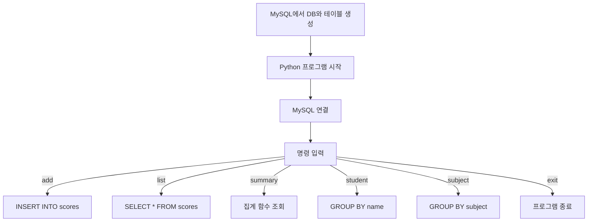

# 5-4 Python 실습 — DB 구조는 MySQL에서 만들고 입출력은 Python으로 하는 성적 프로그램

> 5-2와 5-3에서는 `score_db`의 `scores` 테이블에 SQL을 직접 입력해 실습했다.  
> 이번에는 **DB 구조는 MySQL에서 먼저 만들고**, 그 다음 파이썬 프로그램에서 MySQL에 접속해 데이터를 넣고, 조회하고, `exit`를 입력할 때까지 계속 실행해 본다.
{: .prompt-tip }

---

## 이번 실습의 구조

이번 실습은 역할이 이렇게 나뉜다.

- **MySQL** : 데이터베이스와 테이블 구조를 만든다.
- **Python** : 사용자에게 입력을 받고, MySQL에 저장하고, 결과를 출력한다.

즉, 구조를 만드는 일과 실제 입출력을 담당하는 일을 나누어 연습하는 방식이다.

---

## 이번 실습에서 사용하는 DB 구조

이번 실습은 **5-2에서 만든 `score_db` 데이터베이스와 `scores` 테이블**을 그대로 사용한다.

```sql
CREATE TABLE scores (
  id      INT,
  name    VARCHAR(20),
  subject VARCHAR(20),
  score   INT,
  grade   INT
);
```

| 칼럼명 | 의미 |
|---|---|
| `id` | 번호 |
| `name` | 학생 이름 |
| `subject` | 과목 |
| `score` | 점수 |
| `grade` | 학년 |

> 아직 `score_db`와 `scores` 테이블을 만들지 않았다면  
> 먼저 [2026-03-04-database-5-2.md](C:/work/Obsidian/sbaek100.github.io/_posts/2026-03-04-database-5-2.md)의 STEP 1~3을 먼저 실행한다.
{: .prompt-warning }

---

## 이번 실습 목표

- MySQL에서 `score_db`와 `scores` 구조를 먼저 준비한다.
- 파이썬에서 MySQL 서버에 접속한다.
- 사용자 입력을 받아 `scores` 테이블에 데이터를 추가한다.
- 전체 데이터, 전체 통계, 학생별 총점, 과목별 평균을 조회한다.
- `exit`를 입력할 때까지 계속 반복 실행한다.



---

## 프로그램에서 사용할 명령

| 명령 | 하는 일 |
|---|---|
| `add` | 학생 정보 1건을 입력해 `scores` 테이블에 저장 |
| `list` | `scores` 테이블 전체 데이터 출력 |
| `summary` | 전체 개수, 합계, 평균, 최고점, 최저점 출력 |
| `student` | 학생별 총점 출력 |
| `subject` | 과목별 평균 출력 |
| `exit` | 프로그램 종료 |

---

## 따라하기 1. MySQL에서 DB 구조 먼저 준비

아직 준비하지 않았다면 MySQL 워크벤치에서 아래 SQL을 먼저 실행한다.

```sql
CREATE DATABASE score_db;
USE score_db;

CREATE TABLE scores (
  id      INT,
  name    VARCHAR(20),
  subject VARCHAR(20),
  score   INT,
  grade   INT
);
```

이 단계는 **파이썬이 아니라 MySQL에서 직접** 준비하는 부분이다.

---

## 따라하기 2. MySQL 연결 준비

파이썬에서 MySQL에 접속하려면 커넥터 패키지가 필요하다.

```bash
pip install mysql-connector-python
```

---

## 따라하기 3. 전체 코드 작성

아래 코드를 `score_mysql_program.py` 파일에 입력해 보자.  
`password` 부분은 **자신의 MySQL 비밀번호**로 바꿔야 한다.  
이 코드는 테이블을 새로 만드는 코드가 아니라, **이미 만들어진 `scores` 테이블에 접속해서 입출력만 처리하는 코드**이다.

```python
import mysql.connector

conn = mysql.connector.connect(
    host="localhost",
    user="root",
    password="각자 다름.!!",
    database="score_db"
)

cursor = conn.cursor()

while True:
    print("\n[명령어] add / list / summary / student / subject / exit")
    command = input("명령 입력: ").strip().lower()

    if command == "add":
        id_input = input("번호 입력: ").strip()
        name = input("이름 입력: ").strip()
        subject = input("과목 입력: ").strip()
        score_input = input("점수 입력: ").strip()
        grade_input = input("학년 입력: ").strip()

		# 입력을 받을 때 입력값 검증은 보안상 상당히 중요
        if not (id_input.isdigit() and score_input.isdigit() and grade_input.isdigit()):
            print("번호, 점수, 학년은 숫자로 입력해야 합니다.")
            continue

        sql = """
        INSERT INTO scores (id, name, subject, score, grade)
        VALUES (%s, %s, %s, %s, %s)
        """
        values = (int(id_input), name, subject, int(score_input), int(grade_input))

        try:
            cursor.execute(sql, values)
            conn.commit()
            print("데이터가 저장되었습니다.")
        except mysql.connector.Error as err:
            print("저장 중 오류가 발생했습니다:", err)

    elif command == "list":
        cursor.execute("SELECT * FROM scores")
        rows = cursor.fetchall()

        if not rows:
            print("저장된 데이터가 없습니다.")
            continue

        print("\n[id, name, subject, score, grade]")
        for row in rows:
            print(row)

    elif command == "summary":
        cursor.execute("""
            SELECT COUNT(*), SUM(score), AVG(score), MAX(score), MIN(score)
            FROM scores
        """)
        result = cursor.fetchone()

        print("\n[전체 통계]")
        print(f"데이터 수: {result[0]}")
        print(f"점수 합계: {result[1]}")
        print(f"점수 평균: {result[2]:.2f}")
        print(f"최고점: {result[3]}")
        print(f"최저점: {result[4]}")

    elif command == "student":
        cursor.execute("""
            SELECT name, SUM(score) AS total_score
            FROM scores
            GROUP BY name
            ORDER BY total_score DESC
        """)
        rows = cursor.fetchall()

        print("\n[학생별 총점]")
        for row in rows:
            print(f"{row[0]}: {row[1]}")

    elif command == "subject":
        cursor.execute("""
            SELECT subject, AVG(score) AS avg_score
            FROM scores
            GROUP BY subject
            ORDER BY subject ASC
        """)
        rows = cursor.fetchall()

        print("\n[과목별 평균]")
        for row in rows:
            print(f"{row[0]}: {row[1]:.2f}")

    elif command == "exit":
        print("프로그램을 종료합니다.")
        break

    else:
        print("알 수 없는 명령입니다.")

cursor.close()
conn.close()
```

---

## 따라하기 4. 프로그램 실행

```bash
python score_mysql_program.py
```

실행이 되지 않으면 아래를 먼저 점검한다.

- MySQL 서버가 실행 중인지 확인
- `score_db` 데이터베이스가 존재하는지 확인
- `scores` 테이블이 존재하는지 확인
- 코드에 입력한 비밀번호가 맞는지 확인

---

## 따라하기 5. 데이터 추가하기

프로그램이 실행되면 `add` 명령으로 새 성적 데이터를 넣어 보자.

### 입력 예시

```text
명령 입력: add
번호 입력: 16
이름 입력: 민준
과목 입력: 과학
점수 입력: 89
학년 입력: 1
```

```text
명령 입력: add
번호 입력: 17
이름 입력: 서연
과목 입력: 사회
점수 입력: 93
학년 입력: 1
```

> 이 입력은 파이썬에서 받아서, 실제로 MySQL의 `scores` 테이블에 저장된다.
{: .prompt-info }

---

## 따라하기 6. 전체 데이터 출력

지금까지 저장된 데이터를 확인해 보자.

### 입력

```text
명령 입력: list
```

### 출력 예시

```text
[id, name, subject, score, grade]
(1, '민준', '국어', 85, 1)
(2, '민준', '수학', 92, 1)
...
(16, '민준', '과학', 89, 1)
(17, '서연', '사회', 93, 1)
```

---

## 따라하기 7. 전체 통계 출력

5-1의 집계 함수처럼 전체 통계를 한 번에 출력해 보자.

### 입력

```text
명령 입력: summary
```

### 내부에서 실행되는 SQL

```sql
SELECT COUNT(*), SUM(score), AVG(score), MAX(score), MIN(score)
FROM scores;
```

---

## 따라하기 8. 학생별 총점 출력

5-3의 `GROUP BY name`과 `ORDER BY`를 그대로 활용해 보자.

### 입력

```text
명령 입력: student
```

### 내부에서 실행되는 SQL

```sql
SELECT name, SUM(score) AS total_score
FROM scores
GROUP BY name
ORDER BY total_score DESC;
```

---

## 따라하기 9. 과목별 평균 출력

과목별 평균 점수를 출력해 보자.

### 입력

```text
명령 입력: subject
```

### 내부에서 실행되는 SQL

```sql
SELECT subject, AVG(score) AS avg_score
FROM scores
GROUP BY subject
ORDER BY subject ASC;
```

---

## 따라하기 10. exit로 종료하기

프로그램 종료 시에는 `exit`를 입력한다.

### 입력

```text
명령 입력: exit
```

### 출력

```text
프로그램을 종료합니다.
```

---

## 코드에서 꼭 볼 부분

### 1. 구조는 MySQL, 입출력은 Python

```python
conn = mysql.connector.connect(
    host="localhost",
    user="root",
    password="1234",
    database="score_db"
)
```

여기서 `score_db` 데이터베이스에 접속한다.  
즉, 테이블 구조는 이미 MySQL에 있고, 파이썬은 그 구조를 사용해서 입력과 출력만 담당한다.

---

### 2. INSERT 실행 부분

```python
cursor.execute(sql, values)
conn.commit()
```

- `execute()` : SQL 실행
- `commit()` : 실제 저장 반영

`commit()`을 하지 않으면 INSERT가 저장되지 않을 수 있다.

---

### 3. 계속 반복하는 부분

```python
while True:
```

이 줄 때문에 프로그램이 `exit`를 입력하기 전까지 계속 돌아간다.

---

### 4. 종료하는 부분

```python
elif command == "exit":
    print("프로그램을 종료합니다.")
    break
```

반복문을 빠져나온 뒤 마지막에 `cursor.close()`와 `conn.close()`가 실행된다.

---

### 5. SQL 개념과 연결해서 보기

| 5주차 SQL 내용 | Python 프로그램에서 실행한 SQL |
|---|---|
| `COUNT`, `SUM`, `AVG`, `MAX`, `MIN` | `summary` 명령 |
| `GROUP BY name` | `student` 명령 |
| `GROUP BY subject` | `subject` 명령 |
| `ORDER BY total_score DESC` | `student` 명령 |
| `ORDER BY subject ASC` | `subject` 명령 |

---

## 직접 해보기

### 문제 1

`add` 명령으로 데이터를 3개 이상 더 넣은 뒤 `list`로 확인해 보자.

### 문제 2

`summary`를 실행해서 전체 점수 통계를 확인해 보자.

### 문제 3

같은 학생 이름으로 여러 과목을 입력한 뒤 `student` 결과가 총점 기준 내림차순으로 정렬되는지 확인해 보자.

### 문제 4

같은 과목을 여러 번 입력한 뒤 `subject` 결과가 평균으로 계산되는지 확인해 보자.

---

## 정리

이번 실습에서는 구조와 입출력의 역할을 나누어 연습했다.

- MySQL에서 `score_db`와 `scores` 테이블 구조 만들기
- Python에서 `input()`으로 사용자 입력 받기
- `mysql.connector`로 DB 연결하기
- `INSERT`와 `SELECT`를 실행해 실제 DB에 저장하고 읽기
- 집계 함수와 `GROUP BY`, `ORDER BY` 결과를 프로그램 안에서 출력하기
- `exit` 입력 전까지 반복 실행하기

즉, **DB 구조는 MySQL에서 만들고, 실제 입출력은 Python이 담당하는 구조**로 5-1부터 5-3의 SQL 내용을 확장한 실습이다.

---
