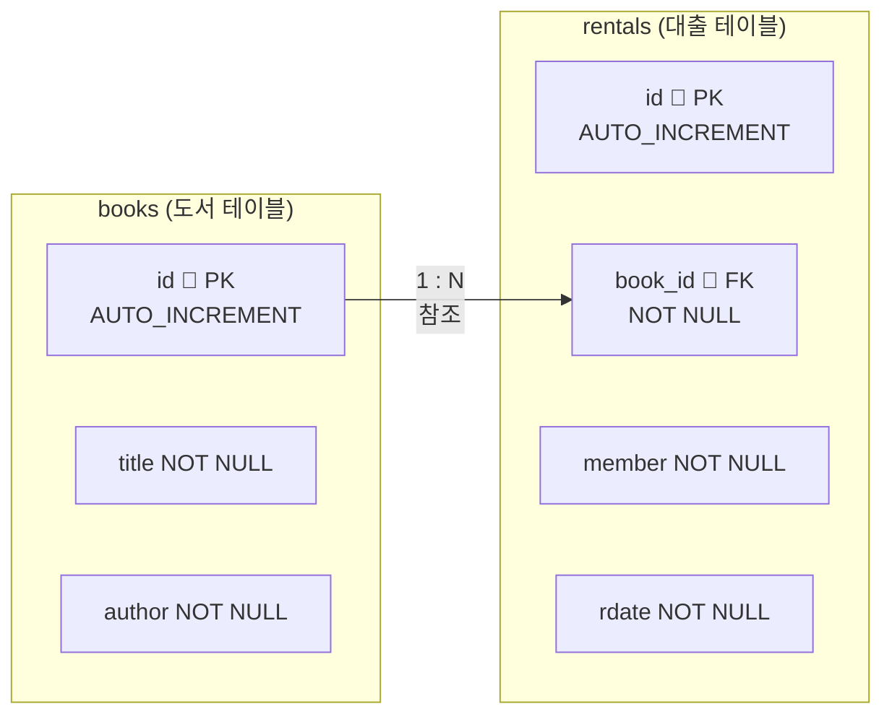

# 6-2 키와 제약조건 실습 — 도서관 DB

> 이번 실습은 **6-1에서 배운 기본키, 외래키, 제약조건**을 새로운 예제로 처음부터 다시 연습한다.  
> 테이블 2개를 만들고, 외래키로 연결한 뒤, 데이터를 넣고 조회하는 것까지 해본다.
{: .prompt-tip }

---

## 이번 실습 목표


- `books` : 도서 정보를 저장하는 테이블 (기본키 포함)
- `rentals` : 대출 내역을 저장하는 테이블 (외래키로 books를 참조)
- 한 권의 책은 여러 번 대출될 수 있음 → **1:N 관계**

---

## STEP 1. 데이터베이스 만들기

```sql
CREATE DATABASE library_db;
USE library_db;
```

왼쪽 Navigator에 `library_db`가 생기면 성공이다. ✅

---

## STEP 2. 도서 테이블 만들기 (기본키)

도서관에 있는 책 정보를 저장하는 테이블이다.

```sql
CREATE TABLE books (
  id      INT          PRIMARY KEY AUTO_INCREMENT,
  title   VARCHAR(50)  NOT NULL,
  author  VARCHAR(30)  NOT NULL
);
```

칼럼 설명:

| 칼럼 | 자료형 | 제약조건 | 의미 |
|---|---|---|---|
| `id` | INT | PRIMARY KEY, AUTO_INCREMENT | 도서 번호 (자동 증가) |
| `title` | VARCHAR(50) | NOT NULL | 책 제목 (빈 값 불가) |
| `author` | VARCHAR(30) | NOT NULL | 저자 이름 (빈 값 불가) |

> `id`는 직접 쓰지 않아도 1, 2, 3 … 이 자동으로 붙는다.
{: .prompt-info }

---

## STEP 3. 대출 테이블 만들기 (외래키)

어떤 책이 언제 누구에게 대출됐는지 기록하는 테이블이다.

```sql
CREATE TABLE rentals (
  id        INT          PRIMARY KEY AUTO_INCREMENT,
  book_id   INT          NOT NULL,
  member    VARCHAR(20)  NOT NULL,
  rdate     DATE         NOT NULL,
  FOREIGN KEY (book_id) REFERENCES books(id)
);
```

칼럼 설명:

| 칼럼 | 자료형 | 제약조건 | 의미 |
|---|---|---|---|
| `id` | INT | PRIMARY KEY, AUTO_INCREMENT | 대출 번호 (자동 증가) |
| `book_id` | INT | NOT NULL, **FOREIGN KEY** | 어떤 책인지 (books.id 참조) |
| `member` | VARCHAR(20) | NOT NULL | 대출자 이름 |
| `rdate` | DATE | NOT NULL | 대출 날짜 |

> `FOREIGN KEY (book_id) REFERENCES books(id)` 는  
> "`book_id`는 `books` 테이블의 `id`를 가리킨다"는 선언이다.
{: .prompt-info }

---

## STEP 4. 테이블 구조 확인

```sql
DESC books;
DESC rentals;
```

`rentals` 테이블의 `book_id` 칼럼에 `MUL`(외래키 표시)이 보이면 정상이다. ✅

---

## STEP 5. 도서 데이터 넣기

`id`는 AUTO_INCREMENT이므로 생략하고 `title`, `author`만 넣는다.

```sql
INSERT INTO books (title, author) VALUES ('어린왕자', '생텍쥐페리');
INSERT INTO books (title, author) VALUES ('해리포터', 'J.K.롤링');
INSERT INTO books (title, author) VALUES ('1984', '조지오웰');
INSERT INTO books (title, author) VALUES ('데미안', '헤르만헤세');
```

확인:

```sql
SELECT * FROM books;
```

결과:

```
id | title    | author
 1 | 어린왕자  | 생텍쥐페리
 2 | 해리포터  | J.K.롤링
 3 | 1984     | 조지오웰
 4 | 데미안    | 헤르만헤세
```

> id가 자동으로 1, 2, 3, 4가 붙은 것을 확인한다. ✅
{: .prompt-info }

---

## STEP 6. 대출 데이터 넣기

`book_id`에는 위에서 확인한 책 번호를 입력한다.

```sql
INSERT INTO rentals (book_id, member, rdate) VALUES (1, '김민준', '2026-03-01');
INSERT INTO rentals (book_id, member, rdate) VALUES (2, '이서연', '2026-03-02');
INSERT INTO rentals (book_id, member, rdate) VALUES (1, '박지호', '2026-03-05');
INSERT INTO rentals (book_id, member, rdate) VALUES (3, '김민준', '2026-03-07');
INSERT INTO rentals (book_id, member, rdate) VALUES (2, '최하은', '2026-03-10');
INSERT INTO rentals (book_id, member, rdate) VALUES (4, '이서연', '2026-03-12');
```

확인:

```sql
SELECT * FROM rentals;
```

결과:

```
id | book_id | member | rdate
 1 |    1    | 김민준  | 2026-03-01
 2 |    2    | 이서연  | 2026-03-02
 3 |    1    | 박지호  | 2026-03-05
 4 |    3    | 김민준  | 2026-03-07
 5 |    2    | 최하은  | 2026-03-10
 6 |    4    | 이서연  | 2026-03-12
```

> `book_id = 1`(어린왕자)은 2번 대출됐고, `book_id = 2`(해리포터)도 2번 대출됐다.  
> 같은 book_id가 여러 번 나와도 외래키는 오류가 아니다 — 외래키는 중복이 허용된다.
{: .prompt-info }

---

## STEP 7. 외래키 제약조건 오류 확인

존재하지 않는 책 번호(id=99)로 대출 기록을 넣어보자.

```sql
INSERT INTO rentals (book_id, member, rdate) VALUES (99, '테스트', '2026-03-15');
```

> 아래와 같은 오류가 발생한다.
{: .prompt-danger }

```
ERROR 1452: Cannot add or update a child row:
a foreign key constraint fails
```

**오류 이유**: `books` 테이블에 `id=99`인 책이 없기 때문에 넣을 수 없다.

이것이 외래키의 핵심이다. **없는 책 번호로 대출 기록이 생기는 것을 자동으로 차단**한다.

---

## STEP 8. 두 테이블 연결해서 조회하기

`WHERE`절로 두 테이블의 키를 연결하면, **책 제목과 대출 정보를 함께** 볼 수 있다.

```sql
SELECT books.title     AS 책제목,
       rentals.member  AS 대출자,
       rentals.rdate   AS 대출일
FROM rentals
WHERE rentals.book_id = books.id;
```

결과:

```
책제목    | 대출자 | 대출일
어린왕자  | 김민준  | 2026-03-01
해리포터  | 이서연  | 2026-03-02
어린왕자  | 박지호  | 2026-03-05
1984     | 김민준  | 2026-03-07
해리포터  | 최하은  | 2026-03-10
데미안    | 이서연  | 2026-03-12
```

> `book_id` 숫자 대신 책 제목이 나오는 이유는,  
> `WHERE rentals.book_id = books.id` 로 두 테이블을 연결했기 때문이다.
{: .prompt-tip }

---

## STEP 9. 특정 책의 대출 기록만 조회

'어린왕자'(id=1)가 언제 누구에게 대출됐는지만 보고 싶다.

```sql
SELECT books.title     AS 책제목,
       rentals.member  AS 대출자,
       rentals.rdate   AS 대출일
FROM rentals
WHERE rentals.book_id = books.id
  AND books.id = 1;
```

결과:

```
책제목    | 대출자 | 대출일
어린왕자  | 김민준  | 2026-03-01
어린왕자  | 박지호  | 2026-03-05
```

---

## STEP 10. 특정 회원의 대출 기록만 조회

'김민준'이 빌린 책 목록을 보고 싶다.

```sql
SELECT books.title     AS 책제목,
       rentals.rdate   AS 대출일
FROM rentals
WHERE rentals.book_id = books.id
  AND rentals.member = '김민준';
```

결과:

```
책제목    | 대출일
어린왕자  | 2026-03-01
1984     | 2026-03-07
```

---

## 도전 문제 🎯

아래 문제를 직접 SQL로 작성해보자.

---

**문제 1.** '이서연'이 빌린 책 제목과 대출일을 조회하라.

```sql
-- 힌트: WHERE rentals.book_id = books.id AND rentals.member = ?
SELECT books.___ AS 책제목,
       rentals.___ AS 대출일
FROM rentals
WHERE rentals.book_id = books.id
  AND rentals.member = '___';
```

---

**문제 2.** '해리포터'(id=2)는 총 몇 번 대출됐는지 세어라.

```sql
-- 힌트: COUNT(*) + WHERE book_id = ?
SELECT COUNT(*) AS 대출횟수
FROM ___
WHERE book_id = ___;
```

---

**문제 3.** 대출 기록을 대출일이 최근인 순서부터 보여줘라. (책 제목, 대출자, 대출일 포함)

```sql
-- 힌트: WHERE로 연결 + ORDER BY rdate DESC
SELECT books.___ AS 책제목,
       rentals.___ AS 대출자,
       rentals.___ AS 대출일
FROM rentals
WHERE rentals.book_id = books.id
ORDER BY rentals.___ ___;
```

---

**문제 4.** 아래 INSERT가 오류가 나는 이유를 설명하고, 오류가 나지 않게 고쳐라.

```sql
-- 오류 발생 코드
INSERT INTO rentals (book_id, member, rdate) VALUES (10, '홍길동', '2026-03-17');
```

> 힌트: books 테이블에 id=10인 책이 있는가?
{: .prompt-tip }

---

> 정답은 직접 실행해서 확인하자! 🙂
{: .prompt-tip }

---

## 정리

### 이번 실습에서 만든 구조



---

### 6-1과 6-2 비교

| 항목 | 6-1 (학교 DB) | 6-2 (도서관 DB) |
|---|---|---|
| 부모 테이블 | `students` | `books` |
| 자식 테이블 | `scores` | `rentals` |
| 외래키 칼럼 | `student_id` | `book_id` |
| 관계 | 학생 1명 → 점수 여러 개 | 책 1권 → 대출 여러 번 |
| 관계 유형 | 1:N | 1:N |

> 구조는 달라 보여도 **기본키 → 외래키로 연결하는 패턴**은 완전히 동일하다.  
> 이 패턴이 앞으로 배울 테이블 설계의 기본이 된다.
{: .prompt-info }

---

