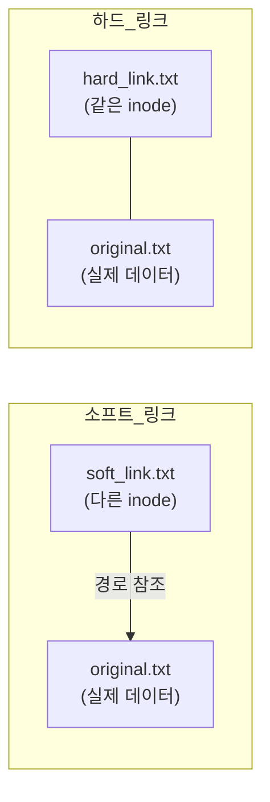

# 리눅스 입문 — Shell 과 File System

# 1장. 쉘 (Shell)

---

## 1.1 터미널과 쉘

### 터미널 (Terminal)

터미널은 사용자와 컴퓨터가 상호작용할 수 있도록 연결하는 장치다.

- **입력 장치**: 사용자가 컴퓨터에 명령을 전달하는 장치 (키보드)
- **출력 장치**: 컴퓨터가 사용자에게 결과를 보여주는 장치 (화면)

과거에는 물리적인 하드웨어 터미널이 존재했으나, 현재는 소프트웨어로 구현한 **가상 터미널(Virtual Terminal)** 을 사용한다.  
Ubuntu 24에서는 기본 터미널 프로그램으로 **GNOME Terminal** 을 제공한다.

> Ubuntu 24에서 터미널 여는 방법
>
> - 단축키: `Ctrl + Alt + T`
> - 앱 메뉴 → Terminal 검색
{: .prompt-tip }

---

### 쉘 (Shell)

쉘은 운영체제(OS)가 제공하는 **명령어 기반 인터페이스(CLI, Command Line Interface)** 다.


사용자가 터미널에 명령어를 입력하면, 쉘이 그 명령어를 해석하여 **커널(Kernel)** 에 전달하고, 실행 결과를 다시 터미널 화면으로 출력한다.


리눅스에서 가장 널리 사용하는 쉘은 **Bash (Bourne Again Shell)** 이다.  
리누스 토르발즈가 리눅스를 처음 개발할 때 포팅한 프로그램으로, Ubuntu의 기본 쉘이다.

**현재 사용 중인 쉘 확인 방법:**

```bash
echo $SHELL
# 출력 예: /bin/bash
```

---

### 터미널과 쉘의 관계 정리

|구분|역할|비유|
|---|---|---|
|터미널 (Terminal)|사용자와 컴퓨터가 상호작용하기 위한 매체 (입력/출력 도구)|창문|
|쉘 (Shell)|터미널로 들어온 명령어를 해석해 OS에 전달하는 프로그램|통역사|

---

## 1.2 쉘 스크립트

### 쉘 스크립트 (Shell Script) 란?

쉘 스크립트는 **쉘에서 실행 가능한 명령어를 순서대로 모아놓은 텍스트 파일**이다.

- 여러 명령어를 하나의 파일로 묶어 자동 실행할 수 있음
- 반복 작업을 자동화하는 데 활용
- 파일 확장자는 관례적으로 `.sh` 를 사용

---

### 실습: hello.sh 작성 : 그냥 따라해 보세요

```bash
nano hello.sh
```

```bash
#!/bin/bash
# #!/bin/bash 는 "이 스크립트를 /bin/bash 로 실행하라"는 선언(shebang)이다.
echo "안녕하세요, 리눅스!"
echo "현재 날짜: $(date)"       # $(명령어) 형식으로 명령어 결과를 문자열 안에 넣을 수 있다
echo "현재 경로: $(pwd)"
echo "현재 사용자: $(whoami)"
```

```bash
chmod +x hello.sh   # 실행 권한 추가 (없으면 ./hello.sh 실행 시 Permission denied)
./hello.sh          # 현재 디렉터리에서 직접 실행
```

---

## 1.3 기본 명령어

### man — 명령어 매뉴얼 조회

`man`은 리눅스에서 가장 먼저 배워야 할 명령어다. 모르는 명령어가 생기면 먼저 `man`으로 확인하는 습관을 들이자.

```bash
man ls              # ls 명령어 사용법 조회 (q 키로 종료)
man 5 passwd        # 5번 섹션(파일 형식)의 passwd 문서 조회
                    # man 1 passwd → 사용자 명령어 passwd
                    # man 5 passwd → /etc/passwd 파일 포맷 설명
```

---

### ls — 파일 목록 출력

```bash
ls -l               # 상세 정보 출력 (권한, 소유자, 크기, 날짜 등)
ls -a               # 숨김 파일(.으로 시작) 포함
ls -h               # 파일 크기를 읽기 쉬운 단위(K, M, G)로 표시
ls -t               # 수정 시간 기준 정렬 (최근 파일이 위)
ls -la              # 숨김 파일 포함 상세 목록 (가장 자주 사용)
ls -lh /etc         # /etc 디렉터리의 파일 크기를 읽기 쉽게 출력
```

|옵션|설명|
|---|---|
|`-l`|상세 정보 출력|
|`-a`|숨김 파일 포함|
|`-h`|파일 크기를 읽기 쉬운 단위로|
|`-t`|수정 시간 기준 정렬|

---

### cd — 디렉터리 이동

```bash
cd /var/log    # 절대 경로로 이동 (루트 / 기준)
cd ..          # 상위 디렉터리로 이동
cd ~           # 홈 디렉터리로 이동 (= /home/사용자명)
cd -           # 바로 이전 위치로 이동 (toggle처럼 동작)
```

---

### pwd — 현재 작업 디렉터리 출력

```bash
pwd
# 출력 예: /home/user
# Print Working Directory의 약자. 현재 내가 어디에 있는지 확인할 때 사용
```

---

### cat — 파일 내용 출력

```bash
cat hello.sh                          # 파일 내용을 화면에 출력
cat -n hello.sh                       # 줄 번호를 붙여서 출력
cat file1.txt file2.txt > merged.txt  # 두 파일을 합쳐 새 파일로 저장 (리다이렉션)
```

---

### echo — 문자열 출력

```bash
echo "Hello, Linux"   # 문자열 출력
echo $HOME            # 환경변수 값 출력: 홈 디렉터리 경로
echo $USER            # 현재 사용자 이름
echo $SHELL           # 로그인 셸 경로
echo $PATH            # 명령어 탐색 경로 목록 (콜론으로 구분)
echo $PWD             # 현재 작업 디렉터리 (pwd 명령어와 동일)
```

---

### mkdir / rmdir — 디렉터리 생성/삭제

```bash
mkdir -p fruits/apple   # -p: 중간 경로가 없으면 자동으로 함께 생성
rmdir -p a/b/c          # -p: 비어있는 디렉터리를 상위까지 연쇄 삭제
                        # 단, rmdir은 빈 디렉터리만 삭제 가능. 내용이 있으면 rm -r 사용
```

---

### cp / mv / rm — 파일 복사/이동/삭제

```bash
cp -r mydir/ /tmp/mydir_copy  # -r: 디렉터리 전체를 재귀적으로 복사
mv file1.txt renamed.txt       # 파일 이름 변경 (이동과 같은 명령어)
rm -rf mydir/                  # -r: 디렉터리 포함 재귀 삭제, -f: 확인 없이 강제 삭제
```

> `rm -rf /` 는 시스템 루트 전체를 삭제하는 **극도로 위험한 명령어**다.  
> 절대 실행해서는 안 된다. 실수로도 입력되지 않도록 주의할 것.
{: .prompt-danger }

---

### touch — 빈 파일 생성 / 타임스탬프 갱신

```bash
touch newfile.txt          # 빈 파일 생성 (이미 있으면 수정 시간만 갱신)
touch a.txt b.txt c.txt    # 여러 파일을 한 번에 생성
```

---

# 2장. 파일과 디렉터리

## 2.1 파일 시스템

**파일 시스템(File System)** 이란 운영체제가 디스크에 데이터를 저장하고 관리하는 방식이다.  
같은 파일이라도 OS마다 저장 형식이 다르기 때문에 USB를 포맷할 때 "FAT32", "NTFS" 등을 선택하게 된다.


| OS             | 주로 사용하는 파일 시스템     |
| -------------- | ------------------ |
| Linux (Ubuntu) | ext4               |
| Windows        | NTFS, FAT32, exFAT |
| macOS          | APFS, HFS+         |

리눅스에는 일반 디스크 파일 시스템 외에 **가상 파일 시스템**도 존재한다.  
가상 파일 시스템은 디스크가 아니라 메모리/커널 정보를 파일처럼 보여주는 특수한 구조다.

|경로|역할|
|---|---|
|`/proc`|실행 중인 프로세스 정보 (재부팅 시 초기화)|
|`/sys`|커널이 인식한 하드웨어 장치 정보|
|`/dev`|장치 파일 (디스크, 터미널 등을 파일로 접근)|

---

## 2.2 리눅스 파일 계층 구조 (FHS)

FHS(Filesystem Hierarchy Standard)는 리눅스에서 파일과 디렉터리를 어느 위치에 놓을지 정한 **표준 규칙**이다.  
이 규칙 덕분에 어떤 리눅스 배포판이든 `/etc`에 설정 파일이 있고, `/home`에 사용자 디렉터리가 있다.


```
/
├── bin       실행 파일 (ls, cp, mv 등 기본 명령어)
├── etc       시스템 전체 설정 파일
├── home      일반 사용자 홈 디렉터리 (/home/username)
├── proc      가상 파일 시스템 (프로세스 정보)
├── tmp       임시 파일 (재부팅 시 삭제됨)
├── usr       사용자용 실행 파일, 라이브러리
└── var       자주 변경되는 데이터 (로그, 캐시 등)
```

---

## 2.3 파일의 종류

리눅스에서 `ls -l` 명령을 실행하면 맨 앞에 한 글자가 표시되는데, 이것이 파일 종류를 나타낸다.

|표시 문자|파일 종류|
|---|---|
|`-`|일반 파일 (텍스트, 이미지, 실행 파일 등)|
|`d`|디렉터리|
|`l`|심볼릭 링크 (바로가기)|
|`c`|문자 장치 파일 (키보드, 시리얼 포트 등)|
|`b`|블록 장치 파일 (디스크, USB 등)|

---

## 2.4 소프트 링크와 하드 링크

리눅스에서 **링크(Link)** 란 하나의 파일에 여러 이름을 붙이거나 바로가기를 만드는 기능이다.  
Windows의 "바로가기"와 비슷하지만, 동작 방식이 두 가지로 나뉜다.




### 소프트 링크 (Symbolic Link, 심볼릭 링크)

Windows의 "바로가기"와 가장 유사한 개념이다.  
원본 파일의 **경로(Path)** 를 참조하므로, 원본이 삭제되면 링크가 깨진다.

```bash
ln -s original.txt soft_link.txt   # -s 옵션: soft(symbolic) 링크 생성
ls -l                               # soft_link.txt → original.txt 형태로 표시됨
```

- 원본 파일과 **다른 inode** 번호를 가짐
  
- 원본 삭제 시 **링크가 깨짐** (dangling link)
- 디렉터리에도 생성 가능
- 다른 파티션(파일 시스템)에도 생성 가능

### 하드 링크 (Hard Link)

원본 파일과 **동일한 inode** 를 공유하는 이름이다.  
"같은 파일에 이름이 두 개 달린 것"으로 이해하면 된다.

```bash
ln original.txt hard_link.txt        # -s 없이 ln 사용: 하드 링크 생성
ls -i original.txt hard_link.txt     # -i: inode 번호 표시 (두 파일이 같은 번호여야 정상)
```

- 원본과 **동일한 inode** 공유
  
- 원본 삭제해도 **데이터 유지** (inode 참조 수가 0이 될 때만 실제 삭제)
- **동일 파일 시스템 내에서만** 생성 가능
- 디렉터리에는 생성 불가 (일반적으로)

|비교 항목|소프트 링크|하드 링크|
|---|---|---|
|inode 공유 여부|X (별도 inode)|O (동일 inode)|
|원본 삭제 시|링크 깨짐|데이터 유지|
|디렉터리 연결|가능|불가|
|다른 파티션|가능|불가|

> inode(아이노드)란 파일의 실제 데이터 위치, 크기, 권한 등의 메타정보를 저장하는 구조체다.  
> 파일 이름은 inode를 가리키는 "라벨"일 뿐이며, 하드 링크는 같은 inode를 가리키는 라벨을 하나 더 추가하는 것이다.
{: .prompt-info }

---

### cp vs 하드 링크 차이

| 구분 | 설명 |
|---|---|
| `cp fileA fileB` | 내용을 **복사**해 새 파일 생성. 이후 독립적으로 동작 |
| `ln fileA fileB` | 같은 inode를 **공유**하는 이름 추가. 한쪽 수정 시 동기화 |

- `cp`: 새로운 inode와 데이터 블록 생성 → 완전히 독립된 파일
- `ln`: inode 번호 동일, 데이터 공유 → 한 곳을 수정하면 다른 이름으로 봐도 반영됨
- 하드 링크는 **같은 파일 시스템 내에서만**, 보통 **디렉터리에는 불가**

---

# 전체 명령어 요약

|명령어|기능|주요 옵션|
|---|---|---|
|`man`|매뉴얼 조회|섹션 번호|
|`ls`|파일 목록 출력|`-l` `-a` `-h` `-t`|
|`cd`|디렉터리 이동|`..` `~` `-`|
|`pwd`|현재 경로 출력|—|
|`cat`|파일 내용 출력|`-n`|
|`mkdir`|디렉터리 생성|`-p`|
|`cp`|파일 복사|`-r` `-i` `-p`|
|`mv`|파일 이동/이름 변경|`-i`|
|`rm`|파일 삭제|`-r` `-f`|
|`touch`|빈 파일 생성/타임스탬프 갱신|`-t`|
|`ln -s`|소프트 링크 생성|`-s`|
|`ln`|하드 링크 생성|—|
