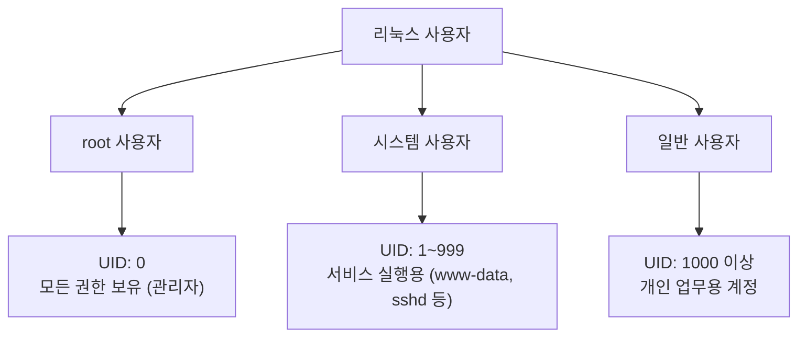
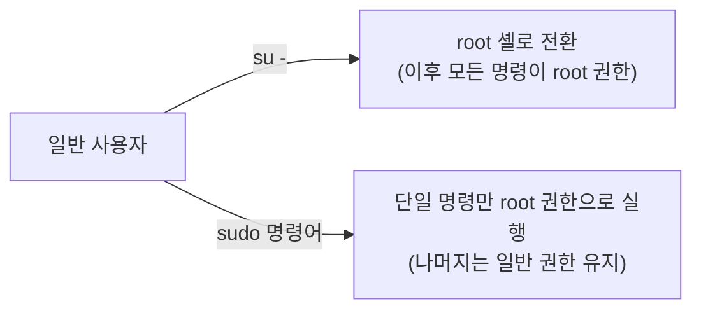
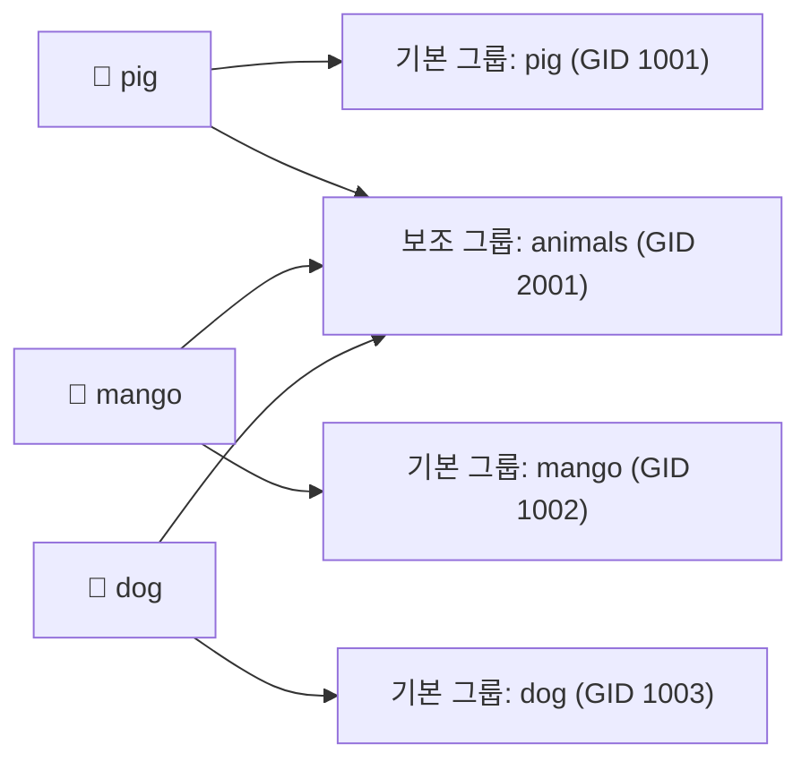
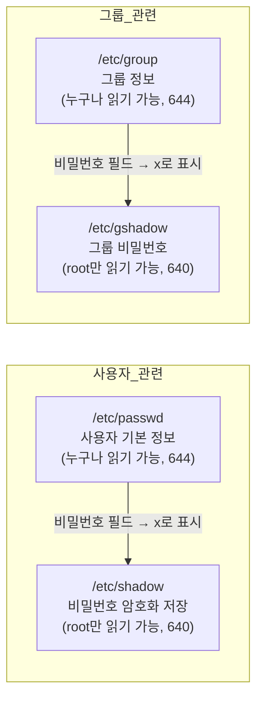

# 사용자 및 파일 권한 관리

# 1장. 사용자와 사용자 그룹

> **3주차 실습 진행 순서**  
> **Step 1 (이 문서, 3-1)** 사용자/그룹 생성 →  **Step 2 (3-2)** 소유권/권한 설정 →  **Step 3 (3-3)** 통합 실습 검증
{: .prompt-info }

---

## 1.1 사용자 (User)

### 1.1.1 사용자의 종류

리눅스는 **멀티유저(Multi-user) 운영체제**다.  
여러 사람이 동시에 접속하고 각자 다른 권한으로 작업할 수 있도록, 모든 계정에 고유한 **UID(User ID)** 를 부여한다.



| 사용자 종류 | UID 범위 | 설명 |
|---|---|---|
| **root 사용자** | 0 | 모든 권한을 가진 관리자 계정 |
| **시스템 사용자** | 1 ~ 999 | 서비스 실행용 계정 (예: `www-data`, `nobody`) |
| **일반 사용자** | 1000 이상 | 개인 사용 계정 |

> **UID(User ID)** 는 사용자를 구별하는 고유 숫자 식별자다.  
> 리눅스는 내부적으로 사용자 이름이 아니라 UID로 모든 권한 검사를 수행한다.  
> 즉, 이름이 달라도 UID가 같으면 같은 권한을 갖게 된다.
{: .prompt-info }

---

### 1.1.2 root 권한으로 명령을 실행하는 방법

일반 사용자 계정으로는 시스템 설정 파일을 수정하거나 패키지를 설치할 수 없다.  
root 권한이 필요한 작업을 수행하는 방법은 두 가지다.



#### ① su (Switch User) — 사용자 전환

```bash
su              # 현재 셸을 root 계정으로 전환 (환경변수는 현재 사용자 값 일부 유지)
su -            # root 로그인 셸로 완전히 전환 (환경변수, 홈 디렉터리 모두 root 기준으로 재설정)
                # 일반적으로 'su -' 를 사용하는 것이 더 안전하고 예측 가능함
su pig          # pig 사용자로 전환 (pig의 비밀번호 필요)
su - pig        # pig 로그인 셸로 완전히 전환 (실습 시 이 방식 권장)
```

| 명령 | 환경변수 | 작업 디렉터리 |
|---|---|---|
| `su` | 현재 사용자 환경 유지 | 현재 위치 유지 |
| `su -` | 대상 사용자 환경 새로 로드 | 대상 사용자 홈 디렉터리로 이동 |

> `su` 는 root 비밀번호를 직접 입력해야 한다.  
> 팀 환경에서 root 비밀번호를 공유하는 것은 보안상 좋지 않으므로, 실무에서는 `sudo` 를 더 많이 사용한다.
{: .prompt-warning }

#### ② sudo (SuperUser DO) — 단일 명령을 관리자 권한으로 실행

```bash
sudo apt update                      # 패키지 목록을 관리자 권한으로 갱신
sudo nano /etc/hosts                 # 시스템 설정 파일을 관리자 권한으로 편집
sudo -i                              # root 로그인 셸 시작 (여러 관리자 명령을 연속 실행할 때)
sudo -u pig cat /home/pig/file.txt   # root가 아닌 pig 권한으로 특정 명령만 실행
```


`sudo` 의 장점:
- root 비밀번호를 공유하지 않아도 됨
- 실행 기록이 `/var/log/auth.log` 에 남아 감사(audit) 가능


---

### 1.1.3 사용자 정보를 관리하는 /etc/passwd 파일

실습 계정 사전 준비:

```bash
# pig 계정이 없으면 새로 생성
sudo useradd -m -u 1001 -s /bin/bash pig
# -m: 홈 디렉터리 자동 생성
# -u 1001: UID를 1001로 지정
# -s /bin/bash: 로그인 셸을 bash로 지정

sudo passwd pig   # pig 계정에 비밀번호 설정 (이후 su - pig 로 전환 가능)
```

---


`/etc/passwd` 는 시스템에 존재하는 모든 사용자 계정 정보를 담고 있는 텍스트 파일이다.  
파일의 각 줄은 콜론(`:`)으로 구분된 **7개 필드**로 구성된다.

```
사용자이름 : 비밀번호 : UID : GID : 추가설명 : 홈디렉터리 : 로그인셸
```

실제 예시:

```
root:x:0:0:root:/root:/bin/bash
pig:x:1001:1001:,,,:/home/pig:/bin/bash
```

| 필드 번호 | 필드명 | 설명 |
|---|---|---|
| ① | 사용자 이름 | 최대 32자 |
| ② | 비밀번호 | `x` 표시 (실제 암호화된 비밀번호는 `/etc/shadow` 에 별도 저장) |
| ③ | UID | 사용자 ID (숫자) |
| ④ | GID | 기본 그룹 ID (숫자) |
| ⑤ | 추가 설명 | GECOS 필드 (이름, 연락처 등 자유 기술) |
| ⑥ | 홈 디렉터리 | 로그인 후 기본으로 위치하는 디렉터리 |
| ⑦ | 로그인 셸 | 로그인 시 실행되는 셸의 절대 경로 |

```bash
cat /etc/passwd                            # 전체 사용자 레코드 확인
grep "pig" /etc/passwd                     # pig 계정 라인만 필터링
awk -F: '{print $1, $3, $6}' /etc/passwd   # 콜론(:)을 구분자로 사용자명/UID/홈디렉터리만 출력
```

---

## 1.2 사용자 그룹 (Group)

리눅스에서 **그룹(Group)** 은 여러 사용자를 묶어서 파일 접근 권한을 한 번에 관리하기 위한 개념이다.  
각 사용자는 **기본 그룹(Primary Group)** 하나와 **보조 그룹(Supplementary Group)** 여러 개에 소속될 수 있다.



### /etc/group 파일

그룹 정보는 `/etc/group` 파일에 저장된다.

```
그룹이름 : 비밀번호 : GID : 사용자목록
```

```
sudo:x:27:pig,mango
animals:x:2001:pig,mango,dog
```

그룹 정보 확인:

```bash
cat /etc/group                  # 전체 그룹 목록 확인
grep animals /etc/group         # animals 그룹 정보만 필터링
id pig                          # pig의 UID, GID, 소속 그룹 전체 확인
groups pig                      # pig가 속한 그룹 이름만 확인
```

---

## 1.3 Step 1 실습: 사용자/그룹 실습 환경 준비

> 이 단계에서 만든 계정과 그룹을 3-2, 3-3 실습에서 그대로 사용한다.  
> 반드시 이 Step을 먼저 완료하고 다음 파일로 넘어갈 것.
{: .prompt-warning }

```bash
# 1) 실습 사용자 3명 생성
# adduser: useradd보다 사용하기 쉬운 대화형 계정 생성 명령어
# 비밀번호 입력 등 안내 메시지가 나오면 따라 입력하면 됨

sudo adduser pig      # pig 사용자 생성 (홈 디렉터리 /home/pig 자동 생성)
sudo adduser mango    # mango 사용자 생성
sudo adduser dog      # dog 사용자 생성

# 2) 공통 실습 그룹 생성 및 구성원 추가
sudo addgroup animals         # animals 그룹 생성
sudo adduser pig animals      # pig를 animals 그룹에 추가
sudo adduser mango animals    # mango를 animals 그룹에 추가
sudo adduser dog animals      # dog를 animals 그룹에 추가

# 3) 생성 결과 확인
id pig                        # uid=...(pig) gid=...(pig) groups=...,animals 형태로 출력되면 정상
id mango
id dog
grep '^animals:' /etc/group   # animals 그룹의 멤버 목록 확인 (^: 줄 시작을 의미)
```

예상 결과:

```text
$ id pig
uid=1001(pig) gid=1001(pig) groups=1001(pig),2001(animals)

$ grep '^animals:' /etc/group
animals:x:2001:pig,mango,dog
```

> **체크 포인트**: `pig`, `mango`, `dog` 가 모두 `animals` 보조 그룹에 포함되어야 한다.  
> 이 조건이 맞아야 3-2/3-3 권한 실습 결과가 동일하게 나온다.
{: .prompt-tip }

---

## 1.4 사용자/그룹 관련 주요 파일 정리



| 파일 | 권한 | 내용 |
|---|---|---|
| `/etc/passwd` | `644` | 사용자 이름, UID, GID, 홈 디렉터리, 셸 |
| `/etc/shadow` | `640` | 암호화된 비밀번호, 만료 정보 (root만 접근) |
| `/etc/group` | `644` | 그룹 이름, GID, 구성원 목록 |
| `/etc/gshadow` | `640` | 그룹 비밀번호 (root만 접근) |

```bash
# 네 파일의 권한을 한 번에 비교 확인
ls -la /etc/passwd /etc/shadow /etc/group /etc/gshadow
```

---

## 1.5 핵심 명령어 요약

| 명령어 | 기능 | 예시 |
|---|---|---|
| `su` | 사용자 전환 | `su - pig` |
| `sudo` | root 권한 명령 실행 | `sudo apt update` |
| `adduser` | 사용자 추가 (대화형) | `sudo adduser pig` |
| `deluser` | 사용자 삭제 | `sudo deluser pig` |
| `addgroup` | 그룹 추가 | `sudo addgroup animals` |
| `passwd` | 비밀번호 변경 | `sudo passwd pig` |
| `id` | UID/GID/그룹 정보 조회 | `id pig` |
| `groups` | 소속 그룹 조회 | `groups pig` |
