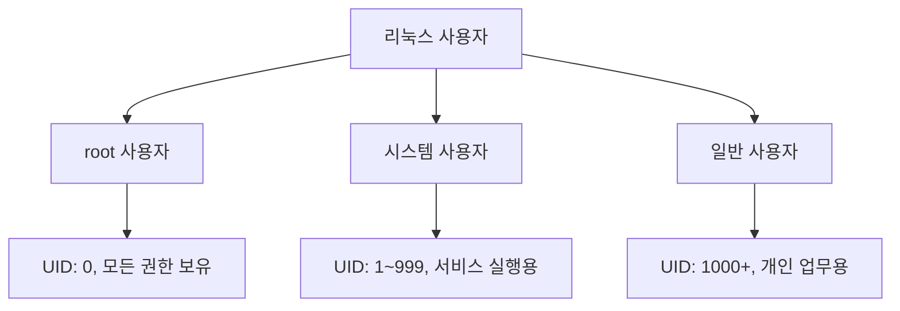
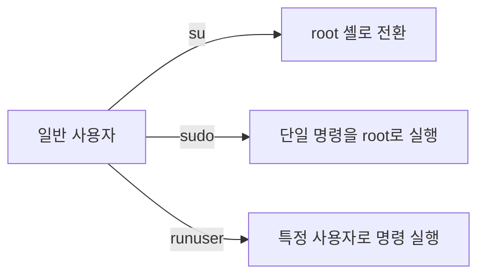
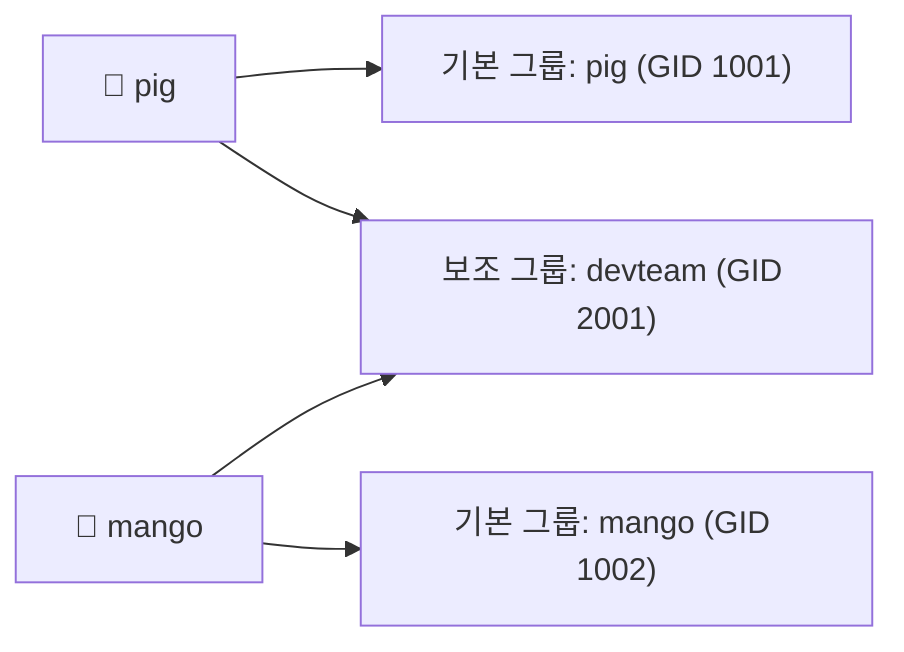
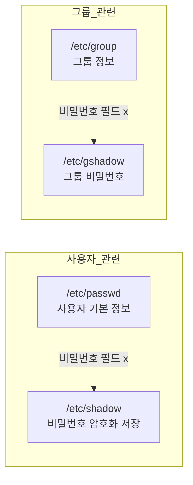

# 사용자 및 파일 권한 관리

# 1장. 사용자와 사용자 그룹

---

## 1.1 사용자 (User)

### 1.1.1 사용자의 종류



| 사용자 종류 | UID 범위 | 설명 |
|---|---|---|
| **root 사용자** | 0 | 모든 권한을 가진 관리자 계정 |
| **시스템 사용자** | 1 ~ 999 | 서비스 실행용 계정 (예: `www-data`) |
| **일반 사용자** | 1000 이상 | 개인 사용 계정 |

> 리눅스에서 UID(User ID)는 사용자를 구별하는 고유 숫자 식별자다. 내부적으로는 UID로 모든 권한 검사를 수행한다.
{: .prompt-info }

---

### 1.1.2 root 권한으로 명령을 실행하는 방법



#### ① su (Switch User)

```bash
su              # root 사용자로 전환
su -            # root 환경(환경변수 포함)으로 완전히 전환
su pig          # pig 사용자로 전환
su - pig        # pig 사용자의 로그인 환경으로 전환
```

| 명령 | 환경변수 | 작업 디렉터리 |
|---|---|---|
| `su` | 현재 사용자 환경 유지 | 현재 위치 유지 |
| `su -` | 대상 사용자 환경 새로 로드 | 대상 사용자 홈 디렉터리로 이동 |

> `su` 사용 시 root 비밀번호를 직접 입력해야 한다. 실무에서는 `sudo` 를 더 많이 사용한다.
{: .prompt-warning }

#### ② sudo (SuperUser DO)

```bash
sudo apt update
sudo nano /etc/hosts
sudo -i                             # root 로그인 셸로 전환
sudo -u pig cat /home/pig/file.txt  # pig 사용자 권한으로 명령 실행
```


`sudo` 장점: root 비밀번호 공유 불필요, 실행 기록이 `/var/log/auth.log` 에 남음.


---

### 1.1.3 사용자 정보를 관리하는 /etc/passwd 파일

들어가기 앞서

```bash
sudo useradd -m -u 1001 -s /bin/bash pig
sudo passwd pig
```

---


파일의 각 줄은 콜론(`:`)으로 구분된 **7개 필드**로 구성된다.

```
사용자이름 : 비밀번호 : UID : GID : 추가설명 : 홈디렉터리 : 로그인셸
```

```
root:x:0:0:root:/root:/bin/bash
pig:x:1001:1001:,,,:/home/pig:/bin/bash
```

| 필드 번호 | 필드명 | 설명 |
|---|---|---|
| ① | 사용자 이름 | 최대 32자 |
| ② | 비밀번호 | `x` (실제 비밀번호는 `/etc/shadow`) |
| ③ | UID | 사용자 ID |
| ④ | GID | 기본 그룹 ID |
| ⑤ | 추가 설명 | GECOS 필드 |
| ⑥ | 홈 디렉터리 | 로그인 후 기본 디렉터리 |
| ⑦ | 로그인 셸 | 실행되는 셸의 절대 경로 |

```bash
cat /etc/passwd
grep "pig" /etc/passwd
awk -F: '{print $1, $3, $6}' /etc/passwd
```

---

## 1.2 사용자 그룹 (Group)



### /etc/group 파일

```
그룹이름 : 비밀번호 : GID : 사용자목록
```

```
sudo:x:27:pig,mango
devteam:x:2001:pig,mango,dog
```

---

## 1.3 실습: 사용자와 사용자 그룹 다루기

### adduser / deluser — 사용자 추가/삭제

```bash
sudo adduser pig
sudo adduser mango
sudo adduser dog
sudo deluser dog
sudo deluser --remove-home dog
```

### addgroup / delgroup — 그룹 추가/삭제

```bash
sudo addgroup animals
sudo adduser pig animals
sudo delgroup animals
```

### passwd — 비밀번호 변경

| 옵션 | 설명 |
|---|---|
| `-l` | 계정 잠금 |
| `-u` | 계정 잠금 해제 |
| `-S` | 비밀번호 상태 조회 |

```bash
passwd              # 현재 사용자 비밀번호 변경
sudo passwd pig     # pig 비밀번호 변경
sudo passwd -l pig  # pig 계정 잠금
```

---

## 1.4 사용자/그룹 관련 주요 파일 정리



| 파일 | 권한 | 내용 |
|---|---|---|
| `/etc/passwd` | `644` | 사용자 이름, UID, GID, 홈디렉터리, 셸 |
| `/etc/shadow` | `640` | 암호화된 비밀번호, 만료 정보 |
| `/etc/group` | `644` | 그룹 이름, GID, 구성원 |
| `/etc/gshadow` | `640` | 그룹 비밀번호 |

```bash
ls -la /etc/passwd /etc/shadow /etc/group /etc/gshadow
```

---

## 1.5 특수 권한 비트 (SUID, SGID, Sticky bit)

일반 권한(`rwx`) 외에, 리눅스에는 실행/공유 동작을 제어하는 **특수 비트 3종**이 있다.

| 비트 | 숫자 | 주 사용 대상 | 핵심 효과 |
|---|---|---|---|
| SUID | 4xxx | 실행 파일 | 실행 시 **실행 사용자**가 아니라 **파일 소유자 권한**으로 동작 |
| SGID | 2xxx | 실행 파일, 디렉터리 | 실행 파일: 파일 그룹 권한으로 동작 / 디렉터리: 하위 파일의 그룹 상속 |
| Sticky bit | 1xxx | 디렉터리 | 공유 디렉터리에서 파일 소유자만 삭제/이름변경 가능 |

### 1.5.1 SUID (SetUID)

왜 필요한가?

- 일반 사용자가 root 소유 프로그램을 통해 제한된 관리자 기능(예: 비밀번호 변경)을 수행할 수 있게 한다.
- 대표 예시: `/usr/bin/passwd`

```bash
ls -l /usr/bin/passwd
# -rwsr-xr-x 1 root root ... /usr/bin/passwd
```

예상 화면 포인트

- 소유자 실행 비트 위치(`u+x`)가 `x` 대신 `s`로 보이면 SUID가 켜진 상태다.
- 위 예시는 `-rwsr-xr-x` 이므로 SUID 적용 상태다.

보안상 중요 포인트

- SUID 파일은 권한 상승 경로가 될 수 있으므로 최소화해야 한다.
- 불필요한 SUID는 제거하고 정기 점검한다.

```bash
# 시스템의 SUID 파일 점검(운영 환경에서는 결과 검토 필수)
find / -perm -4000 -type f 2>/dev/null
```

### 1.5.2 SGID (SetGID)

왜 필요한가?

- 협업 디렉터리에서 새 파일의 그룹을 자동 통일해 팀 작업 충돌을 줄인다.

```bash
# 공유 디렉터리에 SGID 설정
sudo mkdir -p /srv/project
sudo chown root:animals /srv/project
sudo chmod 2775 /srv/project
ls -ld /srv/project
# drwxrwsr-x ... root animals ... /srv/project
```

예상 화면 포인트

- 그룹 실행 비트 위치(`g+x`)가 `x` 대신 `s`로 보이면 SGID가 켜진 상태다.
- `pig`, `mango`가 만든 파일이 모두 `animals` 그룹으로 생성된다.

보안상 중요 포인트

- 협업 디렉터리에 SGID가 없으면 사용자 기본 그룹으로 파일이 생성되어 접근 불일치가 생긴다.
- 팀 디렉터리에는 SGID + 적절한 `umask` 정책을 같이 운영하는 것이 안전하다.

### 1.5.3 Sticky bit

왜 필요한가?

- `/tmp` 같은 공용 쓰기 디렉터리에서 사용자 간 파일 삭제/변조를 방지한다.

```bash
ls -ld /tmp
# drwxrwxrwt ... /tmp
```

예상 화면 포인트

- 기타 실행 비트 위치(`o+x`)가 `x` 대신 `t`로 보이면 Sticky bit가 켜진 상태다.
- `chmod 1777 /some/dir` 처럼 맨 앞자리 `1`로 설정한다.

보안상 중요 포인트

- 공유 디렉터리가 `777`이고 Sticky bit가 없으면 다른 사용자 파일 삭제가 가능하다.
- Sticky bit는 공유성은 유지하면서 삭제 공격 위험을 크게 낮춘다.

### 1.5.4 특수 비트 설정/해제 명령

```bash
# 숫자 표기
chmod 4755 file      # SUID
chmod 2755 dir       # SGID
chmod 1777 dir       # Sticky bit

# 기호 표기
chmod u+s file       # SUID 설정
chmod g+s dir        # SGID 설정
chmod +t dir         # Sticky bit 설정
chmod u-s file       # SUID 해제
chmod g-s dir        # SGID 해제
chmod -t dir         # Sticky bit 해제
```

---

## 1.6 핵심 명령어 요약

| 명령어 | 기능 | 예시 |
|---|---|---|
| `su` | 사용자 전환 | `su - pig` |
| `sudo` | root 권한 명령 실행 | `sudo apt update` |
| `adduser` | 사용자 추가 | `sudo adduser pig` |
| `deluser` | 사용자 삭제 | `sudo deluser pig` |
| `addgroup` | 그룹 추가 | `sudo addgroup animals` |
| `passwd` | 비밀번호 변경 | `sudo passwd pig` |
| `id` | UID/GID/그룹 정보 조회 | `id pig` |
| `groups` | 소속 그룹 조회 | `groups pig` |
| `chmod` | 일반/특수 권한 변경 | `chmod 1777 /tmp/shared` |
| `find` | SUID/SGID 파일 점검 | `find / -perm -4000 -type f 2>/dev/null` |
