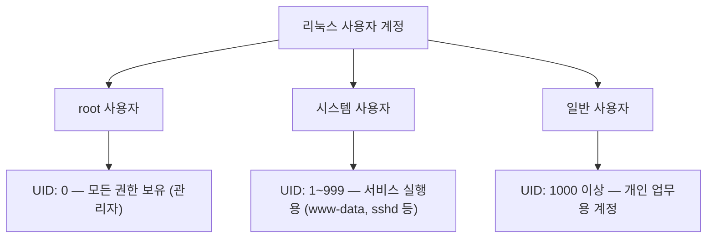
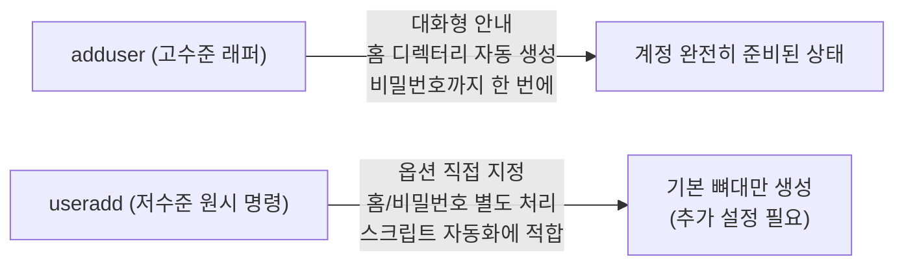
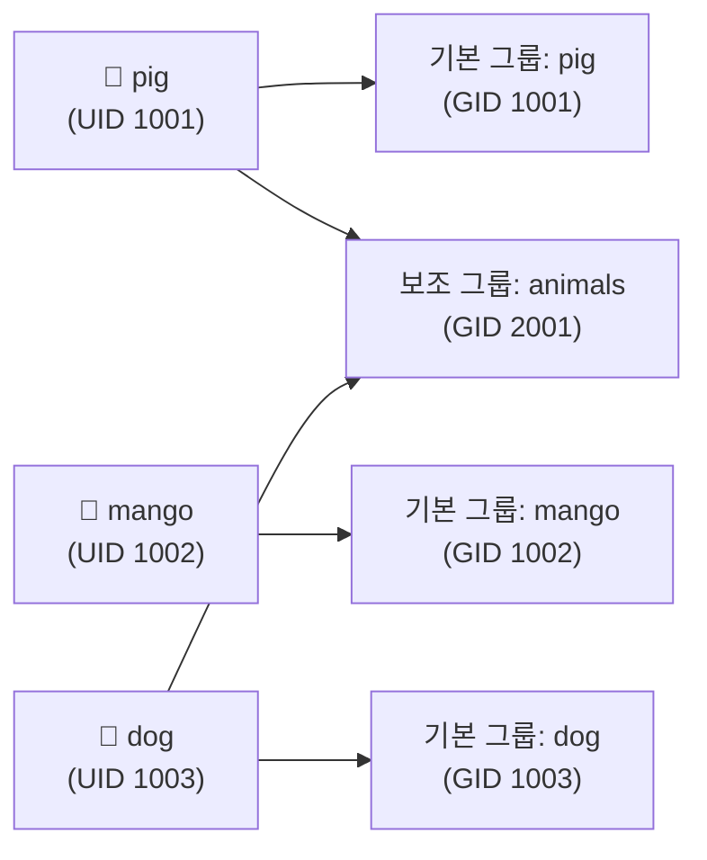
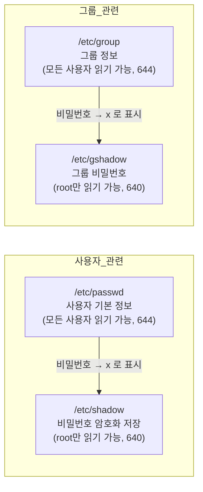
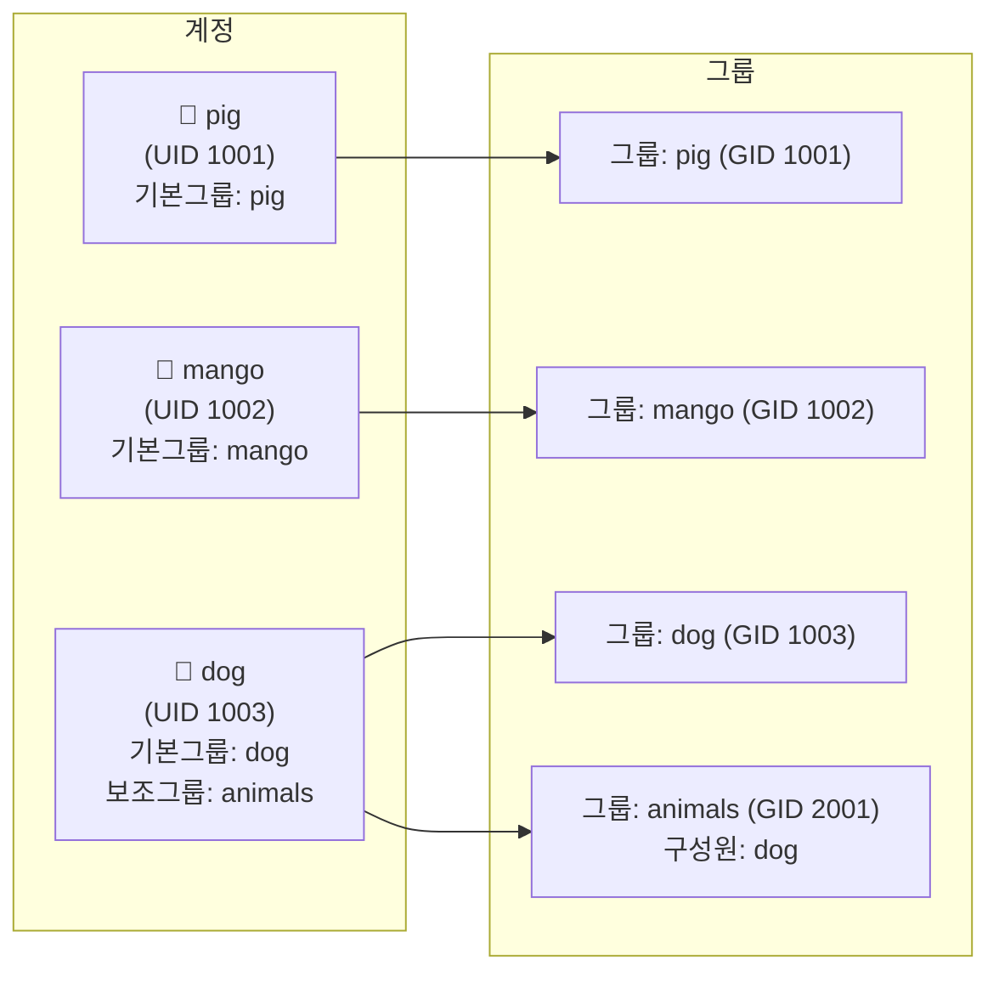

# 사용자 및 그룹 관리

---

# 1단계: 나만의 부캐 만들기 — 계정 생성·수정·삭제

리눅스는 **멀티유저(Multi-user) 운영체제**다.  
시스템에 접속하는 모든 주체는 **계정(Account)** 으로 관리되며, 각 계정에는 고유한 **UID(User ID)** 가 부여된다.  
UID 없이는 파일 소유권, 프로세스 실행 권한, 로그 추적이 전혀 불가능하다.



| 사용자 종류 | UID 범위 | 설명 |
|---|---|---|
| **root** | 0 | 모든 권한을 가진 관리자 계정 |
| **시스템 사용자** | 1 ~ 999 | 서비스 실행용 (예: `www-data`, `nobody`) |
| **일반 사용자** | 1000 이상 | 개인 사용 계정 |

> **UID(User ID)** 는 사용자를 구별하는 고유 숫자 식별자다.  
> 리눅스는 내부적으로 사용자 이름이 아니라 UID로 모든 권한 검사를 수행한다.  
> 즉, 이름이 달라도 UID가 같으면 같은 권한을 갖는다.
{: .prompt-info }

---

## 1.1 adduser vs useradd — 어떤 걸 써야 할까?

계정 생성 명령어는 두 가지가 있다.  
초보자에게는 `adduser` 가 훨씬 안전하고 편리하다.



| 비교 항목 | `adduser` | `useradd` |
|---|---|---|
| 홈 디렉터리 자동 생성 | ✅ | ❌ (옵션 `-m` 필요) |
| 비밀번호 설정 | ✅ 생성 중 안내 | ❌ (`passwd` 별도 실행) |
| 초보자 편의성 | ✅ 대화형 | ❌ 옵션 암기 필요 |
| 스크립트 자동화 | △ (대화형이라 불편) | ✅ 적합 |

> 실습 수업에서는 `adduser` 를 기본으로 사용한다.  
> `useradd` 는 비밀번호, 홈 디렉터리 등 모든 옵션을 직접 지정해야 하므로, 빠뜨리면 로그인 불가 상태가 될 수 있다.
{: .prompt-warning }

---

## 1.2 계정 생성: adduser

```bash
sudo adduser pig
# 실행하면 아래와 같은 대화형 안내가 나타남:
#   Adding user 'pig' ...
#   Enter new UNIX password:      ← 비밀번호 입력 (입력해도 화면에 표시 안 됨)
#   Retype new UNIX password:     ← 비밀번호 재확인
#   Full Name []:                 ← 그냥 Enter 눌러도 됨
#   Enter the new value, ...      ← 전부 Enter로 건너뜀
#   Is the information correct? [Y/n]  ← Y 입력 후 Enter
```

**예상 화면:**

```text
$ sudo adduser pig
Adding user 'pig' ...
Adding new group 'pig' (1001) ...
Adding new user 'pig' (1001) with group 'pig' ...
Creating home directory '/home/pig' ...
Copying files from '/etc/skel' ...
New password:
Retype new password:
passwd: password updated successfully
Changing the user information for pig
Enter the new value, or press ENTER for the default
        Full Name []:
        Room Number []:
        Work Phone []:
        Home Phone []:
        Other []:
Is the information correct? [Y/n] Y
```

> `adduser` 는 계정 생성과 동시에 **같은 이름의 기본 그룹(pig)** 도 자동으로 만들어 준다.
{: .prompt-tip }

---

## 1.3 계정 생성 결과 확인: /etc/passwd

`/etc/passwd` 는 시스템에 존재하는 모든 사용자 계정 정보를 담고 있는 텍스트 파일이다.  
각 줄은 콜론(`:`)으로 구분된 **7개 필드**로 구성된다.

```
사용자이름 : 비밀번호 : UID : GID : 추가설명(GECOS) : 홈디렉터리 : 로그인셸
```

```bash
cat /etc/passwd
# 또는 pig 행만 확인
grep "^pig:" /etc/passwd
```

**예상 화면:**


```text
$ grep "^pig:" /etc/passwd
pig:x:1001:1001:,,,:/home/pig:/bin/bash
    │  │    │    │   │          └─ 로그인 셸
    │  │    │    │   └─ GECOS(추가설명, 현재 비어있음)
    │  │    │    └─ GID 1001 (기본 그룹 ID)
    │  │    └─ UID 1001
    │  └─ x (비밀번호는 /etc/shadow에 암호화 저장)
    └─ 사용자 이름
```

| 필드 | 설명 |
|---|---|
| ① 사용자 이름 | 로그인 이름 (최대 32자) |
| ② 비밀번호 | `x` — 실제 암호화 값은 `/etc/shadow` 에 별도 저장 |
| ③ UID | 사용자 ID (숫자) |
| ④ GID | 기본 그룹 ID (숫자) |
| ⑤ GECOS | 이름·연락처 등 자유 기술 (비워도 됨) |
| ⑥ 홈 디렉터리 | 로그인 후 기본 위치 |
| ⑦ 로그인 셸 | 로그인 시 실행되는 셸 절대 경로 |

> UID가 `1000번대` 인지 확인하는 것이 이번 미션의 핵심이다.  
> `1000` 미만이면 시스템 계정으로 분류된다.
{: .prompt-tip }

---

## 1.4 계정 정보 수정: usermod

계정을 만든 후 설명(Comment), 셸, 홈 디렉터리 등 속성을 변경할 때 사용한다.

```bash
# GECOS(추가설명) 필드 수정: -c 옵션
# General Electric Comprehensive Operating System
sudo usermod -c "Pink Pig" pig

# 변경 결과 확인
grep "^pig:" /etc/passwd
```

**예상 화면:**

```text
$ grep "^pig:" /etc/passwd
pig:x:1001:1001:Pink Pig:/home/pig:/bin/bash
                 ↑ GECOS 필드에 "Pink Pig" 가 반영됨
```

자주 쓰는 `usermod` 옵션:

| 옵션             | 의미           | 예시                                 |
| -------------- | ------------ | ---------------------------------- |
| `-c "설명"`      | GECOS 필드 변경  | `sudo usermod -c "Pink Pig" pig`   |
| `-s /bin/sh`   | 로그인 셸 변경     | `sudo usermod -s /bin/sh pig`      |
| `-d /home/new` | 홈 디렉터리 경로 변경 | `sudo usermod -d /home/newpig pig` |
| `-l newname`   | 로그인 이름 변경    | `sudo usermod -l newpig pig`       |
| `-aG 그룹명`      | 보조 그룹 추가     | `sudo usermod -aG animals pig`     |

> `-aG` 옵션에서 **`-a` (append) 를 반드시 함께** 써야 한다.  
> `-G` 만 쓰면 기존 보조 그룹이 모두 제거되고 지정한 그룹만 남는다.
{: .prompt-danger }

---

## 1.5 비밀번호 설정: passwd

```bash
sudo passwd pig          # root가 pig의 비밀번호를 강제 설정 (현재 비밀번호 묻지 않음)
passwd                   # 현재 로그인한 본인의 비밀번호를 변경 (현재 비밀번호 확인 후 변경)
```

비밀번호 정보는 `/etc/shadow` 에 암호화되어 저장된다.  
이 파일은 root만 읽을 수 있어서 일반 사용자는 직접 확인 불가하다.

```bash
sudo cat /etc/shadow | grep "^pig:"
# 출력 예: pig:$6$randomsalt$hashedpassword...:19786:0:99999:7:::
#           ↑ $6$ → SHA-512 해시 알고리즘으로 암호화된 값
```

---

## 1.6 계정 삭제: deluser

```bash
sudo deluser pig                   # pig 계정만 삭제 (홈 디렉터리와 파일은 유지)
sudo deluser --remove-home pig     # pig 계정 삭제 + 홈 디렉터리(/home/pig) 함께 삭제

# 별도로 home/pig 를 지우려면 sudo rm -r /home/pig
```

**예상 화면:**

```text
$ sudo deluser --remove-home pig
Looking for files to backup/remove ...
Removing files ...
Removing crontab ...
Removing user 'pig' ...
Warning: group 'pig' has no more members.
Done.
```

삭제 후 확인:

```bash
grep "^pig:" /etc/passwd   # 아무것도 출력되지 않으면 정상적으로 삭제된 것
ls /home/pig               # --remove-home 옵션 사용 시 "No such file or directory" 가 나와야 정상
```

> 이번 미션은 삭제 후 다음 미션을 위해 **pig 계정을 다시 만들어야 한다**.  
> `sudo adduser pig` 로 재생성하고 진행할 것.
{: .prompt-warning }

---

## 1.7 1단계 실습 미션

아래 4단계를 순서대로 직접 실행해 보자.

```bash
# ① pig 계정 생성
sudo adduser pig
# 비밀번호 입력 안내에서 원하는 비밀번호 설정 (예: pig1234)

# ② UID가 1000번대인지 확인
grep "^pig:" /etc/passwd
# 출력에서 세 번째 콜론 사이 숫자가 1000 이상인지 확인

# ③ GECOS(추가설명) 수정
sudo usermod -c "Pink Pig" pig
grep "^pig:" /etc/passwd
# 네 번째 필드에 "Pink Pig" 가 보이면 성공

# ④ 계정 삭제 (홈 디렉터리 포함)
sudo deluser --remove-home pig
grep "^pig:" /etc/passwd
# 아무것도 출력되지 않으면 삭제 성공

# ⑤ 다음 단계를 위해 pig 재생성
sudo adduser pig
```

---

# 2단계: 끼리끼리 모이기 — 그룹 관리

리눅스에서 **그룹(Group)** 은 여러 사용자를 묶어 파일 접근 권한을 한 번에 관리하는 단위다.  
10명에게 같은 권한을 주려면 파일마다 10번 설정하는 대신, 그룹 하나에 묶고 그룹 권한을 한 번만 설정하면 된다.



각 사용자는 **기본 그룹(Primary Group)** 하나와 **보조 그룹(Supplementary Group)** 여러 개에 소속될 수 있다.

---

## 2.1 그룹 생성: groupadd / addgroup

```bash
sudo groupadd animals      # animals 그룹 생성 (저수준 명령)
# 또는
sudo addgroup animals      # animals 그룹 생성 (고수준, adduser와 짝)
```

**예상 화면:**

```text
$ sudo addgroup animals
Adding group 'animals' (GID 2001) ...
Done.
```

생성 결과 확인:

```bash
grep "^animals:" /etc/group
# 출력 예: animals:x:2001:
#           그룹이름:비밀번호:GID:구성원목록 (아직 비어있음)
```

---

## 2.2 사용자 추가 후 그룹 등록

2단계 미션 시나리오: `mango`, `dog` 계정을 만들고, `dog` 만 `animals` 그룹에 추가한다.

```bash
# mango, dog 계정 생성
sudo adduser mango
sudo adduser dog

# dog만 animals 그룹에 추가
# 방법 1: adduser 명령 (직관적, 초보자 권장)
sudo adduser dog animals

# 방법 2: usermod -aG (스크립트/자동화 시 사용)
# sudo usermod -aG animals dog

# 결과 확인
groups dog
# 출력 예: dog : dog animals
# dog의 기본 그룹(dog)과 보조 그룹(animals)이 모두 보임

groups mango
# 출력 예: mango : mango
# mango는 animals에 없음을 확인
```

**예상 화면:**

```text
$ groups dog
dog : dog animals

$ groups mango
mango : mango
```

- `mango` — 계정 생성 시 자동 생성되는 **기본 그룹(primary group)**
- `users` — `adduser.conf`에 의해 자동 추가된 **보조 그룹(supplementary group)**


---

## 2.3 그룹 정보 파일: /etc/group

그룹 정보는 `/etc/group` 파일에 저장된다.

```
그룹이름 : 비밀번호 : GID : 구성원목록
```

```bash
cat /etc/group
grep "^animals:" /etc/group
```

**예상 화면:**

```text
$ grep "^animals:" /etc/group
animals:x:2001:dog
              ↑ dog만 보조 그룹 구성원으로 등록됨
```

> `pig` 와 `mango` 는 이 목록에 없어야 정상이다.  
> 만약 보인다면 실수로 추가된 것이므로 `sudo deluser pig animals` 로 제거한다.
{: .prompt-tip }

---

## 2.4 계정/그룹 관련 주요 파일 정리



| 파일 | 권한 | 내용 |
|---|---|---|
| `/etc/passwd` | `644` | 사용자 이름, UID, GID, 홈, 셸 |
| `/etc/shadow` | `640` | 암호화된 비밀번호, 만료 정보 (root만 접근) |
| `/etc/group` | `644` | 그룹 이름, GID, 구성원 목록 |
| `/etc/gshadow` | `640` | 그룹 비밀번호 (root만 접근) |

```bash
# 네 파일 권한 한 번에 비교
ls -la /etc/passwd /etc/shadow /etc/group /etc/gshadow
```


---

## 2.5 2단계 실습 미션

```bash
# ① animals 그룹 생성
sudo addgroup animals

# ② mango, dog 계정 생성
sudo adduser mango
sudo adduser dog

# ③ dog만 animals 그룹에 추가
sudo adduser dog animals

# ④ 소속 그룹 확인
groups dog
# 출력에 "animals" 가 포함되어야 함

groups mango
# 출력에 "animals" 가 없어야 함

grep "^animals:" /etc/group
# 출력: animals:x:2001:dog
# mango는 없어야 하고, dog만 있어야 함
```

---

## 2.6 핵심 명령어 요약

| 명령어 | 기능 | 예시 |
|---|---|---|
| `adduser` | 사용자 추가 (대화형) | `sudo adduser pig` |
| `useradd -m -s /bin/bash` | 사용자 추가 (스크립트용) | `sudo useradd -m -s /bin/bash pig` |
| `usermod -c` | GECOS 설명 수정 | `sudo usermod -c "Pink Pig" pig` |
| `usermod -aG` | 보조 그룹 추가 | `sudo usermod -aG animals dog` |
| `deluser --remove-home` | 계정+홈 디렉터리 삭제 | `sudo deluser --remove-home pig` |
| `passwd` | 비밀번호 설정 | `sudo passwd pig` |
| `addgroup` | 그룹 생성 | `sudo addgroup animals` |
| `groups` | 소속 그룹 확인 | `groups dog` |
| `id` | UID/GID/그룹 전체 확인 | `id dog` |

---

## 3주차 실습 환경 현재 상태




> 체크 포인트:  
> - `groups dog` 출력에 `animals` 가 있어야 한다.  
> - `groups mango` 출력에 `animals` 가 없어야 한다.  
> - `grep "^animals:" /etc/group` 출력에 `dog` 만 있어야 한다.
{: .prompt-tip }
