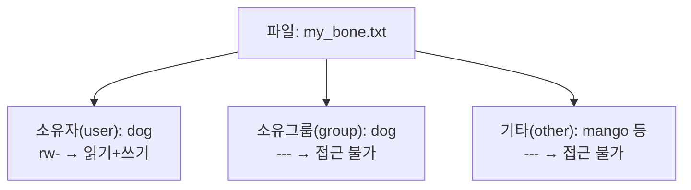
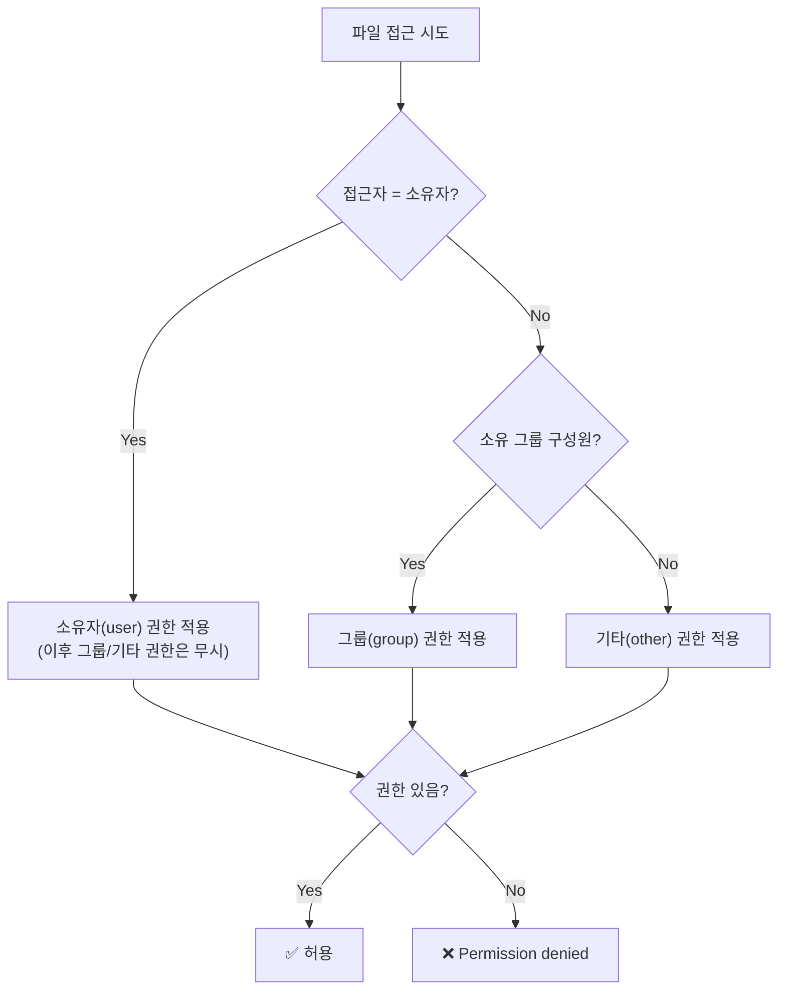
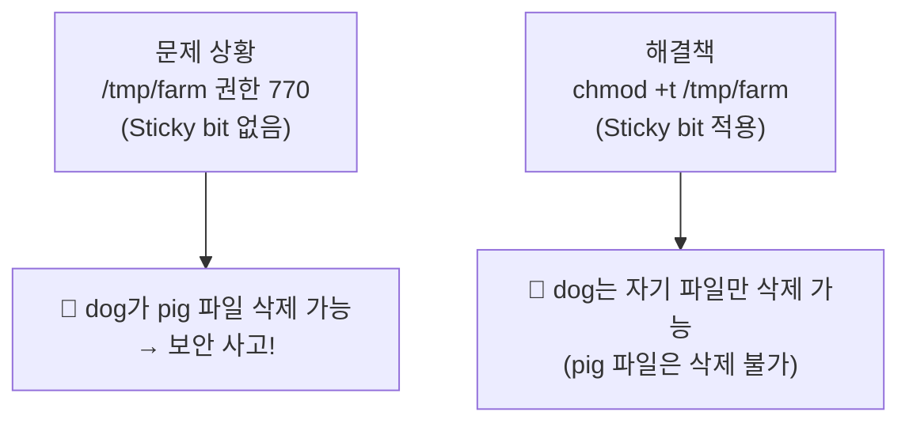
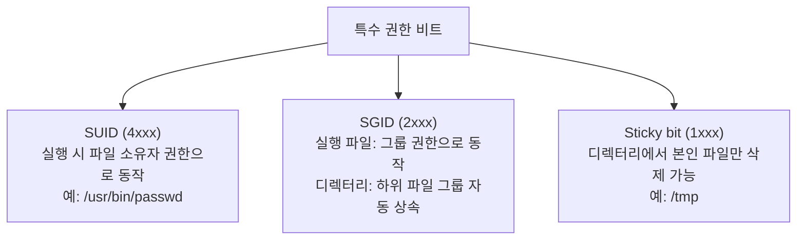
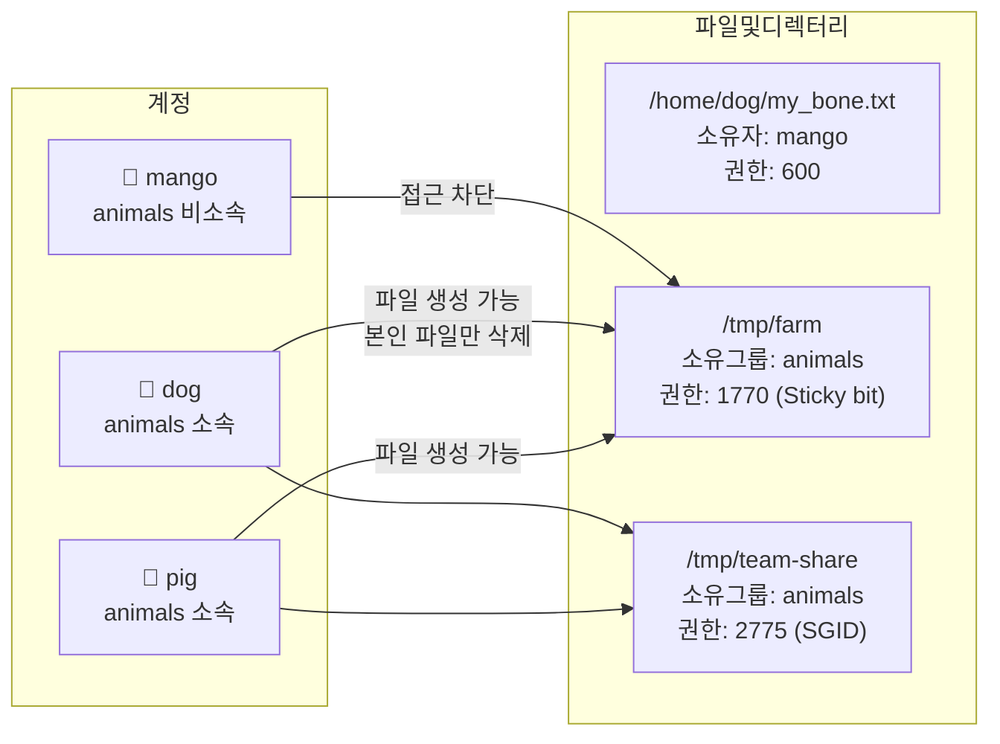

# 소유권과 파일 권한

> **이 문서(3-2)는 3-1 실습이 완료된 상태에서 시작한다.**  
> 아직 `pig`, `mango`, `dog` 계정과 `animals` 그룹을 만들지 않았다면 3-1로 돌아갈 것.  
> 현재 상태: `dog` 는 `animals` 그룹 소속, `mango` 는 미소속.
{: .prompt-warning }

---

# 3단계: 내 물건 건들지 마! — 기본 권한 chmod·chown

리눅스에서 모든 파일과 디렉터리에는 **소유자(Owner)**, **소유 그룹(Group)**, **기타(Other)** 세 범주에 대해 각각 읽기(r)/쓰기(w)/실행(x) 권한이 설정된다.



---

## 3.1 권한 표시 읽는 법

`ls -l` 출력의 맨 앞 10자리가 파일 종류와 권한을 나타낸다.

```
- r w x r - x r - -
↑ ↑↑↑ ↑↑↑ ↑↑↑
│ └─┬─┘ └─┬─┘ └─┬─┘
│  소유자  소유그룹  기타
└ 파일종류 (- 일반, d 디렉터리, l 링크)
```

| 기호 | 파일에서의 의미 | 디렉터리에서의 의미 |
|---|---|---|
| `r` | 내용 읽기 (`cat`, `less`) | 목록 조회 (`ls`) |
| `w` | 내용 수정/삭제 | 파일 생성/삭제 |
| `x` | 실행 (스크립트, 바이너리) | 진입 (`cd`) |
| `-` | 해당 권한 없음 | 해당 권한 없음 |

> 디렉터리에서 `x` 가 없으면 `cd` 로 진입 자체가 불가능하다.  
> `w` 만 있고 `x` 가 없으면 쓰기 권한이 있어도 아무것도 할 수 없다.
{: .prompt-tip }

---

## 3.2 권한 체크 흐름



> 권한 검사는 **소유자 → 그룹 → 기타 순서로 한 번만** 적용된다.  
> 소유자에게 권한이 없으면 그룹 권한은 검사하지 않는다.
{: .prompt-info }

---

## 3.3 chmod — 권한 변경

### ① 8진수 표기법

`r=4`, `w=2`, `x=1` 로 정의하고, 세 범주(소유자/그룹/기타)의 값을 각각 더해서 세 자리로 표기한다.

| 권한 조합 | 계산 | 8진수 |
|---|---|---|
| `---` | 0+0+0 | 0 |
| `r--` | 4+0+0 | 4 |
| `r-x` | 4+0+1 | 5 |
| `rw-` | 4+2+0 | 6 |
| `rwx` | 4+2+1 | 7 |

```bash
chmod 600 my_bone.txt    # rw-------  소유자만 읽기+쓰기, 나머지는 완전 차단
chmod 644 readme.txt     # rw-r--r--  소유자 읽기+쓰기, 그룹/기타는 읽기만
chmod 755 run.sh         # rwxr-xr-x  소유자 전체 권한, 그룹/기타는 읽기+실행
```

**자주 쓰는 권한 조합:**

| 권한값 | 기호 표시 | 사용 상황 |
|---|---|---|
| `600` | `rw-------` | 개인 키, 비밀 파일 |
| `644` | `rw-r--r--` | 일반 텍스트/설정 파일 |
| `700` | `rwx------` | 개인 스크립트 |
| `755` | `rwxr-xr-x` | 실행 파일, 공개 디렉터리 |

### ② 기호 표기법

숫자를 외우기 어려울 때 `u/g/o/a` 와 `+/-/=` 를 조합해 사용한다.

```bash
chmod u+x run.sh        # 소유자(u)에게 실행(x) 추가(+)
chmod g-w config.txt    # 그룹(g)의 쓰기(w) 제거(-)
chmod o-r private.txt   # 기타(o) 읽기(r) 제거
chmod a+x all_run.sh    # 전체(a: all)에게 실행 추가
chmod u=rw,go=r file    # 소유자는 rw, 그룹/기타는 r 으로 정확히 지정(=)
```

---

## 3.4 chown — 소유권 변경

```bash
sudo chown pig file.txt              # 소유자만 pig로 변경
sudo chown pig:animals file.txt      # 소유자+소유그룹 동시 변경
sudo chown :animals file.txt         # 소유그룹만 변경 (소유자는 유지)
sudo chown -R pig:animals mydir/     # 디렉터리 내부 전체에 재귀 적용
```

> `chown` 은 root 또는 현재 파일 소유자만 실행 가능하다.  
> 일반 사용자가 타인 파일의 소유권을 임의로 바꿀 수 없다.
{: .prompt-warning }

---

## 3.5 3단계 실습 미션

**시나리오**: `dog` 가 자기 파일을 만들고, `mango` 가 열어보려 하면 막히는 것을 확인한다.  
그 후 관리자가 소유권을 `mango` 에게 넘겨준다.

```bash
# ① dog 계정으로 전환 후 파일 생성
su - dog
# 프롬프트가 "dog@..." 형태로 바뀌면 전환 성공

echo "I am dog's bone" > my_bone.txt    # dog 계정으로 파일 생성
ls -l my_bone.txt                        # 기본 권한 확인
```

**예상 화면:**

```text
$ su - dog
dog@ubuntu:~$ echo "I am dog's bone" > my_bone.txt
dog@ubuntu:~$ ls -l my_bone.txt
-rw-rw-r-- 1 dog dog 16 Mar 19 09:10 my_bone.txt
             ↑ 기본 생성 시 664 (umask 002 기준)
```

```bash
# ② 권한 600으로 좁히기 (나만 읽고 쓰기)
chmod 600 my_bone.txt
ls -l my_bone.txt
```

**예상 화면:**

```text
dog@ubuntu:~$ chmod 600 my_bone.txt
dog@ubuntu:~$ ls -l my_bone.txt
-rw------- 1 dog dog 16 Mar 19 09:10 my_bone.txt
 ↑ rw------- : 소유자(dog)만 읽기+쓰기, 나머지는 완전 차단
```

```bash
exit
# dog 세션 종료, 원래 사용자로 복귀
```

```bash
# ③ mango로 전환해서 파일 열기 시도
su - mango
cat /home/dog/my_bone.txt
```

**예상 화면:**

```text
$ su - mango
mango@ubuntu:~$ cat /home/dog/my_bone.txt
cat: /home/dog/my_bone.txt: Permission denied
```

> `Permission denied` 가 나와야 정상이다.  
> 파일 권한 `600` 이 정확히 동작하고 있다는 증거다.
{: .prompt-info }

```bash
exit
# mango 세션 종료
```

```bash
# ④ 관리자 권한으로 소유권을 mango에게 넘기기
sudo chown mango /home/dog/my_bone.txt
sudo chmod o+x /home/dog # 해당 디렉토리도 같이 접근 권한이 되어야 함. 
ls -l /home/dog/my_bone.txt
```

**예상 화면:**

```text
$ sudo chown mango /home/dog/my_bone.txt
$ sudo chmod o+x /home/dog
$ ls -l /home/dog/my_bone.txt
-rw------- 1 mango dog 16 Mar 19 09:10 my_bone.txt
             ↑ 소유자가 dog에서 mango로 변경됨
             (권한 600은 그대로이므로 이제 mango만 읽기+쓰기 가능)
```

---

# 4단계: 공동 구역 만들기 — 디렉터리 권한과 Sticky bit

협업 환경에서는 여러 사람이 같은 디렉터리를 사용한다.  
잘못 설정하면 `dog` 가 `pig` 의 파일을 삭제할 수 있다는 심각한 보안 사고가 발생한다.



---

## 4.1 공용 폴더 생성 및 그룹 기반 접근 제어

**시나리오**: `/tmp/farm` 은 `animals` 그룹 전용 공용 폴더다.  
`pig`, `dog` 는 사용 가능하고, `mango` 는 차단한다.  
(현재 `dog` 만 `animals` 소속이므로, `pig` 도 먼저 추가해야 한다.)

```bash
# pig도 animals 그룹에 추가 (3-1에서 건너뛴 경우)
sudo adduser pig animals

# 만약 그룹에 넣지 않았다면 sudo usermod -aG animals pig

# 공용 폴더 생성
sudo mkdir /tmp/farm

# 소유그룹을 animals로 설정
sudo chown root:animals /tmp/farm

# 권한 770: 소유자(root)+그룹(animals)은 모든 권한, 기타는 완전 차단
sudo chmod 770 /tmp/farm

# 결과 확인
ls -ld /tmp/farm
```

**예상 화면:**

```text
$ ls -ld /tmp/farm
drwxrwx--- 2 root animals ... /tmp/farm
 ↑ rwxrwx--- : 소유자/그룹 전체 권한, 기타(other)는 --- (완전 차단)
```

```bash
# mango(animals 비소속)가 접근 시도 → 차단 확인
su - mango
ls /tmp/farm
```

**예상 화면:**

```text
mango@ubuntu:~$ ls /tmp/farm
ls: cannot open directory '/tmp/farm': Permission denied
```

```bash
exit
# mango 세션 종료
```

---

## 4.2 문제 발생: Sticky bit 없으면 남의 파일을 지울 수 있다

디렉터리의 `w` 권한은 그 안에 **파일을 생성하거나 삭제할 수 있는 권한**이다.  
즉, `animals` 그룹에 속하면 `/tmp/farm` 안에서 **다른 사람이 만든 파일도 삭제 가능**하다.

```bash
# pig가 파일 생성
su - pig
echo "pig's food" > /tmp/farm/pig_food.txt
ls -l /tmp/farm
exit
```

**예상 화면:**

```text
$ su - pig
pig@ubuntu:~$ echo "pig's food" > /tmp/farm/pig_food.txt
pig@ubuntu:~$ ls -l /tmp/farm
-rw-rw-r-- 1 pig pig ... pig_food.txt
pig@ubuntu:~$ exit
```

```bash
# dog가 pig의 파일을 삭제 시도 (Sticky bit 없는 상태)
su - dog
rm /tmp/farm/pig_food.txt    # dog는 animals 그룹 멤버 → 삭제 가능!
ls /tmp/farm                 # 아무것도 없으면 삭제된 것
exit
```

**예상 화면:**

```text
$ su - dog
dog@ubuntu:~$ rm /tmp/farm/pig_food.txt
dog@ubuntu:~$ ls /tmp/farm
(아무것도 없음)
dog@ubuntu:~$ exit
```

> `dog` 가 `pig` 의 파일을 지웠다.  
> 이것이 Sticky bit가 없을 때 발생하는 **보안 취약점**이다.
{: .prompt-danger }

---

## 4.3 해결책: Sticky bit 적용

**Sticky bit (t)** 를 디렉터리에 설정하면, **파일 소유자 본인과 root 만 삭제 가능**해진다.

```bash
# Sticky bit 적용
sudo chmod +t /tmp/farm
# 또는 8진수로: sudo chmod 1770 /tmp/farm

# 결과 확인
ls -ld /tmp/farm
```

**예상 화면:**

```text
$ ls -ld /tmp/farm
drwxrwx--T 2 root animals ... /tmp/farm
         ↑ T: Sticky bit 적용됨 (기타 실행 비트 자리에 T 또는 t)
```

> - `t` (소문자): 기타(other)에게 실행(`x`) 권한도 있고 Sticky bit도 있음  
> - `T` (대문자): 기타(other)에게 실행 권한은 없고 Sticky bit만 있음  
> 이 경우 기타는 아예 차단(`---`)이므로 `T` 가 표시됨.
{: .prompt-info }

---

## 4.4 검증: Sticky bit 후 dog는 pig 파일을 못 지운다

```bash
# pig가 파일 재생성
su - pig
echo "pig's food again" > /tmp/farm/pig_food.txt
exit

# dog가 pig 파일 삭제 시도 → 차단 확인
su - dog
rm /tmp/farm/pig_food.txt
```

**예상 화면:**

```text
$ su - dog
dog@ubuntu:~$ rm /tmp/farm/pig_food.txt
rm: cannot remove '/tmp/farm/pig_food.txt': Operation not permitted
```


```bash
# dog는 자기 파일은 여전히 삭제 가능
echo "dog's bone" > /tmp/farm/dog_bone.txt
rm /tmp/farm/dog_bone.txt    # 자기 파일은 삭제 성공
ls /tmp/farm                 # pig_food.txt 는 남아있어야 정상
exit
```

**예상 화면:**

```text
dog@ubuntu:~$ echo "dog's bone" > /tmp/farm/dog_bone.txt
dog@ubuntu:~$ rm /tmp/farm/dog_bone.txt
dog@ubuntu:~$ ls /tmp/farm
pig_food.txt
```

> `pig_food.txt` 가 살아있고, `dog_bone.txt` 만 사라졌으면 Sticky bit가 정상 작동하는 것이다.
{: .prompt-tip }

---

## 4.5 특수 권한 비트 전체 정리

일반 권한(`rwx`) 외에 리눅스에는 특수 비트 3종이 있다.



| 비트 | 8진수 앞자리 | `ls -l` 표시 | 핵심 효과 |
|---|---|---|---|
| SUID | 4xxx | 소유자 x 자리 → `s` 또는 `S` | 실행 시 파일 소유자 권한 |
| SGID | 2xxx | 그룹 x 자리 → `s` 또는 `S` | 디렉터리 하위 파일 그룹 상속 |
| Sticky bit | 1xxx | 기타 x 자리 → `t` 또는 `T` | 본인 파일만 삭제 가능 |

### SUID 실습 확인

```bash
ls -l /usr/bin/passwd
# 출력 예: -rwsr-xr-x 1 root root ... /usr/bin/passwd
#                ↑ 소유자 x 자리에 s → SUID 설정됨
# 일반 사용자가 passwd 를 실행하면 잠시 root 권한으로 /etc/shadow 에 접근 가능
```

**예상 화면:**

```text
$ ls -l /usr/bin/passwd
-rwsr-xr-x 1 root root 68208 ... /usr/bin/passwd
```

### SGID 실습 확인

#### [Before] SGID 없는 폴더 먼저 생성

```bash
sudo mkdir /tmp/farm
sudo chown root:animals /tmp/farm
sudo chmod 775 /tmp/farm # SGID 없음 
ls -ld /tmp/farm # drwxrwxr-x ← s 없음
```


```bash

su - pig
echo "pig food" > /tmp/farm/pig_food.txt
exit

su - dog
echo "dog food" > /tmp/farm/dog_food.txt
exit

ls -l /tmp/farm
# -rw-rw-r-- 1 pig pig ...   ← 그룹이 pig
# -rw-rw-r-- 1 dog dog ...   ← 그룹이 dog

```

#### [After] SGID 설정 후 비교

```bash

sudo chmod 2775 /tmp/farm    # 2(SGID) + 775

ls -ld /tmp/farm
# drwxrwsr-x ← s 생김
```

**예상 화면:**

```text
$ ls -ld /tmp/farm
drwxrwsr-x 2 root animals ... /tmp/farm
         ↑ 그룹 x 자리에 s → SGID 설정됨
```

```bash
# pig와 dog가 각각 파일 생성
su - pig
echo "pig food2" > /tmp/farm/pig_food2.txt
exit

su - dog
echo "dog food2" > /tmp/farm/dog_food2.txt
exit

ls -l /tmp/farm
# -rw-rw-r-- 1 pig pig     ...  pig_food.txt   ← SGID 전: 그룹 pig
# -rw-rw-r-- 1 dog dog     ...  dog_food.txt   ← SGID 전: 그룹 dog
# -rw-rw-r-- 1 pig animals ...  pig_food2.txt  ← SGID 후: 그룹 animals
# -rw-rw-r-- 1 dog animals ...  dog_food2.txt  ← SGID 후: 그룹 animals

# 두 파일 모두 그룹이 animals 인지 확인 (SGID 효과)
ls -l /tmp/team-share
```


> SGID 없이 만들면 `pig_note.txt` 는 그룹이 `pig`, `dog_note.txt` 는 그룹이 `dog` 가 되어 팀원 간 접근 불일치가 발생한다.
{: .prompt-info }

---

## 4.6 특수 비트 설정/해제 명령 정리

```bash
# 8진수 표기 (앞자리에 특수 비트 숫자 추가)
chmod 4755 file      # SUID 설정
chmod 2755 dir       # SGID 설정
chmod 1777 dir       # Sticky bit 설정 (공용 쓰기 디렉터리)

# 기호 표기
chmod u+s file       # SUID 추가
chmod g+s dir        # SGID 추가
chmod +t dir         # Sticky bit 추가
chmod u-s file       # SUID 제거
chmod g-s dir        # SGID 제거
chmod -t dir         # Sticky bit 제거
```

> SUID 파일은 **권한 상승 경로**가 될 수 있으므로 불필요한 SUID는 제거해야 한다.  
> `find / -perm -4000 -type f 2>/dev/null` 로 시스템 전체 SUID 파일을 주기적으로 점검하자.
{: .prompt-danger }

---

## 3주차 실습 환경 최종 상태

이 문서(3-2)를 마치면 아래 상태가 되어야 한다.



> 체크 포인트:  
> - `/tmp/farm` 은 `drwxrwx--T` (끝에 T) 형태여야 한다.  
> - `/tmp/team-share` 는 `drwxrwsr-x` (중간에 s) 형태여야 한다.  
> - `mango` 는 `/tmp/farm` 에 `Permission denied` 가 나와야 한다.  
> - `dog` 는 `pig_food.txt` 를 삭제하려 하면 `Operation not permitted` 가 나와야 한다.
{: .prompt-tip }

---

## 핵심 명령어 요약

| 명령어 | 기능 | 예시 |
|---|---|---|
| `ls -l` | 파일 권한·소유 확인 | `ls -la /tmp/farm` |
| `chmod` | 권한 변경 | `chmod 600 file`, `chmod +t dir` |
| `chown` | 소유자·그룹 변경 | `sudo chown mango:animals file` |
| `stat` | 파일 상세 메타데이터 | `stat /usr/bin/passwd` |
| `find` | SUID/SGID 파일 점검 | `find / -perm -4000 -type f 2>/dev/null` |
| `su -` | 사용자 전환 | `su - dog` (전환 후 `exit` 로 복귀) |
