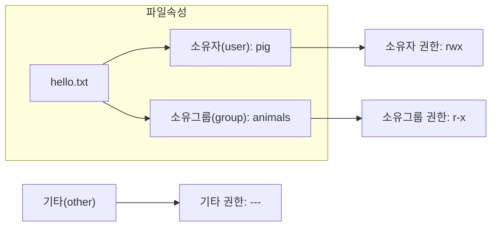
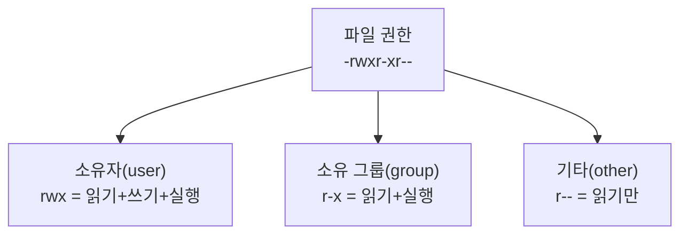
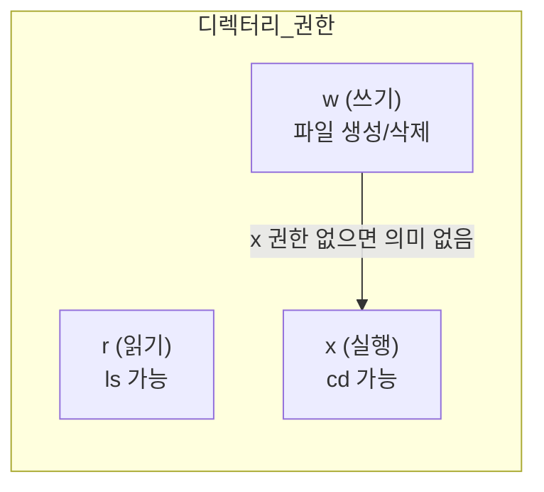
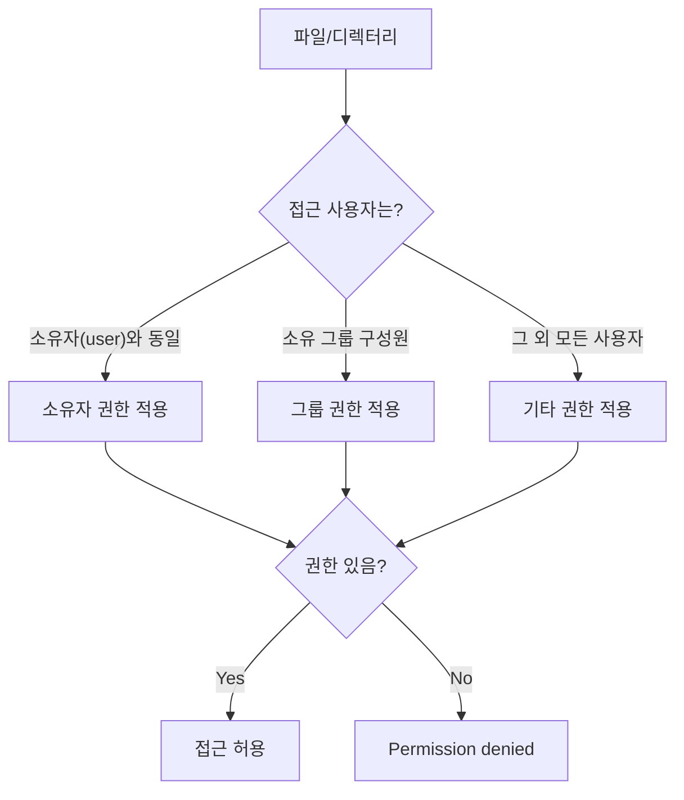

# 2장. 소유권과 파일 권한

> 이 장의 예제는 [3-1장]에서 생성한 사용자/그룹(`pig`, `animals`)을 이어서 사용합니다.
{: .prompt-info }

---

## 2.1 파일 소유권 (Ownership)



```bash
ls -l hello.txt
# -rw-r--r-- 1 pig animals 512 Mar 7 09:00 hello.txt
```

---

### chown — 파일 소유권 변경

```bash
sudo chown pig hello.txt            # 소유자를 pig 로 변경
sudo chown pig:animals hello.txt    # 소유자와 그룹 동시 변경
sudo chown :animals hello.txt       # 그룹만 변경
sudo chown -R pig:animals mydir/    # 디렉터리 전체 변경
```

예상 결과 예시

```text
$ ls -l hello.txt
-rw-r--r-- 1 pig animals 512 Mar 7 09:00 hello.txt
```

> `chown` 은 root 또는 현재 파일 소유자만 실행할 수 있다.
{: .prompt-warning }

---

## 2.2 파일 권한 (Permission)



| 기호 | 파일에 대한 의미 | 디렉터리에 대한 의미 |
|---|---|---|
| `r` | 파일 내용 읽기 | 파일 목록 조회 (`ls`) |
| `w` | 파일 내용 수정/삭제 | 파일 생성/삭제 |
| `x` | 파일 실행 | 디렉터리 진입 (`cd`) |
| `-` | 해당 권한 없음 | 해당 권한 없음 |

---

### chmod — 파일 권한 변경

#### ① 8진수 표기법

| 권한 조합 | 8진수 |
|---|---|
| `---` | 0 |
| `r--` | 4 |
| `r-x` | 5 |
| `rw-` | 6 |
| `rwx` | 7 |

```bash
chmod 755 hello.sh      # rwxr-xr-x
chmod 644 config.txt    # rw-r--r--
chmod 600 private.key   # rw-------
```

예상 결과 예시

```text
$ ls -l hello.sh config.txt private.key
-rwxr-xr-x 1 pig animals ... hello.sh
-rw-r--r-- 1 pig animals ... config.txt
-rw------- 1 pig animals ... private.key
```

| 8진수 | 설명 |
|---|---|
| `755` | 실행 파일의 일반적인 권한 |
| `644` | 텍스트 파일의 일반적인 권한 |
| `600` | 소유자만 읽고 쓸 수 있는 개인 파일 |

#### ② 의미 표기법 (Symbolic Notation)

```bash
chmod u+x hello.sh      # 소유자에게 실행 권한 추가
chmod g-w config.txt    # 소유 그룹의 쓰기 권한 제거
chmod o-r private.txt   # 기타 사용자의 읽기 권한 제거
chmod a+x run.sh        # 모든 사용자에게 실행 권한 추가
```

---

## 2.3 디렉터리 권한



| 권한 | 8진수 | 설명 |
|---|---|---|
| `rwx` | 7 | 목록 조회, 진입, 파일 생성/삭제 모두 가능 |
| `r-x` | 5 | 목록 조회, 진입 가능. 파일 생성/삭제 불가 |
| `r--` | 4 | 목록만 조회 가능. 진입 불가 |
| `--x` | 1 | 목록은 못 봄. 파일명 알면 진입 가능 |

---

## 2.4 특수 비트 심화 (SUID/SGID/Sticky bit)

특수 비트는 일반 권한(`rwx`)에 추가로 동작하며, `ls -l` 결과의 `x` 위치가 `s` 또는 `t`로 보인다.

| 비트 | 숫자 | 기호 | 보이는 위치 | 주요 용도 |
|---|---|---|---|---|
| SUID | `4` | `u+s` | 소유자 실행 자리 | 실행 파일을 파일 소유자 권한으로 실행 |
| SGID | `2` | `g+s` | 그룹 실행 자리 | 실행 파일 그룹 권한 / 디렉터리 그룹 상속 |
| Sticky bit | `1` | `+t` | 기타 실행 자리 | 공유 디렉터리에서 타인 파일 삭제 방지 |

```bash
# 숫자 표기
chmod 4755 /usr/local/bin/tool
chmod 2775 /srv/project
chmod 1777 /tmp/shared

# 기호 표기
chmod u+s /usr/local/bin/tool
chmod g+s /srv/project
chmod +t /tmp/shared
```

예상 결과 예시

```text
$ ls -ld /srv/project /tmp/shared
drwxrwsr-x 2 root animals ... /srv/project
drwxrwxrwt 2 root root    ... /tmp/shared
```

보안 체크 포인트

- SUID/SGID는 필요한 바이너리에만 부여한다.
- 공유 디렉터리(`777`)에는 Sticky bit(`+t`)를 적용해 삭제 공격을 막는다.
- 점검 시 `find / -perm -4000 -type f 2>/dev/null` 로 SUID 파일을 주기적으로 확인한다.

---

## 2.5 권한 체계 전체 정리



> 권한 체크는 소유자 → 그룹 → 기타 순서로 확인하며, **먼저 매칭된 범주의 권한만 적용**된다.
{: .prompt-info }

---

## 2.6 핵심 명령어 요약

| 명령어 | 기능 | 예시 |
|---|---|---|
| `ls -l` | 파일 권한 및 소유권 확인 | `ls -la` |
| `chown` | 소유자/그룹 변경 | `sudo chown pig:animals file` |
| `chmod` | 파일 권한 변경 | `chmod 755 file` |
| `stat` | 파일 상세 메타데이터 조회 | `stat file.txt` |
| `find` | SUID 파일 점검 | `find / -perm -4000 -type f 2>/dev/null` |

**자주 사용하는 권한 조합:**

| 권한값 | 사용 상황 |
|---|---|
| `755` | 실행 파일, 디렉터리 |
| `644` | 일반 텍스트/설정 파일 |
| `600` | 개인 키, 비밀 파일 |
| `700` | 개인 스크립트 |
