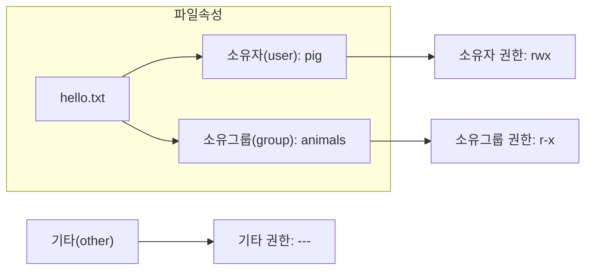
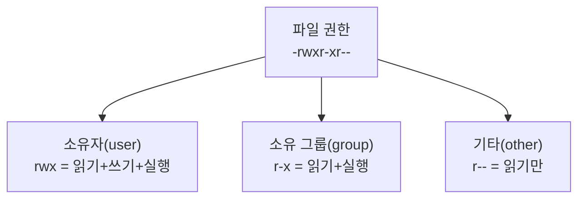
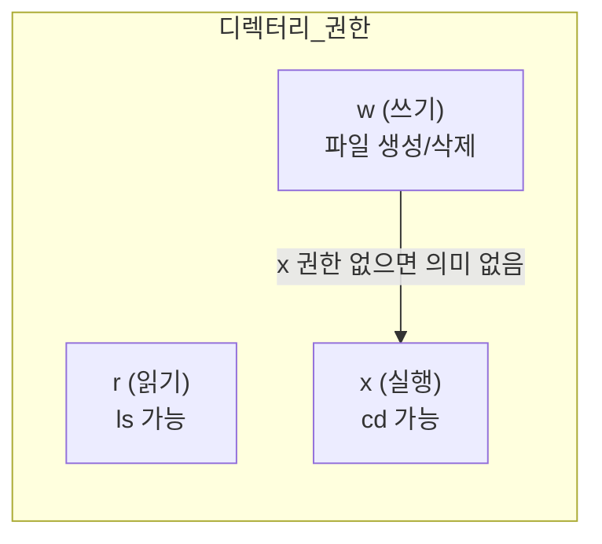
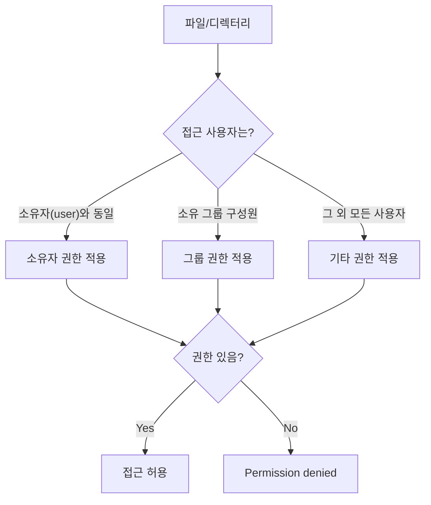

# 2장. 소유권과 파일 권한

> 실습 흐름: **Step 1(3-1)** 에서 만든 `pig/mango/dog`, `animals` 를 그대로 사용한다. 이 문서는 **Step 2**로, 3-3 통합 실습을 위한 권한 상태를 만든다.
{: .prompt-info }

---

## 2.1 파일 소유권 (Ownership)



```bash
ls -l hello.txt  # 파일의 소유자/소유그룹/권한(문자열)을 한 번에 확인
# -rw-r--r-- 1 pig animals 512 Mar 7 09:00 hello.txt
```

---

### chown — 파일 소유권 변경

```bash
sudo chown pig hello.txt            # 파일 소유자만 pig로 변경
sudo chown pig:animals hello.txt    # 파일 소유자/소유그룹을 동시에 변경
sudo chown :animals hello.txt       # 소유자는 유지하고 그룹만 animals로 변경
sudo chown -R pig:animals mydir/    # 디렉터리 내부 하위 항목까지 재귀적으로 일괄 변경
```

예상 결과 예시

```text
$ ls -l hello.txt
-rw-r--r-- 1 pig animals 512 Mar 7 09:00 hello.txt
```

> `chown` 은 root 또는 현재 파일 소유자만 실행할 수 있다.
{: .prompt-warning }

---

## 2.2 파일 권한 (Permission)



| 기호 | 파일에 대한 의미 | 디렉터리에 대한 의미 |
|---|---|---|
| `r` | 파일 내용 읽기 | 파일 목록 조회 (`ls`) |
| `w` | 파일 내용 수정/삭제 | 파일 생성/삭제 |
| `x` | 파일 실행 | 디렉터리 진입 (`cd`) |
| `-` | 해당 권한 없음 | 해당 권한 없음 |

---

### chmod — 파일 권한 변경

#### ① 8진수 표기법

| 권한 조합 | 8진수 |
|---|---|
| `---` | 0 |
| `r--` | 4 |
| `r-x` | 5 |
| `rw-` | 6 |
| `rwx` | 7 |

```bash
chmod 755 hello.sh      # 실행 스크립트: 소유자 전체, 그룹/기타는 읽기+실행
chmod 644 config.txt    # 일반 설정 파일: 소유자 읽기+쓰기, 나머지는 읽기
chmod 600 private.key   # 민감 파일: 소유자만 읽기+쓰기 허용
```

예상 결과 예시

```text
$ ls -l hello.sh config.txt private.key
-rwxr-xr-x 1 pig animals ... hello.sh
-rw-r--r-- 1 pig animals ... config.txt
-rw------- 1 pig animals ... private.key
```

| 8진수 | 설명 |
|---|---|
| `755` | 실행 파일의 일반적인 권한 |
| `644` | 텍스트 파일의 일반적인 권한 |
| `600` | 소유자만 읽고 쓸 수 있는 개인 파일 |

#### ② 의미 표기법 (Symbolic Notation)

```bash
chmod u+x hello.sh      # 소유자(u)에게 실행(x) 권한을 추가(+)
chmod g-w config.txt    # 그룹(g)의 쓰기(w) 권한을 제거(-)
chmod o-r private.txt   # 기타(o) 사용자 읽기(r) 권한 제거
chmod a+x run.sh        # 전체(a) 사용자에게 실행(x) 권한 추가
```

---

## 2.3 디렉터리 권한



| 권한 | 8진수 | 설명 |
|---|---|---|
| `rwx` | 7 | 목록 조회, 진입, 파일 생성/삭제 모두 가능 |
| `r-x` | 5 | 목록 조회, 진입 가능. 파일 생성/삭제 불가 |
| `r--` | 4 | 목록만 조회 가능. 진입 불가 |
| `--x` | 1 | 목록은 못 봄. 파일명 알면 진입 가능 |

---

## 2.4 Step 2 실습: 3-3에서 사용할 권한 상태 만들기

아래 결과를 만들고 3-3으로 넘어간다.

```bash
# 1) 실습 디렉터리 준비
sudo mkdir -p /tmp/lab-perm               # Step 3에서 재사용할 공용 실습 디렉터리 생성
sudo chown root:animals /tmp/lab-perm     # 디렉터리 그룹을 animals로 고정
sudo chmod 775 /tmp/lab-perm              # 소유자/그룹 쓰기 허용, 기타는 읽기+실행만

# 2) dog가 파일 생성 (기본 권한 확인용)
su - dog -c 'echo "dog baseline" > /tmp/lab-perm/from_dog.txt'  # dog 계정으로 기준 파일 생성
ls -l /tmp/lab-perm/from_dog.txt                                 # 현재 권한/소유 정보 확인

# 3) 파일을 팀 공유 정책으로 정렬
sudo chown dog:animals /tmp/lab-perm/from_dog.txt    # 소유그룹을 animals로 맞춰 팀 접근 기준 통일
sudo chmod 640 /tmp/lab-perm/from_dog.txt            # 소유자 읽기+쓰기, 그룹 읽기, 기타 차단
ls -l /tmp/lab-perm/from_dog.txt                     # Step 3 입력 상태 최종 검증
```

예상 결과 예시

```text
$ ls -ld /tmp/lab-perm
drwxrwxr-x 2 root animals ... /tmp/lab-perm

$ ls -l /tmp/lab-perm/from_dog.txt
-rw-r----- 1 dog animals ... /tmp/lab-perm/from_dog.txt
```

체크 포인트

- 디렉터리 그룹이 `animals` 여야 한다.
- `from_dog.txt` 가 `dog:animals`, `640` 이어야 3-3 결과가 동일하다.

---

## 2.5 권한 체계 전체 정리



> 권한 체크는 소유자 → 그룹 → 기타 순서로 확인하며, **먼저 매칭된 범주의 권한만 적용**된다.
{: .prompt-info }

---

## 2.6 핵심 명령어 요약

| 명령어 | 기능 | 예시 |
|---|---|---|
| `ls -l` | 파일 권한 및 소유권 확인 | `ls -la` |
| `chown` | 소유자/그룹 변경 | `sudo chown pig:animals file` |
| `chmod` | 파일 권한 변경 | `chmod 755 file` |
| `stat` | 파일 상세 메타데이터 조회 | `stat file.txt` |

**자주 사용하는 권한 조합:**

| 권한값 | 사용 상황 |
|---|---|
| `755` | 실행 파일, 디렉터리 |
| `644` | 일반 텍스트/설정 파일 |
| `600` | 개인 키, 비밀 파일 |
| `700` | 개인 스크립트 |
