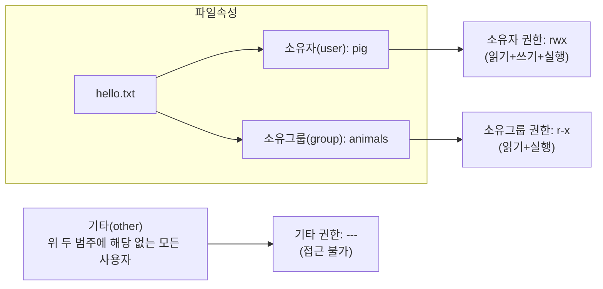
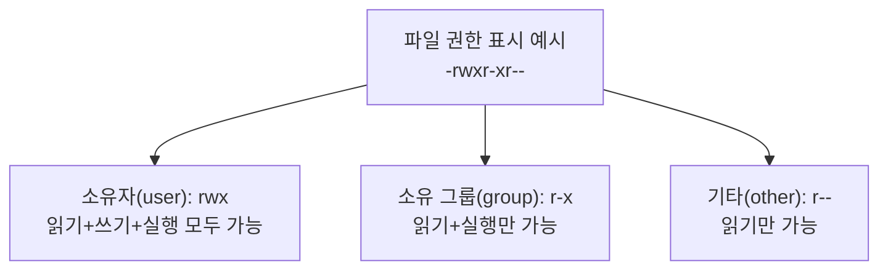
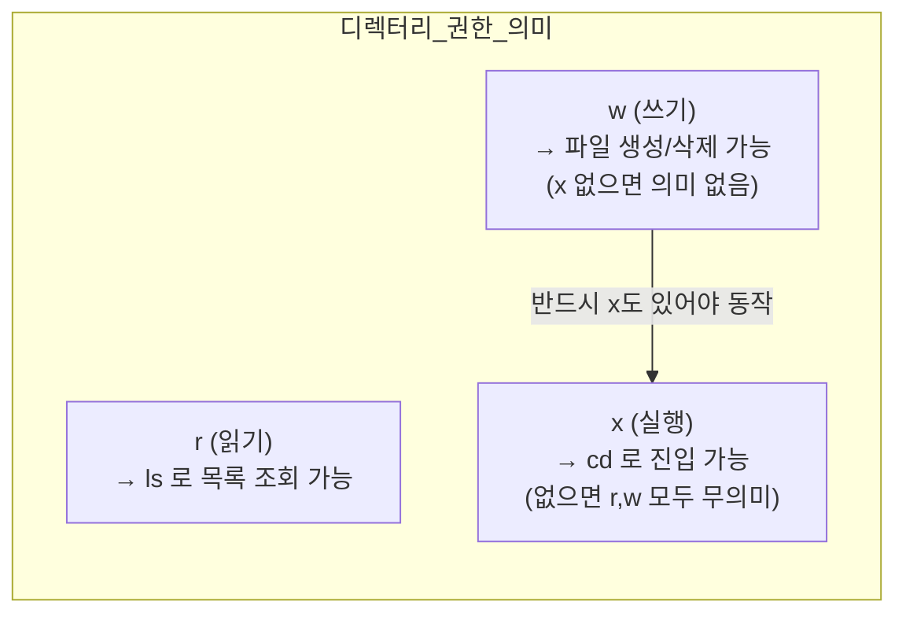
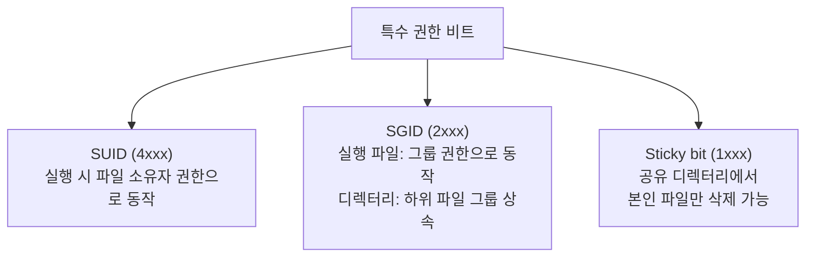
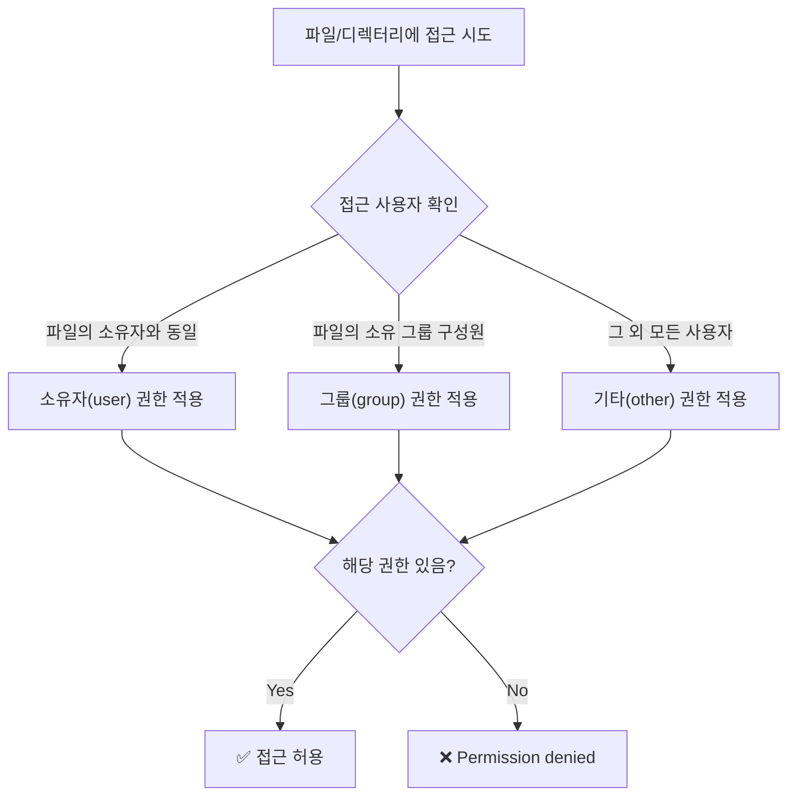

# 2장. 소유권과 파일 권한

> 실습 흐름: **Step 1(3-1)** 에서 만든 `pig/mango/dog`, `animals` 그룹을 그대로 사용한다.  
> 3-1 실습을 완료한 후 이 문서(**Step 2**)를 진행할 것.
{: .prompt-info }

---

## 2.1 파일 소유권 (Ownership)

리눅스에서 모든 파일과 디렉터리에는 반드시 **소유자(owner)** 와 **소유 그룹(group)** 이 지정되어 있다.  
파일에 접근할 때, 리눅스는 "이 사용자가 소유자인가? 소유 그룹 멤버인가? 아니면 제3자인가?" 를 판단해 권한을 적용한다.



```bash
ls -l hello.txt
# 출력 예: -rw-r--r-- 1 pig animals 512 Mar 7 09:00 hello.txt
#           ↑권한      소유자↑ ↑소유그룹
```

---

### chown — 파일 소유권 변경

```bash
sudo chown pig hello.txt             # 파일 소유자만 pig로 변경 (그룹은 그대로)
sudo chown pig:animals hello.txt     # 파일 소유자와 소유그룹을 동시에 변경
sudo chown :animals hello.txt        # 소유자는 유지하고 그룹만 animals로 변경
sudo chown -R pig:animals mydir/     # -R: 디렉터리 내부 모든 항목에 재귀적으로 적용
```

예상 결과:

```text
$ ls -l hello.txt
-rw-r--r-- 1 pig animals 512 Mar 7 09:00 hello.txt
```

> `chown` 은 root 또는 현재 파일 소유자만 실행할 수 있다.  
> 일반 사용자가 다른 사람 파일의 소유권을 임의로 바꿀 수 없다.
{: .prompt-warning }

---

## 2.2 파일 권한 (Permission)



`ls -l` 출력에서 맨 앞 10자리가 파일 종류와 권한을 나타낸다.

```
- r w x r - x r - -
↑ ↑↑↑ ↑↑↑ ↑↑↑
│ └─┬─┘ └─┬─┘ └─┬─┘
│  소유자  소유그룹  기타
파일종류(- 일반파일, d 디렉터리, l 링크)
```

| 기호 | 파일에 대한 의미 | 디렉터리에 대한 의미 |
|---|---|---|
| `r` | 파일 내용 읽기 (cat, less 등) | 파일 목록 조회 (`ls`) |
| `w` | 파일 내용 수정/삭제 | 파일 생성/삭제 |
| `x` | 파일 실행 (스크립트, 바이너리) | 디렉터리 진입 (`cd`) |
| `-` | 해당 권한 없음 | 해당 권한 없음 |

> **주의**: 디렉터리에서 `w` 권한은 파일 생성/삭제를 의미하지만, `x` 권한이 없으면 `cd` 로 진입 자체가 불가능하다.  
> 즉, `w` 혼자서는 의미가 없고 반드시 `x` 와 함께 써야 한다.
{: .prompt-tip }

---

### chmod — 파일 권한 변경

#### ① 8진수 표기법

권한을 숫자로 표현할 때 사용하는 방법이다.  
`r=4`, `w=2`, `x=1` 로 정의하고, 각 범주(소유자/그룹/기타)의 값을 더해서 표기한다.

| 권한 조합 | 계산 | 8진수 |
|---|---|---|
| `---` | 0+0+0 | 0 |
| `r--` | 4+0+0 | 4 |
| `r-x` | 4+0+1 | 5 |
| `rw-` | 4+2+0 | 6 |
| `rwx` | 4+2+1 | 7 |

```bash
chmod 755 hello.sh      # rwxr-xr-x: 소유자 전체 권한, 그룹/기타는 읽기+실행
chmod 644 config.txt    # rw-r--r--: 소유자 읽기+쓰기, 나머지는 읽기만
chmod 600 private.key   # rw-------: 소유자만 읽기+쓰기, 나머지는 접근 불가
```

예상 결과:

```text
$ ls -l hello.sh config.txt private.key
-rwxr-xr-x 1 pig animals ... hello.sh
-rw-r--r-- 1 pig animals ... config.txt
-rw------- 1 pig animals ... private.key
```

| 8진수 | 설명 | 주 사용처 |
|---|---|---|
| `755` | 소유자 전체, 나머지 읽기+실행 | 실행 파일, 공개 디렉터리 |
| `644` | 소유자 읽기+쓰기, 나머지 읽기 | 일반 텍스트/설정 파일 |
| `600` | 소유자만 읽기+쓰기 | SSH 키, 개인 비밀 파일 |

#### ② 기호 표기법 (Symbolic Notation)

숫자를 외우기 어려울 때, `u(소유자)/g(그룹)/o(기타)/a(전체)` 와 `+(추가)/-(제거)/=(설정)` 을 조합해 사용한다.

```bash
chmod u+x hello.sh      # 소유자(u)에게 실행(x) 권한 추가(+)
chmod g-w config.txt    # 그룹(g)의 쓰기(w) 권한 제거(-)
chmod o-r private.txt   # 기타(o) 사용자의 읽기(r) 권한 제거
chmod a+x run.sh        # 전체(a: all) 사용자에게 실행(x) 권한 추가
chmod u=rw,go=r file    # 소유자는 rw, 그룹/기타는 r 로 정확히 지정(=)
```

---

## 2.3 디렉터리 권한

디렉터리의 권한은 파일과 의미가 조금 다르다.  
특히 `x` 가 없으면 `cd` 로 진입 자체가 불가능하다는 점이 중요하다.



| 권한 | 8진수 | 설명 |
|---|---|---|
| `rwx` | 7 | 목록 조회, 진입, 파일 생성/삭제 모두 가능 |
| `r-x` | 5 | 목록 조회, 진입 가능. 파일 생성/삭제 불가 |
| `r--` | 4 | 목록만 조회 가능. `cd` 로 진입 불가 |
| `--x` | 1 | 파일명 알면 진입 가능. `ls` 로 목록 확인 불가 |

---

## 2.4 특수 권한 비트 (SUID, SGID, Sticky bit)

일반 권한(`rwx`) 외에, 리눅스에는 **특수 비트 3종**이 있다.  
보안과 파일 공유 환경 설계에서 매우 중요하게 다뤄지는 개념이다.



| 비트 | 숫자 | 주 사용 대상 | 핵심 효과 |
|---|---|---|---|
| SUID | 4xxx | 실행 파일 | 실행 시 **파일 소유자 권한**으로 동작 |
| SGID | 2xxx | 실행 파일, 디렉터리 | 디렉터리: 하위 파일의 그룹 자동 상속 |
| Sticky bit | 1xxx | 디렉터리 | 자기 파일은 자기만 삭제 가능 |

---

### 2.4.1 SUID (SetUID)

**왜 필요한가?**  
일반 사용자가 자신의 비밀번호를 변경할 때, `/etc/shadow` 파일에 접근해야 한다.  
그런데 `/etc/shadow` 는 root만 쓸 수 있다.  
SUID를 통해 `passwd` 프로그램이 일시적으로 root 권한으로 실행되므로 이것이 가능하다.

```bash
ls -l /usr/bin/passwd
# 출력 예: -rwsr-xr-x 1 root root ... /usr/bin/passwd
#                ↑ 소유자 실행 비트 자리에 's' 가 있으면 SUID 설정된 것
```

```bash
# 시스템에 SUID가 설정된 파일 목록 점검
find / -perm -4000 -type f 2>/dev/null
# -perm -4000: SUID(4000) 비트가 설정된 파일
# 2>/dev/null: 권한 없어 발생하는 오류 메시지를 숨김
```

> SUID 파일은 **권한 상승 경로**가 될 수 있으므로 주기적으로 점검해야 한다.  
> 불필요한 SUID는 `chmod u-s 파일명` 으로 제거한다.
{: .prompt-danger }

---

### 2.4.2 SGID (SetGID)

**왜 필요한가?**  
팀 공유 디렉터리에서 각자 만든 파일의 그룹이 제각각이면, 팀원이 파일에 접근하지 못하는 문제가 생긴다.  
SGID를 디렉터리에 설정하면, 그 안에 생성되는 파일의 그룹이 디렉터리 그룹으로 자동 통일된다.

```bash
sudo mkdir -p /srv/project                # 협업 디렉터리 생성
sudo chown root:animals /srv/project      # 소유그룹을 animals로 지정
sudo chmod 2775 /srv/project              # 2(SGID) + 775 권한 적용
ls -ld /srv/project
# 출력 예: drwxrwsr-x ... root animals ... /srv/project
#                ↑ 그룹 실행 비트 자리에 's' 가 있으면 SGID 설정된 것
```

> pig, mango 중 누가 `/srv/project` 안에 파일을 만들어도 그룹이 `animals` 로 통일된다.  
> SGID 없이는 각자의 기본 그룹(pig, mango)으로 생성되어 팀원 간 접근 불일치가 발생한다.
{: .prompt-tip }

---

### 2.4.3 Sticky bit

**왜 필요한가?**  
`/tmp` 같은 공용 쓰기 디렉터리에서 다른 사용자가 내 파일을 삭제할 수 있다.  
Sticky bit를 적용하면 **파일 소유자만 삭제/이름 변경 가능**하다.

```bash
ls -ld /tmp
# 출력 예: drwxrwxrwt ... /tmp
#                    ↑ 기타 실행 비트 자리에 't' 가 있으면 Sticky bit 설정된 것

sudo chmod 1777 /some/shared    # 1(Sticky bit) + 777 권한 적용
```

> `/tmp` 가 `1777` 이 아니라 `777` 이라면, 다른 사용자의 파일을 삭제할 수 있다.  
> Sticky bit는 공유성은 유지하면서 삭제 공격 위험을 크게 낮춘다.
{: .prompt-warning }

---

### 2.4.4 특수 비트 설정/해제 명령 정리

```bash
# 8진수 표기 (앞자리에 특수 비트 번호를 추가)
chmod 4755 file      # SUID: 실행 시 파일 소유자 권한 사용
chmod 2755 dir       # SGID: 디렉터리 하위 파일 그룹 상속
chmod 1777 dir       # Sticky bit: 공용 디렉터리 타인 파일 삭제 방지

# 기호 표기
chmod u+s file       # SUID 추가 (소유자 실행 비트 자리에 s)
chmod g+s dir        # SGID 추가 (그룹 실행 비트 자리에 s)
chmod +t dir         # Sticky bit 추가 (기타 실행 비트 자리에 t)
chmod u-s file       # SUID 제거
chmod g-s dir        # SGID 제거
chmod -t dir         # Sticky bit 제거
```

---

## 2.5 Step 2 실습: 3-3에서 사용할 권한 상태 만들기

```bash
# 1) 실습 디렉터리 준비
sudo mkdir -p /tmp/lab-perm               # 공용 실습 디렉터리 생성
sudo chown root:animals /tmp/lab-perm     # 소유그룹을 animals로 설정
sudo chmod 775 /tmp/lab-perm              # 소유자/그룹 쓰기 허용, 기타는 읽기+실행만

# 2) dog 계정으로 전환해서 파일 생성
su - dog
# dog 계정으로 전환됨 (animals 그룹 멤버이므로 /tmp/lab-perm 에 파일 생성 가능)
echo "dog baseline" > /tmp/lab-perm/from_dog.txt
exit
# exit: dog 세션 종료, 원래 계정으로 복귀

# 3) 파일 소유권/권한을 팀 공유 정책에 맞게 정리
sudo chown dog:animals /tmp/lab-perm/from_dog.txt    # 소유그룹을 animals로 통일
sudo chmod 640 /tmp/lab-perm/from_dog.txt            # 소유자 읽기+쓰기, 그룹 읽기, 기타 차단

# 4) 결과 확인
ls -ld /tmp/lab-perm                     # 디렉터리 상태 확인
ls -l /tmp/lab-perm/from_dog.txt         # 파일 상태 확인
```

예상 결과:

```text
$ ls -ld /tmp/lab-perm
drwxrwxr-x 2 root animals ... /tmp/lab-perm

$ ls -l /tmp/lab-perm/from_dog.txt
-rw-r----- 1 dog animals ... /tmp/lab-perm/from_dog.txt
```

> **체크 포인트**
> - 디렉터리 그룹이 `animals` 여야 한다.
> - `from_dog.txt` 가 `dog:animals`, `640` 이어야 3-3 결과가 동일하게 나온다.
{: .prompt-tip }

---

## 2.6 권한 체크 흐름



> 권한 체크는 **소유자 → 그룹 → 기타 순서**로 한 번만 확인한다.  
> 소유자와 일치하면 소유자 권한만 적용되고, 그룹 권한은 보지 않는다.  
> 즉, 소유자에게 권한이 없으면 그룹 권한이 있어도 소유자는 접근 불가다.
{: .prompt-warning }

---

## 2.7 핵심 명령어 요약

| 명령어 | 기능 | 예시 |
|---|---|---|
| `ls -l` | 파일 권한 및 소유권 확인 | `ls -la` |
| `chown` | 소유자/그룹 변경 | `sudo chown pig:animals file` |
| `chmod` | 파일 권한 변경 | `chmod 755 file` |
| `stat` | 파일 상세 메타데이터 조회 | `stat file.txt` |
| `find` | SUID/SGID 파일 점검 | `find / -perm -4000 -type f 2>/dev/null` |

**자주 사용하는 권한 조합:**

| 권한값 | 사용 상황 |
|---|---|
| `755` | 실행 파일, 공개 디렉터리 |
| `644` | 일반 텍스트/설정 파일 |
| `600` | 개인 키, 비밀 파일 |
| `700` | 개인 스크립트 |
| `4755` | SUID 실행 파일 |
| `2775` | SGID 협업 디렉터리 |
| `1777` | Sticky bit 공용 디렉터리 |
