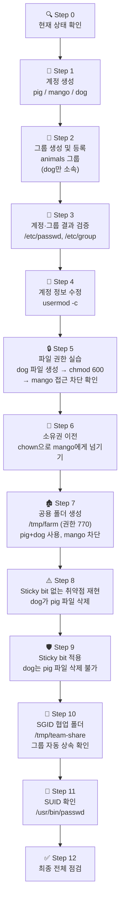
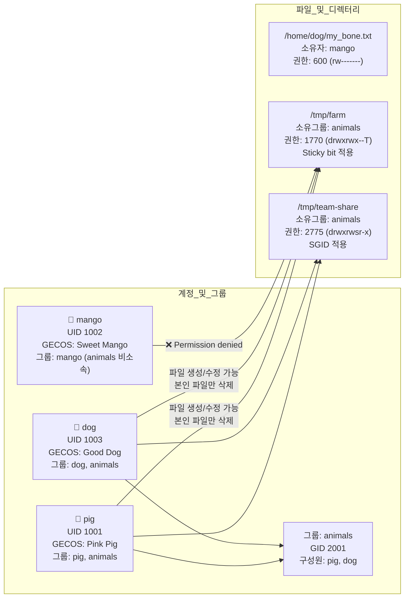

# 3주차 통합 실습 — 동물 농장(farm) 운영하기

> **이 실습은 처음부터 끝까지 순서대로 진행해야 한다.**  
> 각 단계의 결과물이 다음 단계의 입력이 된다.  
> 중간에 막히면 해당 단계의 예상 화면과 비교 후 수정하고 진행할 것.
{: .prompt-warning }

> **`su -` 사용 필수 규칙**  
> `su - 사용자명` 으로 전환한 후 작업이 끝나면 **반드시 `exit`** 를 입력해야 한다.  
> 전환 후 `whoami` 로 현재 사용자를 항상 확인하는 습관을 들일 것.
{: .prompt-tip }

---

## 전체 흐름 한눈에 보기



---

## Step 0. 시작 전 현재 상태 확인

실습을 시작하기 전에 현재 내가 누구인지, 어디에 있는지 반드시 확인한다.

```bash
whoami          # 현재 로그인 사용자 확인 (root 또는 관리자 계정이어야 함)
echo $SHELL     # 사용 중인 셸 확인 (예: /bin/bash)
pwd             # 현재 위치 확인
id              # 현재 사용자의 UID, GID, 소속 그룹 전체 확인
```

**예상 화면:**

```text
$ whoami
ubuntu
$ echo $SHELL
/bin/bash
$ pwd
/home/ubuntu
$ id
uid=1000(ubuntu) gid=1000(ubuntu) groups=1000(ubuntu),4(adm),27(sudo),...
```

> `sudo` 명령이 가능한 계정(sudoers)으로 진행해야 한다.  
> `groups` 출력에 `sudo` 가 없으면 관리자 계정으로 다시 로그인할 것.
{: .prompt-danger }

---

## Step 1. 계정 생성 — pig, mango, dog 만들기

**스토리**: 동물 농장 시스템에 돼지(pig), 망고(mango), 강아지(dog) 계정을 만든다.

```bash
sudo adduser pig
# 비밀번호 입력 안내: pig1234 (또는 원하는 비밀번호)
# Full Name 등 추가 입력란은 Enter로 건너뜀
# "Is the information correct? [Y/n]" → Y 입력

sudo adduser mango
# 비밀번호: mango1234

sudo adduser dog
# 비밀번호: dog1234
```

**예상 화면 (pig 기준):**

```text
$ sudo adduser pig
Adding user 'pig' ...
Adding new group 'pig' (1001) ...
Adding new user 'pig' (1001) with group 'pig' ...
Creating home directory '/home/pig' ...
Copying files from '/etc/skel' ...
New password:
Retype new password:
passwd: password updated successfully
Changing the user information for pig
Enter the new value, or press ENTER for the default
        Full Name []:
        Room Number []:
Is the information correct? [Y/n] Y
```

생성 확인:

```bash
id pig
id mango
id dog
```

**예상 화면:**

```text
$ id pig
uid=1001(pig) gid=1001(pig) groups=1001(pig)

$ id mango
uid=1002(mango) gid=1002(mango) groups=1002(mango)

$ id dog
uid=1003(dog) gid=1003(dog) groups=1003(dog)
```

> UID가 세 계정 모두 1000번대인지 확인한다.  
> 1000 미만이면 시스템 계정 UID와 충돌할 수 있다.
{: .prompt-tip }

---

## Step 2. 그룹 생성 및 등록 — animals 그룹에 dog만 추가

**스토리**: 동물 그룹(animals)을 만들되, 이번 실습에서는 `dog` 만 먼저 소속시킨다.  
`pig` 와 `mango` 는 나중에 각각 추가/미추가를 통해 권한 차이를 체험한다.

```bash
# animals 그룹 생성
sudo addgroup animals

# dog만 animals 그룹에 추가
sudo adduser dog animals
```

**예상 화면:**

```text
$ sudo addgroup animals
Adding group 'animals' (GID 2001) ...
Done.

$ sudo adduser dog animals
Adding user 'dog' to group 'animals' ...
Done.
```

소속 그룹 확인:

```bash
groups pig      # pig: pig         → animals 없음
groups mango    # mango: mango     → animals 없음
groups dog      # dog: dog animals → animals 있음
```

**예상 화면:**

```text
$ groups pig
pig : pig

$ groups mango
mango : mango

$ groups dog
dog : dog animals
```

---

## Step 3. 계정·그룹 파일 직접 확인

`/etc/passwd` 와 `/etc/group` 파일을 눈으로 직접 확인한다.

```bash
# pig 계정의 7개 필드 확인
grep "^pig:" /etc/passwd
grep "^mango:" /etc/passwd
grep "^dog:" /etc/passwd
```

**예상 화면:**

```text
$ grep "^pig:" /etc/passwd
pig:x:1001:1001:,,,:/home/pig:/bin/bash
    │  │    │    │   │          └─ 로그인 셸
    │  │    │    │   └─ GECOS (현재 비어있음)
    │  │    │    └─ GID 1001
    │  │    └─ UID 1001
    │  └─ x (비밀번호는 /etc/shadow에 저장)
    └─ 사용자 이름
```

```bash
# animals 그룹 구성원 확인
grep "^animals:" /etc/group
```

**예상 화면:**

```text
$ grep "^animals:" /etc/group
animals:x:2001:dog
              ↑ dog만 있어야 함 (pig, mango는 없어야 정상)
```

```bash
# 네 파일의 권한 한 번에 비교
ls -la /etc/passwd /etc/shadow /etc/group /etc/gshadow
```

**예상 화면:**

```text
-rw-r--r-- 1 root root   ... /etc/group
----- 1 root shadow ... /etc/gshadow
-rw-r--r-- 1 root root   ... /etc/passwd
----- 1 root shadow ... /etc/shadow
  ↑ passwd, group: 644 (모두 읽기 가능)
    shadow, gshadow: 640 또는 000 (root만 접근)
```

---

## Step 4. 계정 정보 수정 — usermod로 GECOS 변경

`usermod -c` 옵션으로 각 계정에 설명(GECOS)을 추가한다.

```bash
sudo usermod -c "Pink Pig" pig
sudo usermod -c "Sweet Mango" mango
sudo usermod -c "Good Dog" dog
```

변경 결과 확인:

```bash
grep "^pig:" /etc/passwd
grep "^mango:" /etc/passwd
grep "^dog:" /etc/passwd
```

**예상 화면:**

```text
$ grep "^pig:" /etc/passwd
pig:x:1001:1001:Pink Pig:/home/pig:/bin/bash
                 ↑ GECOS 필드에 "Pink Pig" 반영됨

$ grep "^mango:" /etc/passwd
mango:x:1002:1002:Sweet Mango:/home/mango:/bin/bash

$ grep "^dog:" /etc/passwd
dog:x:1003:1003:Good Dog:/home/dog:/bin/bash
```

---

## Step 5. 파일 권한 실습 — "내 물건 건들지 마!"

**스토리**: `dog` 가 자기 뼈다귀(my_bone.txt) 파일을 만들고, `mango` 가 열어보려 하면 차단한다.

```bash
# dog로 전환 후 파일 생성
su - dog
```

**예상 화면:**

```text
$ su - dog
dog@ubuntu:~$     ← 프롬프트가 dog 계정으로 바뀌었는지 확인
```

```bash
# dog 세션에서 실행
echo "I am dog's bone. Don't touch!" > my_bone.txt
ls -l my_bone.txt    # 기본 권한 확인
```

**예상 화면:**

```text
dog@ubuntu:~$ ls -l my_bone.txt
-rw-rw-r-- 1 dog dog 30 Mar 19 09:25 my_bone.txt
             ↑ 기본 권한 664 (umask 002 기준)
               그룹(dog)도 읽기+쓰기 가능한 상태
```

```bash
# 권한을 600으로 좁히기 (나만 읽고 쓰기)
chmod 600 my_bone.txt
ls -l my_bone.txt
```

**예상 화면:**

```text
dog@ubuntu:~$ chmod 600 my_bone.txt
dog@ubuntu:~$ ls -l my_bone.txt
-rw------- 1 dog dog 30 Mar 19 09:25 my_bone.txt
 ↑ rw------- : 소유자(dog)만 읽기+쓰기, 그룹과 기타는 완전 차단
```

```bash
exit    # dog 세션 종료 (반드시 실행)
whoami  # 원래 계정으로 돌아왔는지 확인
```

```bash
# mango로 전환해서 dog 파일 접근 시도
su - mango
cat /home/dog/my_bone.txt
```

**예상 화면:**

```text
mango@ubuntu:~$ cat /home/dog/my_bone.txt
cat: /home/dog/my_bone.txt: Permission denied
    ↑ 권한 600이 정확히 동작 중
```

```bash
exit    # mango 세션 종료
whoami  # 원래 계정 확인
```

> `Permission denied` 가 나오면 정상이다.  
> 만약 내용이 보인다면 권한 설정이 잘못된 것이므로 Step 5를 다시 진행한다.
{: .prompt-info }

---

## Step 6. 소유권 이전 — chown으로 mango에게 넘기기

**스토리**: 관리자가 `dog` 의 파일 소유권을 `mango` 에게 넘겨준다.

```bash
# 소유권 변경 전 상태 확인
ls -l /home/dog/my_bone.txt

# 소유자를 mango로 변경 (소유그룹은 dog 그대로 유지)
sudo chown mango /home/dog/my_bone.txt

# 변경 후 상태 확인
ls -l /home/dog/my_bone.txt
```

**예상 화면:**

```text
$ ls -l /home/dog/my_bone.txt
-rw------- 1 dog dog 30 Mar 19 09:25 my_bone.txt   ← 변경 전

$ sudo chown mango /home/dog/my_bone.txt

$ ls -l /home/dog/my_bone.txt
-rw------- 1 mango dog 30 Mar 19 09:25 my_bone.txt  ← 변경 후
             ↑ 소유자가 dog → mango 로 변경됨
               권한 600은 그대로 → 이제 mango만 읽기+쓰기 가능
```

```bash
# 이제 mango가 읽을 수 있는지 확인
su - mango
cat /home/dog/my_bone.txt    # 이번에는 내용이 출력되어야 함
exit
```

**예상 화면:**

```text
mango@ubuntu:~$ cat /home/dog/my_bone.txt
I am dog's bone. Don't touch!
    ↑ 소유권이 mango이고 권한 600이므로, mango 본인만 읽기 가능
```

---

## Step 7. 공용 폴더 생성 — /tmp/farm 권한 770

**스토리**: 동물 농장 공용 폴더를 만든다.  
`animals` 그룹 소속인 `dog` 는 사용 가능하고, 비소속인 `mango` 는 차단한다.  
먼저 `pig` 도 `animals` 그룹에 추가한다.

```bash
# pig를 animals 그룹에 추가
sudo adduser pig animals

# 그룹 소속 현황 최종 확인
groups pig      # pig: pig animals   → 추가됨
groups mango    # mango: mango       → 여전히 비소속
groups dog      # dog: dog animals   → 기존 소속 유지
```

**예상 화면:**

```text
$ groups pig
pig : pig animals

$ groups mango
mango : mango

$ groups dog
dog : dog animals
```

```bash
# 공용 폴더 생성
sudo mkdir /tmp/farm

# 소유그룹을 animals로, 소유자는 root로 설정
sudo chown root:animals /tmp/farm

# 권한 770: 소유자(root)+그룹(animals) 전체 권한, 기타(other) 완전 차단
sudo chmod 770 /tmp/farm

# 결과 확인
ls -ld /tmp/farm
```

**예상 화면:**

```text
$ ls -ld /tmp/farm
drwxrwx--- 2 root animals ... /tmp/farm
 ↑ rwxrwx--- : 소유자/그룹 전체 권한 (7), 기타 완전 차단 (0)
```

```bash
# mango(animals 비소속)가 접근 시도 → 차단 확인
su - mango
ls /tmp/farm
exit
```

**예상 화면:**

```text
mango@ubuntu:~$ ls /tmp/farm
ls: cannot open directory '/tmp/farm': Permission denied
    ↑ 기타(other) 권한이 0이므로 접근 불가
```

```bash
# pig(animals 소속)가 파일 생성 → 성공 확인
su - pig
echo "pig's food" > /tmp/farm/pig_food.txt
ls -l /tmp/farm
exit
```

**예상 화면:**

```text
pig@ubuntu:~$ echo "pig's food" > /tmp/farm/pig_food.txt
pig@ubuntu:~$ ls -l /tmp/farm
-rw-rw-r-- 1 pig pig ... pig_food.txt
    ↑ pig가 정상적으로 파일 생성 완료
```

---

## Step 8. Sticky bit 없는 취약점 재현 — dog가 pig 파일 삭제

**스토리**: `dog` 는 `animals` 그룹 멤버다.  
디렉터리의 `w` 권한이 있으면 **다른 사람의 파일도 삭제**할 수 있다.

```bash
# dog가 pig의 파일을 삭제 시도 (Sticky bit 없는 현재 상태)
su - dog
rm /tmp/farm/pig_food.txt    # dog는 animals 그룹 멤버 → 삭제 가능!
ls /tmp/farm                 # 아무것도 없으면 삭제된 것
exit
```

**예상 화면:**

```text
$ su - dog
dog@ubuntu:~$ rm /tmp/farm/pig_food.txt
dog@ubuntu:~$ ls /tmp/farm
(빈 출력 — 파일이 삭제되었음)
dog@ubuntu:~$ exit
```

> `dog` 가 `pig` 의 파일을 삭제했다.  
> 이것이 Sticky bit가 없을 때 발생하는 **실제 보안 취약점**이다.  
> 공용 `/tmp` 폴더가 `1777` 이 아니라 `777` 이라면 이런 일이 일어난다.
{: .prompt-danger }

---

## Step 9. Sticky bit 적용 — 보안 취약점 해결

**Sticky bit (t)** 를 적용하면 **파일 소유자 본인과 root만 삭제** 가능하다.

```bash
# Sticky bit 적용
sudo chmod +t /tmp/farm
# 또는 8진수: sudo chmod 1770 /tmp/farm

# 결과 확인
ls -ld /tmp/farm
```

**예상 화면:**

```text
$ ls -ld /tmp/farm
drwxrwx--T 2 root animals ... /tmp/farm
         ↑ T: Sticky bit 적용됨
           (기타 실행 권한 없음 + Sticky bit → 대문자 T)
```

```bash
# pig가 파일 재생성
su - pig
echo "pig's food again" > /tmp/farm/pig_food.txt
ls -l /tmp/farm
exit
```

**예상 화면:**

```text
pig@ubuntu:~$ echo "pig's food again" > /tmp/farm/pig_food.txt
pig@ubuntu:~$ ls -l /tmp/farm
-rw-rw-r-- 1 pig pig ... pig_food.txt
pig@ubuntu:~$ exit
```

```bash
# dog가 pig 파일 삭제 재시도 → 이번에는 차단되어야 함
su - dog
rm /tmp/farm/pig_food.txt    # "Operation not permitted" 가 나와야 정상
exit
```

**예상 화면:**

```text
dog@ubuntu:~$ rm /tmp/farm/pig_food.txt
rm: cannot remove '/tmp/farm/pig_food.txt': Operation not permitted
    ↑ Sticky bit가 삭제를 차단함
```

```bash
# dog는 자기 파일은 여전히 삭제 가능
su - dog
echo "dog's bone" > /tmp/farm/dog_bone.txt    # 자기 파일 생성
rm /tmp/farm/dog_bone.txt                      # 자기 파일 삭제 → 성공
ls /tmp/farm                                   # pig_food.txt만 남아있어야 정상
exit
```

**예상 화면:**

```text
dog@ubuntu:~$ echo "dog's bone" > /tmp/farm/dog_bone.txt
dog@ubuntu:~$ rm /tmp/farm/dog_bone.txt
dog@ubuntu:~$ ls /tmp/farm
pig_food.txt
    ↑ pig_food.txt는 남아있고, dog_bone.txt만 삭제됨 → Sticky bit 정상 동작
```

---

## Step 10. SGID 협업 폴더 — 그룹 자동 상속

**스토리**: 팀 공유 폴더를 만든다.  
SGID를 설정하면 누가 파일을 만들어도 소유 그룹이 `animals` 로 자동 통일된다.

```bash
# SGID 협업 폴더 생성
sudo mkdir /tmp/team-share
sudo chown root:animals /tmp/team-share
sudo chmod 2775 /tmp/team-share    # 2(SGID) + 775

# 결과 확인
ls -ld /tmp/team-share
```

**예상 화면:**

```text
$ ls -ld /tmp/team-share
drwxrwsr-x 2 root animals ... /tmp/team-share
         ↑ s: SGID 설정됨 (그룹 실행 비트 자리에 s)
```

```bash
# pig가 파일 생성
su - pig
echo "pig note" > /tmp/team-share/pig_note.txt
exit

# dog가 파일 생성
su - dog
echo "dog note" > /tmp/team-share/dog_note.txt
exit

# 두 파일의 소유 그룹 확인
ls -l /tmp/team-share
```

**예상 화면:**

```text
$ ls -l /tmp/team-share
-rw-rw-r-- 1 pig  animals ... pig_note.txt
-rw-rw-r-- 1 dog  animals ... dog_note.txt
                ↑ pig가 만들어도, dog가 만들어도 그룹이 animals로 통일됨
                  SGID가 없으면 각각 pig, dog 그룹이 되어 팀원 접근 불일치 발생
```

> SGID를 설정하지 않은 폴더에서 파일을 만들면:  
> - pig가 만든 파일 → 그룹: pig  
> - dog가 만든 파일 → 그룹: dog  
> → 서로 그룹 권한으로 접근 불가 → 팀 협업 실패
{: .prompt-info }

---

## Step 11. SUID 확인 — /usr/bin/passwd

**스토리**: 일반 사용자가 `passwd` 명령으로 자기 비밀번호를 바꿀 수 있는 이유는 SUID 덕분이다.

```bash
# SUID 설정 확인
ls -l /usr/bin/passwd
```

**예상 화면:**

```text
$ ls -l /usr/bin/passwd
-rwsr-xr-x 1 root root 68208 ... /usr/bin/passwd
    ↑ 소유자 실행 비트 자리에 s → SUID 설정됨
      일반 사용자가 실행해도 잠시 root 권한으로 동작 → /etc/shadow 쓰기 가능
```

```bash
# 시스템 전체 SUID 파일 목록 점검 (보안 감사용)
find / -perm -4000 -type f 2>/dev/null
# -perm -4000 : SUID 비트가 설정된 파일
# 2>/dev/null : 권한 오류 메시지 숨김
```

**예상 화면 (일부):**

```text
/usr/bin/passwd
/usr/bin/sudo
/usr/bin/newgrp
/usr/bin/chsh
/usr/bin/gpasswd
...
```

> 이 목록에 불필요한 파일이 있으면 보안 취약점이 될 수 있다.  
> `chmod u-s 파일명` 으로 제거한다.
{: .prompt-danger }

---

## Step 12. 최종 전체 점검

모든 단계가 정상적으로 완료되었는지 한 번에 확인한다.

```bash
# ① 현재 사용자 확인 (반드시 원래 계정이어야 함)
whoami

# ② 계정 정보 확인
id pig
id mango
id dog
```

**예상 화면:**

```text
$ id pig
uid=1001(pig) gid=1001(pig) groups=1001(pig),2001(animals)

$ id mango
uid=1002(mango) gid=1002(mango) groups=1002(mango)

$ id dog
uid=1003(dog) gid=1003(dog) groups=1003(dog),2001(animals)
```

```bash
# ③ GECOS 필드 확인
grep "^pig:\|^mango:\|^dog:" /etc/passwd
```

**예상 화면:**

```text
pig:x:1001:1001:Pink Pig:/home/pig:/bin/bash
mango:x:1002:1002:Sweet Mango:/home/mango:/bin/bash
dog:x:1003:1003:Good Dog:/home/dog:/bin/bash
```

```bash
# ④ animals 그룹 구성원 확인
grep "^animals:" /etc/group
```

**예상 화면:**

```text
animals:x:2001:dog,pig
               ↑ dog, pig 모두 있어야 함 (mango는 없어야 정상)
```

```bash
# ⑤ 파일 소유권 확인
ls -l /home/dog/my_bone.txt
```

**예상 화면:**

```text
-rw------- 1 mango dog 30 ... my_bone.txt
             ↑ 소유자: mango (Step 6에서 이전), 권한: 600
```

```bash
# ⑥ 디렉터리 특수 비트 확인
ls -ld /tmp/farm
ls -ld /tmp/team-share
```

**예상 화면:**

```text
drwxrwx--T 2 root animals ... /tmp/farm
         ↑ T: Sticky bit 적용됨

drwxrwsr-x 2 root animals ... /tmp/team-share
         ↑ s: SGID 적용됨
```

```bash
# ⑦ 파일 내용 확인
ls -l /tmp/farm
ls -l /tmp/team-share
```

**예상 화면:**

```text
/tmp/farm:
-rw-rw-r-- 1 pig pig animals ... pig_food.txt

/tmp/team-share:
-rw-rw-r-- 1 pig  animals ... pig_note.txt
-rw-rw-r-- 1 dog  animals ... dog_note.txt
                ↑ team-share 안 파일들은 소유 그룹이 모두 animals
```

---

## 최종 상태 다이어그램



---

## 완료 기준 체크리스트

| 항목 | 확인 방법 | 정상 결과 |
|---|---|---|
| pig UID 1000번대 | `id pig` | `uid=1001(pig)` |
| mango UID 1000번대 | `id mango` | `uid=1002(mango)` |
| dog UID 1000번대 | `id dog` | `uid=1003(dog)` |
| GECOS 수정 | `grep "^pig:" /etc/passwd` | `Pink Pig` 포함 |
| animals 구성원 | `grep "^animals:" /etc/group` | `dog,pig` 포함, mango 없음 |
| my_bone.txt 소유권 | `ls -l /home/dog/my_bone.txt` | 소유자 `mango`, 권한 `600` |
| /tmp/farm Sticky bit | `ls -ld /tmp/farm` | `drwxrwx--T` |
| mango farm 접근 차단 | `su - mango; ls /tmp/farm` | `Permission denied` |
| dog pig 파일 삭제 차단 | `su - dog; rm pig_food.txt` | `Operation not permitted` |
| /tmp/team-share SGID | `ls -ld /tmp/team-share` | `drwxrwsr-x` |
| team-share 그룹 상속 | `ls -l /tmp/team-share` | 모든 파일 그룹 `animals` |
| SUID 확인 | `ls -l /usr/bin/passwd` | `-rwsr-xr-x` |
