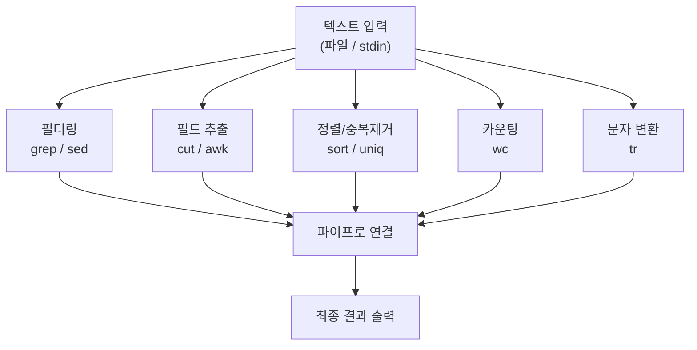
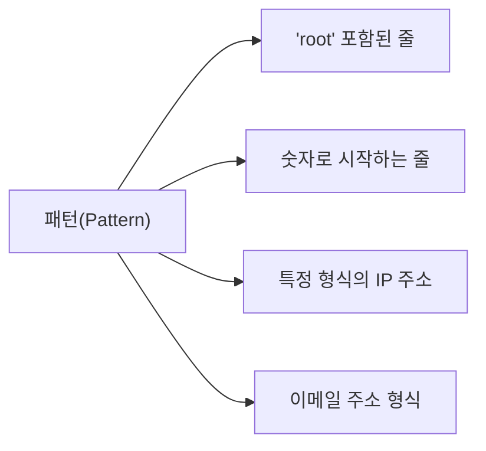
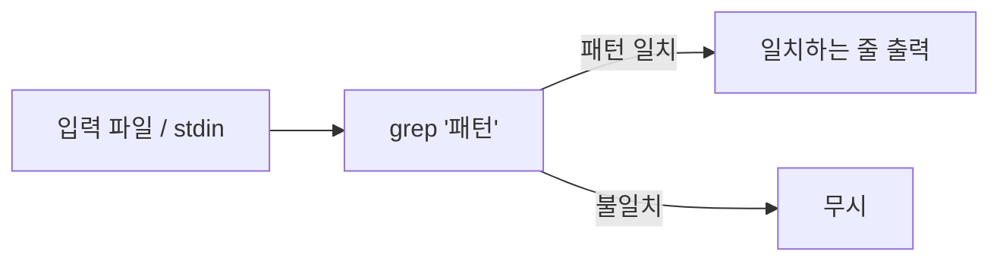
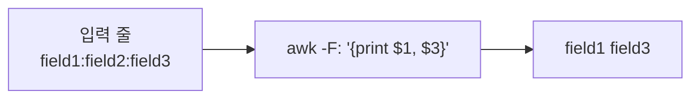

# 텍스트 처리 명령어와 정규표현식

# 1장. 파이프라인과 텍스트 처리 흐름

---

## 1.1 파이프라인 (Pipeline)

파이프라인은 앞 명령의 **표준 출력(stdout)** 을 다음 명령의 **표준 입력(stdin)** 으로 연결하는 메커니즘이다.


```bash
cat /etc/passwd | grep "bash" | wc -l
# /etc/passwd 에서 bash 포함 줄만 필터링 → 줄 수 카운트
```

> 파이프는 텍스트 처리의 핵심 도구임. 단순 명령어들을 조합해 복잡한 데이터 처리를 구현할 수 있음.
{: .prompt-tip }

---

## 1.2 텍스트 처리 명령어 전체 맵



---

# 2장. 정규표현식 (Regular Expression)

---

## 2.1 정규표현식이란?

정규표현식(Regular Expression, 이하 regex)은 **문자열의 패턴을 기술하는 형식 언어**이다.

- 특정 패턴과 일치하는 문자열을 검색, 추출, 치환하는 데 활용됨
- grep, sed, awk 모두 정규표현식을 지원함
- 리눅스마스터 시험에서 자주 출제되는 핵심 개념



---

## 2.2 기본 정규표현식 (BRE) 메타문자

| 메타문자 | 의미 | 예시 | 매칭 예 |
|---|---|---|---|
| `.` | 임의의 문자 1개 | `r..t` | `root`, `r00t`, `rabt` |
| `*` | 앞 문자 0번 이상 반복 | `ab*c` | `ac`, `abc`, `abbc` |
| `^` | 줄의 시작 | `^root` | `root`로 시작하는 줄 |
| `$` | 줄의 끝 | `bash$` | `bash`로 끝나는 줄 |
| `[]` | 문자 클래스 (하나 선택) | `[aeiou]` | 모음 하나 |
| `[^]` | 부정 문자 클래스 | `[^0-9]` | 숫자가 아닌 문자 |
| `\` | 이스케이프 | `\.` | 마침표 문자 자체 |

---

## 2.3 확장 정규표현식 (ERE) 추가 메타문자

| 메타문자 | 의미 | 예시 | 매칭 예 |
|---|---|---|---|
| `+` | 앞 문자 1번 이상 반복 | `ab+c` | `abc`, `abbc` (ac는 불일치) |
| `?` | 앞 문자 0번 또는 1번 | `ab?c` | `ac`, `abc` |
| `{n}` | 정확히 n번 반복 | `a{3}` | `aaa` |
| `{n,m}` | n번 이상 m번 이하 | `a{2,4}` | `aa`, `aaa`, `aaaa` |
| `\|` | OR 조건 | `cat\|dog` | `cat` 또는 `dog` |
| `()` | 그룹화 | `(ab)+` | `ab`, `abab` |

> BRE에서 `+`, `?`, `{}`를 쓰려면 `\+`, `\?`, `\{`처럼 백슬래시가 필요함. ERE(`grep -E` 또는 `egrep`)에서는 백슬래시 불필요.
{: .prompt-info }

---

## 2.4 자주 쓰는 문자 클래스

| 표기 | 동등한 표현 | 의미 |
|---|---|---|
| `[[:alpha:]]` | `[a-zA-Z]` | 알파벳 |
| `[[:digit:]]` | `[0-9]` | 숫자 |
| `[[:alnum:]]` | `[a-zA-Z0-9]` | 알파벳 + 숫자 |
| `[[:space:]]` | 공백/탭 | 공백 문자 |
| `[[:upper:]]` | `[A-Z]` | 대문자 |
| `[[:lower:]]` | `[a-z]` | 소문자 |

---

# 3장. grep — 텍스트 검색

---

## 3.1 grep 개요

grep(Global Regular Expression Print)은 **파일이나 표준 입력에서 패턴에 일치하는 줄을 출력**하는 명령어임.



---

## 3.2 grep 주요 옵션

| 옵션 | 설명 | 예시 |
|---|---|---|
| `-i` | 대소문자 구분 없이 검색 | `grep -i "root"` |
| `-v` | 패턴과 일치하지 않는 줄 출력 | `grep -v "nologin"` |
| `-n` | 줄 번호 함께 출력 | `grep -n "error"` |
| `-c` | 일치하는 줄 수만 출력 | `grep -c "bash"` |
| `-l` | 일치하는 파일명만 출력 | `grep -l "root" /etc/*` |
| `-r` | 디렉터리 재귀 검색 | `grep -r "passwd" /etc/` |
| `-E` | 확장 정규표현식 사용 | `grep -E "root\|pig"` |
| `-o` | 일치하는 부분만 출력 | `grep -o "[0-9]+"` |
| `--color` | 일치 부분 색상 강조 | `grep --color "root"` |

---

## 3.3 grep 사용 예시

```bash
# /etc/passwd 에서 bash 셸 사용자 검색
grep "bash" /etc/passwd

# 대소문자 무관하게 Root 검색
grep -i "root" /etc/passwd

# nologin 이 없는 줄 (일반 사용자)
grep -v "nologin" /etc/passwd

# 줄 번호와 함께
grep -n "root" /etc/passwd

# 정규표현식: 숫자로 시작하는 줄
grep "^[0-9]" /etc/passwd

# 확장 정규표현식: root 또는 pig
grep -E "root|pig" /etc/passwd

# 재귀 검색
grep -r "PermitRootLogin" /etc/ssh/
```

---

# 4장. sed — 스트림 편집기

---

## 4.1 sed 개요

sed(Stream Editor)는 **표준 입력을 한 줄씩 읽어 변환하고 출력**하는 스트림 편집기임.


---

## 4.2 sed 주요 명령

| 명령 형식 | 의미 |
|---|---|
| `sed 's/old/new/'` | 각 줄의 첫 번째 old를 new로 치환 |
| `sed 's/old/new/g'` | 각 줄의 모든 old를 new로 치환 (`g` = global) |
| `sed 's/old/new/i'` | 대소문자 무관 치환 |
| `sed '/패턴/d'` | 패턴과 일치하는 줄 삭제 (`d` = delete) |
| `sed -n '/패턴/p'` | 패턴과 일치하는 줄만 출력 (`p` = print, `-n` 과 함께) |
| `sed '2d'` | 2번째 줄 삭제 |
| `sed '2,5d'` | 2~5번째 줄 삭제 |

---

## 4.3 sed 사용 예시

```bash
# 파일에서 root를 ROOT로 치환 (출력만, 파일 미변경)
sed 's/root/ROOT/' /etc/passwd

# 모든 공백 제거
echo "hello world" | sed 's/ //g'

# 주석(#)으로 시작하는 줄 삭제
sed '/^#/d' /etc/ssh/sshd_config

# 빈 줄 삭제
sed '/^$/d' file.txt

# 파일 직접 수정 (-i 옵션)
sed -i 's/localhost/127.0.0.1/' /etc/hosts

# 특정 줄만 출력 (3번째 줄)
sed -n '3p' /etc/passwd
```

> `sed -i` 는 파일을 직접 수정함. 중요한 파일에 사용할 때는 백업 권장 (`sed -i.bak 's/...'`).
{: .prompt-warning }

---

# 5장. awk — 텍스트 데이터 처리

---

## 5.1 awk 개요

awk는 **텍스트를 필드(열) 단위로 분리하여 처리**하는 프로그래밍 도구임.



기본적으로 공백을 구분자로 사용하며, `-F` 옵션으로 구분자를 지정함.

---

## 5.2 awk 기본 문법

```bash
awk [옵션] '패턴 { 액션 }' 파일
```

| 특수 변수 | 의미 |
|---|---|
| `$0` | 현재 줄 전체 |
| `$1`, `$2`, `$N` | N번째 필드 |
| `NF` | 현재 줄의 필드 수 |
| `NR` | 현재 처리 중인 줄 번호 |
| `FS` | 입력 필드 구분자 (기본값: 공백) |
| `OFS` | 출력 필드 구분자 |

---

## 5.3 awk 사용 예시

```bash
# /etc/passwd 에서 사용자명($1)과 홈디렉터리($6) 출력
awk -F: '{print $1, $6}' /etc/passwd

# 줄 번호와 함께 출력
awk '{print NR, $0}' /etc/passwd

# 3번째 필드(UID)가 1000 이상인 사용자만
awk -F: '$3 >= 1000 {print $1, $3}' /etc/passwd

# 총 줄 수 카운팅
awk 'END {print NR}' /etc/passwd

# 특정 패턴이 있는 줄만
awk '/bash/' /etc/passwd

# 출력 형식 지정
awk -F: '{printf "사용자: %-15s UID: %d\n", $1, $3}' /etc/passwd
```

---

# 6장. cut, sort, uniq, wc, tr

---

## 6.1 cut — 필드 추출

cut은 **각 줄에서 특정 위치의 문자나 필드를 추출**함.

| 옵션 | 의미 |
|---|---|
| `-d '구분자'` | 구분자 지정 (기본값: 탭) |
| `-f N` | N번째 필드 추출 |
| `-f 1,3` | 1번째와 3번째 필드 |
| `-f 1-3` | 1~3번째 필드 |
| `-c 1-5` | 1~5번째 문자 추출 |

```bash
# 사용자명만 추출
cut -d: -f1 /etc/passwd

# 1번째와 7번째 (사용자명, 셸)
cut -d: -f1,7 /etc/passwd

# 앞 5글자만
cut -c1-5 /etc/passwd
```

---

## 6.2 sort — 정렬

| 옵션 | 의미 |
|---|---|
| `-r` | 역순(내림차순) 정렬 |
| `-n` | 숫자로 정렬 |
| `-k N` | N번째 필드 기준 정렬 |
| `-t '구분자'` | 구분자 지정 |
| `-u` | 중복 제거 후 정렬 |

```bash
# 알파벳 정렬
sort /etc/passwd

# UID 기준 숫자 정렬
sort -t: -k3 -n /etc/passwd

# 역순 정렬
sort -r /etc/passwd
```

---

## 6.3 uniq — 중복 제거

> `uniq`는 **인접한** 중복 줄만 제거함. 반드시 `sort`와 함께 사용해야 함.
{: .prompt-warning }

| 옵션 | 의미 |
|---|---|
| `-c` | 중복 횟수 표시 |
| `-d` | 중복된 줄만 출력 |
| `-u` | 중복되지 않은 줄만 출력 |

```bash
# 로그에서 중복 제거
sort access.log | uniq

# 중복 횟수와 함께
sort access.log | uniq -c | sort -rn
```

---

## 6.4 wc — 줄/단어/바이트 카운트

| 옵션 | 의미 |
|---|---|
| `-l` | 줄 수만 출력 |
| `-w` | 단어 수만 출력 |
| `-c` | 바이트 수만 출력 |
| `-m` | 문자 수만 출력 |

```bash
# passwd 파일 줄 수 = 사용자 수
wc -l /etc/passwd

# bash 사용자 수
grep "bash" /etc/passwd | wc -l

# 파일 크기(바이트)
wc -c /etc/passwd
```

---

## 6.5 tr — 문자 변환/삭제

tr(translate)은 **표준 입력에서 문자를 변환하거나 삭제**함.

| 형식 | 의미 |
|---|---|
| `tr 'a-z' 'A-Z'` | 소문자 → 대문자 변환 |
| `tr -d '문자셋'` | 해당 문자 삭제 |
| `tr -s '문자셋'` | 연속된 같은 문자를 하나로 압축 |

```bash
# 소문자 → 대문자
echo "hello world" | tr 'a-z' 'A-Z'
# 출력: HELLO WORLD

# 공백 제거
echo "h e l l o" | tr -d ' '
# 출력: hello

# 연속 공백 하나로
echo "hello   world" | tr -s ' '
# 출력: hello world

# 콜론을 공백으로 변환
cat /etc/passwd | tr ':' ' '
```

---

# 7장. 명령어 조합 패턴

---

## 7.1 실무에서 자주 쓰는 파이프 패턴


```bash
# 가장 많이 접근한 IP TOP 10 (access.log)
cat /var/log/auth.log | grep "Failed" | awk '{print $11}' | sort | uniq -c | sort -rn | head -10

# 현재 사용 중인 셸 종류별 사용자 수
cut -d: -f7 /etc/passwd | sort | uniq -c | sort -rn

# 1000번 이상 UID를 가진 사용자 이름 정렬
awk -F: '$3 >= 1000 {print $1}' /etc/passwd | sort

# 설정 파일에서 주석과 빈 줄 제거
grep -v "^#" /etc/ssh/sshd_config | grep -v "^$"
```

> 이런 파이프 조합 패턴은 시험에서도 자주 출제됨. 각 명령의 입출력 흐름을 이해하는 것이 핵심임.
{: .prompt-tip }

---

# 8장. 핵심 명령어 요약

| 명령어 | 주요 역할 | 핵심 옵션 |
|---|---|---|
| `grep` | 패턴 검색 | `-i` `-v` `-n` `-r` `-E` |
| `sed` | 스트림 편집/치환 | `s/old/new/g` `/패턴/d` `-i` |
| `awk` | 필드 단위 처리 | `-F '구분자'` `$N` `NR` |
| `cut` | 필드/문자 추출 | `-d` `-f` `-c` |
| `sort` | 정렬 | `-r` `-n` `-k` `-t` |
| `uniq` | 중복 제거 | `-c` `-d` `-u` |
| `wc` | 줄/단어/바이트 카운트 | `-l` `-w` `-c` |
| `tr` | 문자 변환/삭제 | `-d` `-s` |
