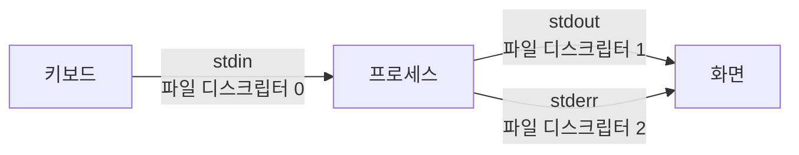
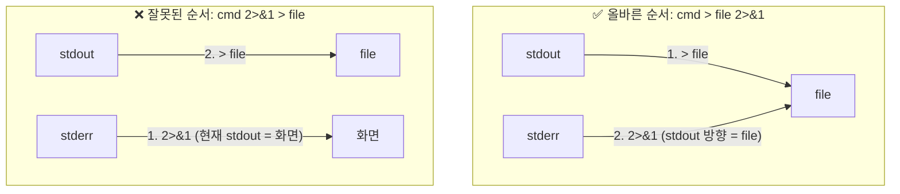
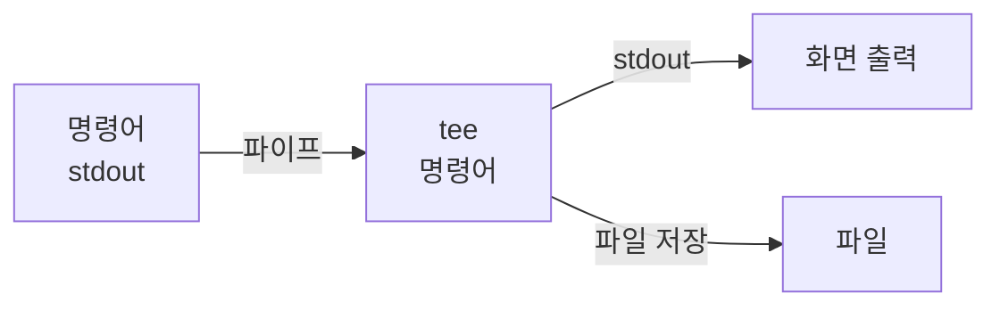

## 학습 목표

리다이렉션은 단순히 `>` 로 파일에 저장하는 것을 넘어, **표준 스트림의 흐름을 자유자재로 제어**하는 기술임. `2>&1` 이 왜 필요한지, 순서가 왜 중요한지를 이해하는 것이 핵심임.

---

## 1. 표준 스트림(Standard Stream) 이해



| 스트림 이름 | 파일 디스크립터 (FD) | 기본 연결 |
|---|---|---|
| 표준 입력 (stdin) | **0** | 키보드 |
| 표준 출력 (stdout) | **1** | 터미널 화면 |
| 표준 에러 (stderr) | **2** | 터미널 화면 |

> stdout 과 stderr 는 둘 다 기본적으로 화면에 출력되지만, **별개의 스트림**임.
{: .prompt-info }

---

## 2. 출력 리다이렉션

```bash
ls -l > filelist.txt       # stdout → 파일 (덮어쓰기)
date >> log.txt            # stdout → 파일 (추가)
> empty.txt                # 빈 파일 생성
```

> `>` 는 파일 내용을 **완전히 지우고** 새로 씀. 실수로 중요한 파일에 쓰지 않도록 주의.
{: .prompt-danger }

---

## 3. 표준 에러 리다이렉션

```bash
find / -name "*.conf" 2> errors.txt    # stderr → 파일
find / -name "*.conf" 2>/dev/null      # stderr 버리기
```

`/dev/null` = 쓰는 데이터는 모두 버려지는 특수 파일.

---

## 4. stdout과 stderr 합치기 — 2>&1



```bash
# ✅ 올바른 순서
ls /없는경로 > output.txt 2>&1
# stdout + stderr 모두 output.txt 에 저장

# ❌ 잘못된 순서
ls /없는경로 2>&1 > output.txt
# stderr 는 화면에, stdout 만 파일에
```

> 리다이렉션은 **왼쪽에서 오른쪽으로 순서대로 처리**됨.
{: .prompt-warning }

---

## 5. &> 단축 표기

```bash
# 아래 두 명령은 동일
ls /없는경로 > output.txt 2>&1
ls /없는경로 &> output.txt
```

---

## 6. tee — 화면과 파일 동시 출력



```bash
ls -l | tee filelist.txt          # 화면 출력 + 파일 저장
make 2>&1 | tee build.log         # 빌드 결과 화면+파일 동시
```

---

## 7. 리다이렉션 연산자 전체 정리

| 연산자 | FD | 의미 | 예시 |
|---|---|---|---|
| `>` | 1 | stdout → 파일 (덮어쓰기) | `cmd > out.txt` |
| `>>` | 1 | stdout → 파일 (추가) | `cmd >> out.txt` |
| `<` | 0 | 파일 → stdin | `cmd < in.txt` |
| `2>` | 2 | stderr → 파일 | `cmd 2> err.txt` |
| `2>/dev/null` | 2 | stderr 버리기 | `cmd 2>/dev/null` |
| `2>&1` | 2→1 | stderr → stdout 방향 | `cmd > out.txt 2>&1` |
| `&>` | 1+2 | stdout+stderr → 파일 | `cmd &> out.txt` |

---

## 8. 실전 패턴 모음

```bash
# 결과는 저장, 에러는 버리기
find / -name "passwd" > results.txt 2>/dev/null

# 결과와 에러를 각각 다른 파일에 저장
./script.sh > output.txt 2> errors.txt

# 결과와 에러 모두 같은 파일에 저장
make &> build.log

# 화면에 보이면서 파일에도 저장
make 2>&1 | tee build.log

# 파이프에 stderr 포함시켜 필터링
find / -name "*.log" 2>&1 | grep -v "Permission denied"
```

> 실무에서 가장 자주 쓰는 패턴: **에러 무시**, **전체 로그 저장**, **파이프+에러 필터링**.
{: .prompt-tip }

---

## 9. 실습

```bash
mkdir -p ~/redirect_lab && cd ~/redirect_lab

# stdout vs stderr 구분
ls /etc/passwd /없는파일 > stdout.txt 2> stderr.txt
cat stdout.txt   # /etc/passwd
cat stderr.txt   # 에러 메시지

# 2>&1 올바른 순서
ls /etc/passwd /없는파일 > both_correct.txt 2>&1
cat both_correct.txt   # 에러 + 결과 모두 저장

# /dev/null 로 에러 숨기기
find / -name "sshd_config" 2>/dev/null

# tee 로 화면+파일 동시
df -h | tee disk_status.txt
```
