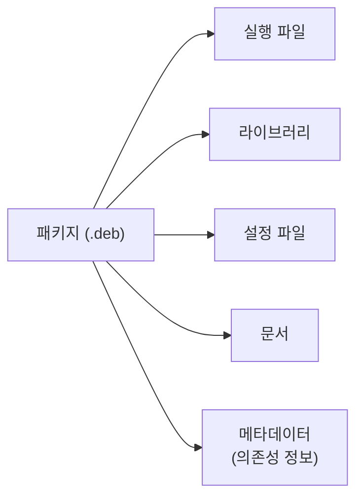
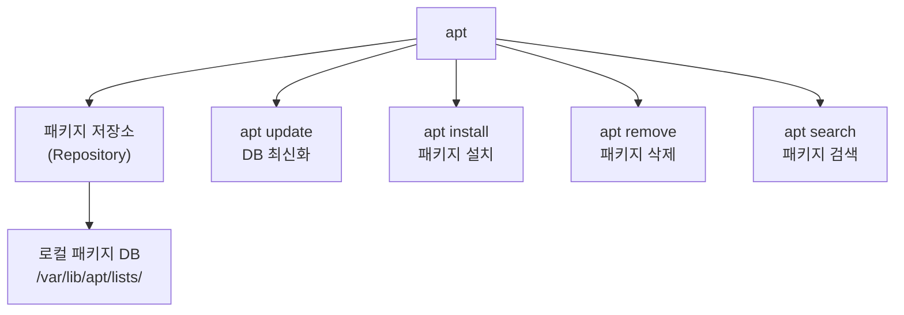
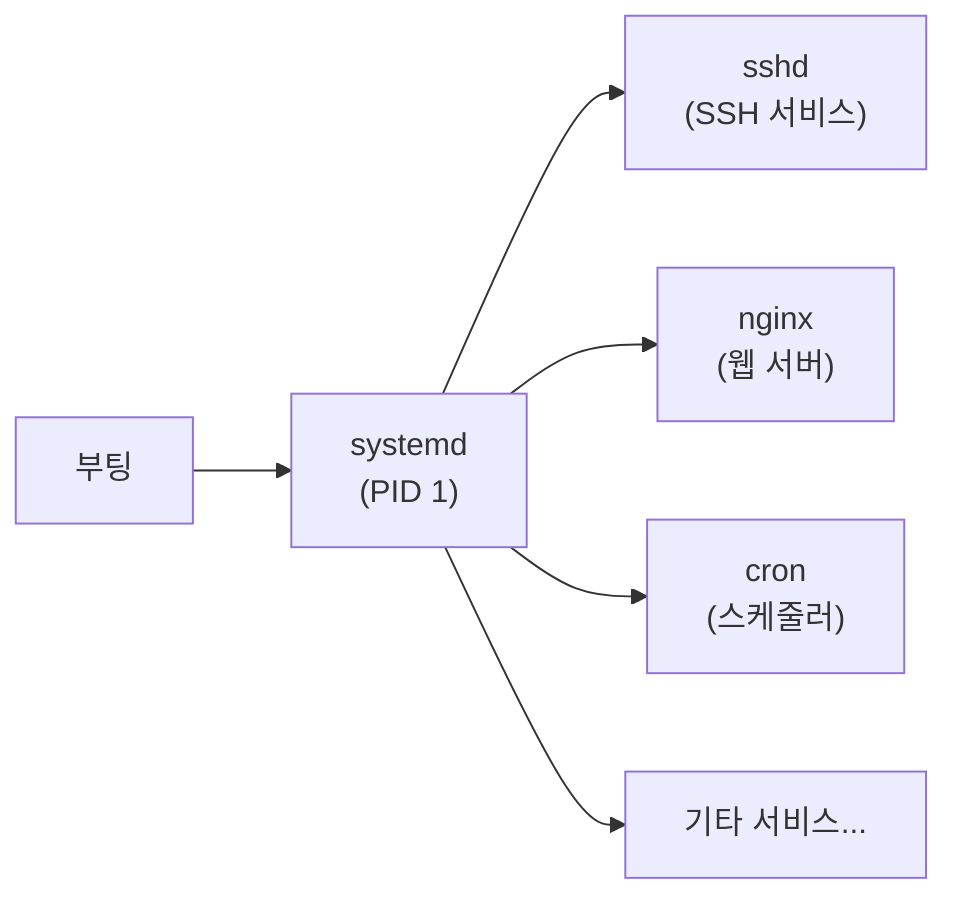
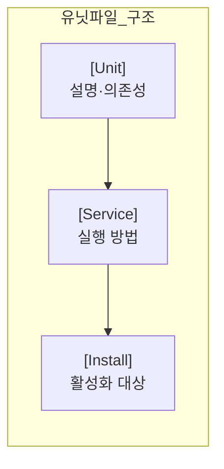
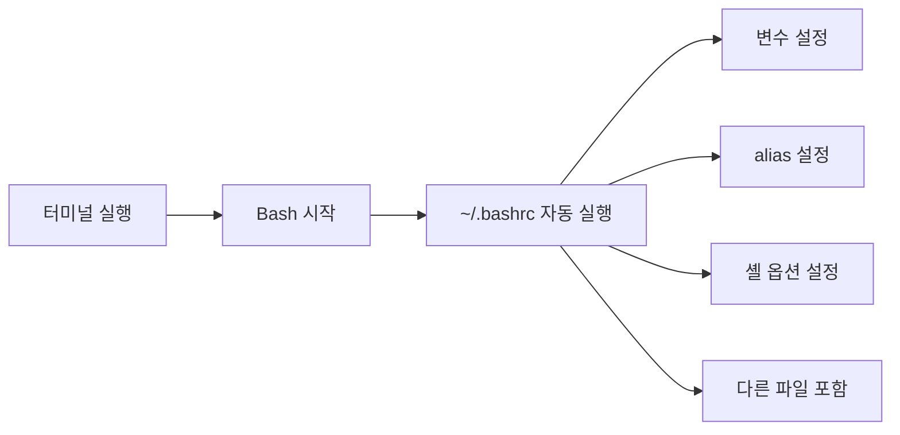
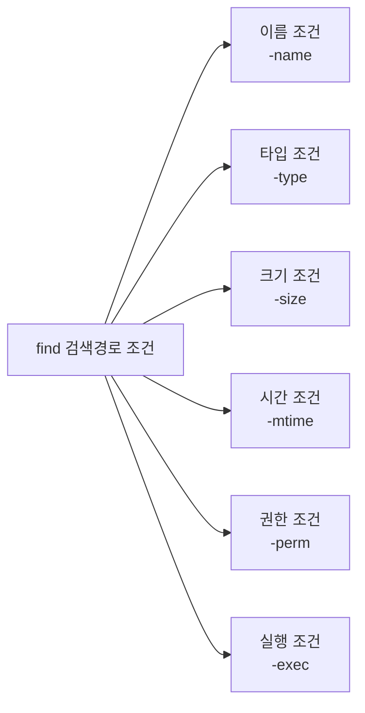
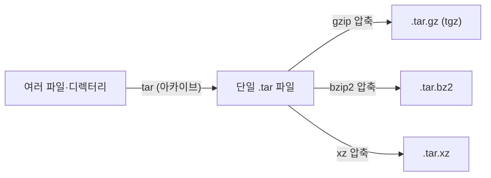

# 시스템 관리와 필수 커맨드라인 툴

# 1장. 패키지 관리 시스템

---

## 1.1 패키지란?

패키지(package)는 **소프트웨어 프로그램과 그에 필요한 파일들을 묶어놓은 단위**이다.



패키지 관리 시스템(PMS, Package Management System)은 **패키지의 설치·업데이트·구성·제거를 자동화**하는 시스템임.  
Ubuntu/Debian 계열은 `.deb` 패키지 형식을 사용하며, 관리 도구로 **apt**를 씀.

> RPM(Red Hat Package Manager) 기반 배포판(CentOS, Fedora)은 `yum` 또는 `dnf`를 사용함. 이 수업은 Ubuntu 기준으로 진행함.
{: .prompt-info }

---

## 1.2 apt 패키지 관리

apt(Advanced Package Tool)는 **데비안·우분투 계열의 기본 패키지 관리 도구**임.



### apt 주요 명령

| 명령 | 설명 |
|---|---|
| `sudo apt update` | 패키지 목록(DB) 최신화 (설치 전 필수) |
| `sudo apt upgrade` | 설치된 패키지 전체 업그레이드 |
| `sudo apt install 패키지명` | 패키지 설치 |
| `sudo apt remove 패키지명` | 패키지 삭제 (설정 파일 유지) |
| `sudo apt purge 패키지명` | 패키지 + 설정 파일까지 삭제 |
| `apt search 키워드` | 패키지 검색 |
| `apt show 패키지명` | 패키지 상세 정보 조회 |
| `apt list --installed` | 설치된 패키지 목록 |

```bash
# 기본 사용 순서
sudo apt update               # 1. DB 업데이트
sudo apt install tree         # 2. tree 설치
tree --version                # 3. 설치 확인
sudo apt remove tree          # 4. 삭제
```

> `apt update` 없이 `apt install` 을 하면 오래된 패키지 DB를 참조해 설치 실패가 발생할 수 있음. 항상 먼저 update 실행을 권장함.
{: .prompt-warning }

---

## 1.3 패키지 의존성

패키지는 다른 패키지에 **의존(dependency)** 할 수 있음. apt가 이를 자동으로 해결함.

```bash
# 의존성 포함 자동 설치
sudo apt install nginx
# → nginx 실행에 필요한 libpcre3, zlib1g 등도 자동 설치됨
```

### 1.4 처음 설치한 Ubuntu에서 해보는 apt 실습

처음 Ubuntu를 설치했다면 아래 순서로 따라 해보면 된다.  
이 예제는 **패키지 검색 → 설치 → 확인 → 삭제** 흐름을 익히는 가장 기본적인 연습이다.

```bash
# 1) 패키지 목록을 최신 상태로 갱신
sudo apt update

# 2) tree 라는 패키지가 있는지 검색
apt search tree

# 3) tree 설치
sudo apt install tree

# 4) 설치가 잘 되었는지 버전 확인
tree --version

# 5) 현재 설치된 패키지 목록에서 tree 확인
apt list --installed | grep tree

# 6) 실습이 끝났으면 삭제
sudo apt remove tree
```

**설명**

- `sudo apt update`: 인터넷 저장소 정보를 새로 받아옴. 설치 전에 거의 항상 먼저 실행함.
- `apt search tree`: `tree` 라는 이름이 들어간 패키지를 검색함.
- `sudo apt install tree`: 패키지를 실제로 설치함.
- `tree --version`: 설치 후 명령이 동작하는지 확인함.
- `apt list --installed | grep tree`: 설치된 목록에서 `tree` 를 다시 확인함.
- `sudo apt remove tree`: 실습 후 패키지를 삭제함.

**초보자 메모**

- `sudo` 는 관리자 권한으로 실행한다는 뜻이다.
- 비밀번호를 입력할 때 화면에 글자가 안 보여도 정상이다.
- 실습 중 `Do you want to continue? [Y/n]` 가 나오면 `Y` 를 입력하고 Enter를 누르면 된다.

---

# 2장. systemd — 서비스 관리

---

## 2.1 데몬과 systemd

데몬(daemon)은 **백그라운드에서 특정 기능을 수행하는 프로세스**임.



systemd는 **리눅스 부팅 후 가장 먼저 실행되는 프로세스(PID 1)** 로, 모든 서비스를 관리함.

> PID 1은 시스템의 모든 프로세스의 조상(parent)임. `ps aux | head -5` 로 확인 가능.
{: .prompt-info }

---

## 2.2 systemctl 주요 명령

systemctl은 systemd를 제어하는 **CLI(Command Line Interface) 도구**임.

| 명령 | 설명 |
|---|---|
| `systemctl list-units` | 현재 실행 중인 유닛(서비스) 목록 |
| `systemctl list-units --type=service` | 서비스 유닛만 목록 조회 |
| `systemctl status 서비스명` | 서비스 현재 상태 조회 |
| `sudo systemctl start 서비스명` | 서비스 시작 |
| `sudo systemctl stop 서비스명` | 서비스 중지 |
| `sudo systemctl restart 서비스명` | 서비스 재시작 |
| `sudo systemctl reload 서비스명` | 설정 파일만 재로드 (중단 없이) |
| `sudo systemctl enable 서비스명` | 부팅 시 자동 시작 등록 |
| `sudo systemctl disable 서비스명` | 부팅 시 자동 시작 해제 |
| `systemctl cat 서비스명` | 유닛 파일 내용 조회 |
| `sudo systemctl daemon-reload` | systemd 설정 다시 로드 |

```bash
# 예시: SSH 서비스 관리
systemctl status ssh           # 상태 확인
sudo systemctl restart ssh     # 재시작
sudo systemctl enable ssh      # 부팅 자동 시작 등록
```

---

## 2.3 유닛 파일 (Unit File)

유닛 파일은 **서비스의 실행 방법, 실행 시점, 의존성, 재시작 정책** 등을 정의하는 설정 파일임.



**유닛 파일 저장 위치:**

| 경로 | 용도 |
|---|---|
| `/usr/lib/systemd/system/` | 패키지가 제공하는 기본 유닛 파일 |
| `/etc/systemd/system/` | 관리자가 생성·수정한 유닛 파일 (우선순위 높음) |

---

### [Unit] 섹션

| 설정 키 | 의미 |
|---|---|
| `Description` | 서비스 설명 문자열 |
| `After` | 지정 유닛 이후에 시작 (순서 의존성) |
| `Requires` | 지정 유닛이 반드시 실행되어야 함 (강한 의존성) |
| `Wants` | 지정 유닛이 있으면 같이 시작 (약한 의존성) |

---

### [Service] 섹션

| 설정 키 | 의미 |
|---|---|
| `Type` | 서비스 타입 (`simple`, `forking`, `oneshot` 등) |
| `ExecStart` | 서비스 시작 명령 |
| `ExecStop` | 서비스 중지 명령 |
| `ExecReload` | 설정 재로드 명령 |
| `Restart` | 재시작 정책 (`on-failure`, `always` 등) |
| `User` | 서비스 실행 사용자 |
| `WorkingDirectory` | 작업 디렉터리 |
| `EnvironmentFile` | 환경변수 파일 경로 |

---

### [Install] 섹션

| 설정 키 | 의미 |
|---|---|
| `WantedBy` | 어떤 타깃 유닛에 포함될지 지정 (`multi-user.target` 이 일반적) |
| `Alias` | 서비스 별칭 |
| `Also` | `enable` 시 함께 활성화할 서비스 |

**주요 타깃 유닛:**

| 타깃 | 의미 |
|---|---|
| `multi-user.target` | 네트워크 가능한 다중 사용자 모드 (서버의 기본) |
| `graphical.target` | GUI 포함 모드 |
| `rescue.target` | 단일 사용자 복구 모드 |

---

## 2.4 유닛 파일 작성 예시

```ini
[Unit]
Description=My Hello Service
After=network.target

[Service]
Type=simple
ExecStart=/usr/local/bin/hello.sh
Restart=on-failure
User=nobody

[Install]
WantedBy=multi-user.target
```

```bash
# 유닛 파일 등록 및 서비스 시작
sudo cp hello.service /etc/systemd/system/
sudo systemctl daemon-reload          # systemd에 새 유닛 파일 인식
sudo systemctl enable hello.service   # 부팅 시 자동 시작
sudo systemctl start hello.service    # 즉시 시작
systemctl status hello.service        # 상태 확인
```

### 2.5 처음 설치한 Ubuntu에서 해보는 systemctl 실습

처음 배우는 학생은 **이미 설치되어 있을 가능성이 높은 서비스 상태를 확인하는 것**부터 시작하는 것이 안전하다.  
아래 예제는 `systemd-timesyncd` 를 기준으로 적었지만, 환경에 따라 없을 수 있으니 먼저 서비스 목록을 확인한다.

```bash
# 1) 현재 실행 중인 서비스 몇 개를 확인
systemctl list-units --type=service

# 2) 시간 동기화 서비스 상태 확인
systemctl status systemd-timesyncd

# 3) 유닛 파일 내용 확인
systemctl cat systemd-timesyncd

# 4) 서비스 재시작
sudo systemctl restart systemd-timesyncd

# 5) 다시 상태 확인
systemctl status systemd-timesyncd
```

**설명**

- `systemctl list-units --type=service`: 현재 systemd가 관리 중인 서비스 목록을 보여줌.
- `systemctl status 서비스명`: 서비스가 실행 중인지, 오류는 없는지 확인함.
- `systemctl cat 서비스명`: 그 서비스가 어떤 설정으로 동작하는지 보여줌.
- `sudo systemctl restart 서비스명`: 서비스를 껐다가 다시 시작함.

> 어떤 서비스 이름을 써야 할지 모르겠다면 먼저 `systemctl list-units --type=service` 를 실행해서 실제로 존재하는 서비스를 하나 고른 뒤 실습하면 된다.
{: .prompt-tip }

### 2.6 직접 만들어 보는 아주 간단한 유닛 파일 실습

아래 실습은 "내가 만든 스크립트를 systemd가 실행하게 할 수 있구나" 를 체험하는 목적이다.

```bash
# 1) 실습용 스크립트 작성
sudo nano /usr/local/bin/hello.sh
```

`hello.sh` 내용:

```bash
#!/bin/bash
echo "hello systemd" >> /tmp/hello.log
```

```bash
# 2) 실행 권한 부여
sudo chmod +x /usr/local/bin/hello.sh

# 3) 유닛 파일 작성
sudo nano /etc/systemd/system/hello.service
```

`hello.service` 내용:

```ini
[Unit]
Description=Simple Hello Service

[Service]
Type=oneshot
ExecStart=/usr/local/bin/hello.sh

[Install]
WantedBy=multi-user.target
```

```bash
# 4) systemd에 새 유닛 파일 반영
sudo systemctl daemon-reload

# 5) 서비스 실행
sudo systemctl start hello.service

# 6) 상태 확인
systemctl status hello.service

# 7) 결과 확인
cat /tmp/hello.log
```

**핵심 포인트**

- `Type=oneshot`: 짧게 한 번 실행하고 끝나는 작업에 적합함.
- `ExecStart=`: 실제로 실행할 명령 또는 스크립트 경로를 적음.
- `/tmp/hello.log`: 실행 결과가 남는 파일이다. 이 파일이 생기면 서비스가 실제로 동작한 것임.

---

# 3장. .bashrc 개인화

---

## 3.1 .bashrc 파일이란?

`.bashrc`는 **Bash 셸이 초기화될 때 자동으로 읽어들이는 셸 스크립트 파일**임.



| 파일 | 실행 시점 | 용도 |
|---|---|---|
| `~/.bashrc` | 비로그인 셸(터미널 새 창) 시작 시 | alias, 함수, 셸 옵션 |
| `~/.bash_profile` | 로그인 셸(SSH 접속) 시작 시 | 환경변수, PATH 설정 |
| `/etc/bash.bashrc` | 모든 사용자 공통 bashrc | 시스템 전체 기본값 |

---

## 3.2 alias 설정

```bash
# ~/.bashrc 에 추가
alias ll='ls -alF'
alias la='ls -A'
alias l='ls -CF'
alias ..='cd ..'
alias ...='cd ../..'
alias grep='grep --color=auto'
alias cls='clear'
alias update='sudo apt update && sudo apt upgrade'
```

설정 후 즉시 반영:

```bash
source ~/.bashrc    # 또는
. ~/.bashrc
```

---

## 3.3 변수/환경변수 설정

```bash
# ~/.bashrc 에 추가
export EDITOR=nano                      # 기본 편집기
export HISTSIZE=10000                   # 히스토리 저장 수
export HISTFILESIZE=20000               # 히스토리 파일 크기
export HISTTIMEFORMAT="%Y-%m-%d %T "    # 히스토리에 시간 표시
export PATH="$HOME/.local/bin:$PATH"    # PATH 추가
```

---

## 3.4 PS1 프롬프트 커스터마이징

```bash
# ~/.bashrc 에 추가 (색상 포함 프롬프트)
export PS1='\[\033[01;32m\]\u@\h\[\033[00m\]:\[\033[01;34m\]\w\[\033[00m\]\$ '
# 출력 예: user@ubuntu:~/textlab$
```

| PS1 특수 문자 | 의미 |
|---|---|
| `\u` | 현재 사용자명 |
| `\h` | 호스트명 |
| `\w` | 현재 작업 디렉터리 (전체 경로) |
| `\W` | 현재 디렉터리명만 |
| `\$` | root면 `#`, 일반 사용자면 `$` |
| `\t` | 현재 시간 (HH:MM:SS) |

### 3.5 처음 설치한 Ubuntu에서 해보는 .bashrc 실습

`.bashrc` 는 자주 쓰는 명령을 짧게 만들거나, 프롬프트 모양을 바꾸는 데 많이 사용한다.  
처음에는 **실수해도 복구하기 쉬운 alias 1개와 환경변수 1개**만 넣어보는 것이 좋다.

```bash
# 1) 현재 bashrc 백업
cp ~/.bashrc ~/.bashrc.backup

# 2) bashrc 수정
nano ~/.bashrc
```

아래 내용을 맨 아래에 추가:

```bash
# 자주 쓰는 명령을 짧게 등록
alias ll='ls -alF'

# 내가 선호하는 기본 편집기 설정
export EDITOR=nano
```

```bash
# 3) 수정 내용을 즉시 반영
source ~/.bashrc

# 4) alias 동작 확인
ll

# 5) 환경변수 확인
echo $EDITOR
```

**설명**

- `cp ~/.bashrc ~/.bashrc.backup`: 실수했을 때 되돌리기 위한 백업 파일을 만듦.
- `nano ~/.bashrc`: 설정 파일을 편집함.
- `source ~/.bashrc`: 터미널을 껐다 켜지 않아도 변경 내용을 바로 적용함.
- `ll`: 이제 `ls -alF` 대신 짧게 사용할 수 있음.

---

# 4장. find — 파일 검색

---

## 4.1 find 개요

find는 **조건에 맞는 파일·디렉터리를 재귀적으로 검색**하는 명령어임.



**기본 형식:**

```bash
find [검색경로] [조건] [액션]
```

---

## 4.2 find 주요 옵션

### 이름/타입 조건

| 옵션 | 의미 | 예시 |
|---|---|---|
| `-name '패턴'` | 파일명 패턴 일치 (대소문자 구분) | `-name '*.log'` |
| `-iname '패턴'` | 파일명 패턴 (대소문자 무시) | `-iname '*.TXT'` |
| `-type f` | 일반 파일만 | `-type f` |
| `-type d` | 디렉터리만 | `-type d` |
| `-type l` | 심볼릭 링크만 | `-type l` |

### 크기/시간 조건

| 옵션 | 의미 | 예시 |
|---|---|---|
| `-size +10M` | 10MB 초과 파일 | `-size +100M` |
| `-size -1k` | 1KB 미만 파일 | `-size -1k` |
| `-mtime -7` | 7일 이내 수정된 파일 | `-mtime -7` |
| `-mtime +30` | 30일 이전에 수정된 파일 | `-mtime +30` |
| `-newer file` | file보다 최근에 수정된 파일 | `-newer /etc/passwd` |

### 권한/소유자 조건

| 옵션 | 의미 | 예시 |
|---|---|---|
| `-perm 644` | 권한이 정확히 644인 파일 | `-perm 644` |
| `-perm /u+s` | SUID 설정된 파일 | `-perm /u+s` |
| `-user 사용자명` | 소유자가 일치하는 파일 | `-user pig` |
| `-group 그룹명` | 소유그룹이 일치하는 파일 | `-group animals` |

### 액션

| 옵션 | 의미 |
|---|---|
| `-exec 명령 {} \;` | 검색된 파일에 명령 실행 |
| `-exec 명령 {} +` | 검색된 파일을 한꺼번에 인자로 전달 |
| `-delete` | 검색된 파일 삭제 |
| `-ls` | 상세 정보 출력 (`ls -l` 형식) |
| `-print` | 파일 경로 출력 (기본값) |

---

## 4.3 find 사용 예시

```bash
# /etc 에서 .conf 파일 검색
find /etc -name "*.conf"

# 현재 디렉터리에서 빈 파일 찾기
find . -type f -empty

# 100MB 이상 파일 찾기
find / -type f -size +100M 2>/dev/null

# 7일 이내 수정된 .log 파일
find /var/log -name "*.log" -mtime -7

# SUID 설정된 파일 보안 점검
find / -perm /u+s -type f 2>/dev/null

# 찾은 파일 일괄 삭제 (30일 이상 된 tmp 파일)
find /tmp -type f -mtime +30 -delete

# 찾은 파일에 명령 실행 (권한 변경)
find . -name "*.sh" -exec chmod +x {} \;

# 소유자가 pig인 파일 찾기
find /home -user pig -type f
```

> `-exec` 를 사용할 때 `{}` 는 찾은 파일명이 삽입되는 자리이고, `\;` 는 명령 종료를 의미함.
{: .prompt-info }

### 4.4 처음 설치한 Ubuntu에서 해보는 find 실습

처음에는 시스템 전체(`/`)를 검색하기보다 **내 홈 디렉터리 아래에 연습용 폴더를 만들고 실습**하는 것이 안전하다.

```bash
# 1) 연습용 폴더와 파일 준비
mkdir -p ~/find-practice/docs
touch ~/find-practice/a.txt
touch ~/find-practice/b.log
touch ~/find-practice/docs/c.txt
touch ~/find-practice/empty.txt
```

```bash
# 2) .txt 파일 찾기
find ~/find-practice -name "*.txt"

# 3) 디렉터리만 찾기
find ~/find-practice -type d

# 4) 빈 파일 찾기
find ~/find-practice -type f -empty

# 5) 찾은 파일 상세 정보까지 보기
find ~/find-practice -name "*.log" -ls
```

**설명**

- `mkdir -p`: 디렉터리를 만듦. 중간 경로가 없어도 함께 생성함.
- `touch`: 빈 파일을 만듦.
- `find ~/find-practice -name "*.txt"`: 이름이 `.txt` 로 끝나는 파일을 찾음.
- `find ~/find-practice -type d`: 디렉터리만 찾음.
- `find ~/find-practice -type f -empty`: 빈 일반 파일만 찾음.
- `-ls`: 찾은 파일의 권한, 크기, 시간 정보를 같이 보여줌.

---

# 5장. stat, df, du — 파일/디스크 정보

---

## 5.1 stat — 파일 상세 정보

stat은 **파일의 inode 정보, 권한, 타임스탬프 등 상세 메타데이터를 출력**함.

```bash
stat /etc/passwd
```

**출력 예시:**
```
  File: /etc/passwd
  Size: 2038            Blocks: 8          IO Block: 4096   regular file
Device: 801h/2049d      Inode: 524321      Links: 1
Access: (0644/-rw-r--r--)  Uid: (    0/    root)   Gid: (    0/    root)
Access: 2026-03-11 09:00:00.000 +0900
Modify: 2026-03-10 18:30:00.000 +0900
Change: 2026-03-10 18:30:00.000 +0900
 Birth: 2026-01-01 00:00:00.000 +0900
```

| 항목 | 의미 |
|---|---|
| `Size` | 파일 크기 (바이트) |
| `Inode` | inode 번호 |
| `Access` | 마지막 **읽기** 시간 (atime) |
| `Modify` | 마지막 **내용 변경** 시간 (mtime) |
| `Change` | 마지막 **메타데이터 변경** 시간 (ctime) |

> atime, mtime, ctime 의 차이는 시험에 자주 출제됨. mtime = 파일 내용 수정, ctime = 권한/소유자 변경도 포함.
{: .prompt-tip }

---

## 5.2 df — 파일시스템 디스크 사용량

df(Disk Free)는 **마운트된 파일시스템 전체의 사용량과 여유 공간**을 보여줌.

```bash
df -h
```

**출력 예시:**
```
Filesystem      Size  Used Avail Use% Mounted on
/dev/sda1        20G  8.5G   11G  45% /
tmpfs           2.0G     0  2.0G   0% /dev/shm
/dev/sda2       100G   50G   50G  50% /home
```

| 옵션 | 의미 |
|---|---|
| `-h` | 사람이 읽기 쉬운 단위 (KB/MB/GB) |
| `-T` | 파일시스템 타입 함께 출력 |
| `-i` | inode 사용량 출력 |

> `df` 와 `du` 의 차이: `df`는 **파티션/마운트 포인트 전체 공간**, `du`는 **특정 파일/디렉터리가 차지하는 공간**.
{: .prompt-info }

---

## 5.3 du — 디렉터리/파일 용량

du(Disk Usage)는 **파일이나 디렉터리가 차지하는 실제 디스크 용량**을 출력함.

```bash
du -sh /var/log
```

**출력 예시:**
```
124M    /var/log
```

| 옵션 | 의미 |
|---|---|
| `-s` | 요약(summary) — 하위 합산 총합만 출력 |
| `-h` | 사람이 읽기 쉬운 단위 |
| `-a` | 파일 단위로 모두 출력 |
| `--max-depth=1` | 1단계 하위 디렉터리까지만 표시 |

```bash
# 홈 디렉터리 용량
du -sh ~

# /var 하위 디렉터리별 용량 (큰 것 순)
du -h --max-depth=1 /var | sort -rh

# 상위 10개 큰 파일 찾기
du -ah /var/log | sort -rh | head -10
```

### 5.4 처음 설치한 Ubuntu에서 해보는 stat, df, du 실습

이 세 명령어는 헷갈리기 쉽다.  
처음에는 "`stat` 은 파일 1개", "`du` 는 폴더 용량", "`df` 는 디스크 전체"라고 기억하면 편하다.

```bash
# 1) 연습용 파일 하나 만들기
echo "linux practice" > ~/find-practice/info.txt

# 2) 파일 상세 정보 보기
stat ~/find-practice/info.txt

# 3) 내 홈 디렉터리의 전체 사용량 보기
du -sh ~

# 4) 연습용 폴더 사용량 보기
du -sh ~/find-practice

# 5) 디스크 전체 여유 공간 보기
df -h
```

**설명**

- `stat 파일명`: 파일의 크기, 수정 시간, 권한 등을 자세히 봄.
- `du -sh 경로`: 그 경로가 실제로 얼마나 공간을 쓰는지 요약해서 봄.
- `df -h`: 현재 디스크가 얼마나 찼는지 전체 관점에서 봄.

**한 번에 구분하기**

- `stat`: 파일 1개의 주민등록증
- `du`: 특정 폴더의 몸집
- `df`: 컴퓨터 저장공간 전체 현황판

---

# 6장. tar — 아카이브와 압축

---

## 6.1 아카이브와 압축



- **아카이브(archive)**: 여러 파일을 하나의 파일로 묶는 것 (압축 아님)
- **압축**: 데이터 크기를 줄이는 것
- `tar`는 아카이브 + 압축을 함께 처리함

---

## 6.2 tar 주요 옵션

| 옵션 | 의미 |
|---|---|
| `-c` | **c**reate — 새 아카이브 생성 |
| `-x` | e**x**tract — 아카이브 해제 |
| `-t` | lis**t** — 아카이브 내용 목록 조회 |
| `-v` | **v**erbose — 처리 파일 목록 출력 |
| `-f 파일명` | 아카이브 **f**ile 이름 지정 (필수) |
| `-z` | gzip 압축/해제 (`.tar.gz`) |
| `-j` | bzip2 압축/해제 (`.tar.bz2`) |
| `-J` | xz 압축/해제 (`.tar.xz`) |
| `-C 디렉터리` | 지정 디렉터리로 해제 |

---

## 6.3 tar 사용 패턴

```bash
# 아카이브 생성 (압축 없이)
tar -cvf backup.tar mydir/

# gzip 압축 아카이브 생성
tar -czvf backup.tar.gz mydir/

# bzip2 압축 아카이브 생성
tar -cjvf backup.tar.bz2 mydir/

# 아카이브 내용 목록 확인 (해제 없이)
tar -tvf backup.tar.gz

# 현재 디렉터리에 해제
tar -xzvf backup.tar.gz

# 특정 디렉터리에 해제
tar -xzvf backup.tar.gz -C /tmp/restore/

# /etc 디렉터리 백업 (날짜 포함 파일명)
tar -czvf etc_backup_$(date +%Y%m%d).tar.gz /etc/
```

> `-f` 옵션은 항상 마지막에 위치해야 하며, 바로 뒤에 파일명이 와야 함. `-f backup.tar.gz` 형태로 붙여 쓰는 것이 안전함.
{: .prompt-warning }

---

## 6.4 압축 방식 비교

| 확장자 | 압축 방식 | 압축률 | 속도 |
|---|---|---|---|
| `.tar` | 없음 | — | 빠름 |
| `.tar.gz` / `.tgz` | gzip | 보통 | 보통 |
| `.tar.bz2` | bzip2 | 높음 | 느림 |
| `.tar.xz` | xz | 매우 높음 | 매우 느림 |

### 6.5 처음 설치한 Ubuntu에서 해보는 tar 실습

`tar` 는 백업과 제출 파일 정리에 자주 쓰인다.  
처음에는 **폴더 하나를 묶고, 목록을 보고, 다시 풀어보는 것**까지만 해보면 충분하다.

```bash
# 1) 연습용 폴더를 tar.gz 로 압축
tar -czvf find-practice.tar.gz ~/find-practice

# 2) 압축 파일 내용 확인
tar -tvf find-practice.tar.gz

# 3) 압축 해제용 폴더 만들기
mkdir -p ~/restore-practice

# 4) 지정한 폴더에 압축 해제
tar -xzvf find-practice.tar.gz -C ~/restore-practice
```

**설명**

- `-c`: 새 압축 파일 생성
- `-z`: gzip 방식 사용
- `-v`: 처리 과정을 화면에 보여줌
- `-f`: 압축 파일 이름 지정
- `-x`: 압축 해제
- `-C`: 지정한 폴더로 풀기

**실습 후 확인**

```bash
find ~/restore-practice -name "*.txt"
```

압축을 풀었을 때 원래 파일들이 다시 보이면 성공이다.

---

# 7장. read — 표준 입력 처리

---

## 7.1 read 개요

read는 **표준 입력에서 한 줄을 읽어 변수에 저장**하는 Bash 내장 명령어임.  
셸 스크립트에서 사용자 입력을 받을 때 주로 사용함.

```bash
read 변수명
read -p "프롬프트: " 변수명    # 입력 전 프롬프트 출력
read -s 변수명                # 입력 내용 화면에 표시하지 않음 (비밀번호)
read -t 초 변수명             # 타임아웃 설정
read -n 글자수 변수명         # 지정 글자 수만큼만 읽기
```

```bash
#!/bin/bash
read -p "이름을 입력하세요: " name
echo "안녕하세요, ${name}님!"

read -p "나이를 입력하세요: " age
if [ "$age" -ge 18 ]; then
    echo "성인입니다."
else
    echo "미성년자입니다."
fi
```

### 7.2 처음 설치한 Ubuntu에서 해보는 read 실습

`read` 는 사용자의 입력을 받는 가장 기본적인 방법이다.  
처음에는 이름과 학번 정도를 입력받는 간단한 스크립트로 연습하면 이해가 빠르다.

```bash
# 1) 스크립트 파일 만들기
nano ~/hello_read.sh
```

아래 내용을 입력:

```bash
#!/bin/bash

read -p "이름을 입력하세요: " name
read -p "학번을 입력하세요: " student_id

echo "입력한 이름: $name"
echo "입력한 학번: $student_id"
echo "반갑습니다, ${name}님."
```

```bash
# 2) 실행 권한 부여
chmod +x ~/hello_read.sh

# 3) 실행
~/hello_read.sh
```

**설명**

- `read -p "문장" 변수명`: 안내 문장을 보여준 뒤 값을 입력받아 변수에 저장함.
- `$name`, `$student_id`: 앞에서 입력한 값을 다시 꺼내서 출력함.
- `chmod +x`: 스크립트를 실행 가능하게 만듦.

**추가 연습**

```bash
read -s -p "비밀번호를 입력하세요: " pw
echo
echo "입력이 완료되었습니다."
```

`-s` 옵션을 쓰면 입력 내용이 화면에 보이지 않는다.

---

# 8장. 핵심 명령어 요약

---

## 8.1 시스템 관리 명령어

| 명령어 | 주요 역할 | 핵심 예시 |
|---|---|---|
| `apt update` | 패키지 DB 업데이트 | `sudo apt update` |
| `apt install` | 패키지 설치 | `sudo apt install nginx` |
| `apt remove` | 패키지 삭제 | `sudo apt remove nginx` |
| `systemctl status` | 서비스 상태 확인 | `systemctl status ssh` |
| `systemctl start/stop` | 서비스 시작/중지 | `sudo systemctl start nginx` |
| `systemctl enable` | 부팅 자동 시작 | `sudo systemctl enable nginx` |
| `systemctl daemon-reload` | systemd 설정 재로드 | `sudo systemctl daemon-reload` |
| `source ~/.bashrc` | bashrc 즉시 반영 | `. ~/.bashrc` |

## 8.2 파일 검색·정보 명령어

| 명령어 | 주요 역할 | 핵심 예시 |
|---|---|---|
| `find` | 조건으로 파일 검색 | `find /etc -name "*.conf"` |
| `stat` | 파일 메타데이터 조회 | `stat /etc/passwd` |
| `df -h` | 파일시스템 사용량 | `df -h` |
| `du -sh` | 디렉터리 용량 | `du -sh /var/log` |
| `tar -czvf` | 압축 아카이브 생성 | `tar -czvf backup.tar.gz dir/` |
| `tar -xzvf` | 압축 아카이브 해제 | `tar -xzvf backup.tar.gz` |
