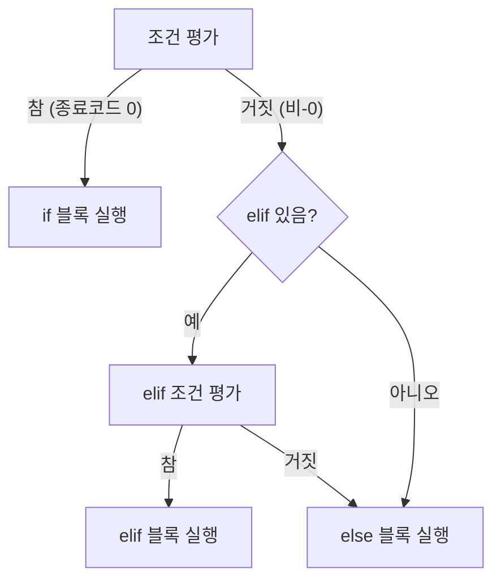
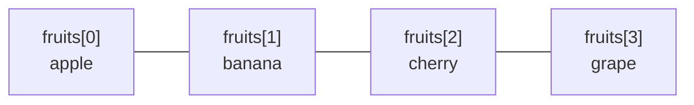

# Bash 스크립팅 기초 — 변수·조건문·반복문·함수·배열

> 이번 주차는 **처음부터 직접 따라하는** 방식으로 진행함. 터미널을 열고 예제를 하나씩 입력하며 확인할 것.
{: .prompt-tip }

---

# 1장. 변수 기초 (9장)

---

## 1.1 변수 선언과 사용

변수(variable)는 **데이터를 담는 이름 있는 그릇**임. Bash에서는 모든 변수 값이 기본적으로 **문자열**로 처리됨.

```bash
# 선언: 등호(=) 양쪽에 공백 없이 작성
name="홍길동"
age=25
city="서울"

# 사용: $ 또는 ${} 로 참조
echo $name
echo ${name}
echo "${name}님은 ${age}살이고 ${city}에 삽니다."
```

**실행 결과:**
```
홍길동
홍길동
홍길동님은 25살이고 서울에 삽니다.
```

> 중괄호 `${변수명}`은 생략 가능하지만, 다른 문자와 붙여 쓸 때는 반드시 필요함.  
> 예: `${name}씨` (올바름) vs `$name씨` (name씨 라는 변수를 찾아 빈 문자열 반환)
{: .prompt-warning }

---

## 1.2 산술 연산

Bash 변수는 기본이 문자열이므로 산술 연산에는 별도 방법이 필요함.

```bash
a=10
b=3

# 방법 1: $(( )) 산술 확장 — 가장 권장
echo $((a + b))     # 13
echo $((a - b))     # 7
echo $((a * b))     # 30
echo $((a / b))     # 3  (정수 나눗셈)
echo $((a % b))     # 1  (나머지)
echo $((2 ** 8))    # 256 (거듭제곱)

# 방법 2: let
let result=a+b
echo $result        # 13

# 방법 3: expr (공백 필수)
result=$(expr $a + $b)
echo $result        # 13
```

**실행 결과:**
```
13
7
30
3
1
256
13
13
```

---

## 1.3 첫 번째 스크립트 작성

```bash
# 파일 생성
cat > ~/calc.sh << 'EOF'
#!/bin/bash
a=10
b=3
echo "a = $a, b = $b"
echo "더하기: $((a + b))"
echo "빼기:   $((a - b))"
echo "곱하기: $((a * b))"
echo "나누기: $((a / b))"
echo "나머지: $((a % b))"
EOF

chmod +x ~/calc.sh
~/calc.sh
```

**실행 결과:**
```
a = 10, b = 3
더하기: 13
빼기:   7
곱하기: 30
나누기: 3
나머지: 1
```

---

# 2장. 조건문과 테스트 연산자 (9장)

---

## 2.1 if 문 형식



```bash
# 기본 형식
if [ 조건 ]; then
    명령
elif [ 조건2 ]; then
    명령2
else
    명령3
fi
```

---

## 2.2 테스트 연산자 종류

### 문자열 비교

| 연산자 | 의미 | 예시 |
|---|---|---|
| `[ "$a" = "$b" ]` | 같다 | `[ "$name" = "root" ]` |
| `[ "$a" != "$b" ]` | 다르다 | `[ "$OS" != "Windows" ]` |
| `[ -z "$a" ]` | **z**ero — 빈 문자열 | `[ -z "$input" ]` |
| `[ -n "$a" ]` | **n**ot empty — 비어있지 않음 | `[ -n "$result" ]` |

### 숫자 비교

| 연산자 | 의미 | 수학 기호 |
|---|---|---|
| `-eq` | equal (같다) | `=` |
| `-ne` | not equal (다르다) | `≠` |
| `-gt` | greater than (크다) | `>` |
| `-ge` | greater or equal (크거나 같다) | `≥` |
| `-lt` | less than (작다) | `<` |
| `-le` | less or equal (작거나 같다) | `≤` |

### 파일 테스트

| 연산자 | 의미 |
|---|---|
| `-f 파일` | 일반 파일 존재 |
| `-d 경로` | 디렉터리 존재 |
| `-e 경로` | 파일/디렉터리 존재 (모두 해당) |
| `-r 파일` | 읽기 권한 있음 |
| `-w 파일` | 쓰기 권한 있음 |
| `-x 파일` | 실행 권한 있음 |
| `-s 파일` | 파일이 비어있지 않음 (크기 > 0) |

### 논리 연산자

| 표기 | 의미 | 예시 |
|---|---|---|
| `[ 조건1 ] && [ 조건2 ]` | AND | `[ -f file ] && [ -r file ]` |
| `[ 조건1 ] \|\| [ 조건2 ]` | OR | `[ -z "$a" ] \|\| [ -z "$b" ]` |
| `[ ! 조건 ]` | NOT | `[ ! -f file ]` |

---

## 2.3 if 문 예제 따라하기

```bash
cat > ~/grade.sh << 'EOF'
#!/bin/bash
score=$1   # 첫 번째 인자를 점수로 받음

if [ -z "$score" ]; then
    echo "사용법: $0 점수"
    exit 1
fi

if [ $score -ge 90 ]; then
    echo "${score}점 → A학점"
elif [ $score -ge 80 ]; then
    echo "${score}점 → B학점"
elif [ $score -ge 70 ]; then
    echo "${score}점 → C학점"
elif [ $score -ge 60 ]; then
    echo "${score}점 → D학점"
else
    echo "${score}점 → F학점"
fi
EOF
chmod +x ~/grade.sh

~/grade.sh 95
~/grade.sh 83
~/grade.sh 55
```

**실행 결과:**
```
95점 → A학점
83점 → B학점
55점 → F학점
```

---

## 2.4 파일 존재 확인 예제

```bash
cat > ~/check_file.sh << 'EOF'
#!/bin/bash
target=$1

if [ -z "$target" ]; then
    echo "사용법: $0 파일경로"
    exit 1
fi

if [ -d "$target" ]; then
    echo "[DIR]  $target"
elif [ -f "$target" ]; then
    size=$(du -sh "$target" | cut -f1)
    echo "[FILE] $target (크기: $size)"
    [ -r "$target" ] && echo "       읽기 권한: 있음"
    [ -w "$target" ] && echo "       쓰기 권한: 있음"
    [ -x "$target" ] && echo "       실행 권한: 있음"
else
    echo "[없음] $target 가 존재하지 않습니다."
fi
EOF
chmod +x ~/check_file.sh

~/check_file.sh /etc/passwd
~/check_file.sh /etc
~/check_file.sh /없는파일
```

**실행 결과:**
```
[FILE] /etc/passwd (크기: 4.0K)
       읽기 권한: 있음
       쓰기 권한: 있음
[DIR]  /etc
[없음] /없는파일 가 존재하지 않습니다.
```

---

## 2.5 case 문

case 문은 **하나의 변수를 여러 패턴과 비교**할 때 if-elif 연속보다 간결함.

```bash
cat > ~/day_type.sh << 'EOF'
#!/bin/bash
day=$(date +%a)   # Mon, Tue, Wed ... 형식

case $day in
    Mon|Tue|Wed|Thu|Fri)
        echo "평일입니다. 오늘은 ${day}요일."
        ;;
    Sat|Sun)
        echo "주말입니다! 오늘은 ${day}요일."
        ;;
    *)
        echo "알 수 없는 요일: $day"
        ;;
esac
EOF
chmod +x ~/day_type.sh
~/day_type.sh
```

**실행 결과 (수요일이라면):**
```
평일입니다. 오늘은 Wed요일.
```

---

# 3장. 반복문 (10장)

---

## 3.1 for 문

```bash
# 목록 순환
for 변수 in 값1 값2 값3; do
    명령
done
```

### 예제 1: 목록 순환

```bash
for fruit in apple banana cherry grape; do
    echo "과일: $fruit"
done
```

**실행 결과:**
```
과일: apple
과일: banana
과일: cherry
과일: grape
```

### 예제 2: 범위 순환 `{시작..끝}`

```bash
# 1부터 5까지
for i in {1..5}; do
    echo -n "$i "
done
echo ""

# 파일 백업
for f in /etc/passwd /etc/hosts /etc/hostname; do
    cp "$f" "/tmp/$(basename $f).bak"
    echo "백업 완료: $f"
done
```

**실행 결과:**
```
1 2 3 4 5 
백업 완료: /etc/passwd
백업 완료: /etc/hosts
백업 완료: /etc/hostname
```

### 예제 3: C 스타일 for

```bash
# 구구단 3단
for ((i=1; i<=9; i++)); do
    echo "3 × $i = $((3 * i))"
done
```

**실행 결과:**
```
3 × 1 = 3
3 × 2 = 6
...
3 × 9 = 27
```

---

## 3.2 while 문

```bash
# 조건이 참인 동안 반복
while [ 조건 ]; do
    명령
done
```

### 예제: 카운트다운

```bash
cat > ~/countdown.sh << 'EOF'
#!/bin/bash
count=5
echo "카운트다운 시작!"
while [ $count -gt 0 ]; do
    echo "$count..."
    ((count--))
done
echo "발사!"
EOF
chmod +x ~/countdown.sh
~/countdown.sh
```

**실행 결과:**
```
카운트다운 시작!
5...
4...
3...
2...
1...
발사!
```

### 예제: 파일을 한 줄씩 읽기

```bash
# /etc/passwd 에서 bash 사용자만 출력
while IFS=: read -r user _ uid _ _ home shell; do
    if [ "$shell" = "/bin/bash" ]; then
        echo "사용자: $user (UID:$uid) 홈: $home"
    fi
done < /etc/passwd
```

**실행 결과 예시:**
```
사용자: root (UID:0) 홈: /root
사용자: user (UID:1000) 홈: /home/user
```

---

## 3.3 until 문

```bash
# 조건이 거짓인 동안 반복 (while의 반대)
until [ 조건 ]; do
    명령
done
```

```bash
n=1
until [ $n -gt 5 ]; do
    echo -n "$n "
    ((n++))
done; echo ""
```

**실행 결과:**
```
1 2 3 4 5 
```

---

## 3.4 break와 continue

```bash
cat > ~/break_continue.sh << 'EOF'
#!/bin/bash
echo "--- break 예제 ---"
for i in {1..10}; do
    if [ $i -eq 6 ]; then
        echo "6에서 중단"
        break
    fi
    echo -n "$i "
done
echo ""

echo "--- continue 예제 ---"
echo "짝수만 출력:"
for i in {1..10}; do
    if [ $((i % 2)) -ne 0 ]; then
        continue   # 홀수는 건너뜀
    fi
    echo -n "$i "
done
echo ""
EOF
chmod +x ~/break_continue.sh
~/break_continue.sh
```

**실행 결과:**
```
--- break 예제 ---
1 2 3 4 5 6에서 중단

--- continue 예제 ---
짝수만 출력:
2 4 6 8 10 
```

---

# 4장. 함수 (10장)

---

## 4.1 함수 선언과 호출

```bash
# 선언 방법 1
함수명() {
    명령
}

# 선언 방법 2
function 함수명 {
    명령
}
```

```bash
# 기본 함수
greet() {
    echo "안녕하세요!"
}
greet   # 호출
```

**실행 결과:**
```
안녕하세요!
```

---

## 4.2 매개변수와 반환값

```bash
cat > ~/functions.sh << 'EOF'
#!/bin/bash

# 매개변수 받는 함수
greet() {
    echo "안녕하세요, ${1}님! (${2}살)"
}

# 계산 후 출력값 반환 (명령어 치환으로 받음)
add() {
    echo $(( $1 + $2 ))
}

# 성공/실패를 return 코드로 반환
is_file() {
    if [ -f "$1" ]; then
        return 0   # 성공(참)
    else
        return 1   # 실패(거짓)
    fi
}

# -------- 실행 --------
greet "홍길동" 30
greet "이순신" 45

result=$(add 7 8)
echo "7 + 8 = $result"

if is_file "/etc/passwd"; then
    echo "/etc/passwd 는 파일입니다."
fi

if ! is_file "/etc/nonexistent"; then
    echo "/etc/nonexistent 는 파일이 아닙니다."
fi
EOF
chmod +x ~/functions.sh
~/functions.sh
```

**실행 결과:**
```
안녕하세요, 홍길동님! (30살)
안녕하세요, 이순신님! (45살)
7 + 8 = 15
/etc/passwd 는 파일입니다.
/etc/nonexistent 는 파일이 아닙니다.
```

---

## 4.3 특수 매개변수

| 변수 | 의미 |
|---|---|
| `$0` | 스크립트 파일명 자신 |
| `$1`, `$2` ... | 위치 매개변수 (인자) |
| `$#` | 인자 개수 |
| `$*` | 모든 인자 (하나의 문자열) |
| `$@` | 모든 인자 (각각 개별 문자열) |
| `$?` | 직전 명령의 종료 코드 (0=성공) |
| `$$` | 현재 셸의 PID |

```bash
cat > ~/args_demo.sh << 'EOF'
#!/bin/bash
echo "스크립트명: $0"
echo "인자 개수: $#"
echo "첫 번째: $1"
echo "두 번째: $2"
echo "모든 인자: $@"
echo "현재 PID: $$"

ls /etc/passwd
echo "ls 종료코드: $?"

ls /없는파일 2>/dev/null
echo "실패한 ls 종료코드: $?"
EOF
chmod +x ~/args_demo.sh
~/args_demo.sh 사과 바나나 체리
```

**실행 결과:**
```
스크립트명: /root/args_demo.sh
인자 개수: 3
첫 번째: 사과
두 번째: 바나나
모든 인자: 사과 바나나 체리
현재 PID: 1234
ls 종료코드: 0
실패한 ls 종료코드: 2
```

---

## 4.4 변수 범위 (local)

```bash
cat > ~/scope.sh << 'EOF'
#!/bin/bash
msg="전역 메시지"

show_scope() {
    local msg="함수 내부 메시지"   # 로컬 변수
    echo "함수 내: $msg"
}

echo "함수 호출 전: $msg"
show_scope
echo "함수 호출 후: $msg"   # 전역 변수는 변하지 않음
EOF
chmod +x ~/scope.sh
~/scope.sh
```

**실행 결과:**
```
함수 호출 전: 전역 메시지
함수 내: 함수 내부 메시지
함수 호출 후: 전역 메시지
```

---

# 5장. 변수 심화 — 환경변수와 export (10장)

---

## 5.1 주요 환경변수

```bash
echo "홈 디렉터리: $HOME"
echo "현재 사용자: $USER"
echo "사용 중인 셸: $SHELL"
echo "현재 경로: $PATH"
echo "언어 설정: $LANG"
echo "터미널 타입: $TERM"
```

**실행 결과 예시:**
```
홈 디렉터리: /home/user
현재 사용자: user
사용 중인 셸: /bin/bash
현재 경로: /usr/local/sbin:/usr/local/bin:/usr/sbin:/usr/bin:/sbin:/bin
언어 설정: ko_KR.UTF-8
터미널 타입: xterm-256color
```

---

## 5.2 export — 자식 프로세스에 변수 전달

```bash
# 일반 변수 — 자식 프로세스에 전달 안 됨
local_var="나는 로컬"
export export_var="나는 환경변수"

# 자식 셸에서 확인
bash -c 'echo "local_var: ${local_var:-(없음)}"'
bash -c 'echo "export_var: $export_var"'
```

**실행 결과:**
```
local_var: (없음)
export_var: 나는 환경변수
```

---

# 6장. 배열 (10장)

---

## 6.1 인덱스 배열



```bash
cat > ~/array_demo.sh << 'EOF'
#!/bin/bash

# 선언
fruits=("apple" "banana" "cherry")

echo "전체: ${fruits[@]}"
echo "0번: ${fruits[0]}"
echo "1번: ${fruits[1]}"
echo "길이: ${#fruits[@]}"

# 요소 추가
fruits+=("grape")
echo "추가 후: ${fruits[@]}"

# 요소 삭제 (1번 삭제)
unset fruits[1]
echo "1번 삭제 후: ${fruits[@]}"

# 인덱스 목록
echo "인덱스: ${!fruits[@]}"

# for 로 순환
echo "--- 순환 ---"
for item in "${fruits[@]}"; do
    echo "  $item"
done
EOF
chmod +x ~/array_demo.sh
~/array_demo.sh
```

**실행 결과:**
```
전체: apple banana cherry
0번: apple
1번: banana
길이: 3
추가 후: apple banana cherry grape
1번 삭제 후: apple cherry grape
인덱스: 0 2 3
--- 순환 ---
  apple
  cherry
  grape
```

---

## 6.2 연관 배열 (딕셔너리)

```bash
cat > ~/assoc_demo.sh << 'EOF'
#!/bin/bash

# 연관 배열 선언 (declare -A 필수)
declare -A person
person["name"]="홍길동"
person["age"]="30"
person["job"]="개발자"
person["city"]="서울"

# 값 접근
echo "이름: ${person["name"]}"
echo "나이: ${person["age"]}"

# 전체 키 / 값
echo "키 목록: ${!person[@]}"
echo "값 목록: ${person[@]}"

# 키 순환
echo "--- 상세 출력 ---"
for key in "${!person[@]}"; do
    echo "  ${key}: ${person[$key]}"
done

# 요소 삭제
unset person["city"]
echo "city 삭제 후 키: ${!person[@]}"
EOF
chmod +x ~/assoc_demo.sh
~/assoc_demo.sh
```

**실행 결과:**
```
이름: 홍길동
나이: 30
키 목록: job age name city
값 목록: 개발자 30 홍길동 서울
--- 상세 출력 ---
  job: 개발자
  age: 30
  name: 홍길동
  city: 서울
city 삭제 후 키: job age name
```

---

# 7장. 쿼팅 (10장)

---

## 7.1 싱글/더블/이스케이프 비교

```bash
var="hello world"
num=42

echo '싱글쿼트: $var $num'   # 변수 확장 없음 — 그대로 출력
echo "더블쿼트: $var $num"   # 변수 확장 됨
echo "이스케이프: \$var \$num"  # $ 문자 자체 출력
```

**실행 결과:**
```
싱글쿼트: $var $num
더블쿼트: hello world 42
이스케이프: $var $num
```

---

## 7.2 공백이 있는 경우 — 더블쿼트의 중요성

```bash
# 파일명에 공백이 있을 때
filename="my file.txt"
touch "$filename"   # 올바름: 하나의 파일 생성

# 더블쿼트 없으면 두 개의 인자로 분리됨
# touch $filename  → "my"와 "file.txt" 두 파일 생성 (버그!)

ls -l "$filename"
rm "$filename"
```

> 변수를 확장할 때는 **항상 더블쿼트로 감싸는 습관**을 들일 것. 공백·특수문자 포함 시 버그 방지.
{: .prompt-danger }

---

# 8장. 심화 실습 예제 (9·10장 종합)

---

## 8.1 `$*` vs `$@` — 공백 포함 인자의 차이

`$*`와 `$@`는 모두 "모든 인자"를 의미하지만, **더블쿼트 안에서 동작이 다름**.

```bash
cat > ~/star_vs_at.sh << 'EOF'
#!/bin/bash

demo_star() {
    echo '--- "$*" : 전체를 하나의 문자열로 ---'
    for item in "$*"; do
        echo "  [$item]"
    done
}

demo_at() {
    echo '--- "$@" : 각 인자를 개별로 ---'
    for item in "$@"; do
        echo "  [$item]"
    done
}

demo_star "apple pie" "banana split" "cherry cake"
echo ""
demo_at  "apple pie" "banana split" "cherry cake"
EOF
chmod +x ~/star_vs_at.sh
~/star_vs_at.sh
```

**실행 결과:**
```
--- "$*" : 전체를 하나의 문자열로 ---
  [apple pie banana split cherry cake]

--- "$@" : 각 인자를 개별로 ---
  [apple pie]
  [banana split]
  [cherry cake]
```

> 공백이 포함된 인자를 다룰 때는 **반드시 `"$@"` 를 사용**할 것. `"$*"`는 공백으로 구분된 인자들을 하나의 문자열로 합쳐버림.
{: .prompt-danger }

---

## 8.2 `declare` — 변수 타입 선언

`declare`는 변수에 **타입과 속성을 명시적으로 지정**하는 내장 명령어임.

```bash
cat > ~/declare_demo.sh << 'EOF'
#!/bin/bash

# -i : 정수형 (산술 자동 계산)
declare -i num=10
num=num+5        # 문자열이 아닌 산술로 해석
echo "정수형: num = $num"   # 15

# -r : 읽기전용 (변경 불가)
declare -r PI=3.14159
echo "읽기전용: PI = $PI"
# PI=3   # 이 줄 실행 시 오류 발생

# -l : 소문자 강제
declare -l lower
lower="HELLO WORLD"
echo "소문자강제: $lower"   # hello world

# -u : 대문자 강제
declare -u upper
upper="hello world"
echo "대문자강제: $upper"   # HELLO WORLD

# -a : 인덱스 배열
declare -a fruits=("apple" "banana" "cherry")
echo "배열: ${fruits[@]}"

# -A : 연관 배열
declare -A colors=([red]="#FF0000" [green]="#00FF00" [blue]="#0000FF")
echo "빨강: ${colors[red]}"
EOF
chmod +x ~/declare_demo.sh
~/declare_demo.sh
```

**실행 결과:**
```
정수형: num = 15
읽기전용: PI = 3.14159
소문자강제: hello world
대문자강제: HELLO WORLD
배열: apple banana cherry
빨강: #FF0000
```

---

## 8.3 구구단 전체 — 중첩 for 문

```bash
cat > ~/gugudan.sh << 'EOF'
#!/bin/bash
echo "===== 구구단 ====="
for ((dan=2; dan<=9; dan++)); do
    echo -n "${dan}단: "
    for ((i=1; i<=9; i++)); do
        printf "%4d" $((dan * i))
    done
    echo ""
done
EOF
chmod +x ~/gugudan.sh
~/gugudan.sh
```

**실행 결과:**
```
===== 구구단 =====
2단:    2   4   6   8  10  12  14  16  18
3단:    3   6   9  12  15  18  21  24  27
4단:    4   8  12  16  20  24  28  32  36
5단:    5  10  15  20  25  30  35  40  45
6단:    6  12  18  24  30  36  42  48  54
7단:    7  14  21  28  35  42  49  56  63
8단:    8  16  24  32  40  48  56  64  72
9단:    9  18  27  36  45  54  63  72  81
```

---

## 8.4 while 대화형 메뉴

```bash
cat > ~/menu.sh << 'EOF'
#!/bin/bash
show_menu() {
    echo ""
    echo "========== 시스템 정보 메뉴 =========="
    echo "  1) 디스크 사용량 확인"
    echo "  2) 현재 접속 사용자"
    echo "  3) 실행 중인 프로세스 수"
    echo "  4) 시스템 업타임"
    echo "  0) 종료"
    echo "======================================"
    echo -n "선택: "
}

while true; do
    show_menu
    read choice
    case $choice in
        1) echo ""; df -h ;;
        2) echo ""; who ;;
        3) echo ""; echo "프로세스 수: $(ps aux | wc -l)" ;;
        4) echo ""; uptime ;;
        0) echo "종료합니다."; break ;;
        *) echo "잘못된 선택입니다." ;;
    esac
done
EOF
chmod +x ~/menu.sh
echo "실행: ~/menu.sh"
```

> 실제로 실행하면 번호를 입력하는 대화형 메뉴가 작동됨. `0`을 입력하면 종료.
{: .prompt-info }

---

## 8.5 배열로 성적 처리 — 연관 배열 실전 예제

```bash
cat > ~/grade_report.sh << 'EOF'
#!/bin/bash
declare -A scores
scores["수학"]=85
scores["영어"]=92
scores["국어"]=78
scores["과학"]=88
scores["역사"]=76

echo "===== 성적 리포트 ====="
total=0
count=0
for subject in "${!scores[@]}"; do
    score=${scores[$subject]}
    printf "  %-6s: %3d점\n" "$subject" "$score"
    total=$((total + score))
    count=$((count + 1))
done

avg=$((total / count))
echo "------------------------"
printf "  평균   : %3d점\n" $avg
echo "  과목 수 : ${count}개"

if [ $avg -ge 90 ]; then
    echo "  등급    : A (우수)"
elif [ $avg -ge 80 ]; then
    echo "  등급    : B (양호)"
else
    echo "  등급    : C (보통)"
fi
echo "========================"
EOF
chmod +x ~/grade_report.sh
~/grade_report.sh
```

**실행 결과:**
```
===== 성적 리포트 =====
  영어  :  92점
  수학  :  85점
  과학  :  88점
  역사  :  76점
  국어  :  78점
------------------------
  평균  :  83점
  과목 수: 5개
  등급   : B (양호)
========================
```

---

## 8.6 팩토리얼 계산 — 반복문으로 구현

```bash
cat > ~/factorial.sh << 'EOF'
#!/bin/bash
n="${1:-5}"

if [ $n -lt 0 ]; then
    echo "오류: 음수는 계산할 수 없습니다."
    exit 1
fi

fact=1
for ((i=1; i<=n; i++)); do
    fact=$((fact * i))
done

echo "${n}! = $fact"
EOF
chmod +x ~/factorial.sh

~/factorial.sh 5
~/factorial.sh 10
~/factorial.sh 0
```

**실행 결과:**
```
5! = 120
10! = 3628800
0! = 1
```
