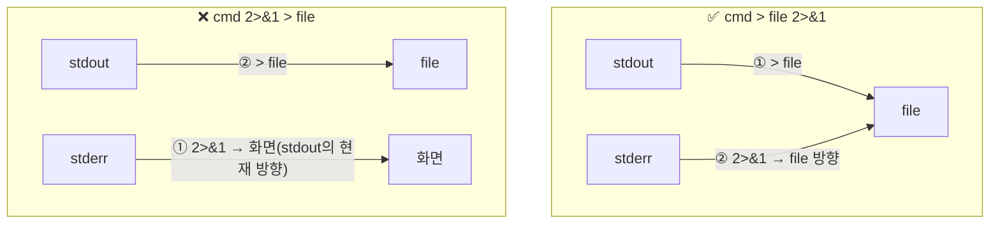
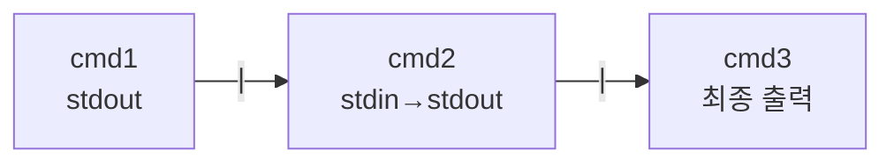
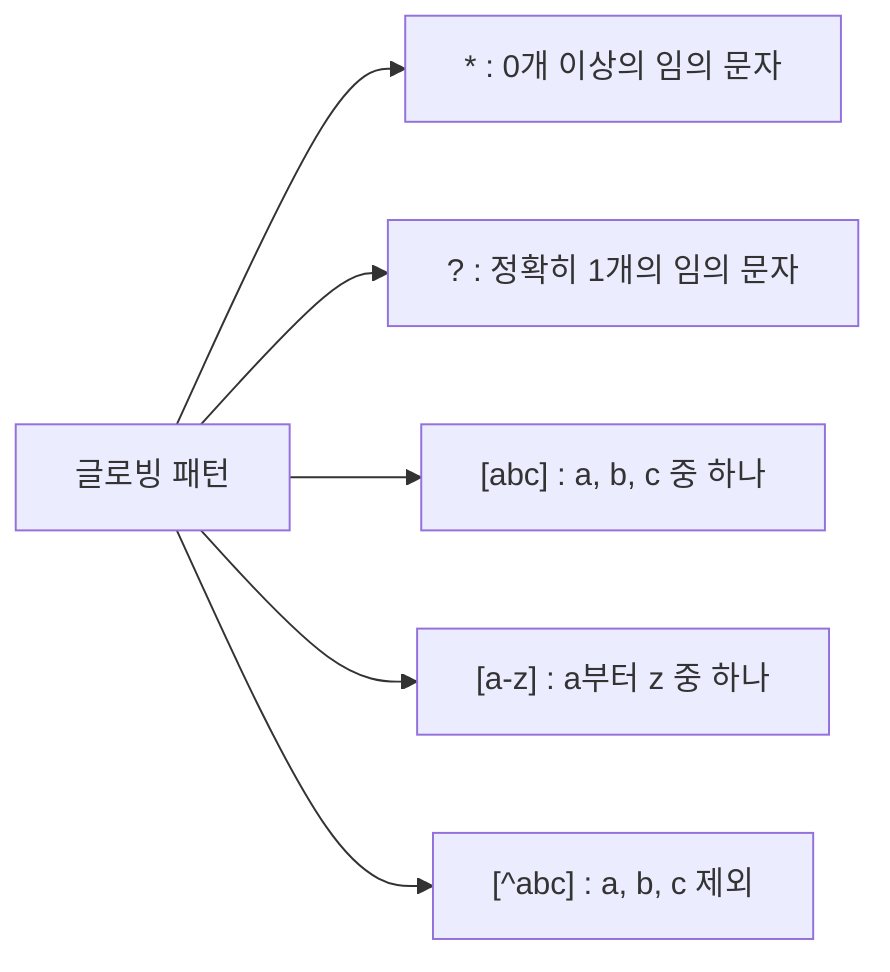

# Bash 스크립팅 심화 — 확장·셸 옵션·리다이렉션·파이프라인

> 이 파일은 6주차 두 번째 자료임. 6-1 을 먼저 학습한 후 진행할 것.
{: .prompt-info }

---

# 1장. Bash 확장 개요 (11장)

---

## 1.1 확장이란?

확장(expansion)은 **셸이 명령을 실행하기 전에 명령에 포함된 표현을 변환하는 과정**임.


Bash가 처리하는 확장의 종류:

| 확장 종류 | 표기 | 예시 |
|---|---|---|
| 중괄호 확장 | `{...}` | `{a,b,c}`, `{1..5}` |
| 틸데 확장 | `~` | `~` → `/home/user` |
| 명령어 치환 | `$(...)` | `$(date)` |
| 산술 확장 | `$((...))` | `$((3+4))` |
| 변수/매개변수 확장 | `${...}` | `${var:-default}` |

---

# 2장. 중괄호 확장과 틸데 확장

---

## 2.1 중괄호 확장 — 여러 문자열 생성

```bash
# 쉼표로 구분된 목록
echo {apple,banana,cherry}
```
```
apple banana cherry
```

```bash
# 파일 생성에 활용
touch report_{jan,feb,mar,apr}.txt
ls report_*.txt
```
```
report_apr.txt  report_feb.txt  report_jan.txt  report_mar.txt
```

```bash
# 숫자 범위
echo {1..5}
echo {A..E}
echo {01..05}   # 앞자리 0 채우기
```
```
1 2 3 4 5
A B C D E
01 02 03 04 05
```

```bash
# 디렉터리 일괄 생성 실용 예
mkdir -p ~/project/{src,docs,tests,build}
ls ~/project/
```
```
build  docs  src  tests
```

> 중괄호 확장은 **파일 생성, 백업 파일명 패턴, 디렉터리 구조 생성**에 자주 활용됨.
{: .prompt-tip }

---

## 2.2 틸데 확장

```bash
echo ~          # /home/user  (현재 사용자 홈)
echo ~root      # /root       (root 사용자 홈)
cd ~            # 홈 디렉터리로 이동
ls ~/Downloads  # 홈 디렉터리의 Downloads
```

---

# 3장. 명령어 치환

---

## 3.1 기본 사용법

명령어 치환(command substitution)은 **명령의 실행 결과를 변수나 다른 명령의 인자로 사용**하는 기능임.

```bash
# $() 형식 (권장)
today=$(date +%Y-%m-%d)
echo "오늘 날짜: $today"
```
```
오늘 날짜: 2026-03-11
```

```bash
# 실용 예제 1: 현재 사용자 수
user_count=$(cat /etc/passwd | wc -l)
echo "시스템 사용자 수: $user_count 명"
```
```
시스템 사용자 수: 22 명
```

```bash
# 실용 예제 2: 백업 파일명에 날짜 포함
backup_file="backup_$(date +%Y%m%d_%H%M%S).tar.gz"
echo "백업 파일: $backup_file"
```
```
백업 파일: backup_20260311_110000.tar.gz
```

---

## 3.2 명령어 치환 중첩

```bash
# 가장 많은 공간을 쓰는 디렉터리
largest=$(du -sh /var/* 2>/dev/null | sort -rh | head -1 | awk '{print $2}')
echo "가장 큰 디렉터리: $largest"
```

---

# 4장. 산술 확장

---

## 4.1 $(( )) 연산자 전체

```bash
a=10; b=3

echo "$a + $b = $((a + b))"        # 13
echo "$a - $b = $((a - b))"        # 7
echo "$a * $b = $((a * b))"        # 30
echo "$a / $b = $((a / b))"        # 3  (정수 나눗셈)
echo "$a % $b = $((a % b))"        # 1  (나머지)
echo "2 ** 10 = $((2 ** 10))"      # 1024
```

```bash
# 증감 연산자
x=5
echo $((x++))   # 5  (사용 후 증가)
echo "x=$x"     # 6

y=5
echo $((++y))   # 6  (증가 후 사용)
echo "y=$y"     # 6
```

```bash
# 비교 연산자 (참=1, 거짓=0)
echo $((5 > 3))    # 1
echo $((5 < 3))    # 0
echo $((5 == 5))   # 1
```

---

## 4.2 실용 예제: FizzBuzz

```bash
cat > ~/fizzbuzz.sh << 'EOF'
#!/bin/bash
for ((i=1; i<=20; i++)); do
    if (( i % 15 == 0 )); then
        echo "FizzBuzz"
    elif (( i % 3 == 0 )); then
        echo "Fizz"
    elif (( i % 5 == 0 )); then
        echo "Buzz"
    else
        echo $i
    fi
done
EOF
chmod +x ~/fizzbuzz.sh
~/fizzbuzz.sh
```

**실행 결과 (일부):**
```
1
2
Fizz
4
Buzz
Fizz
7
8
Fizz
Buzz
11
Fizz
13
14
FizzBuzz
```

---

# 5장. 변수 확장 심화

---

## 5.1 서브스트링 (문자열 잘라내기)

```bash
str="Hello, World!"

echo "${#str}"        # 13  (문자열 길이)
echo "${str:0:5}"     # Hello  (0번부터 5글자)
echo "${str:7}"       # World!  (7번부터 끝까지)
echo "${str:7:5}"     # World  (7번부터 5글자)
```

**실행 결과:**
```
13
Hello
World!
World
```

---

## 5.2 패턴 찾아 바꾸기

```bash
path="/home/user/docs/file.txt"

# 첫 번째 일치 치환: ${변수/패턴/교체}
echo "${path/user/admin}"          # /home/admin/docs/file.txt

# 모든 일치 치환: ${변수//패턴/교체}
echo "${path//\//|}"               # |home|user|docs|file.txt

# 확장자 변경
echo "${path/.txt/.bak}"           # /home/user/docs/file.bak
```

---

## 5.3 패턴 제거

실무에서 파일 경로 파싱에 자주 사용됨.

```bash
filepath="/home/user/docs/photo.jpg"

# ## : 앞에서부터 가장 길게 일치 제거 → basename 역할
echo "${filepath##*/}"         # photo.jpg

# %  : 뒤에서부터 가장 짧게 일치 제거 → 확장자 제거
echo "${filepath%.*}"          # /home/user/docs/photo

# 확장자만 추출
echo "${filepath##*.}"         # jpg
```

**실행 결과:**
```
photo.jpg
/home/user/docs/photo
jpg
```

> 이 세 가지 패턴은 **파일명 파싱의 핵심**임. 스크립트에서 파일 경로를 분해할 때 반드시 사용함.
{: .prompt-tip }

---

## 5.4 대소문자 변환

```bash
s="hello world"

echo "${s^^}"      # HELLO WORLD  (전체 대문자)
echo "${s^}"       # Hello world  (첫 글자만 대문자)

S="HELLO WORLD"
echo "${S,,}"      # hello world  (전체 소문자)
echo "${S,}"       # hELLO WORLD  (첫 글자만 소문자)
```

---

## 5.5 기본값 설정

```bash
# 변수가 비어있으면 기본값 사용 (변수 변경 안 함)
echo "${name:-'이름없음'}"

# 변수가 비어있으면 기본값 사용 + 변수에 저장
echo "${name:='기본이름'}"
echo "name은 이제: $name"

# 변수가 비어있으면 에러 발생
# echo "${required:?'반드시 설정해야 합니다'}"

# 변수가 있을 때만 특정 값 사용
name="홍길동"
echo "${name:+'이름이 있습니다'}"
```

**실행 결과:**
```
이름없음
기본이름
name은 이제: 기본이름
이름이 있습니다
```

---

## 5.6 실용 예제: 파일명 일괄 변환 스크립트

```bash
cat > ~/rename_ext.sh << 'EOF'
#!/bin/bash
# 현재 디렉터리의 .txt 파일을 .bak으로 이름 변경
src_ext="${1:-txt}"
dst_ext="${2:-bak}"

count=0
for f in *."$src_ext"; do
    [ -f "$f" ] || continue
    newname="${f%.*}.${dst_ext}"
    mv "$f" "$newname"
    echo "  $f → $newname"
    ((count++))
done
echo "총 ${count}개 파일 변환 완료 (.${src_ext} → .${dst_ext})"
EOF
chmod +x ~/rename_ext.sh

# 테스트
mkdir -p /tmp/rename_test && cd /tmp/rename_test
touch a.txt b.txt c.txt
~/rename_ext.sh txt bak
ls
cd ~
```

**실행 결과:**
```
  a.txt → a.bak
  b.txt → b.bak
  c.txt → c.bak
총 3개 파일 변환 완료 (.txt → .bak)
a.bak  b.bak  c.bak
```

---

# 6장. 셸 옵션 (11장)

---

## 6.1 셸 옵션이란?

셸 옵션은 **Bash의 동작 방식을 제어하는 스위치**임. 스크립트 상단에 설정해 오류를 방지하는 데 자주 사용됨.

```bash
set -옵션   # 옵션 켜기
set +옵션   # 옵션 끄기
```

---

## 6.2 주요 셸 옵션

### errexit (-e): 오류 발생 시 즉시 종료

```bash
cat > ~/set_e_demo.sh << 'EOF'
#!/bin/bash
set -e   # 이후 명령이 실패하면 스크립트 즉시 종료

echo "1단계: 시작"
ls /없는경로    # 실패! → 여기서 스크립트 종료
echo "2단계: 이 줄은 실행 안 됨"
EOF
chmod +x ~/set_e_demo.sh
~/set_e_demo.sh
echo "스크립트 종료 코드: $?"
```

**실행 결과:**
```
1단계: 시작
ls: cannot access '/없는경로': No such file or directory
스크립트 종료 코드: 2
```

---

### nounset (-u): 미정의 변수 사용 시 오류

```bash
cat > ~/set_u_demo.sh << 'EOF'
#!/bin/bash
set -u   # 정의되지 않은 변수 사용 시 오류

defined="정의됨"
echo "정의된 변수: $defined"
echo "미정의 변수: $undefined"   # 오류 발생
EOF
chmod +x ~/set_u_demo.sh
~/set_u_demo.sh
```

**실행 결과:**
```
정의된 변수: 정의됨
/root/set_u_demo.sh: line 6: undefined: unbound variable
```

---

### xtrace (-x): 실행 명령 추적 출력

```bash
cat > ~/set_x_demo.sh << 'EOF'
#!/bin/bash
set -x   # 이후 모든 명령을 stderr 에 출력

name="홍길동"
greeting="안녕, ${name}!"
echo $greeting
EOF
chmod +x ~/set_x_demo.sh
~/set_x_demo.sh
```

**실행 결과:**
```
+ name=홍길동
+ greeting='안녕, 홍길동!'
+ echo '안녕, 홍길동!'
안녕, 홍길동!
```

> `+ 명령` 형식으로 실행된 명령이 출력됨. **디버깅 시 매우 유용**함.
{: .prompt-tip }

---

### pipefail: 파이프라인 실패 감지

```bash
# pipefail 없이
false | true
echo "종료코드: $?"   # 0 (마지막 명령 true 의 코드)

# pipefail 켜고
set -o pipefail
false | true
echo "종료코드: $?"   # 1 (파이프 중 하나라도 실패하면 실패 코드)
set +o pipefail
```

**실행 결과:**
```
종료코드: 0
종료코드: 1
```

---

## 6.3 안전한 스크립트 상단 패턴

```bash
#!/bin/bash
set -euo pipefail
# -e : 오류 발생 시 즉시 종료
# -u : 미정의 변수 사용 시 오류
# -o pipefail : 파이프 실패 감지
```

> 실무 스크립트에서는 이 세 옵션을 상단에 같이 설정하는 것이 **Best Practice**임.
{: .prompt-tip }

---

# 7장. 리다이렉션 (12장)

---

## 7.1 표준 스트림 복습


| 스트림 | FD | 기본 연결 |
|---|---|---|
| stdin | 0 | 키보드 |
| stdout | 1 | 화면 |
| stderr | 2 | 화면 |

---

## 7.2 출력 리다이렉션

```bash
cd /tmp && mkdir -p redir_lab && cd redir_lab

# 덮어쓰기
echo "첫 번째 줄" > output.txt
cat output.txt
```
```
첫 번째 줄
```

```bash
# 추가 (append)
echo "두 번째 줄" >> output.txt
echo "세 번째 줄" >> output.txt
cat output.txt
```
```
첫 번째 줄
두 번째 줄
세 번째 줄
```

```bash
# stderr 분리 저장
ls /etc/passwd /없는파일 > stdout.txt 2> stderr.txt
echo "--- stdout.txt ---"
cat stdout.txt
echo "--- stderr.txt ---"
cat stderr.txt
```
```
--- stdout.txt ---
/etc/passwd
--- stderr.txt ---
ls: cannot access '/없는파일': No such file or directory
```

```bash
# stdout + stderr 같은 파일로
ls /etc/passwd /없는파일 > all.txt 2>&1
cat all.txt
```
```
ls: cannot access '/없는파일': No such file or directory
/etc/passwd
```

---

## 7.3 2>&1 순서가 왜 중요한가?



```bash
# ✅ 올바름: stdout 먼저 파일로 → stderr도 그 방향으로
ls /etc/passwd /없는파일 > correct.txt 2>&1
cat correct.txt   # stdout + stderr 모두 저장됨

# ❌ 잘못됨: stderr 먼저 복사(현재 stdout=화면) → stdout만 파일로
ls /etc/passwd /없는파일 2>&1 > wrong.txt
# stderr는 화면에, wrong.txt에는 stdout만 저장됨
```

> 리다이렉션은 **왼쪽에서 오른쪽으로 순서대로** 처리됨. 순서를 바꾸면 결과가 달라짐.
{: .prompt-danger }

---

## 7.4 입력 리다이렉션

```bash
# 파일을 stdin으로 전달
cat > names.txt << 'EOF'
홍길동
이순신
강감찬
EOF

# < : 파일 내용을 stdin으로
while read name; do
    echo "안녕하세요, ${name}님!"
done < names.txt
```
```
안녕하세요, 홍길동님!
안녕하세요, 이순신님!
안녕하세요, 강감찬님!
```

---

## 7.5 Here Document (heredoc)

heredoc은 **스크립트 내에 여러 줄의 입력 데이터를 직접 작성**하는 기능임.

```bash
# 기본 heredoc
cat << EOF
이 내용은 cat의 stdin으로 전달됩니다.
변수 확장: $HOME
오늘 날짜: $(date +%Y-%m-%d)
EOF
```
```
이 내용은 cat의 stdin으로 전달됩니다.
변수 확장: /root
오늘 날짜: 2026-03-11
```

```bash
# 'EOF' 싱글쿼트: 변수 확장 비활성화
cat << 'EOF'
변수 확장 없음: $HOME
명령 치환 없음: $(date)
EOF
```
```
변수 확장 없음: $HOME
명령 치환 없음: $(date)
```

```bash
# heredoc으로 파일 생성
cat > /tmp/config.txt << 'EOF'
[server]
host=localhost
port=8080
debug=true
EOF
cat /tmp/config.txt
```
```
[server]
host=localhost
port=8080
debug=true
```

---

## 7.6 Here String

```bash
# <<< : 한 줄짜리 문자열을 stdin으로
wc -w <<< "hello world foo bar"
```
```
4
```

```bash
# 변수를 stdin으로
data="apple banana cherry"
read -r first rest <<< "$data"
echo "첫 번째: $first"
echo "나머지: $rest"
```
```
첫 번째: apple
나머지: banana cherry
```

---

# 8장. 파이프라인 (12장)

---

## 8.1 파이프라인 기본



```bash
# 기본 파이프
cat /etc/passwd | grep "bash" | wc -l
```
```
2
```

---

## 8.2 파이프라인 실용 패턴

```bash
# 패턴 1: 로그에서 에러 줄 추출 후 카운트
cat /var/log/syslog 2>/dev/null | grep -i "error" | wc -l

# 패턴 2: 공정 실행파일 목록 (중복 제거, 정렬)
ps aux | awk '{print $11}' | sort -u | head -10

# 패턴 3: 포트 사용 현황
ss -tuln | grep LISTEN | awk '{print $5}' | sort

# 패턴 4: 디스크 사용률 90% 이상 파티션
df -h | awk 'NR>1 {gsub(/%/,""); if($5+0 >= 90) print $0}'

# 패턴 5: /etc/passwd 에서 일반 사용자 UID 목록
awk -F: '$3 >= 1000 {print $1, $3}' /etc/passwd | sort -k2 -n
```

---

## 8.3 pipefail과 종료 코드

```bash
# pipefail 없음 (기본)
false | true
echo "종료코드: $?"   # 0 (마지막 명령 기준)

# pipefail 켜기
set -o pipefail
false | true
echo "종료코드: $?"   # 1 (파이프 중 실패 있으면 실패)

set +o pipefail
```
```
종료코드: 0
종료코드: 1
```

---

## 8.4 tee — 화면과 파일 동시 출력

```bash
# 빌드 출력을 화면과 파일에 동시 저장
make 2>&1 | tee build.log

# -a 옵션: 파일에 추가
echo "log entry 1" | tee -a /tmp/mylog.txt
echo "log entry 2" | tee -a /tmp/mylog.txt
cat /tmp/mylog.txt
```
```
log entry 1
log entry 2
```

---

# 9장. 종합 스크립트 예제

---

## 9.1 사용자 정보 조회 스크립트

```bash
cat > ~/userinfo.sh << 'EOF'
#!/bin/bash
set -euo pipefail

TARGET="${1:-$USER}"

echo "=============================="
echo " 사용자 정보: $TARGET"
echo "=============================="

# /etc/passwd 에서 정보 추출
line=$(grep "^${TARGET}:" /etc/passwd) || {
    echo "오류: 사용자 '$TARGET' 를 찾을 수 없습니다."
    exit 1
}

uid=$(echo "$line" | cut -d: -f3)
gid=$(echo "$line" | cut -d: -f4)
home=$(echo "$line" | cut -d: -f6)
shell=$(echo "$line" | cut -d: -f7)

echo "UID   : $uid"
echo "GID   : $gid"
echo "HOME  : $home"
echo "SHELL : $shell"

# 홈 디렉터리 용량
if [ -d "$home" ]; then
    size=$(du -sh "$home" 2>/dev/null | cut -f1)
    echo "홈 용량: $size"
fi
echo "=============================="
EOF
chmod +x ~/userinfo.sh

~/userinfo.sh root
~/userinfo.sh nobody
```

**실행 결과:**
```
==============================
 사용자 정보: root
==============================
UID   : 0
GID   : 0
HOME  : /root
SHELL : /bin/bash
홈 용량: 48K
==============================
==============================
 사용자 정보: nobody
==============================
UID   : 65534
GID   : 65534
HOME  : /nonexistent
SHELL : /usr/sbin/nologin
==============================
```

---

## 9.2 디렉터리 백업 스크립트

```bash
cat > ~/backup.sh << 'EOF'
#!/bin/bash
set -euo pipefail

# 설정
SRC="${1:?'소스 디렉터리를 지정하세요'}"
DST="${2:-/tmp/backups}"
TIMESTAMP=$(date +%Y%m%d_%H%M%S)
BASENAME=$(basename "$SRC")
ARCHIVE="${DST}/${BASENAME}_${TIMESTAMP}.tar.gz"

# 소스 존재 확인
[ -d "$SRC" ] || { echo "오류: $SRC 가 존재하지 않습니다"; exit 1; }

# 백업 디렉터리 생성
mkdir -p "$DST"

# 백업 실행
echo "백업 시작: $SRC → $ARCHIVE"
tar -czf "$ARCHIVE" -C "$(dirname $SRC)" "$BASENAME" 2>/dev/null
SIZE=$(du -sh "$ARCHIVE" | cut -f1)
echo "백업 완료: $ARCHIVE (크기: $SIZE)"
EOF
chmod +x ~/backup.sh

~/backup.sh /etc/ssh
```

**실행 결과:**
```
백업 시작: /etc/ssh → /tmp/backups/ssh_20260311_110000.tar.gz
백업 완료: /tmp/backups/ssh_20260311_110000.tar.gz (크기: 8.0K)
```

---

# 10장. 심화 확장 기능 (11장 추가)

---

## 10.1 간접 확장 (Indirect Expansion)

간접 확장은 **변수의 이름을 담은 변수를 통해 값을 참조**하는 기능임. `${!변수명}` 형태로 사용.

```bash
# 변수 이름을 문자열로 저장
varname="greeting"
greeting="안녕하세요!"

# 직접 접근
echo "$greeting"          # 안녕하세요!

# 간접 접근
echo "${!varname}"        # 안녕하세요!
```

```bash
# 실용 예제: 설정 변수 동적 선택
DB_HOST="localhost"
DB_PORT="5432"
DB_NAME="mydb"

for key in HOST PORT NAME; do
    varname="DB_${key}"
    echo "DB_${key} = ${!varname}"
done
```

**실행 결과:**
```
DB_HOST = localhost
DB_PORT = 5432
DB_NAME = mydb
```

---

## 10.2 확장 연산자 전체 정리

### 패턴 제거 연산자

```bash
url="https://www.example.com/path/to/file.html"

# # : 앞에서부터 가장 짧게 일치 제거
echo "${url#*/}"          # /www.example.com/path/to/file.html

# ## : 앞에서부터 가장 길게 일치 제거
echo "${url##*/}"         # file.html  (basename 효과)

# % : 뒤에서부터 가장 짧게 일치 제거
echo "${url%/*}"          # https://www.example.com/path/to

# %% : 뒤에서부터 가장 길게 일치 제거
echo "${url%%/*}"         # https:
```

**실행 결과:**
```
/www.example.com/path/to/file.html
file.html
https://www.example.com/path/to
https:
```

### 확장 연산자 정리표

| 표현 | 의미 | 예시 |
|---|---|---|
| `${#var}` | 문자열 길이 | `${#name}` |
| `${var:n}` | n번부터 끝까지 | `${str:7}` |
| `${var:n:len}` | n번부터 len글자 | `${str:0:5}` |
| `${var/pat/rep}` | 첫 번째 패턴 치환 | `${path/txt/bak}` |
| `${var//pat/rep}` | 전체 패턴 치환 | `${str// /_}` |
| `${var/#pat/rep}` | 앞부분 패턴 치환 | `${str/#Hello/Hi}` |
| `${var/%pat/rep}` | 뒷부분 패턴 치환 | `${str/%World/Bash}` |
| `${var#pat}` | 앞 짧게 제거 | `${path#*/}` |
| `${var##pat}` | 앞 길게 제거 | `${path##*/}` |
| `${var%pat}` | 뒤 짧게 제거 | `${path%/*}` |
| `${var%%pat}` | 뒤 길게 제거 | `${url%%/*}` |
| `${var:-default}` | 빈 값이면 기본값 | `${name:-'없음'}` |
| `${var:=default}` | 빈 값이면 기본값 저장 | `${config:='default.cfg'}` |
| `${var:?msg}` | 빈 값이면 오류 | `${required:?'필수값'}` |
| `${var:+val}` | 값 있으면 val 사용 | `${debug:+'-v'}` |
| `${var^^}` | 전체 대문자 | `${name^^}` |
| `${var,,}` | 전체 소문자 | `${NAME,,}` |
| `${!var}` | 간접 확장 | `${!varname}` |

---

## 10.3 글로빙 (Globbing) — 파일명 패턴 매칭

글로빙(globbing)은 **파일명에서 와일드카드 패턴을 사용해 여러 파일을 한 번에 선택**하는 기능임. 정규표현식과 다르므로 구분할 것.



```bash
# 실습 환경 준비
mkdir -p /tmp/glob_lab
cd /tmp/glob_lab
touch file1.txt file2.txt file3.log report_jan.csv report_feb.csv a.sh b.sh

echo "--- *.txt (모든 .txt 파일) ---"
ls *.txt

echo "--- *.{txt,csv} (txt 또는 csv) ---"
ls *.{txt,csv}

echo "--- file?.txt (file + 1글자 + .txt) ---"
ls file?.txt

echo "--- [ab].sh (a 또는 b) ---"
ls [ab].sh

echo "--- report_*.csv ---"
ls report_*.csv

cd ~ && rm -rf /tmp/glob_lab
```

**실행 결과:**
```
--- *.txt (모든 .txt 파일) ---
file1.txt  file2.txt  file3.txt
--- *.{txt,csv} (txt 또는 csv) ---
file1.txt  file2.txt  file3.txt  report_feb.csv  report_jan.csv
--- file?.txt (file + 1글자 + .txt) ---
file1.txt  file2.txt  file3.txt
--- [ab].sh (a 또는 b) ---
a.sh  b.sh
--- report_*.csv ---
report_feb.csv  report_jan.csv
```

> **글로빙 vs 정규표현식**: `*`의 의미가 다름.  
> - 글로빙 `*`: "0개 이상의 임의 문자"  
> - 정규표현식 `*`: "앞 문자의 0번 이상 반복"
{: .prompt-warning }

---

## 10.4 shopt — 확장 글로빙 옵션

```bash
# extglob 활성화: 더 강력한 패턴 매칭
shopt -s extglob

files=(a.txt b.txt c.log d.log e.txt)
for f in "${files[@]}"; do
    echo "$f"
done | grep -v '.*\.log$'   # .log 제외
```

```bash
# nullglob: 패턴에 맞는 파일 없어도 에러 안 남
shopt -s nullglob
files=(/tmp/없는파일/*.txt)
echo "찾은 파일 수: ${#files[@]}"   # 0 (에러 없음)
shopt -u nullglob
```

---

## 10.5 프로세스 치환 (Process Substitution)

프로세스 치환은 **명령의 출력을 파일처럼 사용**하는 고급 기능임.

```bash
# <() : 명령 출력을 임시 파일처럼
diff <(cat /etc/passwd | cut -d: -f1 | sort) \
     <(cat /etc/group  | cut -d: -f1 | sort) | head -10
```

```bash
# while로 파일 읽을 때 파이프 대신 사용 (변수 범위 문제 해결)
total=0
while IFS=: read -r user _ uid _; do
    total=$((total + 1))
done < <(grep "bash" /etc/passwd)
echo "bash 사용자 수: $total"
```

---

## 10.6 종합 스크립트 예제 — 로그 분석기

```bash
cat > ~/log_analyzer.sh << 'EOF'
#!/bin/bash
set -euo pipefail

LOG="${1:-/var/log/syslog}"
LINES="${2:-100}"

[ -f "$LOG" ] || { echo "오류: $LOG 파일이 없습니다."; exit 1; }

echo "============================================"
echo " 로그 분석: ${LOG##*/}"
echo " 분석 라인: 최근 $LINES 줄"
echo "============================================"

# 최근 N줄 추출
recent=$(tail -n "$LINES" "$LOG" 2>/dev/null)

# 총 줄 수
total_lines=$(echo "$recent" | wc -l)
echo "총 줄 수: $total_lines"

# 오류 레벨별 카운트
declare -A level_count
for level in error warn info; do
    count=$(echo "$recent" | grep -ci "$level" 2>/dev/null || echo 0)
    level_count[$level]=$count
    printf "  %-7s: %d줄\n" "$level" "$count"
done

# 가장 많이 등장한 단어 TOP 5
echo ""
echo "빈출 키워드 TOP 5:"
echo "$recent" \
    | tr ' ' '\n' \
    | tr -d '[]():' \
    | grep -v '^[0-9]*$' \
    | grep -v '^$' \
    | sort | uniq -c | sort -rn \
    | head -5 \
    | while read cnt word; do
        printf "  %4d회: %s\n" "$cnt" "$word"
    done

echo "============================================"
EOF
chmod +x ~/log_analyzer.sh
~/log_analyzer.sh /var/log/syslog 50
```

**실행 결과 예시:**
```
============================================
 로그 분석: syslog
 분석 라인: 최근 50 줄
============================================
총 줄 수: 50
  error  : 0줄
  warn   : 2줄
  info   : 15줄

빈출 키워드 TOP 5:
   42회: Mar
   41회: 11
   38회: ubuntu
   32회: systemd
   28회: kernel
============================================
```
