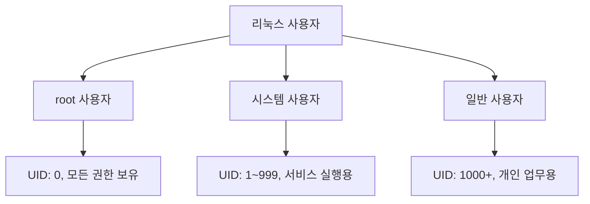
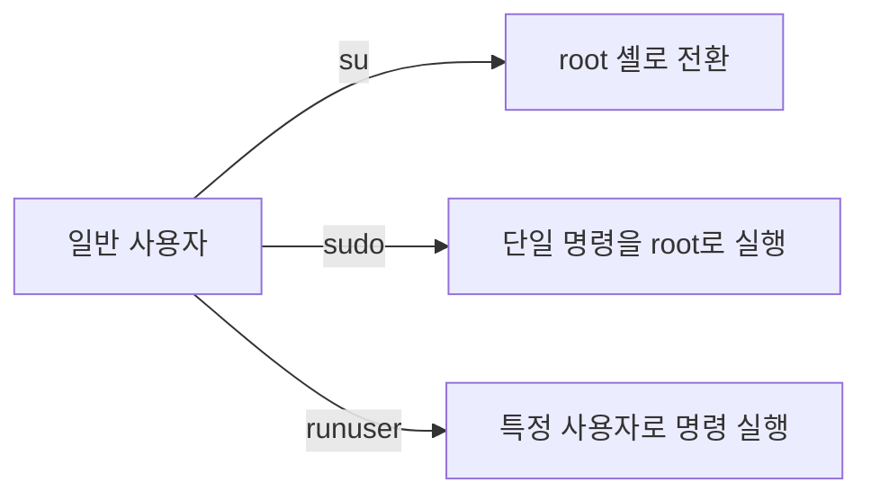
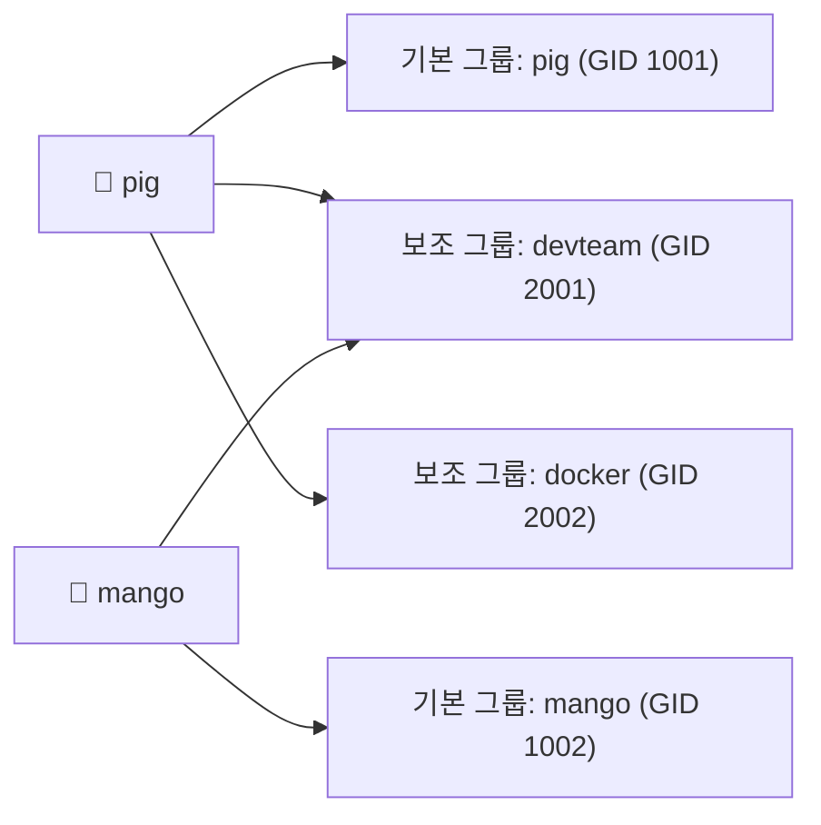
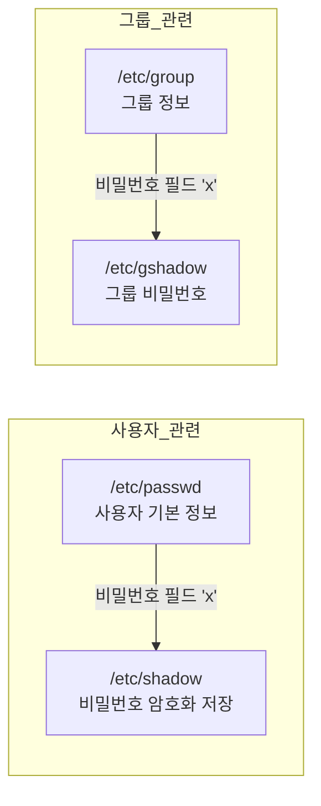

---

# 사용자 및 파일 권한 관리

# 1장. 사용자와 사용자 그룹

---

## 1.1 사용자 (User)

### 1.1.1 사용자의 종류

리눅스 시스템에는 목적과 권한 수준에 따라 크게 세 가지 사용자가 존재한다.



| 사용자 종류 | UID 범위 | 설명 |
|---|---|---|
| **root 사용자** | 0 | 리눅스 시스템의 모든 권한을 가진 관리자 계정 |
| **시스템 사용자** | 1 ~ 999 | 리눅스 시스템이 자체적으로 만든 서비스 실행용 계정 (예: `www-data`, `daemon`) |
| **일반 사용자** | 1000 이상 | root와 시스템 사용자를 제외한 사람이 사용하는 계정 |

> 리눅스에서 UID(User ID)는 사용자를 구별하는 고유 숫자 식별자다. 사람이 인식하는 사용자명(username)은 편의상 붙인 이름이고, 내부적으로는 UID로 모든 권한 검사를 수행한다.
{: .prompt-info }

---

### 1.1.2 root 사용자

root 사용자는 시스템의 모든 파일, 프로세스, 설정에 접근하고 수정할 수 있는 **절대 권한**의 관리자 계정이다.

보안상 이유로, 다음 두 가지 사항을 반드시 지켜야 한다.

1. **root 비밀번호는 복잡하게 설정하고, 주기적으로 변경한다.**
2. **외부(인터넷 등)에서 root로 직접 로그인하지 못하게 설정한다.** `/etc/ssh/sshd_config` 에서 `PermitRootLogin no` 로 설정한다.

> root 계정을 일상 작업에 사용하는 것은 매우 위험하다. 실수로 `rm -rf /` 같은 명령어를 실행하면 시스템 전체가 손상될 수 있다. 일반 계정으로 작업하다 필요할 때만 sudo로 권한을 올리는 방식이 권장된다.
{: .prompt-danger }

---

### 1.1.3 root 권한으로 명령을 실행하는 방법

root 권한이 필요한 경우, 세 가지 방법을 사용한다.



#### ① su (Switch User / Substitute User)

`su` 명령어는 현재 셸에서 다른 사용자의 셸로 **전환**하는 명령어다.

```bash
su              # root 사용자로 전환 (비밀번호 필요)
su -            # root 환경(환경변수 포함)으로 완전히 전환
su pig          # pig 사용자로 전환
su - pig        # pig 사용자의 로그인 환경으로 완전히 전환
```

`su` 와 `su -` 의 차이는 환경변수 로드 여부다.

| 명령 | 환경변수 | 작업 디렉터리 |
|---|---|---|
| `su` | 현재 사용자 환경 유지 | 현재 위치 유지 |
| `su -` | 대상 사용자 환경 새로 로드 | 대상 사용자 홈 디렉터리로 이동 |

```bash
su              # 전환 후 $HOME 이 여전히 /home/user 일 수 있음
su -            # 전환 후 $HOME 이 /root 로 변경됨 (완전한 root 환경)
```

> `su` 사용 시 root 비밀번호를 직접 입력해야 한다. 이는 root 비밀번호를 공유해야 하는 보안 문제가 있어, 실무에서는 `sudo` 를 더 많이 사용한다.
{: .prompt-warning }

#### ② sudo (SuperUser DO)

`sudo` 는 **단일 명령**을 root(또는 다른 사용자) 권한으로 실행하는 명령어다. `/etc/sudoers` 파일에 등록된 사용자만 사용할 수 있다.

```bash
sudo apt update                     # root 권한으로 apt update 실행
sudo nano /etc/hosts                # root 권한으로 /etc/hosts 편집
sudo -i                             # root 로그인 셸로 전환 (su - 와 유사)
sudo -u pig cat /home/pig/file.txt  # pig 사용자 권한으로 명령 실행
```

`sudo` 의 장점:

- root 비밀번호를 공유하지 않아도 됨 (자신의 비밀번호 입력)
- 명령 실행 기록이 `/var/log/auth.log` 에 남아 감사(audit) 가능
- 사용자별로 특정 명령만 허용하는 세밀한 권한 설정 가능

#### ③ runuser

`runuser` 는 **PAM(인증 없이)** 다른 사용자 권한으로 명령을 실행하는 명령어다. root 사용자만 사용 가능하다.

| 옵션 | 설명 |
|---|---|
| `-u 사용자` | 지정한 사용자로 명령 실행 |
| `-g 그룹` | 지정한 그룹으로 명령 실행 |
| `-l` | 해당 사용자의 로그인 환경 적용 |

```bash
sudo runuser -u pig -- id              # pig 사용자 권한으로 id 명령 실행
sudo runuser -l pig -c "whoami"        # pig 의 로그인 환경으로 whoami 실행
```

> `runuser` 는 스크립트에서 특정 사용자 권한으로 자동화 작업을 수행할 때 주로 사용된다. 비밀번호 입력 없이 동작하므로, 자동화 스크립트에서 `su` 나 `sudo` 의 대안으로 활용된다.
{: .prompt-tip }

---

### 1.1.4 사용자 정보를 관리하는 /etc/passwd 파일

리눅스의 모든 사용자 정보는 `/etc/passwd` 파일에 저장된다.

```bash
cat /etc/passwd
```

파일의 각 줄은 콜론(`:`)으로 구분된 **7개 필드**로 구성된다.

```
사용자이름 : 비밀번호 : UID : GID : 추가설명 : 홈디렉터리 : 로그인셸
```

**실제 예시:**

```
root:x:0:0:root:/root:/bin/bash
daemon:x:1:1:daemon:/usr/sbin:/usr/sbin/nologin
pig:x:1001:1001:,,,:/home/pig:/bin/bash
```

| 필드 번호 | 필드명 | 설명 |
|---|---|---|
| ① | 사용자 이름 | 영문자, 숫자, `_`, `.` 으로 구성. 최대 32자 |
| ② | 비밀번호 | `x` 로 표시 (실제 비밀번호는 `/etc/shadow` 에 암호화 저장) |
| ③ | UID | 사용자 ID. 0 이상의 정수. root=0 |
| ④ | GID | 기본 그룹 ID. `/etc/group` 파일과 연계 |
| ⑤ | 추가 설명 | 사용자에 대한 설명 (GECOS 필드) |
| ⑥ | 홈 디렉터리 | 로그인 후 이동할 기본 디렉터리 |
| ⑦ | 로그인 셸 | 사용자가 로그인했을 때 실행되는 셸의 절대 경로 |

> 비밀번호 필드의 `x` 는 실제 비밀번호가 `/etc/shadow` 에 있다는 의미다. `/etc/shadow` 파일은 root만 읽을 수 있어 보안이 강화된다. 과거에는 `/etc/passwd` 에 직접 암호화된 비밀번호를 저장했으나, 이 파일은 모든 사용자가 읽을 수 있어 보안 취약점이 있었다.
{: .prompt-info }

**실습: /etc/passwd 내용 확인**

```bash
cat /etc/passwd                    # 전체 내용 조회
grep "pig" /etc/passwd             # pig 사용자 정보만 조회
awk -F: '{print $1, $3, $6}' /etc/passwd  # 사용자명, UID, 홈디렉터리만 출력
```

---

## 1.2 사용자 그룹 (Group)

### 1.2.1 사용자 그룹이란

**사용자 그룹(User Group)** 은 여러 사용자를 하나의 집합으로 묶어 파일 권한 등을 일괄적으로 관리하는 개념이다.

각 사용자는 반드시 하나의 **기본 그룹(Primary Group)** 에 속하고, 추가로 여러 **보조 그룹(Secondary Group)** 에도 속할 수 있다.



---

### 1.2.2 사용자 그룹 정보를 관리하는 /etc/group 파일

모든 그룹 정보는 `/etc/group` 파일에 저장된다.

```bash
cat /etc/group
```

파일의 각 줄은 콜론(`:`)으로 구분된 **4개 필드**로 구성된다.

```
그룹이름 : 비밀번호 : GID : 사용자목록
```

**실제 예시:**

```
root:x:0:
sudo:x:27:pig,mango
pig:x:1001:
devteam:x:2001:pig,mango,dog
```

| 필드 번호 | 필드명 | 설명 |
|---|---|---|
| ① | 그룹 이름 | 최대 32자. 영문, 숫자, `-`, `_` 로 구성 |
| ② | 비밀번호 | `x` 로 표시. 거의 사용하지 않음 |
| ③ | GID | 그룹 ID. 0 이상의 정수 |
| ④ | 사용자 목록 | 이 그룹의 보조 그룹 구성원. 쉼표(`,`)로 구분 |

> 사용자 목록 필드에 나타나지 않더라도, `/etc/passwd` 에서 GID가 동일한 사용자는 해당 그룹의 기본 그룹 구성원이다. 두 파일을 함께 봐야 그룹 멤버십을 완전히 파악할 수 있다.
{: .prompt-info }

**실습: /etc/group 내용 확인**

```bash
cat /etc/group                          # 전체 그룹 정보 조회
groups                                  # 현재 사용자가 속한 그룹 목록
groups pig                              # pig 사용자의 그룹 목록
id                                      # 현재 사용자의 UID, GID, 그룹 정보
id pig                                  # pig 사용자의 UID, GID, 그룹 정보
```

---

## 1.3 실습: 사용자와 사용자 그룹 다루기

### 1.3.1 사용자 추가 및 삭제

#### adduser — 사용자 추가

`adduser` 명령어는 새 사용자를 시스템에 추가하는 명령어다.  
내부적으로 `useradd` 를 감싸는 고수준 명령어로, 홈 디렉터리 생성, 기본 파일 복사 등을 자동으로 처리한다.

**기본 형식:**

```
adduser [옵션] 사용자이름
```

**주요 옵션:**

| 옵션 | 설명 |
|---|---|
| `--home 경로` | 홈 디렉터리 위치를 지정 |
| `--shell 셸경로` | 로그인 셸을 지정 (예: `/bin/bash`) |
| `--ingroup 그룹명` | 기본 그룹 지정 |
| `--disabled-login` | 로그인 불가 계정 생성 (시스템 사용자 등) |

**사용 예시:**

```bash
sudo adduser pig          # pig 사용자 추가 (대화형으로 비밀번호 등 입력)
sudo adduser mango        # mango 사용자 추가
sudo adduser dog          # dog 사용자 추가
```

> `adduser` 는 Ubuntu/Debian 계열에서 권장하는 방식이다. `useradd` 는 더 저수준의 명령어로, 홈 디렉터리를 자동 생성하지 않는 등 세부 설정을 직접 해야 한다. 실습 환경(Ubuntu)에서는 `adduser` 를 사용하는 것이 편리하다.
{: .prompt-tip }

#### deluser — 사용자 삭제

`deluser` 명령어는 기존 사용자를 삭제한다.

**주요 옵션:**

| 옵션 | 설명 |
|---|---|
| `--remove-home` | 홈 디렉터리도 함께 삭제 |
| `--remove-all-files` | 해당 사용자의 모든 파일 삭제 |
| `--backup` | 삭제 전 파일 백업 |

**사용 예시:**

```bash
sudo deluser dog                    # dog 사용자 삭제 (홈 디렉터리는 유지)
sudo deluser --remove-home dog      # dog 사용자와 홈 디렉터리 함께 삭제
```

---

### 1.3.2 사용자 그룹 추가 및 삭제

#### addgroup — 그룹 추가

```bash
sudo addgroup devteam               # devteam 그룹 생성
sudo addgroup --gid 2001 devteam    # GID를 지정하여 그룹 생성
sudo adduser pig devteam            # pig 사용자를 devteam 그룹에 추가
```

#### delgroup — 그룹 삭제

```bash
sudo delgroup devteam               # devteam 그룹 삭제
```

> 그룹을 삭제하기 전에 해당 그룹을 기본 그룹으로 사용하는 사용자가 없는지 확인해야 한다. 기본 그룹이 삭제된 사용자는 로그인에 문제가 생길 수 있다.
{: .prompt-warning }

---

### 1.3.3 실습용 사용자와 사용자 그룹 생성

PDF 교안의 실습에서 사용하는 세 사용자(`pig`, `mango`, `dog`)와 그룹을 생성한다.

```bash
# 1. 사용자 3명 추가
sudo adduser pig
sudo adduser mango
sudo adduser dog

# 2. 생성 확인
cat /etc/passwd | grep -E "pig|mango|dog"

# 3. 홈 디렉터리 확인
ls /home

# 4. 그룹 생성
sudo addgroup animals

# 5. 그룹에 사용자 추가
sudo adduser pig animals
sudo adduser mango animals
sudo adduser dog animals

# 6. 그룹 확인
cat /etc/group | grep animals
```

---

### 1.3.4 셸 사용자 전환하기

`su` 명령어로 사용자를 전환하는 실습이다.

```bash
# 1. pig 사용자로 전환
su pig          # pig 비밀번호 입력

# 2. 현재 사용자 확인
whoami          # pig 출력

# 3. pig 사용자 셸 종료
exit            # 원래 사용자 셸로 복귀

# 4. root 로 전환 후 다른 사용자로 전환 (비밀번호 불필요)
sudo su -       # root 로 전환
su pig          # root 에서 pig 로 전환 시 비밀번호 불필요
```

---

### 1.3.5 사용자 비밀번호 변경하기

`passwd` 명령어로 비밀번호를 변경한다.

**형식:**

```
passwd [옵션] [사용자이름]
```

**주요 옵션:**

| 옵션 | 설명 |
|---|---|
| `-l` | 사용자 계정 잠금 (Lock) |
| `-u` | 사용자 계정 잠금 해제 (Unlock) |
| `-d` | 비밀번호 삭제 (비밀번호 없이 로그인) |
| `-e` | 다음 로그인 시 비밀번호 변경 강제 |
| `-S` | 비밀번호 상태 조회 |

**사용 예시:**

```bash
passwd              # 현재 사용자의 비밀번호 변경
sudo passwd pig     # root 권한으로 pig 비밀번호 변경 (비밀번호 확인 없이)
sudo passwd -l pig  # pig 계정 잠금
sudo passwd -u pig  # pig 계정 잠금 해제
sudo passwd -S pig  # pig 비밀번호 상태 조회
```

**일반 사용자 비밀번호 변경 실습:**

```bash
# 1. pig 사용자로 전환
su pig

# 2. pig 비밀번호 변경 (현재 비밀번호 → 새 비밀번호)
passwd

# 3. exit 로 pig 셸 종료
exit

# 4. 새 비밀번호로 pig 로그인 확인
su pig
```

**root로 다른 사용자 비밀번호 변경:**

```bash
# root 는 대상 사용자의 현재 비밀번호 없이 변경 가능
sudo passwd mango   # mango 비밀번호 변경
```

---

## 1.4 사용자/그룹 관련 주요 파일 정리



| 파일 | 권한 | 내용 |
|---|---|---|
| `/etc/passwd` | `644` (누구나 읽기 가능) | 사용자 이름, UID, GID, 홈디렉터리, 셸 |
| `/etc/shadow` | `640` (root, shadow 그룹만) | 암호화된 비밀번호, 만료 정보 |
| `/etc/group` | `644` (누구나 읽기 가능) | 그룹 이름, GID, 구성원 |
| `/etc/gshadow` | `640` (root, shadow 그룹만) | 그룹 비밀번호 |

```bash
# 파일 권한 직접 확인
ls -la /etc/passwd /etc/shadow /etc/group /etc/gshadow
```

---

## 1.5 핵심 명령어 요약

| 명령어 | 기능 | 주요 옵션 | 예시 |
|---|---|---|---|
| `su` | 사용자 전환 | `-` | `su - pig` |
| `sudo` | root 권한 명령 실행 | `-i`, `-u` | `sudo apt update` |
| `adduser` | 사용자 추가 | `--home`, `--shell` | `sudo adduser pig` |
| `deluser` | 사용자 삭제 | `--remove-home` | `sudo deluser pig` |
| `addgroup` | 그룹 추가 | `--gid` | `sudo addgroup animals` |
| `delgroup` | 그룹 삭제 | — | `sudo delgroup animals` |
| `passwd` | 비밀번호 변경 | `-l`, `-u`, `-S` | `sudo passwd pig` |
| `id` | UID/GID/그룹 정보 조회 | — | `id pig` |
| `groups` | 소속 그룹 조회 | — | `groups pig` |
| `whoami` | 현재 사용자명 출력 | — | `whoami` |

---
