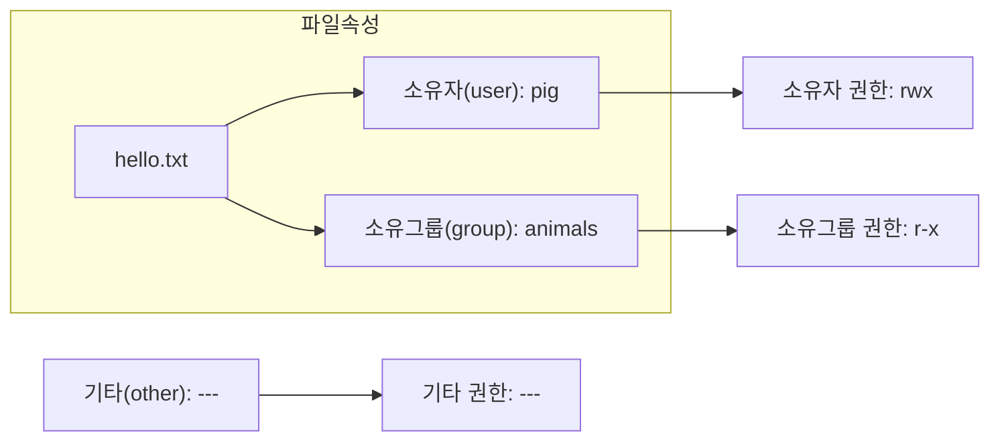
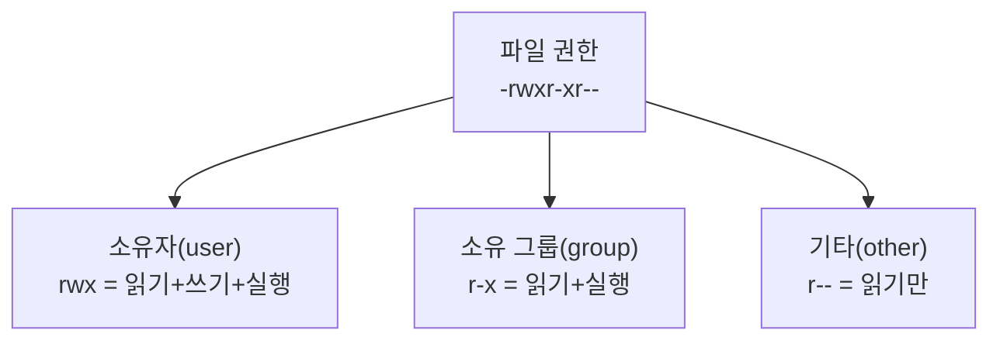
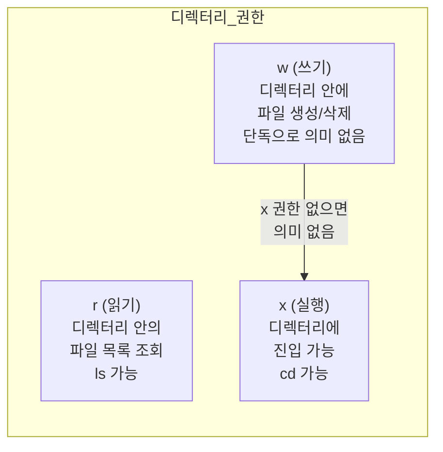
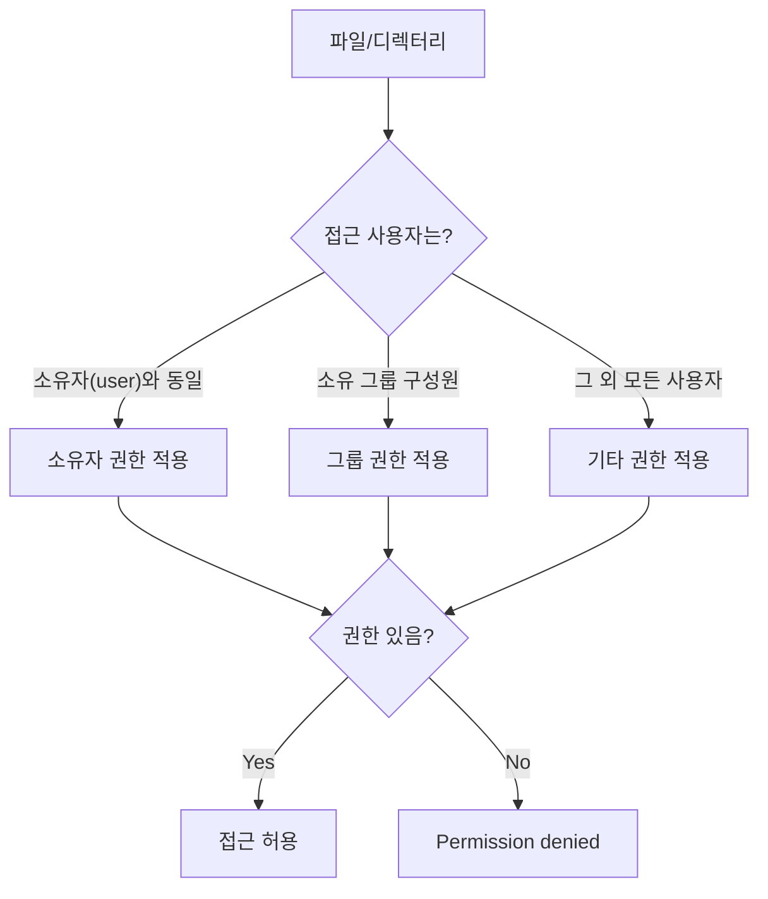

---

# 사용자 및 파일 권한 관리

# 2장. 소유권과 파일 권한

---

## 2.1 파일 소유권 (Ownership)

### 2.1.1 파일 소유권이란

**소유권(Ownership)** 은 파일이 어느 사용자, 어느 그룹의 소유인지를 나타내는 속성이다.



`ls -l` 명령어로 파일의 소유자와 소유 그룹을 확인할 수 있다.

```bash
ls -l hello.txt
# -rw-r--r-- 1 pig animals 512 Mar 7 09:00 hello.txt
#              ^   ^
#              |   소유 그룹 (animals)
#              소유자 (pig)
```

---

### 2.1.2 실습: 파일 소유권 변경하기 — chown

`chown` 명령어는 파일의 **소유자**와 **소유 그룹**을 변경하는 명령어다.

**형식:**

```
chown [옵션] 소유자[:그룹] 파일명
chown [옵션] :그룹 파일명          # 그룹만 변경
```

**주요 옵션:**

| 옵션 | 설명 |
|---|---|
| `-R` | 디렉터리와 하위 모든 파일에 재귀적으로 적용 |
| `-v` | 변경 내용을 화면에 출력 |
| `--reference=파일` | 지정한 파일과 동일한 소유권 설정 |

**사용 예시:**

```bash
sudo chown pig hello.txt            # 소유자를 pig 로 변경
sudo chown pig:animals hello.txt    # 소유자를 pig, 그룹을 animals 로 변경
sudo chown :animals hello.txt       # 그룹만 animals 로 변경
sudo chown -R pig:animals mydir/    # 디렉터리 전체 소유권 변경
```

> `chown` 은 root 또는 현재 파일 소유자만 실행할 수 있다. 일반 사용자가 다른 사용자에게 소유권을 넘기려면 sudo 가 필요하다.
{: .prompt-warning }

**실습 순서:**

```bash
# 1. 테스트 파일 생성 및 현재 소유권 확인
touch test_file.txt
ls -l test_file.txt

# 2. 소유자 변경 (pig 사용자로)
sudo chown pig test_file.txt
ls -l test_file.txt

# 3. 소유자와 그룹 동시 변경
sudo chown pig:animals test_file.txt
ls -l test_file.txt

# 4. 그룹만 변경
sudo chown :mango test_file.txt
ls -l test_file.txt
```

---

## 2.2 파일 권한 (Permission)

### 2.2.1 파일 권한의 종류

**파일 권한(Permission)** 은 해당 파일에 어떤 행위를 할 수 있는지를 정의한 것이다.

리눅스는 파일 권한을 **세 가지 사용자 범주**에 대해 각각 설정한다.



**권한의 종류:**

| 기호 | 영문 | 파일에 대한 의미 | 디렉터리에 대한 의미 |
|---|---|---|---|
| `r` | read | 파일 내용 읽기 | 디렉터리 안의 파일 목록 조회 (`ls`) |
| `w` | write | 파일 내용 수정/삭제 | 디렉터리 안에 파일 생성/삭제 |
| `x` | execute | 파일 실행 (프로그램, 스크립트) | 디렉터리 안으로 진입 (`cd`) |
| `-` | none | 해당 권한 없음 | 해당 권한 없음 |

**ls -l 출력 읽는 법:**

```
-  r w x  r - x  r - -
^  ^^^^^  ^^^^^  ^^^^^
|  소유자  소유그룹  기타
파일종류
```

예: `-rwxr-xr--`
- 파일 종류: `-` (일반 파일)
- 소유자: `rwx` (읽기, 쓰기, 실행 모두 가능)
- 소유 그룹: `r-x` (읽기, 실행만 가능)
- 기타: `r--` (읽기만 가능)

---

### 2.2.2 실습: 파일 권한 변경하기 — chmod

`chmod` 명령어는 파일 또는 디렉터리의 **권한**을 변경하는 명령어다.

**형식:**

```
chmod [옵션] 권한 파일명
```

**주요 옵션:**

| 옵션 | 설명 |
|---|---|
| `-R` | 디렉터리와 하위 모든 파일에 재귀적으로 적용 |
| `-v` | 변경 내용을 화면에 출력 |

`chmod` 에는 두 가지 표기법이 있다.

---

#### ① 8진수 표기법 (Octal Notation)

소유자, 소유 그룹, 기타 사용자의 권한을 **8진수 3자리**로 표현하는 방법이다.

**변환 원리:**

각 권한을 2진수 비트로 표현하고, 8진수로 변환한다.

| 권한 조합 | 2진수 | 8진수 |
|---|---|---|
| `---` (권한 없음) | 000 | 0 |
| `--x` (실행만) | 001 | 1 |
| `-w-` (쓰기만) | 010 | 2 |
| `-wx` (쓰기+실행) | 011 | 3 |
| `r--` (읽기만) | 100 | 4 |
| `r-x` (읽기+실행) | 101 | 5 |
| `rw-` (읽기+쓰기) | 110 | 6 |
| `rwx` (모두) | 111 | 7 |

**8진수 표기법 예시:**

| 8진수 | 소유자 | 그룹 | 기타 | 의미 |
|---|---|---|---|---|
| `755` | `rwx` | `r-x` | `r-x` | 실행 파일의 일반적인 권한 |
| `644` | `rw-` | `r--` | `r--` | 텍스트 파일의 일반적인 권한 |
| `600` | `rw-` | `---` | `---` | 소유자만 읽고 쓸 수 있는 개인 파일 |
| `777` | `rwx` | `rwx` | `rwx` | 모든 사용자가 모든 권한 보유 |
| `000` | `---` | `---` | `---` | 아무도 접근 불가 |

```bash
chmod 755 hello.sh          # rwxr-xr-x
chmod 644 config.txt        # rw-r--r--
chmod 600 private.key       # rw-------
chmod 777 shared.txt        # rwxrwxrwx (권장하지 않음)
```

---

#### ② 의미 표기법 (Symbolic Notation)

현재 파일에 설정된 권한을 기준으로 **더하기(+), 빼기(-), 설정(=)** 하는 방식이다.

**형식:**

```
chmod [대상][연산자][권한] 파일명
```

| 구분 | 기호 | 의미 |
|---|---|---|
| 대상 | `u` | 소유자(user) |
| 대상 | `g` | 소유 그룹(group) |
| 대상 | `o` | 기타(other) |
| 대상 | `a` | 모두(all) = u+g+o |
| 연산자 | `+` | 권한 추가 |
| 연산자 | `-` | 권한 제거 |
| 연산자 | `=` | 권한 설정 (기존 권한 무시하고 지정) |

**의미 표기법 예시:**

```bash
chmod u+x hello.sh          # 소유자에게 실행 권한 추가
chmod g-w config.txt        # 소유 그룹의 쓰기 권한 제거
chmod o-r private.txt       # 기타 사용자의 읽기 권한 제거
chmod a+x run.sh            # 모든 사용자에게 실행 권한 추가
chmod u=rwx,g=rx,o=r file   # 각 대상 권한 정확히 설정
chmod +x script.sh          # 대상 생략 시 모두에게 적용 (= a+x)
```

---

### 2.2.3 실습: 파일 권한 설정하기

PDF 교안의 실습을 단계별로 따라한다. playground 디렉터리를 생성하고, dog/mango/pig 사용자 간의 권한을 실험한다.

#### 실습 환경 설정

```bash
# 1. playground 디렉터리 생성 (현재 사용자로 실행)
mkdir ~/playground

# 2. 디렉터리 권한을 777로 변경 (모든 사용자가 파일 생성 가능하게)
chmod 777 ~/playground

# 3. 권한 확인
ls -ld ~/playground
# drwxrwxrwx  ...  playground
```

> 실습 편의를 위해 `/tmp/shared` 디렉터리를 공용 작업 공간으로 사용한다. `/tmp` 는 모든 사용자가 접근할 수 있는 임시 디렉터리다.
{: .prompt-tip }

```bash
# 실습 공유 디렉터리 생성
sudo mkdir -p /tmp/shared
sudo chmod 777 /tmp/shared
```

#### 읽기 권한 실습

```bash
# [dog 사용자 셸에서] 파일 생성
su dog
echo "안녕하세요, dog입니다." > /tmp/shared/msg_from_dog
ls -l /tmp/shared/msg_from_dog
# -rw-rw-r-- 1 dog dog ... msg_from_dog
exit

# [mango 사용자 셸에서] 읽기 권한이 있는 상태에서 파일 조회
su mango
cat /tmp/shared/msg_from_dog    # 성공 (other 에 r 권한 있음)
exit

# [dog 사용자 셸에서] 읽기 권한 제거
su dog
chmod o-r /tmp/shared/msg_from_dog
ls -l /tmp/shared/msg_from_dog
# -rw-rw---- 1 dog dog ... (other 권한 --- 로 변경)
exit

# [mango 사용자 셸에서] 읽기 권한 없는 상태에서 파일 조회 시도
su mango
cat /tmp/shared/msg_from_dog    # 실패 (Permission denied)
exit
```

#### 쓰기 권한 실습

```bash
# [pig 사용자 셸에서] 쓰기 시도 (권한 없음)
su pig
echo "pig가 내용 추가" >> /tmp/shared/msg_from_dog  # 실패
exit

# [dog 사용자 셸에서] 쓰기 권한 추가
su dog
chmod o+w /tmp/shared/msg_from_dog
exit

# [pig 사용자 셸에서] 다시 쓰기 시도 (성공)
su pig
echo "pig가 내용 추가" >> /tmp/shared/msg_from_dog  # 성공
cat /tmp/shared/msg_from_dog
exit
```

#### 실행 권한 실습

```bash
# [dog 사용자 셸에서] 셸 스크립트 작성
su dog
cat > /tmp/shared/exec_test << 'EOF'
#!/bin/bash
echo "스크립트 실행 성공!"
echo "실행한 사용자: $(whoami)"
date
EOF

# 권한 확인 (실행 권한 없음)
ls -l /tmp/shared/exec_test

# 실행 시도 (실패)
/tmp/shared/exec_test           # Permission denied

# 모든 사용자에게 실행 권한 부여
chmod +x /tmp/shared/exec_test
ls -l /tmp/shared/exec_test     # -rwxrwxrwx

# 실행 (성공)
/tmp/shared/exec_test
exit
```

---

## 2.3 디렉터리 권한

### 2.3.1 디렉터리 권한이란

디렉터리에 대한 권한은 파일과 **의미가 다르다**.



| 권한 | 가능한 동작 |
|---|---|
| `r` (읽기) | `ls` 로 파일 목록 조회 가능 |
| `x` (실행) | `cd` 로 디렉터리 진입 가능. 파일 접근 가능 |
| `w` (쓰기) + `x` | 파일 생성, 삭제 가능 |
| `r` 없이 `x`만 | 목록은 볼 수 없지만 파일명을 알면 접근 가능 |
| `w` 없이 `r`만 | 목록은 볼 수 있지만 파일 생성/삭제 불가 |

**디렉터리 주요 권한 조합:**

| 권한 | 8진수 | 설명 |
|---|---|---|
| `rwx` | 7 | 목록 조회, 진입, 파일 생성/삭제 모두 가능 |
| `r-x` | 5 | 목록 조회, 진입 가능. 파일 생성/삭제 불가 |
| `r--` | 4 | 목록만 조회 가능. 진입 불가 |
| `--x` | 1 | 목록은 못 봄. 파일명 알면 진입 가능 |
| `---` | 0 | 완전히 차단 |

> 쓰기(`w`) 권한만 있고 실행(`x`) 권한이 없으면 쓰기 권한이 의미가 없다. 디렉터리에서 파일을 생성하거나 삭제하려면 반드시 `x` 권한도 함께 있어야 한다.
{: .prompt-info }

**실습: 디렉터리 권한 차이 확인**

```bash
mkdir /tmp/dirtest
echo "파일 내용" > /tmp/dirtest/secret.txt
sudo chmod 777 /tmp/dirtest

# [테스트 1] r-x (목록 조회 가능, 파일 생성 불가)
chmod 555 /tmp/dirtest
su mango
ls /tmp/dirtest              # 성공 (r 권한)
cd /tmp/dirtest              # 성공 (x 권한)
touch /tmp/dirtest/new.txt   # 실패 (w 권한 없음)
exit

# [테스트 2] --x (목록 조회 불가, 파일명 알면 접근 가능)
chmod 111 /tmp/dirtest
su mango
ls /tmp/dirtest              # 실패 (r 권한 없음)
cat /tmp/dirtest/secret.txt  # 성공 (파일명 알고, x 권한 있음)
exit

# [테스트 3] r-- (목록은 보이지만 진입 불가)
chmod 444 /tmp/dirtest
su mango
ls /tmp/dirtest              # 성공 (r 권한)
cd /tmp/dirtest              # 실패 (x 권한 없음)
cat /tmp/dirtest/secret.txt  # 실패 (x 권한 없음)
exit

# 복원
chmod 755 /tmp/dirtest
```

---

## 2.4 권한 체계 전체 정리



> 권한 체크는 소유자 → 그룹 → 기타 순서로 확인하며, **먼저 매칭된 범주의 권한만 적용**된다. 즉, 소유자이면서 그룹 구성원이어도 그룹 권한은 적용되지 않는다.
{: .prompt-info }

---

## 2.5 핵심 명령어 요약

| 명령어 | 기능 | 주요 옵션 | 예시 |
|---|---|---|---|
| `ls -l` | 파일 권한 및 소유권 확인 | `-a`, `-h` | `ls -la` |
| `chown` | 소유자/그룹 변경 | `-R`, `-v` | `sudo chown pig:animals file` |
| `chmod` | 파일 권한 변경 | `-R`, `-v` | `chmod 755 file`, `chmod u+x file` |
| `id` | 현재 사용자 UID/GID 확인 | — | `id` |
| `stat` | 파일 상세 메타데이터 조회 | — | `stat file.txt` |

**자주 사용하는 권한 조합:**

| 권한값 | 사용 상황 |
|---|---|
| `755` | 실행 파일, 디렉터리 (소유자 전체, 나머지 읽기+실행) |
| `644` | 일반 텍스트/설정 파일 (소유자 읽기+쓰기, 나머지 읽기만) |
| `600` | 개인 키, 비밀 파일 (소유자만 읽기+쓰기) |
| `700` | 개인 스크립트 (소유자만 전체 권한) |
| `777` | 임시 공유 (보안상 권장하지 않음) |

---
