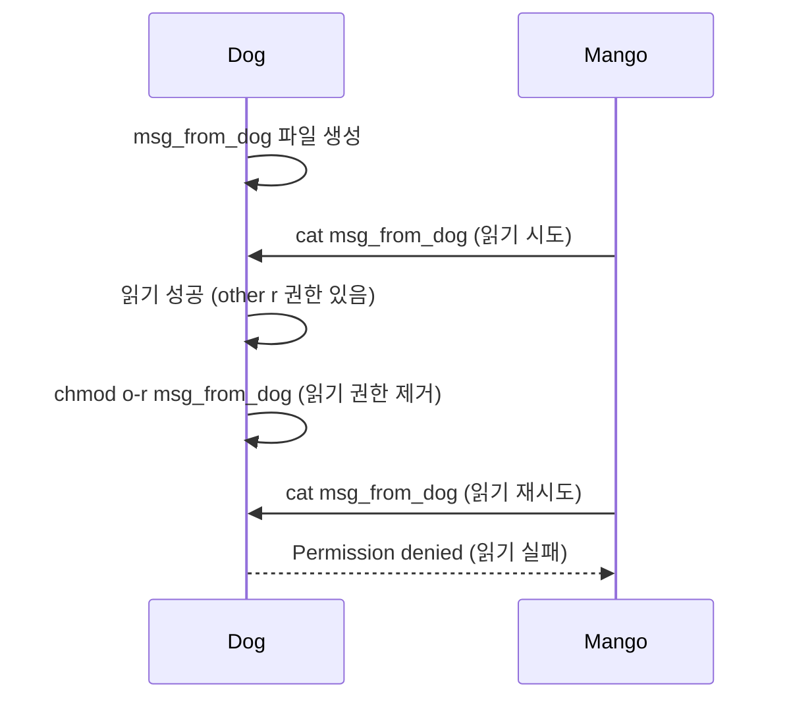

---

# 사용자 및 파일 권한 관리 — 실습 및 기출문제

---

# 🔬 실습편

## 실습 1. 사용자 및 그룹 관리 종합 실습

이 실습에서는 1장에서 배운 사용자/그룹 관리 명령어를 순서대로 실습한다.

### 실습 1-1. 사용자 생성 및 정보 확인

```bash
# [Step 1] 실습용 사용자 3명 생성
sudo adduser pig    # 비밀번호: pig123 으로 설정
sudo adduser mango  # 비밀번호: mango123
sudo adduser dog    # 비밀번호: dog123

# [Step 2] 생성된 사용자 정보 확인
grep -E "pig|mango|dog" /etc/passwd
# 출력 형식: 사용자명:x:UID:GID:설명:홈디렉터리:셸

# [Step 3] 홈 디렉터리 생성 확인
ls -la /home/

# [Step 4] 각 사용자 ID 정보 확인
id pig
id mango
id dog
```

> 실습 결과 확인 포인트: `id pig` 실행 시 `uid=1001(pig) gid=1001(pig) groups=1001(pig)` 와 같이 출력되어야 함.
{: .prompt-tip }

---

### 실습 1-2. 그룹 생성 및 사용자 추가

```bash
# [Step 1] animals 그룹 생성
sudo addgroup animals

# [Step 2] 그룹 생성 확인
grep animals /etc/group

# [Step 3] 사용자를 animals 그룹에 추가
sudo adduser pig animals
sudo adduser mango animals
sudo adduser dog animals

# [Step 4] 그룹 구성원 확인
grep animals /etc/group
# animals:x:2001:pig,mango,dog  (순서는 다를 수 있음)

# [Step 5] pig 사용자의 전체 그룹 정보 확인
id pig
groups pig
```

---

### 실습 1-3. 사용자 전환 및 비밀번호 변경

```bash
# [Step 1] pig 사용자로 전환
su pig

# [Step 2] 현재 사용자 확인
whoami      # pig 출력
id          # uid, gid 확인

# [Step 3] pig 비밀번호 변경
passwd
# Current password: pig123
# New password: newpig456
# Retype new password: newpig456

# [Step 4] pig 셸 종료
exit

# [Step 5] 변경된 비밀번호로 로그인 확인
su pig      # newpig456 으로 로그인
whoami
exit

# [Step 6] root 권한으로 mango 비밀번호 변경 (현재 비밀번호 없이)
sudo passwd mango
# New password: newmango789
# Retype new password: newmango789
```

---

### 실습 1-4. /etc/passwd, /etc/group 파일 직접 분석

```bash
# [Step 1] pig 사용자의 /etc/passwd 항목 추출
grep "^pig:" /etc/passwd
# pig:x:1001:1001:,,,:/home/pig:/bin/bash
#     ^ ^ ^^^^ ^^^^ ^^^ ^^^^^^^^^ ^^^^^^^^^
#     | | UID  GID  설명 홈디렉터리  로그인셸
#     | x = 비밀번호는 /etc/shadow 에

# [Step 2] /etc/shadow 에서 암호화된 비밀번호 확인 (root 필요)
sudo grep "^pig:" /etc/shadow
# pig:$y$j9T$...(암호화된 비밀번호)...:19789:0:99999:7:::

# [Step 3] animals 그룹의 /etc/group 항목 확인
grep "^animals:" /etc/group
# animals:x:2001:pig,mango,dog
```

---

## 실습 2. 파일 소유권 및 권한 설정 종합 실습

### 실습 2-1. playground 환경 준비

```bash
# [현재 사용자(user)로 실행]

# [Step 1] playground 디렉터리 생성 및 권한 설정
mkdir ~/playground
chmod 777 ~/playground

# [Step 2] 권한 확인
ls -ld ~/playground
# drwxrwxrwx  ...  playground

# [Step 3] pig 사용자로 전환하여 파일 생성
su pig
cd ~/                            # pig 홈으로 이동
# 또는 실제 playground 경로로 이동
echo "dog가 만든 파일입니다." > /tmp/shared/msg_from_dog 2>/dev/null || echo "경로 오류"

# 실습을 위한 공유 디렉터리
sudo mkdir -p /tmp/shared
sudo chmod 777 /tmp/shared

su dog
echo "dog가 만든 파일입니다." > /tmp/shared/msg_from_dog
ls -l /tmp/shared/msg_from_dog
exit
```

---

### 실습 2-2. 읽기 권한 실습



```bash
# [dog 사용자 셸에서]
su dog
echo "dog가 작성한 메시지입니다." > /tmp/shared/msg_from_dog
ls -l /tmp/shared/msg_from_dog
# -rw-rw-r-- 1 dog dog ... msg_from_dog
# other 에 r 권한이 있음 (마지막 r)
exit

# [mango 사용자 셸에서] 읽기 성공 확인
su mango
cat /tmp/shared/msg_from_dog    # 성공
exit

# [dog 사용자 셸에서] 읽기 권한 제거
su dog
chmod o-r /tmp/shared/msg_from_dog
ls -l /tmp/shared/msg_from_dog
# -rw-rw---- 1 dog dog ... msg_from_dog  (other 권한 --- 로 변경)
exit

# [mango 사용자 셸에서] 읽기 실패 확인
su mango
cat /tmp/shared/msg_from_dog    # Permission denied
exit
```

---

### 실습 2-3. 쓰기 권한 실습

```bash
# [pig 사용자 셸에서] 쓰기 시도 (권한 없음)
su pig
echo "pig가 내용을 추가합니다." >> /tmp/shared/msg_from_dog   # 실패
exit

# [dog 사용자 셸에서] 쓰기 권한 추가
su dog
chmod o+w /tmp/shared/msg_from_dog
ls -l /tmp/shared/msg_from_dog
# -rw-rw--w- 1 dog dog ... msg_from_dog  (other 에 w 권한 추가)
exit

# [pig 사용자 셸에서] 쓰기 성공 확인
su pig
echo "pig가 내용을 추가합니다." >> /tmp/shared/msg_from_dog   # 성공
cat /tmp/shared/msg_from_dog
exit
```

---

### 실습 2-4. 실행 권한 실습

```bash
# [dog 사용자 셸에서] 실행 스크립트 작성
su dog
cat > /tmp/shared/exec_test << 'EOF'
#!/bin/bash
echo "스크립트 실행 성공!"
echo "실행한 사용자: $(whoami)"
echo "현재 시각: $(date)"
EOF

# 권한 확인 (실행 권한 없음)
ls -l /tmp/shared/exec_test
# -rw-rw-rw- 1 dog dog ... exec_test

# 실행 시도 (실패 — 실행 권한 없음)
/tmp/shared/exec_test           # Permission denied

# 모든 사용자에게 실행 권한 부여
chmod +x /tmp/shared/exec_test
ls -l /tmp/shared/exec_test
# -rwxrwxrwx 1 dog dog ... exec_test

# 실행 (성공)
/tmp/shared/exec_test
exit
```

---

### 실습 2-5. chown 소유권 변경 실습

```bash
# [Step 1] 테스트 파일 생성 (현재 사용자 소유)
touch /tmp/shared/ownership_test.txt
ls -l /tmp/shared/ownership_test.txt
# -rw-rw-r-- 1 <현재사용자> <현재사용자> ...

# [Step 2] 소유자를 pig 로 변경
sudo chown pig /tmp/shared/ownership_test.txt
ls -l /tmp/shared/ownership_test.txt

# [Step 3] 소유자와 그룹 동시 변경
sudo chown pig:animals /tmp/shared/ownership_test.txt
ls -l /tmp/shared/ownership_test.txt

# [Step 4] 그룹만 변경
sudo chown :mango /tmp/shared/ownership_test.txt
ls -l /tmp/shared/ownership_test.txt

# [Step 5] 디렉터리 전체 소유권 변경
sudo mkdir -p /tmp/shared/mydir
sudo touch /tmp/shared/mydir/file1.txt /tmp/shared/mydir/file2.txt
ls -la /tmp/shared/mydir/
sudo chown -R pig:animals /tmp/shared/mydir/
ls -la /tmp/shared/mydir/
```

---

### 실습 2-6. 8진수 표기법 chmod 실습

```bash
# [Step 1] 권한 변경 전 상태 확인
touch /tmp/chmod_test.txt
ls -l /tmp/chmod_test.txt

# [Step 2] 644 로 설정 (텍스트 파일 표준)
chmod 644 /tmp/chmod_test.txt
ls -l /tmp/chmod_test.txt
# -rw-r--r--

# [Step 3] 755 로 설정 (실행 파일 표준)
chmod 755 /tmp/chmod_test.txt
ls -l /tmp/chmod_test.txt
# -rwxr-xr-x

# [Step 4] 600 으로 설정 (개인 파일)
chmod 600 /tmp/chmod_test.txt
ls -l /tmp/chmod_test.txt
# -rw-------

# [Step 5] 777 로 설정
chmod 777 /tmp/chmod_test.txt
ls -l /tmp/chmod_test.txt
# -rwxrwxrwx

# [Step 6] 000 으로 설정 (완전 차단)
chmod 000 /tmp/chmod_test.txt
ls -l /tmp/chmod_test.txt
# ----------

# 확인: 000 상태에서 자신도 읽기 불가
cat /tmp/chmod_test.txt    # Permission denied

# [Step 7] 복원
chmod 644 /tmp/chmod_test.txt
```

---

### 실습 2-7. 디렉터리 권한 차이 실습

```bash
mkdir /tmp/dirtest
echo "파일 내용" > /tmp/dirtest/secret.txt

# [테스트 1] r-x (목록 조회 가능, 파일 생성 불가)
chmod 555 /tmp/dirtest
su mango
ls /tmp/dirtest          # 성공 (r 권한)
cd /tmp/dirtest          # 성공 (x 권한)
touch /tmp/dirtest/new.txt  # 실패 (w 권한 없음)
exit

# [테스트 2] --x (목록 조회 불가, 파일명 알면 접근)
chmod 111 /tmp/dirtest
su mango
ls /tmp/dirtest          # 실패 (r 권한 없음)
cat /tmp/dirtest/secret.txt  # 성공 (파일명 알고, x 권한 있음)
exit

# [테스트 3] r-- (목록은 보이지만 접근 불가)
chmod 444 /tmp/dirtest
su mango
ls /tmp/dirtest          # 성공 (r 권한)
cd /tmp/dirtest          # 실패 (x 권한 없음)
cat /tmp/dirtest/secret.txt  # 실패 (x 권한 없음)
exit

# 복원
chmod 755 /tmp/dirtest
```

---

# 📝 기출문제

---

## 1과목: 사용자 관련

### 문제 1

다음 중 리눅스에서 사용자를 추가할 때 기본적으로 사용되는 명령어로 알맞은 것은?

① adduser  
② addgroup  
③ newuser  
④ mkuser

---

### 문제 2

`/etc/passwd` 파일에서 각 항목을 구분하는 구분자로 알맞은 것은?

① 쉼표(`,`)  
② 세미콜론(`;`)  
③ 콜론(`:`)  
④ 파이프(`|`)

---

### 문제 3

다음 중 `/etc/passwd` 파일에 대한 설명으로 틀린 것은?

① 사용자의 로그인 셸 정보가 저장된다.  
② 사용자의 홈 디렉터리 경로가 저장된다.  
③ 사용자의 암호화된 비밀번호가 저장된다.  
④ 사용자의 UID와 GID가 저장된다.

---

### 문제 4

다음 중 현재 로그인한 사용자의 UID, GID, 그룹 정보를 한 번에 확인하는 명령어로 알맞은 것은?

① whoami  
② who  
③ id  
④ users

---

### 문제 5

다음 중 `su -` 명령어와 `su` 명령어의 차이를 설명한 것으로 가장 알맞은 것은?

① `su -` 는 비밀번호가 필요 없다.  
② `su -` 는 root 사용자로만 전환할 수 있다.  
③ `su -` 는 대상 사용자의 환경변수를 새로 로드한다.  
④ `su` 는 현재 사용자의 셸을 종료한다.

---

### 문제 6

다음 명령어의 실행 결과에 대한 설명으로 가장 알맞은 것은?

```bash
sudo passwd -l pig
```

① pig 사용자의 비밀번호를 삭제한다.  
② pig 사용자 계정을 완전히 삭제한다.  
③ pig 사용자 계정을 잠근다.  
④ pig 사용자의 비밀번호 만료일을 설정한다.

---

### 문제 7

다음 중 `/etc/group` 파일의 네 번째 필드(사용자 목록)에 등록되지 않아도 해당 그룹의 구성원으로 인식되는 경우는?

① 보조 그룹으로 설정된 경우  
② `/etc/passwd` 에서 GID가 해당 그룹의 GID와 동일한 사용자  
③ `adduser` 명령어로 생성된 모든 사용자  
④ UID가 0인 사용자

---

## 2과목: 파일 권한 관련

### 문제 8

다음 중 `ls -l` 명령어로 확인한 파일 권한 `rwxr-x---` 에서 소유 그룹의 권한으로 알맞은 것은?

① 읽기, 쓰기, 실행  
② 읽기, 실행  
③ 읽기만  
④ 권한 없음

---

### 문제 9

파일의 권한이 `rw-r--r--` 일 때 8진수 표기법으로 알맞은 것은?

① 755  
② 644  
③ 600  
④ 422

---

### 문제 10

다음 명령어에 대한 설명으로 알맞은 것은?

```bash
chmod 755 hello.sh
```

① 소유자에게만 실행 권한을 부여한다.  
② 소유자, 그룹, 기타 모두에게 실행 권한을 부여한다.  
③ 소유자에게는 모든 권한, 그룹과 기타에게는 읽기와 실행 권한을 부여한다.  
④ 소유자에게는 읽기와 쓰기, 그룹과 기타에게는 읽기만 부여한다.

---

### 문제 11

다음 중 `chmod u+x script.sh` 명령어에 대한 설명으로 알맞은 것은?

① script.sh 파일의 모든 사용자에게 실행 권한을 추가한다.  
② script.sh 파일의 소유자에게 실행 권한을 추가한다.  
③ script.sh 파일의 소유자로부터 실행 권한을 제거한다.  
④ script.sh 파일의 소유 그룹에게 실행 권한을 추가한다.

---

### 문제 12

파일의 소유자와 소유 그룹을 동시에 변경하는 명령어로 알맞은 것은?

① `chmod pig:animals file.txt`  
② `chown pig:animals file.txt`  
③ `chgrp pig:animals file.txt`  
④ `chown pig file.txt && chgrp animals file.txt` 로만 가능

---

### 문제 13

다음 중 디렉터리에서 `x` (실행) 권한만 있고 `r` (읽기) 권한이 없을 때 가능한 동작으로 알맞은 것은?

① `ls` 명령으로 파일 목록을 확인할 수 있다.  
② `cd` 명령으로 디렉터리에 진입할 수 있다.  
③ 디렉터리 안에 파일을 생성할 수 있다.  
④ 아무것도 할 수 없다.

---

### 문제 14

다음은 파일 권한을 변경하는 과정이다. (괄호) 안에 들어갈 내용으로 알맞은 것은?

```bash
# 현재 권한: -rw-r--r--
( ) o+w file.txt
# 변경 후 권한: -rw-r--rw-
```

① chmod  
② chown  
③ chgrp  
④ setperm

---

### 문제 15

다음 중 디렉터리의 권한이 `drwxr-x---` 일 때, 기타(other) 사용자가 할 수 있는 동작으로 알맞은 것은?

① `ls` 명령으로 파일 목록을 확인할 수 있다.  
② `cd` 명령으로 디렉터리에 진입할 수 있다.  
③ 디렉터리 안에 파일을 생성할 수 있다.  
④ 아무것도 할 수 없다.

---

---

# ✅ 정답

| 문제 | 정답 |
|------|------|
| 문제 1 | ① adduser |
| 문제 2 | ③ 콜론(`:`) |
| 문제 3 | ③ 사용자의 암호화된 비밀번호가 저장된다. |
| 문제 4 | ③ id |
| 문제 5 | ③ `su -` 는 대상 사용자의 환경변수를 새로 로드한다. |
| 문제 6 | ③ pig 사용자 계정을 잠근다. |
| 문제 7 | ② `/etc/passwd` 에서 GID가 해당 그룹의 GID와 동일한 사용자 |
| 문제 8 | ② 읽기, 실행 |
| 문제 9 | ② 644 |
| 문제 10 | ③ 소유자에게는 모든 권한, 그룹과 기타에게는 읽기와 실행 권한을 부여한다. |
| 문제 11 | ② script.sh 파일의 소유자에게 실행 권한을 추가한다. |
| 문제 12 | ② `chown pig:animals file.txt` |
| 문제 13 | ② `cd` 명령으로 디렉터리에 진입할 수 있다. |
| 문제 14 | ① chmod |
| 문제 15 | ④ 아무것도 할 수 없다. |

---

---

# 📖 풀이 및 해설

---

### 문제 1 해설 — 사용자 추가 명령어

**정답: ① adduser**

Ubuntu/Debian 계열에서 사용자를 추가하는 권장 명령어는 `adduser` 다.

| 명령어 | 특징 |
|---|---|
| `adduser` | 고수준. 홈 디렉터리 자동 생성, 대화형 입력 |
| `useradd` | 저수준. 홈 디렉터리 직접 생성해야 함 |

`addgroup`, `newuser`, `mkuser` 는 사용자 추가 명령어가 아님.

---

### 문제 2 해설 — /etc/passwd 구분자

**정답: ③ 콜론(`:`)**

`/etc/passwd` 파일은 콜론(`:`)을 구분자로 7개 필드를 구분함.

```
pig:x:1001:1001:,,,:/home/pig:/bin/bash
   ^    ^    ^   ^  ^         ^
   각 필드 사이에 : 사용
```

---

### 문제 3 해설 — /etc/passwd 파일 내용

**정답: ③ 사용자의 암호화된 비밀번호가 저장된다.**

`/etc/passwd` 의 비밀번호 필드는 `x` 로만 표시된다.  
실제 암호화된 비밀번호는 **`/etc/shadow`** 에 저장된다.

```
pig:x:1001:1001:,,,:/home/pig:/bin/bash
    ^
    x = 비밀번호는 /etc/shadow 에 있음
```

①②④ 는 모두 `/etc/passwd` 에 저장되는 정보임.

---

### 문제 4 해설 — 사용자 정보 조회 명령어

**정답: ③ id**

```bash
id
# uid=1000(user) gid=1000(user) groups=1000(user),4(adm),24(cdrom)...
```

| 명령어 | 출력 정보 |
|---|---|
| `whoami` | 현재 사용자명만 출력 |
| `who` | 로그인한 사용자 목록 |
| `id` | UID, GID, 소속 그룹 전체 출력 |
| `users` | 현재 로그인한 사용자명 목록 |

---

### 문제 5 해설 — su vs su -

**정답: ③ `su -` 는 대상 사용자의 환경변수를 새로 로드한다.**

`su` 와 `su -` 의 핵심 차이:

| 항목 | `su` | `su -` |
|---|---|---|
| 환경변수 | 현재 사용자 것 유지 | 대상 사용자 환경 새로 로드 |
| 작업 디렉터리 | 현재 위치 유지 | 대상 사용자 홈으로 이동 |
| 셸 초기화 파일 | `.bashrc` 미실행 | `.profile`, `.bashrc` 실행 |

①은 `su` 든 `su -` 든 비밀번호가 필요함.  
② `su -` 로 일반 사용자로도 전환 가능 (`su - pig`).  
④ `su` 가 셸을 종료하는 게 아닌 새 셸을 시작함.

---

### 문제 6 해설 — passwd -l

**정답: ③ pig 사용자 계정을 잠근다.**

`passwd` 옵션 정리:

| 옵션 | 기능 |
|---|---|
| `-l` | 계정 잠금 (Lock) — `/etc/shadow` 비밀번호 앞에 `!` 추가 |
| `-u` | 계정 잠금 해제 (Unlock) |
| `-d` | 비밀번호 삭제 |
| `-e` | 다음 로그인 시 비밀번호 강제 변경 |
| `-S` | 비밀번호 상태 조회 |

계정 잠금 확인:

```bash
sudo passwd -l pig
sudo grep "^pig:" /etc/shadow
# pig:!$y$j9T$...(비밀번호)...  -> ! 가 붙으면 잠금 상태
```

---

### 문제 7 해설 — 기본 그룹 구성원

**정답: ② `/etc/passwd` 에서 GID가 해당 그룹의 GID와 동일한 사용자**

`/etc/group` 의 4번째 필드에는 **보조 그룹** 구성원만 나열된다.  
기본 그룹(primary group) 구성원은 `/etc/passwd` 의 GID 필드로 지정된다.

```
# /etc/passwd
pig:x:1001:1001:...  -> GID=1001 = pig 그룹의 기본 구성원

# /etc/group
pig:x:1001:          -> 4번째 필드 비어 있어도 pig는 구성원
```

---

### 문제 8 해설 — 권한 읽기

**정답: ② 읽기, 실행**

`rwxr-x---` 를 분석하면:

```
r w x | r - x | - - -
소유자  소유그룹  기타
```

- 소유자: `rwx` (읽기, 쓰기, 실행)
- **소유 그룹: `r-x` (읽기, 실행)** ← 정답
- 기타: `---` (권한 없음)

---

### 문제 9 해설 — 권한의 8진수 변환

**정답: ② 644**

`rw-r--r--` 을 8진수로 변환:

```
r w - | r - - | r - -
1 1 0 | 1 0 0 | 1 0 0
  6   |   4   |   4
```

- `rw-` = 110(2진) = 6(8진)
- `r--` = 100(2진) = 4(8진)
- `r--` = 100(2진) = 4(8진)
- 결합: **644**

---

### 문제 10 해설 — chmod 755 의미

**정답: ③ 소유자에게는 모든 권한, 그룹과 기타에게는 읽기와 실행 권한을 부여한다.**

755 분석:

```
7 = 111(2) = rwx  → 소유자: 읽기+쓰기+실행
5 = 101(2) = r-x  → 그룹: 읽기+실행
5 = 101(2) = r-x  → 기타: 읽기+실행
```

`-rwxr-xr-x` 로 설정됨.  
① 소유자만이 아닌 그룹/기타도 실행 권한 있음.  
② 그룹/기타는 쓰기 권한 없음.  
④ 소유자에게는 실행 권한도 있음.

---

### 문제 11 해설 — 의미 표기법 u+x

**정답: ② script.sh 파일의 소유자에게 실행 권한을 추가한다.**

의미 표기법:

| 기호 | 대상 |
|---|---|
| `u` | 소유자(user) |
| `g` | 소유 그룹(group) |
| `o` | 기타(other) |
| `a` | 모두(all) |

`u+x` = 소유자(u)에게 실행(x) 권한 추가(+).

모든 사용자에게 추가하려면 `a+x` 또는 `+x`.

---

### 문제 12 해설 — chown으로 소유자+그룹 변경

**정답: ② `chown pig:animals file.txt`**

`chown` 의 형식:

```bash
chown 소유자:그룹 파일명    # 소유자와 그룹 동시 변경
chown 소유자 파일명         # 소유자만 변경
chown :그룹 파일명          # 그룹만 변경 (= chgrp 와 동일)
```

- `chmod` 는 **권한(permission)** 변경 명령어
- `chgrp` 는 **그룹만** 변경하는 명령어
- `chown pig:animals` 로 소유자와 그룹을 한 번에 변경 가능함

---

### 문제 13 해설 — 디렉터리 x만 있을 때

**정답: ② `cd` 명령으로 디렉터리에 진입할 수 있다.**

디렉터리 권한 의미:

| 권한 | 가능 동작 |
|---|---|
| `r` | `ls` 로 목록 조회 |
| `x` | `cd` 로 진입, 파일 접근 |
| `w` + `x` | 파일 생성/삭제 |

`x` 만 있으면:
- `ls` 불가 (r 권한 없음) → ①은 틀림
- `cd` 가능 → ② 정답
- 파일 생성 불가 (w 권한 없음) → ③은 틀림

---

### 문제 14 해설 — 권한 변경 명령어

**정답: ① chmod**

```bash
chmod o+w file.txt
```

- `chmod` = 파일 **권한(mode)** 변경
- `chown` = 소유자/그룹 변경
- `chgrp` = 그룹만 변경
- `setperm` 은 존재하지 않는 명령어

`o+w` = 기타(other)에게 쓰기(w) 권한 추가.

---

### 문제 15 해설 — 디렉터리 권한 ---

**정답: ④ 아무것도 할 수 없다.**

`drwxr-x---` 분석:

```
d r w x | r - x | - - -
디렉터리  소유자   그룹    기타
```

기타(other) 권한: `---` (모든 권한 없음)

기타 사용자는 해당 디렉터리에 대해:
- `ls` 불가 (r 없음) → ①은 틀림
- `cd` 불가 (x 없음) → ②는 틀림
- 파일 생성 불가 (w 없음) → ③은 틀림
- **아무것도 할 수 없음** → ④ 정답

---
