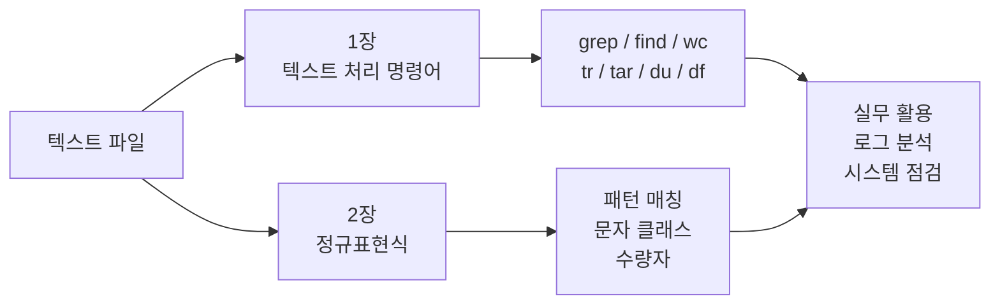
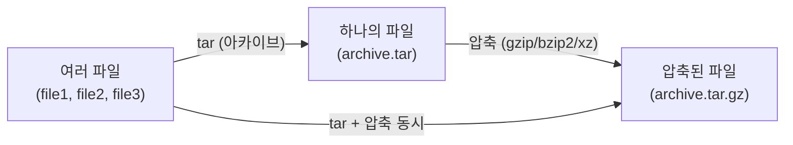
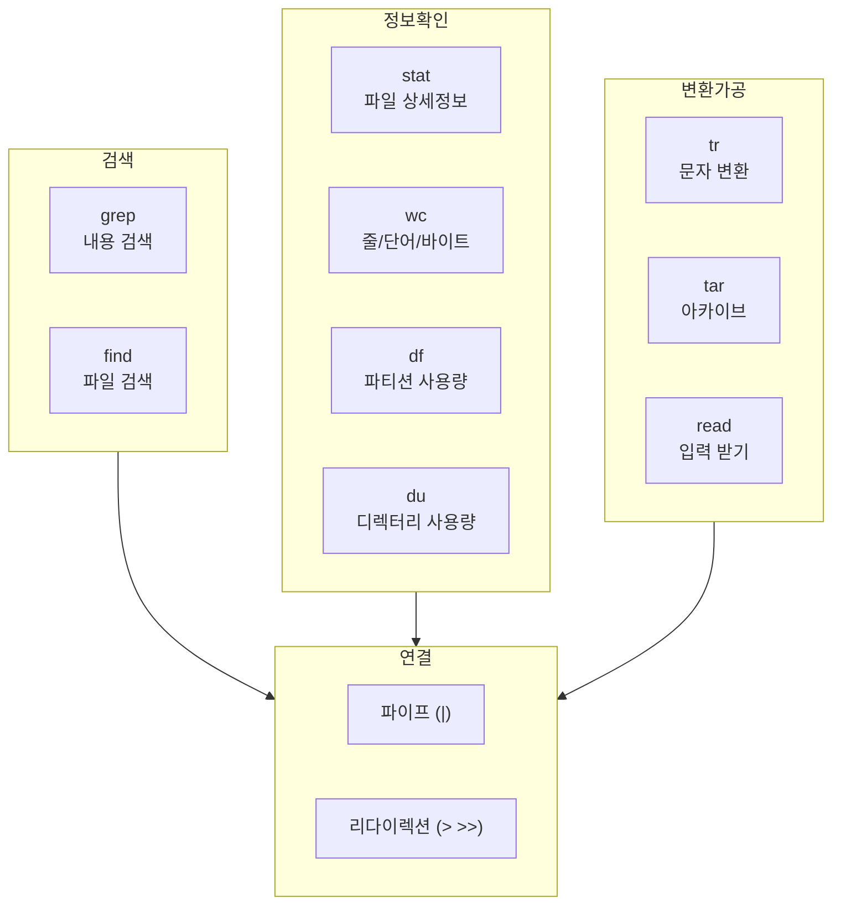
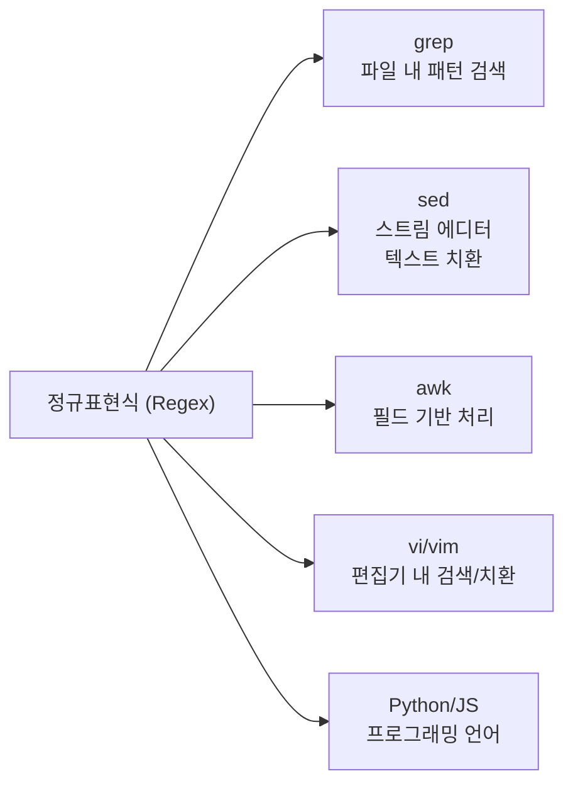
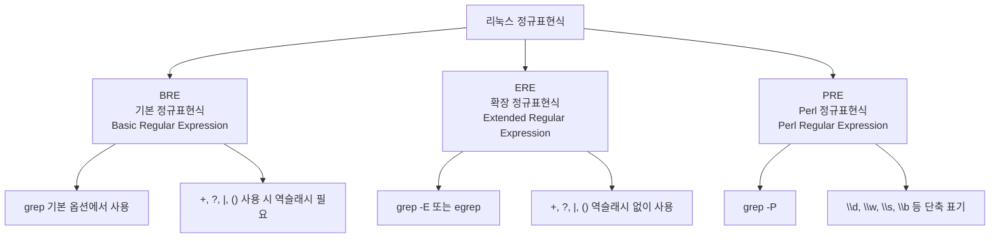
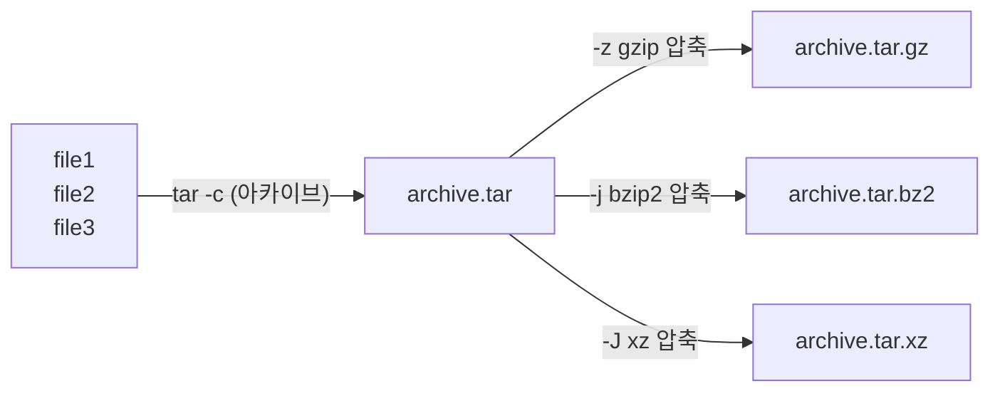
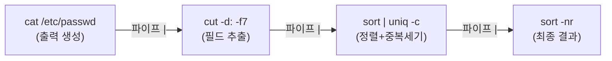
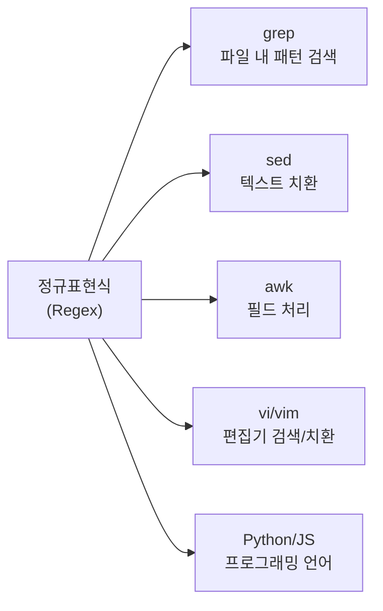
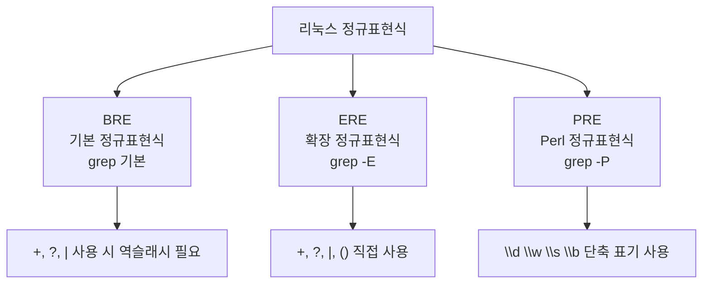

## 강의 개요

리눅스에서 모든 설정, 로그, 사용자 정보는 **텍스트 파일**로 관리됨. 이 파일들을 자유자재로 다루는 능력이 시스템 관리와 보안 분석의 핵심임.



---

# 1장. 텍스트 처리 명령어

---

## 1.1 grep — 패턴 검색 (Global Regular Expression Print)

`grep`은 **표준 입력이나 텍스트 파일에서 특정 패턴을 검색**하는 명령어임. 리눅스에서 가장 빈번하게 사용하는 도구 중 하나이며, 정규표현식과 결합하면 매우 강력해짐.

**형식:**
```bash
grep [옵션] 패턴 [파일명...]
```

**주요 옵션:**

| 옵션 | 설명 |
|---|---|
| `-i` | 대소문자 구분 없이 검색 |
| `-v` | 패턴과 일치하지 않는 줄만 출력 (반전) |
| `-n` | 줄 번호와 함께 출력 |
| `-r` / `-R` | 하위 디렉터리까지 재귀적 검색 |
| `-l` | 매칭된 파일 이름만 출력 |
| `-c` | 매칭된 줄의 개수만 출력 |
| `-E` | 확장 정규표현식 사용 (`egrep`과 동일) |
| `-P` | Perl 정규표현식 사용 |
| `-w` | 단어 단위로 검색 (완전한 단어만) |
| `-A n` | 매칭된 줄 이후 n줄도 함께 출력 |
| `-B n` | 매칭된 줄 이전 n줄도 함께 출력 |

**기본 예제:**
```bash
grep "root" /etc/passwd
grep -i "error" /var/log/syslog
grep -n "bash" /etc/passwd
grep -v "nologin" /etc/passwd
grep -c "bash" /etc/passwd
grep -E "error|warning" /var/log/syslog
```

> `grep` 은 파이프(`|`)와 함께 사용할 때 진가를 발휘함. 예를 들어 `cat /var/log/syslog | grep -i error | grep -v debug` 처럼 연속 필터링이 가능함.
{: .prompt-info }

---

## 1.2 find — 파일/디렉터리 검색

`find`는 **파일이나 디렉터리를 조건에 따라 검색**하는 명령어임. `grep`이 파일 내용을 검색한다면, `find`는 파일 자체(이름, 크기, 권한, 수정 시간 등)를 검색함.

**형식:**
```bash
find [검색경로] [표현식]
```

**주요 옵션:**

| 옵션 | 설명 |
|---|---|
| `-name 패턴` | 파일 이름으로 검색 |
| `-iname 패턴` | 대소문자 무시 이름 검색 |
| `-type f` | 일반 파일만 검색 |
| `-type d` | 디렉터리만 검색 |
| `-size +10M` | 10MB 초과 파일 검색 |
| `-mtime -7` | 7일 이내 수정된 파일 검색 |
| `-perm 755` | 특정 권한의 파일 검색 |
| `-user 사용자명` | 특정 사용자 소유 파일 검색 |
| `-exec 명령어 {} \;` | 검색된 파일에 명령어 실행 |

**예제:**
```bash
find /home -name "*.txt"                    # /home 에서 .txt 파일 검색
find /var/log -name "*.log" -mtime -1      # 1일 이내 수정된 로그 파일
find / -type f -size +100M                  # 100MB 초과 파일 검색
find /etc -name "*.conf" -exec ls -lh {} \; # .conf 파일 목록 상세 출력
find / -perm -4000 -type f                  # SetUID 설정 파일 검색 (보안)
find /tmp -type f -mtime +7                 # 7일 넘은 임시 파일
```

> `find / -perm -4000` 은 SetUID 비트가 설정된 파일을 찾는 명령으로, 보안 점검 시 루트 권한 탈취 벡터를 확인하는 용도로 자주 사용됨.
{: .prompt-warning }

---

## 1.3 stat — 파일 상세 정보

`stat`은 **파일이나 파일 시스템의 상세한 상태 정보**를 표시하는 명령어임. `ls -l`보다 훨씬 더 많은 정보를 제공함.

**형식:**
```bash
stat [옵션] 파일명
```

**주요 옵션:**

| 옵션 | 설명 |
|---|---|
| `-f` | 파일 시스템 정보 표시 |
| `-c 형식` | 출력 형식 지정 |
| `--printf=형식` | 줄바꿈 없이 형식 지정 출력 |

**예제:**
```bash
stat /etc/passwd
# 출력 예:
#   File: /etc/passwd
#   Size: 2345       Blocks: 8     IO Block: 4096  regular file
#   Device: 801h/2049d  Inode: 524289  Links: 1
#   Access: (0644/-rw-r--r--)  Uid: (0/root)   Gid: (0/root)
#   Access: 2026-03-07 10:00:00.000 +0900
#   Modify: 2026-03-01 08:00:00.000 +0900
#   Change: 2026-03-01 08:00:00.000 +0900

stat -c "%n %s %y" /etc/passwd    # 이름, 크기, 수정시간만 출력
```

`stat`이 보여주는 세 가지 시간:
- **Access** : 마지막으로 파일을 읽은 시간 (atime)
- **Modify** : 파일 내용이 마지막으로 수정된 시간 (mtime)
- **Change** : 파일 메타데이터(권한, 소유자 등)가 마지막으로 변경된 시간 (ctime)

---

## 1.4 wc — 줄/단어/바이트 수 계산

`wc`(Word Count)는 **텍스트 파일의 줄 수, 단어 수, 바이트 수를 계산**하는 명령어임. 파이프와 조합하여 검색 결과 건수를 세는 용도로 자주 사용됨.

**주요 옵션:**

| 옵션 | 설명 |
|---|---|
| `-l` | 줄 수만 출력 |
| `-w` | 단어 수만 출력 |
| `-c` | 바이트 수만 출력 |
| `-m` | 문자 수만 출력 |

```bash
wc /etc/passwd              # 줄 수, 단어 수, 바이트 수 모두 출력
wc -l /etc/passwd           # 시스템 계정 수 = passwd 파일의 줄 수
wc -w /etc/passwd           # 단어 수
grep "bash" /etc/passwd | wc -l   # bash 사용자 수 계산
ls /etc | wc -l             # /etc 디렉터리 파일/디렉터리 개수
```

---

## 1.5 df — 디스크 사용량 (Disk Free)

`df`는 **파일 시스템(마운트 포인트)의 디스크 사용량**을 출력하는 명령어임. 파티션 단위로 전체/사용/남은 용량을 보여줌.

**주요 옵션:**

| 옵션 | 설명 |
|---|---|
| `-h` | 사람이 읽기 쉬운 단위로 출력 (KB/MB/GB) |
| `-T` | 파일 시스템 종류도 함께 출력 |
| `-i` | 아이노드 사용량 표시 |

```bash
df -h           # 전체 디스크 사용량 (읽기 쉬운 단위)
df -hT          # 파일 시스템 종류 포함
df -h /home     # /home 파티션만 확인
df -i           # 아이노드 사용량 확인 (파일 개수가 많을 때 중요)
```

> `df -h` 결과에서 `Use%` 가 80% 를 넘으면 디스크 용량 부족 징후임. 90% 를 넘으면 시스템 장애 가능성이 있으므로 즉시 조치해야 함.
{: .prompt-warning }

---

## 1.6 du — 디렉터리/파일 사용량 (Disk Usage)

`du`는 **파일이나 디렉터리가 차지하는 실제 디스크 사용량**을 추정하여 출력하는 명령어임. `df`가 파티션 전체를 보여준다면, `du`는 특정 디렉터리/파일의 크기를 보여줌.

**주요 옵션:**

| 옵션 | 설명 |
|---|---|
| `-h` | 사람이 읽기 쉬운 단위 출력 |
| `-s` | 요약(summary) — 총합만 출력 |
| `-a` | 모든 파일 개별 출력 |
| `--max-depth=n` | 출력 깊이 제한 |

```bash
du -sh /home/user           # 홈 디렉터리 총 사용량
du -sh ~                    # 현재 사용자 홈 디렉터리 총 사용량
du -h --max-depth=1 /home   # /home 하위 1단계 디렉터리별 크기
du -sh /var/log/*           # 로그 디렉터리별 크기
du -a /etc | sort -rh | head -10  # /etc 에서 큰 파일 TOP 10
```

---

## 1.7 tar — 아카이브와 압축

`tar`(Tape Archive)는 **파일과 디렉터리를 아카이브(묶기)하고 압축**하는 데 사용하는 명령어임. 리눅스에서 파일 백업과 배포의 핵심 도구임.

**아카이브와 압축의 차이:**



**주요 옵션:**

| 옵션 | 설명 |
|---|---|
| `-c` | 아카이브 생성 (create) |
| `-x` | 아카이브 추출 (extract) |
| `-t` | 아카이브 목록 확인 (list) |
| `-v` | 처리 파일 목록 출력 (verbose) |
| `-f 파일명` | 아카이브 파일 이름 지정 |
| `-z` | gzip 압축/해제 (`.tar.gz`) |
| `-j` | bzip2 압축/해제 (`.tar.bz2`) |
| `-J` | xz 압축/해제 (`.tar.xz`) |

```bash
# 아카이브 생성
tar -cvf archive.tar /etc/             # 압축 없이 묶기
tar -czvf archive.tar.gz /etc/        # gzip 압축
tar -cjvf archive.tar.bz2 /etc/       # bzip2 압축 (더 압축률 높음)

# 아카이브 확인 (압축 풀지 않고)
tar -tzvf archive.tar.gz

# 아카이브 해제
tar -xvf archive.tar                   # 현재 디렉터리에 풀기
tar -xzvf archive.tar.gz               # gzip 해제
tar -xzvf archive.tar.gz -C /tmp      # /tmp 에 풀기

# 특정 파일만 추출
tar -xzvf archive.tar.gz etc/passwd   # passwd 파일만 추출
```

> `tar` 옵션 암기 팁: **C**reate/**e**x**T**ract/**t**able + **z**(gzip)/**j**(bzip2) + **v**erbose + **f**ilename 순으로 기억하면 됨.
{: .prompt-tip }

---

## 1.8 read — 사용자 입력 받기

`read`는 **Bash 내장 명령어**로, 표준 입력(보통 키보드)에서 한 줄을 읽어 변수에 저장하는 명령어임. 셸 스크립트에서 사용자 입력을 받을 때 사용함.

**주요 옵션:**

| 옵션 | 설명 |
|---|---|
| `-p 프롬프트` | 입력 전 출력할 메시지 지정 |
| `-s` | 입력한 내용을 화면에 표시하지 않음 (비밀번호 입력) |
| `-t 초` | 입력 타임아웃 지정 |
| `-n 개수` | 지정한 글자 수만 읽기 |
| `-a 배열명` | 입력을 배열로 저장 |

```bash
# 기본 사용
read name
echo "Hello, $name"

# 프롬프트와 함께
read -p "이름을 입력하세요: " username
echo "안녕하세요, $username 님"

# 비밀번호 입력 (화면에 표시 안 됨)
read -sp "비밀번호: " password
echo ""
echo "입력된 비밀번호 길이: ${#password}"

# 타임아웃 (5초 안에 입력 없으면 기본값 사용)
read -t 5 -p "5초 안에 입력하세요: " input || input="기본값"
```

---

## 1.9 tr — 문자 변환 (translate)

`tr`은 **표준 입력으로 받은 문자들을 변환, 삭제, 압축**하는 명령어임. 파이프와 함께 사용하며, 직접 파일을 인자로 받지 않고 표준 입력만 받음.

**주요 문자 집합:**

| 표기 | 의미 |
|---|---|
| `a-z` | 소문자 전체 |
| `A-Z` | 대문자 전체 |
| `0-9` | 숫자 전체 |
| `[:lower:]` | 소문자 (POSIX 클래스) |
| `[:upper:]` | 대문자 (POSIX 클래스) |
| `[:digit:]` | 숫자 (POSIX 클래스) |
| `[:space:]` | 공백 문자 |

**주요 옵션:**

| 옵션 | 설명 |
|---|---|
| `-d 집합` | 집합에 속하는 문자 삭제 |
| `-s 집합` | 연속된 같은 문자를 하나로 압축 |
| `-c 집합` | 집합을 제외한 나머지 문자에 적용 |

```bash
# 소문자 → 대문자 변환
echo "hello world" | tr 'a-z' 'A-Z'
# 출력: HELLO WORLD

# 대문자 → 소문자 변환
echo "HELLO WORLD" | tr 'A-Z' 'a-z'
# 출력: hello world

# 숫자 삭제
echo "abc123def456" | tr -d '0-9'
# 출력: abcdef

# 공백 압축 (연속된 공백을 하나로)
echo "hello    world" | tr -s ' '
# 출력: hello world

# 줄바꿈을 공백으로 변환
cat /etc/passwd | cut -d: -f1 | tr '\n' ' '

# 특수문자 제거 (숫자, 알파벳, 공백 외 삭제)
echo "hello, world! 123" | tr -cd '[:alnum:] '
# 출력: hello world 123
```

---

## 1.10 파이프라인과 리다이렉션

### 1.10.1 파이프 (|)

**파이프(Pipe)** 는 한 명령어의 **표준 출력**을 다른 명령어의 **표준 입력**으로 연결하는 기능임.


```bash
# 파이프 체인 예시 — passwd 에서 셸별 사용자 수 계산
cat /etc/passwd | cut -d: -f7 | sort | uniq -c | sort -nr
```

### 1.10.2 리다이렉션

| 연산자 | 의미 |
|---|---|
| `>` | 표준 출력을 파일로 (덮어쓰기) |
| `>>` | 표준 출력을 파일에 추가 |
| `<` | 파일 내용을 표준 입력으로 |
| `2>` | 표준 에러를 파일로 |
| `2>&1` | 표준 에러를 표준 출력으로 합침 |
| `&>` | 표준 출력과 에러를 모두 파일로 |

```bash
ls -l > filelist.txt            # 파일 목록 저장
date >> log.txt                  # 날짜 추가
grep "error" log.txt 2>/dev/null # 에러 메시지 버리기
find / -name "*.sh" 2>&1 | grep -v "Permission"  # 에러 포함 출력 필터
```

---

## 1.11 명령어 관계도



---

# 2장. 정규표현식 (Regular Expression)

---

## 2.1 정규표현식이란

**정규표현식(Regular Expression, Regex)** 은 문자열에서 특정 패턴을 검색하거나 치환하기 위한 **패턴 표기 언어**임. 한번 익혀두면 grep, sed, awk, Python, JavaScript, Java 등 거의 모든 도구와 언어에서 그대로 활용할 수 있음.



---

## 2.2 정규표현식의 3가지 종류

리눅스에서 사용하는 정규표현식은 세 가지 종류가 있음. 사용하는 도구와 옵션에 따라 지원하는 종류가 다름.



| 종류 | 명령어 | 특징 |
|---|---|---|
| BRE | `grep` (기본) | `+`, `?`, `\|` 사용 시 `\` 이스케이프 필요 |
| ERE | `grep -E` | `+`, `?`, `\|`, `()` 직접 사용 |
| PRE | `grep -P` | `\d`, `\w`, `\s`, `\b` 단축 표기 사용 가능 |

---

## 2.3 위치 앵커 ^ $

| 메타문자 | 의미 |
|---|---|
| `^` | 줄의 시작 |
| `$` | 줄의 끝 |

```bash
grep "^root" /etc/passwd          # root 로 시작하는 줄
grep "bash$" /etc/passwd          # bash 로 끝나는 줄
grep "^$" file.txt                # 빈 줄 (시작=끝)
grep -v "^#" /etc/hosts           # 주석 줄 제외
grep -v "^$" file.txt             # 빈 줄 제외
grep -v "^#" /etc/hosts | grep -v "^$"   # 주석+빈줄 모두 제외
```

---

## 2.4 임의 문자 .

`.` (점)은 **줄바꿈을 제외한 임의의 한 문자**와 매칭됨.

```bash
echo "cat cut cot bat" | grep "c.t"
# 출력: cat cut cot bat   (cat, cut, cot 에서 c.t 패턴 매칭)

grep "r..t" /etc/passwd           # r + 임의 2글자 + t (root 등)

# 점을 일반 문자로 사용하려면 이스케이프
echo "file.txt" | grep "file\.txt"
```

---

## 2.5 반복 수량자 * + ? {}

| 메타문자 | 의미 | 필요 옵션 |
|---|---|---|
| `*` | 앞 문자가 0번 이상 반복 | BRE (기본) |
| `+` | 앞 문자가 1번 이상 반복 | ERE (`-E`) |
| `?` | 앞 문자가 0번 또는 1번 | ERE (`-E`) |
| `{n}` | 정확히 n번 반복 | ERE (`-E`) |
| `{n,}` | n번 이상 반복 | ERE (`-E`) |
| `{n,m}` | n번 이상 m번 이하 반복 | ERE (`-E`) |

```bash
# * (0번 이상)
echo "b ba baa baaa" | grep "ba*"
# 출력: b ba baa baaa (b, ba, baa, baaa 모두 매칭 — a가 0번 이상)

# + (1번 이상)
echo "b ba baa baaa" | grep -E "ba+"
# 출력: b ba baa baaa (ba, baa, baaa 매칭 — b는 미매칭)

# ? (0번 또는 1번)
echo "color colour" | grep -E "colou?r"
# 출력: color colour (color와 colour 모두 매칭)

# {n,m}
echo "a aa aaa aaaa" | grep -E "a{2,3}"
# 출력: a aa aaa aaaa (aa, aaa 매칭)
```

---

## 2.6 문자 클래스 []

`[]` 안에 나열된 문자 중 **하나**와 매칭됨.

| 표현 | 의미 |
|---|---|
| `[abc]` | a, b, c 중 하나 |
| `[^abc]` | a, b, c 를 제외한 모든 문자 |
| `[a-z]` | 소문자 하나 |
| `[A-Z]` | 대문자 하나 |
| `[0-9]` | 숫자 하나 |
| `[a-zA-Z0-9]` | 영문자와 숫자 |

```bash
echo "cat bat rat mat" | grep "[cbr]at"
# 출력: cat bat rat mat (cat, bat, rat 매칭 — mat 은 미매칭)

echo "apple 12345 !@#" | grep "[0-9]"
# 출력: apple 12345 !@# (숫자가 포함된 줄)

echo "hello WORLD 123" | grep "[A-Z]"
# 출력: hello WORLD 123 (대문자가 포함된 줄)

# ^ (부정) — 대괄호 안 맨 앞에서만
echo "hello" | grep "[^aeiou]"
# 출력: hello (모음이 아닌 문자(h,l,l)가 포함된 줄)
```

---

## 2.7 OR 연산자 |

`|` 는 OR 연산자로, ERE(`-E`)에서 사용함.

```bash
grep -E "cat|dog" pets.txt          # cat 또는 dog 매칭
grep -i -E "error|warning|critical" /var/log/syslog

# BRE 에서는 역슬래시 필요
grep "error\|warning" /var/log/syslog
```

---

## 2.8 그룹화 ()와 역참조

`()` 로 그룹을 묶으면 수량자를 그룹 전체에 적용하거나, `\1`, `\2` 로 역참조(Backreference)할 수 있음.

```bash
# 그룹에 수량자 적용
echo "abababc" | grep -E "(ab)+"
# 출력: abababc (ab 가 1번 이상 반복되는 부분 매칭)

# 역참조 — 반복되는 단어 찾기
echo "hello hello world bye bye" | grep -E "(\b\w+\b) \1"
# 출력: hello hello world bye bye (연속 반복 단어 포함 줄)
```

---

## 2.9 단어 경계 \b

`\b` 는 **단어와 비단어(공백, 구두점) 사이의 경계**를 의미함. 완전한 단어만 매칭할 때 사용함.

```bash
# \b 없이 — 부분 일치도 매칭
echo "cat category concatenate" | grep "cat"
# 출력: cat category concatenate (category, concatenate 내 cat 도 매칭)

# \b 있을 때 — 완전한 단어만
echo "cat category concatenate" | grep -E "\bcat\b"
# 출력: cat category concatenate (독립 단어 cat 만 매칭)
```

---

## 2.10 Perl 정규표현식 단축 표기 (-P)

`grep -P` 옵션을 사용하면 **단축 문자 클래스**를 사용할 수 있어 정규표현식이 간결해짐.

| 단축 표기 | 의미 | 동등한 표현 |
|---|---|---|
| `\d` | 숫자 | `[0-9]` |
| `\D` | 숫자가 아닌 문자 | `[^0-9]` |
| `\w` | 단어 문자 | `[a-zA-Z0-9_]` |
| `\W` | 단어 문자가 아닌 것 | `[^a-zA-Z0-9_]` |
| `\s` | 공백 문자 | `[ \t\n\r]` |
| `\S` | 공백이 아닌 문자 | `[^ \t\n\r]` |

```bash
echo "abc 123 !@#" | grep -P "\d+"     # 숫자 포함 줄
echo "abc 123 !@#" | grep -P "\w+"     # 단어 문자 포함 줄
echo "abc 123" | grep -P "^\w+\s+\d+$" # 단어 + 공백 + 숫자 패턴
```

---

## 2.11 핵심 패턴 요약표

| 패턴 | 의미 | 예시 | 매칭 |
|---|---|---|---|
| `.` | 임의 문자 1개 | `c.t` | cat, cut, cot |
| `^` | 줄 시작 | `^root` | root로 시작하는 줄 |
| `$` | 줄 끝 | `bash$` | bash로 끝나는 줄 |
| `*` | 0번 이상 | `ab*c` | ac, abc, abbc |
| `+` | 1번 이상 (ERE) | `ab+c` | abc, abbc |
| `?` | 0 또는 1번 (ERE) | `colou?r` | color, colour |
| `{n,m}` | n~m번 (ERE) | `a{2,3}` | aa, aaa |
| `[abc]` | 문자 클래스 | `[aeiou]` | 모음 1개 |
| `[^abc]` | 부정 클래스 | `[^0-9]` | 숫자 아닌 문자 |
| `\|` | OR (ERE: `\|`) | `cat\|dog` | cat 또는 dog |
| `\b` | 단어 경계 | `\bcat\b` | 완전한 단어 cat |
| `\d` | 숫자 (PRE) | `\d+` | 숫자 연속 |
| `\w` | 단어문자 (PRE) | `\w+` | 단어문자 연속 |
| `\s` | 공백 (PRE) | `\s+` | 공백 연속 |
| `()` | 그룹화 (ERE) | `(ab)+` | ab, abab |
| `\1` | 역참조 | `(\w+) \1` | 반복 단어 |

> 정규표현식은 외우는 것보다 **패턴을 이해**하는 것이 중요함. 기본 메타문자의 의미를 이해하면, 조합으로 어떤 패턴도 만들 수 있음.
{: .prompt-tip }
---
title: "(4주차) 텍스트 처리 명령어와 정규표현식 - 이론 강의"
date: 2026-03-07 14:00:00 +0900
categories:
  - 강의
  - 보안시스템구축실습
tags:
  - 리눅스
  - 텍스트처리
  - grep
  - find
  - 정규표현식
  - 파이프
  - 리다이렉션
mermaid: true
pin: false
description: "리눅스 텍스트 처리 명령어(grep, find, wc, tr 등)와 정규표현식(Regex)의 이론 강의. 1장 텍스트 처리 명령어, 2장 정규표현식."
---

## 강의 개요

리눅스에서 모든 설정, 로그, 사용자 정보는 **텍스트 파일**로 관리됨. 이 파일들을 자유자재로 다루는 능력이 시스템 관리와 보안 분석의 핵심임.


---

# 1장. 텍스트 처리 명령어

---

## 1.1 grep — 패턴 검색 (Global Regular Expression Print)

`grep`은 **표준 입력이나 텍스트 파일에서 특정 패턴을 검색**하는 명령어임. 리눅스에서 가장 빈번하게 사용하는 도구 중 하나이며, 정규표현식과 결합하면 매우 강력해짐.

**형식:**

```bash
grep [옵션] 패턴 [파일명...]
```

**주요 옵션:**

| 옵션 | 설명 |
|---|---|
| `-i` | 대소문자 구분 없이 검색 |
| `-v` | 패턴과 일치하지 않는 줄만 출력 (반전) |
| `-n` | 줄 번호와 함께 출력 |
| `-r` / `-R` | 하위 디렉터리까지 재귀적 검색 |
| `-l` | 매칭된 파일 이름만 출력 |
| `-c` | 매칭된 줄의 개수만 출력 |
| `-E` | 확장 정규표현식 사용 (`egrep`과 동일) |
| `-P` | Perl 정규표현식 사용 |
| `-w` | 단어 단위로 검색 (완전한 단어만) |
| `-A n` | 매칭된 줄 이후 n줄도 함께 출력 |
| `-B n` | 매칭된 줄 이전 n줄도 함께 출력 |

**기본 예제:**

```bash
grep "root" /etc/passwd
# → "root" 문자열이 포함된 줄 출력

grep -i "error" /var/log/syslog
# → 대소문자 구분 없이 error 검색 (Error, ERROR 도 매칭)

grep -n "bash" /etc/passwd
# → 줄 번호와 함께 bash 포함 줄 출력

grep -v "nologin" /etc/passwd
# → nologin 이 없는 줄만 출력 (로그인 가능한 계정)

grep -c "bash" /etc/passwd
# → bash 가 포함된 줄의 개수만 출력

grep -E "error|warning" /var/log/syslog
# → error 또는 warning 이 포함된 줄 (OR 검색)
```

> `grep` 은 파이프(`|`)와 함께 사용할 때 진가를 발휘함. `cat /var/log/syslog | grep -i error | grep -v debug` 처럼 연속 필터링이 가능함.
{: .prompt-info }

---

## 1.2 find — 파일/디렉터리 검색

`find`는 **파일이나 디렉터리를 조건에 따라 검색**하는 명령어임. `grep`이 파일 내용을 검색한다면, `find`는 파일 자체(이름, 크기, 권한, 수정 시간 등)를 검색함.

**형식:**

```bash
find [검색경로] [표현식]
```

**주요 옵션:**

| 옵션 | 설명 |
|---|---|
| `-name 패턴` | 파일 이름으로 검색 |
| `-iname 패턴` | 대소문자 무시 이름 검색 |
| `-type f` | 일반 파일만 검색 |
| `-type d` | 디렉터리만 검색 |
| `-size +10M` | 10MB 초과 파일 검색 |
| `-mtime -7` | 7일 이내 수정된 파일 검색 |
| `-perm 755` | 특정 권한의 파일 검색 |
| `-user 사용자명` | 특정 사용자 소유 파일 검색 |
| `-exec 명령어 {} \;` | 검색된 파일에 명령어 실행 |

**예제:**

```bash
find /home -name "*.txt"
# → /home 아래 모든 .txt 파일 검색

find /var/log -name "*.log" -mtime -1
# → 1일 이내 수정된 로그 파일

find / -type f -size +100M
# → 100MB 초과 일반 파일 검색

find /etc -name "*.conf" -exec ls -lh {} \;
# → .conf 파일을 찾아 각각 ls -lh 실행

find / -perm -4000 -type f
# → SetUID 설정 파일 검색 (보안 점검용)

find /tmp -type f -mtime +7
# → 7일 넘은 임시 파일 (정리 대상)
```

> `find / -perm -4000` 은 SetUID 비트가 설정된 파일을 찾는 명령으로, 보안 점검 시 루트 권한 탈취 벡터를 확인하는 용도로 자주 사용됨.
{: .prompt-warning }

---

## 1.3 stat — 파일 상세 정보

`stat`은 **파일이나 파일 시스템의 상세한 상태 정보**를 표시하는 명령어임. `ls -l`보다 훨씬 많은 정보(접근시간, 수정시간, 변경시간, 아이노드 번호 등)를 제공함.

**형식:**

```bash
stat [옵션] 파일명
```

**예제:**

```bash
stat /etc/passwd
# 출력 예:
#   File: /etc/passwd
#   Size: 2345     Blocks: 8   IO Block: 4096  regular file
#   Device: 801h   Inode: 524289   Links: 1
#   Access: (0644/-rw-r--r--)  Uid: (0/root)   Gid: (0/root)
#   Access: 2026-03-07 10:00:00
#   Modify: 2026-03-01 08:00:00
#   Change: 2026-03-01 08:00:00

stat -c "%n %s %y" /etc/passwd
# → 파일명, 크기, 수정시간만 출력
```

**stat이 보여주는 세 가지 시간:**

| 항목 | 의미 | 변경 시점 |
|---|---|---|
| Access (atime) | 마지막 접근 시간 | 파일을 읽을 때 |
| Modify (mtime) | 마지막 수정 시간 | 파일 내용이 바뀔 때 |
| Change (ctime) | 마지막 변경 시간 | 권한/소유자 등 메타데이터 변경 시 |

---

## 1.4 wc — 줄/단어/바이트 수 계산

`wc`(Word Count)는 **텍스트 파일의 줄 수, 단어 수, 바이트 수를 계산**하는 명령어임. 파이프와 조합하여 검색 결과 건수를 세는 용도로 자주 사용됨.

**주요 옵션:**

| 옵션 | 설명 |
|---|---|
| `-l` | 줄 수만 출력 |
| `-w` | 단어 수만 출력 |
| `-c` | 바이트 수만 출력 |
| `-m` | 문자 수만 출력 |

**예제:**

```bash
wc /etc/passwd
# → 줄 수, 단어 수, 바이트 수 모두 출력 (예: 35 67 2345 /etc/passwd)

wc -l /etc/passwd
# → 시스템 계정 수 (= passwd 파일 줄 수)

grep "bash" /etc/passwd | wc -l
# → bash 셸을 사용하는 계정 수

ls /etc | wc -l
# → /etc 디렉터리에 있는 항목 개수
```

---

## 1.5 df / du — 디스크 사용량

### df — 파티션 단위 사용량 (Disk Free)

**파일 시스템(마운트 포인트)의 전체/사용/여유 공간**을 보여줌.

```bash
df -h         # 전체 디스크 사용량 (읽기 쉬운 단위)
df -hT        # 파일 시스템 종류 포함
df -h /home   # /home 파티션만
df -i         # 아이노드 사용량 (파일 개수가 많을 때 중요)
```

### du — 디렉터리/파일 단위 사용량 (Disk Usage)

**특정 디렉터리나 파일이 차지하는 실제 공간**을 보여줌.

```bash
du -sh /home/user          # 홈 디렉터리 총 사용량
du -sh ~                   # 내 홈 디렉터리 총 사용량
du -h --max-depth=1 /home  # /home 하위 1단계별 크기
du -sh /var/log/*          # 로그 디렉터리별 크기
du -a /etc | sort -rh | head -10   # /etc 에서 큰 파일 TOP 10
```

> `df` 와 `du` 의 차이를 기억해야 함. `df` 는 파티션 전체, `du` 는 특정 디렉터리/파일의 크기임.
{: .prompt-tip }

---

## 1.6 tar — 아카이브와 압축

`tar`(Tape Archive)는 **파일과 디렉터리를 하나로 묶고(아카이브) 압축**하는 명령어임. 백업과 배포의 핵심 도구임.



**주요 옵션:**

| 옵션 | 설명 |
|---|---|
| `-c` | 아카이브 생성 (create) |
| `-x` | 아카이브 추출 (extract) |
| `-t` | 아카이브 목록 확인 |
| `-v` | 처리 파일 목록 출력 |
| `-f 파일명` | 아카이브 파일 이름 지정 |
| `-z` | gzip 압축/해제 |
| `-j` | bzip2 압축/해제 |
| `-J` | xz 압축/해제 |

**예제:**

```bash
# 생성
tar -czvf backup.tar.gz /etc/    # /etc 를 gzip 으로 압축

# 목록 확인 (압축 풀지 않고)
tar -tzvf backup.tar.gz

# 해제
tar -xzvf backup.tar.gz               # 현재 디렉터리에 풀기
tar -xzvf backup.tar.gz -C /tmp      # /tmp 에 풀기
```

> tar 옵션 암기 팁: **c**reate/**x**tract/**t**able + **z**(gzip)/**j**(bzip2) + **v**erbose + **f**ilename
{: .prompt-tip }

---

## 1.7 tr — 문자 변환 (translate)

`tr`은 **표준 입력으로 받은 문자들을 변환, 삭제, 압축**하는 명령어임. 반드시 파이프와 함께 사용함(파일을 직접 인자로 받지 않음).

**주요 옵션:**

| 옵션 | 설명 |
|---|---|
| `-d 집합` | 집합에 속하는 문자 삭제 |
| `-s 집합` | 연속된 같은 문자를 하나로 압축 |
| `-c 집합` | 집합을 제외한 나머지에 적용 |

**예제:**

```bash
# 소문자 → 대문자
echo "hello world" | tr 'a-z' 'A-Z'
# 출력: HELLO WORLD

# 대문자 → 소문자
echo "HELLO WORLD" | tr 'A-Z' 'a-z'
# 출력: hello world

# 숫자 삭제
echo "abc123def456" | tr -d '0-9'
# 출력: abcdef

# 연속된 공백을 하나로
echo "hello    world" | tr -s ' '
# 출력: hello world

# 줄바꿈을 공백으로 변환
cat /etc/passwd | cut -d: -f1 | tr '\n' ' '
# 출력: 사용자명들이 공백으로 구분되어 한 줄로 출력
```

---

## 1.8 파이프라인과 리다이렉션

### 1.8.1 파이프 (|)

**한 명령어의 표준 출력을 다른 명령어의 표준 입력으로 연결**하는 기능임.



```bash
# 셸별 사용자 수를 내림차순으로 출력
cat /etc/passwd | cut -d: -f7 | sort | uniq -c | sort -nr
```

### 1.8.2 리다이렉션

| 연산자 | 의미 |
|---|---|
| `>` | 표준 출력을 파일로 (덮어쓰기) |
| `>>` | 표준 출력을 파일에 추가 |
| `<` | 파일 내용을 표준 입력으로 |
| `2>` | 표준 에러를 파일로 |
| `2>&1` | 표준 에러를 표준 출력으로 합침 |
| `&>` | 표준 출력과 에러를 모두 파일로 |

```bash
ls -l > filelist.txt          # 파일 목록 저장 (덮어쓰기)
date >> log.txt               # 날짜를 log.txt 에 추가
grep "error" log.txt 2>/dev/null   # 에러 메시지 버리기
find / -name "*.sh" 2>&1 | grep -v "Permission"  # 에러 포함 필터
```

> `>` 는 파일을 새로 쓰고(덮어씀), `>>` 는 기존 내용에 추가함. 중요한 파일을 `>` 로 실수하면 내용이 모두 지워지므로 주의해야 함.
{: .prompt-danger }

---

# 2장. 정규표현식 (Regular Expression)

---

## 2.1 정규표현식이란

**정규표현식(Regular Expression, Regex)** 은 문자열에서 특정 패턴을 검색하거나 치환하기 위한 **패턴 표기 언어**임.



---

## 2.2 정규표현식 3가지 종류



| 종류 | 옵션 | 특징 |
|---|---|---|
| BRE | `grep` (기본) | `+`, `?`, `\|` 앞에 `\` 필요 |
| ERE | `grep -E` | 메타문자 직접 사용 |
| PRE | `grep -P` | `\d`, `\w`, `\s`, `\b` 단축 표기 |

---

## 2.3 위치 앵커 ^ $

| 메타문자 | 의미 |
|---|---|
| `^` | 줄의 시작 |
| `$` | 줄의 끝 |

```bash
grep "^root" /etc/passwd    # root 로 시작하는 줄
grep "bash$" /etc/passwd    # bash 로 끝나는 줄
grep "^$" file.txt          # 빈 줄
grep -v "^#" /etc/hosts     # 주석 줄 제외
```

---

## 2.4 임의 문자 . 와 이스케이프

`.` 는 **임의의 문자 한 개**와 매칭됨. 점 자체를 찾으려면 `\.` 로 이스케이프해야 함.

```bash
echo "cat cut cot bat" | grep "c.t"
# → cat, cut, cot 에서 c.t 패턴 매칭

echo "file.txt" | grep "file\.txt"
# → 정확히 점(.)이 있는 경우만 매칭
```

---

## 2.5 반복 수량자

| 메타문자 | 의미 | 옵션 |
|---|---|---|
| `*` | 0번 이상 | BRE |
| `+` | 1번 이상 | ERE(`-E`) |
| `?` | 0 또는 1번 | ERE(`-E`) |
| `{n,m}` | n~m번 | ERE(`-E`) |

```bash
echo "b ba baa" | grep "ba*"       # b, ba, baa 모두 매칭
echo "b ba baa" | grep -E "ba+"    # ba, baa 만 매칭 (b 미매칭)
echo "color colour" | grep -E "colou?r"   # color, colour 모두
echo "a aa aaa" | grep -E "a{2,3}"        # aa, aaa 매칭
```

---

## 2.6 문자 클래스 []

```bash
echo "cat bat rat mat" | grep "[cbr]at"
# → cat, bat, rat 매칭 (mat 은 미매칭)

echo "abc 123" | grep "[0-9]"       # 숫자 포함 줄
echo "abc 123" | grep "[^0-9]"      # 숫자 아닌 문자 포함 줄
echo "Hello" | grep "[A-Z]"         # 대문자 포함 줄
```

---

## 2.7 OR 연산자 |

```bash
grep -E "cat|dog" file.txt          # cat 또는 dog
grep -i -E "error|warning|critical" /var/log/syslog

# BRE 에서는 역슬래시 필요
grep "error\|warning" /var/log/syslog
```

---

## 2.8 그룹화 () 와 역참조 \1

```bash
# 그룹에 수량자 적용
echo "abababc" | grep -E "(ab)+"
# → ab 가 1번 이상 반복되는 부분 매칭

# 역참조 — 반복되는 단어 찾기
echo "hello hello world" | grep -E "(\b\w+\b) \1"
# → 연속으로 반복되는 단어 포함 줄 매칭
```

---

## 2.9 단어 경계 \b

```bash
# \b 없이 — 부분 일치도 매칭
echo "cat category concatenate" | grep "cat"
# → category, concatenate 내부의 cat 도 매칭

# \b 있을 때 — 완전한 단어만
echo "cat category concatenate" | grep -E "\bcat\b"
# → 독립 단어 cat 만 매칭
```

---

## 2.10 Perl 정규표현식 단축 표기 (-P)

| 단축 표기 | 의미 | 동등한 표현 |
|---|---|---|
| `\d` | 숫자 | `[0-9]` |
| `\D` | 숫자 아닌 문자 | `[^0-9]` |
| `\w` | 단어 문자 | `[a-zA-Z0-9_]` |
| `\W` | 단어 문자 아닌 것 | `[^a-zA-Z0-9_]` |
| `\s` | 공백 | `[ \t\n\r]` |
| `\S` | 공백 아닌 문자 | `[^ \t\n\r]` |

```bash
echo "abc 123 !@#" | grep -P "\d+"    # 숫자 포함 줄
echo "abc 123 !@#" | grep -P "\w+"    # 단어 문자 포함 줄
echo "hello 123" | grep -P "^\w+\s+\d+$"  # 단어+공백+숫자 패턴
```

---

## 2.11 핵심 패턴 요약

| 패턴 | 의미 | 예시 | 매칭 예 |
|---|---|---|---|
| `.` | 임의 문자 1개 | `c.t` | cat, cut, cot |
| `^` | 줄 시작 | `^root` | root로 시작하는 줄 |
| `$` | 줄 끝 | `bash$` | bash로 끝나는 줄 |
| `*` | 0번 이상 | `ab*c` | ac, abc, abbc |
| `+` | 1번 이상 (ERE) | `ab+c` | abc, abbc |
| `?` | 0 또는 1번 (ERE) | `colou?r` | color, colour |
| `{n,m}` | n~m번 (ERE) | `a{2,3}` | aa, aaa |
| `[abc]` | 문자 클래스 | `[aeiou]` | 모음 1개 |
| `[^abc]` | 부정 클래스 | `[^0-9]` | 숫자 아닌 문자 |
| `\|` | OR (ERE: `\|`) | `cat\|dog` | cat 또는 dog |
| `\b` | 단어 경계 (ERE) | `\bcat\b` | 완전한 단어 cat |
| `\d` | 숫자 (PRE) | `\d+` | 숫자 연속 |
| `\w` | 단어문자 (PRE) | `\w+` | 단어문자 연속 |
| `\s` | 공백 (PRE) | `\s+` | 공백 연속 |
| `()` | 그룹화 (ERE) | `(ab)+` | ab, abab |
| `\1` | 역참조 | `(\w+) \1` | 반복 단어 |

> 정규표현식은 외우는 것보다 **패턴을 이해**하는 것이 중요함. 기본 메타문자의 의미를 이해하면, 조합으로 어떤 패턴도 만들 수 있음.
{: .prompt-tip }
