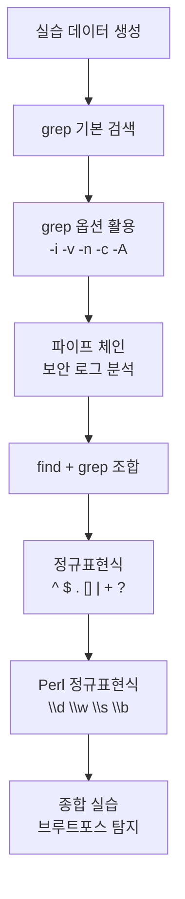

## 실습 개요

이론 강의에서 배운 내용을 직접 실행하며 결과를 확인함. 각 실습마다 **직접 결과를 확인할 수 있도록 예상 출력을 함께 제공**함.

> 터미널에서 직접 명령어를 실행하면서 따라오기 바람. 예상 출력과 다르면 명령어를 다시 확인할 것.
{: .prompt-info }

---

## 실습 환경 준비 — 실습 데이터 생성

모든 실습에 사용할 데이터를 먼저 만듦. 아래 명령어를 순서대로 실행할 것.

### 실습 디렉터리 생성

```bash
mkdir -p ~/linux_lab
cd ~/linux_lab
```

### 실습용 사용자 로그 파일 생성

```bash
cat > ~/linux_lab/users.txt << 'EOF'
user_id,username,email,department,role,login_count,last_login
1001,alice,alice@company.com,engineering,developer,142,2026-03-07
1002,bob,bob@company.com,marketing,manager,87,2026-03-06
1003,charlie,charlie@company.com,engineering,developer,231,2026-03-07
1004,diana,diana@company.com,hr,analyst,54,2026-03-05
1005,eve,eve@company.com,security,admin,312,2026-03-07
1006,frank,frank@company.com,engineering,developer,98,2026-03-04
1007,grace,grace@company.com,marketing,analyst,63,2026-03-07
1008,henry,henry@company.com,security,analyst,189,2026-03-06
1009,iris,iris@company.com,hr,manager,45,2026-03-03
1010,jack,jack@company.com,engineering,lead,277,2026-03-07
1011,karen,karen@company.com,security,admin,401,2026-03-07
1012,liam,liam@company.com,marketing,developer,112,2026-03-02
1013,mona,mona@company.com,engineering,developer,167,2026-03-07
1014,noah,noah@company.com,finance,analyst,78,2026-03-06
1015,olivia,olivia@company.com,finance,manager,93,2026-03-05
EOF
```

### 실습용 시스템 로그 파일 생성

```bash
cat > ~/linux_lab/system.log << 'EOF'
2026-03-07 08:00:01 INFO  sshd: Accepted password for alice from 192.168.1.101 port 52341
2026-03-07 08:01:15 INFO  sshd: Accepted password for bob from 192.168.1.102 port 52342
2026-03-07 08:05:22 ERROR nginx: connect() failed (111: Connection refused)
2026-03-07 08:10:33 WARNING disk: /dev/sda1 usage at 82%
2026-03-07 08:12:44 INFO  sshd: Accepted password for charlie from 10.0.0.5 port 52343
2026-03-07 08:15:01 ERROR mysql: Lost connection to MySQL server
2026-03-07 08:20:55 INFO  cron: Job completed: backup_daily
2026-03-07 08:25:11 WARNING memory: Available memory below 512MB threshold
2026-03-07 08:30:22 ERROR sshd: Failed password for invalid user hacker from 203.0.113.10 port 52399
2026-03-07 08:31:01 ERROR sshd: Failed password for invalid user admin from 203.0.113.10 port 52400
2026-03-07 08:31:45 ERROR sshd: Failed password for invalid user root from 203.0.113.10 port 52401
2026-03-07 08:32:10 ERROR sshd: Failed password for invalid user test from 203.0.113.10 port 52402
2026-03-07 08:35:00 INFO  firewall: Blocked 203.0.113.10 (brute force detected)
2026-03-07 09:00:01 INFO  sshd: Accepted password for diana from 192.168.1.104 port 52350
2026-03-07 09:05:33 WARNING nginx: High response time: 3.2s for /api/users
2026-03-07 09:10:15 INFO  sshd: Accepted password for eve from 192.168.1.105 port 52351
2026-03-07 09:15:22 ERROR postgres: FATAL: password authentication failed for user "dbadmin"
2026-03-07 09:20:44 INFO  cron: Job started: cleanup_temp
2026-03-07 09:25:11 WARNING disk: /dev/sdb2 usage at 91%
2026-03-07 09:30:00 CRITICAL disk: /dev/sdb2 usage at 95% - immediate action required
2026-03-07 09:35:22 INFO  sshd: Accepted password for frank from 192.168.1.106 port 52360
2026-03-07 10:00:01 INFO  backup: Daily backup completed successfully
2026-03-07 10:05:15 ERROR sshd: Failed password for invalid user guest from 198.51.100.20 port 52410
2026-03-07 10:06:01 ERROR sshd: Failed password for invalid user support from 198.51.100.20 port 52411
2026-03-07 10:30:00 INFO  sshd: Accepted password for grace from 192.168.1.107 port 52370
2026-03-07 11:00:00 INFO  sshd: Accepted password for henry from 192.168.1.108 port 52380
2026-03-07 11:05:33 WARNING cpu: Load average exceeded 4.0 for 5 minutes
EOF
```

### 실습용 설정 파일 생성

```bash
cat > ~/linux_lab/app.conf << 'EOF'
# Application Configuration File
# Last modified: 2026-03-07

[server]
host = 192.168.1.10
port = 8080
max_connections = 100
timeout = 30

[database]
host = db.company.com
port = 5432
name = appdb
user = appuser
# password = secret123   # Do not commit passwords

[logging]
level = INFO
file = /var/log/app.log
max_size = 50MB
rotation = daily

[security]
ssl_enabled = true
cert_file = /etc/ssl/certs/app.crt
key_file = /etc/ssl/private/app.key
allowed_ips = 192.168.1.0/24,10.0.0.0/8
EOF
```

### 실습용 단어 목록 생성

```bash
cat > ~/linux_lab/words.txt << 'EOF'
apple
application
apply
apt
banana
band
bandwidth
cat
category
concatenate
color
colour
colour
color
data
database
debug
error
Error
ERROR
warning
Warning
WARNING
critical
CRITICAL
EOF
```

**생성된 파일 확인:**

```bash
ls -lh ~/linux_lab/
```

**예상 출력 (크기는 환경마다 다를 수 있음):**
```
-rw-r--r-- 1 user user  486 Mar  7 14:00 app.conf
-rw-r--r-- 1 user user 2.2K Mar  7 14:00 system.log
-rw-r--r-- 1 user user  965 Mar  7 14:00 users.txt
-rw-r--r-- 1 user user  181 Mar  7 14:00 words.txt
```

---

# 1장 실습: 텍스트 처리 명령어

---

## Lab 1-1. grep 기본 검색

### 실습 1-1-1: 기본 문자열 검색

```bash
cd ~/linux_lab
grep "ERROR" system.log
```

**예상 출력:**
```
2026-03-07 08:05:22 ERROR nginx: connect() failed (111: Connection refused)
2026-03-07 08:15:01 ERROR mysql: Lost connection to MySQL server
2026-03-07 08:30:22 ERROR sshd: Failed password for invalid user hacker from 203.0.113.10 port 52399
2026-03-07 08:31:01 ERROR sshd: Failed password for invalid user admin from 203.0.113.10 port 52400
2026-03-07 08:31:45 ERROR sshd: Failed password for invalid user root from 203.0.113.10 port 52401
2026-03-07 08:32:10 ERROR sshd: Failed password for invalid user test from 203.0.113.10 port 52402
2026-03-07 09:15:22 ERROR postgres: FATAL: password authentication failed for user "dbadmin"
2026-03-07 10:05:15 ERROR sshd: Failed password for invalid user guest from 198.51.100.20 port 52410
2026-03-07 10:06:01 ERROR sshd: Failed password for invalid user support from 198.51.100.20 port 52411
```

---

### 실습 1-1-2: 대소문자 무시 검색 (-i)

```bash
grep -i "error" system.log | wc -l
```

**예상 출력:**
```
9
```

`-i` 옵션 없이 `grep "error"` 로는 소문자 error 만 검색되지만, `-i` 옵션으로 ERROR, Error, error 모두 매칭됨.

---

### 실습 1-1-3: 반전 검색 (-v) — 특정 패턴 제외

```bash
grep -v "^#" app.conf | grep -v "^$"
```

**예상 출력:**
```
[server]
host = 192.168.1.10
port = 8080
max_connections = 100
timeout = 30
[database]
host = db.company.com
port = 5432
name = appdb
user = appuser
[logging]
level = INFO
file = /var/log/app.log
max_size = 50MB
rotation = daily
[security]
ssl_enabled = true
cert_file = /etc/ssl/certs/app.crt
key_file = /etc/ssl/private/app.key
allowed_ips = 192.168.1.0/24,10.0.0.0/8
```

> 주석(`^#`)과 빈 줄(`^$`)을 제거하여 실제 설정 값만 출력함. 설정 파일 분석 시 자주 쓰는 패턴임.
{: .prompt-tip }

---

### 실습 1-1-4: 줄 번호와 함께 출력 (-n)

```bash
grep -n "WARNING" system.log
```

**예상 출력:**
```
4:2026-03-07 08:10:33 WARNING disk: /dev/sda1 usage at 82%
8:2026-03-07 08:25:11 WARNING memory: Available memory below 512MB threshold
15:2026-03-07 09:05:33 WARNING nginx: High response time: 3.2s for /api/users
19:2026-03-07 09:25:11 WARNING disk: /dev/sdb2 usage at 91%
27:2026-03-07 11:05:33 WARNING cpu: Load average exceeded 4.0 for 5 minutes
```

---

### 실습 1-1-5: 매칭 개수 세기 (-c)

```bash
grep -c "Accepted" system.log
grep -c "Failed" system.log
```

**예상 출력:**
```
8
6
```

로그인 성공(Accepted) 8회, 실패(Failed) 6회.

---

### 실습 1-1-6: 전후 문맥 출력 (-A)

```bash
grep -A 2 "203.0.113.10" system.log
```

**예상 출력:**
```
2026-03-07 08:30:22 ERROR sshd: Failed password for invalid user hacker from 203.0.113.10 port 52399
2026-03-07 08:31:01 ERROR sshd: Failed password for invalid user admin from 203.0.113.10 port 52400
2026-03-07 08:31:45 ERROR sshd: Failed password for invalid user root from 203.0.113.10 port 52401
2026-03-07 08:32:10 ERROR sshd: Failed password for invalid user test from 203.0.113.10 port 52402
2026-03-07 08:35:00 INFO  firewall: Blocked 203.0.113.10 (brute force detected)
```

> `-A 2` 는 매칭된 줄 이후 2줄을 더 출력함. 해당 IP가 4줄 연속으로 나오므로 결과가 이어지는 것처럼 보임.
{: .prompt-info }

---

## Lab 1-2. grep 파이프 조합

### 실습 1-2-1: 부서별 사용자 필터링

```bash
grep "engineering" users.txt
grep "engineering" users.txt | wc -l
```

**예상 출력:**
```
1001,alice,alice@company.com,engineering,developer,142,2026-03-07
1003,charlie,charlie@company.com,engineering,developer,231,2026-03-07
1006,frank,frank@company.com,engineering,developer,98,2026-03-04
1010,jack,jack@company.com,engineering,lead,277,2026-03-07
1013,mona,mona@company.com,engineering,developer,167,2026-03-07
5
```

---

### 실습 1-2-2: 파이프 체인으로 보안 이벤트 분석

```bash
grep "Failed password" system.log | grep -oE "[0-9]+\.[0-9]+\.[0-9]+\.[0-9]+" | sort | uniq -c | sort -nr
```

**예상 출력:**
```
      4 203.0.113.10
      2 198.51.100.20
```

`203.0.113.10` 에서 4번, `198.51.100.20` 에서 2번 로그인 실패 → 무차별 대입 공격(Brute Force) 용의자임.

---

### 실습 1-2-3: 로그 레벨별 이벤트 수 집계

```bash
grep -oE "(INFO|WARNING|ERROR|CRITICAL)" system.log | sort | uniq -c | sort -nr
```

**예상 출력:**
```
     12 INFO
      9 ERROR
      5 WARNING
      1 CRITICAL
```

---

## Lab 1-3. find 명령어

### 실습 1-3-1: 확장자로 파일 검색

```bash
find ~/linux_lab -name "*.txt"
find ~/linux_lab -name "*.log"
```

**예상 출력 (경로는 환경마다 다름):**
```
/root/linux_lab/words.txt
/root/linux_lab/users.txt
/root/linux_lab/system.log
```

---

### 실습 1-3-2: 크기와 시간으로 검색

```bash
find ~/linux_lab -size +1k     # 1KB 이상 파일
find ~/linux_lab -mtime 0      # 오늘 수정된 파일
```

---

### 실습 1-3-3: find + grep 조합

```bash
find ~/linux_lab -type f -name "*.log" -exec grep -l "ERROR" {} \;
```

**예상 출력:**
```
/root/linux_lab/system.log
```

---

## Lab 1-4. wc와 파이프

### 실습 1-4-1: 다양한 카운팅

```bash
wc users.txt
grep -v "user_id" users.txt | wc -l
grep "2026-03-07" users.txt | wc -l
```

**예상 출력:**
```
 16  16 965 users.txt
15
7
```

> `wc users.txt` 결과의 두 번째 숫자(단어 수)가 16인 이유: 각 줄이 쉼표로 구분되어 있어 공백 기준으로는 한 줄이 단어 1개로 카운트됨. `2026-03-07$` 접속자는 7명(alice, charlie, eve, grace, jack, karen, mona)임.
{: .prompt-info }

---

## Lab 1-5. tr 문자 변환

### 실습 1-5-1: 대소문자 변환

```bash
echo "Hello World Linux" | tr 'a-z' 'A-Z'
# 예상 출력: HELLO WORLD LINUX

echo "Hello World Linux" | tr 'A-Z' 'a-z'
# 예상 출력: hello world linux
```

---

### 실습 1-5-2: 문자 삭제와 치환

```bash
echo "user_id=1001, login_count=142" | tr -d '0-9'
# 예상 출력: user_id=, login_count=

echo "alice    bob    charlie" | tr -s ' '
# 예상 출력: alice bob charlie
```

---

### 실습 1-5-3: 사용자 목록 한 줄로 출력

```bash
grep -v "user_id" users.txt | cut -d, -f2 | tr '\n' ','
```

**예상 출력:**
```
alice,bob,charlie,diana,eve,frank,grace,henry,iris,jack,karen,liam,mona,noah,olivia,
```

> `tr '\n' ','` 는 줄바꿈을 쉼표로 변환함. 공백이 아닌 쉼표로 구분되어 출력됨.
{: .prompt-info }

---

## Lab 1-6. tar 아카이브

### 실습 1-6-1: 실습 디렉터리 백업

```bash
tar -czvf ~/linux_lab_backup.tar.gz ~/linux_lab/
ls -lh ~/linux_lab_backup.tar.gz
tar -tzvf ~/linux_lab_backup.tar.gz
```

**예상 출력 (내용 확인):**
```
drwxr-xr-x root/root         0 2026-03-07 14:00 root/linux_lab/
-rw-r--r-- root/root       181 2026-03-07 14:00 root/linux_lab/words.txt
-rw-r--r-- root/root       486 2026-03-07 14:00 root/linux_lab/app.conf
-rw-r--r-- root/root       965 2026-03-07 14:00 root/linux_lab/users.txt
-rw-r--r-- root/root      2241 2026-03-07 14:00 root/linux_lab/system.log
```

---

### 실습 1-6-2: 압축 해제

```bash
mkdir -p /tmp/restore_test
tar -xzvf ~/linux_lab_backup.tar.gz -C /tmp/restore_test
ls /tmp/restore_test/root/linux_lab/
```

---

## Lab 1-7. 리다이렉션 실습

### 실습 1-7-1: 보안 분석 보고서 파일로 저장

```bash
cd ~/linux_lab
echo "=== Security Analysis Report ===" > security_report.txt
echo "Date: $(date)" >> security_report.txt
echo "" >> security_report.txt
echo "[Login Success]" >> security_report.txt
grep "Accepted" system.log >> security_report.txt
echo "" >> security_report.txt
echo "[Login Failure]" >> security_report.txt
grep "Failed" system.log >> security_report.txt
echo "" >> security_report.txt
echo "[Critical Events]" >> security_report.txt
grep -i "critical\|blocked" system.log >> security_report.txt
cat security_report.txt
```

---

### 실습 1-7-2: stdout과 stderr 분리

```bash
find / -name "*.conf" > find_results.txt 2> find_errors.txt
wc -l find_results.txt find_errors.txt
```

**예상 출력 (환경에 따라 다름):**
```
 10 find_results.txt
  N find_errors.txt   ← 권한 없는 디렉터리 수만큼 에러 발생
```

---

# 2장 실습: 정규표현식

---

## Lab 2-1. 위치 앵커 ^ $

### 실습 2-1-1: 줄 시작 ^ 활용

```bash
cd ~/linux_lab
grep "^#" app.conf
grep -v "^#" app.conf | grep -v "^$" | grep -v "^\[" | head -10
```

**예상 출력 (주석 줄만):**
```
# Application Configuration File
# Last modified: 2026-03-07
# password = secret123   # Do not commit passwords
```

---

### 실습 2-1-2: 줄 끝 $ 활용

```bash
# CSV 마지막 필드(last_login)가 2026-03-07 인 줄
grep "2026-03-07$" users.txt
```

**예상 출력 (7명):**
```
1001,alice,alice@company.com,engineering,developer,142,2026-03-07
1003,charlie,charlie@company.com,engineering,developer,231,2026-03-07
1005,eve,eve@company.com,security,admin,312,2026-03-07
1007,grace,grace@company.com,marketing,analyst,63,2026-03-07
1010,jack,jack@company.com,engineering,lead,277,2026-03-07
1011,karen,karen@company.com,security,admin,401,2026-03-07
1013,mona,mona@company.com,engineering,developer,167,2026-03-07
```

> `$` 앵커는 **줄 끝**에 위치해야 매칭됨. `company.com$` 은 email 필드가 줄 끝이 아니라 중간 필드이므로 매칭이 안 됨. `2026-03-07$` 처럼 실제로 줄 끝에 오는 필드에 사용해야 함.
{: .prompt-warning }

---

## Lab 2-2. 임의 문자 .

### 실습 2-2-1: 점(.) 매칭

```bash
grep "c.t" words.txt
grep "192\.168\.[0-9]*\.[0-9]*" system.log | grep "Accepted"
```

**예상 출력 (내부 IP 로그인):**
```
2026-03-07 08:00:01 INFO  sshd: Accepted password for alice from 192.168.1.101 port 52341
2026-03-07 08:01:15 INFO  sshd: Accepted password for bob from 192.168.1.102 port 52342
2026-03-07 09:00:01 INFO  sshd: Accepted password for diana from 192.168.1.104 port 52350
2026-03-07 09:10:15 INFO  sshd: Accepted password for eve from 192.168.1.105 port 52351
2026-03-07 09:35:22 INFO  sshd: Accepted password for frank from 192.168.1.106 port 52360
2026-03-07 10:30:00 INFO  sshd: Accepted password for grace from 192.168.1.107 port 52370
2026-03-07 11:00:00 INFO  sshd: Accepted password for henry from 192.168.1.108 port 52380
```

---

## Lab 2-3. 문자 클래스 []

### 실습 2-3-1: 소문자만 이루어진 단어

```bash
grep "^[a-z]*$" words.txt
```

**예상 출력:**
```
apple
application
apply
apt
banana
band
bandwidth
cat
category
concatenate
color
colour
colour
color
data
database
debug
error
warning
critical
```

---

### 실습 2-3-2: login_count 3자리 이상 — 올바른 방법

```bash
# ❌ 잘못된 방법: user_id(1001~1015) 4자리 때문에 전부 매칭됨
grep "[0-9][0-9][0-9]" users.txt | grep -v "user_id"

# ✅ 올바른 방법: 쉼표로 3자리 이상 숫자를 감싸서 login_count 필드만 매칭
grep -E ",[0-9]{3,}," users.txt
```

**예상 출력 (올바른 방법, 8명):**
```
1001,alice,alice@company.com,engineering,developer,142,2026-03-07
1003,charlie,charlie@company.com,engineering,developer,231,2026-03-07
1005,eve,eve@company.com,security,admin,312,2026-03-07
1008,henry,henry@company.com,security,analyst,189,2026-03-06
1010,jack,jack@company.com,engineering,lead,277,2026-03-07
1011,karen,karen@company.com,security,admin,401,2026-03-07
1012,liam,liam@company.com,marketing,developer,112,2026-03-02
1013,mona,mona@company.com,engineering,developer,167,2026-03-07
```

> `[0-9][0-9][0-9]` 는 줄 어디서나 3자리 연속 숫자를 찾음. user_id 가 4자리 숫자이므로 모든 줄이 매칭됨. 필드를 특정하려면 쉼표 구분자를 활용해야 함.
{: .prompt-warning }

---

## Lab 2-4. 수량자와 ERE

### 실습 2-4-1: + 와 * 의 차이

```bash
grep -E "^app.+" words.txt
# 예상 출력: apple, application, apply (apt는 ^app 이 아님)

grep "^app" words.txt
# 예상 출력: apple, application, apply (apt는 a,p,t이므로 ^app 미매칭)
```

---

### 실습 2-4-2: OR 패턴 | 활용

```bash
grep -E "ERROR|CRITICAL" system.log
grep -iE "error|warning|critical" system.log | wc -l
```

**예상 출력 (wc -l):**
```
15
```

---

### 실습 2-4-3: 수량자 {n,m} 활용

```bash
grep -E ",[0-9]{3,}," users.txt    # login_count 3자리 이상 (8명)
grep -E ",[0-9]{4,}," users.txt    # login_count 4자리 이상 (없음)
```

**예상 출력 (3자리 이상, 8명):**
```
1001,alice,alice@company.com,engineering,developer,142,2026-03-07
1003,charlie,charlie@company.com,engineering,developer,231,2026-03-07
1005,eve,eve@company.com,security,admin,312,2026-03-07
1008,henry,henry@company.com,security,analyst,189,2026-03-06
1010,jack,jack@company.com,engineering,lead,277,2026-03-07
1011,karen,karen@company.com,security,admin,401,2026-03-07
1012,liam,liam@company.com,marketing,developer,112,2026-03-02
1013,mona,mona@company.com,engineering,developer,167,2026-03-07
```

---

## Lab 2-5. 단어 경계 \b

### 실습 2-5-1: 완전한 단어 매칭

```bash
grep -E "\bapply\b" words.txt   # 예상 출력: apply
grep -E "\bcat\b" words.txt     # 예상 출력: cat

grep "cat" words.txt
# 예상 출력: application, cat, category, concatenate (부분 매칭 포함)
```

---

## Lab 2-6. Perl 정규표현식 \d \w \s

### 실습 2-6-1: 이메일 추출

```bash
grep -oP "[a-z]+@[a-z]+\.[a-z]+" users.txt | head -5
```

**예상 출력:**
```
alice@company.com
bob@company.com
charlie@company.com
diana@company.com
eve@company.com
```

---

### 실습 2-6-2: 로그인 실패 IP 추출 (Failed password 줄만)

```bash
grep "Failed password" system.log | grep -oP "\d{1,3}\.\d{1,3}\.\d{1,3}\.\d{1,3}" | sort | uniq -c | sort -nr
```

**예상 출력:**
```
      4 203.0.113.10
      2 198.51.100.20
```

> `grep -oP` 로 전체 로그에서 IP를 추출하면 firewall 차단 로그의 IP도 포함되어 `203.0.113.10` 이 5개가 나옴. **반드시 `grep "Failed password"` 로 먼저 필터링**한 뒤 IP를 추출해야 정확한 공격 횟수를 집계할 수 있음.
{: .prompt-warning }

---

## Lab 2-7. 종합 실습 — 보안 로그 분석

### 실습 2-7-1: 브루트포스 공격 탐지

```bash
cd ~/linux_lab

echo "=== 브루트포스 공격 탐지 분석 ==="
echo ""
echo "--- 로그인 실패 IP 목록 ---"
grep "Failed password" system.log | grep -oP "\d{1,3}\.\d{1,3}\.\d{1,3}\.\d{1,3}" | sort | uniq -c | sort -nr

echo ""
echo "--- 3회 이상 실패한 IP (공격 의심) ---"
grep "Failed password" system.log | grep -oP "\d{1,3}\.\d{1,3}\.\d{1,3}\.\d{1,3}" | sort | uniq -c | sort -nr | awk '$1 >= 3'

echo ""
echo "--- 공격에 사용된 계정명 목록 ---"
grep "Failed password" system.log | grep -oP "invalid user \K\w+" | sort | uniq
```

**예상 출력:**
```
=== 브루트포스 공격 탐지 분석 ===

--- 로그인 실패 IP 목록 ---
      4 203.0.113.10
      2 198.51.100.20

--- 3회 이상 실패한 IP (공격 의심) ---
      4 203.0.113.10

--- 공격에 사용된 계정명 목록 ---
admin
guest
hacker
root
support
test
```

---

### 실습 2-7-2: 디스크 경고 이벤트 분석

```bash
grep -iE "disk.*(warning|critical)" system.log
grep -oP "/dev/\w+ usage at \d+%" system.log
```

**예상 출력:**
```
2026-03-07 08:10:33 WARNING disk: /dev/sda1 usage at 82%
2026-03-07 09:25:11 WARNING disk: /dev/sdb2 usage at 91%
2026-03-07 09:30:00 CRITICAL disk: /dev/sdb2 usage at 95% - immediate action required

/dev/sda1 usage at 82%
/dev/sdb2 usage at 91%
/dev/sdb2 usage at 95%
```

---

### 실습 2-7-3: 오늘 로그인 성공한 사용자 목록

```bash
grep "Accepted" system.log | grep -oP "Accepted password for \K\w+"
```

**예상 출력:**
```
alice
bob
charlie
diana
eve
frank
grace
henry
```

---

## Lab 2-8. 정규표현식 연습 — words.txt 필터링

```bash
cd ~/linux_lab

echo "1. 'app' 으로 시작하는 단어:"
grep "^app" words.txt
# 출력: apple, application, apply, apt

echo ""
echo "2. 'a' 로 시작하고 'e' 로 끝나는 단어:"
grep -E "^a.*e$" words.txt
# 출력: apple

echo ""
echo "3. 6글자 이상인 단어:"
grep -E "^.{6,}$" words.txt
# 출력: application, banana, bandwidth, category, concatenate, colour, colour, database, warning, Warning, WARNING, critical, CRITICAL

echo ""
echo "4. 대문자가 포함된 단어:"
grep "[A-Z]" words.txt
# 출력: Error, ERROR, Warning, WARNING, CRITICAL

echo ""
echo "5. 중복 제거 후 정렬:"
sort words.txt | uniq
```

---

## 실습 마무리 — 정리



| 명령어 | 핵심 용도 | 주요 옵션 |
|---|---|---|
| `grep` | 패턴 검색 | `-i -v -n -c -E -P -A -B` |
| `find` | 파일 검색 | `-name -type -size -mtime -exec` |
| `wc` | 줄/단어/바이트 수 | `-l -w -c` |
| `tr` | 문자 변환 | `-d -s -c` |
| `tar` | 아카이브 | `-czvf -xzvf -tzvf` |
| `\|` 파이프 | 명령 연결 | — |
| `> >>` 리다이렉션 | 파일 저장 | — |

> 모든 실습을 완료한 후 `rm -rf ~/linux_lab_backup.tar.gz /tmp/restore_test` 명령으로 임시 파일을 정리할 것.
{: .prompt-info }
