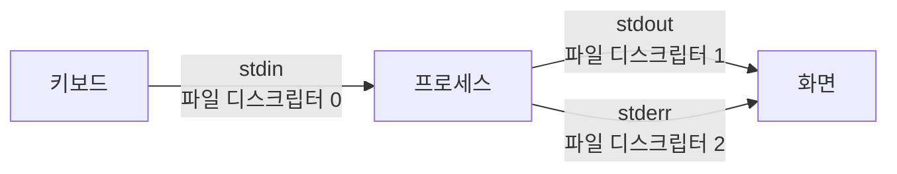
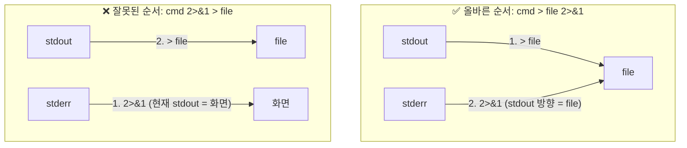
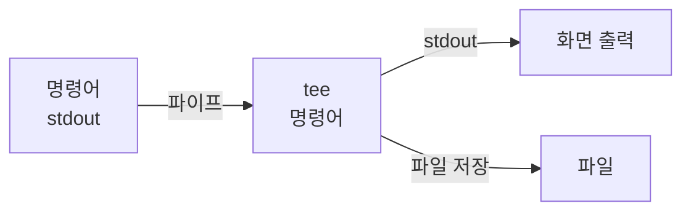
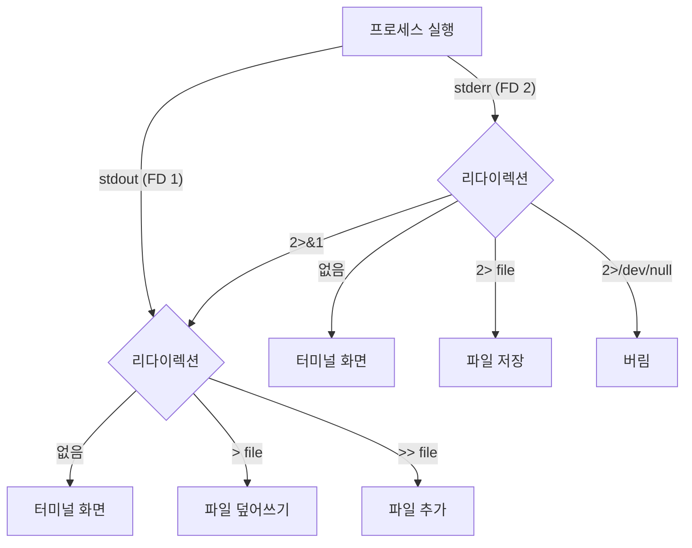

## 학습 목표

리다이렉션은 단순히 `>` 로 파일에 저장하는 것을 넘어, **표준 스트림의 흐름을 자유자재로 제어**하는 기술임. `2>&1` 이 왜 필요한지, 순서가 왜 중요한지를 이해하는 것이 핵심임.

---

## 1. 표준 스트림(Standard Stream) 이해

### 1.1 세 가지 표준 스트림

리눅스의 모든 프로세스는 시작할 때 **세 가지 표준 스트림**을 자동으로 부여받음.



| 스트림 이름 | 영문 | 파일 디스크립터 (FD) | 기본 연결 |
|---|---|---|---|
| 표준 입력 | stdin (Standard Input) | **0** | 키보드 |
| 표준 출력 | stdout (Standard Output) | **1** | 터미널 화면 |
| 표준 에러 | stderr (Standard Error) | **2** | 터미널 화면 |

**파일 디스크립터(File Descriptor, FD)** 는 리눅스가 열린 파일/스트림을 관리하는 정수 번호임. `2>&1` 에서 `2` 는 stderr, `1` 은 stdout을 가리키는 FD 번호임.

> stdout 과 stderr 는 둘 다 기본적으로 화면에 출력되지만, **별개의 스트림**임. 리다이렉션으로 각각 다른 곳으로 보낼 수 있음.
{: .prompt-info }

---

### 1.2 stdout과 stderr 구분 확인

```bash
# 정상 출력 → stdout
ls /etc/passwd
# 출력: /etc/passwd  (stdout, FD 1)

# 에러 출력 → stderr
ls /존재하지않는경로
# 출력: ls: cannot access ...: No such file or directory  (stderr, FD 2)

# 두 가지가 섞일 때
ls /etc/passwd /존재하지않는경로
# stdout: /etc/passwd
# stderr: ls: cannot access ...: No such file or directory
# → 화면에 두 줄 모두 표시되지만, 실제로는 다른 스트림임
```

---

## 2. 출력 리다이렉션 > 와 >>

### 2.1 > 덮어쓰기

```bash
ls -l > filelist.txt       # stdout → 파일 (기존 내용 삭제 후 새로 씀)
date > timestamp.txt       # 날짜를 저장
> empty.txt                # 빈 파일 생성 또는 기존 파일 비우기
```

### 2.2 >> 추가 (Append)

```bash
date >> log.txt            # 기존 log.txt 내용 뒤에 날짜 추가
echo "작업 완료" >> log.txt

# 여러 명령 결과를 하나의 파일에 누적
echo "=== System Report ===" > report.txt
date >> report.txt
uname -a >> report.txt
df -h >> report.txt
```

> `>` 와 `>>` 의 차이가 매우 중요함. `>` 는 파일 내용을 **완전히 지우고** 새로 씀. 실수로 중요한 파일에 `>` 를 쓰면 내용이 사라짐.
{: .prompt-danger }

---

## 3. 입력 리다이렉션 <

```bash
sort < names.txt           # names.txt 내용 → sort 의 stdin
wc -l < /etc/passwd        # 줄 수 계산

# 아래 세 가지는 동일한 결과
wc -l /etc/passwd          # 파일명 인자 방식
cat /etc/passwd | wc -l    # 파이프 방식
wc -l < /etc/passwd        # 입력 리다이렉션 방식
```

---

## 4. 표준 에러 리다이렉션 2>

### 4.1 stderr를 파일로 저장

```bash
find / -name "*.conf" 2> errors.txt
# → stdout(검색 결과)은 화면에, stderr(권한 없음 등)는 errors.txt 에 저장

# 에러 파일 확인
cat errors.txt
# 출력: find: '/proc/tty/driver': Permission denied
#        find: '/root': Permission denied  ... (등)
```

### 4.2 /dev/null — 블랙홀

`/dev/null` 은 **쓰는 데이터는 모두 버려지고, 읽으면 항상 빈 내용**이 나오는 특수 파일임.

```bash
find / -name "*.conf" 2>/dev/null
# → 에러 메시지 없이 결과만 깔끔하게 출력

# 완전 침묵
command > /dev/null 2>/dev/null   # stdout, stderr 모두 버림
command &> /dev/null               # 위와 동일한 효과 (단축 표기)
```

---

## 5. stdout과 stderr 합치기 — 2>&1

### 5.1 왜 2>&1 이 필요한가

파이프(`|`)는 **stdout(FD 1)만 전달**함. stderr(FD 2)는 파이프를 통과하지 않고 화면에 직접 출력됨.

```bash
# stderr 가 파이프를 통과하지 않는 예
find / -name "*.sh" | grep -v "Permission denied"
# → 검색 결과(stdout)는 필터링되지만,
#   "Permission denied" 에러(stderr)는 화면에 그대로 출력됨

# stderr 도 파이프에 포함시키려면
find / -name "*.sh" 2>&1 | grep -v "Permission denied"
# → stdout + stderr 합쳐서 파이프로 전달, 모두 필터링됨
```

### 5.2 2>&1 구조 분석

```
command > output.txt 2>&1
          ──────────  ────
          stdout →    stderr → (stdout 이 향하는 곳, 즉 output.txt)
          output.txt
```

`2>&1` 은 **"FD 2(stderr)를 FD 1(stdout)이 현재 향하는 곳과 동일하게 연결"** 하는 의미임. `&` 없이 `2>1` 로 쓰면 숫자 `1` 이라는 이름의 파일로 저장됨.

```bash
# stdout + stderr 모두 같은 파일에 저장
ls /etc/passwd /존재하지않는경로 > output.txt 2>&1
cat output.txt
# 출력:
# ls: cannot access '/존재하지않는경로': No such file or directory
# /etc/passwd
```

---

### 5.3 순서가 중요함 — 흔한 실수

`>` 와 `2>&1` 의 순서를 바꾸면 의도와 다른 결과가 나옴.

```bash
# ✅ 올바른 순서: > file 먼저, 2>&1 나중
ls /존재하지않는경로 > output.txt 2>&1
# 처리 순서:
# 1) stdout → output.txt (파일로 연결)
# 2) stderr → stdout 이 향하는 곳 (= output.txt)
# 결과: stdout + stderr 모두 output.txt 에 저장

# ❌ 잘못된 순서: 2>&1 먼저, > file 나중
ls /존재하지않는경로 2>&1 > output.txt
# 처리 순서:
# 1) stderr → 현재 stdout 이 향하는 곳 (= 아직 화면)
# 2) stdout → output.txt (파일로 연결)
# 결과: stderr 는 화면에 출력, stdout 만 output.txt 에 저장됨
```



> 리눅스 리다이렉션은 **왼쪽에서 오른쪽으로 순서대로 처리**됨. 이 원칙을 이해하면 어떤 순서가 맞는지 헷갈리지 않음.
{: .prompt-warning }

---

## 6. stdout + stderr 동시 저장 — &>

`&>` 는 Bash에서 제공하는 단축 표기로, `> file 2>&1` 과 완전히 동일함.

```bash
# 아래 두 명령은 동일한 결과
ls /존재하지않는경로 > output.txt 2>&1
ls /존재하지않는경로 &> output.txt

# 추가 모드
ls /존재하지않는경로 &>> output.txt    # stdout + stderr 추가
```

> `&>` 는 Bash 전용임. `/bin/sh` 로 실행하는 스크립트에서는 사용할 수 없으므로 이식성이 필요하면 `> file 2>&1` 형식을 사용할 것.
{: .prompt-warning }

---

## 7. Here Document와 Here String

### 7.1 Here Document (<<)

**셸에서 직접 여러 줄의 텍스트를 프로세스의 stdin 으로 입력**하는 방법임.

```bash
# 형식: 명령어 << 종료태그
cat << EOF
첫 번째 줄
두 번째 줄
세 번째 줄
EOF
# 출력:
# 첫 번째 줄
# 두 번째 줄
# 세 번째 줄

# 파일 작성에 활용
cat > config.txt << EOF
[server]
host = 192.168.1.10
port = 8080
EOF

# 변수 치환 포함
NAME="Alice"
cat << EOF
안녕하세요, $NAME 님.
오늘 날짜: $(date +%Y-%m-%d)
EOF
```

### 7.2 Here String (<<<)

**한 줄 문자열을 stdin 으로 전달**하는 방법임.

```bash
# 형식: 명령어 <<< "문자열"
wc -w <<< "hello world linux"
# 출력: 3  (단어 3개)

grep "linux" <<< "hello world linux"
# 출력: hello world linux

# 변수 내용을 stdin 으로 전달
TEXT="리눅스 텍스트 처리"
wc -c <<< "$TEXT"
```

---

## 8. tee — 화면과 파일 동시 출력

`tee` 는 **stdin 으로 받은 내용을 파일에 저장하면서 동시에 stdout 으로도 출력**하는 명령어임. T자 파이프(분기)에서 이름을 따옴.

```bash
ls -l | tee filelist.txt          # 화면에 출력 + filelist.txt 에도 저장
ls -l | tee -a filelist.txt       # 화면에 출력 + filelist.txt 에 추가

# 로그를 화면으로 보면서 파일에도 저장
tail -f /var/log/syslog | tee -a monitor.log

# 빌드 결과 화면+파일 동시 저장
make 2>&1 | tee build.log
```



---

## 9. 리다이렉션 전체 구조 요약



**연산자 전체 정리:**

| 연산자 | FD | 의미 | 예시 |
|---|---|---|---|
| `>` | 1 | stdout → 파일 (덮어쓰기) | `cmd > out.txt` |
| `>>` | 1 | stdout → 파일 (추가) | `cmd >> out.txt` |
| `<` | 0 | 파일 → stdin | `cmd < in.txt` |
| `<<` | 0 | 여러 줄 문자열 → stdin | `cmd << EOF` |
| `<<<` | 0 | 한 줄 문자열 → stdin | `cmd <<< "text"` |
| `2>` | 2 | stderr → 파일 | `cmd 2> err.txt` |
| `2>>` | 2 | stderr → 파일 (추가) | `cmd 2>> err.txt` |
| `2>/dev/null` | 2 | stderr 버리기 | `cmd 2>/dev/null` |
| `2>&1` | 2→1 | stderr → stdout 방향 | `cmd > out.txt 2>&1` |
| `&>` | 1+2 | stdout+stderr → 파일 | `cmd &> out.txt` |
| `&>>` | 1+2 | stdout+stderr → 파일 (추가) | `cmd &>> out.txt` |

---

## 10. 실전 패턴 모음

```bash
# 패턴 1: 결과는 저장, 에러는 버리기
find / -name "passwd" > results.txt 2>/dev/null

# 패턴 2: 결과와 에러를 각각 다른 파일에 저장
./script.sh > output.txt 2> errors.txt

# 패턴 3: 결과와 에러 모두 같은 파일에 저장
make > build.log 2>&1
make &> build.log   # 위와 동일 (단축 표기)

# 패턴 4: 화면에 보이면서 파일에도 저장 (tee 활용)
make 2>&1 | tee build.log

# 패턴 5: 파이프에 stderr 포함시켜 필터링
find / -name "*.log" 2>&1 | grep -v "Permission denied"

# 패턴 6: cron 완전 침묵 모드 (불필요한 메일 방지)
/usr/local/bin/backup.sh &> /dev/null

# 패턴 7: 에러만 수집하면서 결과는 다음 명령으로 전달
find /etc -name "*.conf" 2>> find_errors.log | xargs grep "port"

# 패턴 8: 로그 실시간 모니터링 + 파일 저장
tail -f /var/log/auth.log 2>&1 | tee -a auth_monitor.log | grep "Failed"
```

> 실무에서 가장 자주 쓰는 패턴은 **패턴 1** (에러 무시), **패턴 3** (전체 로그 저장), **패턴 5** (파이프+에러 필터링) 임. 이 세 가지는 반드시 익혀둘 것.
{: .prompt-tip }

---

## 11. 실습 — 직접 결과 확인

```bash
# 실습 준비
mkdir -p ~/redirect_lab
cd ~/redirect_lab

# 실습 1: stdout vs stderr 구분
ls /etc/passwd /없는파일 > stdout.txt 2> stderr.txt
echo "=== stdout ===" && cat stdout.txt
echo "=== stderr ===" && cat stderr.txt
# 예상: stdout.txt 에는 /etc/passwd, stderr.txt 에는 에러

# 실습 2: 2>&1 올바른 순서
ls /etc/passwd /없는파일 > both_correct.txt 2>&1
cat both_correct.txt
# 예상: 에러 + 결과 모두 저장됨

# 실습 3: 2>&1 잘못된 순서 (차이 확인!)
ls /etc/passwd /없는파일 2>&1 > both_wrong.txt
cat both_wrong.txt
# 예상: stdout 만 파일에, stderr 는 화면에 출력됨

# 실습 4: /dev/null 로 에러 숨기기
find / -name "sshd_config" 2>/dev/null
# 예상: 에러 없이 결과만 깔끔하게 출력

# 실습 5: tee 로 화면+파일 동시 출력
df -h | tee disk_status.txt
echo "파일에도 저장됨:" && cat disk_status.txt
```
