## 강의 개요

리눅스 시스템의 핵심은 **프로세스(Process)**임. 모든 프로그램은 실행 순간 프로세스가 되고, 커널은 이 프로세스들을 스케줄링·시그널·IPC로 제어함. 이번 주차는 프로세스의 탄생부터 종료까지 전 과정을 다룸.


---

# 1. 컴퓨터의 작동 원리와 프로세스

---

## 1.1 컴퓨터 구성 요소

리눅스를 제대로 이해하려면 **하드웨어가 어떻게 동작하는지**부터 알아야 함. 운영체제는 하드웨어 위에서 작동하며, 그 중심에 프로세스가 있기 때문임.

| 구성 요소 | 설명 | 특징 |
|---|---|---|
| CPU (Central Processing Unit) | 프로그램 명령어를 해석·실행하는 두뇌 | 연산 속도 최고, 직접 데이터 저장 불가 |
| 레지스터 (Register) | CPU 내부의 초고속 소형 메모리 | 바이트~수십 바이트, 처리 중 임시 저장 |
| RAM (Random Access Memory) | 실행 중인 프로그램 코드와 데이터 저장 | 휘발성(전원 끊기면 소멸) |
| 저장 장치 (HDD/SSD) | 프로그램과 데이터를 영구 저장 | 비휘발성, RAM보다 속도 느림 |
| 시스템 버스 (System Bus) | 구성 요소 간 데이터 교환 통로 | 데이터 버스, 주소 버스, 제어 버스 |

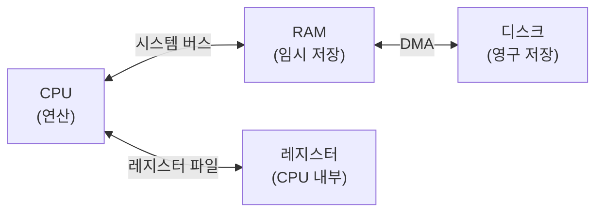

> CPU는 RAM에서 명령어를 읽어 레지스터에 올려 연산하고, 결과를 다시 RAM에 씀. 디스크는 직접 CPU와 통신하지 않음.
{: .prompt-info }

---

## 1.2 프로그램과 프로세스의 차이

- **프로그램(Program)**: 디스크에 저장된 실행 파일 (ex: `/bin/bash`, `ls`)
- **프로세스(Process)**: 프로그램이 메모리에 로드되어 실행 중인 인스턴스

같은 프로그램을 두 번 실행하면 **두 개의 독립된 프로세스**가 만들어짐. 각각 고유한 PID(Process ID)를 가짐.

```bash
# 확인 예시
ls /bin/bash          # 디스크 위의 프로그램 파일
ps aux | grep bash    # 메모리에서 실행 중인 프로세스
```

---

# 2. 프로세스의 계층 구조

---

## 2.1 부모-자식 프로세스 관계

리눅스의 모든 프로세스는 **트리(Tree) 구조**로 관리됨. 어떤 프로세스도 홀로 태어날 수 없으며, 반드시 **부모 프로세스(Parent Process)**가 **fork()** 시스템 콜을 통해 **자식 프로세스(Child Process)**를 생성함.

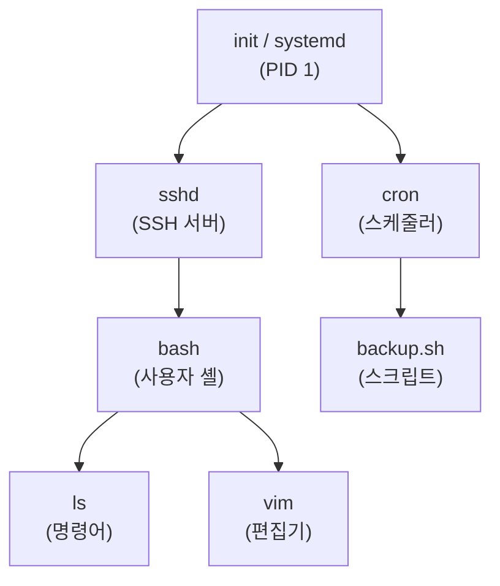

> `pstree` 명령어로 실제 트리 구조를 시각적으로 확인할 수 있음. `pstree -p` 로 PID도 함께 볼 수 있음.
{: .prompt-tip }

---

## 2.2 init / systemd 프로세스

**init 프로세스**는 리눅스 커널이 부팅 완료 후 가장 먼저 실행하는 최초의 프로세스임. 항상 **PID 1**을 가짐.

현대 리눅스(우분투 15.04+, RHEL 7+)에서는 `init` 대신 **systemd**가 PID 1 역할을 담당함.

| 항목 | init | systemd |
|---|---|---|
| PID | 1 | 1 |
| 부팅 방식 | 직렬(순차) 시작 | 병렬(동시) 시작 |
| 로그 관리 | syslog 의존 | journald 내장 |
| 자원 관리 | 기능 제한 | cgroups 통합 |

```bash
ps -p 1                  # PID 1 확인
readlink /proc/1/exe     # init 또는 systemd 확인
```

---

## 2.3 fork와 exec — 프로세스 생성 메커니즘

새 프로세스가 만들어지는 과정은 두 단계임.

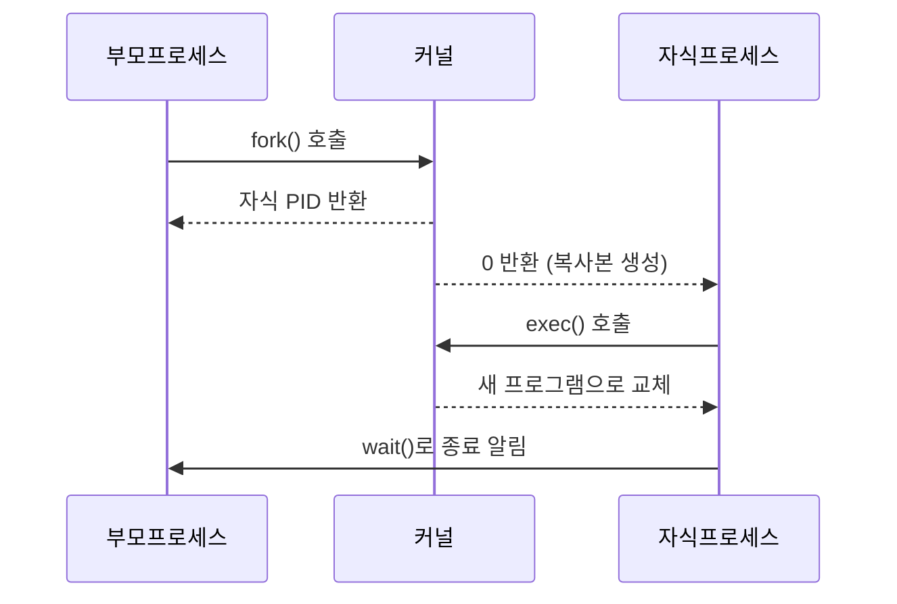

- **fork()**: 부모 프로세스의 메모리·파일 디스크립터를 그대로 복사해 자식 생성
- **exec()**: 현재 프로세스 이미지를 새 프로그램으로 교체(메모리 내용 덮어씀)

> `fork()`는 부모에게 자식의 PID를 반환하고, 자식에게는 **0**을 반환함. 이 반환값으로 부모와 자식이 서로 다른 코드를 실행할 수 있음.
{: .prompt-info }

---

## 2.4 좀비 프로세스와 고아 프로세스

### 좀비 프로세스 (Zombie Process)

자식 프로세스가 종료되었지만 부모 프로세스가 종료 상태를 회수(`wait()`)하지 않은 상태. **PID와 프로세스 테이블 항목이 아직 남아 있음**. `ps` 결과의 STAT에 **Z**로 표시됨.

### 고아 프로세스 (Orphan Process)

부모 프로세스가 자식보다 먼저 종료된 경우. 이때 커널이 자동으로 **init(PID 1)**을 새 부모로 재할당(re-parent)함.

| 상태 | 원인 | 결과 |
|---|---|---|
| 좀비 | 부모가 wait() 미호출 | PID 낭비, 테이블 점유 |
| 고아 | 부모가 먼저 종료 | init이 입양, 일반적으로 무해 |

```bash
# 좀비 프로세스 확인
ps aux | grep Z
ps -eo stat,ppid,pid,cmd | grep Z
```

---

## 2.5 ps 명령어 — 프로세스 목록 확인

`ps`(Process Status)는 현재 실행 중인 프로세스 정보를 출력하는 명령어임.

```bash
ps            # 현재 터미널의 프로세스만
ps aux        # 모든 프로세스 (BSD 스타일, 가장 많이 사용)
ps -ef        # 모든 프로세스 (UNIX 스타일)
ps -eLf       # 스레드 포함
ps --forest   # 트리 형태로 출력
```

**ps aux 주요 필드:**

| 필드 | 설명 |
|---|---|
| USER | 프로세스 소유자 |
| PID | 프로세스 ID |
| %CPU | CPU 사용률 |
| %MEM | 메모리 사용률 |
| VSZ | 가상 메모리 크기 (KB) |
| RSS | 실제 사용 메모리 (KB) |
| STAT | 프로세스 상태 |
| START | 시작 시각 |
| COMMAND | 실행 명령 |

**STAT 코드:**

| 코드 | 의미 |
|---|---|
| R | 실행 중 또는 실행 대기 (Running/Runnable) |
| S | 인터럽트 가능한 수면 상태 (Sleeping) |
| D | 인터럽트 불가 수면 (Disk I/O 대기 등) |
| T | 중단 상태 (SIGSTOP 수신) |
| **Z** | **좀비 프로세스** |
| X | 종료 완료 (거의 볼 수 없음) |

> 시험에서 좀비 프로세스 STAT 코드 **Z**는 반드시 암기해야 함.
{: .prompt-warning }

---

## 2.6 pstree / top 명령어

```bash
pstree          # 프로세스 트리 출력
pstree -p       # PID 포함
pstree -u       # 사용자 포함

top             # 실시간 프로세스 모니터링
top -d 2        # 2초 간격으로 갱신
```

`top` 실행 중 단축키:
- `k` : 프로세스 종료 (PID 입력)
- `r` : nice 값 변경 (renice)
- `q` : 종료
- `M` : 메모리 사용률 순 정렬
- `P` : CPU 사용률 순 정렬

---

# 3. 프로세스의 작동

---

## 3.1 프로세스 생애 주기

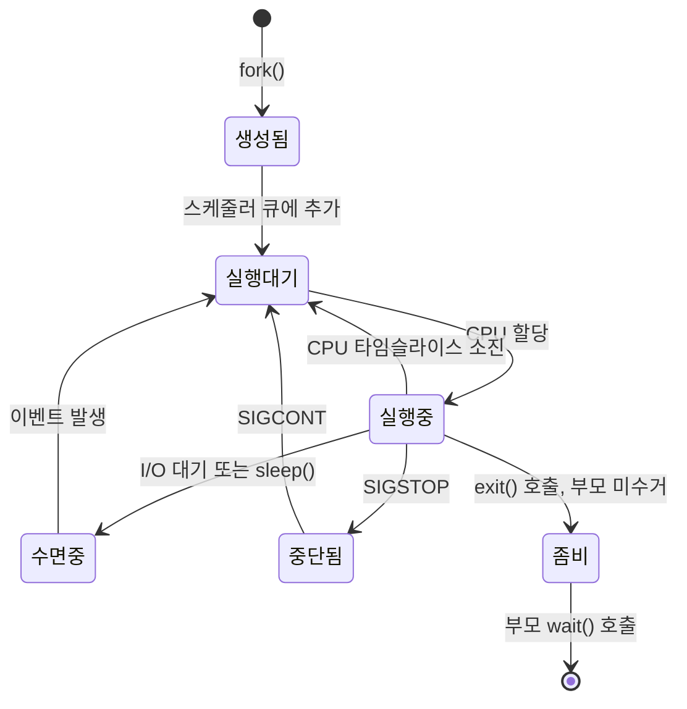

**프로세스 상태 4가지:**

1. **실행/실행 대기 상태 (Running/Runnable)**: CPU 처리 중이거나 대기 중
2. **중단 상태 (Stopped)**: SIGSTOP 시그널로 일시 정지
3. **종료 상태 (Terminated)**: exit() 호출로 종료
4. **수면 상태 (Sleep)**: 이벤트를 기다리는 상태

---

## 3.2 프로세스 스케줄링

**프로세스 스케줄링(Process Scheduling)**은 여러 프로세스 중 CPU가 다음에 실행할 프로세스를 결정하는 메커니즘임. 리눅스에서는 **CFS(Completely Fair Scheduler)**를 기본 스케줄러로 사용함.

스케줄링 알고리즘이 갖춰야 할 속성:
- **공평성**: 모든 프로세스가 공평하게 CPU를 사용
- **우선순위**: 설정된 우선순위대로 스케줄링
- **효율성**: 시스템 자원을 낭비 없이 사용
- **응답 시간**: 사용자 요청에 대한 응답 시간 최소화

---

## 3.3 컨텍스트 스위칭

**컨텍스트 스위칭(Context Switching, 문맥 교환)**은 CPU가 현재 실행 중인 프로세스를 교체하는 과정임.

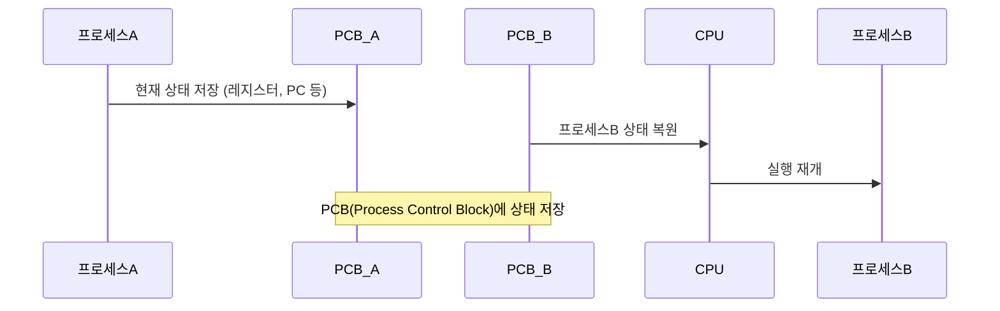

**PCB(Process Control Block)**에 저장되는 정보:
- 프로세스 상태 (R/S/D/T/Z)
- 프로그램 카운터 (다음 실행할 명령어 주소)
- 레지스터 값들
- 메모리 관리 정보
- 파일 디스크립터 테이블

---

## 3.4 프로세스 우선순위 — nice와 renice

리눅스에서 프로세스 우선순위는 **NI 값(Nice Value)**으로 조정함.

- NI 값 범위: **-20 ~ 19**
- **값이 낮을수록 우선순위가 높음** (-20이 최고, 19가 최저)
- 일반 사용자는 NI 값을 **올리는 것(우선순위 낮추기)만** 가능
- root만 NI 값을 **내릴 수(우선순위 높이기)** 있음

```bash
# nice: 시작 시 우선순위 지정
nice -n 10 ./backup.sh          # NI=10으로 시작
nice -n -5 ./critical.sh        # NI=-5 (root만 가능)

# renice: 실행 중인 프로세스 우선순위 변경
renice 10 1222                  # PID 1222의 NI를 10으로 변경
renice -5 -u www-data           # www-data 사용자의 모든 프로세스 변경
```

> `nice` 는 새 프로세스 실행 시, `renice` 는 이미 실행 중인 프로세스의 우선순위를 변경할 때 사용함. 시험에서 혼동하기 쉬운 부분임.
{: .prompt-warning }

---

## 3.5 스레드

**스레드(Thread)**는 프로세스의 가장 작은 실행 단위임.

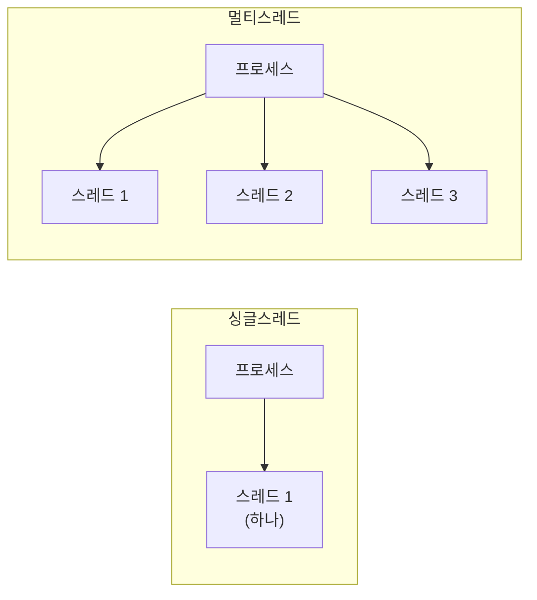

| 구분 | 프로세스 | 스레드 |
|---|---|---|
| 메모리 | 독립된 메모리 공간 | 프로세스 메모리 공유 |
| 생성 비용 | 높음 (fork 필요) | 낮음 |
| 통신 | IPC 필요 | 공유 메모리로 바로 통신 |
| 오류 격리 | 프로세스끼리 격리됨 | 한 스레드 오류가 전체에 영향 |

---

# 4. 파일 디스크립터와 표준 스트림

---

## 4.1 파일 디스크립터

**파일 디스크립터(File Descriptor, FD)**는 프로세스가 파일, 소켓, 파이프 등을 추상화하여 접근하는 정수 번호임. 리눅스에서 "모든 것은 파일이다"라는 철학을 구현하는 핵심 개념임.

프로세스가 파일을 열면 커널이 번호를 부여하고, 그 번호로 읽기/쓰기 작업을 수행함.

---

## 4.2 표준 스트림 (Standard Stream)

모든 프로세스는 시작 시 자동으로 세 개의 표준 스트림을 열고 시작함.

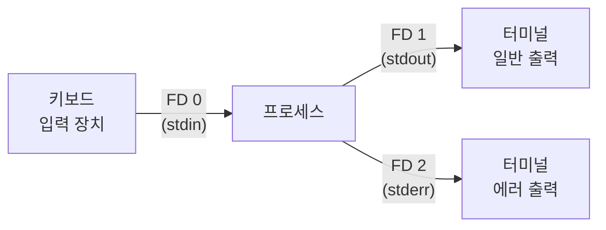

| 스트림 | FD 번호 | 방향 | 기본 연결 |
|---|---|---|---|
| 표준 입력 (stdin) | **0** | 입력만 | 키보드 |
| 표준 출력 (stdout) | **1** | 출력만 | 터미널 |
| 표준 에러 (stderr) | **2** | 출력만 | 터미널 |

```bash
# 리다이렉션으로 스트림 변경
grep "error" app.log > found.txt        # stdout → 파일
find / -name "*.sh" 2>/dev/null         # stderr 버리기
find / -name "*.sh" 2>&1 | grep home   # stderr를 stdout과 합침
```

> FD 번호 0, 1, 2는 시험 단골 출제 항목임. stdin=0, stdout=1, stderr=2를 반드시 암기해야 함.
{: .prompt-warning }

---

# 5. 포어그라운드와 백그라운드 프로세스

---

## 5.1 개념 구분

| 구분 | 포어그라운드 (Foreground) | 백그라운드 (Background) |
|---|---|---|
| 화면 | 현재 터미널을 점유 | 터미널 점유 없음 |
| 입력 | 사용자 입력 가능 | 사용자 입력 없이 동작 |
| 예시 | `vim`, `ping` 실행 중 | 데몬, 배치 작업 |

```bash
# 포어그라운드 실행 (기본)
ping google.com

# 백그라운드 실행 (& 붙이기)
ping google.com &

# 실행 중인 포어그라운드를 백그라운드로 전환
# Ctrl+Z (SIGSTOP) → bg %번호
ping google.com        # 실행
[Ctrl+Z]               # 중단
bg %1                  # 백그라운드 재개

# 백그라운드를 포어그라운드로 전환
fg %1
```

**주요 키 조합:**

| 키 조합 | 동작 | 관련 시그널 |
|---|---|---|
| `Ctrl+C` | 포어그라운드 프로세스 **종료** | SIGINT (2) |
| `Ctrl+Z` | 포어그라운드 프로세스 **일시 중지** | SIGTSTP (20) |
| `Ctrl+D` | EOF 전송 (입력 종료) | — |

> `Ctrl+Z`는 종료가 아니라 **일시 중지**임. 종료는 `Ctrl+C`. 시험에서 자주 혼동하는 포인트임.
{: .prompt-danger }

---

## 5.2 jobs 명령어

```bash
jobs            # 현재 셸 세션의 백그라운드 작업 목록
jobs -l         # PID 포함 출력
jobs -s         # 중단(Stopped) 상태만
jobs -r         # 실행(Running) 상태만
```

```
[1]-  Running   ping google.com &
[2]+  Stopped   vim test.txt
```

- `+` : 가장 최근에 접근한 작업 (fg/bg 명령의 기본 대상)
- `-` : 두 번째로 최근에 접근한 작업

---

## 5.3 nohup — 세션 종료 후에도 실행 유지

`nohup`(No Hang Up)은 SSH 세션이 끊겨도 프로세스가 계속 실행되도록 하는 명령어임. 터미널이 닫히면 SIGHUP 시그널이 전송되는데, nohup은 이를 무시함.

```bash
nohup ./long_script.sh &         # 백그라운드 + 세션 종료 후에도 실행
nohup ./long_script.sh > out.txt 2>&1 &  # 출력도 파일로 저장
```

---

## 5.4 ping 명령어

`ping`은 **네트워크 연결 상태를 확인**하는 명령어임. ICMP(Internet Control Message Protocol) 에코 요청/응답을 이용함.

```bash
ping 8.8.8.8            # Google DNS 서버에 ping
ping -c 4 8.8.8.8       # 4번만 전송
ping -i 2 8.8.8.8       # 2초 간격으로 전송
ping -s 1000 8.8.8.8    # 패킷 크기 1000바이트
```

---

# 6. IPC (프로세스 간 통신)

---

## 6.1 IPC란

**IPC(Inter-Process Communication)**는 독립적인 프로세스들이 데이터를 교환하는 메커니즘임. 프로세스는 기본적으로 서로의 메모리에 접근할 수 없으므로, 별도의 통신 방법이 필요함.

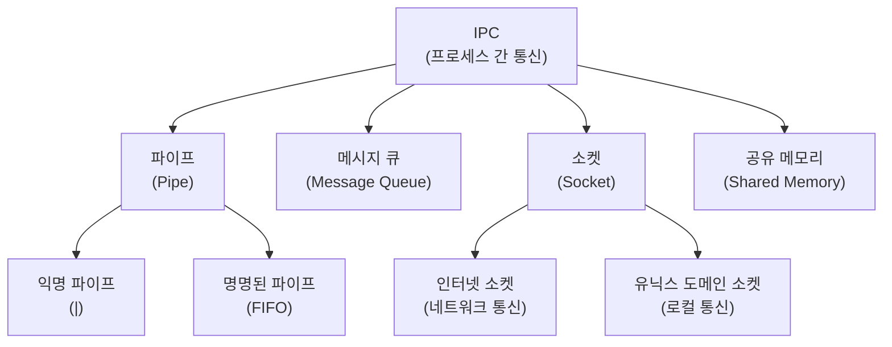

---

## 6.2 파이프 (Pipe)

**파이프**는 두 프로세스 간 데이터를 단방향으로 전송하는 IPC 메커니즘임.

- **익명 파이프 (Anonymous Pipe)**: `|` 기호. 부모-자식 관계의 프로세스 간에만 사용. 이름 없음.
- **명명된 파이프 (Named Pipe, FIFO)**: 파일 시스템에 이름을 가진 특수 파일로 존재. 관계 없는 프로세스도 사용 가능.

```bash
# 익명 파이프
cat /etc/passwd | grep bash | wc -l

# 명명된 파이프 생성과 사용
mkfifo mypipe
cat /etc/passwd > mypipe &   # 한 터미널에서 쓰기
grep bash < mypipe           # 다른 터미널에서 읽기
```

---

## 6.3 메시지 큐 (Message Queue)

메시지를 **FIFO(First-In First-Out)** 방식으로 큐에 넣고 꺼내는 방식. 비동기 통신이 가능하고, 커널이 큐를 관리함.

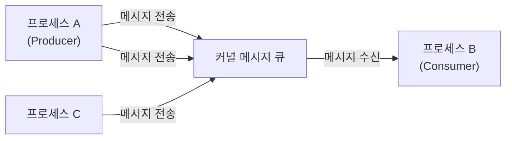

---

## 6.4 소켓 (Socket)

**소켓**은 네트워크나 로컬 시스템에서 프로세스 간 통신의 끝점(endpoint)임.

| 소켓 종류 | 사용 범위 | 예시 |
|---|---|---|
| 인터넷 소켓 | 네트워크를 통한 원격 통신 | TCP/IP 소켓, HTTP 서버 |
| 유닉스 도메인 소켓 | 같은 시스템 내 로컬 통신 | `/var/run/docker.sock`, MySQL 로컬 접속 |

---

## 6.5 공유 메모리 (Shared Memory)

여러 프로세스가 **같은 메모리 영역을 직접 공유**하는 방식. 속도가 가장 빠른 IPC 방법이지만, 동기화(뮤텍스, 세마포어 등)를 직접 구현해야 함.

---

# 7. 시그널 (Signal)

---

## 7.1 시그널이란

**시그널(Signal)**은 프로세스에게 **어떤 이벤트가 발생했음을 알리는 소프트웨어 인터럽트**임. 커널, 다른 프로세스, 또는 프로세스 자신이 발송할 수 있음.

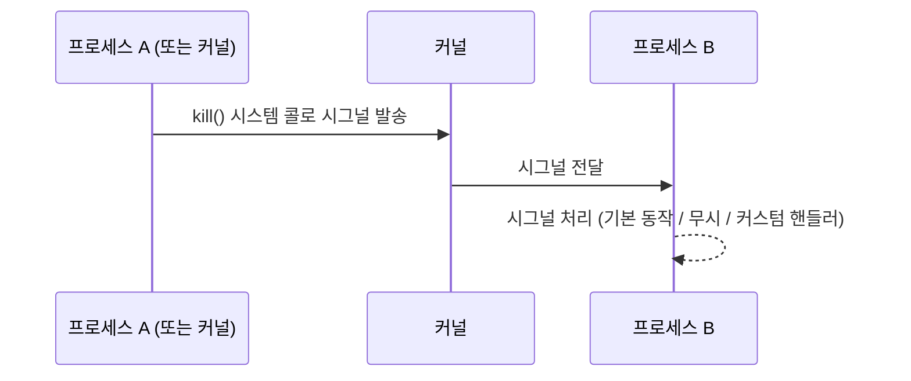

---

## 7.2 주요 시그널 목록

시그널 이름은 `SIG` 접두어 + 의미 단어 형식임. 번호는 1~64의 정수.

| 번호 | 시그널 이름 | 의미 | 기본 동작 |
|---|---|---|---|
| **1** | **SIGHUP** | 터미널 연결 끊김 (Hang Up) | 종료 (또는 재시작) |
| **2** | **SIGINT** | 키보드 인터럽트 (Ctrl+C) | 종료 |
| **3** | SIGQUIT | 종료 + 코어 덤프 (Ctrl+\) | 코어 덤프 후 종료 |
| **9** | **SIGKILL** | 강제 종료 (무시/차단 불가) | 즉시 종료 |
| **15** | **SIGTERM** | 정상 종료 요청 (kill 기본값) | 종료 |
| **17** | SIGCHLD | 자식 프로세스 상태 변화 | 무시 |
| **18** | SIGCONT | 중단된 프로세스 재개 | 재개 |
| **19** | SIGSTOP | 강제 중단 (무시/차단 불가) | 중단 |
| **20** | SIGTSTP | 키보드 중단 (Ctrl+Z) | 중단 |

> SIGKILL(9)와 SIGSTOP(19)는 **절대 무시하거나 차단할 수 없음**. 프로세스가 반드시 처리해야 함. 나머지는 프로세스가 무시하거나 커스텀 핸들러를 등록할 수 있음.
{: .prompt-danger }

---

## 7.3 시그널 처리 방법

프로세스가 시그널을 받았을 때 취할 수 있는 3가지 행동:

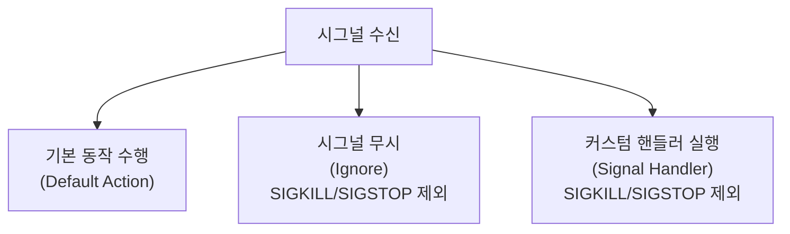

| 처리 방법 | 설명 | 예시 |
|---|---|---|
| 기본 동작 | 시그널별로 정의된 기본 처리 | SIGTERM → 프로세스 종료 |
| 무시 | 시그널을 받아도 아무 것도 하지 않음 | `trap "" SIGINT` |
| 커스텀 핸들러 | 개발자가 정의한 함수로 처리 | 정리 작업 후 종료 |

---

## 7.4 kill 명령어 — 시그널 전송

`kill`은 프로세스를 **종료**하는 것이 아니라, **지정한 프로세스에 시그널을 전송**하는 명령어임. 이름과 달리 다양한 시그널을 보낼 수 있음.

```bash
# 기본 (SIGTERM=15 전송)
kill 1234
kill -TERM 1234
kill -SIGTERM 1234
kill -15 1234

# 강제 종료 (SIGKILL=9 전송)
kill -9 1234
kill -KILL 1234

# 작업 번호로 (백그라운드 프로세스)
kill %1           # jobs 목록의 1번 작업에 SIGTERM
kill %2

# 시그널 목록 확인
kill -l
```

**시그널 전송 유형 5가지 (형식 암기):**

```bash
kill -TERM  12345   # 유형 ①: 시그널 이름 축약형
kill -SIGTERM 12345 # 유형 ②: 전체 시그널 이름
kill -s SIGTERM 12345  # 유형 ③: -s 옵션
kill --signal SIGTERM 12345  # 유형 ④: --signal 옵션
kill -9 12345       # 유형 ⑤: 시그널 번호
```

---

## 7.5 killall 명령어 — 프로세스 이름으로 종료

`kill`이 PID를 인자로 받는다면, `killall`은 **프로세스 이름**으로 시그널을 보냄.

```bash
killall nginx            # nginx 라는 이름의 모든 프로세스 종료
killall -9 firefox       # 강제 종료
killall -u alice         # alice 사용자의 모든 프로세스 종료
killall -s SIGHUP nginx  # nginx 설정 파일 리로드 (SIGHUP)
```

> `killall`은 이름이 일치하는 **모든** 프로세스에 시그널을 보내므로 주의해야 함. `pkill`과 유사하지만 `pkill`은 정규표현식을 지원함.
{: .prompt-warning }

---

## 7.6 시그널 번호 순서 정리 (시험 빈출)

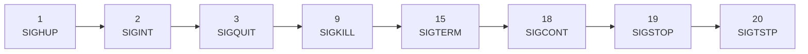

시험에서 시그널을 번호 순으로 정렬하거나, 특정 번호에 해당하는 이름을 묻는 문제가 자주 나옴.

---

# 핵심 요약

```mermaid
mindmap
    root((프로세스·시그널))
        프로세스 기초
            fork/exec으로 생성
            init/systemd PID=1
            좀비(Z) / 고아
        상태 관리
            R/S/D/T/Z
            nice NI값 -20~19
            ps/top/pstree
        포·백그라운드
            Ctrl+C SIGINT 종료
            Ctrl+Z SIGTSTP 중지
            &로 백그라운드 실행
            jobs/fg/bg
        IPC
            파이프 단방향
            소켓 양방향
            공유메모리 최고속도
        시그널
            SIGHUP 1
            SIGINT 2
            SIGKILL 9 무시불가
            SIGTERM 15 기본값
            SIGSTOP 19 무시불가
            kill PID기반
            killall 이름기반
```

| 구분 | 명령어 | 핵심 |
|---|---|---|
| 프로세스 확인 | `ps aux`, `top`, `pstree` | STAT 코드 R/S/D/T/Z |
| 우선순위 | `nice`, `renice` | NI 범위 -20~19, 낮을수록 우선 |
| 포/백그라운드 | `&`, `Ctrl+Z`, `fg`, `bg`, `jobs` | Ctrl+Z=중지, Ctrl+C=종료 |
| 시그널 전송 | `kill`, `killall` | kill=PID, killall=이름 |
| IPC | `|`, `mkfifo`, socket | 파이프=단방향, 소켓=양방향 |

> 다음 파일(5-2)에서 이 내용을 직접 실습하면서 확인함.
{: .prompt-info }
