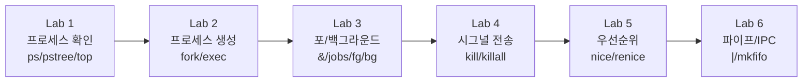
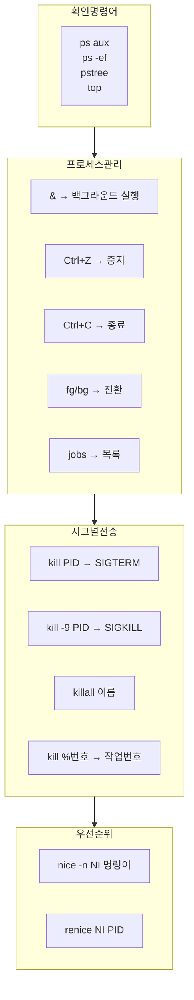

## 실습 개요

이론에서 배운 내용을 **터미널에서 직접 실행**하며 결과를 확인함. 각 실습마다 **예상 출력**을 함께 제공하므로 실제 출력과 비교할 것.



> 아래 실습은 일반 사용자 계정으로 진행해도 되지만, 일부 명령(renice 음수, kill 타인 프로세스)은 root 권한이 필요함.
{: .prompt-info }

---

# Lab 1. 프로세스 확인

---

## Lab 1-1. ps 기본 실습

### 실습 1-1-1: 현재 터미널 프로세스만 확인

```bash
ps
```

**예상 출력:**
```
  PID TTY          TIME CMD
 1234 pts/0    00:00:00 bash
 1890 pts/0    00:00:00 ps
```

자신이 사용 중인 bash와 ps 명령 자신만 보임.

---

### 실습 1-1-2: 모든 프로세스 확인 (BSD 스타일)

```bash
ps aux | head -20
```

**예상 출력 (일부):**
```
USER         PID %CPU %MEM    VSZ   RSS TTY      STAT START   TIME COMMAND
root           1  0.0  0.1 166568 11348 ?        Ss   08:00   0:01 /sbin/init
root           2  0.0  0.0      0     0 ?        S    08:00   0:00 [kthreadd]
root         ...
user        1234  0.0  0.2  11348  5892 pts/0    Ss   14:00   0:00 -bash
```

---

### 실습 1-1-3: STAT 코드 확인 실습

```bash
# 실행 중 프로세스 (R 상태)
yes > /dev/null &        # 무한 반복 출력 → 백그라운드로
ps aux | grep yes
kill %1                  # 정리

# 수면 중 프로세스 (S 상태)
sleep 100 &
ps aux | grep sleep      # STAT: S 확인
kill %1
```

**예상 출력 (yes 실행 직후):**
```
user      2345  99.9  0.0   5668   668 pts/0    R    14:05   0:03 yes
```

> `yes > /dev/null &` 는 CPU를 최대한 사용하는 부하 테스트 방법임. STAT이 **R**로 표시되어야 함.
{: .prompt-info }

---

### 실습 1-1-4: UNIX 스타일 ps와 트리 출력

```bash
ps -ef | head -20
ps -ef --forest | head -30
```

`--forest` 옵션으로 부모-자식 관계를 ASCII 트리로 시각화할 수 있음.

---

### 실습 1-1-5: 특정 사용자의 프로세스만 필터링

```bash
ps aux | grep "^$(whoami)"       # 현재 사용자 프로세스만
ps -u root | head -20            # root 프로세스만
ps aux | grep bash               # bash 프로세스 찾기
```

---

## Lab 1-2. pstree 실습

```bash
pstree              # 프로세스 트리 전체
pstree -p           # PID 포함
pstree -p $$        # 현재 셸($$)의 트리만
pstree $(pgrep sshd | head -1) 2>/dev/null || pstree -p | head -30
```

**예상 출력 (일부):**
```
systemd─┬─accounts-daemon───2*[{accounts-daemon}]
        ├─cron
        ├─sshd───sshd───sshd───bash───pstree
        └─...
```

> `$$` 는 현재 bash의 PID를 나타내는 특수 변수임. `echo $$` 로 현재 셸의 PID를 바로 확인할 수 있음.
{: .prompt-tip }

---

## Lab 1-3. top 실습

```bash
top
```

`top` 실행 후 아래 키를 차례로 눌러 기능을 확인:
- `M` : 메모리 사용률 순으로 정렬
- `P` : CPU 사용률 순으로 정렬
- `k` : PID 입력 후 kill (Ctrl+C보다 섬세)
- `1` : CPU 코어별 사용률 표시
- `q` : 종료

---

# Lab 2. 프로세스 생성과 종료

---

## Lab 2-1. sleep으로 프로세스 생성·확인·종료

```bash
# 터미널 1에서 실행
sleep 300 &
sleep 400 &
sleep 500 &

# 현재 세션 작업 목록
jobs
```

**예상 출력:**
```
[1]   Running                 sleep 300 &
[2]-  Running                 sleep 400 &
[3]+  Running                 sleep 500 &
```

```bash
# PID 확인
ps aux | grep sleep
```

**예상 출력 (일부):**
```
user      2001  0.0  0.0   7236   584 pts/0    S    14:10   0:00 sleep 300
user      2002  0.0  0.0   7236   584 pts/0    S    14:10   0:00 sleep 400
user      2003  0.0  0.0   7236   584 pts/0    S    14:10   0:00 sleep 500
```

```bash
# PID로 종료
kill 2001             # SIGTERM 전송
kill -9 2002          # SIGKILL 강제 종료
killall sleep         # 이름으로 모두 종료

# 정리 확인
jobs
```

---

## Lab 2-2. 좀비 프로세스 확인

```bash
# 좀비 프로세스 의도적으로 만들기 (bash 스크립트)
cat > /tmp/make_zombie.sh << 'EOF'
#!/bin/bash
# 자식 프로세스를 생성하고 wait()를 호출하지 않는 예시
(sleep 0) &          # 즉시 종료되는 자식 생성
CPID=$!
echo "자식 PID: $CPID"
echo "10초 동안 기다림... 다른 터미널에서 ps aux | grep Z 실행"
sleep 10
echo "부모 프로세스 종료 (자식은 이미 좀비 상태)"
EOF
chmod +x /tmp/make_zombie.sh
bash /tmp/make_zombie.sh
```

별도의 터미널에서:
```bash
# 좀비 확인 (스크립트 실행 중일 때)
ps aux | awk '$8 == "Z" {print $0}'
ps -eo stat,ppid,pid,cmd | grep -E "^Z"
```

> 실제로 좀비 프로세스를 만들려면 `sleep 0` 이 종료된 직후 부모가 `wait()` 를 호출하지 않는 시간 동안 확인해야 하므로, 타이밍이 맞지 않으면 보이지 않을 수 있음. 이 실습의 목적은 확인 명령어를 익히는 것임.
{: .prompt-warning }

---

# Lab 3. 포어그라운드와 백그라운드 전환

---

## Lab 3-1. 포어그라운드 실행과 Ctrl+C

```bash
# ping을 포어그라운드로 실행
ping 127.0.0.1
```

`Ctrl+C` 를 눌러 종료. 아래 출력이 나타남:

**예상 출력 (종료 시):**
```
--- 127.0.0.1 ping statistics ---
5 packets transmitted, 5 received, 0% packet loss
```

---

## Lab 3-2. 백그라운드 실행과 jobs

```bash
# & 로 백그라운드 시작
ping -c 100 127.0.0.1 > /tmp/ping_result.txt 2>&1 &
sleep 200 &
sleep 300 &

# 목록 확인
jobs -l
```

**예상 출력:**
```
[1]   2101 Running    ping -c 100 127.0.0.1 > /tmp/ping_result.txt 2>&1 &
[2]-  2102 Running    sleep 200 &
[3]+  2103 Running    sleep 300 &
```

---

## Lab 3-3. Ctrl+Z로 중단 후 bg로 재개

```bash
# 포어그라운드로 실행
sleep 600
```

`Ctrl+Z` 를 누름.

**예상 출력:**
```
^Z
[4]+  Stopped                 sleep 600
```

```bash
# 중단 확인
jobs
```

**예상 출력:**
```
[4]+  Stopped                 sleep 600
```

```bash
# 백그라운드로 재개
bg %4

# 확인
jobs
```

**예상 출력:**
```
[4]+  Running                 sleep 600 &
```

---

## Lab 3-4. fg로 포어그라운드 전환

```bash
# 백그라운드에서 포어그라운드로 전환
fg %1      # 1번 작업을 포어그라운드로

# 포어그라운드에서 Ctrl+C 로 종료
```

---

## Lab 3-5. nohup 실습

```bash
# 간단한 반복 스크립트 작성
cat > /tmp/count.sh << 'EOF'
#!/bin/bash
for i in $(seq 1 60); do
    echo "$(date): count=$i" >> /tmp/count.log
    sleep 1
done
echo "완료" >> /tmp/count.log
EOF
chmod +x /tmp/count.sh

# nohup으로 실행
nohup /tmp/count.sh &
echo "PID: $!"

# 로그 실시간 확인
tail -f /tmp/count.log
```

`Ctrl+C` 로 `tail` 을 종료해도 `/tmp/count.sh` 는 계속 실행됨.

```bash
# 실행 중인지 확인
ps aux | grep count.sh
cat /tmp/count.log | tail -5
```

```bash
# 정리
pkill -f count.sh
rm /tmp/count.sh /tmp/count.log
```

---

# Lab 4. 시그널 전송

---

## Lab 4-1. kill로 시그널 전송

```bash
# 실습용 프로세스 생성
sleep 1000 &
MYPID=$!
echo "PID: $MYPID"

# 시그널 목록 확인
kill -l
```

**예상 출력 (kill -l):**
```
 1) SIGHUP	 2) SIGINT	 3) SIGQUIT	 4) SIGILL	 5) SIGTRAP
 6) SIGABRT	 7) SIGBUS	 8) SIGFPE	 9) SIGKILL	10) SIGUSR1
11) SIGSEGV	12) SIGUSR2	13) SIGPIPE	14) SIGALRM	15) SIGTERM
16) SIGSTKFLT	17) SIGCHLD	18) SIGCONT	19) SIGSTOP	20) SIGTSTP
...
```

```bash
# 5가지 형식으로 SIGTERM 전송 (결과 동일)
sleep 1000 & MYPID=$!
kill -TERM $MYPID        # 형식 1
sleep 1000 & MYPID=$!
kill -SIGTERM $MYPID     # 형식 2
sleep 1000 & MYPID=$!
kill -s SIGTERM $MYPID   # 형식 3
sleep 1000 & MYPID=$!
kill --signal SIGTERM $MYPID  # 형식 4
sleep 1000 & MYPID=$!
kill -15 $MYPID          # 형식 5
```

---

## Lab 4-2. SIGKILL vs SIGTERM 차이 확인

```bash
# SIGTERM: 프로세스가 정리 후 종료 (프로세스가 무시할 수도 있음)
sleep 500 &
PID1=$!
kill -15 $PID1
sleep 0.5
ps aux | grep "sleep 500"   # 종료 확인

# SIGKILL: 즉시 강제 종료 (무시 불가)
sleep 500 &
PID2=$!
kill -9 $PID2
sleep 0.1
ps aux | grep "sleep 500"   # 즉시 사라짐
```

---

## Lab 4-3. SIGSTOP과 SIGCONT

```bash
# 프로세스 중단과 재개
sleep 500 &
MYPID=$!

# 중단
kill -SIGSTOP $MYPID
jobs           # Stopped 상태 확인

# 재개
kill -SIGCONT $MYPID
jobs           # Running 상태 확인

kill $MYPID    # 정리
```

**예상 출력 (SIGSTOP 후):**
```
[1]+  Stopped                 sleep 500
```

**예상 출력 (SIGCONT 후):**
```
[1]+  Running                 sleep 500 &
```

---

## Lab 4-4. 작업 번호(%)로 kill

```bash
# 여러 프로세스 생성
sleep 100 &
sleep 200 &
sleep 300 &

jobs
# [1]   Running   sleep 100 &
# [2]-  Running   sleep 200 &
# [3]+  Running   sleep 300 &

# 작업 번호로 kill
kill %2        # 2번 작업 종료
jobs
# [2] 가 Terminated 후 사라짐

# 모두 정리
kill %1 %3
jobs
```

---

## Lab 4-5. killall 실습

```bash
# 여러 sleep 프로세스 생성
sleep 100 &
sleep 200 &
sleep 300 &

ps aux | grep sleep

# 프로세스 이름으로 한꺼번에 종료
killall sleep

# 확인
ps aux | grep sleep
# → sleep 프로세스가 모두 사라짐
```

---

## Lab 4-6. SIGHUP으로 설정 리로드 (데몬 패턴)

```bash
# 로그를 계속 쓰는 모의 데몬 생성
cat > /tmp/daemon.sh << 'EOF'
#!/bin/bash
trap 'echo "$(date): SIGHUP 수신 - 설정 리로드" >> /tmp/daemon.log' SIGHUP
trap 'echo "$(date): 종료" >> /tmp/daemon.log; exit 0' SIGTERM

echo "$(date): 데몬 시작 PID=$$" >> /tmp/daemon.log

while true; do
    echo "$(date): 동작 중..." >> /tmp/daemon.log
    sleep 3
done
EOF
chmod +x /tmp/daemon.sh

nohup /tmp/daemon.sh &
DAEMON_PID=$!
echo "데몬 PID: $DAEMON_PID"
sleep 2

# SIGHUP 전송 (설정 리로드 시뮬레이션)
kill -SIGHUP $DAEMON_PID
sleep 1

# 로그 확인
cat /tmp/daemon.log

# 정리
kill -SIGTERM $DAEMON_PID
sleep 1
cat /tmp/daemon.log   # 종료 메시지 확인
rm /tmp/daemon.sh /tmp/daemon.log
```

**예상 출력 (로그):**
```
2026-03-07 14:30:00: 데몬 시작 PID=3456
2026-03-07 14:30:00: 동작 중...
2026-03-07 14:30:03: 동작 중...
2026-03-07 14:30:05: SIGHUP 수신 - 설정 리로드
2026-03-07 14:30:06: 동작 중...
2026-03-07 14:30:08: 종료
```

> `trap` 명령은 Bash에서 시그널을 받았을 때 실행할 명령을 등록함. 실제 nginx, apache 같은 데몬들이 `kill -HUP` 을 받으면 설정을 리로드하는 원리를 직접 구현한 예시임.
{: .prompt-tip }

---

# Lab 5. 프로세스 우선순위 (nice/renice)

---

## Lab 5-1. nice 값 확인

```bash
# 현재 프로세스 NI 값 확인
ps aux | grep bash | grep -v grep
# NI 열 확인 (기본값 0)

# nice 값을 포함한 출력
ps -eo pid,ni,comm | grep bash
```

---

## Lab 5-2. nice로 시작 시 우선순위 지정

```bash
# NI=10으로 낮은 우선순위로 실행
nice -n 10 sleep 1000 &
PID=$!

ps -eo pid,ni,comm | grep sleep
```

**예상 출력:**
```
 3789 10 sleep
```

```bash
kill $PID

# NI=15 (더 낮은 우선순위)
nice -n 15 sleep 1000 &
PID=$!
ps -eo pid,ni,comm | grep sleep

kill $PID
```

---

## Lab 5-3. renice로 실행 중인 프로세스 변경

```bash
# 기본 우선순위로 실행
sleep 1000 &
MYPID=$!

ps -eo pid,ni,comm | grep "sleep 1000"
# 예상 출력: MYPID  0  sleep

# NI 값을 10으로 올림 (우선순위 낮춤)
renice 10 $MYPID

# 변경 확인
ps -eo pid,ni,comm | grep "sleep 1000"
# 예상 출력: MYPID  10  sleep

# NI 값을 5로 내리기 시도 (일반 사용자는 한번 올린 NI를 낮추지 못함)
renice 5 $MYPID
# 오류: Permission denied (root가 아닌 경우)

kill $MYPID
```

> 일반 사용자는 NI 값을 **올리는 것만** 가능함. 올렸다가 다시 내리는 것도 root만 가능함. 이 점이 시험에 자주 출제됨.
{: .prompt-warning }

---

## Lab 5-4. CPU 부하 비교 (nice 효과 관찰)

```bash
# 두 프로세스를 다른 우선순위로 실행
nice -n 19 yes > /dev/null &  # 최저 우선순위
PID_LOW=$!
yes > /dev/null &              # 기본 우선순위
PID_HIGH=$!

# top으로 CPU 사용률 비교
top -b -n 3 -p $PID_LOW,$PID_HIGH 2>/dev/null | grep -E "PID|$PID_LOW|$PID_HIGH"

kill $PID_LOW $PID_HIGH
```

**예상 출력 (NI 값 차이로 CPU 배분이 다름):**
```
  PID  NI  %CPU  COMMAND
 3001  19   8.3  yes
 3002   0  91.7  yes
```

---

# Lab 6. 파이프와 IPC

---

## Lab 6-1. 익명 파이프 심화 실습

```bash
# 파이프 체인으로 시스템 사용자 통계
cat /etc/passwd | \
  cut -d: -f7 | \
  sort | \
  uniq -c | \
  sort -rn

# 예상 출력 예시:
# 20 /usr/sbin/nologin
#  3 /bin/bash
#  1 /bin/sh
#  1 /usr/bin/false
```

---

## Lab 6-2. 명명된 파이프 (FIFO) 실습

```bash
# FIFO 파일 생성
mkfifo /tmp/myfifo
ls -l /tmp/myfifo   # prw-r--r-- (p = 파이프 타입)
```

**터미널 1** (읽는 쪽):
```bash
cat < /tmp/myfifo   # 데이터가 올 때까지 블로킹
```

**터미널 2** (쓰는 쪽):
```bash
echo "안녕하세요 FIFO!" > /tmp/myfifo
echo "두 번째 메시지" > /tmp/myfifo
```

터미널 1에 결과가 나타남:
```
안녕하세요 FIFO!
두 번째 메시지
```

```bash
# 정리
rm /tmp/myfifo
```

---

## Lab 6-3. 파일 디스크립터 리다이렉션 심화

```bash
# stdout(1)과 stderr(2) 분리
find / -name "*.conf" > /tmp/found.txt 2> /tmp/errors.txt
wc -l /tmp/found.txt /tmp/errors.txt

# stdout과 stderr를 하나의 파일로
find / -name "*.conf" > /tmp/all_output.txt 2>&1
wc -l /tmp/all_output.txt

# /dev/null로 출력 버리기 (에러 메시지 숨김)
find / -name "*.conf" 2>/dev/null | head -10

# 정리
rm /tmp/found.txt /tmp/errors.txt /tmp/all_output.txt
```

---

## Lab 6-4. ping으로 네트워크 확인

```bash
# 기본 ping
ping -c 4 127.0.0.1
```

**예상 출력:**
```
PING 127.0.0.1 (127.0.0.1) 56(84) bytes of data.
64 bytes from 127.0.0.1: icmp_seq=1 ttl=64 time=0.033 ms
64 bytes from 127.0.0.1: icmp_seq=2 ttl=64 time=0.045 ms
64 bytes from 127.0.0.1: icmp_seq=3 ttl=64 time=0.042 ms
64 bytes from 127.0.0.1: icmp_seq=4 ttl=64 time=0.038 ms

--- 127.0.0.1 ping statistics ---
4 packets transmitted, 4 received, 0% packet loss, time 3068ms
rtt min/avg/max/mdev = 0.033/0.039/0.045/0.005 ms
```

```bash
# 백그라운드로 ping 실행하며 로그 저장
ping -c 10 8.8.8.8 > /tmp/ping.log 2>&1 &
PID=$!
echo "ping PID: $PID"
wait $PID       # ping 완료까지 대기
cat /tmp/ping.log | tail -3
rm /tmp/ping.log
```

---

# Lab 7. 종합 실습 — 프로세스 모니터링 스크립트

```bash
cat > /tmp/proc_monitor.sh << 'EOF'
#!/bin/bash

echo "=============================="
echo " 시스템 프로세스 현황 보고서"
echo " $(date)"
echo "=============================="
echo ""

echo "[1] 총 프로세스 수"
ps aux | wc -l
echo ""

echo "[2] CPU 사용률 TOP 5"
ps aux --sort=-%cpu | head -6 | awk '{printf "%-10s %-8s %-8s %s\n", $1, $2, $3, $11}'
echo ""

echo "[3] 메모리 사용률 TOP 5"
ps aux --sort=-%mem | head -6 | awk '{printf "%-10s %-8s %-8s %s\n", $1, $2, $4, $11}'
echo ""

echo "[4] 좀비 프로세스 확인"
ZOMBIES=$(ps aux | awk '$8 == "Z"' | wc -l)
if [ $ZOMBIES -eq 0 ]; then
    echo "좀비 프로세스 없음"
else
    echo "경고: 좀비 프로세스 $ZOMBIES 개 발견!"
    ps aux | awk '$8 == "Z"'
fi
echo ""

echo "[5] 현재 사용자 프로세스"
ps aux | grep "^$(whoami)" | grep -v grep | wc -l
echo "개의 프로세스 실행 중"
echo ""

echo "[6] init/systemd 확인 (PID 1)"
ps -p 1 -o pid,comm,stat
EOF

chmod +x /tmp/proc_monitor.sh
bash /tmp/proc_monitor.sh
```

**예상 출력 (환경에 따라 다름):**
```
==============================
 시스템 프로세스 현황 보고서
 Sat Mar  7 14:30:00 KST 2026
==============================

[1] 총 프로세스 수
128

[2] CPU 사용률 TOP 5
USER       PID      %CPU     COMMAND
root       1234     12.3     /usr/bin/python3
user       5678     8.1      yes
...

[3] 메모리 사용률 TOP 5
...

[4] 좀비 프로세스 확인
좀비 프로세스 없음

[5] 현재 사용자 프로세스
15
개의 프로세스 실행 중

[6] init/systemd 확인 (PID 1)
  PID COMM             STAT
    1 systemd          Ss
```

```bash
# 정리
rm /tmp/proc_monitor.sh
```

---

# 실습 마무리 요약



| 명령어 | 핵심 사용법 | 비고 |
|---|---|---|
| `ps aux` | 모든 프로세스 | STAT: R/S/D/T/Z |
| `pstree -p` | 트리+PID | 부모-자식 관계 시각화 |
| `top` | 실시간 모니터링 | k=kill, r=renice |
| `jobs -l` | 현재 세션 작업 | PID 포함 |
| `kill -9 PID` | 강제 종료 | 무시 불가 |
| `kill %N` | 작업번호로 종료 | jobs 번호 기준 |
| `killall 이름` | 이름으로 일괄 종료 | 주의: 전부 종료됨 |
| `nice -n N` | 시작 시 우선순위 | 일반 사용자: 0~19만 |
| `renice N PID` | 실행 중 변경 | 일반 사용자: 올리기만 |
| `nohup cmd &` | 세션 종료 후에도 실행 | SIGHUP 무시 |
| `mkfifo` | 명명된 파이프 생성 | ls: prw (p타입) |
